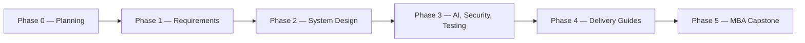
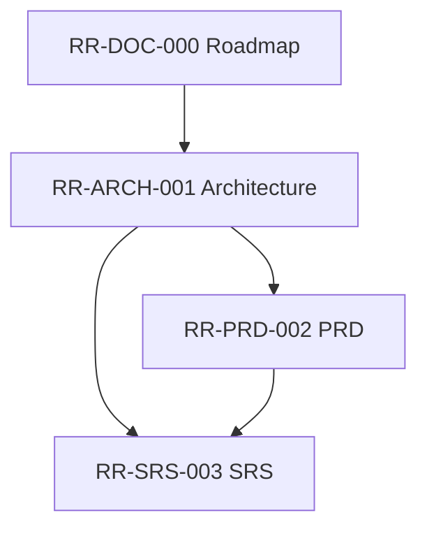
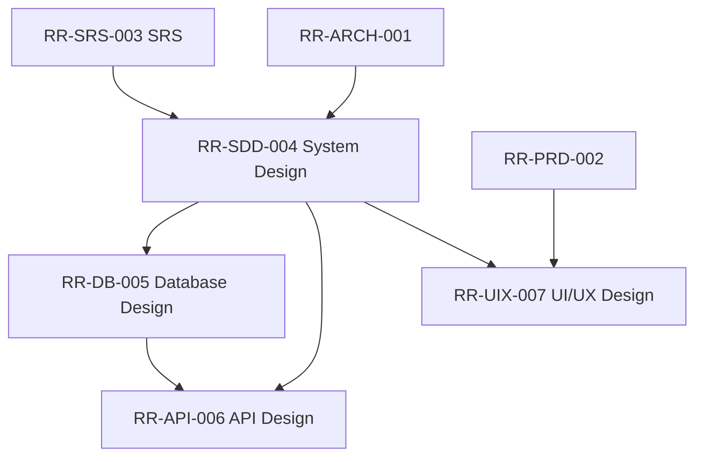
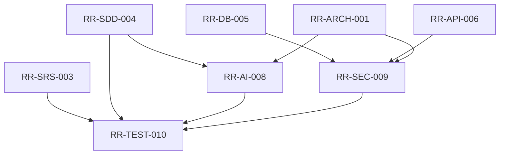
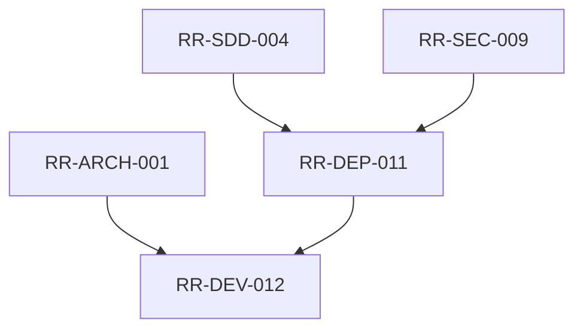
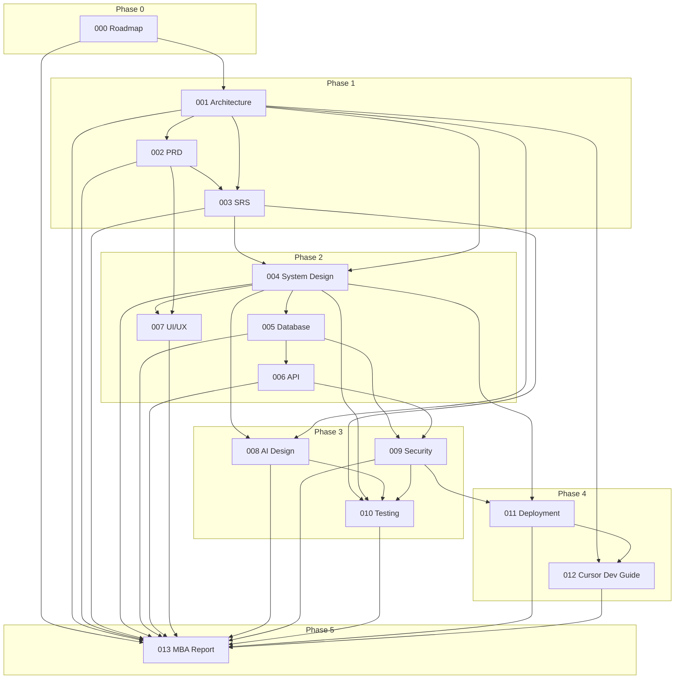

# ResumeRank AI

## Documentation Roadmap

| Field | Value |
| --- | --- |
| **Document Title** | Documentation Roadmap |
| **Project Name** | ResumeRank AI |
| **Document ID** | RR-DOC-000 |
| **Version** | 1.0.0 |
| **Status** | Active |
| **Date** | 11 July 2026 |
| **Author** | Vish Var |
| **Purpose of This File** | Plan and sequence every project document — not a substitute for those documents |

---

## 1. Purpose of This Roadmap

This roadmap defines **every documentation artifact** that will be produced for ResumeRank AI across requirements, design, AI/security/testing, deployment, developer enablement, and the Final MBA Report.

It does **not** contain the documents themselves. Each document will be authored separately, in order, after explicit go-ahead.

### Working Rules

| Rule | Description |
| --- | --- |
| One at a time | Only one document is authored per cycle |
| Complete before next | A document must be finished before the next begins |
| Traceability | Each document references prior approved documents |
| No placeholders | Avoid generic or empty sections |
| Dual audience | Academic evaluators and development implementers |

### Page Count Convention

Approximate page counts assume professional markdown rendered to A4/Letter (tables + Mermaid diagrams included). Counts are planning estimates, not hard limits.

| Size Band | Approx. Pages | Typical Use |
| --- | --- | --- |
| Short | 8–15 | Focused guides |
| Medium | 16–30 | Core design/requirements |
| Long | 31–50 | Broad system or test suites |
| Capstone | 50–80+ | Final MBA Report |

---

## 2. Phase Overview



| Phase | Focus | Documents | Development Use |
| --- | --- | --- | --- |
| 0 | Documentation planning | 1 (this roadmap) | Indirect — sequencing only |
| 1 | What to build and why | 3 | Yes — scope baseline |
| 2 | How the system is designed | 4 | Yes — primary build input |
| 3 | AI, security, quality | 3 | Yes — implementation & QA |
| 4 | Ship and develop | 2 | Yes — deploy & coding workflow |
| 5 | Academic synthesis | 1 | Indirect — cites all prior work |

**Total planned documents: 14** (1 roadmap + 13 project documents).

---

## 3. Master Document Register

| # | Document | ID | Phase | Approx. Pages | Used by Development? |
| --- | --- | --- | --- | --- | --- |
| 0 | Documentation Roadmap | RR-DOC-000 | 0 | 8–12 | Indirect |
| 1 | Project Architecture | RR-ARCH-001 | 1 | 18–25 | Yes |
| 2 | Product Requirements Document | RR-PRD-002 | 1 | 20–30 | Yes |
| 3 | Software Requirements Specification | RR-SRS-003 | 1 | 25–40 | Yes |
| 4 | System Design Document | RR-SDD-004 | 2 | 25–40 | Yes |
| 5 | Database Design Document | RR-DB-005 | 2 | 18–28 | Yes |
| 6 | API Design Specification | RR-API-006 | 2 | 18–30 | Yes |
| 7 | UI/UX Design Document | RR-UIX-007 | 2 | 20–32 | Yes |
| 8 | AI Design Document | RR-AI-008 | 3 | 20–35 | Yes |
| 9 | Security Design | RR-SEC-009 | 3 | 16–25 | Yes |
| 10 | Testing Document | RR-TEST-010 | 3 | 22–35 | Yes |
| 11 | Deployment Guide | RR-DEP-011 | 4 | 12–20 | Yes |
| 12 | Cursor Developer Guide | RR-DEV-012 | 4 | 12–18 | Yes |
| 13 | Final MBA Report | RR-MBA-013 | 5 | 50–80 | Indirect |

---

## 4. Phase 0 — Planning

### 4.1 Documentation Roadmap

| Attribute | Detail |
| --- | --- |
| **Document** | Documentation Roadmap |
| **ID** | RR-DOC-000 |
| **Path (planned)** | `docs/00-Documentation-Roadmap.md` |
| **Purpose** | Define the full documentation suite, sequencing, dependencies, page estimates, and which artifacts drive development versus academic delivery |
| **Approx. Pages** | 8–12 |
| **Dependencies** | Project brief / charter only |
| **When it should be created** | Immediately after project understanding is verified; **before** any further requirements or design documents |
| **Used by development?** | **Indirect** — developers use it to know which specs are authoritative and in what order; it does not specify features or APIs |
| **Status** | In progress (this file) |

---

## 5. Phase 1 — Requirements Documentation

Phase 1 freezes **problem, scope, objectives, and requirements**. Development may begin scaffolding only after PRD/SRS intent is clear; full feature build should wait for Phase 2 design inputs.



### 5.1 Project Architecture

| Attribute | Detail |
| --- | --- |
| **Document** | Project Architecture |
| **ID** | RR-ARCH-001 |
| **Path** | `docs/01-requirements/01-Project-Architecture.md` |
| **Purpose** | Establish system context, logical/physical architecture, technology rationale, AI placement, security boundaries, ADRs, and the baseline all later docs must respect |
| **Approx. Pages** | 18–25 |
| **Dependencies** | Project brief; Documentation Roadmap (RR-DOC-000) |
| **When it should be created** | First substantive project document; immediately after roadmap approval (or in parallel only if roadmap is already agreed) |
| **Used by development?** | **Yes** — defines stack, component boundaries, where Gemini runs, and deployment topology |
| **Status** | Complete (v1.0.0 exists) |

### 5.2 Product Requirements Document (PRD)

| Attribute | Detail |
| --- | --- |
| **Document** | Product Requirements Document |
| **ID** | RR-PRD-002 |
| **Path (planned)** | `docs/01-requirements/02-Product-Requirements-Document.md` |
| **Purpose** | Define business problem, goals, personas, user journeys, epics/features, prioritization (MoSCoW), success metrics, out-of-scope items, and product constraints for ResumeRank AI |
| **Approx. Pages** | 20–30 |
| **Dependencies** | RR-ARCH-001; confirmed product understanding (users, tenancy, v1 scope) |
| **When it should be created** | Phase 1, immediately after Architecture is accepted |
| **Used by development?** | **Yes** — primary source of *what* to build and priority order |
| **Status** | Not started — next document after this roadmap is accepted |

### 5.3 Software Requirements Specification (SRS)

| Attribute | Detail |
| --- | --- |
| **Document** | Software Requirements Specification |
| **ID** | RR-SRS-003 |
| **Path (planned)** | `docs/01-requirements/03-Software-Requirements-Specification.md` |
| **Purpose** | Specify functional and non-functional requirements in testable form (IEEE-style), including requirement IDs, use cases, data requirements, interface requirements, and acceptance criteria |
| **Approx. Pages** | 25–40 |
| **Dependencies** | RR-ARCH-001, RR-PRD-002 |
| **When it should be created** | Phase 1, after PRD is complete |
| **Used by development?** | **Yes** — binding functional/NFR checklist; also feeds Testing Document |
| **Status** | Not started |

---

## 6. Phase 2 — System Design

Phase 2 converts requirements into **buildable design**. This is the primary engineering input set.



### 6.1 System Design Document

| Attribute | Detail |
| --- | --- |
| **Document** | System Design Document |
| **ID** | RR-SDD-004 |
| **Path (planned)** | `docs/02-design/04-System-Design-Document.md` |
| **Purpose** | Detail modules, sequence flows, state models, error handling, processing pipelines (upload → parse → score → rank), and internal design of major components |
| **Approx. Pages** | 25–40 |
| **Dependencies** | RR-ARCH-001, RR-SRS-003 |
| **When it should be created** | Start of Phase 2, after SRS sign-off |
| **Used by development?** | **Yes** — core implementation blueprint |
| **Status** | Complete (v1.1.0) |

### 6.2 Database Design Document

| Attribute | Detail |
| --- | --- |
| **Document** | Database Design Document |
| **ID** | RR-DB-005 |
| **Path (planned)** | `docs/02-design/05-Database-Design-Document.md` |
| **Purpose** | Define conceptual/logical/physical schema, ERD, tables, keys, indexes, RLS strategy, storage bucket design, and migration approach for PostgreSQL/Supabase |
| **Approx. Pages** | 18–28 |
| **Dependencies** | RR-ARCH-001, RR-SDD-004 |
| **When it should be created** | Phase 2, after System Design |
| **Used by development?** | **Yes** — schema, migrations, and RLS implementation |
| **Status** | Complete (v1.1.0) |

### 6.3 API Design Specification

| Attribute | Detail |
| --- | --- |
| **Document** | API Design Specification |
| **ID** | RR-API-006 |
| **Path (planned)** | `docs/02-design/06-API-Design-Specification.md` |
| **Purpose** | Specify client–Supabase interactions, Edge Function contracts, request/response schemas, auth headers, error codes, and Gemini-facing internal API shapes |
| **Approx. Pages** | 18–30 |
| **Dependencies** | RR-SDD-004, RR-DB-005 |
| **When it should be created** | Phase 2, after Database Design |
| **Used by development?** | **Yes** — frontend/backend integration contract |
| **Status** | Complete (v1.1.0) |

### 6.4 UI/UX Design Document

| Attribute | Detail |
| --- | --- |
| **Document** | UI/UX Design Document |
| **ID** | RR-UIX-007 |
| **Path (planned)** | `docs/02-design/07-UI-UX-Design-Document.md` |
| **Purpose** | Define information architecture, user flows, wireframe descriptions, screen inventory, component usage (shadcn/ui), accessibility, and UX rules for HR workflows |
| **Approx. Pages** | 20–32 |
| **Dependencies** | RR-PRD-002, RR-SDD-004 |
| **When it should be created** | Phase 2, can proceed in parallel with API Design after System Design exists; finalize after PRD + SDD |
| **Used by development?** | **Yes** — screen build order and UX acceptance |
| **Status** | Complete (v1.1.0) |

---

## 7. Phase 3 — AI, Security, and Testing

Phase 3 specializes design for **AI behavior, hardening, and quality assurance**.



### 7.1 AI Design Document

| Attribute | Detail |
| --- | --- |
| **Document** | AI Design Document |
| **ID** | RR-AI-008 |
| **Path (planned)** | `docs/03-specialty/08-AI-Design-Document.md` |
| **Purpose** | Specify Gemini integration, prompt strategy, scoring rubric, summarization format, token/truncation policy, evaluation schema, failure/retry behavior, bias/limitation notes, and model configuration |
| **Approx. Pages** | 20–35 |
| **Dependencies** | RR-ARCH-001, RR-SDD-004 |
| **When it should be created** | Phase 3, after System Design (may start once SDD screening pipeline is stable) |
| **Used by development?** | **Yes** — implements screening engine and prompt/response handling |
| **Status** | Complete (v1.0.0) |

### 7.2 Security Design

| Attribute | Detail |
| --- | --- |
| **Document** | Security Design |
| **ID** | RR-SEC-009 |
| **Path (planned)** | `docs/03-specialty/09-Security-Design.md` |
| **Purpose** | Define threat model, authn/authz, RLS policies, secret management, storage controls, PII handling, audit logging, and secure deployment configuration |
| **Approx. Pages** | 16–25 |
| **Dependencies** | RR-ARCH-001, RR-DB-005, RR-API-006 |
| **When it should be created** | Phase 3, after Database and API designs |
| **Used by development?** | **Yes** — RLS, env secrets, bucket policies, auth gates |
| **Status** | Complete (v1.0.0) |

### 7.3 Testing Document

| Attribute | Detail |
| --- | --- |
| **Document** | Testing Document |
| **ID** | RR-TEST-010 |
| **Path (planned)** | `docs/03-specialty/10-Testing-Document.md` |
| **Purpose** | Define test strategy, levels (unit/integration/e2e), traceability to SRS, AI evaluation test cases, security test cases, acceptance tests, and defect severity model |
| **Approx. Pages** | 22–35 |
| **Dependencies** | RR-SRS-003, RR-SDD-004; preferably RR-AI-008 and RR-SEC-009 for specialized cases |
| **When it should be created** | End of Phase 3, after AI and Security designs (so AI/security tests are included) |
| **Used by development?** | **Yes** — QA plan, test cases, and Definition of Done |
| **Status** | Not started |

---

## 8. Phase 4 — Deployment and Developer Enablement

Phase 4 enables **shipping and day-to-day implementation** in Cursor.



### 8.1 Deployment Guide

| Attribute | Detail |
| --- | --- |
| **Document** | Deployment Guide |
| **ID** | RR-DEP-011 |
| **Path (planned)** | `docs/04-delivery/11-Deployment-Guide.md` |
| **Purpose** | Step-by-step setup for Supabase, Vercel, environment variables, migrations, storage buckets, Edge Functions, Gemini keys, and production checklist |
| **Approx. Pages** | 12–20 |
| **Dependencies** | RR-SDD-004, RR-SEC-009 (and practically RR-DB-005, RR-API-006) |
| **When it should be created** | Phase 4, after security design; ideally when first production-like deploy is attempted |
| **Used by development?** | **Yes** — required to run and ship the application |
| **Status** | Not started |

### 8.2 Cursor Developer Guide

| Attribute | Detail |
| --- | --- |
| **Document** | Cursor Developer Guide |
| **ID** | RR-DEV-012 |
| **Path (planned)** | `docs/04-delivery/12-Cursor-Developer-Guide.md` |
| **Purpose** | Explain repository structure, local workflow, coding conventions, how to implement features against the design docs, prompt/agent usage patterns for this repo, and contribution checklist |
| **Approx. Pages** | 12–18 |
| **Dependencies** | RR-ARCH-001, RR-DEP-011 |
| **When it should be created** | Phase 4, after Deployment Guide; before or at the start of intensive application coding |
| **Used by development?** | **Yes** — primary day-to-day developer playbook |
| **Status** | Not started |

---

## 9. Phase 5 — Final Academic Deliverable

### 9.1 Final MBA Report

| Attribute | Detail |
| --- | --- |
| **Document** | Final MBA Report |
| **ID** | RR-MBA-013 |
| **Path (planned)** | `docs/05-mba-report/13-Final-MBA-Report.md` |
| **Purpose** | Synthesize the full project for academic evaluation: problem statement, literature/context, methodology, system design, AI approach, implementation, results/demo evidence, limitations, conclusions, and references — aligned to MBA AI & Data Science expectations |
| **Approx. Pages** | 50–80 |
| **Dependencies** | **All prior documents** (RR-DOC-000 through RR-DEV-012) plus implemented system evidence |
| **When it should be created** | Phase 5, after documentation suite and a demonstrable application exist |
| **Used by development?** | **Indirect** — does not drive coding; may surface gaps that trigger fixes. Primary audience is academic evaluators |
| **Status** | Not started |

---

## 10. Cross-Phase Dependency Map



---

## 11. Recommended Creation Sequence (Strict Order)

| Step | When | Document ID | Document | Dev Impact |
| --- | --- | --- | --- | --- |
| 1 | Now | RR-DOC-000 | Documentation Roadmap | Sequencing |
| 2 | Done / baseline | RR-ARCH-001 | Project Architecture | Stack & boundaries |
| 3 | Next | RR-PRD-002 | Product Requirements Document | Scope & priorities |
| 4 | After PRD | RR-SRS-003 | Software Requirements Specification | Testable requirements |
| 5 | After SRS | RR-SDD-004 | System Design Document | Module design |
| 6 | After SDD | RR-DB-005 | Database Design Document | Schema & RLS |
| 7 | After DB | RR-API-006 | API Design Specification | Integration contracts |
| 8 | After SDD (+ PRD) | RR-UIX-007 | UI/UX Design Document | Screens & flows |
| 9 | After SDD | RR-AI-008 | AI Design Document | Gemini pipeline |
| 10 | After DB + API | RR-SEC-009 | Security Design | Hardening |
| 11 | After AI + Security | RR-TEST-010 | Testing Document | QA & acceptance |
| 12 | After Security | RR-DEP-011 | Deployment Guide | Ship/run |
| 13 | After Deployment | RR-DEV-012 | Cursor Developer Guide | Daily coding workflow |
| 14 | After app + all docs | RR-MBA-013 | Final MBA Report | Academic submission |

**Parallelism note:** RR-UIX-007 may be drafted alongside RR-API-006 after RR-SDD-004 exists, but neither should start before System Design. RR-AI-008 may start after SDD even if UI/UX is still finishing, provided screening pipeline design is stable.

---

## 12. Development Usage Summary

| Used directly by development | Used indirectly / academic-first |
| --- | --- |
| Architecture, PRD, SRS | Documentation Roadmap |
| System Design, Database, API, UI/UX | Final MBA Report |
| AI Design, Security, Testing | — |
| Deployment Guide, Cursor Developer Guide | — |

**Application coding** should treat Phase 2–4 documents as the implementation source of truth. Phase 1 defines scope; Phase 5 evaluates the whole.

---

## 13. Folder Structure (Planned)

```text
docs/
  00-Documentation-Roadmap.md
  README.md
  01-requirements/
    01-Project-Architecture.md
    02-Product-Requirements-Document.md
    03-Software-Requirements-Specification.md
  02-design/
    04-System-Design-Document.md
    05-Database-Design-Document.md
    06-API-Design-Specification.md
    07-UI-UX-Design-Document.md
  03-specialty/
    08-AI-Design-Document.md
    09-Security-Design.md
    10-Testing-Document.md
  04-delivery/
    11-Deployment-Guide.md
    12-Cursor-Developer-Guide.md
  05-mba-report/
    13-Final-MBA-Report.md
```

---

## 14. Future Scope of the Documentation Suite

| Enhancement | Description |
| --- | --- |
| Operations Runbook | Post-MBA ops procedures if the system is retained beyond the course |
| User Manual | End-user HR guide separate from technical design docs |
| Data Dictionary | Expanded standalone dictionary if schema grows significantly |
| Ethics / Bias Addendum | Deeper fairness evaluation if required by the academic panel |

These are **not** in the current mandatory 14-document set unless later requested.

---

## 15. References

1. Project brief — ResumeRank AI MBA Final Year Project (internal).
2. RR-ARCH-001 — Project Architecture Document v1.0.0.
3. IEEE Std 830 / modern SRS practice — requirements documentation structure (alignment).
4. ISO/IEC/IEEE 42010 — architecture description concepts (alignment).

---

## 16. Next Action

| Item | Value |
| --- | --- |
| **Awaiting** | Approval of this Documentation Roadmap |
| **Next document to author** | RR-PRD-002 — Product Requirements Document |
| **Explicitly not created in this step** | PRD, SRS, design docs, AI/security/testing docs, deployment guides, MBA report |

---

**End of Document — RR-DOC-000 — Documentation Roadmap v1.0.0**
