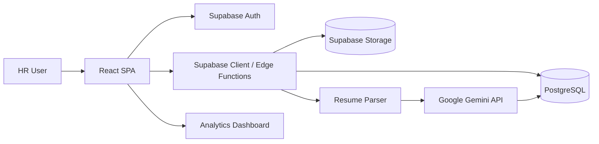
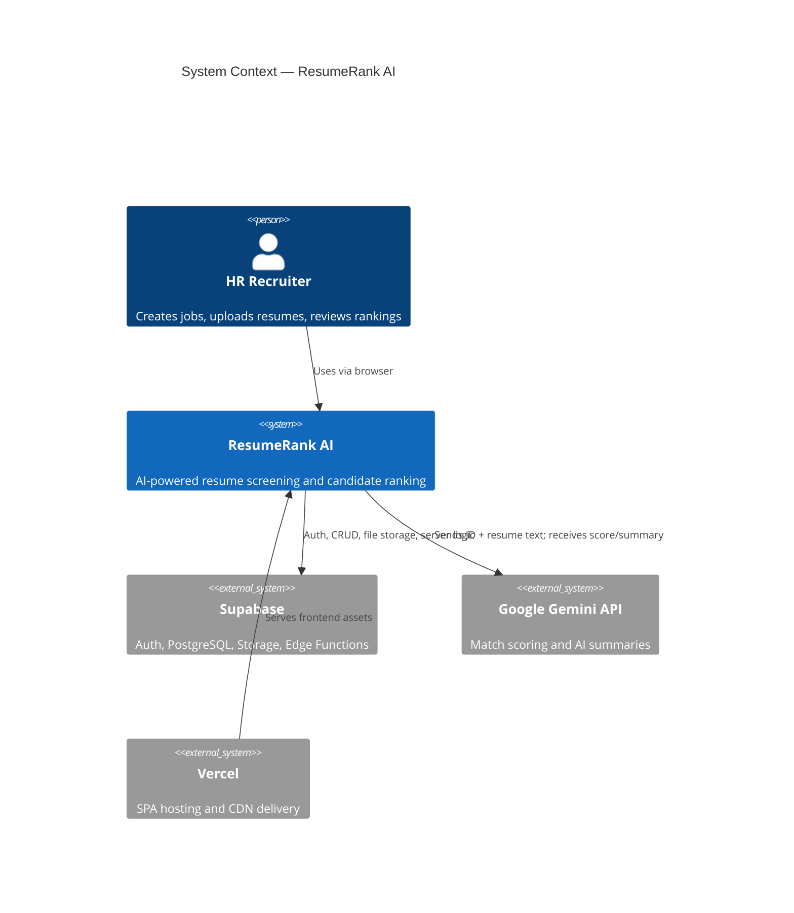
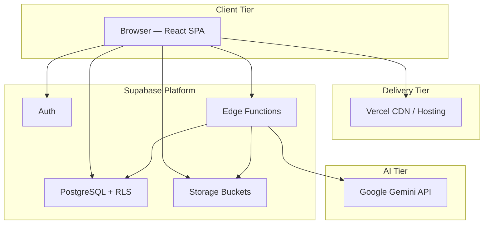
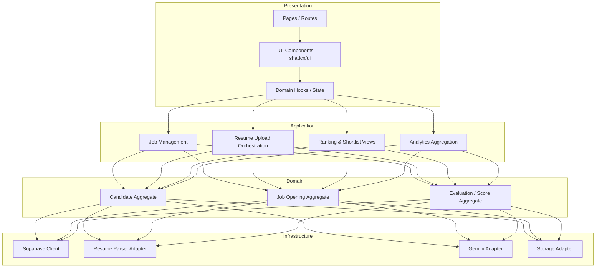
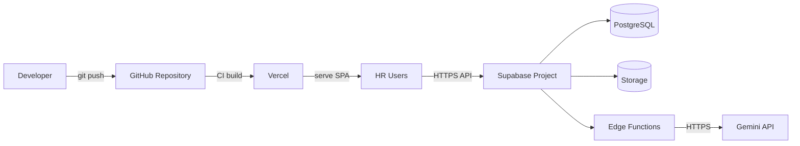
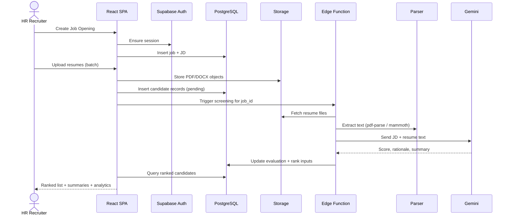
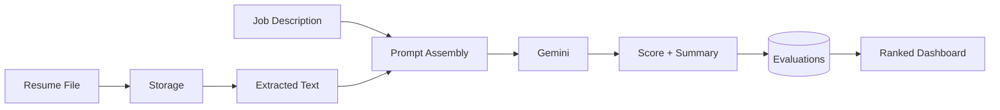
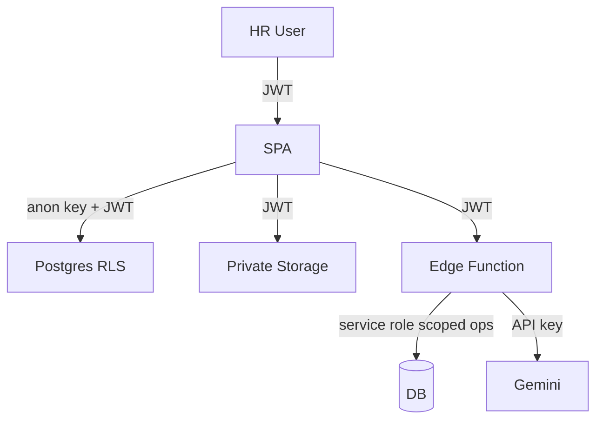
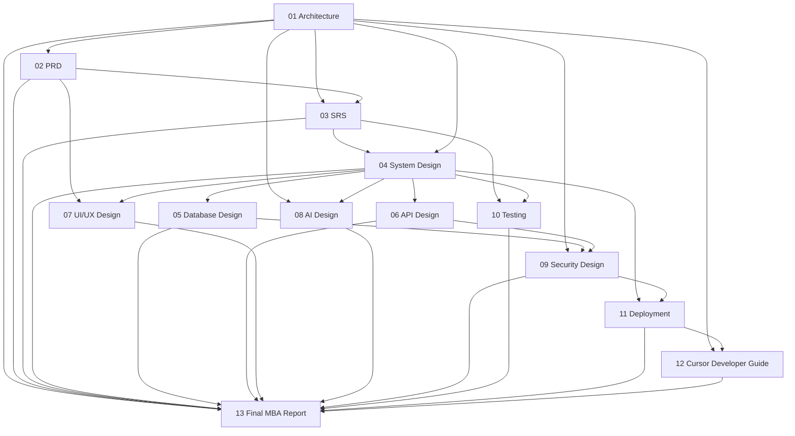

# ResumeRank AI

## Project Architecture Document

---

| Field | Value |
| --- | --- |
| **Document Title** | Project Architecture Document |
| **Project Name** | ResumeRank AI |
| **Document ID** | RR-ARCH-001 |
| **Version** | 1.0.0 |
| **Status** | Approved for Downstream Design |
| **Classification** | Internal — MBA Final Year Project |
| **Author** | Vish Var |
| **Role** | Software Architect / Project Lead |
| **Organization** | ResumeRank AI Development Team |
| **Date** | 11 July 2026 |
| **Technology Focus** | Artificial Intelligence & Data Science |
| **Related Documents** | PRD (RR-PRD-002), SRS (RR-SRS-003) — forthcoming |

---

### Cover Statement

This document defines the high-level software architecture for **ResumeRank AI**, an AI-powered Resume Screening and Candidate Ranking System. It establishes system boundaries, logical and physical architecture, technology rationale, component responsibilities, data and control flows, non-functional architecture constraints, and the documentation dependency chain for all subsequent design and implementation artifacts.

This document is the authoritative architectural baseline for Product Requirements, Software Requirements Specification, System Design, Database Design, API Design, UI/UX Design, AI Design, Security Design, Testing, Deployment, and the Final MBA Report.

---

## Version History

| Version | Date | Author | Changes | Reviewer |
| --- | --- | --- | --- | --- |
| 0.1.0 | 11 July 2026 | Vish Var | Initial draft — context, stack, and component map | — |
| 1.0.0 | 11 July 2026 | Vish Var | Complete architecture baseline with diagrams, NFRs, risks, and document roadmap | Project Lead |

---

## Table of Contents

1. [Introduction](#1-introduction)
2. [Document Purpose and Scope](#2-document-purpose-and-scope)
3. [System Overview](#3-system-overview)
4. [Business and Academic Context](#4-business-and-academic-context)
5. [Architectural Goals and Principles](#5-architectural-goals-and-principles)
6. [Stakeholders and Primary Actors](#6-stakeholders-and-primary-actors)
7. [System Context](#7-system-context)
8. [Technology Stack Architecture](#8-technology-stack-architecture)
9. [Logical Architecture](#9-logical-architecture)
10. [Physical / Deployment Architecture](#10-physical--deployment-architecture)
11. [Component Architecture](#11-component-architecture)
12. [Data Architecture Overview](#12-data-architecture-overview)
13. [AI Pipeline Architecture](#13-ai-pipeline-architecture)
14. [Security Architecture Overview](#14-security-architecture-overview)
15. [Integration Architecture](#15-integration-architecture)
16. [Cross-Cutting Concerns](#16-cross-cutting-concerns)
17. [Non-Functional Architecture Requirements](#17-non-functional-architecture-requirements)
18. [Architectural Decisions (ADR Summary)](#18-architectural-decisions-adr-summary)
19. [Risks, Constraints, and Assumptions](#19-risks-constraints-and-assumptions)
20. [Documentation Roadmap and Traceability](#20-documentation-roadmap-and-traceability)
21. [Future Scope](#21-future-scope)
22. [References](#22-references)
23. [Appendices](#23-appendices)

---

## 1. Introduction

ResumeRank AI is an enterprise-oriented web application that automates the early stages of recruitment screening. Human Resources (HR) personnel create job openings, upload candidate resumes in bulk, and receive AI-generated match scores, ranked shortlists, candidate summaries, and analytics.

The system combines:

- A modern React/TypeScript single-page application (SPA)
- Supabase as Backend-as-a-Service (Auth, PostgreSQL, Storage, Row Level Security)
- Google Gemini for semantic resume–job matching and summarization
- Server-side or edge-assisted parsing of PDF and DOCX resumes

This architecture document describes **how** the system is structured so that requirements, design, implementation, testing, and deployment remain aligned.

---

## 2. Document Purpose and Scope

### 2.1 Purpose

| Objective | Description |
| --- | --- |
| Establish baseline | Define the canonical architecture for ResumeRank AI |
| Guide design | Inform System Design, Database Design, API Design, and UI/UX Design |
| Justify stack | Record technology choices with explicit rationale |
| Enable traceability | Link architecture decisions to later MBA report chapters |
| Reduce ambiguity | Provide diagrams and component contracts for implementers |

### 2.2 In Scope

- System context and external actors
- Logical, physical, component, data, AI, and security architecture overviews
- Technology stack and deployment topology
- High-level data and control flows
- Non-functional architectural constraints
- Document dependency map for Phases 1–5

### 2.3 Out of Scope

Detailed requirements (PRD/SRS), normalized schemas, OpenAPI contracts, pixel-level UI specifications, prompt engineering details, penetration test plans, and CI/CD runbooks are deferred to their dedicated documents. This document provides only the architectural framing those artifacts must respect.

### 2.4 Audience

| Audience | Use of This Document |
| --- | --- |
| Project Lead / Architect | Baseline for all design decisions |
| Full-Stack Engineers | Component boundaries and integration points |
| Database Designer | Entity domains and storage strategy |
| AI Solution Architect | Pipeline placement and model integration |
| UI/UX Designer | Application shells and information architecture |
| Academic Evaluators | Evidence of structured software engineering practice |
| Testers / QA | System under test boundaries |

---

## 3. System Overview

ResumeRank AI implements an end-to-end screening workflow:

1. HR authenticates via Supabase Auth
2. HR creates a Job Opening with a structured Job Description (JD)
3. HR uploads one or many resume files (PDF/DOCX) to Supabase Storage
4. The system extracts text and structured candidate fields
5. Gemini evaluates each resume against the JD and returns a match score, rationale, and summary
6. Candidates are ranked and persisted
7. HR reviews rankings, summaries, and analytics on a dashboard

---

## 4. Business and Academic Context

### 4.1 Business Problem

Manual resume screening is slow, inconsistent, and difficult to scale. Recruiters spend disproportionate time on first-pass filtering rather than interviewing high-fit candidates. Organizations need a transparent, auditable, AI-assisted ranking layer that preserves human decision authority.

### 4.2 Academic Positioning

As an MBA Final Year Project specializing in Artificial Intelligence & Data Science, ResumeRank AI demonstrates:

| Dimension | Demonstration |
| --- | --- |
| AI application | Generative model used for semantic matching and summarization |
| Data science | Structured extraction, scoring, ranking, and analytics |
| Software engineering | Full documentation suite aligned with IEEE-style practices |
| Product thinking | HR-centered workflows and measurable screening outcomes |
| Cloud architecture | Managed backend, secure storage, serverless deployment |

### 4.3 Success Criteria (Architectural)

| Criterion | Measure |
| --- | --- |
| End-to-end screening path | Job → Upload → Parse → Score → Rank → Dashboard |
| Secure multi-tenant isolation | RLS policies per authenticated HR organization/user |
| Explainable AI output | Score + summary + match rationale stored per candidate |
| Deployability | Frontend on Vercel; backend services on Supabase |
| Documentation completeness | Architecture → Requirements → Design → Test → Deploy → MBA Report |

---

## 5. Architectural Goals and Principles

### 5.1 Goals

| ID | Goal | Priority |
| --- | --- | --- |
| AG-01 | Deliver a production-ready screening workflow for HR users | Critical |
| AG-02 | Keep AI scoring explainable and auditable | Critical |
| AG-03 | Minimize custom backend surface by leveraging Supabase | High |
| AG-04 | Support bulk resume ingestion with reliable parsing | High |
| AG-05 | Enable analytics without a separate BI stack | Medium |
| AG-06 | Maintain academic-grade documentation and traceability | Critical |

### 5.2 Principles

| Principle | Application in ResumeRank AI |
| --- | --- |
| Separation of concerns | UI, auth, persistence, parsing, and AI scoring are distinct layers |
| Security by default | Authn/Authz via Supabase Auth + PostgreSQL RLS |
| Managed services first | Prefer Supabase and Vercel over self-hosted infrastructure |
| Human-in-the-loop | AI ranks and summarizes; HR makes hiring decisions |
| Observability | Persist processing status, errors, and AI metadata |
| Incremental delivery | Architecture supports phased document and feature delivery |
| Vendor isolation | Gemini and storage access mediated through controlled server/edge paths |

---

## 6. Stakeholders and Primary Actors

| Actor | Type | Responsibilities |
| --- | --- | --- |
| HR Recruiter / Talent Partner | Primary user | Create jobs, upload resumes, review rankings and analytics |
| Hiring Manager (optional future) | Secondary user | View shortlists for assigned jobs |
| System Administrator | Operational | Configure environment, monitor failures |
| Google Gemini | External AI service | Semantic matching, scoring, summarization |
| Supabase Platform | External platform | Auth, DB, Storage, Edge Functions |
| Vercel | External platform | Host and deliver the SPA |
| Academic Evaluator | Oversight | Assess architecture, documentation, and outcomes |

---

## 7. System Context

The system context diagram places ResumeRank AI at the center of HR workflows and external platforms.

### 7.1 Trust Boundaries

| Boundary | Description |
| --- | --- |
| Browser ↔ Application | HTTPS only; session tokens managed by Supabase client |
| Application ↔ Supabase | Authenticated API calls; RLS enforces row ownership |
| Application ↔ Gemini | API key held in server/edge secrets; never exposed to the browser |
| Storage ↔ Application | Signed/authenticated access to resume objects |

---

## 8. Technology Stack Architecture

### 8.1 Stack Map

| Layer | Technology | Role |
| --- | --- | --- |
| Presentation | React + TypeScript + Vite | SPA application shell and interactive UI |
| UI System | Tailwind CSS + shadcn/ui | Consistent, accessible component library |
| Backend Platform | Supabase | Auth, PostgreSQL, Storage, Edge Functions, Realtime (optional) |
| Database | PostgreSQL (Supabase) | System of record for jobs, candidates, scores, analytics |
| Object Storage | Supabase Storage | Resume file blobs (PDF/DOCX) |
| Authentication | Supabase Auth | Email/password (and extensible providers) |
| AI | Google Gemini API | Semantic JD–resume matching and summarization |
| Parsing | pdf-parse, mammoth | Text extraction from PDF and DOCX |
| Deployment | Vercel | Frontend CI/CD and global edge delivery |

### 8.2 Stack Rationale

| Choice | Rationale | Alternatives Considered |
| --- | --- | --- |
| React + Vite + TS | Strong ecosystem, type safety, fast DX for SPA | Next.js (SSR not required for v1) |
| Tailwind + shadcn/ui | Rapid, consistent enterprise UI without heavy design debt | MUI, Chakra |
| Supabase | Unified Auth/DB/Storage reduces ops burden for academic/production hybrid | Firebase, custom NestJS + Postgres |
| Gemini | Strong multimodal/text reasoning suitable for resume semantics | OpenAI GPT, local LLMs |
| pdf-parse + mammoth | Lightweight, Node-compatible parsers for common resume formats | Apache Tika, commercial parsers |
| Vercel | Native Vite/React deployment path with preview environments | Netlify, Cloudflare Pages |

### 8.3 Runtime Topology

---

## 9. Logical Architecture

ResumeRank AI follows a layered logical architecture.

### 9.1 Layer Responsibilities

| Layer | Responsibility | Must Not |
| --- | --- | --- |
| Presentation | Render UI, capture input, display rankings/analytics | Call Gemini directly with secrets |
| Application | Orchestrate use cases (create job, process batch, rank) | Embed SQL or raw storage paths ad hoc |
| Domain | Represent jobs, candidates, evaluations, statuses | Depend on React or UI libraries |
| Infrastructure | Talk to Supabase, parsers, Gemini | Encode business ranking rules beyond adapters |

---

## 10. Physical / Deployment Architecture

### 10.1 Environments

| Environment | Frontend | Backend | Purpose |
| --- | --- | --- | --- |
| Local Development | Vite dev server | Supabase local or cloud project | Feature development |
| Preview | Vercel Preview | Shared or branch Supabase project | PR validation |
| Production | Vercel Production | Supabase Production project | Live HR usage / demo |

### 10.2 Deployment Diagram

### 10.3 Configuration Strategy

| Config Class | Examples | Storage Location |
| --- | --- | --- |
| Public client | `VITE_SUPABASE_URL`, `VITE_SUPABASE_ANON_KEY` | Vercel env (non-secret / publishable) |
| Server secrets | `GEMINI_API_KEY`, service role key | Supabase Edge Function secrets / Vercel server env |
| Feature flags | Max upload size, model name | Environment variables / config table |

---

## 11. Component Architecture

### 11.1 Major Components

| Component | Location | Responsibility |
| --- | --- | --- |
| Auth Module | Frontend + Supabase Auth | Sign-up, login, session refresh, protected routes |
| Job Module | Frontend + PostgreSQL | CRUD for job openings and JD content |
| Upload Module | Frontend + Storage + Parser | Multi-file upload, validation, text extraction |
| Screening Engine | Edge Function / server path | Coordinate parse → Gemini → persist score |
| Ranking Module | Frontend + PostgreSQL | Sort and present candidates by match score |
| Summary Module | Gemini + PostgreSQL | Store and display AI candidate summaries |
| Analytics Module | Frontend + SQL views/aggregates | Dashboard metrics for jobs and screening funnel |
| Notification/Status | PostgreSQL status fields | Track pending/processing/completed/failed |

### 11.2 Component Interaction — Screening Sequence

### 11.3 Frontend Module Map (Planned)

| Route / Area | Primary Components | Depends On |
| --- | --- | --- |
| `/login`, `/signup` | Auth forms | Supabase Auth |
| `/dashboard` | KPI cards, recent jobs | Analytics queries |
| `/jobs` | Job list/create/edit | Jobs table |
| `/jobs/:id` | Job detail, upload panel, rankings | Jobs, Candidates, Evaluations |
| `/jobs/:id/analytics` | Charts and funnel metrics | Aggregates / views |
| `/settings` | Profile / org preferences | Auth user metadata |

---

## 12. Data Architecture Overview

Detailed normalization, ERD, and indexing appear in the Database Design Document (RR-DB-005). This section defines domain data groups only.

### 12.1 Core Data Domains

| Domain | Key Entities (Conceptual) | Persistence |
| --- | --- | --- |
| Identity | User, Session | Supabase Auth + profiles |
| Recruitment | Job Opening, Job Description fields | PostgreSQL |
| Candidate Intake | Candidate, Resume File metadata | PostgreSQL + Storage |
| Evaluation | Match Score, Rationale, AI Summary, Model metadata | PostgreSQL |
| Operations | Processing Status, Error Log | PostgreSQL |
| Analytics | Derived metrics (counts, averages, distributions) | SQL views / queries |

### 12.2 Storage Strategy

| Asset | Store | Access Pattern |
| --- | --- | --- |
| Resume binaries | Supabase Storage bucket `resumes` | Write on upload; read by screening function |
| Structured candidate fields | PostgreSQL | Query for ranking UI |
| JD text and requirements | PostgreSQL | Input to Gemini prompt |
| AI outputs | PostgreSQL | Display + audit |

### 12.3 High-Level Data Flow

---

## 13. AI Pipeline Architecture

Detailed prompts, scoring rubrics, and evaluation methodology belong in the AI Design Document (RR-AI-008). Architecture constraints are defined here.

### 13.1 Pipeline Stages

| Stage | Input | Process | Output |
| --- | --- | --- | --- |
| Ingest | PDF/DOCX | Validate MIME/size; store blob | Storage object + candidate row |
| Extract | Blob | pdf-parse or mammoth | Plain text (+ optional structured fields) |
| Normalize | Raw text | Clean whitespace, truncate to model limits | Prompt-ready resume text |
| Match | JD + resume text | Gemini structured generation | Score (0–100), rationale, skills overlap |
| Summarize | Resume + JD context | Gemini summarization | HR-facing candidate summary |
| Persist | AI JSON | Validate schema; write DB | Evaluation record |
| Rank | Evaluations for job | Order by score descending | Ranked shortlist |

### 13.2 AI Placement Decision

Gemini calls execute only in **trusted server/edge contexts** (Supabase Edge Functions or equivalent server path). The browser never holds `GEMINI_API_KEY`.

### 13.3 Failure Handling (Architectural)

| Failure | System Behavior |
| --- | --- |
| Parse failure | Mark candidate `failed_parse`; continue batch |
| Gemini timeout/error | Retry with backoff; mark `failed_ai` after exhaustion |
| Partial batch success | Persist successful evaluations; surface failures in UI |
| Invalid AI JSON | Reject write; log raw response for debugging |

---

## 14. Security Architecture Overview

Full controls are specified in Security Design (RR-SEC-009). Architectural mandates:

| Control | Implementation Direction |
| --- | --- |
| Authentication | Supabase Auth required for all app routes except public landing/login |
| Authorization | PostgreSQL RLS keyed to `auth.uid()` / organization ownership |
| Secret management | Gemini and service-role keys only in server/edge secrets |
| Transport | HTTPS everywhere (Vercel + Supabase) |
| File safety | MIME allowlist (PDF/DOCX), size limits, private buckets |
| Data minimization | Store only screening-needed PII from resumes |
| Auditability | Retain scores, model identity, timestamps for academic/demo audit |

---

## 15. Integration Architecture

| Integration | Protocol | Direction | Auth |
| --- | --- | --- | --- |
| Supabase Auth | HTTPS / SDK | Bidirectional | Email credentials → JWT |
| Supabase PostgREST | HTTPS / SDK | Bidirectional | JWT + RLS |
| Supabase Storage | HTTPS / SDK | Bidirectional | JWT / signed URLs |
| Supabase Edge Functions | HTTPS | SPA → Function | JWT |
| Google Gemini | HTTPS REST | Function → Gemini | API key |
| Vercel | Git + HTTPS | Deploy pipeline | Platform auth |

### 15.1 Anti-Corruption Rules

- UI components must not construct Gemini prompts.
- Parsers must not write ranking business rules.
- Database schema must not embed prompt templates (prompts live in AI config/code versioned with the app).

---

## 16. Cross-Cutting Concerns

| Concern | Approach |
| --- | --- |
| Logging | Edge function structured logs; client error boundaries |
| Error UX | Per-candidate status chips; job-level processing banner |
| Idempotency | Screening requests keyed by `job_id` + `candidate_id` |
| Performance | Batch uploads with async processing; paginated ranking tables |
| Accessibility | shadcn/ui primitives + semantic HTML; keyboard paths for core flows |
| Internationalization | English-first for v1; UTF-8 storage throughout |
| Testing seams | Adapter interfaces for Gemini and parsers to enable mocks |

---

## 17. Non-Functional Architecture Requirements

| ID | Category | Requirement | Target |
| --- | --- | --- | --- |
| NFR-A-01 | Security | All data access subject to Auth + RLS | 100% of tables with user data |
| NFR-A-02 | Reliability | Batch screening continues after single-file failure | Partial success supported |
| NFR-A-03 | Performance | Dashboard initial load for typical job set | < 3s on broadband (design target) |
| NFR-A-04 | Scalability | Support multi-resume upload per job | ≥ 20 resumes/job in v1 demo profile |
| NFR-A-05 | Maintainability | Strict TypeScript + modular adapters | No any-typed Gemini payloads in UI |
| NFR-A-06 | Auditability | Persist score, summary, timestamps, model id | Required for every successful evaluation |
| NFR-A-07 | Deployability | One-command/frontend deploy via Vercel | Documented in Deployment Guide |
| NFR-A-08 | Usability | Core HR path completable without training manual | Guided empty states + clear CTAs |

---

## 18. Architectural Decisions (ADR Summary)

| ADR ID | Decision | Status | Consequences |
| --- | --- | --- | --- |
| ADR-001 | Use Supabase as primary backend | Accepted | Faster delivery; platform coupling |
| ADR-002 | Use Gemini for matching/summaries | Accepted | External dependency; API cost/latency |
| ADR-003 | Keep SPA on Vercel; no SSR requirement for v1 | Accepted | Simpler hosting; SEO not prioritized |
| ADR-004 | Execute AI and privileged ops in Edge Functions | Accepted | Protects secrets; adds function ops |
| ADR-005 | Parse PDF/DOCX with pdf-parse and mammoth | Accepted | Good coverage; complex layouts may degrade |
| ADR-006 | Human-in-the-loop ranking (no auto-reject) | Accepted | Ethical/academic alignment; HR remains decision maker |
| ADR-007 | Documentation-first delivery (one document at a time) | Accepted | Strong MBA artifact quality; slower parallel drafting |

---

## 19. Risks, Constraints, and Assumptions

### 19.1 Risks

| ID | Risk | Impact | Likelihood | Mitigation |
| --- | --- | --- | --- | --- |
| R-01 | Gemini output schema drift | Medium | Medium | Strict JSON schema validation + retries |
| R-02 | Poor parse quality on scanned PDFs | High | Medium | Detect empty text; flag for manual review |
| R-03 | API key leakage | Critical | Low | Edge-only secrets; no client exposure |
| R-04 | Supabase free-tier limits during demos | Medium | Medium | Monitor quotas; document upgrade path |
| R-05 | Bias in AI ranking | High | Medium | Transparent rationale; HR override; documented limitations |

### 19.2 Constraints

- Academic timeline and single-team delivery capacity
- Dependence on third-party Gemini availability and pricing
- Resume formats limited to PDF and DOCX in v1
- English-language JD/resume optimization for initial release

### 19.3 Assumptions

- HR users have modern browsers and stable internet
- Job descriptions are provided as text (not only scanned images)
- One primary organization/tenant model is sufficient for v1 (extensible later)
- Evaluators accept managed-cloud architecture as production-representative

---

## 20. Documentation Roadmap and Traceability

This architecture document is **Document 1** in the ResumeRank AI documentation suite.

| Phase | Doc # | Document | Document ID | Depends On |
| --- | --- | --- | --- | --- |
| 1 | 1 | Project Architecture | RR-ARCH-001 | — |
| 1 | 2 | Product Requirements Document | RR-PRD-002 | RR-ARCH-001 |
| 1 | 3 | Software Requirements Specification | RR-SRS-003 | RR-ARCH-001, RR-PRD-002 |
| 2 | 4 | System Design Document | RR-SDD-004 | RR-ARCH-001, RR-SRS-003 |
| 2 | 5 | Database Design Document | RR-DB-005 | RR-ARCH-001, RR-SDD-004 |
| 2 | 6 | API Design Specification | RR-API-006 | RR-SDD-004, RR-DB-005 |
| 2 | 7 | UI/UX Design Document | RR-UIX-007 | RR-PRD-002, RR-SDD-004 |
| 3 | 8 | AI Design Document | RR-AI-008 | RR-ARCH-001, RR-SDD-004 |
| 3 | 9 | Security Design | RR-SEC-009 | RR-ARCH-001, RR-API-006, RR-DB-005 |
| 3 | 10 | Testing Document | RR-TEST-010 | RR-SRS-003, RR-SDD-004 |
| 4 | 11 | Deployment Guide | RR-DEP-011 | RR-SDD-004, RR-SEC-009 |
| 4 | 12 | Cursor Developer Guide | RR-DEV-012 | RR-ARCH-001, RR-DEP-011 |
| 5 | 13 | Final MBA Report | RR-MBA-013 | All prior documents |

---

## 21. Future Scope

| Area | Enhancement | Architectural Impact |
| --- | --- | --- |
| Multi-tenancy | Organization workspaces and role-based HR/HM access | Expand RLS and identity model |
| Interview loop | Schedule interviews from shortlist | New domain module + calendar integrations |
| Model choice | Pluggable LLM providers | Adapter interface already anticipated |
| Bias monitoring | Fairness metrics by demographic proxies (where lawful) | Analytics + ethics review layer |
| OCR | Scanned PDF support | Additional parsing service |
| Realtime | Live processing progress via Supabase Realtime | Subscribe channels in job detail UI |
| Mobile HR | Responsive PWA enhancements | Presentation-layer only if APIs remain stable |

---

## 22. References

1. IEEE Std 1471 / ISO/IEC/IEEE 42010 — Architecture description practices (conceptual alignment).
2. Bass, L., Clements, P., Kazman, R. — *Software Architecture in Practice* (quality attributes and views).
3. Supabase Documentation — Auth, Database, Storage, Edge Functions.
4. Google AI Gemini API Documentation — Generative language model integration.
5. React + Vite + TypeScript official documentation.
6. Tailwind CSS and shadcn/ui documentation.
7. Vercel Documentation — Frontend deployment and environment configuration.
8. pdf-parse and mammoth library documentation — resume text extraction.
9. Project charter inputs — ResumeRank AI MBA Final Year Project brief (internal).

---

## 23. Appendices

### Appendix A — Glossary

| Term | Definition |
| --- | --- |
| JD | Job Description — requirements and responsibilities for a role |
| Match Score | AI-generated fitness score of a resume against a JD (0–100) |
| RLS | Row Level Security — PostgreSQL policies restricting row access |
| SPA | Single-Page Application |
| Edge Function | Serverless function co-located with Supabase backend |
| Screening Engine | Orchestration component for parse → AI → persist → rank |
| Human-in-the-loop | Design where AI assists but does not autonomously reject candidates |

### Appendix B — Quality Attribute Priority

| Quality Attribute | Priority | Primary Tactics |
| --- | --- | --- |
| Security | Highest | Auth, RLS, secret isolation |
| Auditability | Highest | Persisted AI outputs and statuses |
| Usability | High | Clear HR workflow and dashboard |
| Reliability | High | Partial-failure batch processing |
| Performance | Medium | Async screening, indexed queries |
| Portability | Medium | Managed services with documented adapters |

### Appendix C — Document Control

| Item | Value |
| --- | --- |
| Storage path | `docs/01-requirements/01-Project-Architecture.md` |
| Review cycle | Before each subsequent Phase 1–2 document |
| Change control | Version bump on any ADR or topology change |
| Next document | Product Requirements Document (RR-PRD-002) |

---

**End of Document — RR-ARCH-001 — Project Architecture Document v1.0.0**
