# ResumeRank AI

# Project Architecture Document

**Document 01 — RR-ARCH-001**

---

## Cover Page

| | |
| --- | --- |
| **Project Name** | ResumeRank AI |
| **Document Title** | Project Architecture Document |
| **Document Number** | Document 01 |
| **Document ID** | RR-ARCH-001 |
| **Version** | 2.0.0 |
| **Status** | Baseline — Ready for PRD |
| **Classification** | Internal — MBA Final Year Project |
| **Specialization** | Artificial Intelligence & Data Science |
| **Document Type** | Software Architecture |
| **Author** | Vish Var |
| **Role** | Software Architect / Project Lead |
| **Organization** | ResumeRank AI Development Team |
| **Prepared For** | Academic Evaluation & Development Team |
| **Date** | 11 July 2026 |
| **Governing Plan** | Documentation Roadmap (RR-DOC-000) |
| **Next Document** | Product Requirements Document (RR-PRD-002) |

---

### Document Control Statement

This Project Architecture Document defines the authoritative architectural baseline for **ResumeRank AI**, an AI-powered Resume Screening and Candidate Ranking System. It describes business architecture, system structure, technology choices, deployment topology, data and AI workflows, module interactions, repository organization, and the development roadmap that subsequent requirements, design, implementation, testing, and academic reporting must follow.

This document supersedes RR-ARCH-001 v1.0.0 and aligns the architecture narrative to the approved documentation outline for Document 01.

---

## Version History

| Version | Date | Author | Description of Change | Review Status |
| --- | --- | --- | --- | --- |
| 0.1.0 | 11 July 2026 | Vish Var | Initial architecture draft | Draft |
| 1.0.0 | 11 July 2026 | Vish Var | First complete baseline with multi-view architecture | Superseded |
| 2.0.0 | 11 July 2026 | Vish Var | Restructured and expanded to Document 01 outline: Business, System, High-Level, Component, Technology, Deployment, Data Flow, AI Workflow, Module Interaction, Folder Structure, Development Roadmap, diagram catalog, and conclusion | Current |

---

## Table of Contents

1. [Introduction](#1-introduction)
2. [Business Architecture](#2-business-architecture)
3. [System Architecture](#3-system-architecture)
4. [High Level Architecture](#4-high-level-architecture)
5. [Component Architecture](#5-component-architecture)
6. [Technology Architecture](#6-technology-architecture)
7. [Deployment Architecture](#7-deployment-architecture)
8. [Data Flow](#8-data-flow)
9. [AI Workflow](#9-ai-workflow)
10. [Module Interaction](#10-module-interaction)
11. [Folder Structure](#11-folder-structure)
12. [Development Roadmap](#12-development-roadmap)
13. [Mermaid Diagrams](#13-mermaid-diagrams)
14. [Conclusion](#14-conclusion)
15. [Future Scope](#15-future-scope)
16. [References](#16-references)
17. [Appendices](#17-appendices)

---

## 1. Introduction

### 1.1 Project Overview

**ResumeRank AI** is an enterprise-oriented web application that automates the early stages of recruitment screening. Human Resources (HR) personnel create job openings, upload candidate resumes in bulk, extract candidate information, compare each resume against the Job Description (JD), generate an AI match score and summary, rank candidates, and review outcomes on an analytics dashboard.

The system is designed as an MBA Final Year Project specializing in Artificial Intelligence & Data Science, with deliverables that include a production-ready application, a PostgreSQL database on Supabase, Google Gemini AI integration, a full software documentation suite, testing artifacts, deployment configuration, and a Final MBA Report.

### 1.2 Purpose of This Document

| Purpose | Description |
| --- | --- |
| Establish baseline | Define the canonical architecture for ResumeRank AI |
| Align stakeholders | Provide a shared technical and business view for academic and development audiences |
| Guide downstream work | Inform PRD, SRS, System Design, Database Design, API Design, UI/UX, AI Design, Security, Testing, and Deployment |
| Justify decisions | Record technology and structural choices with explicit rationale |
| Enable implementation | Give engineers clear module boundaries, flows, and repository expectations |

### 1.3 Scope

**In scope for this document**

- Business capabilities and value stream for AI-assisted screening
- System context, boundaries, and primary actors
- High-level, component, technology, and deployment architectures
- End-to-end data flow and AI workflow
- Module interaction contracts at architecture level
- Target repository folder structure
- Development and documentation roadmap linkage

**Out of scope for this document**

- Detailed product backlog and MoSCoW prioritization (RR-PRD-002)
- Testable requirement IDs and acceptance criteria (RR-SRS-003)
- Normalized database DDL and full ERD (RR-DB-005)
- OpenAPI-level endpoint contracts (RR-API-006)
- Pixel-level UI specifications (RR-UIX-007)
- Final prompt templates and scoring rubric detail (RR-AI-008)
- Full threat model and control matrices (RR-SEC-009)

### 1.4 Intended Audience

| Audience | How This Document Is Used |
| --- | --- |
| Project Lead / Architect | Decision baseline and change control |
| Full-Stack Engineers | Component boundaries and integration points |
| Database Designer | Domain data groups and storage strategy |
| AI Solution Architect | Pipeline placement and model integration constraints |
| UI/UX Designer | Application shells and information architecture |
| QA / Testers | System-under-test boundaries |
| Academic Evaluators | Evidence of structured software engineering practice |

### 1.5 Definitions and Acronyms

| Term | Definition |
| --- | --- |
| JD | Job Description — role requirements and responsibilities |
| Match Score | AI-generated fitness score of a resume against a JD (0–100 scale) |
| RLS | Row Level Security in PostgreSQL |
| SPA | Single-Page Application |
| BaaS | Backend-as-a-Service |
| Edge Function | Serverless function hosted with Supabase for privileged operations |
| Human-in-the-loop | AI assists ranking and summarization; HR retains hiring decisions |
| Screening Engine | Orchestration of parse → AI evaluate → persist → rank |

### 1.6 Related Documents

| Document ID | Title | Relationship |
| --- | --- | --- |
| RR-DOC-000 | Documentation Roadmap | Governing plan for document sequence |
| RR-PRD-002 | Product Requirements Document | Next document; consumes this architecture |
| RR-SRS-003 | Software Requirements Specification | Formalizes requirements under this architecture |
| RR-SDD-004 through RR-MBA-013 | Design, specialty, delivery, and MBA report | Downstream dependents |

---

## 2. Business Architecture

### 2.1 Business Problem

Manual first-pass resume screening is slow, inconsistent, and difficult to scale. Recruiters spend disproportionate effort filtering large applicant volumes before interviews begin. Screening quality varies by individual reviewer, comparison across candidates is weakly standardized, and organizations lack an auditable, explainable ranking trail for early-stage decisions.

The business problem is **not** to replace human hiring judgment. The problem is to reduce noisy, repetitive early filtering so HR professionals can focus on higher-value evaluation of stronger candidates.

### 2.2 Business Objectives

| ID | Business Objective | Architectural Implication |
| --- | --- | --- |
| BO-01 | Reduce time-to-shortlist for each job opening | Async bulk upload and automated scoring pipeline |
| BO-02 | Improve consistency of first-pass evaluation | Shared JD-based AI scoring rubric per job |
| BO-03 | Provide explainable candidate rankings | Persist score, rationale, and summary per candidate |
| BO-04 | Give HR visibility into screening outcomes | Analytics dashboard over jobs, statuses, and scores |
| BO-05 | Preserve human decision authority | No autonomous reject/hire actions in v1 |
| BO-06 | Deliver an academically defensible AI system | Documented architecture, AI workflow, and auditability |

### 2.3 Business Capabilities

| Capability | Description | System Support |
| --- | --- | --- |
| Job Opening Management | Create and maintain roles with JD content | Job module + PostgreSQL |
| Resume Intake | Accept multiple PDF/DOCX resumes per job | Upload module + Supabase Storage |
| Candidate Information Extraction | Convert resume files into usable text/fields | Parser adapters (pdf-parse, mammoth) |
| AI Matching | Compare resume content to JD semantically | Gemini via Edge Function |
| Candidate Ranking | Order candidates by match score | Ranking views over evaluations |
| AI Summarization | Produce concise HR-facing candidate summaries | Gemini + persisted summary fields |
| Screening Analytics | Visualize volumes, statuses, and score patterns | Dashboard queries/aggregates |
| Secure Access Control | Restrict data to authenticated HR users | Supabase Auth + RLS |

### 2.4 Value Stream

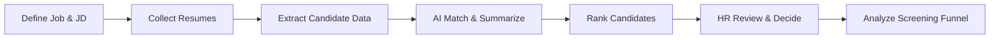

| Stage | Business Outcome | System Outcome |
| --- | --- | --- |
| Define Job & JD | Clear role target for screening | Job record persisted |
| Collect Resumes | Applicant pack ready for evaluation | Files in Storage + candidate rows |
| Extract Candidate Data | Machine-readable resume content | Parsed text available to AI |
| AI Match & Summarize | Comparable fitness signal | Score, rationale, summary |
| Rank Candidates | Ordered shortlist | Ranked job detail view |
| HR Review & Decide | Human hiring judgment | UI review; no auto-decision |
| Analyze Funnel | Operational insight | Dashboard metrics |

### 2.5 Business Actors

| Actor | Business Role | System Role in v1 |
| --- | --- | --- |
| HR Recruiter / Talent Partner | Owns screening workflow | Primary authenticated user |
| Hiring Manager | Consumes shortlists | Future/secondary; not required for core v1 |
| Candidate | Applicant / data subject | No portal login in v1 |
| System Administrator | Environment and operational oversight | Lightweight operational role |
| Academic Evaluator | Assesses project quality | External reviewer of docs and demo |

### 2.6 Business Rules (Architectural)

| Rule ID | Rule | Enforcement Level |
| --- | --- | --- |
| BR-01 | Only authenticated HR users may create jobs and upload resumes | Auth + protected routes + RLS |
| BR-02 | AI may rank and summarize; AI may not auto-reject or auto-hire | Application workflow design |
| BR-03 | Every successful evaluation must retain score, summary, and timestamp | Persistence contract |
| BR-04 | A single resume parse/AI failure must not abort the entire batch | Screening Engine error policy |
| BR-05 | Gemini credentials must never be exposed to the browser | Edge/server-only secrets |
| BR-06 | v1 resume formats are PDF and DOCX only | Upload validation |

### 2.7 Academic Business Context

As an MBA Final Year Project in Artificial Intelligence & Data Science, ResumeRank AI must demonstrate applied AI, data handling, cloud software engineering, and professional documentation discipline. The business architecture therefore balances a credible HR product workflow with academic requirements for explainability, traceability, and complete documentation.

---

## 3. System Architecture

### 3.1 System Definition

ResumeRank AI is a cloud-hosted SPA with a managed backend. The React application provides the HR interface. Supabase provides authentication, PostgreSQL persistence, file storage, and Edge Functions. Google Gemini provides semantic matching and summarization. Vercel hosts and delivers the frontend.

### 3.2 System Context

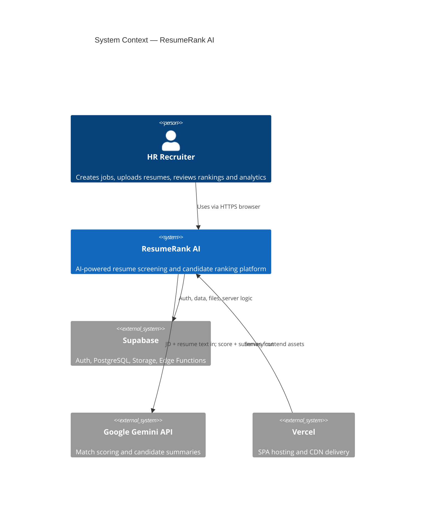

### 3.3 System Boundary

| Inside System Boundary | Outside System Boundary |
| --- | --- |
| React SPA and UI state | HR user’s browser environment |
| Supabase project configuration used by the app | Google Gemini model training infrastructure |
| Edge Functions for screening orchestration | Corporate ATS/HRIS systems (not integrated in v1) |
| PostgreSQL schema and RLS policies | Email marketing / offer management tools |
| Resume storage buckets | Candidate-facing career portals |
| Client SDK integration code | University LMS / submission portals |

### 3.4 Architectural Style

| Style Element | Choice | Rationale |
| --- | --- | --- |
| Application style | SPA + BaaS | Fast delivery, clear separation of UI and managed backend |
| Integration style | API-mediated adapters | Isolate Gemini and parsers behind infrastructure adapters |
| Processing style | Request-driven async batch screening | Supports multi-resume upload without blocking UI |
| Security style | Zero-trust toward client for secrets; RLS for data | Protects AI keys and tenant/user data |
| Decision style | Human-in-the-loop | Aligns ethics, HR practice, and academic expectations |

### 3.5 Quality Attribute Priorities

| Priority | Quality Attribute | Architectural Tactic |
| --- | --- | --- |
| Highest | Security | Auth, RLS, private storage, edge-held secrets |
| Highest | Auditability | Persisted scores, summaries, statuses, timestamps |
| High | Reliability | Per-candidate failure isolation in batches |
| High | Usability | Linear HR workflow and clear processing states |
| Medium | Performance | Async screening, indexed queries, paginated lists |
| Medium | Maintainability | Modular adapters, TypeScript, documented boundaries |

### 3.6 Constraints and Assumptions

| Type | Statement |
| --- | --- |
| Constraint | v1 supports PDF and DOCX resumes only |
| Constraint | English-first JD and resume optimization |
| Constraint | Managed cloud stack (Vercel + Supabase + Gemini) is mandatory |
| Assumption | JD content is available as text in the application |
| Assumption | HR users have modern browsers and stable connectivity |
| Assumption | Single-organization / simple tenancy is sufficient for v1 unless later expanded |
| Assumption | Candidates do not require login in v1 |

---

## 4. High Level Architecture

### 4.1 Layered View

ResumeRank AI is organized into four logical layers.

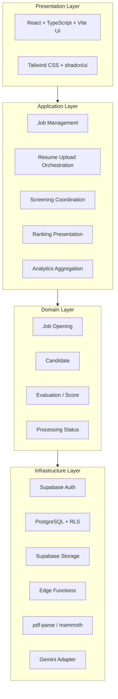

### 4.2 Layer Responsibilities

| Layer | Responsibility | Explicit Non-Responsibility |
| --- | --- | --- |
| Presentation | Render screens, capture input, display rankings and analytics | Must not call Gemini with API keys |
| Application | Orchestrate use cases across modules | Must not embed raw SQL ad hoc in UI components |
| Domain | Represent jobs, candidates, evaluations, and statuses | Must not depend on React or CSS |
| Infrastructure | Integrate Auth, DB, Storage, parsers, and Gemini | Must not own HR business policy beyond adapters |

### 4.3 End-to-End High-Level Flow

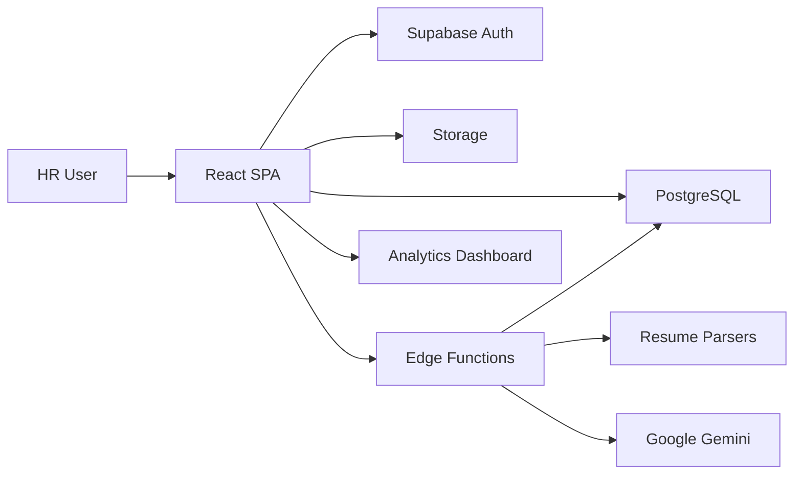

### 4.4 Major Architectural Building Blocks

| Building Block | Description |
| --- | --- |
| Web Client | Authenticated SPA for all HR workflows |
| Identity Platform | Supabase Auth issues and validates sessions |
| System of Record | PostgreSQL stores jobs, candidates, evaluations, and operational status |
| Object Store | Supabase Storage holds resume binaries |
| Screening Runtime | Edge Functions coordinate parsing and AI evaluation |
| Intelligence Service | Gemini returns structured match and summary outputs |
| Delivery Platform | Vercel builds and serves the SPA globally |

### 4.5 Trust Boundaries

| Boundary | Control |
| --- | --- |
| Browser ↔ Application | HTTPS; session JWT managed by Supabase client |
| Application ↔ Supabase | Authenticated SDK/API calls; RLS on user data |
| Application ↔ Storage | Authenticated/private bucket access |
| Edge Function ↔ Gemini | Server-side API key; no browser exposure |
| Public Internet ↔ Vercel/Supabase | Platform TLS termination and access controls |

---

## 5. Component Architecture

### 5.1 Component Catalog

| Component | Type | Responsibility |
| --- | --- | --- |
| Auth Module | Frontend + Supabase Auth | Sign-up, login, session refresh, route guards |
| Job Module | Frontend + PostgreSQL | Create, read, update job openings and JD content |
| Upload Module | Frontend + Storage | Multi-file validation, upload, candidate stub creation |
| Parser Component | Edge/server adapter | Extract text from PDF (pdf-parse) and DOCX (mammoth) |
| Screening Engine | Edge Function orchestration | Drive parse → prompt → Gemini → validate → persist |
| Ranking Module | Frontend + PostgreSQL | Present candidates ordered by match score |
| Summary Module | Gemini + PostgreSQL | Store and display AI-generated candidate summaries |
| Analytics Module | Frontend + SQL aggregates | Dashboard KPIs and job-level charts |
| Status Tracker | PostgreSQL fields/events | pending, processing, completed, failed_parse, failed_ai |

### 5.2 Component Diagram

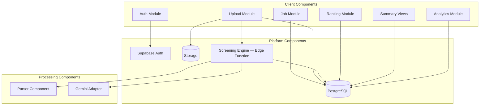

### 5.3 Component Interfaces (Architecture Level)

| From | To | Interface | Payload Concept |
| --- | --- | --- | --- |
| Auth Module | Supabase Auth | SDK auth API | credentials, session JWT |
| Job Module | PostgreSQL | Insert/update/select jobs | job title, JD text, metadata |
| Upload Module | Storage | Object upload | PDF/DOCX binary, path |
| Upload Module | PostgreSQL | Insert candidates | job_id, file path, status=pending |
| Screening Engine | Storage | Object download | resume path |
| Screening Engine | Parser | Extract text | file buffer → plain text |
| Screening Engine | Gemini Adapter | Evaluate | JD + resume text → score JSON |
| Screening Engine | PostgreSQL | Persist evaluation | score, rationale, summary, model id |
| Ranking/Analytics | PostgreSQL | Query | ranked rows, aggregates |

### 5.4 State Model for Candidate Processing

| State | Meaning | Typical Next States |
| --- | --- | --- |
| `pending` | Uploaded; not yet screened | `processing` |
| `processing` | Parse/AI in progress | `completed`, `failed_parse`, `failed_ai` |
| `completed` | Score and summary persisted | Terminal for v1 happy path |
| `failed_parse` | Text extraction failed | Manual re-upload / review |
| `failed_ai` | Gemini call or validation failed after retries | Retry screening |

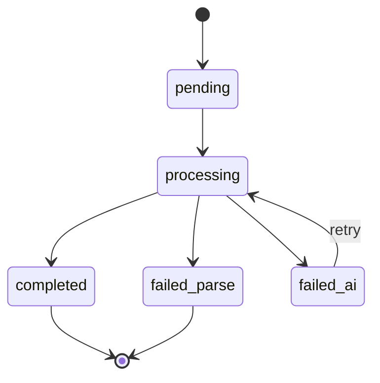

---

## 6. Technology Architecture

### 6.1 Technology Stack Map

| Layer | Technology | Role in ResumeRank AI |
| --- | --- | --- |
| Presentation | React | Component-based HR UI |
| Language | TypeScript | Type-safe application code |
| Build Tool | Vite | Fast development and production bundling |
| Styling | Tailwind CSS | Utility-first styling system |
| UI Kit | shadcn/ui | Accessible, composable UI primitives |
| Backend Platform | Supabase | Auth, database, storage, Edge Functions |
| Database | PostgreSQL | System of record |
| File Storage | Supabase Storage | Resume object storage |
| Authentication | Supabase Auth | Identity and session management |
| AI Model API | Google Gemini API | Semantic matching and summarization |
| PDF Parsing | pdf-parse | Extract text from PDF resumes |
| DOCX Parsing | mammoth | Extract text from DOCX resumes |
| Hosting | Vercel | Frontend deployment and CDN |

### 6.2 Technology Rationale

| Decision | Rationale | Alternatives Considered |
| --- | --- | --- |
| React + Vite + TypeScript | Mature SPA ecosystem, strong typing, excellent DX | Next.js (SSR not required for v1) |
| Tailwind + shadcn/ui | Rapid, consistent enterprise UI without heavy lock-in | MUI, Chakra UI |
| Supabase | Unified Auth/DB/Storage reduces custom backend cost | Firebase; custom NestJS + Postgres |
| Google Gemini | Strong text reasoning for JD–resume semantics | OpenAI GPT; local open-source LLMs |
| pdf-parse + mammoth | Lightweight Node-compatible parsers for common formats | Apache Tika; commercial parsing APIs |
| Vercel | Native fit for Vite/React with preview deployments | Netlify; Cloudflare Pages |

### 6.3 Architectural Decision Records (Summary)

| ADR | Decision | Status | Consequence |
| --- | --- | --- | --- |
| ADR-001 | Use Supabase as primary backend | Accepted | Speed and cohesion; platform coupling |
| ADR-002 | Use Gemini for match score and summary | Accepted | External dependency; cost/latency management required |
| ADR-003 | Host SPA on Vercel without SSR in v1 | Accepted | Simpler deploy; SEO not prioritized |
| ADR-004 | Run AI and privileged file processing in Edge Functions | Accepted | Protects secrets; adds function operational overhead |
| ADR-005 | Limit parsers to pdf-parse and mammoth in v1 | Accepted | Covers common formats; weak on scanned PDFs |
| ADR-006 | Keep human-in-the-loop decision making | Accepted | Ethical alignment; no autonomous rejection |
| ADR-007 | Documentation-first, one document at a time | Accepted | Higher artifact quality; sequential delivery |

### 6.4 Runtime Technology Topology

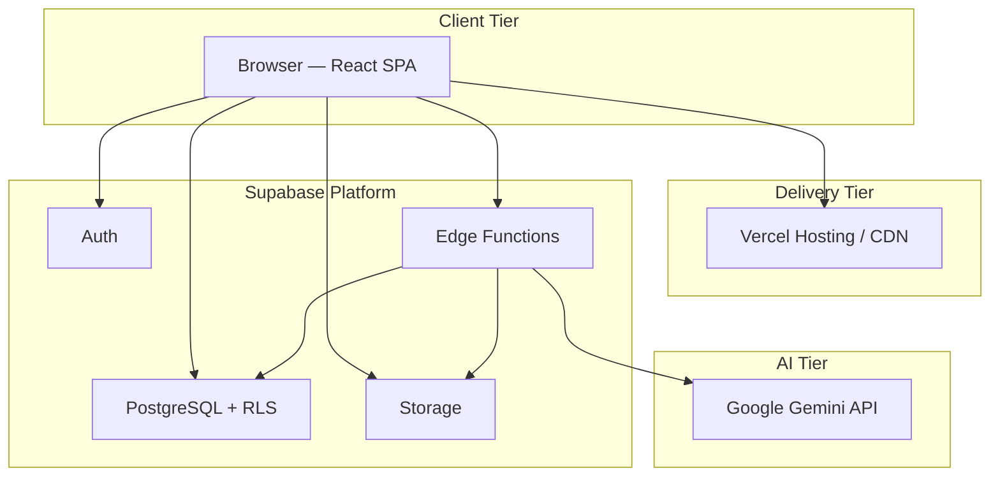

### 6.5 Configuration Classes

| Class | Examples | Location |
| --- | --- | --- |
| Public client config | `VITE_SUPABASE_URL`, `VITE_SUPABASE_ANON_KEY` | Vercel / local `.env` |
| Server secrets | `GEMINI_API_KEY`, service role key | Edge Function secrets / secured server env |
| Operational limits | Max upload size, allowed MIME types, model name | Env config and/or config table |

---

## 7. Deployment Architecture

### 7.1 Environments

| Environment | Frontend | Backend | Purpose |
| --- | --- | --- | --- |
| Local Development | Vite dev server | Supabase local or shared cloud project | Feature development and debugging |
| Preview | Vercel Preview deployment | Shared or branch-linked Supabase project | Pull request validation and demos |
| Production | Vercel Production | Supabase Production project | Live academic demo / operational use |

### 7.2 Deployment Topology

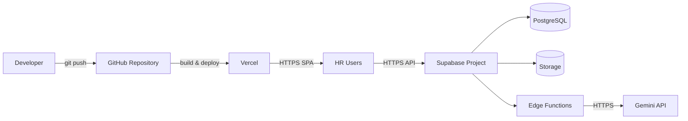

### 7.3 Deployment Responsibilities

| Component | Deployed To | Deployment Unit |
| --- | --- | --- |
| React SPA | Vercel | Static/edge-delivered frontend build |
| Database schema | Supabase | SQL migrations |
| Storage buckets | Supabase | Bucket + policy configuration |
| Screening Engine | Supabase Edge Functions | Function bundles + secrets |
| Secrets | Vercel / Supabase secret stores | Environment configuration |

### 7.4 Release Flow

1. Engineer commits to feature branch and opens pull request.
2. Vercel builds a Preview deployment.
3. Schema/function changes are applied to the target Supabase project through controlled migration/deploy steps.
4. After validation, changes merge to the main branch.
5. Vercel promotes Production frontend.
6. Production Supabase schema/functions are confirmed aligned with the release.

### 7.5 Operational Non-Functional Targets

| ID | Target | Design Response |
| --- | --- | --- |
| NFR-D-01 | HTTPS only in preview/production | Platform default on Vercel and Supabase |
| NFR-D-02 | Secrets never committed to git | Env/secret managers only |
| NFR-D-03 | Frontend deployable from repository CI | Vercel Git integration |
| NFR-D-04 | Screening failures observable per candidate | Status fields + function logs |

Detailed runbooks belong in the Deployment Guide (RR-DEP-011).

---

## 8. Data Flow

### 8.1 Core Data Domains

| Domain | Conceptual Entities | Persistence |
| --- | --- | --- |
| Identity | User, session, profile | Supabase Auth + profile table |
| Recruitment | Job opening, JD fields | PostgreSQL |
| Intake | Candidate, resume file metadata | PostgreSQL + Storage |
| Evaluation | Match score, rationale, AI summary, model metadata | PostgreSQL |
| Operations | Processing status, error information | PostgreSQL |
| Analytics | Counts, averages, distributions | SQL queries / views |

### 8.2 End-to-End Data Flow

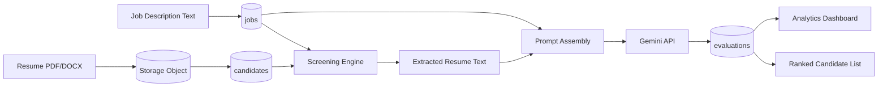

### 8.3 Data Flow by Stage

| Stage | Input | Transformation | Output |
| --- | --- | --- | --- |
| Job creation | HR form fields | Validate and persist | `jobs` row with JD text |
| Resume upload | Multipart files | MIME/size validation; store binary | Storage object + `candidates` row |
| Parsing | Storage object | pdf-parse or mammoth | Plain text content |
| AI evaluation | JD + resume text | Gemini structured generation | Score, rationale, summary |
| Persistence | AI JSON | Schema validation | `evaluations` row + status update |
| Ranking | Evaluations for a job | Sort by score descending | Ranked UI dataset |
| Analytics | Jobs/candidates/evaluations | Aggregate queries | Dashboard metrics |

### 8.4 Storage Strategy

| Data Asset | Store | Access Pattern |
| --- | --- | --- |
| Resume binaries | Supabase Storage bucket `resumes` | Write on upload; read by Screening Engine |
| JD and job metadata | PostgreSQL | CRUD from Job Module |
| Candidate metadata | PostgreSQL | List/filter by job |
| AI outputs | PostgreSQL | Rankings, summaries, audit |
| Auth identity | Supabase Auth | Session establishment |

### 8.5 Data Integrity Rules

| Rule | Description |
| --- | --- |
| Referential integrity | Candidates reference jobs; evaluations reference candidates/jobs |
| Status consistency | Evaluation write and status transition occur as one logical unit of work |
| Idempotency | Re-screening a candidate for a job updates or replaces prior evaluation deterministically |
| Least privilege | Client uses anon key + JWT; privileged operations use Edge Function role carefully |

Detailed ERD, indexing, and RLS policy SQL are deferred to Database Design (RR-DB-005).

---

## 9. AI Workflow

### 9.1 Workflow Objectives

The AI workflow converts a job description and resume text into an explainable match score, rationale, and HR-facing summary. It must be reliable under batch load, safe with secrets, and auditable for academic and operational review.

### 9.2 AI Pipeline Stages

| Stage | Description | Success Output |
| --- | --- | --- |
| Ingest | Accept and store resume; create pending candidate | Storage path + candidate id |
| Extract | Parse PDF/DOCX to text | Non-empty resume text |
| Normalize | Clean whitespace; truncate to model limits | Prompt-ready text |
| Assemble | Combine JD, resume text, and output schema instructions | Model prompt/payload |
| Infer | Call Google Gemini | Raw model response |
| Validate | Enforce JSON/schema expectations | Structured evaluation object |
| Persist | Save score, rationale, summary, model metadata | Evaluation record |
| Rank | Order candidates for the job | Ranked shortlist |

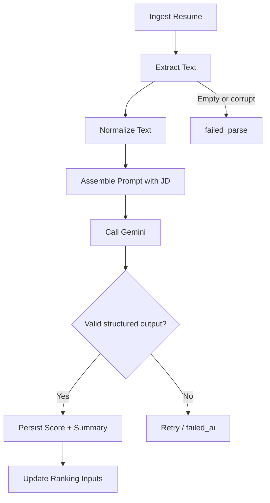

### 9.3 AI Placement Decision

All Gemini calls execute in a **trusted Edge Function / server context**. The browser never receives `GEMINI_API_KEY` and never constructs production AI calls directly.

### 9.4 Expected AI Outputs

| Output Field | Description | Consumer |
| --- | --- | --- |
| `match_score` | Numeric fitness score (0–100) | Ranking Module |
| `rationale` | Short explanation of score drivers | HR review UI |
| `summary` | Concise candidate summary for the job context | Summary views |
| `model_metadata` | Model identity / timing as available | Audit and MBA evidence |

Exact prompt text, rubrics, and temperature settings are specified in AI Design (RR-AI-008). This architecture fixes placement, sequencing, and persistence obligations only.

### 9.5 Failure Handling

| Failure | System Behavior |
| --- | --- |
| Unsupported file type | Reject at upload validation |
| Parse yields empty text | Mark `failed_parse`; continue batch |
| Gemini timeout or transport error | Retry with bounded backoff; then `failed_ai` |
| Invalid AI JSON | Reject persistence; log raw payload; retry policy applies |
| Partial batch success | Persist successes; surface failures in job UI |

### 9.6 Human-in-the-Loop Control

AI output informs ranking and summarization only. Final shortlisting decisions, interview progression, and hiring outcomes remain with HR users. The architecture intentionally excludes autonomous candidate rejection.

---

## 10. Module Interaction

### 10.1 Screening Sequence

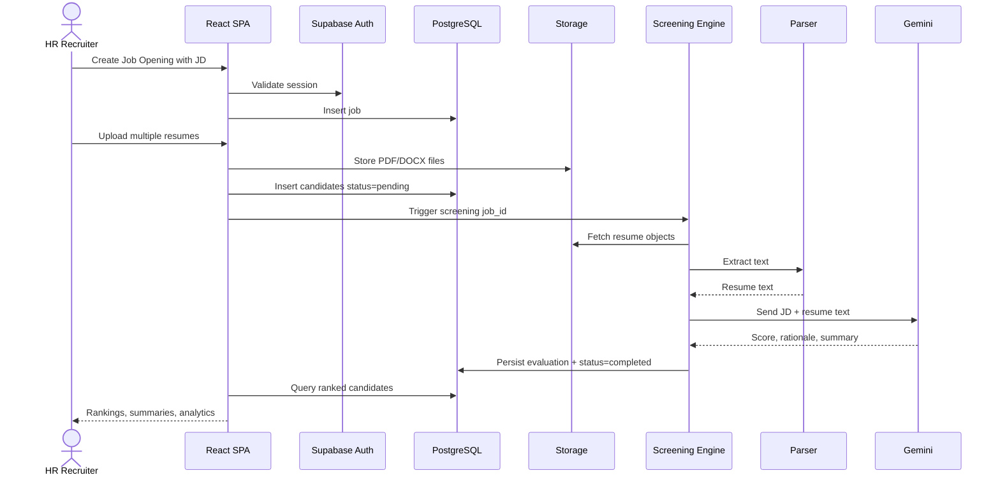

### 10.2 Module Interaction Matrix

| Module | Interacts With | Interaction Type |
| --- | --- | --- |
| Auth Module | All protected modules | Session gate |
| Job Module | Database; Ranking; Upload | Provides `job_id` and JD context |
| Upload Module | Storage; Database; Screening Engine | Creates intake records and triggers processing |
| Screening Engine | Parser; Gemini; Storage; Database | Core orchestration |
| Ranking Module | Database; Summary views | Reads evaluations |
| Analytics Module | Database | Reads aggregates across jobs/candidates |
| Summary Module | Database | Displays persisted AI summaries |

### 10.3 Interaction Rules

| Rule | Description |
| --- | --- |
| UI isolation | UI modules do not call Gemini directly |
| Parser isolation | Parsers return text only; they do not compute ranks |
| Engine authority | Only Screening Engine writes evaluation records |
| Job-centric processing | Screening and ranking are always scoped to a `job_id` |
| Status visibility | Upload and Ranking UIs must reflect candidate status transitions |

### 10.4 Planned Frontend Route Collaboration

| Route Area | Primary Modules | Collaboration |
| --- | --- | --- |
| `/login`, `/signup` | Auth | Establishes session for all others |
| `/dashboard` | Analytics | Reads cross-job metrics |
| `/jobs` | Job | Lists and creates openings |
| `/jobs/:id` | Job, Upload, Ranking, Summary | Main screening workspace |
| `/jobs/:id/analytics` | Analytics | Job-scoped charts and funnel |
| `/settings` | Auth / profile | User preferences |

---

## 11. Folder Structure

### 11.1 Repository Structure (Target)

The repository is organized to separate documentation, application source, Supabase backend assets, and shared types.

```text
resume-rank-ai-dev/
├── README.md
├── docs/
│   ├── 00-Documentation-Roadmap.md
│   ├── README.md
│   ├── 01-requirements/
│   │   ├── 01-Project-Architecture.md
│   │   ├── 02-Product-Requirements-Document.md
│   │   └── 03-Software-Requirements-Specification.md
│   ├── 02-design/
│   │   ├── 04-System-Design-Document.md
│   │   ├── 05-Database-Design-Document.md
│   │   ├── 06-API-Design-Specification.md
│   │   └── 07-UI-UX-Design-Document.md
│   ├── 03-specialty/
│   │   ├── 08-AI-Design-Document.md
│   │   ├── 09-Security-Design.md
│   │   └── 10-Testing-Document.md
│   ├── 04-delivery/
│   │   ├── 11-Deployment-Guide.md
│   │   └── 12-Cursor-Developer-Guide.md
│   └── 05-mba-report/
│       └── 13-Final-MBA-Report.md
├── apps/
│   └── web/                          # React + Vite + TypeScript SPA
│       ├── public/
│       ├── src/
│       │   ├── app/                  # routes, providers, app shell
│       │   ├── modules/
│       │   │   ├── auth/
│       │   │   ├── jobs/
│       │   │   ├── uploads/
│       │   │   ├── candidates/
│       │   │   ├── ranking/
│       │   │   └── analytics/
│       │   ├── components/           # shared UI (shadcn wrappers)
│       │   ├── lib/                  # supabase client, utilities
│       │   ├── types/                # shared frontend types
│       │   └── styles/
│       ├── package.json
│       ├── tsconfig.json
│       ├── vite.config.ts
│       └── tailwind.config.ts
├── supabase/
│   ├── migrations/                   # PostgreSQL migrations
│   ├── functions/
│   │   └── screen-candidates/        # Screening Engine Edge Function
│   ├── seed/                         # optional demo seeds
│   └── config.toml
├── packages/                         # optional shared contracts later
│   └── shared-types/
└── .env.example
```

### 11.2 Folder Responsibility Map

| Path | Responsibility |
| --- | --- |
| `docs/` | Authoritative project documentation suite |
| `apps/web/src/modules/*` | Feature modules aligned to component architecture |
| `apps/web/src/lib/` | Infrastructure clients and shared helpers |
| `supabase/migrations/` | Schema, indexes, RLS |
| `supabase/functions/screen-candidates/` | AI workflow orchestration |
| `.env.example` | Documented configuration keys without secret values |

### 11.3 Alignment Rule

New application code must land in the module folder that owns the capability. Cross-cutting UI primitives belong in `components/`. Cross-cutting clients belong in `lib/`. Documentation updates must follow RR-DOC-000 sequencing and never invent parallel undocumented architecture.

---

## 12. Development Roadmap

### 12.1 Delivery Philosophy

ResumeRank AI follows a **documentation-first, then implementation** approach. Documents are authored one at a time. Application construction intensifies once Phase 2 design inputs exist, while remaining governed by Phase 1 scope.

### 12.2 Documentation Phases

| Phase | Documents | Outcome |
| --- | --- | --- |
| 0 Planning | RR-DOC-000 | Sequence and governance |
| 1 Requirements | RR-ARCH-001, RR-PRD-002, RR-SRS-003 | Scope and requirements baseline |
| 2 Design | RR-SDD-004, RR-DB-005, RR-API-006, RR-UIX-007 | Buildable design |
| 3 Specialty | RR-AI-008, RR-SEC-009, RR-TEST-010 | AI, security, QA readiness |
| 4 Delivery | RR-DEP-011, RR-DEV-012 | Deploy and developer enablement |
| 5 Capstone | RR-MBA-013 | Academic synthesis |

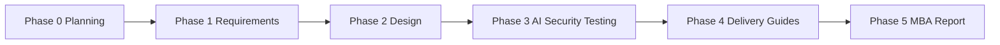

### 12.3 Application Development Waves

| Wave | Development Focus | Entry Criteria | Exit Criteria |
| --- | --- | --- | --- |
| Wave A — Foundation | Repo scaffolding, Auth, app shell, Supabase wiring | Architecture + PRD direction | Login works; protected routes exist |
| Wave B — Core HR Data | Jobs CRUD, upload to Storage, candidate records | SRS + System/DB design started | HR can create job and upload resumes |
| Wave C — AI Screening | Edge Function, parsers, Gemini, evaluations | AI Design + API contracts | Scores/summaries persist per candidate |
| Wave D — Ranking UX | Ranked lists, summaries, status handling | UI/UX Design | Job detail shows ranked shortlist |
| Wave E — Analytics & Harden | Dashboard, RLS verification, error states | Security Design | Analytics visible; security checks pass |
| Wave F — Release | Vercel production, seeds/demo, test evidence | Deployment Guide + Testing Document | Deployed demo ready for MBA report |

### 12.4 Strict Document Creation Order

| Order | Document ID | Document | Development Use |
| --- | --- | --- | --- |
| 1 | RR-DOC-000 | Documentation Roadmap | Sequencing |
| 2 | RR-ARCH-001 | Project Architecture | Stack and boundaries |
| 3 | RR-PRD-002 | Product Requirements Document | Scope and priorities |
| 4 | RR-SRS-003 | Software Requirements Specification | Testable requirements |
| 5 | RR-SDD-004 | System Design Document | Module design |
| 6 | RR-DB-005 | Database Design Document | Schema and RLS |
| 7 | RR-API-006 | API Design Specification | Integration contracts |
| 8 | RR-UIX-007 | UI/UX Design Document | Screens and flows |
| 9 | RR-AI-008 | AI Design Document | Gemini pipeline detail |
| 10 | RR-SEC-009 | Security Design | Hardening |
| 11 | RR-TEST-010 | Testing Document | QA and acceptance |
| 12 | RR-DEP-011 | Deployment Guide | Ship/run procedures |
| 13 | RR-DEV-012 | Cursor Developer Guide | Daily implementation playbook |
| 14 | RR-MBA-013 | Final MBA Report | Academic submission |

### 12.5 Immediate Next Step

After acceptance of this Project Architecture Document (RR-ARCH-001 v2.0.0), the next document to author is **Product Requirements Document (RR-PRD-002)**. No later design documents should be authored before PRD and SRS complete Phase 1.

---

## 13. Mermaid Diagrams

This section catalogs every Mermaid diagram embedded in Document 01 for review, reuse, and MBA report traceability.

| Diagram ID | Section | Diagram Type | Purpose |
| --- | --- | --- | --- |
| D-01 | 2.4 | Flowchart | Business value stream |
| D-02 | 3.2 | C4 Context | System context and external systems |
| D-03 | 4.1 | Flowchart | Layered high-level architecture |
| D-04 | 4.3 | Flowchart | End-to-end high-level runtime flow |
| D-05 | 5.2 | Flowchart | Component architecture |
| D-06 | 5.4 | State diagram | Candidate processing states |
| D-07 | 6.4 | Flowchart | Technology runtime topology |
| D-08 | 7.2 | Flowchart | Deployment topology |
| D-09 | 8.2 | Flowchart | End-to-end data flow |
| D-10 | 9.2 | Flowchart | AI workflow pipeline |
| D-11 | 10.1 | Sequence diagram | Module interaction during screening |
| D-12 | 12.2 | Flowchart | Documentation/development phase roadmap |

### 13.1 Diagram Governance

| Rule | Description |
| --- | --- |
| Single source | Diagrams in this document are normative for architecture-level views |
| Downstream refinement | System Design and AI Design may refine diagrams but must not contradict trust boundaries or layer responsibilities |
| Tooling | Mermaid is the standard diagram syntax for repository documentation |
| Change control | Material diagram changes require a version bump of RR-ARCH-001 |

---

## 14. Conclusion

ResumeRank AI is architected as a secure, cloud-native, human-in-the-loop recruitment screening platform. The business architecture centers on reducing first-pass screening effort while preserving HR decision authority. The system architecture combines a React/TypeScript SPA, Supabase backend services, and Google Gemini intelligence, deployed through Vercel.

High-level and component views establish clear boundaries among presentation, application, domain, and infrastructure concerns. Technology and deployment architectures favor managed services to achieve production readiness within academic constraints. Data flow and AI workflow definitions ensure that resume intake, parsing, scoring, summarization, ranking, and analytics form one coherent pipeline. Module interaction rules and folder structure translate architecture into implementable repository practice. The development roadmap ties documentation phases to application delivery waves.

This document is the architectural baseline for all subsequent ResumeRank AI work. Product requirements, software requirements, detailed design, implementation, testing, deployment, and the Final MBA Report must remain consistent with the decisions recorded here.

---

## 15. Future Scope

| Area | Potential Enhancement | Architectural Impact |
| --- | --- | --- |
| Multi-tenancy | Organization workspaces and richer RBAC | Expanded identity model and RLS |
| Hiring Manager portal | Read-only or collaborative shortlists | New actor pathways in UI and authz |
| OCR support | Scanned PDF handling | Additional parsing/OCR service |
| Provider flexibility | Pluggable LLM providers | Stronger AI adapter abstraction |
| Realtime progress | Live screening status updates | Supabase Realtime subscriptions |
| Bias monitoring | Fairness analytics where lawful and appropriate | New analytics and ethics controls |
| ATS integrations | Import jobs/candidates from external systems | New integration boundary |
| Interview scheduling | Progress from shortlist to interview | New domain module |

Future scope items are intentionally excluded from v1 architecture commitments unless promoted through PRD/SRS change control.

---

## 16. References

1. RR-DOC-000 — ResumeRank AI Documentation Roadmap v1.0.0.
2. ISO/IEC/IEEE 42010 — Systems and software engineering — Architecture description (conceptual alignment).
3. Bass, L., Clements, P., Kazman, R. — *Software Architecture in Practice* — quality attributes and architectural views.
4. Supabase Documentation — Auth, Database, Storage, Edge Functions.
5. Google AI Gemini API Documentation — generative model integration.
6. React, Vite, and TypeScript official documentation.
7. Tailwind CSS and shadcn/ui documentation.
8. Vercel Documentation — frontend deployment and environment configuration.
9. pdf-parse and mammoth library documentation — resume text extraction.
10. Project charter inputs — ResumeRank AI MBA Final Year Project brief (internal).

---

## 17. Appendices

### Appendix A — Non-Functional Architecture Checklist

| ID | Requirement | Architecture Response |
| --- | --- | --- |
| NFR-A-01 | Authenticated access to application data | Supabase Auth + protected routes |
| NFR-A-02 | Row-level isolation of user/job data | PostgreSQL RLS |
| NFR-A-03 | No browser exposure of Gemini secrets | Edge Function-only AI calls |
| NFR-A-04 | Batch resilience | Per-candidate status and failure isolation |
| NFR-A-05 | Auditable AI outcomes | Persist score, summary, timestamps, model metadata |
| NFR-A-06 | Deployable frontend | Vercel Git-based deployment |
| NFR-A-07 | Explainable ranking | Rationale stored and displayed |

### Appendix B — Risk Register (Architecture Level)

| ID | Risk | Impact | Likelihood | Mitigation |
| --- | --- | --- | --- | --- |
| R-01 | Gemini output schema drift | Medium | Medium | Strict validation and retries |
| R-02 | Poor parse quality on scanned PDFs | High | Medium | Detect empty text; mark failed_parse |
| R-03 | Secret leakage | Critical | Low | Edge-only secrets; no client AI keys |
| R-04 | Platform quota limits during demos | Medium | Medium | Monitor usage; document upgrade path |
| R-05 | Bias in AI ranking | High | Medium | Transparent rationale; HR override; documented limits |

### Appendix C — Document Control

| Item | Value |
| --- | --- |
| Storage path | `docs/01-requirements/01-Project-Architecture.md` |
| Current version | 2.0.0 |
| Review trigger | Any ADR change, trust-boundary change, or stack change |
| Supersedes | RR-ARCH-001 v1.0.0 |
| Next document | RR-PRD-002 Product Requirements Document |

---

**End of Document — Document 01 — RR-ARCH-001 — Project Architecture Document v2.0.0**
