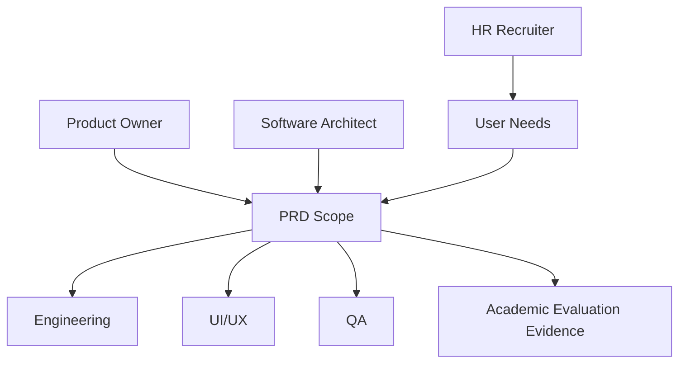
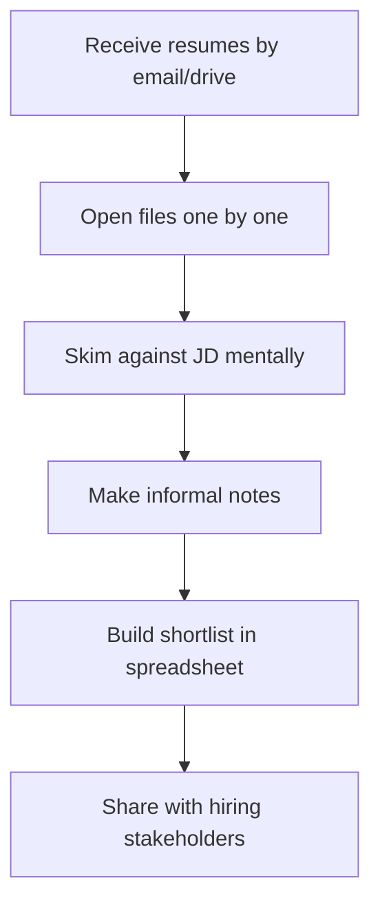
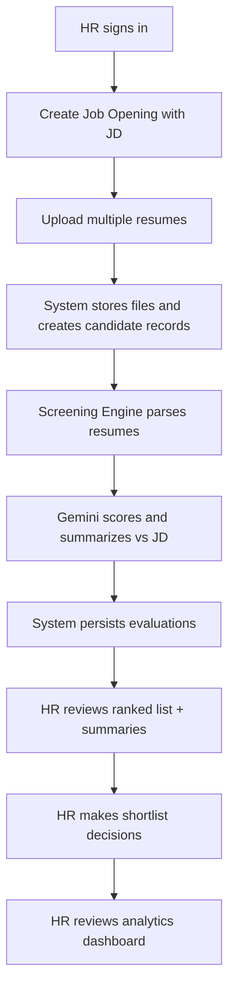
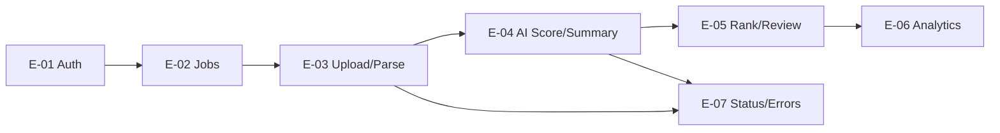
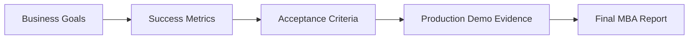
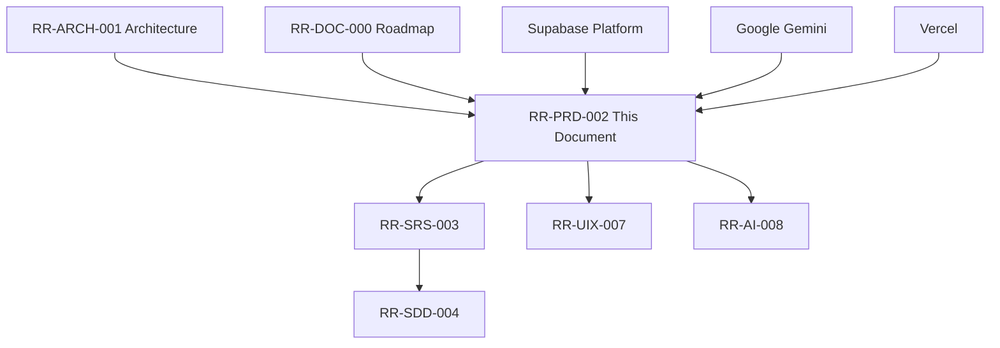

# ResumeRank AI

# Product Requirements Document (PRD)

**Document 02 — RR-PRD-002**

---

## Cover Page

| | |
| --- | --- |
| **Project Name** | ResumeRank AI |
| **Document Title** | Product Requirements Document |
| **Document Number** | Document 02 |
| **Document ID** | RR-PRD-002 |
| **Version** | 1.0.0 |
| **Status** | Baseline — Ready for SRS |
| **Classification** | Internal — MBA Final Year Project |
| **Specialization** | Artificial Intelligence & Data Science |
| **Document Type** | Product Requirements |
| **Author** | Vish Var |
| **Role** | Product Owner / Project Lead |
| **Organization** | ResumeRank AI Development Team |
| **Prepared For** | Academic Evaluation & Development Team |
| **Date** | 11 July 2026 |
| **Upstream Dependency** | Project Architecture (RR-ARCH-001 v2.0.0) |
| **Governing Plan** | Documentation Roadmap (RR-DOC-000) |
| **Next Document** | Software Requirements Specification (RR-SRS-003) |

---

### Document Control Statement

This Product Requirements Document defines **what** ResumeRank AI must deliver as a product. It translates the architectural baseline in RR-ARCH-001 into business goals, user needs, prioritized functional capabilities, non-functional expectations, success metrics, and acceptance criteria.

This PRD does not replace the Software Requirements Specification. RR-SRS-003 will formalize requirements into testable shall-statements. This PRD establishes product intent, scope boundaries, prioritization, and acceptance framing for that downstream work.

---

## Version History

| Version | Date | Author | Description of Change | Review Status |
| --- | --- | --- | --- | --- |
| 0.1.0 | 11 July 2026 | Vish Var | Outline drafted from RR-ARCH-001 business architecture | Draft |
| 1.0.0 | 11 July 2026 | Vish Var | Complete enterprise PRD with prioritized requirements, metrics, acceptance criteria, and traceability to architecture | Current |

---

## Table of Contents

1. [Executive Summary](#1-executive-summary)
2. [Business Problem](#2-business-problem)
3. [Business Goals](#3-business-goals)
4. [Stakeholders](#4-stakeholders)
5. [Target Users](#5-target-users)
6. [Business Process](#6-business-process)
7. [Product Scope](#7-product-scope)
8. [Functional Requirements](#8-functional-requirements)
9. [Non Functional Requirements](#9-non-functional-requirements)
10. [Success Metrics](#10-success-metrics)
11. [Acceptance Criteria](#11-acceptance-criteria)
12. [Assumptions](#12-assumptions)
13. [Constraints](#13-constraints)
14. [Future Scope](#14-future-scope)
15. [Dependencies](#15-dependencies)
16. [Glossary](#16-glossary)
17. [References](#17-references)
18. [Appendices](#18-appendices)

---

## 1. Executive Summary

**ResumeRank AI** is an AI-powered Resume Screening and Candidate Ranking System for Human Resources (HR) professionals. The product enables HR users to create job openings, upload multiple resumes, extract candidate information, compare each resume to the Job Description (JD), generate an AI match score and summary using Google Gemini, rank candidates, and review screening analytics on a dashboard.

The product addresses the cost and inconsistency of manual first-pass screening. It standardizes early evaluation against a shared JD, produces explainable rankings, and keeps hiring decisions with humans. ResumeRank AI is explicitly **human-in-the-loop**: the system ranks and summarizes; it does not auto-reject or auto-hire candidates.

### 1.1 Product Positioning

| Dimension | Statement |
| --- | --- |
| Product category | AI-assisted recruitment screening platform |
| Primary buyer/user | HR Recruiter / Talent Partner |
| Core value proposition | Faster, more consistent, explainable first-pass shortlisting |
| Delivery model | Web SPA on Vercel with Supabase backend and Gemini AI |
| Project context | MBA Final Year Project — Artificial Intelligence & Data Science |
| Architectural baseline | RR-ARCH-001 v2.0.0 |

### 1.2 Product Outcomes for v1

| Outcome | Description |
| --- | --- |
| Operational | HR can complete job → upload → screen → rank → review in one product flow |
| Analytical | HR can view screening volumes, statuses, and score patterns |
| Technical | Secure auth, private resume storage, edge-hosted AI calls, persisted evaluations |
| Academic | Demonstrable AI workflow with auditability and professional documentation |

### 1.3 Explicit Non-Goals for v1

| Non-Goal | Rationale |
| --- | --- |
| Replace HR decision-making | Conflicts with human-in-the-loop principle (RR-ARCH-001 BR-02) |
| Candidate self-service portal | Candidates are data subjects, not users, in v1 |
| Full ATS / HRIS replacement | Out of system boundary per architecture |
| OCR for scanned image-only PDFs | Parser constraint; flagged as future scope |
| Multi-company enterprise tenancy | Simple ownership model sufficient for v1 |

---

## 2. Business Problem

### 2.1 Problem Statement

Organizations receive more applications than recruiters can evaluate consistently in the early screening stage. Manual review is time-consuming, subjective across reviewers, difficult to scale for bulk intake, and weak at producing comparable, explainable shortlists. As a result, strong candidates may be delayed or overlooked, while recruiters spend excessive time on low-fit resumes.

### 2.2 Problem Evidence Themes

| Theme | Observed Business Impact |
| --- | --- |
| Time cost | High hours per job spent on first-pass filtering |
| Inconsistency | Different recruiters apply different implicit standards |
| Weak comparability | Hard to rank large batches fairly against one JD |
| Poor audit trail | Limited record of why candidates were advanced or deferred |
| Scale pressure | Bulk resume intake overwhelms manual workflows |

### 2.3 Problem Boundary

The product solves **first-pass screening assistance**. It does not solve interview scheduling, offer management, payroll onboarding, or end-to-end applicant tracking. Those remain outside the ResumeRank AI v1 boundary, consistent with RR-ARCH-001 Section 3.3.

### 2.4 Cost of Inaction

| If Unsolved | Consequence |
| --- | --- |
| Continued manual screening | Slow shortlists and recruiter burnout |
| No shared scoring basis | Inconsistent candidate treatment |
| No AI rationale trail | Weak defensibility for academic and operational review |
| No screening analytics | Limited visibility into funnel health |

---

## 3. Business Goals

Business goals below map directly to architecture objectives BO-01 through BO-06 in RR-ARCH-001.

| Goal ID | Business Goal | Product Interpretation | Architecture Trace |
| --- | --- | --- | --- |
| BG-01 | Reduce time-to-shortlist | Automate parse, score, and rank after bulk upload | BO-01 |
| BG-02 | Improve screening consistency | Evaluate all candidates for a job against the same JD via AI | BO-02 |
| BG-03 | Provide explainable rankings | Show match score, rationale, and summary per candidate | BO-03 |
| BG-04 | Increase screening visibility | Provide dashboard analytics for jobs, statuses, and scores | BO-04 |
| BG-05 | Preserve human authority | Support review workflows without autonomous reject/hire | BO-05 |
| BG-06 | Deliver an academically defensible AI product | Persist AI outputs and complete documentation suite | BO-06 |

### 3.1 Product Principles

| Principle | Product Implication |
| --- | --- |
| Human-in-the-loop | AI advises; HR decides |
| Explainability over opacity | Every completed evaluation exposes score drivers |
| Batch resilience | One failed resume must not fail the entire upload set |
| Security by default | Authenticated access; private files; no browser AI secrets |
| Job-centric workflow | Screening and ranking are always scoped to a job opening |
| Documentation-first delivery | Requirements and design precede implementation waves |

### 3.2 Goal Success Linkage

| Business Goal | Leading Indicator | Lagging Indicator |
| --- | --- | --- |
| BG-01 | Screening completes for a batch without manual scoring | Shortlist available in one continuous session |
| BG-02 | Same JD used for all candidates in a job | Rank order produced from shared score basis |
| BG-03 | Rationale visible on candidate detail/list | Reviewers can explain top-ranked selections |
| BG-04 | Dashboard loads job and status metrics | Recruiter can report screening progress |
| BG-05 | No auto-reject action exists in UI | Final decisions remain manual |
| BG-06 | Evaluations store score/summary/timestamp | Demo and MBA evidence pack available |

---

## 4. Stakeholders

| Stakeholder | Interest | Influence | Engagement Need |
| --- | --- | --- | --- |
| HR Recruiter / Talent Partner | Faster, trustworthy shortlisting | High | Primary product feedback and acceptance |
| Project Lead / Product Owner | Scope control and delivery quality | High | Prioritization and change control |
| Software Architect | Alignment with RR-ARCH-001 | High | Architecture compliance review |
| Full-Stack Engineers | Clear build scope and priorities | High | Implementation guidance from PRD/SRS |
| AI Solution Architect | Feasible scoring/summary behavior | Medium | AI Design input after SRS |
| Database Designer | Data domains implied by features | Medium | Schema design from PRD entities |
| UI/UX Designer | Usable HR flows | Medium | Screen design from journeys in this PRD |
| QA / Testers | Testable acceptance outcomes | Medium | Acceptance criteria and later SRS/TEST docs |
| Academic Evaluator | Evidence of AI + software engineering rigor | High | Demo, docs, and report quality |
| Platform Providers (Supabase, Vercel, Google) | Service availability and limits | Medium | Operational dependency management |

---

## 5. Target Users

### 5.1 Primary User Persona — HR Recruiter

| Attribute | Description |
| --- | --- |
| Persona name | Priya, HR Recruiter |
| Role | Talent acquisition / recruiting operations |
| Goals | Create jobs quickly, screen bulk resumes, produce a ranked shortlist, justify top candidates |
| Pain points | Manual PDF reading, inconsistent scoring, slow turnaround, weak reporting |
| Environment | Desktop browser, cloud tools, frequent multi-file uploads |
| Success moment | Opens a job, uploads 20 resumes, reviews ranked list with scores and summaries |

### 5.2 Secondary User — Project / System Operator

| Attribute | Description |
| --- | --- |
| Role | Lightweight administrator / project operator |
| Goals | Ensure environment works for demos; monitor failed screenings |
| Pain points | Secret misconfiguration, quota issues, opaque failures |
| v1 expectation | Operational readiness via deployment docs; not a full admin console product |

### 5.3 Non-Users in v1

| Party | Status in v1 | Notes |
| --- | --- | --- |
| Candidate / Applicant | Non-user | Resume is uploaded by HR; no candidate login |
| Hiring Manager | Out of core v1 | May view shortlists in future scope |
| External ATS systems | Out of scope | No integrations in v1 |

### 5.4 User Needs Summary

| Need ID | User Need | Priority |
| --- | --- | --- |
| UN-01 | Authenticate securely and access only own screening data | Must |
| UN-02 | Create and manage job openings with JD text | Must |
| UN-03 | Upload multiple PDF/DOCX resumes to a job | Must |
| UN-04 | Automatically extract usable resume text | Must |
| UN-05 | Receive AI match scores against the JD | Must |
| UN-06 | View ranked candidates for a job | Must |
| UN-07 | Read AI-generated candidate summaries and rationales | Must |
| UN-08 | See processing status and failures clearly | Must |
| UN-09 | View analytics for screening activity | Should |
| UN-10 | Retry failed AI evaluations | Should |
| UN-11 | Edit job JD and re-screen if needed | Could |
| UN-12 | Export shortlist | Could / Future |

---

## 6. Business Process

### 6.1 As-Is Process (Manual Screening)

| Pain in As-Is | Effect |
| --- | --- |
| Sequential file review | Slow cycle time |
| Implicit criteria | Inconsistent outcomes |
| Spreadsheet ranking | Weak auditability |
| No standard score | Poor comparability |

### 6.2 To-Be Process (ResumeRank AI)

### 6.3 Process Stages and Ownership

| Stage | Owner | System Responsibility | Human Responsibility |
| --- | --- | --- | --- |
| Authenticate | HR | Session and route protection | Provide credentials |
| Define job | HR | Persist job + JD | Write accurate JD |
| Ingest resumes | HR + System | Validate, store, create records | Select correct files |
| Extract | System | Parse PDF/DOCX | Review failed_parse cases |
| Evaluate | System | Call Gemini; validate output | None during inference |
| Rank | System | Order by match score | Interpret rankings |
| Decide | HR | Present evidence | Shortlist / next-step decisions |
| Analyze | HR + System | Aggregate metrics | Act on insights |

### 6.4 Business Rules Applied in Process

| Rule ID | Process Rule | Source |
| --- | --- | --- |
| BR-01 | Only authenticated HR users perform job/upload actions | RR-ARCH-001 |
| BR-02 | AI ranks/summarizes; does not auto-reject/hire | RR-ARCH-001 |
| BR-03 | Successful evaluations retain score, summary, timestamp | RR-ARCH-001 |
| BR-04 | Single candidate failure does not abort batch | RR-ARCH-001 |
| BR-05 | Gemini credentials remain server/edge-only | RR-ARCH-001 |
| BR-06 | Only PDF and DOCX accepted in v1 | RR-ARCH-001 |

### 6.5 Candidate Status in Business Process

| Status | Business Meaning |
| --- | --- |
| `pending` | Uploaded; waiting for screening |
| `processing` | Currently parsing or evaluating |
| `completed` | Score and summary available for review |
| `failed_parse` | Resume text could not be extracted |
| `failed_ai` | AI evaluation failed after retries |

These statuses are normative for product behavior and align with RR-ARCH-001 Section 5.4.

---

## 7. Product Scope

### 7.1 In Scope for v1

| Scope Area | Included Capability |
| --- | --- |
| Identity | Sign up / sign in / sign out via Supabase Auth |
| Jobs | Create, list, view, update job openings and JD text |
| Uploads | Multi-file PDF/DOCX upload per job |
| Parsing | Text extraction via pdf-parse and mammoth |
| AI screening | Match score, rationale, and summary via Gemini |
| Ranking | Ranked candidate list per job |
| Status handling | Visible processing and failure states |
| Analytics | Dashboard metrics for jobs/candidates/scores/statuses |
| Security | Authenticated access, private storage, RLS-oriented data isolation |
| Deployment target | Vercel frontend + Supabase backend |

### 7.2 Out of Scope for v1

| Excluded Item | Disposition |
| --- | --- |
| Candidate login portal | Future scope |
| Hiring Manager role workflows | Future scope |
| ATS/HRIS integrations | Future scope |
| Interview scheduling | Future scope |
| OCR for image-only scans | Future scope |
| Multi-provider LLM switching UI | Future scope |
| Automated rejection emails | Explicitly excluded |
| Mobile-native applications | Not planned; responsive web only |
| Realtime collaborative editing | Future/optional |

### 7.3 MoSCoW Summary

| Priority | Meaning in This PRD |
| --- | --- |
| Must | Required for v1 product acceptance |
| Should | Expected for a strong v1; defer only with explicit approval |
| Could | Desirable if schedule allows after Must/Should |
| Won't (v1) | Acknowledged and deferred |

---

## 8. Functional Requirements

Functional requirements are product capabilities. Detailed shall-level decomposition and test procedures belong in RR-SRS-003. IDs below are stable for traceability.

### 8.1 Epic Map

| Epic ID | Epic | Goal Trace |
| --- | --- | --- |
| E-01 | Authentication & Access | BG-05, BG-06 |
| E-02 | Job Opening Management | BG-01, BG-02 |
| E-03 | Resume Intake & Parsing | BG-01 |
| E-04 | AI Matching & Summarization | BG-02, BG-03 |
| E-05 | Candidate Ranking & Review | BG-01, BG-03, BG-05 |
| E-06 | Analytics Dashboard | BG-04 |
| E-07 | Processing Status & Error Handling | BG-01, BG-06 |

### 8.2 Authentication & Access

| Req ID | Requirement | Priority | User Need |
| --- | --- | --- | --- |
| FR-01 | The system shall allow HR users to register and sign in using Supabase Auth | Must | UN-01 |
| FR-02 | The system shall protect application routes so unauthenticated users cannot access jobs, uploads, rankings, or analytics | Must | UN-01 |
| FR-03 | The system shall allow signed-in users to sign out and end the session | Must | UN-01 |
| FR-04 | The system shall restrict job, candidate, and evaluation data access according to authenticated user ownership via platform security controls | Must | UN-01 |

### 8.3 Job Opening Management

| Req ID | Requirement | Priority | User Need |
| --- | --- | --- | --- |
| FR-05 | The system shall allow HR users to create a job opening with title and JD text | Must | UN-02 |
| FR-06 | The system shall allow HR users to list and open their job openings | Must | UN-02 |
| FR-07 | The system shall allow HR users to update job title and JD text | Should | UN-02, UN-11 |
| FR-08 | The system shall associate all uploads, candidates, and evaluations with a specific job | Must | UN-02 |
| FR-09 | The system shall prevent screening without a persisted JD for the job | Must | UN-02, UN-05 |

### 8.4 Resume Intake & Parsing

| Req ID | Requirement | Priority | User Need |
| --- | --- | --- | --- |
| FR-10 | The system shall allow multiple resume files to be uploaded for a single job in one action | Must | UN-03 |
| FR-11 | The system shall accept PDF and DOCX resume formats only in v1 | Must | UN-03 |
| FR-12 | The system shall reject unsupported file types with a clear validation message | Must | UN-03, UN-08 |
| FR-13 | The system shall store resume binaries in private Supabase Storage | Must | UN-03 |
| FR-14 | The system shall create a candidate record for each accepted upload with initial status `pending` | Must | UN-03, UN-08 |
| FR-15 | The system shall extract text from PDF resumes using pdf-parse and from DOCX resumes using mammoth | Must | UN-04 |
| FR-16 | The system shall mark candidates as `failed_parse` when extraction yields unusable/empty text | Must | UN-08 |
| FR-17 | The system shall continue processing remaining files when one file fails validation or parsing | Must | UN-03, UN-08 |

### 8.5 AI Matching & Summarization

| Req ID | Requirement | Priority | User Need |
| --- | --- | --- | --- |
| FR-18 | The system shall evaluate each parseable resume against the job JD using Google Gemini | Must | UN-05 |
| FR-19 | The system shall produce a numeric match score on a 0–100 scale for each successful evaluation | Must | UN-05 |
| FR-20 | The system shall produce a human-readable rationale explaining the score | Must | UN-07 |
| FR-21 | The system shall produce an AI candidate summary for HR review | Must | UN-07 |
| FR-22 | The system shall execute Gemini calls only from trusted server/edge context | Must | UN-01 |
| FR-23 | The system shall persist score, rationale, summary, timestamp, and model metadata for successful evaluations | Must | UN-05, UN-07 |
| FR-24 | The system shall mark candidates as `failed_ai` when AI evaluation fails after configured retries | Must | UN-08 |
| FR-25 | The system shall allow retry of `failed_ai` candidates for a job | Should | UN-10 |
| FR-26 | The system shall not provide an automated reject or automated hire action | Must | UN-06 / BG-05 |

### 8.6 Candidate Ranking & Review

| Req ID | Requirement | Priority | User Need |
| --- | --- | --- | --- |
| FR-27 | The system shall display candidates for a job ranked by match score descending | Must | UN-06 |
| FR-28 | The system shall show each ranked candidate’s score, status, and summary access | Must | UN-06, UN-07 |
| FR-29 | The system shall allow HR users to open candidate detail including rationale and summary | Must | UN-07 |
| FR-30 | The system shall include failed candidates in the job view with failure status visible | Must | UN-08 |
| FR-31 | The system shall allow filtering or clear segmentation by status within a job | Should | UN-08 |
| FR-32 | The system shall support pagination or progressive listing for larger candidate sets | Should | UN-06 |

### 8.7 Analytics Dashboard

| Req ID | Requirement | Priority | User Need |
| --- | --- | --- | --- |
| FR-33 | The system shall provide a dashboard showing total jobs, total candidates, and completed evaluations | Must | UN-09 |
| FR-34 | The system shall show status distribution (pending/processing/completed/failed) | Should | UN-09 |
| FR-35 | The system shall show score summary metrics such as average score and/or score distribution for completed evaluations | Should | UN-09 |
| FR-36 | The system shall provide job-level analytics on the job workspace or a job analytics view | Should | UN-09 |

### 8.8 Processing Status & Error Handling

| Req ID | Requirement | Priority | User Need |
| --- | --- | --- | --- |
| FR-37 | The system shall transition candidate status through `pending` → `processing` → terminal states defined in architecture | Must | UN-08 |
| FR-38 | The system shall display job-level processing progress or aggregate status counts during/after screening | Must | UN-08 |
| FR-39 | The system shall surface actionable error messages for unsupported files, parse failures, and AI failures | Must | UN-08 |
| FR-40 | The system shall preserve successfully completed evaluations when other candidates in the same batch fail | Must | UN-08 |

### 8.9 Could / Won’t Features

| Req ID | Requirement | Priority |
| --- | --- | --- |
| FR-41 | The system may allow exporting ranked shortlist to CSV | Could |
| FR-42 | The system may allow JD version notes when JD is edited | Could |
| FR-43 | The system will not send candidate-facing emails in v1 | Won't |
| FR-44 | The system will not provide Hiring Manager-specific role permissions in v1 | Won't |
| FR-45 | The system will not perform OCR on image-only PDFs in v1 | Won't |

---

## 9. Non Functional Requirements

Non-functional requirements define product quality expectations. Architecture responses are aligned to RR-ARCH-001 quality priorities.

### 9.1 Security

| NFR ID | Requirement | Priority |
| --- | --- | --- |
| NFR-01 | All production/preview traffic shall use HTTPS | Must |
| NFR-02 | Resume files shall be stored in private storage, not public buckets | Must |
| NFR-03 | Gemini API keys and service-role secrets shall not be exposed to the browser | Must |
| NFR-04 | Data access shall be constrained by authentication and row-level/ownership controls | Must |
| NFR-05 | Upload validation shall enforce allowed MIME/types and size limits | Must |

### 9.2 Reliability & Resilience

| NFR ID | Requirement | Priority |
| --- | --- | --- |
| NFR-06 | Batch screening shall support partial success | Must |
| NFR-07 | AI calls shall implement bounded retry for transient failures | Should |
| NFR-08 | Failed candidates shall remain inspectable after batch completion | Must |

### 9.3 Performance & Scalability

| NFR ID | Requirement | Priority |
| --- | --- | --- |
| NFR-09 | Core dashboard and job list should load within 3 seconds under normal demo conditions on broadband | Should |
| NFR-10 | The product shall support at least 20 resumes per job in the v1 demo profile | Must |
| NFR-11 | Screening of multi-file uploads shall run asynchronously so the UI is not permanently blocked | Must |
| NFR-12 | Ranked lists shall remain usable as candidate counts grow via pagination or equivalent | Should |

### 9.4 Usability & Accessibility

| NFR ID | Requirement | Priority |
| --- | --- | --- |
| NFR-13 | The primary HR path (login → create job → upload → view ranking) shall be completable without a training manual | Must |
| NFR-14 | Processing and failure states shall be visually distinct and understandable | Must |
| NFR-15 | UI shall follow accessible component practices via shadcn/ui primitives and semantic structure | Should |
| NFR-16 | Layout shall be responsive for desktop-first use with usable tablet layouts | Should |

### 9.5 Auditability & Maintainability

| NFR ID | Requirement | Priority |
| --- | --- | --- |
| NFR-17 | Every successful evaluation shall retain score, summary, timestamp, and model identity metadata | Must |
| NFR-18 | Application code shall be TypeScript-first with modular feature boundaries matching architecture modules | Should |
| NFR-19 | Configuration shall be environment-driven with an `.env.example` documenting required keys | Must |
| NFR-20 | AI adapters and parsers shall be isolatable for testing with mocks | Should |

### 9.6 Availability & Operability

| NFR ID | Requirement | Priority |
| --- | --- | --- |
| NFR-21 | Frontend shall be deployable to Vercel from the Git repository | Must |
| NFR-22 | Backend services shall run on Supabase project configuration documented for deployment | Must |
| NFR-23 | Operational failures in Edge Functions shall be diagnosable via logs and candidate status | Should |

---

## 10. Success Metrics

Success metrics measure whether the product achieves business goals. Targets below are for v1 academic/demo production readiness.

### 10.1 Product Success Metrics

| Metric ID | Metric | Definition | Target (v1) | Goal Trace |
| --- | --- | --- | --- | --- |
| SM-01 | End-to-end screening completion | Ability to create job, upload resumes, and obtain ranked completed evaluations in one flow | 100% of happy-path demo script | BG-01 |
| SM-02 | Batch resilience rate | Share of valid parseable resumes that still complete when one file in batch fails | Partial success preserved in all failure drills | BG-01 |
| SM-03 | Explainability coverage | Completed evaluations with score + rationale + summary present | 100% of `completed` candidates | BG-03 |
| SM-04 | Ranking availability | Jobs with ≥1 completed evaluation show descending score rank | 100% | BG-02, BG-03 |
| SM-05 | Analytics usefulness | Dashboard shows jobs, candidates, completed count, and status visibility | Available in production demo | BG-04 |
| SM-06 | Human control integrity | Absence of auto-reject/auto-hire actions | 0 autonomous decision actions | BG-05 |
| SM-07 | Security baseline | No client-exposed Gemini key; private resume storage; auth-gated app | 100% compliance in review | BG-06 |
| SM-08 | Demo capacity | Resumes processed in a single job demo | ≥ 20 resumes | BG-01 |

### 10.2 Experience Metrics

| Metric ID | Metric | Target |
| --- | --- | --- |
| SM-09 | Primary path clarity | New evaluator can complete core flow with on-screen guidance only |
| SM-10 | Failure comprehensibility | Failed candidates display status reason category (`failed_parse` / `failed_ai`) |
| SM-11 | Review efficiency | Top-ranked candidates identifiable without opening every resume file manually |

### 10.3 Academic / Delivery Metrics

| Metric ID | Metric | Target |
| --- | --- | --- |
| SM-12 | Documentation traceability | PRD requirements map to architecture capabilities and later SRS IDs |
| SM-13 | Deployed demo | Application reachable via Vercel with working Supabase backend |
| SM-14 | Evidence pack | Sample job with ranked candidates and persisted AI outputs available for MBA report |

---

## 11. Acceptance Criteria

Acceptance criteria define the conditions under which v1 is considered product-accepted. They are written for product sign-off and will be refined into formal test cases in RR-TEST-010 / RR-SRS-003.

### 11.1 Release Acceptance Gates

| Gate ID | Gate | Pass Condition |
| --- | --- | --- |
| AC-G01 | Authentication gate | User can sign up/sign in/sign out; protected pages inaccessible when signed out |
| AC-G02 | Job gate | User can create and open a job with JD text persisted |
| AC-G03 | Upload gate | User can upload multiple PDF/DOCX files; unsupported types rejected |
| AC-G04 | Screening gate | System parses resumes and returns Gemini evaluations for valid files |
| AC-G05 | Ranking gate | Completed candidates appear sorted by match score descending |
| AC-G06 | Explainability gate | Each completed candidate shows score, rationale, and summary |
| AC-G07 | Resilience gate | Intentionally failing one file still allows other candidates to complete |
| AC-G08 | Analytics gate | Dashboard shows at least jobs count, candidates count, and completed evaluations |
| AC-G09 | Security gate | Gemini key absent from client bundle; resumes not publicly listable |
| AC-G10 | Deployment gate | Production/preview deployment serves the working application |

### 11.2 Scenario Acceptance Criteria

#### Scenario A — Happy Path Shortlist

| Given | When | Then |
| --- | --- | --- |
| HR user is authenticated | Creates job “Backend Engineer” with JD and uploads 10 valid PDF/DOCX resumes | All candidates reach `completed` (barring external outages), ranked list is visible, each has score/summary/rationale |

#### Scenario B — Unsupported File Type

| Given | When | Then |
| --- | --- | --- |
| HR user is on job upload | Uploads a `.txt` or `.png` file | File is rejected with clear validation feedback; no candidate evaluation is created for that file |

#### Scenario C — Parse Failure Isolation

| Given | When | Then |
| --- | --- | --- |
| Batch contains one corrupt/unreadable PDF and several valid resumes | Screening runs | Corrupt file becomes `failed_parse`; valid files can still complete; job remains usable |

#### Scenario D — AI Failure Isolation

| Given | When | Then |
| --- | --- | --- |
| Gemini fails for one candidate after retries | Screening finishes | Candidate is `failed_ai`; other completed evaluations remain; failure is visible in UI |

#### Scenario E — Human Decision Authority

| Given | When | Then |
| --- | --- | --- |
| Ranked list is available | HR reviews candidates | System provides ranking/summary only; no control auto-rejects or auto-hires a candidate |

#### Scenario F — Analytics Visibility

| Given | When | Then |
| --- | --- | --- |
| Multiple jobs/candidates exist | HR opens dashboard | Metrics reflect jobs, candidates, completion/status information consistently with underlying data |

### 11.3 Definition of Done (Product v1)

A v1 release is done when:

1. All **Must** functional requirements FR-01–FR-40 (where marked Must) are implemented and demonstrable.
2. All release acceptance gates AC-G01–AC-G10 pass.
3. Behavior remains consistent with RR-ARCH-001 trust boundaries and business rules BR-01–BR-06.
4. Success metrics SM-01, SM-03, SM-04, SM-06, SM-07, SM-08 are evidenced in a demo dataset.
5. Outstanding Should items are either completed or explicitly deferred with owner approval.

---

## 12. Assumptions

| ID | Assumption | Impact if False |
| --- | --- | --- |
| AS-01 | HR users can provide JD content as text in the application | Screening quality drops; product flow blocked |
| AS-02 | Most demo resumes are text-extractable PDF/DOCX, not image-only scans | High `failed_parse` rates |
| AS-03 | Candidates do not require a login or status portal in v1 | Scope expansion into candidate UX |
| AS-04 | Single-user/simple ownership tenancy is sufficient for v1 demos | Earlier need for org/RBAC complexity |
| AS-05 | Google Gemini remains available via API for development and demo | AI epic blocked; alternative model required |
| AS-06 | Supabase and Vercel free/appropriate tiers are sufficient for academic demo load | Need paid upgrades or reduced demo scale |
| AS-07 | English-language JD/resume content is acceptable for v1 optimization | Multilingual quality not guaranteed |
| AS-08 | HR users operate primarily on desktop browsers | Mobile-first redesign effort |
| AS-09 | Human-in-the-loop policy is accepted by academic evaluators | Product ethics framing must be strengthened |
| AS-10 | Documentation-first sequencing remains the delivery method | Parallel doc/code risk unmanaged |

---

## 13. Constraints

| ID | Constraint | Source |
| --- | --- | --- |
| CO-01 | Technology stack is fixed: React, TypeScript, Vite, Tailwind, shadcn/ui, Supabase, PostgreSQL, Gemini, pdf-parse, mammoth, Vercel | Project charter + RR-ARCH-001 |
| CO-02 | Resume formats limited to PDF and DOCX in v1 | RR-ARCH-001 BR-06 |
| CO-03 | Gemini API keys must not ship to the client | RR-ARCH-001 BR-05 / ADR-004 |
| CO-04 | No autonomous reject/hire automation in v1 | RR-ARCH-001 BR-02 |
| CO-05 | Product documentation must follow RR-DOC-000 one-document-at-a-time rule | Documentation Roadmap |
| CO-06 | Academic delivery requires explainable AI outputs and full documentation suite | MBA project requirements |
| CO-07 | System must remain deployable on managed cloud services without self-hosted GPU infrastructure | Architecture style |
| CO-08 | v1 demo profile must support ≥ 20 resumes per job | Success metric SM-08 |
| CO-09 | Data model and UX remain job-centric | Architecture module design |
| CO-10 | Security controls must include Auth and RLS-oriented isolation | RR-ARCH-001 quality priorities |

---

## 14. Future Scope

Future scope items are intentionally deferred. They may be promoted only through PRD/SRS change control.

| ID | Future Capability | Business Value | Dependency |
| --- | --- | --- | --- |
| FS-01 | Hiring Manager read-only shortlist views | Broader stakeholder collaboration | Roles/authz model |
| FS-02 | Organization-level multi-tenancy and RBAC | Enterprise readiness | Identity redesign |
| FS-03 | OCR for scanned resumes | Higher parse coverage | OCR service + cost controls |
| FS-04 | Pluggable LLM providers | Vendor flexibility | AI adapter generalization |
| FS-05 | Realtime screening progress via Supabase Realtime | Better UX during long batches | Realtime channels |
| FS-06 | Shortlist export and interview scheduling hooks | Downstream recruiting workflow | New modules/integrations |
| FS-07 | Bias/fairness monitoring dashboards | Responsible AI analytics | Ethics policy + lawful data |
| FS-08 | ATS/HRIS integrations | Enterprise interoperability | External API partnerships |
| FS-09 | Candidate portal for application status | Candidate experience | New actor and UX surface |
| FS-10 | Advanced analytics (time-to-shortlist trends, source quality) | Deeper HR insights | Richer event tracking |

---

## 15. Dependencies

### 15.1 Document Dependencies

| Dependency | Type | Relationship to This PRD |
| --- | --- | --- |
| RR-DOC-000 Documentation Roadmap | Governing | Defines sequencing and doc standards |
| RR-ARCH-001 Project Architecture v2.0.0 | Upstream | Provides architecture, business rules, stack, workflows |
| RR-SRS-003 Software Requirements Specification | Downstream | Formalizes this PRD into testable requirements |
| RR-SDD-004 System Design | Downstream | Designs modules to satisfy PRD capabilities |
| RR-UIX-007 UI/UX Design | Downstream | Designs screens for PRD journeys |
| RR-AI-008 AI Design | Downstream | Specifies scoring/summary behavior for AI epics |
| RR-TEST-010 Testing Document | Downstream | Validates acceptance criteria and SRS |

### 15.2 Technical Dependencies

| Dependency | Required For | Risk if Unavailable |
| --- | --- | --- |
| Supabase Auth | FR-01–FR-04 | No secure multi-user access |
| Supabase PostgreSQL | Jobs, candidates, evaluations | No system of record |
| Supabase Storage | Resume intake | No bulk screening pipeline |
| Supabase Edge Functions | Secure Gemini orchestration | Secret exposure or blocked AI epic |
| Google Gemini API | FR-18–FR-23 | No AI scores/summaries |
| pdf-parse / mammoth | FR-15 | No text extraction |
| Vercel | Production SPA hosting | No deployment gate AC-G10 |
| GitHub repository | Change control and deploy hooks | Broken delivery pipeline |

### 15.3 External Process Dependencies

| Dependency | Description |
| --- | --- |
| Accurate JD authoring by HR | AI quality depends on JD clarity |
| Availability of sample resumes for demo | Needed for academic evidence pack |
| Platform quotas/billing | May limit batch size during dense demos |
| Academic evaluation schedule | Influences freeze dates for scope |

### 15.4 Dependency Diagram

---

## 16. Glossary

| Term | Definition |
| --- | --- |
| Acceptance Criteria | Conditions that must be true for product/release acceptance |
| Analytics Dashboard | UI presenting aggregate screening metrics across jobs and candidates |
| Batch Screening | Processing multiple resumes for one job in one screening run |
| Business Goal | Measurable product outcome tied to business value |
| Candidate | Person represented by an uploaded resume for a job |
| Edge Function | Serverless privileged function used for parsing/AI orchestration |
| Evaluation | Persisted AI result containing score, rationale, summary, and metadata |
| Human-in-the-loop | Design where AI assists and humans make final decisions |
| Job Description (JD) | Text describing role requirements used as AI matching baseline |
| Job Opening | Recruiting role entity against which resumes are screened |
| Match Score | Numeric 0–100 AI fitness score of resume versus JD |
| MoSCoW | Prioritization method: Must, Should, Could, Won't |
| Parse | Extraction of text content from a resume file |
| PRD | Product Requirements Document |
| Rationale | Short AI explanation of why a score was assigned |
| Ranking | Ordering of candidates by match score for a job |
| RLS | Row Level Security — database access restriction by policy |
| Screening Engine | Component orchestrating parse → AI → persist → rank inputs |
| Shortlist | HR-selected subset of candidates for further hiring steps |
| SPA | Single-Page Application |
| Status | Lifecycle state of a candidate screening record |
| Summary | AI-generated concise candidate overview for HR |
| v1 | First production-ready academic release scope of ResumeRank AI |

---

## 17. References

1. RR-DOC-000 — ResumeRank AI Documentation Roadmap v1.0.0.
2. RR-ARCH-001 — ResumeRank AI Project Architecture Document v2.0.0.
3. Project charter — ResumeRank AI MBA Final Year Project brief (internal).
4. ISO/IEC/IEEE 29148 — Requirements engineering practices (conceptual alignment for requirements quality).
5. Babich, N. / industry PRD practice — product requirement structure for software teams (practical alignment).
6. Supabase, Vercel, and Google Gemini public product documentation — capability constraints for dependencies.
7. MoSCoW prioritization method — Agile/business analysis practice for scope control.

---

## 18. Appendices

### Appendix A — Requirements Traceability to Architecture Capabilities

| PRD Epic | Architecture Capability (RR-ARCH-001 §2.3) | Key FR IDs |
| --- | --- | --- |
| E-01 Authentication & Access | Secure Access Control | FR-01–FR-04 |
| E-02 Job Opening Management | Job Opening Management | FR-05–FR-09 |
| E-03 Resume Intake & Parsing | Resume Intake; Candidate Information Extraction | FR-10–FR-17 |
| E-04 AI Matching & Summarization | AI Matching; AI Summarization | FR-18–FR-26 |
| E-05 Candidate Ranking & Review | Candidate Ranking | FR-27–FR-32 |
| E-06 Analytics Dashboard | Screening Analytics | FR-33–FR-36 |
| E-07 Status & Error Handling | Cross-cutting operations / status tracker | FR-37–FR-40 |

### Appendix B — Business Goal to Metric Traceability

| Business Goal | Success Metrics | Acceptance Gates |
| --- | --- | --- |
| BG-01 Reduce time-to-shortlist | SM-01, SM-02, SM-08 | AC-G02, AC-G03, AC-G04, AC-G05 |
| BG-02 Improve consistency | SM-04 | AC-G04, AC-G05 |
| BG-03 Explainable rankings | SM-03, SM-11 | AC-G05, AC-G06 |
| BG-04 Screening visibility | SM-05 | AC-G08 |
| BG-05 Human authority | SM-06 | AC-G09 scenario E / AC human control |
| BG-06 Academic defensibility | SM-07, SM-12, SM-13, SM-14 | AC-G09, AC-G10 |

### Appendix C — v1 Priority Backlog View

| Priority | Count (approx.) | Examples |
| --- | --- | --- |
| Must | Core FR/NFR set | Auth, jobs, upload, parse, AI score/summary, rank, status, security |
| Should | Enhancement set | Retry failed_ai, richer analytics, filters, pagination, retries |
| Could | Optional set | CSV export, JD edit notes |
| Won't (v1) | Deferred set | Candidate portal, OCR, HM roles, ATS integrations |

### Appendix D — Document Control

| Item | Value |
| --- | --- |
| Storage path | `docs/01-requirements/02-Product-Requirements-Document.md` |
| Current version | 1.0.0 |
| Upstream baseline | RR-ARCH-001 v2.0.0 |
| Change control | Any Must-scope change requires version bump and SRS update |
| Next document | RR-SRS-003 Software Requirements Specification |

---

**End of Document — Document 02 — RR-PRD-002 — Product Requirements Document v1.0.0**
