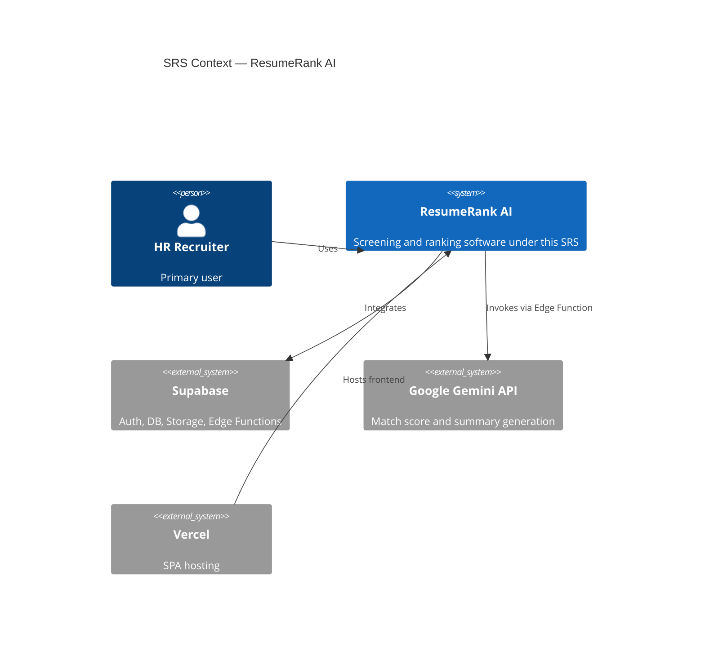
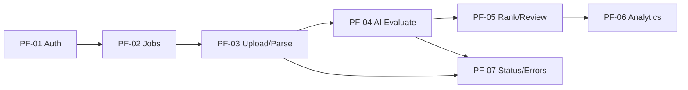
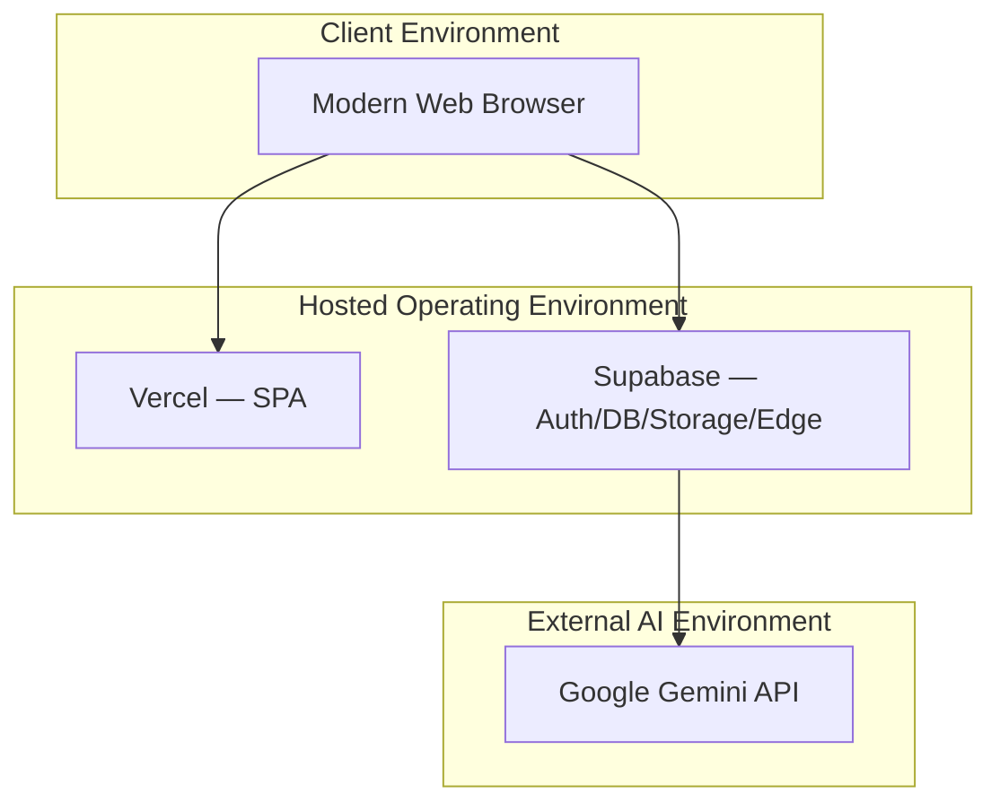
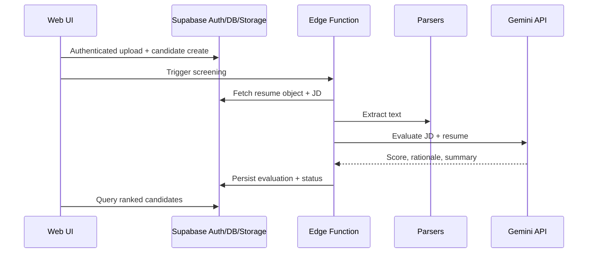
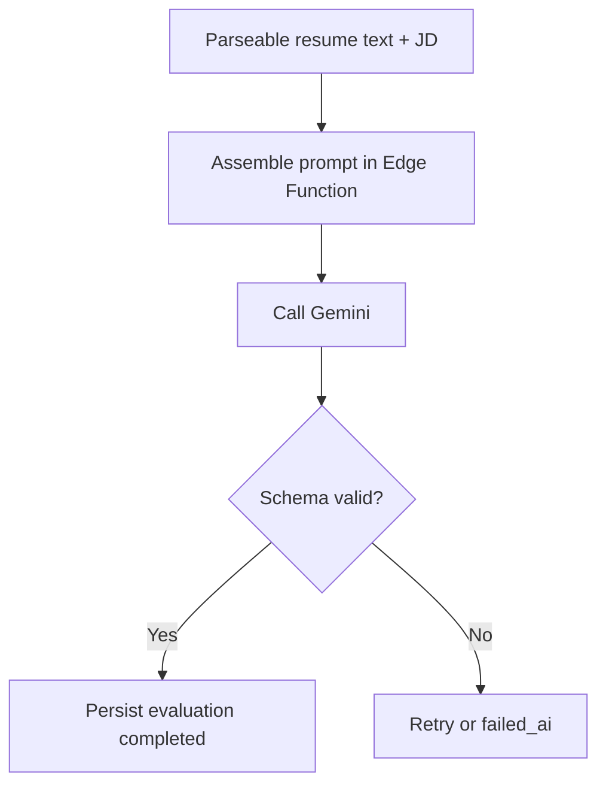
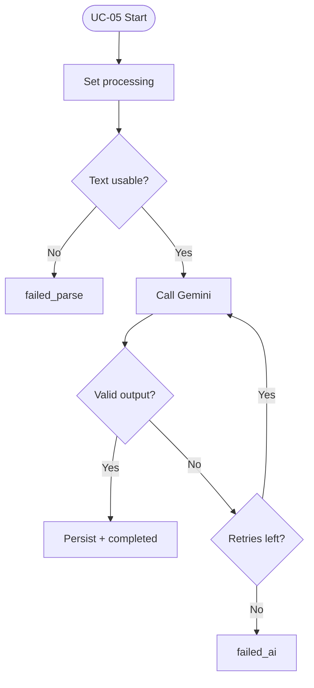
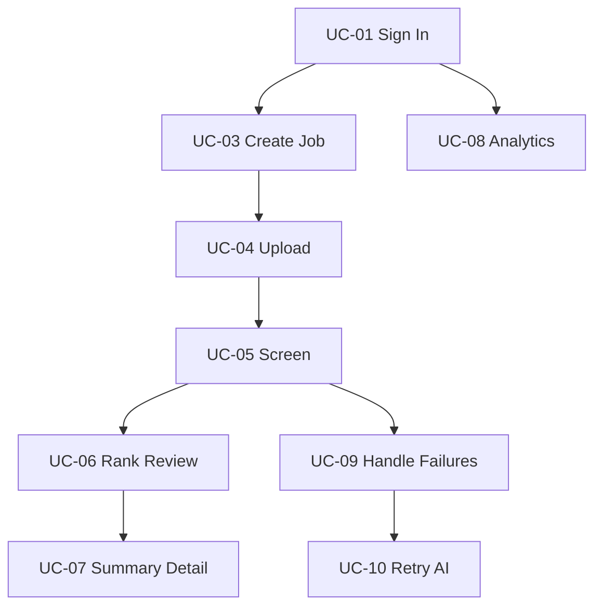
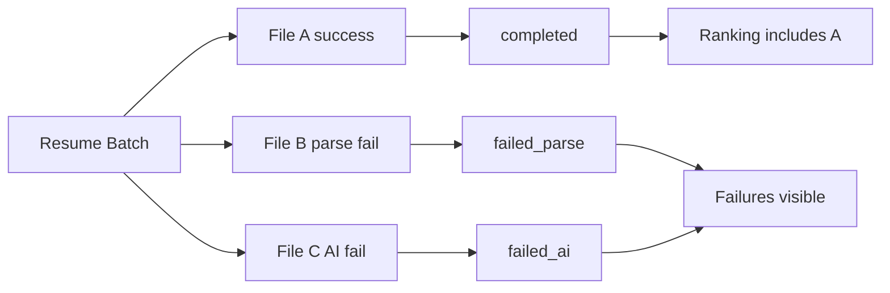

# ResumeRank AI

# Software Requirements Specification (SRS)

**Document 03 — RR-SRS-003**

**Prepared in accordance with IEEE Std 830-1998 recommended practice**

---

## Cover Page

| | |
| --- | --- |
| **Project Name** | ResumeRank AI |
| **Document Title** | Software Requirements Specification |
| **Document Number** | Document 03 |
| **Document ID** | RR-SRS-003 |
| **Version** | 1.0.0 |
| **Status** | Baseline — Ready for System Design |
| **Classification** | Internal — MBA Final Year Project |
| **Specialization** | Artificial Intelligence & Data Science |
| **Document Type** | Software Requirements Specification (IEEE 830) |
| **Author** | Vish Var |
| **Role** | Requirements Engineer / Project Lead |
| **Organization** | ResumeRank AI Development Team |
| **Prepared For** | Academic Evaluation, Development, and QA Teams |
| **Date** | 11 July 2026 |
| **Upstream Dependencies** | RR-ARCH-001 v2.0.0; RR-PRD-002 v1.0.0 |
| **Governing Plan** | Documentation Roadmap (RR-DOC-000) |
| **Next Document** | System Design Document (RR-SDD-004) |

---

### Document Control Statement

This Software Requirements Specification defines the **complete, testable software requirements** for ResumeRank AI. It formalizes the product intent in RR-PRD-002 into IEEE 830–aligned shall-statements covering system features, functional requirements, non-functional requirements, external interfaces, database, AI, security, performance, use cases, business rules, validation rules, and error handling.

Where this SRS and the PRD describe the same capability, the SRS is the binding specification for design, implementation, and testing. Product prioritization (MoSCoW) remains governed by RR-PRD-002 unless explicitly changed through version control.

---

## Revision History

| Version | Date | Author | Description of Change | Review Status |
| --- | --- | --- | --- | --- |
| 0.1.0 | 11 July 2026 | Vish Var | IEEE 830 outline and PRD requirement import | Draft |
| 1.0.0 | 11 July 2026 | Vish Var | Complete SRS with system features, use cases, interface/DB/AI/security/performance requirements, validation and error handling | Current |

---

## Table of Contents

1. [Introduction](#1-introduction)
2. [Overall Description](#2-overall-description)
3. [Product Perspective](#3-product-perspective)
4. [Product Functions](#4-product-functions)
5. [User Classes](#5-user-classes)
6. [Operating Environment](#6-operating-environment)
7. [System Features](#7-system-features)
8. [Functional Requirements](#8-functional-requirements)
9. [Non Functional Requirements](#9-non-functional-requirements)
10. [External Interface Requirements](#10-external-interface-requirements)
11. [Database Requirements](#11-database-requirements)
12. [AI Requirements](#12-ai-requirements)
13. [Security Requirements](#13-security-requirements)
14. [Performance Requirements](#14-performance-requirements)
15. [Use Cases](#15-use-cases)
16. [Business Rules](#16-business-rules)
17. [Validation Rules](#17-validation-rules)
18. [Error Handling](#18-error-handling)
19. [Future Scope](#19-future-scope)
20. [Glossary](#20-glossary)
21. [References](#21-references)
22. [Appendices](#22-appendices)

---

## 1. Introduction

### 1.1 Purpose

The purpose of this SRS is to specify the software requirements for **ResumeRank AI**, an AI-powered Resume Screening and Candidate Ranking System. This document enables:

| Audience | Use of This SRS |
| --- | --- |
| Developers | Implement features against unambiguous shall-statements |
| Designers | Derive System Design, Database Design, API Design, and UI/UX Design |
| QA / Testers | Build test cases and verify acceptance |
| Project Lead | Control scope and requirement change |
| Academic Evaluators | Assess requirements engineering rigor |

### 1.2 Scope

ResumeRank AI shall provide authenticated HR users with the ability to:

1. Create and manage job openings with Job Description (JD) text
2. Upload multiple PDF/DOCX resumes for a job
3. Extract resume text using pdf-parse and mammoth
4. Evaluate resumes against the JD using Google Gemini
5. Persist match score, rationale, and AI summary
6. Rank candidates by match score
7. View processing statuses and screening analytics

The software shall operate as a React/TypeScript SPA hosted on Vercel, with Supabase providing Auth, PostgreSQL, Storage, and Edge Functions, consistent with RR-ARCH-001.

**Out of scope for v1 software requirements:** candidate self-service portal, Hiring Manager RBAC, ATS/HRIS integrations, OCR for image-only PDFs, automated reject/hire actions, and interview scheduling.

### 1.3 Definitions, Acronyms, and Abbreviations

See [Section 20 — Glossary](#20-glossary). Key terms used throughout:

| Term | Meaning |
| --- | --- |
| Shall | Mandatory requirement |
| Should | Recommended requirement |
| May | Optional requirement |
| SRS | Software Requirements Specification |
| JD | Job Description |
| SPA | Single-Page Application |
| RLS | Row Level Security |

### 1.4 References

| ID | Reference |
| --- | --- |
| REF-01 | IEEE Std 830-1998 — Recommended Practice for Software Requirements Specifications |
| REF-02 | RR-DOC-000 — Documentation Roadmap v1.0.0 |
| REF-03 | RR-ARCH-001 — Project Architecture Document v2.0.0 |
| REF-04 | RR-PRD-002 — Product Requirements Document v1.0.0 |
| REF-05 | Supabase, Vercel, Google Gemini, pdf-parse, mammoth public documentation |

### 1.5 Overview of This Document

| Section | Content |
| --- | --- |
| §§2–6 | Overall product description, perspective, functions, users, environment |
| §§7–8 | System features and detailed functional requirements |
| §§9–14 | Quality and specialized requirements (NFR, interfaces, DB, AI, security, performance) |
| §§15–18 | Use cases, business rules, validation, error handling |
| §§19–22 | Future scope, glossary, references, appendices |

### 1.6 Requirement Identification Conventions

| Prefix | Category |
| --- | --- |
| SF-xx | System Feature |
| SRS-FR-xxx | Functional Requirement |
| SRS-NFR-xxx | Non-Functional Requirement |
| SRS-EI-xxx | External Interface Requirement |
| SRS-DB-xxx | Database Requirement |
| SRS-AI-xxx | AI Requirement |
| SRS-SEC-xxx | Security Requirement |
| SRS-PER-xxx | Performance Requirement |
| UC-xx | Use Case |
| BR-xx | Business Rule |
| VR-xx | Validation Rule |
| EH-xx | Error Handling Rule |

Each SRS-FR traces to one or more PRD FR IDs.

---

## 2. Overall Description

### 2.1 Product Synopsis

ResumeRank AI is a cloud-hosted, human-in-the-loop recruitment screening application. HR users authenticate, define jobs, upload resumes, and receive AI-assisted rankings and summaries. The system never autonomously rejects or hires candidates.

### 2.2 Product Context

### 2.3 Design and Implementation Constraints

| Constraint ID | Constraint | Source |
| --- | --- | --- |
| CON-01 | Stack fixed to React, TypeScript, Vite, Tailwind, shadcn/ui, Supabase, Gemini, pdf-parse, mammoth, Vercel | RR-ARCH-001 / RR-PRD-002 CO-01 |
| CON-02 | Resume formats limited to PDF and DOCX | PRD FR-11 / BR-06 |
| CON-03 | Gemini secrets must not be present in client code | PRD FR-22 / NFR-03 |
| CON-04 | No auto-reject or auto-hire actions | PRD FR-26 / BR-02 |
| CON-05 | Job-centric data and workflow model | RR-ARCH-001 |
| CON-06 | Documentation-first delivery per RR-DOC-000 | Project governance |

### 2.4 Assumptions and Dependencies

Assumptions and dependencies inherit from RR-PRD-002 §§12–15 and are restated for SRS completeness in Sections 2.4.1 and Appendix C.

#### 2.4.1 Key Assumptions

| ID | Assumption |
| --- | --- |
| AS-01 | JD content is entered as text in the application |
| AS-02 | Demo resumes are predominantly text-extractable |
| AS-03 | Candidates have no login in v1 |
| AS-04 | Simple user-ownership tenancy is sufficient for v1 |
| AS-05 | Gemini, Supabase, and Vercel remain available for development and demo |

#### 2.4.2 Key Dependencies

| Dependency | Required Capability |
| --- | --- |
| Supabase Auth/DB/Storage/Edge Functions | Identity, persistence, files, privileged AI orchestration |
| Google Gemini API | Match scoring and summarization |
| pdf-parse / mammoth | Resume text extraction |
| Vercel | Frontend deployment |
| RR-PRD-002 / RR-ARCH-001 | Scope and architectural baseline |

### 2.5 Apportioning of Requirements

| Priority | SRS Treatment | PRD MoSCoW |
| --- | --- | --- |
| Mandatory for v1 acceptance | `shall` requirements marked Priority = Must | Must |
| Expected for strong v1 | `shall/should` with Priority = Should | Should |
| Optional | `may` with Priority = Could | Could |
| Explicitly excluded | Listed as Won't / out of scope | Won't |

---

## 3. Product Perspective

### 3.1 System Interface Perspective

ResumeRank AI is a new product, not a component of an existing ATS. It is self-contained for first-pass screening and integrates with external managed platforms.

| Interface Class | External System | Nature |
| --- | --- | --- |
| Identity | Supabase Auth | Mandatory runtime dependency |
| Data | Supabase PostgreSQL | System of record |
| Files | Supabase Storage | Resume object store |
| Compute | Supabase Edge Functions | Screening Engine host |
| AI | Google Gemini API | Inference provider |
| Delivery | Vercel | Frontend host/CDN |
| User | Web Browser | Primary client |

### 3.2 Product Boundary

| Inside Product Boundary | Outside Product Boundary |
| --- | --- |
| SPA UI and client state | Corporate ATS/HRIS |
| Screening Engine orchestration logic | Candidate career portals |
| Application schema and RLS policies | Interview scheduling tools |
| Prompt assembly and response validation | Gemini model training infrastructure |
| Analytics queries for screening metrics | Email campaign / offer systems |

### 3.3 User Interface Perspective (High Level)

The product shall present a desktop-first web UI with:

| Area | Purpose |
| --- | --- |
| Auth screens | Sign up, sign in, sign out |
| Dashboard | Cross-job analytics summary |
| Jobs list/create | Job opening management |
| Job workspace | Upload, status, ranked candidates, summaries |
| Candidate detail | Score, rationale, summary, status |
| Settings (minimal) | Profile/session-related actions as needed |

Detailed wireframes belong in RR-UIX-007; this SRS constrains information content and behaviors only.

### 3.4 Hardware / Software Perspective

| Layer | Required Perspective |
| --- | --- |
| Client hardware | Standard laptop/desktop capable of modern browsers |
| Client software | Current Chromium, Firefox, or Safari browser with JavaScript enabled |
| Server-side | Supabase-managed PostgreSQL, Storage, Auth, Edge runtime |
| Network | HTTPS internet connectivity to Vercel, Supabase, and Gemini endpoints |

---

## 4. Product Functions

The product shall provide the following major functions, mapped to PRD epics:

| Function ID | Product Function | PRD Epic | Primary Goals |
| --- | --- | --- | --- |
| PF-01 | Authenticate and authorize HR users | E-01 | BG-05, BG-06 |
| PF-02 | Manage job openings and JD text | E-02 | BG-01, BG-02 |
| PF-03 | Ingest and parse resumes | E-03 | BG-01 |
| PF-04 | AI-match and summarize candidates | E-04 | BG-02, BG-03 |
| PF-05 | Rank and present candidates for review | E-05 | BG-01, BG-03, BG-05 |
| PF-06 | Present screening analytics | E-06 | BG-04 |
| PF-07 | Track processing status and handle errors | E-07 | BG-01, BG-06 |

---

## 5. User Classes

| User Class ID | User Class | Description | Privilege Level | Intensity |
| --- | --- | --- | --- | --- |
| UC-L-01 | HR Recruiter | Primary end user who creates jobs, uploads resumes, reviews rankings | Authenticated owner of created data | High |
| UC-L-02 | System Operator | Lightweight operator for environment/demo readiness | Operational (docs/config), not a full in-app admin role in v1 | Low |
| UC-L-03 | Academic Evaluator | Reviews demo and documentation; may use read-oriented demo account | Demo account as provided | Medium (review) |

### 5.1 User Class Characteristics

| Characteristic | HR Recruiter | System Operator |
| --- | --- | --- |
| Technical skill | Business-user level | Technical |
| Domain knowledge | Recruiting / HR screening | Platform operations |
| Frequency of use | Frequent during hiring cycles | Occasional |
| Training expectation | Completes core path without manual (NFR-13) | Uses Deployment Guide |

### 5.2 Non-User Classes (v1)

| Class | Status |
| --- | --- |
| Candidate / Applicant | Data subject only; no login |
| Hiring Manager | Deferred to future scope |
| External ATS system user | Out of scope |

---

## 6. Operating Environment

### 6.1 Client Environment

| Item | Requirement |
| --- | --- |
| OE-01 | Application shall run in modern desktop browsers (Chrome, Edge, Firefox, Safari — latest two major versions) |
| OE-02 | JavaScript shall be enabled |
| OE-03 | Minimum recommended viewport: 1280×720 for primary workflows; usable at tablet widths |
| OE-04 | Network access to Vercel, Supabase, and (via server) Gemini endpoints |

### 6.2 Server / Platform Environment

| Item | Requirement |
| --- | --- |
| OE-05 | Frontend shall be deployable on Vercel |
| OE-06 | Backend shall use a Supabase project providing Auth, PostgreSQL, Storage, and Edge Functions |
| OE-07 | Screening Engine shall execute in Supabase Edge Function runtime |
| OE-08 | Secrets shall be supplied via environment/secret stores, not source control |

### 6.3 Development Environment Expectations

| Item | Requirement |
| --- | --- |
| OE-09 | Source shall be maintained in GitHub |
| OE-10 | Frontend toolchain shall use Node.js-compatible Vite/TypeScript build |
| OE-11 | Configuration keys shall be documented in `.env.example` |

### 6.4 Environment Diagram

---

## 7. System Features

Each system feature follows IEEE 830 stimulus/response style and groups related functional requirements.

### 7.1 SF-01 Authentication and Session Control

| Field | Content |
| --- | --- |
| **Purpose** | Enable secure HR access to the application |
| **Priority** | Must |
| **Stimulus/Response** | User submits credentials → system authenticates and establishes session; invalid credentials → error; sign-out → session ended |
| **PRD Trace** | FR-01–FR-04, UN-01 |
| **Related SRS-FRs** | SRS-FR-001 to SRS-FR-004 |

### 7.2 SF-02 Job Opening Management

| Field | Content |
| --- | --- |
| **Purpose** | Create and maintain job openings and JD text used for screening |
| **Priority** | Must (update = Should) |
| **Stimulus/Response** | User creates/updates job → system persists and lists job; missing required fields → validation error |
| **PRD Trace** | FR-05–FR-09 |
| **Related SRS-FRs** | SRS-FR-005 to SRS-FR-009 |

### 7.3 SF-03 Resume Upload and Storage

| Field | Content |
| --- | --- |
| **Purpose** | Accept multiple resumes for a job and store them privately |
| **Priority** | Must |
| **Stimulus/Response** | User selects files → valid PDF/DOCX stored and candidate records created; invalid type/size → rejected with message |
| **PRD Trace** | FR-10–FR-14, FR-17 |
| **Related SRS-FRs** | SRS-FR-010 to SRS-FR-014, SRS-FR-017 |

### 7.4 SF-04 Resume Parsing

| Field | Content |
| --- | --- |
| **Purpose** | Extract usable text from stored resumes |
| **Priority** | Must |
| **Stimulus/Response** | Screening starts → parser extracts text; empty/unusable text → `failed_parse` |
| **PRD Trace** | FR-15–FR-17 |
| **Related SRS-FRs** | SRS-FR-015 to SRS-FR-017 |

### 7.5 SF-05 AI Evaluation and Summarization

| Field | Content |
| --- | --- |
| **Purpose** | Score and summarize each parseable resume against the JD |
| **Priority** | Must (retry = Should) |
| **Stimulus/Response** | Engine sends JD + resume text to Gemini → persists structured outputs; failure after retries → `failed_ai` |
| **PRD Trace** | FR-18–FR-26 |
| **Related SRS-FRs** | SRS-FR-018 to SRS-FR-026 |

### 7.6 SF-06 Ranking and Candidate Review

| Field | Content |
| --- | --- |
| **Purpose** | Present explainable ranked shortlist for HR decision-making |
| **Priority** | Must (filter/pagination = Should) |
| **Stimulus/Response** | User opens job rankings → completed candidates shown by descending score with status/summary access |
| **PRD Trace** | FR-27–FR-32 |
| **Related SRS-FRs** | SRS-FR-027 to SRS-FR-032 |

### 7.7 SF-07 Analytics Dashboard

| Field | Content |
| --- | --- |
| **Purpose** | Provide visibility into screening volumes and outcomes |
| **Priority** | Must core metrics; Should advanced metrics |
| **Stimulus/Response** | User opens dashboard/job analytics → aggregated counts and distributions displayed |
| **PRD Trace** | FR-33–FR-36 |
| **Related SRS-FRs** | SRS-FR-033 to SRS-FR-036 |

### 7.8 SF-08 Status Tracking and Resilience

| Field | Content |
| --- | --- |
| **Purpose** | Make processing state observable and keep batches resilient |
| **Priority** | Must |
| **Stimulus/Response** | Screening progresses → statuses update; one failure → other candidates continue |
| **PRD Trace** | FR-37–FR-40 |
| **Related SRS-FRs** | SRS-FR-037 to SRS-FR-040 |

---

## 8. Functional Requirements

Each requirement uses the template: **ID | Statement | Priority | PRD Trace | Acceptance Note**.

### 8.1 Authentication and Access (SF-01)

| ID | Requirement | Priority | PRD Trace | Acceptance Note |
| --- | --- | --- | --- | --- |
| SRS-FR-001 | The system shall allow a user to register and sign in through Supabase Auth. | Must | FR-01 | Valid credentials create an authenticated session |
| SRS-FR-002 | The system shall deny access to jobs, uploads, rankings, and analytics routes when no valid session exists. | Must | FR-02 | Unauthenticated request redirects to sign-in or equivalent block |
| SRS-FR-003 | The system shall allow an authenticated user to sign out and invalidate the client session. | Must | FR-03 | Protected routes become inaccessible after sign-out |
| SRS-FR-004 | The system shall restrict read/write of jobs, candidates, files, and evaluations to the owning authenticated user through platform security controls (JWT + RLS/ownership policies). | Must | FR-04 | User A cannot read User B job/candidate data |

### 8.2 Job Opening Management (SF-02)

| ID | Requirement | Priority | PRD Trace | Acceptance Note |
| --- | --- | --- | --- | --- |
| SRS-FR-005 | The system shall allow an authenticated user to create a job opening with a non-empty title and non-empty JD text. | Must | FR-05 | Job row persisted and visible in list |
| SRS-FR-006 | The system shall allow an authenticated user to list and open job openings owned by that user. | Must | FR-06 | Only owner jobs returned |
| SRS-FR-007 | The system shall allow an authenticated user to update the title and JD text of an owned job. | Should | FR-07 | Updated values persisted |
| SRS-FR-008 | The system shall associate each candidate, stored resume, and evaluation with exactly one job opening. | Must | FR-08 | Foreign-key/job_id integrity enforced |
| SRS-FR-009 | The system shall prevent initiation of AI screening for a job that does not have persisted JD text. | Must | FR-09 | Screening blocked with validation message |

### 8.3 Resume Upload and Candidate Intake (SF-03)

| ID | Requirement | Priority | PRD Trace | Acceptance Note |
| --- | --- | --- | --- | --- |
| SRS-FR-010 | The system shall allow multiple resume files to be selected and uploaded for a single job in one user action. | Must | FR-10 | ≥2 files accepted in one batch |
| SRS-FR-011 | The system shall accept only PDF and DOCX resume formats in v1. | Must | FR-11 | Other extensions rejected |
| SRS-FR-012 | The system shall reject unsupported file types and communicate a clear validation error to the user. | Must | FR-12 | Error identifies invalid type |
| SRS-FR-013 | The system shall store accepted resume binaries in a private Supabase Storage location. | Must | FR-13 | Objects not anonymously listable/public |
| SRS-FR-014 | The system shall create one candidate record per accepted upload with initial status `pending`. | Must | FR-14 | Candidate count matches accepted files |
| SRS-FR-017 | The system shall continue accepting/processing remaining valid files when one file in a batch fails validation or later processing. | Must | FR-17 | Partial success preserved |

### 8.4 Resume Parsing (SF-04)

| ID | Requirement | Priority | PRD Trace | Acceptance Note |
| --- | --- | --- | --- | --- |
| SRS-FR-015 | The system shall extract text from PDF resumes using pdf-parse and from DOCX resumes using mammoth. | Must | FR-15 | Extractor selected by file type |
| SRS-FR-016 | The system shall set candidate status to `failed_parse` when extracted text is empty or unusable. | Must | FR-16 | No AI call required for failed_parse path |

### 8.5 AI Evaluation and Summarization (SF-05)

| ID | Requirement | Priority | PRD Trace | Acceptance Note |
| --- | --- | --- | --- | --- |
| SRS-FR-018 | The system shall evaluate each parseable candidate resume against the job JD using Google Gemini. | Must | FR-18 | Evaluation created for successful inference |
| SRS-FR-019 | The system shall produce a numeric `match_score` in the inclusive range 0–100 for each successful evaluation. | Must | FR-19 | Score persisted and displayed |
| SRS-FR-020 | The system shall produce a human-readable `rationale` explaining the match score. | Must | FR-20 | Rationale visible in UI |
| SRS-FR-021 | The system shall produce an AI `summary` suitable for HR review. | Must | FR-21 | Summary visible in UI |
| SRS-FR-022 | The system shall invoke Gemini only from trusted server/Edge Function context. | Must | FR-22 | No Gemini API key in client bundle |
| SRS-FR-023 | The system shall persist match_score, rationale, summary, evaluation timestamp, and model metadata for each successful evaluation. | Must | FR-23 | All fields retrievable after completion |
| SRS-FR-024 | The system shall set candidate status to `failed_ai` when AI evaluation fails after configured retries. | Must | FR-24 | Status visible; no false completed state |
| SRS-FR-025 | The system shall allow an authenticated owner to retry screening for candidates in `failed_ai` status. | Should | FR-25 | Retry transitions candidate back through processing |
| SRS-FR-026 | The system shall not provide automated reject or automated hire actions. | Must | FR-26 | No such controls exist in UI/API |

### 8.6 Ranking and Review (SF-06)

| ID | Requirement | Priority | PRD Trace | Acceptance Note |
| --- | --- | --- | --- | --- |
| SRS-FR-027 | The system shall display completed candidates for a job in descending order of match_score. | Must | FR-27 | Rank order matches scores |
| SRS-FR-028 | The system shall display each candidate’s score, status, and access to summary content in the ranking view. | Must | FR-28 | Fields visible without ambiguity |
| SRS-FR-029 | The system shall allow the user to open candidate detail showing rationale and summary. | Must | FR-29 | Detail view renders both fields |
| SRS-FR-030 | The system shall include failed candidates in the job view with failure status visible. | Must | FR-30 | failed_parse/failed_ai distinguishable |
| SRS-FR-031 | The system shall provide filtering or equivalent segmentation of candidates by status within a job. | Should | FR-31 | User can isolate completed vs failed |
| SRS-FR-032 | The system shall support pagination or progressive listing for large candidate sets. | Should | FR-32 | UI remains usable beyond one screen of rows |

### 8.7 Analytics (SF-07)

| ID | Requirement | Priority | PRD Trace | Acceptance Note |
| --- | --- | --- | --- | --- |
| SRS-FR-033 | The system shall provide a dashboard showing total jobs, total candidates, and completed evaluations for the authenticated user. | Must | FR-33 | Counts match underlying data |
| SRS-FR-034 | The system shall show distribution of candidate statuses including pending, processing, completed, and failed categories. | Should | FR-34 | Distribution visible on dashboard or job analytics |
| SRS-FR-035 | The system shall show score summary metrics for completed evaluations (average score and/or distribution). | Should | FR-35 | Metric computed only over completed evaluations |
| SRS-FR-036 | The system shall provide job-level analytics within the job workspace or a dedicated job analytics view. | Should | FR-36 | Metrics scoped to selected job |

### 8.8 Status and Resilience (SF-08)

| ID | Requirement | Priority | PRD Trace | Acceptance Note |
| --- | --- | --- | --- | --- |
| SRS-FR-037 | The system shall transition candidate status through `pending` → `processing` → a terminal state (`completed`, `failed_parse`, or `failed_ai`). | Must | FR-37 | Illegal transitions prevented |
| SRS-FR-038 | The system shall display job-level aggregate status counts during and/or after screening. | Must | FR-38 | Counts update with processing outcomes |
| SRS-FR-039 | The system shall present actionable error messages for unsupported files, parse failures, and AI failures. | Must | FR-39 | Message indicates failure category |
| SRS-FR-040 | The system shall preserve successfully completed evaluations when other candidates in the same batch fail. | Must | FR-40 | Completed rows remain after mixed batch |

### 8.9 Optional and Excluded Functions

| ID | Requirement | Priority | PRD Trace |
| --- | --- | --- | --- |
| SRS-FR-041 | The system may provide CSV export of a ranked shortlist. | Could | FR-41 |
| SRS-FR-042 | The system may record JD edit notes when JD text changes. | Could | FR-42 |
| SRS-FR-043 | The system shall not send candidate-facing emails in v1. | Won't | FR-43 |
| SRS-FR-044 | The system shall not implement Hiring Manager–specific role permissions in v1. | Won't | FR-44 |
| SRS-FR-045 | The system shall not perform OCR on image-only PDFs in v1. | Won't | FR-45 |

---

## 9. Non Functional Requirements

Cross-cutting quality requirements. Specialized quality topics are also expanded in §§11–14.

| ID | Requirement | Priority | PRD Trace | Category |
| --- | --- | --- | --- | --- |
| SRS-NFR-001 | All preview and production traffic shall be served over HTTPS. | Must | NFR-01 | Security/Transport |
| SRS-NFR-002 | Resume objects shall be stored in private buckets/policies, not public anonymous access. | Must | NFR-02 | Security/Storage |
| SRS-NFR-003 | Gemini API keys and service-role secrets shall not be shipped to or readable by the browser client. | Must | NFR-03 | Security/Secrets |
| SRS-NFR-004 | Data access shall require authentication and ownership/RLS enforcement. | Must | NFR-04 | Security/AuthZ |
| SRS-NFR-005 | Uploads shall enforce allowed MIME/types and configured maximum file size. | Must | NFR-05 | Reliability/Validation |
| SRS-NFR-006 | Batch screening shall support partial success. | Must | NFR-06 | Reliability |
| SRS-NFR-007 | Transient AI failures shall be retried with a bounded retry policy. | Should | NFR-07 | Reliability |
| SRS-NFR-008 | Failed candidates shall remain inspectable after batch completion. | Must | NFR-08 | Reliability/UX |
| SRS-NFR-009 | Dashboard and job list should load within 3 seconds under normal demo broadband conditions. | Should | NFR-09 | Performance |
| SRS-NFR-010 | The system shall support at least 20 resumes per job in the v1 demo profile. | Must | NFR-10 | Scalability |
| SRS-NFR-011 | Multi-file screening shall execute asynchronously such that the UI is not permanently blocked. | Must | NFR-11 | Performance/UX |
| SRS-NFR-012 | Ranked lists shall remain usable for growing candidate counts via pagination or equivalent. | Should | NFR-12 | Usability/Performance |
| SRS-NFR-013 | The primary path login → create job → upload → view ranking shall be completable without a training manual. | Must | NFR-13 | Usability |
| SRS-NFR-014 | Processing and failure states shall be visually distinct and understandable. | Must | NFR-14 | Usability |
| SRS-NFR-015 | UI components shall follow accessible practices using shadcn/ui primitives and semantic HTML structure. | Should | NFR-15 | Accessibility |
| SRS-NFR-016 | Layout shall be desktop-first and usable on tablet viewports. | Should | NFR-16 | Usability |
| SRS-NFR-017 | Successful evaluations shall retain score, summary, timestamp, and model identity metadata. | Must | NFR-17 | Auditability |
| SRS-NFR-018 | Application implementation should be TypeScript-first with modular boundaries matching architecture modules. | Should | NFR-18 | Maintainability |
| SRS-NFR-019 | Required configuration keys shall be documented in `.env.example` without secret values. | Must | NFR-19 | Operability |
| SRS-NFR-020 | AI and parser adapters should be isolatable behind interfaces to allow mocked testing. | Should | NFR-20 | Testability |
| SRS-NFR-021 | Frontend shall be deployable to Vercel from the Git repository. | Must | NFR-21 | Deployability |
| SRS-NFR-022 | Backend shall run on documented Supabase project configuration. | Must | NFR-22 | Deployability |
| SRS-NFR-023 | Edge Function failures shall be diagnosable via logs and candidate status fields. | Should | NFR-23 | Operability |

---

## 10. External Interface Requirements

### 10.1 User Interfaces

| ID | Requirement |
| --- | --- |
| SRS-EI-001 | The system shall provide web user interfaces for authentication, dashboard, job list/create, job workspace (upload/ranking/status), and candidate detail. |
| SRS-EI-002 | All primary actions (create job, upload, view ranking) shall be reachable through clearly labeled controls. |
| SRS-EI-003 | Error, empty, processing, and success states shall be represented in the UI without requiring browser developer tools. |
| SRS-EI-004 | The UI shall not expose raw secret values or service-role keys under any normal user flow. |

### 10.2 Software Interfaces

| ID | Interface | Requirement |
| --- | --- | --- |
| SRS-EI-010 | Supabase Auth | The software shall use Supabase Auth APIs/SDK for registration, sign-in, sign-out, and session retrieval. |
| SRS-EI-011 | Supabase PostgreSQL (PostgREST/SDK) | The software shall persist and query jobs, candidates, evaluations, and related metadata through authenticated Supabase data APIs. |
| SRS-EI-012 | Supabase Storage | The software shall upload and retrieve resume objects through Supabase Storage APIs with authenticated access. |
| SRS-EI-013 | Supabase Edge Functions | The software shall invoke a Screening Engine function to orchestrate parse and AI evaluation for a job/candidate set. |
| SRS-EI-014 | Google Gemini API | The Screening Engine shall call Gemini over HTTPS using server-side credentials to obtain structured evaluation outputs. |
| SRS-EI-015 | pdf-parse | The Screening Engine shall use pdf-parse for PDF text extraction. |
| SRS-EI-016 | mammoth | The Screening Engine shall use mammoth for DOCX text extraction. |

### 10.3 Communications Interfaces

| ID | Requirement |
| --- | --- |
| SRS-EI-020 | Client-to-Vercel and client-to-Supabase communications shall use HTTPS. |
| SRS-EI-021 | Edge Function-to-Gemini communications shall use HTTPS. |
| SRS-EI-022 | Authentication to Supabase data/storage/functions shall use the user JWT (and privileged server credentials only inside Edge Functions as designed). |

### 10.4 Hardware Interfaces

ResumeRank AI has no specialized hardware interfaces. Standard workstation keyboard/mouse/display via the browser are assumed.

### 10.5 Interface Sequence (Screening)

---

## 11. Database Requirements

Detailed physical schema is deferred to RR-DB-005. This SRS defines required data capabilities.

### 11.1 Required Logical Entities

| ID | Entity | Required Data | Notes |
| --- | --- | --- | --- |
| SRS-DB-001 | User/Profile | Auth user identity linkage | Owned by Supabase Auth + profile as needed |
| SRS-DB-002 | Job | id, owner_user_id, title, jd_text, timestamps | JD required for screening |
| SRS-DB-003 | Candidate | id, job_id, source_file_path, original_filename, status, timestamps | Status per BR/architecture |
| SRS-DB-004 | Evaluation | id, candidate_id, job_id, match_score, rationale, summary, model_metadata, evaluated_at | One logical evaluation per completed candidate |
| SRS-DB-005 | Operational error info | failure category / message fields as designed | Supports failed_parse/failed_ai inspectability |

### 11.2 Integrity and Access Requirements

| ID | Requirement |
| --- | --- |
| SRS-DB-010 | Every candidate shall reference an existing job. |
| SRS-DB-011 | Every evaluation shall reference an existing candidate and job. |
| SRS-DB-012 | Owner-based access policies shall prevent cross-user data reads/writes. |
| SRS-DB-013 | Deleting or archiving behavior, if implemented, shall not orphan evaluations without a defined strategy (restrict or cascade — finalized in DB design). |
| SRS-DB-014 | Status values shall be constrained to the allowed set: `pending`, `processing`, `completed`, `failed_parse`, `failed_ai`. |

### 11.3 Storage Requirements

| ID | Requirement |
| --- | --- |
| SRS-DB-020 | Resume binaries shall be stored in object storage, not as unconstrained bytea in application tables. |
| SRS-DB-021 | Database records shall store object path/metadata sufficient to retrieve the resume for screening and audit. |
| SRS-DB-022 | Storage buckets used for resumes shall be private. |

### 11.4 Analytics Data Requirements

| ID | Requirement |
| --- | --- |
| SRS-DB-030 | The data model shall support aggregation of jobs count, candidates count, completed evaluations count, and status distribution for the authenticated user. |
| SRS-DB-031 | The data model shall support average/distribution queries over match_score for completed evaluations. |

---

## 12. AI Requirements

Prompt-level design is detailed in RR-AI-008. This SRS binds observable AI behavior.

### 12.1 AI Functional Behavior

| ID | Requirement | Priority |
| --- | --- | --- |
| SRS-AI-001 | For each parseable candidate, the system shall submit JD text and resume text to Gemini for evaluation. | Must |
| SRS-AI-002 | The AI response shall be interpreted into structured fields: match_score (0–100), rationale, and summary. | Must |
| SRS-AI-003 | The system shall reject persistence of AI outputs that fail schema validation. | Must |
| SRS-AI-004 | The system shall record model identity metadata with each successful evaluation. | Must |
| SRS-AI-005 | The system shall not use AI output to trigger autonomous candidate rejection or hiring side effects. | Must |
| SRS-AI-006 | The system should retry transient Gemini failures under a bounded policy before marking `failed_ai`. | Should |

### 12.2 AI Placement and Safety

| ID | Requirement | Priority |
| --- | --- | --- |
| SRS-AI-010 | Gemini API calls shall execute only in Edge Function/server context. | Must |
| SRS-AI-011 | Prompt assembly and secret usage shall not occur in browser code. | Must |
| SRS-AI-012 | Resume text shall be truncated/normalized as needed to fit model input limits without crashing the batch. | Must |
| SRS-AI-013 | AI limitations (possible bias, parse quality dependence) shall be acknowledged in product documentation and MBA materials; runtime shall still return rationale for transparency. | Must |

### 12.3 AI Output Quality Gates

| ID | Requirement |
| --- | --- |
| SRS-AI-020 | `match_score` shall be numeric and within 0–100 inclusive after validation. |
| SRS-AI-021 | `rationale` and `summary` shall be non-empty strings after validation for `completed` status. |
| SRS-AI-022 | A candidate shall not be marked `completed` unless SRS-AI-020 and SRS-AI-021 are satisfied. |

---

## 13. Security Requirements

| ID | Requirement | Priority | PRD/Arch Trace |
| --- | --- | --- | --- |
| SRS-SEC-001 | The system shall require authentication for all non-public screens and APIs that access job/candidate/evaluation data. | Must | FR-02, NFR-04 |
| SRS-SEC-002 | The system shall enforce ownership-based authorization using Supabase RLS or equivalent policy controls. | Must | FR-04 |
| SRS-SEC-003 | Resume storage shall be private and accessible only through authorized channels. | Must | NFR-02 |
| SRS-SEC-004 | `GEMINI_API_KEY` and service-role keys shall be stored only in server/Edge secret configuration. | Must | NFR-03, BR-05 |
| SRS-SEC-005 | The client application shall use the publishable anon key only, never the service-role key. | Must | RR-ARCH-001 |
| SRS-SEC-006 | Upload endpoints/flows shall validate file type and size before storage. | Must | NFR-05 |
| SRS-SEC-007 | All external communications in deployed environments shall use TLS/HTTPS. | Must | NFR-01 |
| SRS-SEC-008 | The system shall not expose other users’ filenames, scores, or JD content through enumerable public URLs. | Must | Security baseline |
| SRS-SEC-009 | Security-relevant failures (auth failure, forbidden access) shall not reveal sensitive internals beyond generic authorized messaging. | Should | Secure UX |
| SRS-SEC-010 | Evaluation audit fields (score/summary/timestamp/model metadata) shall be retained for completed evaluations to support academic/operational review. | Must | NFR-17 |

Detailed threat modeling belongs in RR-SEC-009.

---

## 14. Performance Requirements

| ID | Requirement | Priority | Measurement Context |
| --- | --- | --- | --- |
| SRS-PER-001 | Dashboard and job list should become interactive within 3 seconds under normal demo broadband conditions with typical demo data volumes. | Should | NFR-09 |
| SRS-PER-002 | The system shall support screening of at least 20 resumes for a single job in the v1 demo profile. | Must | NFR-10 / SM-08 |
| SRS-PER-003 | After upload, the UI shall remain usable (not permanently blocked) while screening proceeds asynchronously. | Must | NFR-11 |
| SRS-PER-004 | Candidate ranking queries for a job should return within 3 seconds for demo-scale datasets (≤ a few hundred candidates). | Should | Usability target |
| SRS-PER-005 | Edge Function processing may be longer than UI reads; status fields shall reflect progress so users are not left without feedback. | Must | SF-08 |
| SRS-PER-006 | Pagination or progressive loading should be used to keep ranking tables responsive as counts grow. | Should | NFR-12 |
| SRS-PER-007 | Transient Gemini timeouts should be retried within a bounded total attempt window rather than failing immediately on first timeout. | Should | NFR-07 |

Performance absolute SLAs beyond demo conditions are not contractually asserted in v1 academic scope, except Must items above.

---

## 15. Use Cases

### 15.1 Use Case Index

| Use Case ID | Name | Actor | Priority |
| --- | --- | --- | --- |
| UC-01 | Register and Sign In | HR Recruiter | Must |
| UC-02 | Sign Out | HR Recruiter | Must |
| UC-03 | Create Job Opening | HR Recruiter | Must |
| UC-04 | Upload Resumes to Job | HR Recruiter | Must |
| UC-05 | Run Screening Pipeline | System / HR trigger | Must |
| UC-06 | Review Ranked Candidates | HR Recruiter | Must |
| UC-07 | Inspect Candidate AI Summary | HR Recruiter | Must |
| UC-08 | View Analytics Dashboard | HR Recruiter | Must |
| UC-09 | Handle Failed Candidate | HR Recruiter | Must |
| UC-10 | Retry Failed AI Evaluation | HR Recruiter | Should |

### 15.2 UC-01 Register and Sign In

| Field | Detail |
| --- | --- |
| **Actor** | HR Recruiter |
| **Precondition** | Application reachable; user not authenticated |
| **Main flow** | 1. User opens auth screen 2. User submits registration or sign-in credentials 3. System authenticates via Supabase Auth 4. System establishes session 5. User lands on protected app area |
| **Alternate** | Invalid credentials → error message; session not created |
| **Postcondition** | Valid session exists; protected routes accessible |
| **Requirements** | SRS-FR-001, SRS-FR-002 |

### 15.3 UC-03 Create Job Opening

| Field | Detail |
| --- | --- |
| **Actor** | HR Recruiter |
| **Precondition** | User authenticated |
| **Main flow** | 1. User selects create job 2. Enters title and JD text 3. Submits 4. System validates and persists job 5. Job appears in list/workspace |
| **Alternate** | Missing title/JD → validation error; no job created |
| **Postcondition** | Job available for uploads |
| **Requirements** | SRS-FR-005, SRS-FR-006, VR-01, VR-02 |

### 15.4 UC-04 Upload Resumes to Job

| Field | Detail |
| --- | --- |
| **Actor** | HR Recruiter |
| **Precondition** | Job exists with JD; user is owner |
| **Main flow** | 1. User selects multiple PDF/DOCX files 2. System validates each file 3. Valid files stored privately 4. Candidate records created as `pending` 5. User sees upload results |
| **Alternate** | Unsupported file rejected; other files continue |
| **Postcondition** | One candidate per accepted file |
| **Requirements** | SRS-FR-010–014, SRS-FR-017, VR-10–VR-13 |

### 15.5 UC-05 Run Screening Pipeline

| Field | Detail |
| --- | --- |
| **Actor** | System (triggered by HR action or post-upload orchestration) |
| **Precondition** | Pending candidates exist; JD present |
| **Main flow** | 1. Candidate status → `processing` 2. Resume text extracted 3. Gemini returns score/rationale/summary 4. Evaluation persisted 5. Status → `completed` |
| **Alternate** | Empty parse → `failed_parse`; AI failure after retries → `failed_ai`; other candidates continue |
| **Postcondition** | Terminal statuses set; completed evaluations queryable |
| **Requirements** | SRS-FR-015–024, SRS-FR-037–040, SRS-AI-* |

### 15.6 UC-06 Review Ranked Candidates

| Field | Detail |
| --- | --- |
| **Actor** | HR Recruiter |
| **Precondition** | At least one completed evaluation for the job (for ranking content); job owned by user |
| **Main flow** | 1. User opens job ranking view 2. System lists completed candidates by descending score 3. User reviews scores/statuses 4. User may open details |
| **Alternate** | No completed candidates → empty/in-progress state shown |
| **Postcondition** | User can identify top-ranked candidates without opening original files |
| **Requirements** | SRS-FR-027–030 |

### 15.7 UC-08 View Analytics Dashboard

| Field | Detail |
| --- | --- |
| **Actor** | HR Recruiter |
| **Precondition** | Authenticated |
| **Main flow** | 1. User opens dashboard 2. System shows totals for jobs, candidates, completed evaluations 3. Optional status/score metrics displayed if implemented (Should) |
| **Postcondition** | Metrics reflect user-owned data |
| **Requirements** | SRS-FR-033 (Must), SRS-FR-034–036 (Should) |

### 15.8 UC-09 Handle Failed Candidate

| Field | Detail |
| --- | --- |
| **Actor** | HR Recruiter |
| **Precondition** | One or more candidates in `failed_parse` or `failed_ai` |
| **Main flow** | 1. User views job candidates 2. Failed statuses are visible 3. User reads actionable failure category/message 4. User decides to re-upload or retry (if available) |
| **Postcondition** | Failures do not hide successful rankings |
| **Requirements** | SRS-FR-030, SRS-FR-039, SRS-FR-040 |

### 15.9 Use Case Relationship Diagram

---

## 16. Business Rules

Business rules are mandatory product policies. They align with RR-ARCH-001 / RR-PRD-002.

| ID | Business Rule | Enforcement |
| --- | --- | --- |
| BR-01 | Only authenticated HR users may create jobs and upload resumes. | Auth + route guards + RLS |
| BR-02 | AI may rank and summarize; AI shall not auto-reject or auto-hire. | Absence of autonomous decision actions |
| BR-03 | Every successful evaluation shall retain score, summary, and timestamp (and model metadata per SRS). | Persistence validation |
| BR-04 | A single resume parse/AI failure shall not abort the entire batch. | Screening Engine isolation |
| BR-05 | Gemini credentials shall never be exposed to the browser. | Edge-only secrets |
| BR-06 | v1 shall accept PDF and DOCX resumes only. | Upload validation |
| BR-07 | Screening and ranking are always scoped to a single job opening. | Data model + UI scope |
| BR-08 | A candidate marked `completed` must have a validated evaluation payload. | Status transition guards |
| BR-09 | Users shall only access jobs/candidates/evaluations they own. | Authorization policies |
| BR-10 | Human decision-making remains outside automated system side effects in v1. | Product scope control |

---

## 17. Validation Rules

### 17.1 Job Validation

| ID | Rule |
| --- | --- |
| VR-01 | Job title shall be required and non-empty after trim. |
| VR-02 | JD text shall be required and non-empty after trim before screening can start. |
| VR-03 | Job update shall not clear ownership fields. |

### 17.2 Upload Validation

| ID | Rule |
| --- | --- |
| VR-10 | Accepted extensions/MIME types limited to PDF and DOCX families configured by implementation. |
| VR-11 | Each file shall not exceed the configured maximum size (default design target: 5 MB per file unless Deployment Guide sets otherwise). |
| VR-12 | Empty file uploads shall be rejected. |
| VR-13 | Maximum files per batch shall be configurable; demo profile shall allow at least 20. |
| VR-14 | Uploads shall be associated with an existing owned job_id. |

### 17.3 Status and Evaluation Validation

| ID | Rule |
| --- | --- |
| VR-20 | Status values limited to `pending`, `processing`, `completed`, `failed_parse`, `failed_ai`. |
| VR-21 | Transition to `completed` requires validated match_score, rationale, and summary. |
| VR-22 | match_score shall be numeric and within 0–100 inclusive. |
| VR-23 | rationale and summary shall be non-empty for completed evaluations. |
| VR-24 | failed_ai/failed_parse records shall retain enough information for UI messaging. |

### 17.4 Auth Validation

| ID | Rule |
| --- | --- |
| VR-30 | Sign-in requires valid credential format accepted by Supabase Auth. |
| VR-31 | Protected operations require a valid non-expired session token. |

---

## 18. Error Handling

### 18.1 Error Categories

| Code | Category | Typical Cause | User-visible Handling |
| --- | --- | --- | --- |
| EH-AUTH | Authentication error | Invalid credentials / expired session | Prompt re-authentication |
| EH-VAL | Validation error | Bad input/file type/size | Inline/form error message; no partial invalid persist |
| EH-FORB | Authorization error | Accessing another user’s job | Access denied; no data leak |
| EH-STORE | Storage error | Upload failure | Retry guidance; candidate not marked completed |
| EH-PARSE | Parse error | Unreadable/empty extraction | Status `failed_parse` |
| EH-AI | AI error | Gemini timeout/invalid JSON/exhausted retries | Status `failed_ai` |
| EH-SYS | System/platform error | Supabase/Vercel disruption | Generic failure + safe retry guidance |

### 18.2 Error Handling Requirements

| ID | Requirement |
| --- | --- |
| EH-01 | Validation errors shall prevent persistence of invalid entities. |
| EH-02 | Parse and AI errors shall be isolated per candidate and shall not roll back completed siblings in the same batch. |
| EH-03 | The UI shall show failure category for failed candidates (`failed_parse` or `failed_ai`). |
| EH-04 | The system shall not mark a candidate `completed` if evaluation persistence fails. |
| EH-05 | Edge Function errors shall update candidate status and emit diagnostic logs. |
| EH-06 | Auth errors on protected routes shall result in sign-in redirection or equivalent lockout of protected content. |
| EH-07 | Error messages shall be actionable and shall not expose secrets or stack traces to end users. |
| EH-08 | Retry of `failed_ai` (when implemented) shall reset the candidate into a processing path without deleting historical audit strategy defined in design. |

### 18.3 Batch Error Behavior

---

## 19. Future Scope

Deferred capabilities (not required for v1 acceptance):

| ID | Future Requirement Area | Notes |
| --- | --- | --- |
| FS-01 | Hiring Manager roles and shortlist sharing | Requires RBAC expansion |
| FS-02 | Multi-tenant organizations | Identity model change |
| FS-03 | OCR for scanned resumes | New parsing dependency |
| FS-04 | Pluggable LLM providers | AI adapter generalization |
| FS-05 | Realtime screening progress channels | Supabase Realtime |
| FS-06 | CSV/PDF export and interview scheduling integrations | New modules |
| FS-07 | Bias/fairness analytics | Ethics + data policy |
| FS-08 | ATS/HRIS connectors | External interface expansion |
| FS-09 | Candidate self-service portal | New user class |
| FS-10 | Advanced longitudinal analytics | Event tracking expansion |

Promotion of future scope into mandatory requirements requires a versioned PRD and SRS update.

---

## 20. Glossary

| Term | Definition |
| --- | --- |
| Acceptance Note | Observation used to judge whether a requirement is satisfied |
| AI Summary | Concise Gemini-generated overview of a candidate for a job |
| Batch | Set of resumes processed for one job in one screening run |
| Candidate | Record representing an uploaded resume under a job |
| Edge Function | Privileged serverless function hosting Screening Engine logic |
| Evaluation | Persisted AI result for a candidate |
| Human-in-the-loop | AI assists; humans decide |
| IEEE 830 | Recommended practice for Software Requirements Specifications |
| Job Opening | Recruiting role entity with JD text |
| Match Score | Integer/numeric fitness score from 0–100 |
| MoSCoW | Must/Should/Could/Won't prioritization |
| Ownership | Data access bound to creating authenticated user in v1 |
| Rationale | Explanation accompanying a match score |
| RLS | PostgreSQL Row Level Security |
| Screening Engine | Orchestrator for parse → AI → persist |
| Shall | Mandatory requirement verb |
| Should | Recommended requirement verb |
| SPA | Single-Page Application |
| SRS | Software Requirements Specification |
| Status | Candidate lifecycle state |
| Terminal state | completed, failed_parse, or failed_ai |
| v1 | First accepted academic/production demo release |

---

## 21. References

1. IEEE Std 830-1998 — IEEE Recommended Practice for Software Requirements Specifications.
2. RR-DOC-000 — ResumeRank AI Documentation Roadmap v1.0.0.
3. RR-ARCH-001 — ResumeRank AI Project Architecture Document v2.0.0.
4. RR-PRD-002 — ResumeRank AI Product Requirements Document v1.0.0.
5. ISO/IEC/IEEE 29148 — Systems and software engineering — Life cycle processes — Requirements engineering (supporting alignment).
6. Supabase Documentation — Auth, Database, Storage, Edge Functions.
7. Google AI Gemini API Documentation.
8. Vercel Documentation.
9. pdf-parse and mammoth library documentation.

---

## 22. Appendices

### Appendix A — PRD to SRS Traceability Matrix (Functional)

| PRD FR | SRS Requirement | System Feature |
| --- | --- | --- |
| FR-01 | SRS-FR-001 | SF-01 |
| FR-02 | SRS-FR-002 | SF-01 |
| FR-03 | SRS-FR-003 | SF-01 |
| FR-04 | SRS-FR-004 | SF-01 |
| FR-05 | SRS-FR-005 | SF-02 |
| FR-06 | SRS-FR-006 | SF-02 |
| FR-07 | SRS-FR-007 | SF-02 |
| FR-08 | SRS-FR-008 | SF-02 |
| FR-09 | SRS-FR-009 | SF-02 |
| FR-10 | SRS-FR-010 | SF-03 |
| FR-11 | SRS-FR-011 | SF-03 |
| FR-12 | SRS-FR-012 | SF-03 |
| FR-13 | SRS-FR-013 | SF-03 |
| FR-14 | SRS-FR-014 | SF-03 |
| FR-15 | SRS-FR-015 | SF-04 |
| FR-16 | SRS-FR-016 | SF-04 |
| FR-17 | SRS-FR-017 | SF-03/SF-08 |
| FR-18 | SRS-FR-018 | SF-05 |
| FR-19 | SRS-FR-019 | SF-05 |
| FR-20 | SRS-FR-020 | SF-05 |
| FR-21 | SRS-FR-021 | SF-05 |
| FR-22 | SRS-FR-022 | SF-05 |
| FR-23 | SRS-FR-023 | SF-05 |
| FR-24 | SRS-FR-024 | SF-05 |
| FR-25 | SRS-FR-025 | SF-05 |
| FR-26 | SRS-FR-026 | SF-05 |
| FR-27 | SRS-FR-027 | SF-06 |
| FR-28 | SRS-FR-028 | SF-06 |
| FR-29 | SRS-FR-029 | SF-06 |
| FR-30 | SRS-FR-030 | SF-06 |
| FR-31 | SRS-FR-031 | SF-06 |
| FR-32 | SRS-FR-032 | SF-06 |
| FR-33 | SRS-FR-033 | SF-07 |
| FR-34 | SRS-FR-034 | SF-07 |
| FR-35 | SRS-FR-035 | SF-07 |
| FR-36 | SRS-FR-036 | SF-07 |
| FR-37 | SRS-FR-037 | SF-08 |
| FR-38 | SRS-FR-038 | SF-08 |
| FR-39 | SRS-FR-039 | SF-08 |
| FR-40 | SRS-FR-040 | SF-08 |
| FR-41–45 | SRS-FR-041–045 | Optional/Excluded |

### Appendix B — PRD NFR to SRS Traceability

| PRD NFR | SRS ID |
| --- | --- |
| NFR-01 | SRS-NFR-001 / SRS-SEC-007 |
| NFR-02 | SRS-NFR-002 / SRS-SEC-003 |
| NFR-03 | SRS-NFR-003 / SRS-SEC-004 / SRS-AI-010 |
| NFR-04 | SRS-NFR-004 / SRS-SEC-001 / SRS-SEC-002 |
| NFR-05 | SRS-NFR-005 / SRS-SEC-006 / VR-10–VR-12 |
| NFR-06 | SRS-NFR-006 / EH-02 |
| NFR-07 | SRS-NFR-007 / SRS-AI-006 / SRS-PER-007 |
| NFR-08 | SRS-NFR-008 |
| NFR-09 | SRS-NFR-009 / SRS-PER-001 |
| NFR-10 | SRS-NFR-010 / SRS-PER-002 |
| NFR-11 | SRS-NFR-011 / SRS-PER-003 |
| NFR-12 | SRS-NFR-012 / SRS-PER-006 |
| NFR-13 | SRS-NFR-013 |
| NFR-14 | SRS-NFR-014 |
| NFR-15 | SRS-NFR-015 |
| NFR-16 | SRS-NFR-016 |
| NFR-17 | SRS-NFR-017 / SRS-SEC-010 |
| NFR-18 | SRS-NFR-018 |
| NFR-19 | SRS-NFR-019 |
| NFR-20 | SRS-NFR-020 |
| NFR-21 | SRS-NFR-021 |
| NFR-22 | SRS-NFR-022 |
| NFR-23 | SRS-NFR-023 / EH-05 |

### Appendix C — Acceptance Gate Mapping

| PRD Gate | Supporting SRS Artifacts |
| --- | --- |
| AC-G01 | UC-01, UC-02, SRS-FR-001–003 |
| AC-G02 | UC-03, SRS-FR-005–006 |
| AC-G03 | UC-04, SRS-FR-010–014, VR-10–13 |
| AC-G04 | UC-05, SRS-FR-015–023, SRS-AI-* |
| AC-G05 | UC-06, SRS-FR-027–028 |
| AC-G06 | UC-07, SRS-FR-020–021, SRS-FR-029 |
| AC-G07 | UC-09, SRS-FR-017, SRS-FR-040, EH-02 |
| AC-G08 | UC-08, SRS-FR-033 |
| AC-G09 | SRS-SEC-*, SRS-FR-022, SRS-FR-026 |
| AC-G10 | SRS-NFR-021, SRS-NFR-022 |

### Appendix D — Document Control

| Item | Value |
| --- | --- |
| Storage path | `docs/01-requirements/03-Software-Requirements-Specification.md` |
| Current version | 1.0.0 |
| Upstream baselines | RR-ARCH-001 v2.0.0; RR-PRD-002 v1.0.0 |
| Change control | Any Must requirement change requires version bump and design/test impact review |
| Next document | RR-SDD-004 System Design Document |

---

**End of Document — Document 03 — RR-SRS-003 — Software Requirements Specification v1.0.0**
