# ResumeRank AI

# Software Requirements Specification (SRS)

**Document 03 — RR-SRS-003**

**Prepared in accordance with IEEE Std 830-1998 recommended practice**

---

## Cover Page

| | |
| --- | --- |
| **Project Name** | ResumeRank AI |
| **Document Title** | Software Requirements Specification |
| **Document Number** | Document 03 |
| **Document ID** | RR-SRS-003 |
| **Version** | 1.1.0 |
| **Status** | Baseline — Ready for System Design |
| **Classification** | Internal — MBA Final Year Project |
| **Specialization** | Artificial Intelligence & Data Science |
| **Document Type** | Software Requirements Specification (IEEE 830) |
| **Author** | Vish Var |
| **Role** | Requirements Engineer / Project Lead |
| **Organization** | ResumeRank AI Development Team |
| **Prepared For** | Academic Evaluation, Development, and QA Teams |
| **Date** | 11 July 2026 |
| **Upstream Dependencies** | RR-ARCH-001 v2.0.0; RR-PRD-002 v1.0.0 |
| **Governing Plan** | Documentation Roadmap (RR-DOC-000) |
| **Supersedes** | RR-SRS-003 v1.0.0 |
| **Next Document** | System Design Document (RR-SDD-004) |

---

### Document Control Statement

This Software Requirements Specification defines the complete, testable software requirements for ResumeRank AI. It formalizes product intent from RR-PRD-002 into IEEE 830–aligned shall-statements covering system features, functional requirements, non-functional requirements, external interfaces, database, AI, security, performance, use cases, business rules, validation rules, and error handling.

Where this SRS and the PRD describe the same capability, this SRS is the binding specification for design, implementation, and testing. MoSCoW prioritization remains governed by RR-PRD-002 unless this SRS explicitly extends scope (notably structured candidate extraction, job archive/delete, and evaluation audit history in v1.1.0).

Version **1.1.0** incorporates the review remediation described in [Appendix E — Change Log](#appendix-e--change-log-v110).

---

## Revision History

| Version | Date | Author | Description of Change | Review Status |
| --- | --- | --- | --- | --- |
| 0.1.0 | 11 July 2026 | Vish Var | IEEE 830 outline and PRD requirement import | Draft |
| 1.0.0 | 11 July 2026 | Vish Var | Initial complete SRS baseline | Superseded |
| 1.1.0 | 11 July 2026 | Vish Var | Review remediation: complete UC-02/07/10; status lifecycle; job archive/delete; extraction scope; evaluation retry/audit; deduplication; portable diagrams; cross-reference fixes; grammar | Current |

---

## Table of Contents

1. [Introduction](#1-introduction)
2. [Overall Description](#2-overall-description)
3. [Product Perspective](#3-product-perspective)
4. [Product Functions](#4-product-functions)
5. [User Classes](#5-user-classes)
6. [Operating Environment](#6-operating-environment)
7. [System Features](#7-system-features)
8. [Functional Requirements](#8-functional-requirements)
9. [Non-Functional Requirements](#9-non-functional-requirements)
10. [External Interface Requirements](#10-external-interface-requirements)
11. [Database Requirements](#11-database-requirements)
12. [AI Requirements](#12-ai-requirements)
13. [Security Requirements](#13-security-requirements)
14. [Performance Requirements](#14-performance-requirements)
15. [Use Cases](#15-use-cases)
16. [Business Rules](#16-business-rules)
17. [Validation Rules](#17-validation-rules)
18. [Error Handling](#18-error-handling)
19. [Future Scope](#19-future-scope)
20. [Glossary](#20-glossary)
21. [References](#21-references)
22. [Appendices](#22-appendices)

---

## 1. Introduction

### 1.1 Purpose

This SRS specifies the software requirements for **ResumeRank AI**, an AI-powered Resume Screening and Candidate Ranking System. It enables:

| Audience | Use of This SRS |
| --- | --- |
| Developers | Implement features against unambiguous shall-statements |
| Designers | Derive System Design, Database Design, API Design, and UI/UX Design |
| QA / Testers | Build test cases and verify acceptance |
| Project Lead | Control scope and requirement change |
| Academic Evaluators | Assess requirements engineering rigor |

### 1.2 Scope

ResumeRank AI shall provide authenticated HR users with the ability to:

1. Create, manage, archive, and (where allowed) delete job openings with Job Description (JD) text
2. Upload multiple PDF/DOCX resumes for a job
3. Extract resume text and structured candidate information
4. Evaluate resumes against the JD using Google Gemini
5. Persist match score, rationale, AI summary, and evaluation audit history
6. Rank candidates by match score
7. View processing statuses and screening analytics

The software shall operate as a React/TypeScript SPA hosted on Vercel, with Supabase providing Auth, PostgreSQL, Storage, and Edge Functions, consistent with RR-ARCH-001.

**Out of scope for v1:** candidate self-service portal, Hiring Manager RBAC, ATS/HRIS integrations, OCR for image-only PDFs, automated reject/hire actions, and interview scheduling.

### 1.3 Definitions, Acronyms, and Abbreviations

Primary definitions are in [Section 20 — Glossary](#20-glossary). Requirement modality:

| Term | Meaning |
| --- | --- |
| Shall | Mandatory requirement |
| Should | Recommended requirement |
| May | Optional requirement |

### 1.4 References

| ID | Reference |
| --- | --- |
| REF-01 | IEEE Std 830-1998 — Recommended Practice for Software Requirements Specifications |
| REF-02 | RR-DOC-000 — Documentation Roadmap v1.0.0 |
| REF-03 | RR-ARCH-001 — Project Architecture Document v2.0.0 |
| REF-04 | RR-PRD-002 — Product Requirements Document v1.0.0 |
| REF-05 | Supabase, Vercel, Google Gemini, pdf-parse, mammoth public documentation |

### 1.5 Overview of This Document

| Sections | Content |
| --- | --- |
| §§1–6 | Introduction, overall description (including product perspective), functions, users, environment |
| §§7–8 | System feature index and detailed functional requirements |
| §9 | Master Non-Functional Requirements |
| §§10–12 | External interfaces, database, and AI requirements |
| §§13–14 | Security and Performance views (reference §9; add only specialized notes) |
| §§15–18 | Use cases, business rules, validation, error handling |
| §§19–22 | Future scope, glossary, references, appendices (including change log) |

### 1.6 Requirement Identification Conventions

| Prefix | Category |
| --- | --- |
| SF-xx | System Feature (index only) |
| SRS-FR-xxx | Functional Requirement |
| SRS-NFR-xxx | Non-Functional Requirement (master catalog) |
| SRS-EI-xxx | External Interface Requirement |
| SRS-DB-xxx | Database Requirement |
| SRS-AI-xxx | AI Requirement |
| SRS-SEC-xxx | Security pointer / specialized security note |
| SRS-PER-xxx | Performance pointer / specialized performance note |
| OE-xx | Operating Environment requirement |
| UC-xx | Use Case |
| UC-L-xx | User Class (not a use case) |
| BR-xx | Business Rule |
| VR-xx | Validation Rule |
| EH-xx | Error Handling requirement |
| CSL-xx | Candidate Status Lifecycle rule |

**Numbering rules**

- Functional IDs `SRS-FR-001` through `SRS-FR-045` preserve v1.0.0 mapping to PRD FR-01–FR-45.
- New v1.1.0 functional requirements begin at `SRS-FR-046`.
- Within narrative sections, requirements may be grouped by feature; numeric ID order is authoritative for traceability.

### 1.7 Requirements Verification Approach

Each Must requirement shall be verifiable by inspection, demonstration, analysis, or test. Formal test cases are specified in RR-TEST-010. Acceptance gates from RR-PRD-002 remain applicable and are mapped in [Appendix C](#appendix-c--acceptance-gate-mapping).

---

## 2. Overall Description

### 2.1 Product Synopsis

ResumeRank AI is a cloud-hosted, human-in-the-loop recruitment screening application. HR users authenticate, define jobs, upload resumes, obtain structured candidate extraction, and receive AI-assisted rankings and summaries. The system never autonomously rejects or hires candidates.

### 2.2 Product Context

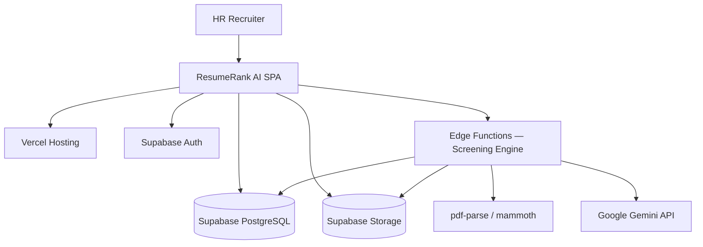

### 2.3 Design and Implementation Constraints

| Constraint ID | Constraint | Source |
| --- | --- | --- |
| CON-01 | Stack fixed to React, TypeScript, Vite, Tailwind, shadcn/ui, Supabase, Gemini, pdf-parse, mammoth, Vercel | RR-ARCH-001 / RR-PRD-002 CO-01 |
| CON-02 | Resume formats limited to PDF and DOCX | PRD FR-11 / BR-06 |
| CON-03 | Gemini secrets must not be present in client code | PRD FR-22 / NFR-03 |
| CON-04 | No auto-reject or auto-hire actions | PRD FR-26 / BR-02 |
| CON-05 | Job-centric data and workflow model | RR-ARCH-001 |
| CON-06 | Documentation-first delivery per RR-DOC-000 | Project governance |
| CON-07 | One active evaluation per candidate; retries overwrite active evaluation and append audit history | SRS v1.1.0 |

### 2.4 Assumptions and Dependencies

Assumptions and dependencies inherit from RR-PRD-002 §§12–15. Key items are restated below for SRS completeness. Document dependencies and acceptance mapping appear in [Appendix A](#appendix-a--prd-to-srs-traceability-matrix-functional), [Appendix B](#appendix-b--prd-nfr-to-srs-traceability), and [Appendix C](#appendix-c--acceptance-gate-mapping).

#### 2.4.1 Key Assumptions

| ID | Assumption |
| --- | --- |
| AS-01 | JD content is entered as text in the application |
| AS-02 | Demo resumes are predominantly text-extractable |
| AS-03 | Candidates have no login in v1 |
| AS-04 | Simple user-ownership tenancy is sufficient for v1 |
| AS-05 | Gemini, Supabase, and Vercel remain available for development and demo |
| AS-06 | Structured fields may be partially sparse when resumes omit information |

#### 2.4.2 Key Dependencies

| Dependency | Required Capability |
| --- | --- |
| Supabase Auth/DB/Storage/Edge Functions | Identity, persistence, files, privileged orchestration |
| Google Gemini API | Match scoring, summarization, and assisted structured extraction |
| pdf-parse / mammoth | Resume text extraction |
| Vercel | Frontend deployment |
| RR-PRD-002 / RR-ARCH-001 | Scope and architectural baseline |

### 2.5 Apportioning of Requirements

| Priority | SRS Treatment | PRD MoSCoW |
| --- | --- | --- |
| Mandatory for v1 acceptance | `shall` with Priority = Must | Must |
| Expected for strong v1 | `shall` or `should` with Priority = Should | Should |
| Optional | `may` with Priority = Could | Could |
| Explicitly excluded | Listed as Won't / out of scope | Won't |

### 2.6 System Interface Perspective

ResumeRank AI is a new product, not a component of an existing ATS. It is self-contained for first-pass screening and integrates with external managed platforms.

| Interface Class | External System | Nature |
| --- | --- | --- |
| Identity | Supabase Auth | Mandatory runtime dependency |
| Data | Supabase PostgreSQL | System of record |
| Files | Supabase Storage | Resume object store |
| Compute | Supabase Edge Functions | Screening Engine host |
| AI | Google Gemini API | Inference provider |
| Delivery | Vercel | Frontend host/CDN |
| User | Web Browser | Primary client |

### 2.7 Product Boundary

| Inside Product Boundary | Outside Product Boundary |
| --- | --- |
| SPA UI and client state | Corporate ATS/HRIS |
| Screening Engine orchestration logic | Candidate career portals |
| Application schema and RLS policies | Interview scheduling tools |
| Prompt assembly, extraction, and response validation | Gemini model training infrastructure |
| Analytics queries for screening metrics | Email campaign / offer systems |

### 2.8 User Interface Perspective (High Level)

The product shall present a desktop-first web UI with:

| Area | Purpose |
| --- | --- |
| Auth screens | Sign up, sign in, sign out |
| Dashboard | Cross-job analytics summary |
| Jobs list/create | Job opening management, archive/delete actions |
| Job workspace | Upload, status, ranked candidates, summaries, extracted profile |
| Candidate detail | Score, rationale, summary, extracted fields, status |
| Settings (minimal) | Profile/session-related actions as needed |

Detailed wireframes belong in RR-UIX-007.

### 2.9 Hardware / Software Perspective

| Layer | Required Perspective |
| --- | --- |
| Client hardware | Standard laptop/desktop capable of modern browsers |
| Client software | Current Chrome, Edge, Firefox, or Safari with JavaScript enabled |
| Server-side | Supabase-managed PostgreSQL, Storage, Auth, Edge runtime |
| Network | HTTPS connectivity to Vercel, Supabase, and Gemini endpoints |

### 2.10 Security Trust Boundary Overview

Normative security requirements are in §9 and §13. Trust boundaries:

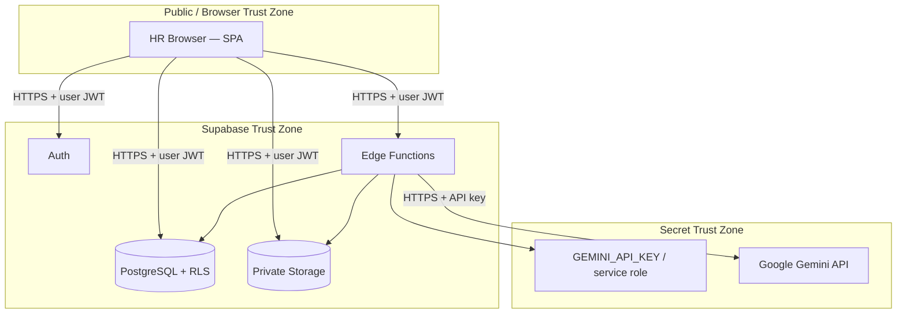

---

## 3. Product Perspective

Product perspective content is defined in **Overall Description §§2.6–2.10** to avoid duplication (IEEE 830 places product perspective under overall description).

| Perspective Topic | Location |
| --- | --- |
| System interfaces | §2.6 |
| Product boundary | §2.7 |
| User interface perspective | §2.8 |
| Hardware/software perspective | §2.9 |
| Trust boundaries | §2.10 |

---

## 4. Product Functions

| Function ID | Product Function | PRD Epic | Primary Goals |
| --- | --- | --- | --- |
| PF-01 | Authenticate and authorize HR users | E-01 | BG-05, BG-06 |
| PF-02 | Manage, archive, and delete job openings and JD text | E-02 | BG-01, BG-02 |
| PF-03 | Ingest resumes, extract text, and extract structured candidate fields | E-03 | BG-01 |
| PF-04 | AI-match and summarize candidates | E-04 | BG-02, BG-03 |
| PF-05 | Rank and present candidates for review | E-05 | BG-01, BG-03, BG-05 |
| PF-06 | Present screening analytics | E-06 | BG-04 |
| PF-07 | Track processing status, retries, and errors | E-07 | BG-01, BG-06 |

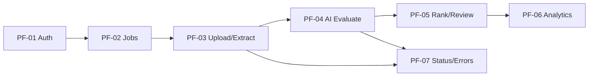

---

## 5. User Classes

| User Class ID | User Class | Description | Privilege Level | Intensity |
| --- | --- | --- | --- | --- |
| UC-L-01 | HR Recruiter | Primary end user who creates jobs, uploads resumes, reviews rankings | Authenticated owner of created data | High |
| UC-L-02 | System Operator | Lightweight operator for environment/demo readiness | Operational (docs/config); not a full in-app admin role in v1 | Low |
| UC-L-03 | Academic Evaluator | Reviews demo and documentation; may use a provided demo account | Same as HR Recruiter capabilities on demo data unless restricted by operators | Medium |

### 5.1 User Class Characteristics

| Characteristic | HR Recruiter | System Operator |
| --- | --- | --- |
| Technical skill | Business-user level | Technical |
| Domain knowledge | Recruiting / HR screening | Platform operations |
| Frequency of use | Frequent during hiring cycles | Occasional |
| Training expectation | Completes core path without manual (SRS-NFR-013) | Uses Deployment Guide |

### 5.2 Non-User Classes (v1)

| Class | Status |
| --- | --- |
| Candidate / Applicant | Data subject only; no login |
| Hiring Manager | Deferred to future scope |
| External ATS system user | Out of scope |

**Note:** UC-L-03 does not introduce a distinct authorization role in v1. Demo access uses standard authenticated accounts.

---

## 6. Operating Environment

### 6.1 Client Environment

| Item | Requirement |
| --- | --- |
| OE-01 | Application shall run in modern desktop browsers (Chrome, Edge, Firefox, Safari — latest two major versions) |
| OE-02 | JavaScript shall be enabled |
| OE-03 | Minimum recommended viewport: 1280×720 for primary workflows; usable at tablet widths |
| OE-04 | Network access to Vercel, Supabase, and (via server) Gemini endpoints |

### 6.2 Server / Platform Environment

| Item | Requirement |
| --- | --- |
| OE-05 | Frontend shall be deployable on Vercel |
| OE-06 | Backend shall use a Supabase project providing Auth, PostgreSQL, Storage, and Edge Functions |
| OE-07 | Screening Engine shall execute in Supabase Edge Function runtime |
| OE-08 | Secrets shall be supplied via environment/secret stores, not source control |

### 6.3 Development Environment Expectations

| Item | Requirement |
| --- | --- |
| OE-09 | Source shall be maintained in GitHub |
| OE-10 | Frontend toolchain shall use Node.js-compatible Vite/TypeScript build |
| OE-11 | Configuration keys shall be documented in `.env.example` |

### 6.4 Environment Diagram

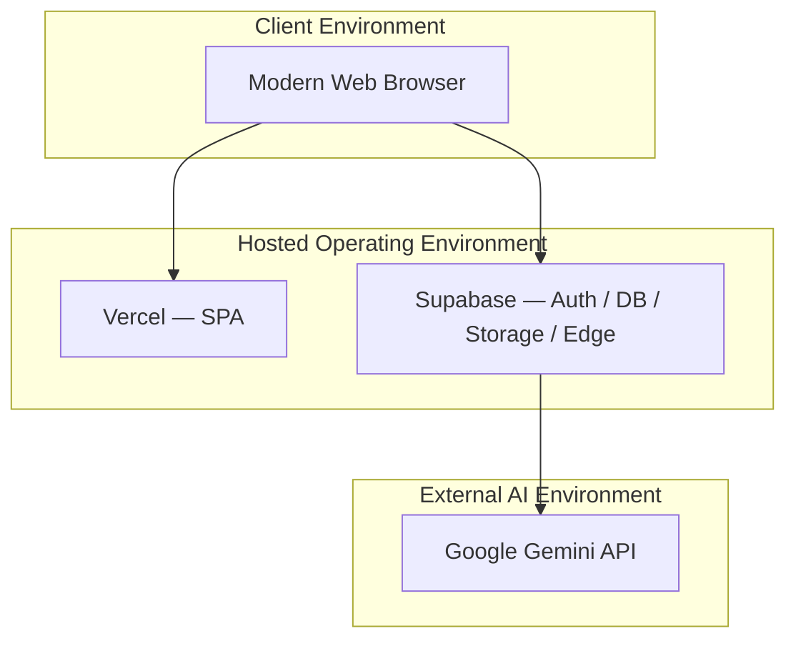

---

## 7. System Features

Section 7 is an **index only**. Behavioral detail and acceptance notes live in §8 Functional Requirements.

| Feature ID | Name | Priority | PRD Trace | SRS-FR Range |
| --- | --- | --- | --- | --- |
| SF-01 | Authentication and Session Control | Must | FR-01–FR-04 | SRS-FR-001–004 |
| SF-02 | Job Opening Management (incl. archive/delete) | Must | FR-05–FR-09 + v1.1 | SRS-FR-005–009, 046–047 |
| SF-03 | Resume Upload and Storage | Must | FR-10–FR-14, FR-17 | SRS-FR-010–014, 017 |
| SF-04 | Resume Parsing and Candidate Extraction | Must | FR-15–FR-17 + v1.1 | SRS-FR-015–017, 048–050 |
| SF-05 | AI Evaluation and Summarization | Must | FR-18–FR-26 + v1.1 | SRS-FR-018–026, 051–053 |
| SF-06 | Ranking and Candidate Review | Must | FR-27–FR-32 | SRS-FR-027–032 |
| SF-07 | Analytics Dashboard | Must core / Should advanced | FR-33–FR-36 | SRS-FR-033–036 |
| SF-08 | Status Tracking and Resilience | Must | FR-37–FR-40 | SRS-FR-037–040 |

### 7.1 Screening Trigger (Normative)

| Rule | Statement |
| --- | --- |
| ST-01 | The system shall provide an explicit **Run Screening** action for a job owner when one or more candidates are in `pending` or `failed_ai` (retry) state and JD text is present. |
| ST-02 | The system may auto-start screening after an upload batch completes as a UX optimization, provided ST-01 remains available and failures remain visible. |

### 7.2 Candidate Status Lifecycle (Index)

Full lifecycle rules are defined in [§8.10 Candidate Status Lifecycle](#810-candidate-status-lifecycle). States: `pending`, `processing`, `completed`, `failed_parse`, `failed_ai`.

---

## 8. Functional Requirements

Template: **ID | Statement | Priority | PRD Trace | Acceptance Note**.

### 8.1 Authentication and Access (SF-01)

| ID | Requirement | Priority | PRD Trace | Acceptance Note |
| --- | --- | --- | --- | --- |
| SRS-FR-001 | The system shall allow a user to register and sign in through Supabase Auth. | Must | FR-01 | Valid credentials create an authenticated session |
| SRS-FR-002 | The system shall deny access to jobs, uploads, rankings, and analytics routes when no valid session exists. | Must | FR-02 | Unauthenticated access blocked or redirected to sign-in |
| SRS-FR-003 | The system shall allow an authenticated user to sign out and invalidate the client session. | Must | FR-03 | Protected routes inaccessible after sign-out |
| SRS-FR-004 | The system shall restrict read/write of jobs, candidates, files, and evaluations to the owning authenticated user through platform security controls (JWT + RLS/ownership policies). | Must | FR-04 | User A cannot read User B data |

### 8.2 Job Opening Management (SF-02)

| ID | Requirement | Priority | PRD Trace | Acceptance Note |
| --- | --- | --- | --- | --- |
| SRS-FR-005 | The system shall allow an authenticated user to create a job opening with a non-empty title and non-empty JD text. | Must | FR-05 | Job persisted and visible |
| SRS-FR-006 | The system shall allow an authenticated user to list and open active job openings owned by that user. | Must | FR-06 | Only owner jobs returned |
| SRS-FR-007 | The system shall allow an authenticated user to update the title and JD text of an owned active job. | Should | FR-07 | Updated values persisted |
| SRS-FR-008 | The system shall associate each candidate, stored resume, and evaluation with exactly one job opening. | Must | FR-08 | Referential integrity enforced |
| SRS-FR-009 | The system shall prevent initiation of AI screening for a job that does not have persisted JD text. | Must | FR-09 | Screening blocked with validation message |
| SRS-FR-046 | The system shall allow an authenticated owner to **archive** an owned job (soft close). | Must | v1.1 extension | Job `lifecycle_status=archived`; hidden from default active list; retained for history |
| SRS-FR-047 | The system shall allow an authenticated owner to **delete** an owned job only when the job has zero candidate records; jobs with candidates shall require archive instead of hard delete in v1. | Must | v1.1 extension | Delete rejected with guidance when candidates exist |

#### 8.2.1 Job Delete and Archive Behavior

| Topic | Normative Behavior |
| --- | --- |
| Archive | Soft state change to `archived`. No new uploads or screening starts. Existing rankings/evaluations remain readable by owner. |
| Unarchive | Should allow restoring `archived` → `active` if implemented; if not implemented in v1, archive is terminal for workflow but data retained. |
| Delete | Hard removal permitted only for jobs with **zero** candidates and zero stored resume objects. |
| Default list | Job list shows `active` jobs by default; archived jobs available via explicit filter/view. |

### 8.3 Resume Upload and Candidate Intake (SF-03)

| ID | Requirement | Priority | PRD Trace | Acceptance Note |
| --- | --- | --- | --- | --- |
| SRS-FR-010 | The system shall allow multiple resume files to be selected and uploaded for a single active job in one user action. | Must | FR-10 | ≥2 files accepted in one batch |
| SRS-FR-011 | The system shall accept only PDF and DOCX resume formats in v1. | Must | FR-11 | Other types rejected |
| SRS-FR-012 | The system shall reject unsupported file types and communicate a clear validation error to the user. | Must | FR-12 | Error identifies invalid type |
| SRS-FR-013 | The system shall store accepted resume binaries in a private Supabase Storage location. | Must | FR-13 | Not anonymously public |
| SRS-FR-014 | The system shall create one candidate record per accepted upload with initial status `pending`. | Must | FR-14 | Candidate count matches accepted files |
| SRS-FR-017 | The system shall continue accepting/processing remaining valid files when one file in a batch fails validation or later processing. | Must | FR-17 | Partial success preserved |

### 8.4 Resume Parsing and Candidate Extraction (SF-04)

| ID | Requirement | Priority | PRD Trace | Acceptance Note |
| --- | --- | --- | --- | --- |
| SRS-FR-015 | The system shall extract text from PDF resumes using pdf-parse and from DOCX resumes using mammoth. | Must | FR-15 | Extractor selected by file type |
| SRS-FR-016 | The system shall set candidate status to `failed_parse` when extracted text is empty or unusable. | Must | FR-16 | No AI scoring required on this path |
| SRS-FR-048 | The system shall extract and persist the **required** candidate fields defined in §8.4.1 from resume content during screening. | Must | v1.1 / UN-04 clarification | Required fields stored on candidate profile |
| SRS-FR-049 | The system shall extract and persist **optional** candidate fields defined in §8.4.1 when present in the resume content. | Should | v1.1 | Optional fields stored when available; omitted when absent |
| SRS-FR-050 | The system shall display extracted candidate fields on candidate detail for HR review. | Must | v1.1 | Fields visible alongside score/summary |

#### 8.4.1 Candidate Extraction Scope

Extraction occurs after usable text is available. Structured extraction may use deterministic parsing and/or Gemini-assisted structured output inside the Screening Engine. Missing optional fields shall not fail screening.

**Required fields (Must extract attempt; store null/empty if absent after attempt)**

| Field ID | Field | Description |
| --- | --- | --- |
| CE-01 | Name | Candidate full name |
| CE-02 | Email | Primary email address |
| CE-03 | Phone | Primary phone number |
| CE-04 | Skills | List of skills |
| CE-05 | Education | Education history entries |
| CE-06 | Experience | Work experience entries |
| CE-07 | Certifications | Certifications / licenses |
| CE-08 | Projects | Notable projects |
| CE-09 | Resume Summary | Short profile/summary text derived from resume |

**Optional fields (Should extract when present)**

| Field ID | Field | Description |
| --- | --- | --- |
| CE-10 | LinkedIn | LinkedIn URL/handle |
| CE-11 | GitHub | GitHub URL/handle |
| CE-12 | Portfolio | Portfolio URL |
| CE-13 | Languages | Spoken/written languages |
| CE-14 | Location | City/region/country |

| Extraction Rule | Statement |
| --- | --- |
| CE-R1 | Absence of one or more required fields after extraction attempt shall not by itself mark `failed_parse` if resume text is usable for scoring. |
| CE-R2 | `failed_parse` applies only when text extraction is empty/unusable (SRS-FR-016). |
| CE-R3 | Extracted field values shall be treated as assistive data for HR; they are not sole hiring authority. |

### 8.5 AI Evaluation and Summarization (SF-05)

| ID | Requirement | Priority | PRD Trace | Acceptance Note |
| --- | --- | --- | --- | --- |
| SRS-FR-018 | The system shall evaluate each parseable candidate resume against the job JD using Google Gemini. | Must | FR-18 | Active evaluation created/updated |
| SRS-FR-019 | The system shall produce a **numeric** `match_score` in the inclusive range 0–100 for each successful evaluation. | Must | FR-19 | Numeric type; range validated |
| SRS-FR-020 | The system shall produce a human-readable `rationale` explaining the match score. | Must | FR-20 | Visible in UI |
| SRS-FR-021 | The system shall produce an AI `summary` suitable for HR review. | Must | FR-21 | Visible in UI |
| SRS-FR-022 | The system shall invoke Gemini only from trusted server/Edge Function context. | Must | FR-22 | No client API key |
| SRS-FR-023 | The system shall persist match_score, rationale, summary, evaluation timestamp, and model metadata on the **active** evaluation for each successful run. | Must | FR-23 | Retrievable after completion |
| SRS-FR-024 | The system shall set candidate status to `failed_ai` when AI evaluation fails after configured retries. | Must | FR-24 | No false `completed` state |
| SRS-FR-025 | The system shall allow an authenticated owner to retry screening for candidates in `failed_ai` status according to §8.5.1. | Should | FR-25 | Retry path available |
| SRS-FR-026 | The system shall not provide automated reject or automated hire actions. | Must | FR-26 | No such controls |
| SRS-FR-051 | The system shall maintain exactly **one active evaluation** per candidate. | Must | v1.1 | Active evaluation uniquely identifiable |
| SRS-FR-052 | On retry or re-screen success/failure finalization, the system shall **overwrite** the candidate’s active evaluation with the latest result. | Must | v1.1 | Active row reflects latest run |
| SRS-FR-053 | Before overwriting an active evaluation, the system shall append the previous active evaluation to **evaluation audit history**. | Must | v1.1 | Prior results retained for audit |

#### 8.5.1 Evaluation Retry Behavior

| Topic | Normative Behavior |
| --- | --- |
| Eligible status | `failed_ai` (Should). Re-screen of `completed` may be supported later; not required in v1. |
| Transition | `failed_ai` → `processing` → `completed` or `failed_ai` |
| Active evaluation | Overwritten by the new run outcome (SRS-FR-052) |
| Audit history | Previous active evaluation copied to history before overwrite (SRS-FR-053) |
| Partial field failure | Invalid AI schema does not mark `completed` (SRS-AI-022) |
| Batch isolation | Retry of one candidate does not reset siblings |

### 8.6 Ranking and Review (SF-06)

| ID | Requirement | Priority | PRD Trace | Acceptance Note |
| --- | --- | --- | --- | --- |
| SRS-FR-027 | The system shall display completed candidates for a job in descending order of match_score. | Must | FR-27 | Rank order matches active scores |
| SRS-FR-028 | The system shall display each candidate’s score, status, and access to summary content in the ranking view. | Must | FR-28 | Fields visible |
| SRS-FR-029 | The system shall allow the user to open candidate detail showing rationale, summary, and extracted fields. | Must | FR-29 | Detail complete |
| SRS-FR-030 | The system shall include failed candidates in the job view with failure status visible. | Must | FR-30 | Distinguishes failed_parse/failed_ai |
| SRS-FR-031 | The system shall provide filtering or equivalent segmentation of candidates by status within a job. | Should | FR-31 | Completed vs failed isolatable |
| SRS-FR-032 | The system shall support pagination or progressive listing for large candidate sets. | Should | FR-32 | Usable beyond one screen |

### 8.7 Analytics (SF-07)

| ID | Requirement | Priority | PRD Trace | Acceptance Note |
| --- | --- | --- | --- | --- |
| SRS-FR-033 | The system shall provide a dashboard showing total jobs, total candidates, and completed evaluations for the authenticated user. | Must | FR-33 | Counts match data |
| SRS-FR-034 | The system shall show distribution of candidate statuses including pending, processing, completed, and failed categories. | Should | FR-34 | Distribution visible |
| SRS-FR-035 | The system shall show score summary metrics for completed evaluations (average score and/or distribution). | Should | FR-35 | Over completed only |
| SRS-FR-036 | The system shall provide job-level analytics within the job workspace or a dedicated job analytics view. | Should | FR-36 | Job-scoped |

### 8.8 Status and Resilience (SF-08)

| ID | Requirement | Priority | PRD Trace | Acceptance Note |
| --- | --- | --- | --- | --- |
| SRS-FR-037 | The system shall transition candidate status only through the lifecycle defined in §8.10. | Must | FR-37 | Illegal transitions prevented |
| SRS-FR-038 | The system shall display job-level aggregate status counts during and/or after screening. | Must | FR-38 | Counts reflect outcomes |
| SRS-FR-039 | The system shall present actionable error messages for unsupported files, parse failures, and AI failures. | Must | FR-39 | Category clear |
| SRS-FR-040 | The system shall preserve successfully completed evaluations when other candidates in the same batch fail. | Must | FR-40 | Mixed batch safe |

### 8.9 Optional and Excluded Functions

| ID | Requirement | Priority | PRD Trace |
| --- | --- | --- | --- |
| SRS-FR-041 | The system may provide CSV export of a ranked shortlist. | Could | FR-41 |
| SRS-FR-042 | The system may record JD edit notes when JD text changes. | Could | FR-42 |
| SRS-FR-043 | The system shall not send candidate-facing emails in v1. | Won't | FR-43 |
| SRS-FR-044 | The system shall not implement Hiring Manager–specific role permissions in v1. | Won't | FR-44 |
| SRS-FR-045 | The system shall not perform OCR on image-only PDFs in v1. | Won't | FR-45 |

### 8.10 Candidate Status Lifecycle

#### 8.10.1 States

| State | Meaning | Terminal? |
| --- | --- | --- |
| `pending` | Uploaded; awaiting screening | No |
| `processing` | Parse, extraction, and/or AI evaluation in progress | No |
| `completed` | Active evaluation validated and persisted | Yes (happy path) |
| `failed_parse` | Text extraction empty/unusable | Yes (unless replaced by re-upload of a new candidate) |
| `failed_ai` | AI evaluation failed after configured retries | No if retry allowed; otherwise terminal until retry |

#### 8.10.2 Lifecycle Rules

| ID | Rule |
| --- | --- |
| CSL-01 | New accepted uploads start in `pending`. |
| CSL-02 | Screening start transitions `pending` or retry-eligible `failed_ai` → `processing`. |
| CSL-03 | Usable text + validated AI outputs → `completed`. |
| CSL-04 | Empty/unusable text → `failed_parse` (no Gemini scoring required). |
| CSL-05 | Gemini/schema failure after bounded retries → `failed_ai`. |
| CSL-06 | `completed` shall not be assigned without validated active evaluation (score, rationale, summary). |
| CSL-07 | One candidate failure shall not transition sibling candidates. |
| CSL-08 | Archive of a parent job shall not rewrite candidate statuses; it only blocks new processing starts. |

#### 8.10.3 Candidate Status State Diagram

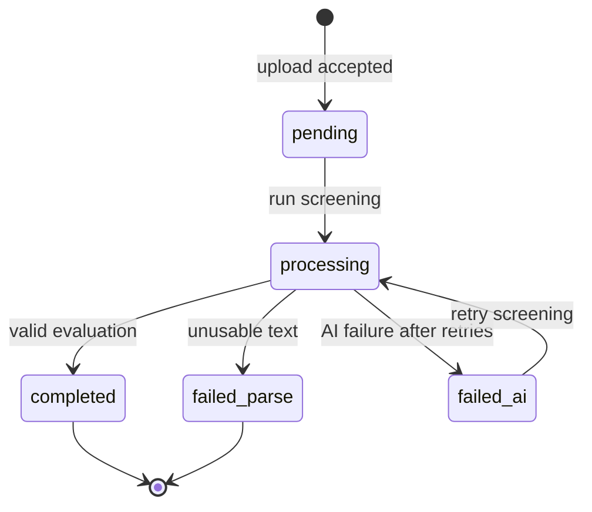

---

## 9. Non-Functional Requirements

This section is the **master Non-Functional Requirements catalog**. §§13–14 reference these IDs and do not restate full requirement text.

| ID | Requirement | Priority | PRD Trace | Category |
| --- | --- | --- | --- | --- |
| SRS-NFR-001 | All preview and production traffic shall be served over HTTPS. | Must | NFR-01 | Security/Transport |
| SRS-NFR-002 | Resume objects shall be stored in private buckets/policies, not public anonymous access. | Must | NFR-02 | Security/Storage |
| SRS-NFR-003 | Gemini API keys and service-role secrets shall not be shipped to or readable by the browser client. | Must | NFR-03 | Security/Secrets |
| SRS-NFR-004 | Data access shall require authentication and ownership/RLS enforcement. | Must | NFR-04 | Security/AuthZ |
| SRS-NFR-005 | Uploads shall enforce allowed MIME types and configured maximum file size. | Must | NFR-05 | Reliability/Validation |
| SRS-NFR-006 | Batch screening shall support partial success. | Must | NFR-06 | Reliability |
| SRS-NFR-007 | Transient AI failures shall be retried with a bounded retry policy. | Should | NFR-07 | Reliability |
| SRS-NFR-008 | Failed candidates shall remain inspectable after batch completion. | Must | NFR-08 | Reliability/UX |
| SRS-NFR-009 | Dashboard and job list should become interactive within 3 seconds under normal demo broadband conditions. | Should | NFR-09 | Performance |
| SRS-NFR-010 | The system shall support at least 20 resumes per job in the v1 demo profile. | Must | NFR-10 | Scalability |
| SRS-NFR-011 | Multi-file screening shall execute asynchronously such that the UI is not permanently blocked. | Must | NFR-11 | Performance/UX |
| SRS-NFR-012 | Ranked lists shall remain usable for growing candidate counts via pagination or equivalent. | Should | NFR-12 | Usability/Performance |
| SRS-NFR-013 | The primary path login → create job → upload → view ranking shall be completable without a training manual. | Must | NFR-13 | Usability |
| SRS-NFR-014 | Processing and failure states shall be visually distinct and understandable. | Must | NFR-14 | Usability |
| SRS-NFR-015 | UI components shall follow accessible practices using shadcn/ui primitives and semantic HTML structure. | Should | NFR-15 | Accessibility |
| SRS-NFR-016 | Layout shall be desktop-first and usable on tablet viewports. | Should | NFR-16 | Usability |
| SRS-NFR-017 | Successful active evaluations shall retain score, summary, timestamp, and model identity metadata; prior actives shall be retained in audit history on overwrite. | Must | NFR-17 + v1.1 | Auditability |
| SRS-NFR-018 | Application implementation should be TypeScript-first with modular boundaries matching architecture modules. | Should | NFR-18 | Maintainability |
| SRS-NFR-019 | Required configuration keys shall be documented in `.env.example` without secret values. | Must | NFR-19 | Operability |
| SRS-NFR-020 | AI and parser adapters should be isolatable behind interfaces to allow mocked testing. | Should | NFR-20 | Testability |
| SRS-NFR-021 | Frontend shall be deployable to Vercel from the Git repository. | Must | NFR-21 | Deployability |
| SRS-NFR-022 | Backend shall run on documented Supabase project configuration. | Must | NFR-22 | Deployability |
| SRS-NFR-023 | Edge Function failures shall be diagnosable via logs and candidate status fields. | Should | NFR-23 | Operability |
| SRS-NFR-024 | Maximum upload size default shall be **5 MB per file**, configurable by environment. | Must | v1.1 / VR-11 | Validation |

---

## 10. External Interface Requirements

### 10.1 User Interfaces

| ID | Requirement |
| --- | --- |
| SRS-EI-001 | The system shall provide web user interfaces for authentication, dashboard, job list/create/archive, job workspace (upload/ranking/status), and candidate detail (including extracted fields). |
| SRS-EI-002 | All primary actions (create job, upload, run screening, view ranking) shall be reachable through clearly labeled controls. |
| SRS-EI-003 | Error, empty, processing, and success states shall be represented in the UI without requiring browser developer tools. |
| SRS-EI-004 | The UI shall not expose raw secret values or service-role keys under any normal user flow. |

### 10.2 Software Interfaces

| ID | Interface | Requirement |
| --- | --- | --- |
| SRS-EI-010 | Supabase Auth | Registration, sign-in, sign-out, and session retrieval |
| SRS-EI-011 | Supabase PostgreSQL | Persist/query jobs, candidates, extracted fields, active evaluations, and evaluation audit history |
| SRS-EI-012 | Supabase Storage | Authenticated upload/retrieval of private resume objects |
| SRS-EI-013 | Supabase Edge Functions | Screening Engine for parse, extraction, AI evaluate, persist |
| SRS-EI-014 | Google Gemini API | HTTPS server-side structured evaluation and extraction assistance |
| SRS-EI-015 | pdf-parse | PDF text extraction |
| SRS-EI-016 | mammoth | DOCX text extraction |

### 10.3 Communications Interfaces

| ID | Requirement |
| --- | --- |
| SRS-EI-020 | Client-to-Vercel and client-to-Supabase communications shall use HTTPS. |
| SRS-EI-021 | Edge Function-to-Gemini communications shall use HTTPS. |
| SRS-EI-022 | Authentication to Supabase data/storage/functions shall use the user JWT; privileged server credentials shall be used only inside Edge Functions as designed. |

### 10.4 Hardware Interfaces

No specialized hardware interfaces. Standard workstation input/output via the browser is assumed.

### 10.5 Interface Sequence (Screening)

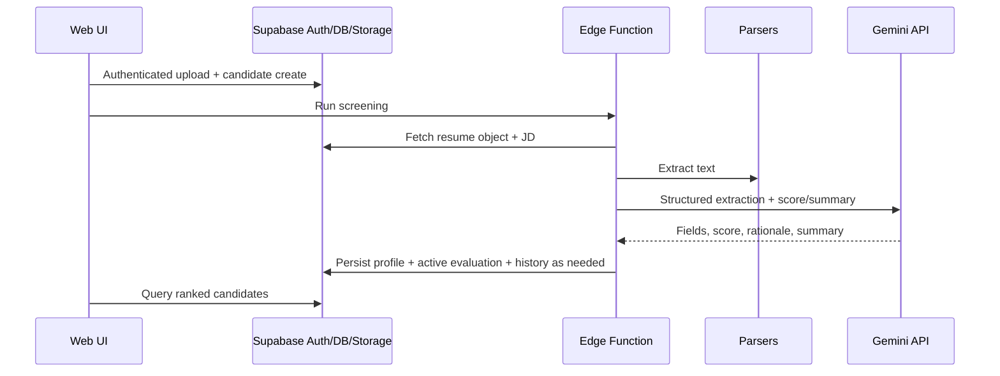

---

## 11. Database Requirements

Detailed physical schema is deferred to RR-DB-005. This SRS defines required data capabilities.

### 11.1 Required Logical Entities

| ID | Entity | Required Data | Notes |
| --- | --- | --- | --- |
| SRS-DB-001 | User/Profile | Auth user identity linkage | Supabase Auth + profile as needed |
| SRS-DB-002 | Job | id, owner_user_id, title, jd_text, lifecycle_status (`active`/`archived`), timestamps | Archive/delete rules in §8.2.1 |
| SRS-DB-003 | Candidate | id, job_id, source_file_path, original_filename, status, timestamps, extracted field set | Status per §8.10 |
| SRS-DB-004 | Active Evaluation | id, candidate_id, job_id, match_score, rationale, summary, model_metadata, evaluated_at, is_active=true | Exactly one active per candidate |
| SRS-DB-005 | Evaluation Audit History | prior evaluation snapshots with timestamps and candidate_id | Written before overwrite |
| SRS-DB-006 | Operational error info | failure category / message | Supports failed_parse/failed_ai |

### 11.2 Integrity and Access Requirements

| ID | Requirement |
| --- | --- |
| SRS-DB-010 | Every candidate shall reference an existing job. |
| SRS-DB-011 | Every evaluation (active or history) shall reference an existing candidate and job. |
| SRS-DB-012 | Owner-based access policies shall prevent cross-user data reads/writes. |
| SRS-DB-013 | Hard delete of jobs shall be blocked when candidates exist (SRS-FR-047). |
| SRS-DB-014 | Candidate status values shall be constrained to `pending`, `processing`, `completed`, `failed_parse`, `failed_ai`. |
| SRS-DB-015 | At most one active evaluation row/flag shall exist per candidate. |

### 11.3 Storage Requirements

| ID | Requirement |
| --- | --- |
| SRS-DB-020 | Resume binaries shall be stored in object storage, not unconstrained bytea in application tables. |
| SRS-DB-021 | Database records shall store object path/metadata sufficient to retrieve the resume. |
| SRS-DB-022 | Storage buckets used for resumes shall be private. |

### 11.4 Analytics Data Requirements

| ID | Requirement |
| --- | --- |
| SRS-DB-030 | The data model shall support aggregation of jobs count, candidates count, completed evaluations count, and status distribution for the authenticated user. |
| SRS-DB-031 | The data model shall support average/distribution queries over active match_score for completed evaluations. |

### 11.5 Conceptual Entity Relationship Diagram

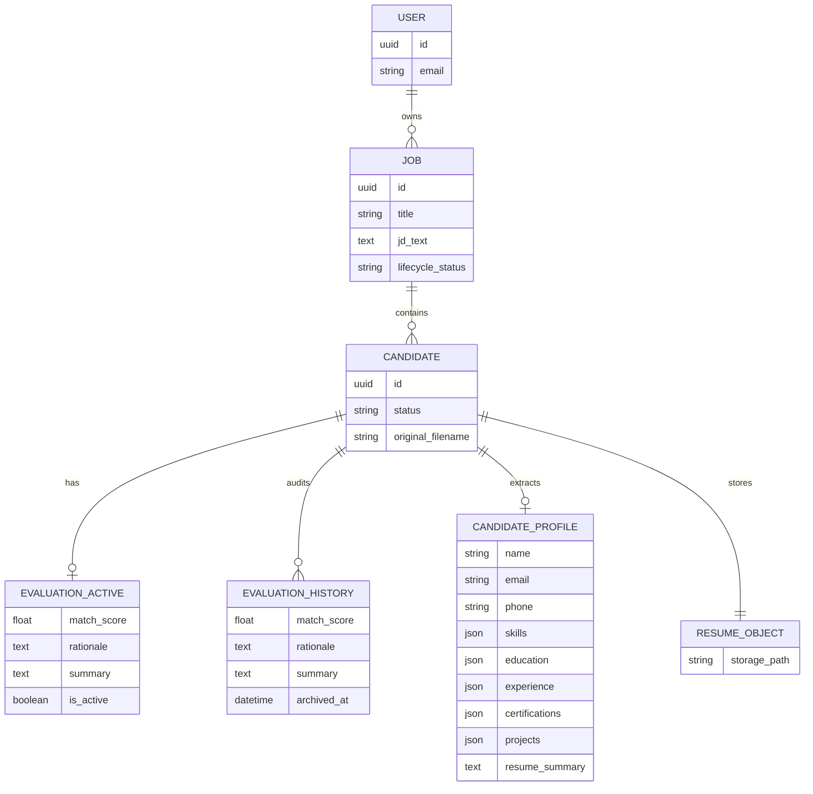

---

## 12. AI Requirements

Prompt-level design is detailed in RR-AI-008. This section binds observable AI behavior and evaluation lifecycle.

### 12.1 AI Functional Behavior

| ID | Requirement | Priority |
| --- | --- | --- |
| SRS-AI-001 | For each parseable candidate, the system shall submit JD text and resume text to Gemini for evaluation. | Must |
| SRS-AI-002 | The AI response shall be interpreted into structured fields including numeric match_score (0–100), rationale, and summary, and may include structured extraction fields. | Must |
| SRS-AI-003 | The system shall reject persistence of AI outputs that fail schema validation for scoring outputs. | Must |
| SRS-AI-004 | The system shall record model identity metadata with each successful active evaluation. | Must |
| SRS-AI-005 | The system shall not use AI output to trigger autonomous candidate rejection or hiring side effects. | Must |
| SRS-AI-006 | The system should retry transient Gemini failures under a bounded policy before marking `failed_ai`. | Should |
| SRS-AI-007 | The system shall maintain one active evaluation per candidate; retries overwrite the active evaluation after writing audit history. | Must |

### 12.2 AI Placement and Safety

| ID | Requirement | Priority |
| --- | --- | --- |
| SRS-AI-010 | Gemini API calls shall execute only in Edge Function/server context. | Must |
| SRS-AI-011 | Prompt assembly and secret usage shall not occur in browser code. | Must |
| SRS-AI-012 | Resume text shall be truncated/normalized as needed to fit model input limits without crashing the batch. | Must |
| SRS-AI-013 | AI limitations (possible bias, parse quality dependence, incomplete extraction) shall be acknowledged in product/MBA documentation; runtime shall still return rationale for transparency. | Must |

### 12.3 AI Output Quality Gates

| ID | Requirement |
| --- | --- |
| SRS-AI-020 | `match_score` shall be **numeric** (not restricted to integers) and within 0–100 inclusive after validation. |
| SRS-AI-021 | `rationale` and `summary` shall be non-empty strings after validation for `completed` status. |
| SRS-AI-022 | A candidate shall not be marked `completed` unless SRS-AI-020 and SRS-AI-021 are satisfied on the active evaluation. |

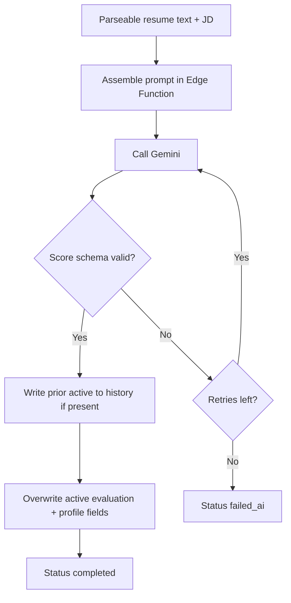

---

## 13. Security Requirements

Security Must/Should obligations are defined in the master catalog:

| Security Concern | Master Requirement IDs |
| --- | --- |
| HTTPS/TLS | SRS-NFR-001 |
| Private resume storage | SRS-NFR-002 |
| Secret isolation | SRS-NFR-003 |
| AuthN/AuthZ + RLS | SRS-NFR-004 |
| Upload validation | SRS-NFR-005, SRS-NFR-024 |
| Audit retention | SRS-NFR-017 |

### 13.1 Specialized Security Notes

| ID | Note | Related |
| --- | --- | --- |
| SRS-SEC-001 | Non-public screens/APIs that access job/candidate/evaluation data require authentication. | SRS-NFR-004, SRS-FR-002 |
| SRS-SEC-002 | Client shall use the publishable anon key only; never the service-role key. | SRS-NFR-003, RR-ARCH-001 |
| SRS-SEC-003 | The system shall not expose other users’ filenames, scores, JD text, or extracted PII through enumerable public URLs. | SRS-NFR-002, SRS-NFR-004 |
| SRS-SEC-004 | Security-relevant failures shall return safe, non-sensitive error text and shall not expose secrets or stack traces to end users. | EH-07 |
| SRS-SEC-005 | Evaluation audit history is retained for academic/operational review and shall be owner-scoped by RLS. | SRS-NFR-017, SRS-FR-053 |

Detailed threat modeling belongs in RR-SEC-009. Trust boundary diagram: [§2.10](#210-security-trust-boundary-overview).

---

## 14. Performance Requirements

Performance Must/Should obligations are defined in the master catalog:

| Performance Concern | Master Requirement IDs |
| --- | --- |
| Dashboard/job list responsiveness | SRS-NFR-009 |
| Demo capacity (≥20 resumes/job) | SRS-NFR-010 |
| Asynchronous non-blocking screening | SRS-NFR-011 |
| Pagination/progressive lists | SRS-NFR-012 |
| Diagnosable long-running processing via status | SRS-NFR-023, SRS-FR-038 |
| Bounded AI retries | SRS-NFR-007 |

### 14.1 Specialized Performance Notes

| ID | Note | Related |
| --- | --- | --- |
| SRS-PER-001 | Ranking queries should return within 3 seconds for demo-scale datasets (up to a few hundred candidates). | SRS-NFR-009, SRS-NFR-012 |
| SRS-PER-002 | Edge Function runtime may exceed UI read latency; status fields shall provide progress feedback. | SRS-FR-037, SRS-FR-038 |
| SRS-PER-003 | Absolute production SLAs beyond demo conditions are not asserted in v1 academic scope except Must items in §9. | Scope control |

---

## 15. Use Cases

### 15.1 Use Case Index

| Use Case ID | Name | Actor | Priority |
| --- | --- | --- | --- |
| UC-01 | Register and Sign In | HR Recruiter | Must |
| UC-02 | Sign Out | HR Recruiter | Must |
| UC-03 | Create Job Opening | HR Recruiter | Must |
| UC-04 | Upload Resumes to Job | HR Recruiter | Must |
| UC-05 | Run Screening Pipeline | System / HR trigger | Must |
| UC-06 | Review Ranked Candidates | HR Recruiter | Must |
| UC-07 | Inspect Candidate AI Summary and Extracted Profile | HR Recruiter | Must |
| UC-08 | View Analytics Dashboard | HR Recruiter | Must |
| UC-09 | Handle Failed Candidate | HR Recruiter | Must |
| UC-10 | Retry Failed AI Evaluation | HR Recruiter | Should |

### 15.2 Use Case Diagram

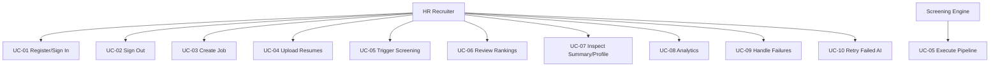

### 15.3 UC-01 Register and Sign In

| Field | Detail |
| --- | --- |
| **Actor** | HR Recruiter |
| **Precondition** | Application reachable; user not authenticated |
| **Main flow** | 1. User opens auth screen 2. Submits registration or sign-in credentials 3. System authenticates via Supabase Auth 4. Session established 5. User reaches protected app area |
| **Alternate** | Invalid credentials → error; no session |
| **Postcondition** | Valid session; protected routes accessible |
| **Requirements** | SRS-FR-001, SRS-FR-002 |

### 15.4 UC-02 Sign Out

| Field | Detail |
| --- | --- |
| **Actor** | HR Recruiter |
| **Precondition** | User is authenticated |
| **Main flow** | 1. User selects Sign Out 2. System invokes Supabase Auth sign-out 3. Client session cleared 4. User is returned to public/auth screen |
| **Alternate** | Network failure during sign-out → client still clears local session and blocks protected navigation; user prompted to retry if server session lingers |
| **Postcondition** | No usable authenticated client session; jobs/uploads/rankings/analytics inaccessible |
| **Requirements** | SRS-FR-003, SRS-FR-002 |

### 15.5 UC-03 Create Job Opening

| Field | Detail |
| --- | --- |
| **Actor** | HR Recruiter |
| **Precondition** | User authenticated |
| **Main flow** | 1. User selects create job 2. Enters title and JD text 3. Submits 4. System validates and persists active job 5. Job appears in list/workspace |
| **Alternate** | Missing title/JD → validation error |
| **Postcondition** | Active job available for uploads |
| **Requirements** | SRS-FR-005, SRS-FR-006, VR-01, VR-02 |

### 15.6 UC-04 Upload Resumes to Job

| Field | Detail |
| --- | --- |
| **Actor** | HR Recruiter |
| **Precondition** | Active job with JD exists; user is owner |
| **Main flow** | 1. User selects multiple PDF/DOCX files 2. System validates each file 3. Valid files stored privately 4. Candidate records created as `pending` 5. User sees upload results |
| **Alternate** | Unsupported/oversized file rejected; other files continue |
| **Postcondition** | One candidate per accepted file |
| **Requirements** | SRS-FR-010–014, SRS-FR-017, VR-10–VR-14 |

### 15.7 UC-05 Run Screening Pipeline

| Field | Detail |
| --- | --- |
| **Actor** | HR Recruiter (trigger) and Screening Engine (execution) |
| **Precondition** | Pending (or retry-eligible) candidates exist; JD present; job active |
| **Main flow** | 1. Owner runs screening (ST-01) 2. Status → `processing` 3. Text extracted 4. Structured fields extracted 5. Gemini returns score/rationale/summary 6. Active evaluation persisted (history written if overwrite) 7. Status → `completed` |
| **Alternate** | Empty parse → `failed_parse`; AI failure after retries → `failed_ai`; siblings continue |
| **Postcondition** | Terminal or retry-eligible statuses set; completed rankings queryable |
| **Requirements** | SRS-FR-015–024, SRS-FR-037–040, SRS-FR-048–053, SRS-AI-* |

### 15.8 UC-06 Review Ranked Candidates

| Field | Detail |
| --- | --- |
| **Actor** | HR Recruiter |
| **Precondition** | Job owned by user; zero or more completed evaluations |
| **Main flow** | 1. User opens ranking view 2. Completed candidates listed by descending active match_score 3. User reviews scores/statuses 4. User may open details |
| **Alternate** | No completed candidates → empty/in-progress state |
| **Postcondition** | Top-ranked candidates identifiable without opening original files |
| **Requirements** | SRS-FR-027–030 |

### 15.9 UC-07 Inspect Candidate AI Summary and Extracted Profile

| Field | Detail |
| --- | --- |
| **Actor** | HR Recruiter |
| **Precondition** | Candidate exists for an owned job; preferably `completed` for full AI fields |
| **Main flow** | 1. User opens candidate from ranking/list 2. System displays status 3. If completed: shows match_score, rationale, summary 4. System displays extracted required fields and any optional fields present 5. User uses information for human shortlist judgment |
| **Alternate** | `failed_parse`/`failed_ai` → show failure category/message; AI fields may be absent; extracted fields may be partial |
| **Postcondition** | User has explainable evidence for review without autonomous system decision |
| **Requirements** | SRS-FR-020, SRS-FR-021, SRS-FR-029, SRS-FR-048–050 |

### 15.10 UC-08 View Analytics Dashboard

| Field | Detail |
| --- | --- |
| **Actor** | HR Recruiter |
| **Precondition** | Authenticated |
| **Main flow** | 1. User opens dashboard 2. System shows totals for jobs, candidates, completed evaluations 3. Optional status/score metrics displayed if implemented (Should) |
| **Postcondition** | Metrics reflect user-owned data |
| **Requirements** | SRS-FR-033 (Must), SRS-FR-034–036 (Should) |

### 15.11 UC-09 Handle Failed Candidate

| Field | Detail |
| --- | --- |
| **Actor** | HR Recruiter |
| **Precondition** | One or more candidates in `failed_parse` or `failed_ai` |
| **Main flow** | 1. User views job candidates 2. Failure statuses visible 3. User reads actionable failure category/message 4. User decides to re-upload (new candidate) or retry AI if available |
| **Postcondition** | Failures do not hide successful rankings |
| **Requirements** | SRS-FR-030, SRS-FR-039, SRS-FR-040 |

### 15.12 UC-10 Retry Failed AI Evaluation

| Field | Detail |
| --- | --- |
| **Actor** | HR Recruiter |
| **Precondition** | Candidate in `failed_ai`; job active; JD present; user is owner |
| **Main flow** | 1. User selects Retry on the candidate 2. System sets status to `processing` 3. If an active evaluation snapshot exists from earlier attempts, it is written to audit history as required by lifecycle 4. Screening Engine re-runs parse-needed checks and Gemini evaluation 5a. Success → overwrite active evaluation; status `completed` 5b. Failure after retries → status `failed_ai` |
| **Alternate** | Job archived → retry blocked; missing JD → validation error |
| **Postcondition** | Exactly one active evaluation remains; prior active retained in history when overwritten; sibling candidates unaffected |
| **Requirements** | SRS-FR-025, SRS-FR-051–053, SRS-AI-007, CSL-02, CSL-05 |

### 15.13 Use Case Relationship Flow

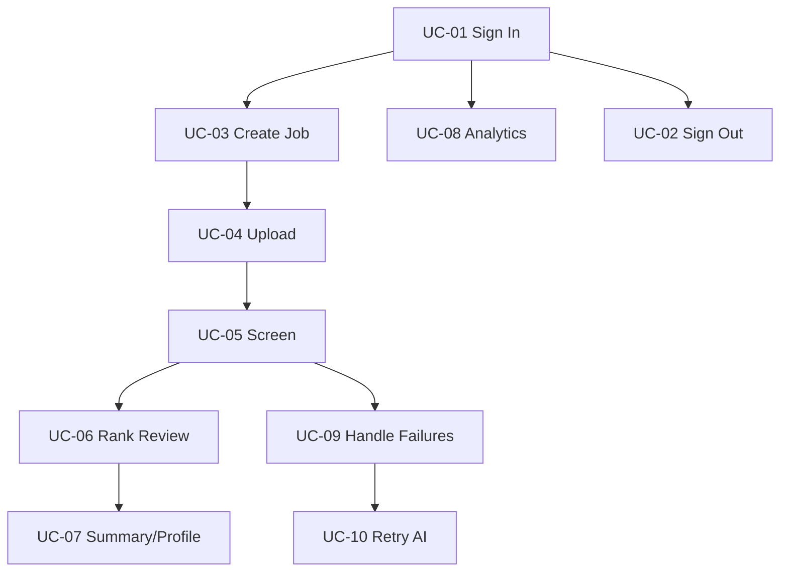

---

## 16. Business Rules

| ID | Business Rule | Enforcement |
| --- | --- | --- |
| BR-01 | Only authenticated HR users may create jobs and upload resumes. | Auth + route guards + RLS |
| BR-02 | AI may rank and summarize; AI shall not auto-reject or auto-hire. | No autonomous decision actions |
| BR-03 | Every successful evaluation shall retain score, summary, timestamp, and model metadata on the active evaluation. | Persistence validation |
| BR-04 | A single resume parse/AI failure shall not abort the entire batch. | Screening Engine isolation |
| BR-05 | Gemini credentials shall never be exposed to the browser. | Edge-only secrets |
| BR-06 | v1 shall accept PDF and DOCX resumes only. | Upload validation |
| BR-07 | Screening and ranking are always scoped to a single job opening. | Data model + UI scope |
| BR-08 | A candidate marked `completed` must have a validated active evaluation payload. | Status transition guards |
| BR-09 | Users shall only access jobs/candidates/evaluations they own. | Authorization policies |
| BR-10 | Human decision-making remains outside automated system side effects in v1. | Product scope control |
| BR-11 | Jobs with candidates shall be archived rather than hard-deleted. | SRS-FR-046–047 |
| BR-12 | One active evaluation per candidate; overwrite on retry with audit history retention. | SRS-FR-051–053 |

---

## 17. Validation Rules

### 17.1 Job Validation

| ID | Rule |
| --- | --- |
| VR-01 | Job title shall be required and non-empty after trim. |
| VR-02 | JD text shall be required and non-empty after trim before screening can start. |
| VR-03 | Job update shall not clear ownership fields. |
| VR-04 | Hard delete allowed only when candidate count = 0. |
| VR-05 | Screening and uploads allowed only when job `lifecycle_status=active`. |

### 17.2 Upload Validation

| ID | Rule |
| --- | --- |
| VR-10 | Accepted extensions/MIME types limited to configured PDF and DOCX families. |
| VR-11 | Each file shall not exceed the configured maximum size (default **5 MB** per SRS-NFR-024). |
| VR-12 | Empty file uploads shall be rejected. |
| VR-13 | Maximum files per batch shall be configurable; demo profile shall allow at least 20. |
| VR-14 | Uploads shall be associated with an existing owned active job_id. |

### 17.3 Status and Evaluation Validation

| ID | Rule |
| --- | --- |
| VR-20 | Status values limited to `pending`, `processing`, `completed`, `failed_parse`, `failed_ai`. |
| VR-21 | Transition to `completed` requires validated active match_score, rationale, and summary. |
| VR-22 | match_score shall be numeric and within 0–100 inclusive. |
| VR-23 | rationale and summary shall be non-empty for completed evaluations. |
| VR-24 | failed_ai/failed_parse records shall retain enough information for UI messaging. |
| VR-25 | Overwrite of active evaluation shall be preceded by history capture when a previous active evaluation exists. |

### 17.4 Auth Validation

| ID | Rule |
| --- | --- |
| VR-30 | Sign-in requires credential format accepted by Supabase Auth. |
| VR-31 | Protected operations require a valid non-expired session token. |

### 17.5 Extraction Validation

| ID | Rule |
| --- | --- |
| VR-40 | Required extraction fields CE-01–CE-09 shall be attempted; null/empty allowed if absent in source. |
| VR-41 | Optional fields CE-10–CE-14 may be omitted when not present. |
| VR-42 | Extraction incompleteness alone shall not force `failed_parse` when text is usable. |

---

## 18. Error Handling

### 18.1 Error Categories

| Code | Category | Typical Cause | User-visible Handling |
| --- | --- | --- | --- |
| EH-AUTH | Authentication error | Invalid credentials / expired session | Prompt re-authentication |
| EH-VAL | Validation error | Bad input/file type/size | Inline error; no invalid persist |
| EH-FORB | Authorization error | Accessing another user’s job | Access denied; no data leak |
| EH-STORE | Storage error | Upload failure | Retry guidance; no false completion |
| EH-PARSE | Parse error | Unreadable/empty extraction | Status `failed_parse` |
| EH-AI | AI error | Gemini timeout/invalid JSON/exhausted retries | Status `failed_ai` |
| EH-SYS | System/platform error | Supabase/Vercel disruption | Generic failure + safe retry guidance |

### 18.2 Error Handling Requirements

| ID | Requirement |
| --- | --- |
| EH-01 | Validation errors shall prevent persistence of invalid entities. |
| EH-02 | Parse and AI errors shall be isolated per candidate and shall not roll back completed siblings in the same batch. |
| EH-03 | The UI shall show failure category for failed candidates (`failed_parse` or `failed_ai`). |
| EH-04 | The system shall not mark a candidate `completed` if active evaluation persistence fails. |
| EH-05 | Edge Function errors shall update candidate status and emit diagnostic logs. |
| EH-06 | Auth errors on protected routes shall result in sign-in redirection or equivalent lockout of protected content. |
| EH-07 | Error messages shall be actionable and shall not expose secrets or stack traces to end users. |
| EH-08 | Retry of `failed_ai` shall move the candidate into `processing`, overwrite the active evaluation only after history capture when a previous active evaluation exists, and shall not modify sibling candidates. |

### 18.3 Batch Error Behavior

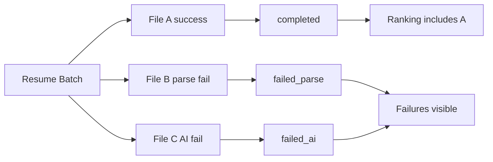

---

## 19. Future Scope

| ID | Future Requirement Area | Notes |
| --- | --- | --- |
| FS-01 | Hiring Manager roles and shortlist sharing | RBAC expansion |
| FS-02 | Multi-tenant organizations | Identity model change |
| FS-03 | OCR for scanned resumes | New parsing dependency |
| FS-04 | Pluggable LLM providers | AI adapter generalization |
| FS-05 | Realtime screening progress channels | Supabase Realtime |
| FS-06 | CSV/PDF export and interview scheduling integrations | New modules |
| FS-07 | Bias/fairness analytics | Ethics + data policy |
| FS-08 | ATS/HRIS connectors | External interface expansion |
| FS-09 | Candidate self-service portal | New user class |
| FS-10 | Advanced longitudinal analytics | Event tracking expansion |
| FS-11 | Hard delete cascade with explicit multi-step confirmation | Beyond v1 archive-first policy |
| FS-12 | Re-screen completed candidates with versioned comparisons UI | Builds on audit history |

Promotion into mandatory requirements requires versioned PRD and SRS updates.

---

## 20. Glossary

| Term | Definition |
| --- | --- |
| Active Evaluation | The current evaluation result for a candidate; exactly one per candidate |
| Archive | Soft close of a job (`lifecycle_status=archived`) retaining data |
| Audit History | Prior active evaluations retained when overwritten |
| Candidate Extraction | Structured field capture from resume content (CE-01–CE-14) |
| Candidate Status Lifecycle | Allowed states and transitions for screening status |
| Edge Function | Privileged serverless function hosting Screening Engine logic |
| Evaluation | AI result containing numeric match_score, rationale, summary, metadata |
| Human-in-the-loop | AI assists; humans decide |
| IEEE 830 | Recommended practice for Software Requirements Specifications |
| Job Opening | Recruiting role entity with JD text |
| Match Score | Numeric fitness score in the inclusive range 0–100 |
| MoSCoW | Must/Should/Could/Won't prioritization |
| Non-Functional Requirements | Quality attributes catalogued in §9 |
| Ownership | Data access bound to creating authenticated user in v1 |
| Rationale | Explanation accompanying a match score |
| RLS | PostgreSQL Row Level Security |
| Screening Engine | Orchestrator for parse → extract → AI → persist |
| Shall / Should / May | Mandatory / recommended / optional requirement verbs |
| SPA | Single-Page Application |
| SRS | Software Requirements Specification |
| Terminal state | `completed` or `failed_parse` (and `failed_ai` until retry) |
| v1 | First accepted academic/production demo release |

---

## 21. References

1. IEEE Std 830-1998 — IEEE Recommended Practice for Software Requirements Specifications.
2. RR-DOC-000 — ResumeRank AI Documentation Roadmap v1.0.0.
3. RR-ARCH-001 — ResumeRank AI Project Architecture Document v2.0.0.
4. RR-PRD-002 — ResumeRank AI Product Requirements Document v1.0.0.
5. ISO/IEC/IEEE 29148 — Requirements engineering (supporting alignment).
6. Supabase Documentation — Auth, Database, Storage, Edge Functions.
7. Google AI Gemini API Documentation.
8. Vercel Documentation.
9. pdf-parse and mammoth library documentation.

---

## 22. Appendices

### Appendix A — PRD to SRS Traceability Matrix (Functional)

| PRD FR | SRS Requirement | System Feature |
| --- | --- | --- |
| FR-01 | SRS-FR-001 | SF-01 |
| FR-02 | SRS-FR-002 | SF-01 |
| FR-03 | SRS-FR-003 | SF-01 |
| FR-04 | SRS-FR-004 | SF-01 |
| FR-05 | SRS-FR-005 | SF-02 |
| FR-06 | SRS-FR-006 | SF-02 |
| FR-07 | SRS-FR-007 | SF-02 |
| FR-08 | SRS-FR-008 | SF-02 |
| FR-09 | SRS-FR-009 | SF-02 |
| FR-10 | SRS-FR-010 | SF-03 |
| FR-11 | SRS-FR-011 | SF-03 |
| FR-12 | SRS-FR-012 | SF-03 |
| FR-13 | SRS-FR-013 | SF-03 |
| FR-14 | SRS-FR-014 | SF-03 |
| FR-15 | SRS-FR-015 | SF-04 |
| FR-16 | SRS-FR-016 | SF-04 |
| FR-17 | SRS-FR-017 | SF-03 / SF-08 |
| FR-18 | SRS-FR-018 | SF-05 |
| FR-19 | SRS-FR-019 | SF-05 |
| FR-20 | SRS-FR-020 | SF-05 |
| FR-21 | SRS-FR-021 | SF-05 |
| FR-22 | SRS-FR-022 | SF-05 |
| FR-23 | SRS-FR-023 | SF-05 |
| FR-24 | SRS-FR-024 | SF-05 |
| FR-25 | SRS-FR-025 | SF-05 |
| FR-26 | SRS-FR-026 | SF-05 |
| FR-27 | SRS-FR-027 | SF-06 |
| FR-28 | SRS-FR-028 | SF-06 |
| FR-29 | SRS-FR-029 | SF-06 |
| FR-30 | SRS-FR-030 | SF-06 |
| FR-31 | SRS-FR-031 | SF-06 |
| FR-32 | SRS-FR-032 | SF-06 |
| FR-33 | SRS-FR-033 | SF-07 |
| FR-34 | SRS-FR-034 | SF-07 |
| FR-35 | SRS-FR-035 | SF-07 |
| FR-36 | SRS-FR-036 | SF-07 |
| FR-37 | SRS-FR-037 | SF-08 |
| FR-38 | SRS-FR-038 | SF-08 |
| FR-39 | SRS-FR-039 | SF-08 |
| FR-40 | SRS-FR-040 | SF-08 |
| FR-41–45 | SRS-FR-041–045 | Optional/Excluded |
| UN-04 / project extraction scope | SRS-FR-048–050 | SF-04 |
| v1.1 job lifecycle | SRS-FR-046–047 | SF-02 |
| v1.1 evaluation audit | SRS-FR-051–053 | SF-05 |

### Appendix B — PRD NFR to SRS Traceability

| PRD NFR | SRS Master ID | Also Referenced In |
| --- | --- | --- |
| NFR-01 | SRS-NFR-001 | §13 |
| NFR-02 | SRS-NFR-002 | §13 |
| NFR-03 | SRS-NFR-003 | §13, SRS-AI-010 |
| NFR-04 | SRS-NFR-004 | §13 |
| NFR-05 | SRS-NFR-005 / SRS-NFR-024 | VR-10–VR-12 |
| NFR-06 | SRS-NFR-006 | EH-02 |
| NFR-07 | SRS-NFR-007 | SRS-AI-006, §14 |
| NFR-08 | SRS-NFR-008 | — |
| NFR-09 | SRS-NFR-009 | §14 |
| NFR-10 | SRS-NFR-010 | §14 |
| NFR-11 | SRS-NFR-011 | §14 |
| NFR-12 | SRS-NFR-012 | §14 |
| NFR-13 | SRS-NFR-013 | — |
| NFR-14 | SRS-NFR-014 | — |
| NFR-15 | SRS-NFR-015 | — |
| NFR-16 | SRS-NFR-016 | — |
| NFR-17 | SRS-NFR-017 | §13 |
| NFR-18 | SRS-NFR-018 | — |
| NFR-19 | SRS-NFR-019 | — |
| NFR-20 | SRS-NFR-020 | — |
| NFR-21 | SRS-NFR-021 | — |
| NFR-22 | SRS-NFR-022 | — |
| NFR-23 | SRS-NFR-023 | EH-05, §14 |

### Appendix C — Acceptance Gate Mapping

| PRD Gate | Supporting SRS Artifacts |
| --- | --- |
| AC-G01 | UC-01, UC-02, SRS-FR-001–003 |
| AC-G02 | UC-03, SRS-FR-005–006 |
| AC-G03 | UC-04, SRS-FR-010–014, VR-10–14 |
| AC-G04 | UC-05, SRS-FR-015–023, SRS-FR-048–050, SRS-AI-* |
| AC-G05 | UC-06, SRS-FR-027–028 |
| AC-G06 | UC-07, SRS-FR-020–021, SRS-FR-029, SRS-FR-050 |
| AC-G07 | UC-09, SRS-FR-017, SRS-FR-040, EH-02 |
| AC-G08 | UC-08, SRS-FR-033 |
| AC-G09 | §9 security NFRs, SRS-SEC-*, SRS-FR-022, SRS-FR-026 |
| AC-G10 | SRS-NFR-021, SRS-NFR-022 |

### Appendix D — Document Control and Diagram Catalog

| Item | Value |
| --- | --- |
| Storage path | `docs/01-requirements/03-Software-Requirements-Specification.md` |
| Current version | 1.1.0 |
| Upstream baselines | RR-ARCH-001 v2.0.0; RR-PRD-002 v1.0.0 |
| Change control | Any Must requirement change requires version bump and design/test impact review |
| Next document | RR-SDD-004 System Design Document |

| Diagram | Location | Type |
| --- | --- | --- |
| Product context | §2.2 | Flowchart |
| Trust boundary | §2.10 | Flowchart |
| Product functions | §4 | Flowchart |
| Operating environment | §6.4 | Flowchart |
| Candidate status lifecycle | §8.10.3 | State diagram |
| Screening sequence | §10.5 | Sequence diagram |
| Conceptual ERD | §11.5 | ER diagram |
| AI validation flow | §12.3 | Flowchart |
| Use case diagram | §15.2 | Flowchart |
| Use case relationships | §15.13 | Flowchart |
| Batch error behavior | §18.3 | Flowchart |

### Appendix E — Change Log (v1.1.0)

| ID | Priority | Modification |
| --- | --- | --- |
| CL-01 | P1 | Fully documented **UC-02 Sign Out** with main/alternate flows and requirement links. |
| CL-02 | P1 | Fully documented **UC-07 Inspect Candidate AI Summary and Extracted Profile**. |
| CL-03 | P1 | Fully documented **UC-10 Retry Failed AI Evaluation**, including history overwrite behavior. |
| CL-04 | P1 | Added **§8.10 Candidate Status Lifecycle** with CSL rules and state diagram. |
| CL-05 | P1 | Defined **Job Archive and Delete** behavior (SRS-FR-046, SRS-FR-047, VR-04, VR-05, BR-11). |
| CL-06 | P1 | Defined **Evaluation Retry** behavior (SRS-FR-051–053, §8.5.1, EH-08, BR-12). |
| CL-07 | P1 | Defined **Candidate Extraction Scope** CE-01–CE-14 and SRS-FR-048–050. |
| CL-08 | P2 | Fixed incorrect §2.4 reference that pointed assumptions to Appendix C; Appendix C is now correctly only Acceptance Gate Mapping; assumptions remain in §2.4.1. |
| CL-09 | P2 | Verified and updated internal anchors for appendices A–E. |
| CL-10 | P2 | Preserved SRS-FR-001–045 numbering; added SRS-FR-046–053 for v1.1 extensions. |
| CL-11 | P2 | Expanded Appendix A/B/C traceability for new requirements and UC-02/07/10. |
| CL-12 | P3 | Merged Product Perspective content into Overall Description §§2.6–2.10; §3 retained as pointer section. |
| CL-13 | P3 | Reduced System Features (§7) to an index table plus screening-trigger notes. |
| CL-14 | P3 | Established §9 as master **Non-Functional Requirements**; §13/§14 now reference master IDs. |
| CL-15 | P4 | Added Candidate Status State Diagram (§8.10.3). |
| CL-16 | P4 | Added Conceptual ER Diagram (§11.5). |
| CL-17 | P4 | Added Use Case Diagram (§15.2). |
| CL-18 | P4 | Added Security Trust Boundary Diagram (§2.10). |
| CL-19 | P4 | Removed C4Context syntax; replaced with portable Mermaid flowcharts. |
| CL-20 | P5 | Clarified one active evaluation per candidate; retry overwrites active; previous retained in audit history. |
| CL-21 | P5 | Clarified match_score is numeric in range 0–100 (SRS-FR-019, SRS-AI-020, glossary). |
| CL-22 | P6 | Standardized heading terminology to **Non-Functional Requirements**. |
| CL-23 | P6 | Replaced ambiguous wording (including former EH-08 and SEC messaging) with precise shall-statements. |
| CL-24 | P6 | Added §1.7 Requirements Verification Approach. |
| CL-25 | — | Defined normative screening trigger ST-01/ST-02. |
| CL-26 | — | Added SRS-NFR-024 formalizing 5 MB default upload limit. |
| CL-27 | — | Updated scope, DB entities, business rules, validation, glossary, and diagram catalog for consistency with RR-ARCH-001 and RR-PRD-002. |
| CL-28 | — | Version bumped **1.0.0 → 1.1.0**; status remains Ready for System Design after remediation. |

### Appendix F — Consistency Review Notes (v1.1.0)

| Area | Consistency Result |
| --- | --- |
| vs RR-ARCH-001 | Preserves human-in-the-loop, Edge-only Gemini, private storage, Auth+RLS, PDF/DOCX parsers, candidate status set, Vercel+Supabase topology |
| vs RR-PRD-002 | Preserves FR-01–045 / NFR-01–023 mapping; extends extraction, archive/delete, and evaluation audit as explicit v1.1 clarifications of UN-04 and operational completeness |
| PRD follow-up recommended | PRD should later acknowledge structured extraction fields and archive/delete as first-class product scope in a PRD minor revision |
| IEEE 830 alignment | Purpose/scope/refs, overall description, specific requirements, supporting info retained; product perspective nested under overall description |

---

**End of Document — Document 03 — RR-SRS-003 — Software Requirements Specification v1.1.0**
