# ResumeRank AI

# System Design Document (SDD)

**Document 04 — RR-SDD-004**

**Prepared in accordance with IEEE Std 1016 recommended practice for Software Design Descriptions**

---

## Cover Page

| | |
| --- | --- |
| **Project Name** | ResumeRank AI |
| **Document Title** | System Design Document |
| **Document Number** | Document 04 |
| **Document ID** | RR-SDD-004 |
| **Version** | 1.1.0 |
| **Status** | Baseline — Ready for Database Design |
| **Supersedes** | RR-SDD-004 v1.0.0 |
| **Classification** | Internal — MBA Final Year Project |
| **Specialization** | Artificial Intelligence & Data Science |
| **Document Type** | Software Design Description (IEEE 1016) |
| **Author** | Vish Var |
| **Role** | Senior Solution Architect / Project Lead |
| **Organization** | ResumeRank AI Development Team |
| **Prepared For** | Development, QA, and Academic Evaluation Teams |
| **Date** | 12 July 2026 |
| **Upstream Dependencies** | RR-ARCH-001 v2.0.0; RR-PRD-002 v1.0.0; RR-SRS-003 v1.1.0 |
| **Governing Plan** | Documentation Roadmap (RR-DOC-000) |
| **Next Document** | Database Design Document (RR-DB-005) |

---

### Document Control Statement

This System Design Document describes **how** ResumeRank AI will be designed and implemented. It elaborates the architectural baseline (RR-ARCH-001) into component, module, data-interaction, API-interaction, AI-processing, security, deployment, and operational designs sufficient for engineering delivery.

This document **does not** invent product functionality beyond RR-PRD-002 and RR-SRS-003 v1.1.0. It **does not** alter business rules BR-01–BR-12. Where design choices refine implementation tactics, they remain within approved requirements and constraints.

---

## Version History

| Version | Date | Author | Description of Change | Review Status |
| --- | --- | --- | --- | --- |
| 0.1.0 | 12 July 2026 | Vish Var | SDD outline aligned to IEEE 1016 and SRS v1.1.0 | Draft |
| 1.0.0 | 12 July 2026 | Vish Var | Complete system design with diagrams, ADRs, and Design Review Report | Superseded |
| 1.1.0 | 12 July 2026 | Vish Var | Architectural refinement: async screening (HTTP 202), runtime-independent Resume Processing Service, refined candidate status lifecycle, upload compensation, Analytics merge, logging split, threat/polling clarifications; physical DB details deferred to RR-DB-005 | Current |

---

## Table of Contents

1. [Introduction](#1-introduction)
2. [Design Goals](#2-design-goals)
3. [High Level Architecture](#3-high-level-architecture)
4. [Technology Architecture](#4-technology-architecture)
5. [Component Design](#5-component-design)
6. [Module Design](#6-module-design)
7. [Database Interaction Design](#7-database-interaction-design)
8. [API Interaction Design](#8-api-interaction-design)
9. [AI Processing Design](#9-ai-processing-design)
10. [Security Design](#10-security-design)
11. [Deployment Architecture](#11-deployment-architecture)
12. [Logging and Monitoring](#12-logging-and-monitoring)
13. [Performance Design](#13-performance-design)
14. [Scalability Design](#14-scalability-design)
15. [Error Handling Strategy](#15-error-handling-strategy)
16. [Design Decisions](#16-design-decisions)
17. [Future Enhancements](#17-future-enhancements)
18. [Conclusion](#18-conclusion)
19. [Design Review Report](#19-design-review-report)
20. [Appendices](#20-appendices)

---

## List of Figures

| Figure | Title | Location |
| --- | --- | --- |
| F-01 | System Context Diagram | §3.2 |
| F-02 | High-Level Architecture | §3.3 |
| F-03 | Layered / Clean Architecture | §3.5 |
| F-04 | Component Interaction Diagram | §3.6 |
| F-05 | Technology Runtime Topology | §4.3 |
| F-06 | Async Screening Sequence | §8.6 |
| F-07 | Conceptual ER Diagram | §7.2 |
| F-08 | Candidate Status Lifecycle | §6.7 |
| F-09 | Upload Compensation Flow | §6.5.1 |
| F-10 | Canonical AI Pipeline | §9.2 |
| F-11 | Security Trust Boundary | §10.11 |
| F-12 | Deployment Architecture | §11.2 |
| F-13 | Repository Folder Structure | §3.7 |
| F-14 | Resume Processing Composition | §5.3 |

---

## List of Tables

| Table | Title | Location |
| --- | --- | --- |
| T-01 | Design goal to SRS NFR mapping | §2.10 |
| T-02 | Technology justification matrix | §4.2 |
| T-03 | Frontend component catalog | §5.1 |
| T-04 | Backend/service component catalog | §5.2 |
| T-05 | Module-to-SRS feature map | §6.1 |
| T-06 | Logical entities and operations | §7.3 |
| T-07 | Conceptual API surface | §8.2 |
| T-08 | Extraction field map (CE-01–CE-14) | §9.4 |
| T-09 | Environment variable classes | §11.4 |
| T-10 | Architectural Decision Records | §16 |
| T-11 | Requirements satisfaction matrix | §18.2 |

---

## Document Purpose

The purpose of this SDD is to provide an implementation-ready software design for ResumeRank AI that:

1. Translates RR-ARCH-001 views into detailed component and module designs
2. Satisfies RR-PRD-002 product capabilities and RR-SRS-003 v1.1.0 shall-statements
3. Guides frontend, Resume Processing Service, database, and AI integration work
4. Records design decisions, risks, and operational tactics for academic and engineering review

## Scope

**In scope:** design of authentication, job management (including archive/delete), resume upload/storage, parsing, structured candidate extraction, Gemini evaluation/summary, active evaluation + audit history, ranking UI, analytics dashboard, security controls, deployment topology, logging, performance/scalability tactics, and error handling — as required by SRS v1.1.0.

**Out of scope:** inventing features marked Won't/Future in PRD/SRS (OCR, HM RBAC, ATS integrations, candidate portal, auto-reject/hire, interview scheduling). Physical DDL detail is deferred to RR-DB-005; OpenAPI contracts to RR-API-006; pixel UI to RR-UIX-007; final prompts to RR-AI-008.

## Intended Audience

| Audience | Use |
| --- | --- |
| Full-stack engineers | Implement modules against this design |
| Database designer | Consume interaction/ER design into RR-DB-005 |
| AI engineer | Implement screening pipeline per §9 |
| QA | Derive white-box tests and failure scenarios |
| Academic evaluators | Assess design rigor and requirement coverage |

## References

| ID | Document |
| --- | --- |
| REF-01 | IEEE Std 1016 — Software Design Descriptions (alignment) |
| REF-02 | RR-DOC-000 Documentation Roadmap |
| REF-03 | RR-ARCH-001 Project Architecture v2.0.0 |
| REF-04 | RR-PRD-002 Product Requirements Document v1.0.0 |
| REF-05 | RR-SRS-003 Software Requirements Specification v1.1.0 |
| REF-06 | Supabase, Vercel, Google Gemini, pdf-parse, mammoth documentation |

---

## 1. Introduction

### 1.1 Purpose

This chapter introduces the System Design Document for ResumeRank AI and positions it relative to approved upstream artifacts.

### 1.2 Scope

ResumeRank AI is an AI-assisted resume screening and candidate ranking SPA for authenticated HR users. Design covers the end-to-end path: authenticate → manage jobs → upload resumes → parse/extract → Gemini score/summarize → rank → analytics, including archive/delete, retry with audit history, and batch resilience required by SRS v1.1.0.

### 1.3 Objectives

| Objective | Design Response |
| --- | --- |
| Satisfy SRS Must requirements | Traceable module and API designs |
| Preserve human-in-the-loop | No auto-reject/hire controls in any module |
| Protect secrets | Gemini and privileged keys only in Resume Processing Service runtime |
| Enable academic auditability | Active evaluation + evaluation audit history |
| Remain implementable on fixed stack | React/Vite/Supabase/Gemini/Vercel; processor runtime abstracted |

### 1.4 System Overview

HR users authenticate via Supabase Auth, manage job openings with JD text, and upload PDF/DOCX resumes to private Storage. Upload returns immediately after candidate persistence (**HTTP 202** for processing acceptance). A runtime-independent **Resume Processing Service** asynchronously parses text, extracts structured candidate fields (CE-01–CE-14), calls Google Gemini for match score/rationale/summary, and persists results under RLS. The SPA polls or subscribes for status changes and presents ranking and analytics on Vercel.

### 1.5 Document Conventions

| Convention | Meaning |
| --- | --- |
| Shall / Should / May | Inherited modality from SRS |
| Active evaluation | Current unique evaluation per candidate (SRS-FR-051) |
| Archive | Soft close for jobs and/or candidates (`archived`) |
| Resume Processing Service | Runtime-independent worker for parse → AI → persist (may run as Edge, Node worker, or serverless function) |
| `apps/web`, `supabase/` | Target repository layout from RR-ARCH-001; processor host is not fixed to Edge Functions |

### 1.6 Definitions

See Glossary in Appendix A. Key design terms: Resume Processing Service, Active Evaluation, Evaluation Audit History, Candidate Profile, Job Lifecycle Status.

### 1.7 Abbreviations

| Abbreviation | Meaning |
| --- | --- |
| SDD | System Design Document |
| SRS | Software Requirements Specification |
| PRD | Product Requirements Document |
| RLS | Row Level Security |
| JD | Job Description |
| SPA | Single-Page Application |
| ADR | Architectural Decision Record |

### 1.8 References

See [References](#references) above and REF-01–REF-06.

---

## 2. Design Goals

Design goals are quality drivers derived from RR-ARCH-001 §3.5 and SRS §9 Non-Functional Requirements.

### 2.1 Scalability

Support ≥20 resumes per job (SRS-NFR-010) via asynchronous batch screening, bounded concurrency for Gemini calls, and paginated ranking lists (SRS-NFR-012).

### 2.2 Maintainability

TypeScript-first modules aligned to architecture boundaries (SRS-NFR-018); adapters for parsers and Gemini to enable testing (SRS-NFR-020).

### 2.3 Performance

Non-blocking UI during screening (SRS-NFR-011); dashboard/job list interactive within ~3s under demo conditions (SRS-NFR-009); indexed job/candidate queries.

### 2.4 Security

AuthN/AuthZ + RLS (SRS-NFR-004); private storage (SRS-NFR-002); Edge-only secrets (SRS-NFR-003); upload validation (SRS-NFR-005, SRS-NFR-024).

### 2.5 Availability

Depend on managed Vercel/Supabase/Gemini SLAs; design for partial batch success so platform blips fail individual candidates, not entire jobs (SRS-NFR-006).

### 2.6 Extensibility

AI and parser adapters allow future OCR/LLM providers without rewriting UI modules (future scope FS-03/FS-04 — not in v1 implementation).

### 2.7 Usability

Primary path completable without training manual (SRS-NFR-013); distinct processing/failure states (SRS-NFR-014); desktop-first responsive layout (SRS-NFR-016).

### 2.8 Modularity

Feature modules under `apps/web/src/modules/*`. Resume Processing Service lives in a dedicated deployable unit (host chosen at implementation time; not architecturally bound to Supabase Edge Functions).

### 2.9 Separation of Concerns

Presentation never holds Gemini secrets; parsers do not rank; ranking reads active evaluations only; audit history is write-on-overwrite, not ranking input.

### 2.10 Clean Architecture Principles

| Layer | Responsibility | Must Not |
| --- | --- | --- |
| Presentation | UI, forms, tables, charts | Call Gemini with API keys |
| Application | Use-case orchestration hooks/services | Embed raw SQL ad hoc in components |
| Domain | Job, Candidate, Evaluation concepts/types | Depend on React |
| Infrastructure | Supabase, parsers, Gemini adapters | Own HR policy beyond adapters |

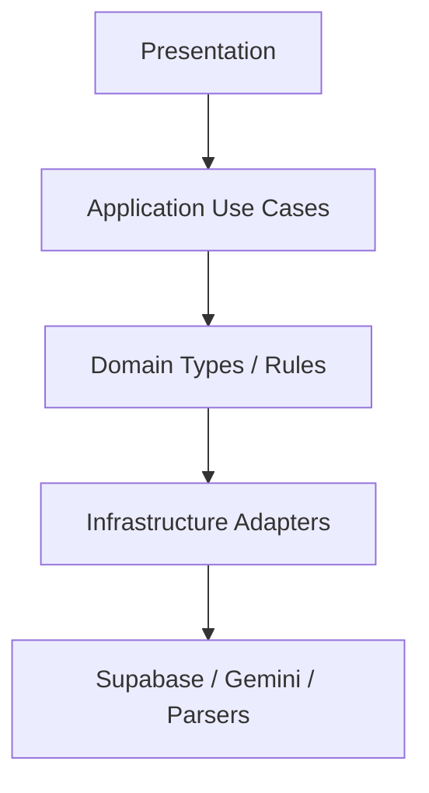

### 2.11 Goal-to-NFR Map

| Design Goal | Primary SRS NFRs |
| --- | --- |
| Security | SRS-NFR-001–005, 017, 024 |
| Reliability | SRS-NFR-006–008 |
| Performance/Scale | SRS-NFR-009–012 |
| Usability | SRS-NFR-013–016 |
| Maintainability/Testability | SRS-NFR-018–020 |
| Deployability/Operability | SRS-NFR-021–023 |

---

## 3. High Level Architecture

### 3.1 Architecture Selection Rationale

ResumeRank AI uses **SPA + BaaS + asynchronous Resume Processing Service** as a refinement of RR-ARCH-001 (ADR-001–ADR-004):

| Driver | Why this architecture |
| --- | --- |
| Academic/production hybrid timeline | Managed Auth/DB/Storage reduces custom backend |
| Secret protection | Processor runtime isolates Gemini keys (BR-05) |
| Non-blocking UX | Async accept (HTTP 202) + status polling/subscription (SRS-NFR-011) |
| Runtime portability | Parser/AI host abstracted so Node vs Edge is an implementation choice |
| Job-centric screening | Clear aggregate boundaries in PostgreSQL |
| Human-in-the-loop | UI presents rankings; no autonomous decision services |

Alternatives rejected for v1: Next.js SSR (unnecessary), custom NestJS monolith API (higher ops), client-side Gemini (violates BR-05), synchronous batch screening HTTP (blocks UI; rejected in v1.1).

### 3.2 System Context Diagram

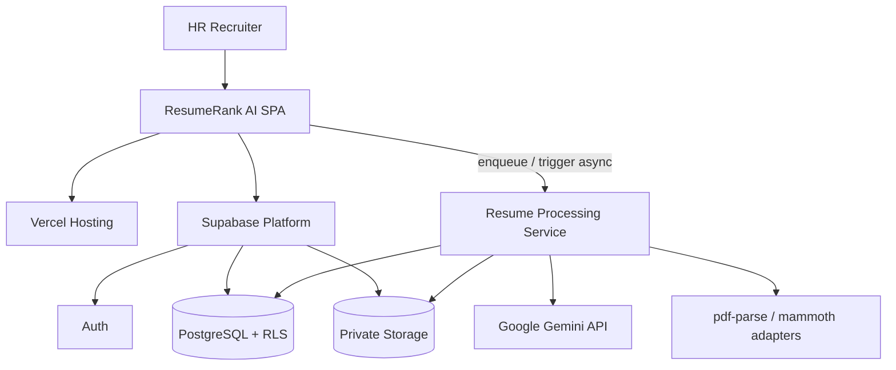

### 3.3 High-Level Architecture

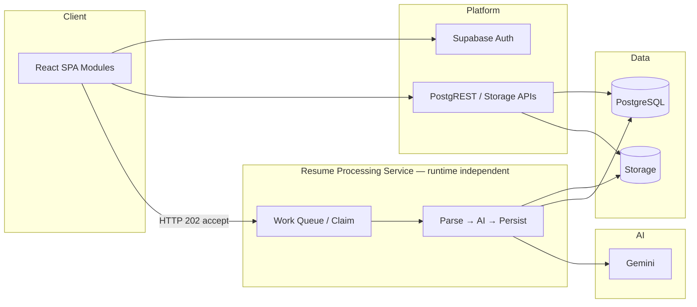

### 3.4 Application Architecture

| Application Area | Design |
| --- | --- |
| Routing | Protected app shell after auth; public login/signup |
| State | Server state via Supabase client queries; local UI state for forms/upload |
| Upload side effects | Validate → Storage put → DB candidate insert (`uploaded`) → accept processing (**202**) → enqueue work |
| Processing | Resume Processing Service claims queued work asynchronously |
| Status UX | UI polls or subscribes until terminal states (§13.1) |
| Read models | Ranked candidates by active `match_score` desc; Analytics aggregates |

### 3.5 Logical / Layered Architecture

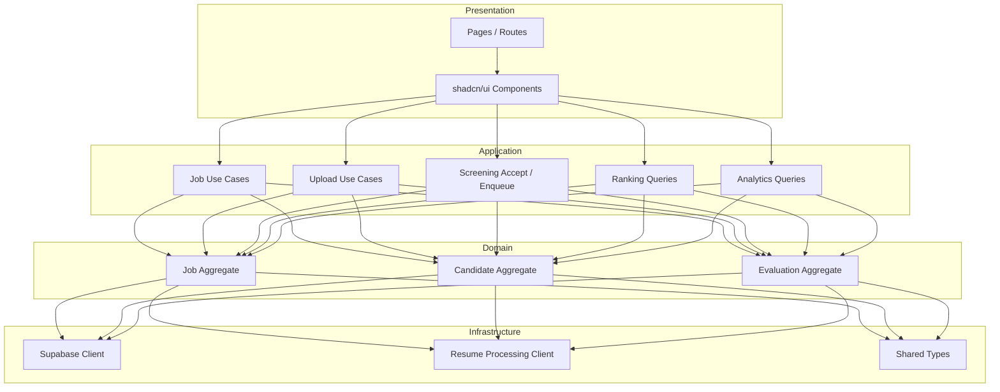

### 3.6 Component Interaction Diagram

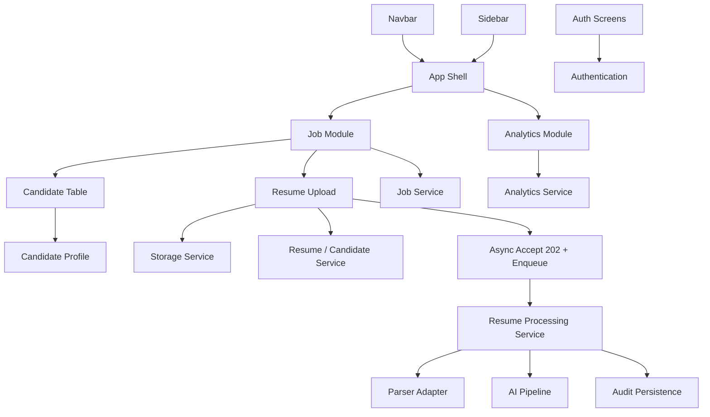

### 3.7 Repository Folder Structure

Aligned to RR-ARCH-001 §11, with processor host abstracted:

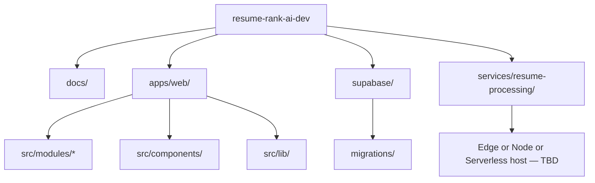

```text
apps/web/src/modules/{auth,jobs,uploads,candidates,ranking,analytics}/
services/resume-processing/          # runtime-independent processor
supabase/migrations/                 # schema only; physical details in RR-DB-005
docs/02-design/04-System-Design-Document.md
```

---

## 4. Technology Architecture

### 4.1 Stack Map

| Layer | Technology | Role |
| --- | --- | --- |
| Frontend | React + TypeScript + Vite | SPA |
| UI | Tailwind CSS + shadcn/ui | Design system |
| Backend | Supabase | Auth, DB, Storage |
| Processor | Resume Processing Service | Async parse + AI + persist (Edge / Node / serverless host TBD) |
| Database | PostgreSQL | System of record |
| Storage | Supabase Storage | Private resumes |
| Auth | Supabase Auth | Sessions/JWT |
| AI | Google Gemini API | Score, rationale, summary, assisted extraction |
| Parsers | pdf-parse, mammoth | PDF/DOCX text |
| Deploy | Vercel | Frontend hosting |

### 4.2 Justification Matrix

| Technology | Advantages | Disadvantages | Justification |
| --- | --- | --- | --- |
| React | Ecosystem, component model | Client complexity | Fits SPA HR workflows |
| TypeScript | Type safety across domains | Build overhead | Reduces integration defects |
| Vite | Fast DX/builds | SPA-focused | Matches ADR-003 (no SSR) |
| Tailwind | Rapid consistent styling | Utility verbosity | Speed for v1 UI |
| shadcn/ui | Accessible primitives | Copy-in components | Aligns SRS-NFR-015 |
| Supabase | Unified Auth/DB/Storage | Platform coupling | ADR-001; academic delivery speed |
| PostgreSQL + RLS | Relational integrity + row security | Policy complexity | BR-01, BR-09, SRS-NFR-004 |
| Supabase Storage | Private buckets, signed access | Ops via platform | SRS-FR-013 |
| Supabase Auth | Managed sessions | Provider constraints | SRS-FR-001–003 |
| Resume Processing Service | Isolates secrets; runtime-portable | Extra deployable | Removes hard Edge/Deno coupling |
| Gemini | Strong text reasoning | Cost/latency/vendor dependency | ADR-002; SRS-FR-018–021 |
| pdf-parse / mammoth | Lightweight parsers for PDF/DOCX | Weak on scanned PDFs; host must support library runtime | ADR-005; SRS-FR-015; OCR out of scope |
| Vercel | Git-native SPA deploy | Frontend-only | ADR-003; SRS-NFR-021 |

### 4.3 Runtime Topology

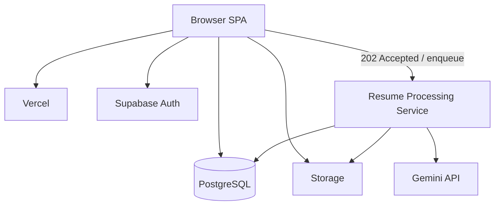

---

## 5. Component Design

### 5.1 Frontend Components

| Component | Responsibilities | Inputs | Outputs | Dependencies | Failure Handling |
| --- | --- | --- | --- | --- | --- |
| Navbar | Brand, user menu, sign-out | Session | Nav events | Auth module | Hide protected controls if signed out |
| Sidebar | Primary nav links | Route, auth | Navigation | App shell | Disabled links when unauthorized |
| Analytics Module UI | Totals and optional distributions (user + job scope) | Aggregate queries | Charts/KPI UI | Analytics service | Empty states; error toast |
| Job Module | Create/list/open/update; archive; delete-if-empty | Job forms, filters | Job records | Job service | Validation errors (VR-01–05) |
| Resume Upload | Multi-file validate/upload; persist candidate; async accept | Files, job_id | Objects + candidates; **HTTP 202** | Storage + Resume services | Per-file reject; compensation (§6.5.1) |
| Candidate Table | Status chips, ranked/failed list, pagination/filter | job_id, query | Rows | Ranking + status poll | Show non-completed rows |
| Candidate Profile | Score, rationale, summary, CE fields | candidate_id | Detail view | Candidate + evaluation reads | Partial extraction OK |
| Job Screening Progress | Aggregate status counts while processing | job_id | Progress UI | Candidate status queries | Stops on terminal states (§13.1) |

### 5.2 Backend / Platform Components

Only components with independent responsibilities. Parse/AI are **stages** inside Resume Processing Service—not separately deployed microservices.

| Component | Responsibilities | Inputs | Outputs | Dependencies | Failure Handling |
| --- | --- | --- | --- | --- | --- |
| Authentication | Register/sign-in/sign-out/session | Credentials | JWT session | Supabase Auth | EH-AUTH |
| Job Service | Job ops; archive; constrained delete | Job DTO | Job rows | PostgreSQL + RLS | Reject illegal delete |
| Resume / Candidate Service | Persist candidates; link storage; enqueue work | Upload metadata | Candidate rows; queue message | DB + Storage + queue | Compensation on partial failure |
| Storage Service | Private object put/get/delete | File, path | Object path | Supabase Storage | EH-STORE; delete on compensate |
| Resume Processing Service | Claim queue; parse; AI pipeline; persist; status transitions | Queue payload | Updated rows | Storage, DB, Gemini, parsers | Failure terminals; siblings unaffected |
| Analytics Service | Aggregations for Analytics Module | owner_user_id / job_id | Counts/distributions | SQL (physical views in RR-DB-005) | Safe empty aggregates |
| Audit Persistence | History snapshot before active overwrite | Prior active evaluation | History row | DB | Block overwrite if history write fails |

### 5.3 Resume Processing Service Composition

Host is runtime-independent (Edge Function, Node Worker, or Serverless Function).

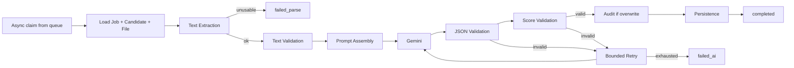

---

## 6. Module Design

### 6.1 Module Map

| Module | SRS Features | Notes |
| --- | --- | --- |
| Authentication | SF-01 | UC-01, UC-02 |
| Analytics | SF-07 | Merges former Dashboard + Reporting |
| Job Management | SF-02 | Archive/delete included |
| Resume Upload | SF-03 | Async 202 + compensation |
| Resume Processing | SF-04 + SF-05 | Runtime-independent service |
| Candidate Ranking | SF-06 | Includes status progress |
| Audit Logging | SRS-FR-053, NFR-017 | With Platform + Application logging |

### 6.2 Authentication Module

| Field | Design |
| --- | --- |
| Purpose | Establish and end HR sessions |
| Responsibilities | Sign-up, sign-in, sign-out, route guards |
| Workflow | Credentials → Supabase Auth → JWT → protected shell; Sign out clears session |
| Inputs | Email/password (or Auth-supported credentials) |
| Outputs | Session; redirect |
| Business Rules | BR-01, BR-09 |
| Error Handling | EH-AUTH; safe messages |
| Security | HTTPS; anon key only on client |
| Future | OAuth providers if needed |

### 6.3 Analytics Module

| Field | Design |
| --- | --- |
| Purpose | Screening visibility (BG-04 / SF-07) — **merged Dashboard + Reporting** |
| Responsibilities | User-level and job-level totals; optional status/score distributions |
| Workflow | On load, query aggregates scoped to owner / selected job |
| Inputs | Auth user id; optional job_id |
| Outputs | KPI cards / charts |
| Business Rules | Owner-scoped only |
| Error Handling | Empty/error states |
| Security | RLS |
| Future | Longitudinal trends (FS-10) |

### 6.4 Job Management Module

| Field | Design |
| --- | --- |
| Purpose | Manage active jobs and JD text |
| Responsibilities | Create, list, open, update; archive; delete-if-empty |
| Workflow | Create with title+JD → `lifecycle_status=active`; Archive soft-closes; Delete only if candidate_count=0 |
| Inputs | Job form; archive/delete commands |
| Outputs | Job rows |
| Business Rules | BR-07, BR-11; VR-01–05; SRS-FR-046/047 |
| Error Handling | Validation messages; reject illegal delete |
| Security | owner_user_id + RLS |
| Future | Unarchive UX if implemented; JD version notes (Could) |

### 6.5 Resume Upload Module

| Field | Design |
| --- | --- |
| Purpose | Bulk intake with **async processing accept** |
| Responsibilities | Validate MIME/size; store privately; persist candidate; return **HTTP 202**; enqueue processing |
| Workflow | Validate → Storage put → DB insert (`uploaded`) → enqueue (`queued`) → **202 Accepted** → UI polls/subscribes |
| Inputs | PDF/DOCX; job_id |
| Outputs | Storage paths; candidate ids; 202 acceptance |
| Business Rules | BR-04, BR-06; SRS-FR-010–014, 017; ST-01 re-queue supported; ST-02 optional auto-enqueue |
| Error Handling | Per-file rejection; batch continues; compensation §6.5.1 |
| Security | Private bucket; authz on job ownership |
| Future | Additional formats only via change control |

#### 6.5.1 Upload Compensation Flow

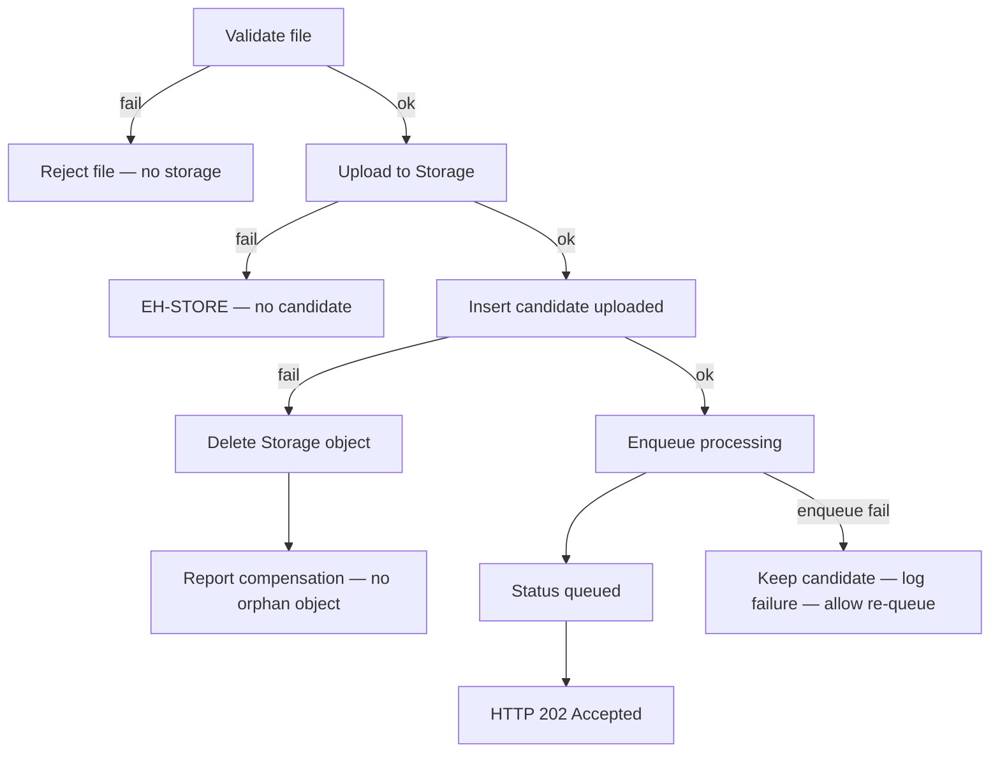

| Case | Action |
| --- | --- |
| Storage succeeds, DB insert fails | **Delete** uploaded object; no orphans |
| DB succeeds, enqueue/processing fails | **Keep** candidate; update status; **log** failure; allow ST-01 re-queue |
| Processing fails later | Keep candidate; terminal `failed_parse` / `failed_ai`; siblings continue |

### 6.6 Resume Processing Module

Combines parse + AI into one module owned by Resume Processing Service.

| Field | Design |
| --- | --- |
| Purpose | Async text extraction, structured extraction, scoring, summarization, persistence |
| Responsibilities | Claim queue; drive status lifecycle; run AI pipeline (§9); audit on overwrite |
| Workflow | `queued` → `parsing` → (`failed_parse` \| `parsed`) → `ai_processing` → (`completed` \| `failed_ai`) |
| Inputs | Candidate id, job JD, storage path |
| Outputs | Profile fields, active evaluation, status |
| Business Rules | BR-02, BR-03, BR-05, BR-08, BR-12; SRS-FR-015–026, 048–053 |
| Error Handling | Isolate per candidate; bounded AI retry then `failed_ai` |
| Security | Secrets only in processor runtime |
| Future | OCR / alternate LLM behind adapters |

### 6.7 Candidate Status Lifecycle

Refined design states. SRS coarse mapping: `pending`≈`uploaded`/`queued`; `processing`≈`parsing`/`parsed`/`ai_processing`; terminals retain SRS meaning. `failed_parse` retained to satisfy SRS-FR-016 without changing business rules.

| State | Meaning | Terminal? |
| --- | --- | --- |
| `uploaded` | Candidate + storage persisted | No |
| `queued` | Accepted for async processing | No |
| `parsing` | Text extraction in progress | No |
| `parsed` | Usable text available | No |
| `ai_processing` | Gemini extract/score in progress | No |
| `completed` | Valid active evaluation persisted | Yes |
| `failed_parse` | Unusable/empty text | Yes |
| `failed_ai` | AI/schema failure after retries | Retryable |
| `archived` | Soft-archived with job/candidate archive | Yes for processing |

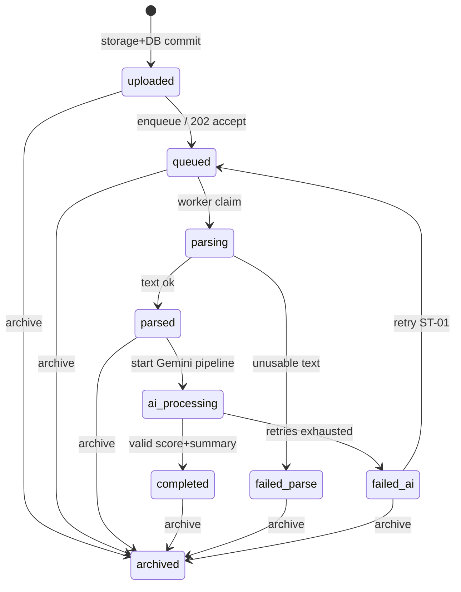

### 6.8 Candidate Ranking Module

| Field | Design |
| --- | --- |
| Purpose | Explainable shortlist + in-flight progress |
| Responsibilities | Sort by active match_score desc; show statuses; open profile; progress counts |
| Workflow | Query job candidates → sort completed by score → show failures/in-progress → poll until terminal |
| Inputs | job_id |
| Outputs | Ranked UI + progress |
| Business Rules | BR-02, BR-10; no auto-reject UI |
| Error Handling | Empty/in-progress states |
| Security | Owner RLS |
| Future | CSV export (Could) |

### 6.9 Logging Cross-Cut

| Logging Class | Owner | Purpose |
| --- | --- | --- |
| **Audit Logging** | Audit Persistence + history table | Evaluation overwrite history; screening audit events |
| **Platform Logging** | Host platforms | Infra diagnostics |
| **Application Logging** | SPA + processor structured logs | UX/processing errors without secrets |

Profile/session settings remain under Authentication; operator setup remains in Deployment Guide (no separate Administration or Reporting modules).

---

## 7. Database Interaction Design

Physical DDL, indexes, unique constraints, storage paths, SQL views, chunk sizes, and retry numeric defaults are **specified in RR-DB-005**. This SDD defines interaction intent only.

### 7.1 Database Architecture

| Concern | Design |
| --- | --- |
| Engine | PostgreSQL on Supabase |
| Access | User JWT + RLS for SPA; Resume Processing Service uses least-privilege credentials with mandatory ownership checks |
| Security | RLS by `auth.uid()` ownership |
| Files | Object storage paths on candidates; binaries not in bytea |
| Deferred to RR-DB-005 | Indexes, one-active uniqueness, path conventions, views |

### 7.2 Entity Relationships

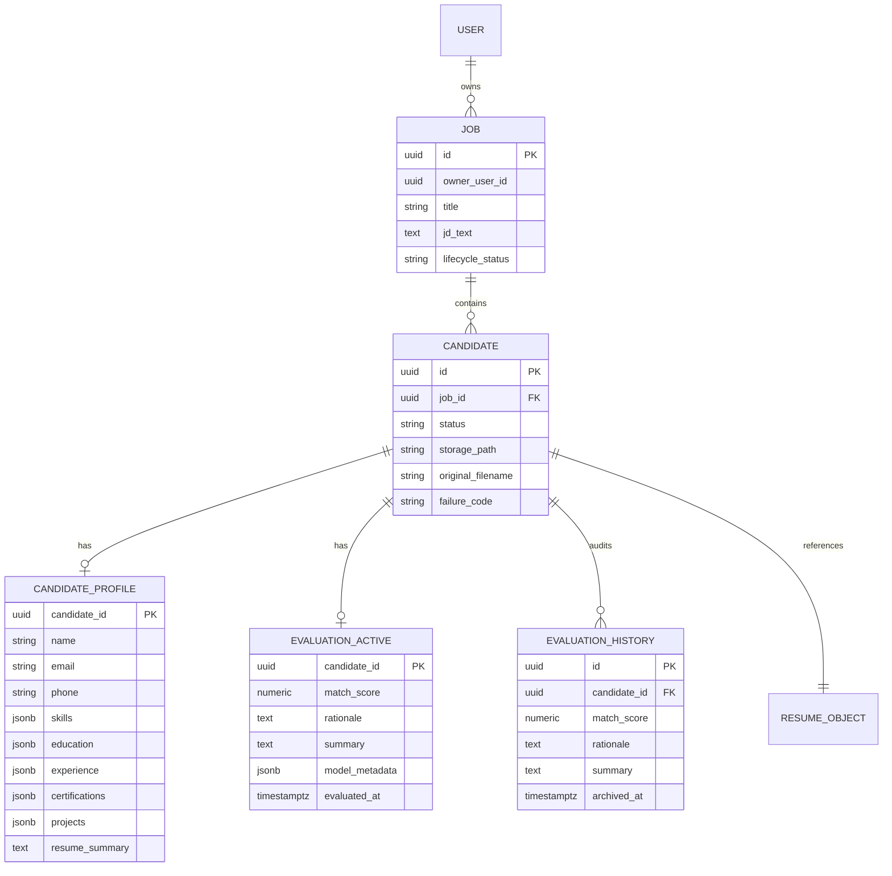

### 7.3 CRUD and Transaction Flows

| Operation | Flow |
| --- | --- |
| Create job | Insert job `active` |
| Archive job | Soft archive; block new processing; candidates may become `archived` |
| Delete job | Only if zero candidates |
| Upload resume | Storage → DB `uploaded` with compensation → enqueue `queued` → **202** |
| Processing unit | Claim → §6.7 transitions → persist → terminal |
| Retry | `failed_ai` → `queued` → async pipeline |

### 7.4 Physical Mechanisms (Deferred)

Indexes, partial unique constraints for one-active evaluation, storage path layout, analytics SQL views, chunk sizes, and retry defaults are defined in **RR-DB-005**.

### 7.5 Caching Strategy

CDN for static assets; short-lived client query cache with invalidation; polling overrides stale status; no Redis required for v1.

### 7.6 Concurrency

Bounded concurrency inside Resume Processing Service; idempotent claim skips in-flight/`completed` unless retry; re-queue from `failed_ai`.

### 7.7–7.9 Validation, Soft Delete, Retention

VR-* in app + DB checks (DDL in RR-DB-005); job soft archive; evaluation history retained; academic retention without automated purge in v1.

### 7.10 Data Flow Summary

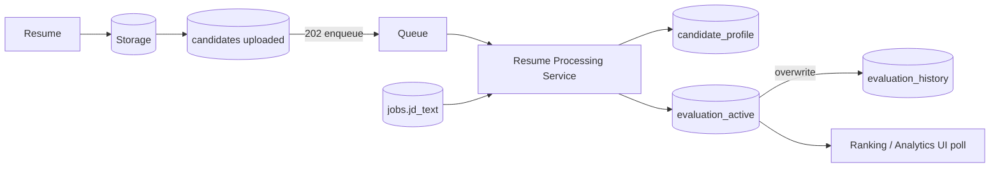

---

## 8. API Interaction Design

Conceptual APIs only — no implementation code. Formal contracts in RR-API-006.

### 8.1 API Style

| Surface | Style |
| --- | --- |
| Data CRUD | Supabase client → PostgREST tables/views |
| File I/O | Supabase Storage API |
| Processing accept | HTTPS endpoint on Resume Processing Service (or BFF) returning **202 Accepted** |
| Auth | Supabase Auth API |

### 8.2 Conceptual API Surface

| API | Purpose | AuthZ |
| --- | --- | --- |
| Auth signUp/signIn/signOut | Session lifecycle | Public/auth |
| jobs insert/select/update | Job management | Owner RLS |
| jobs archive/delete | Lifecycle | Owner + delete rules |
| storage upload/download/delete | Resume binaries | Owner policies |
| candidates insert/select | Intake and listing | Owner via job |
| evaluations select | Ranking/detail | Owner via job |
| evaluation_history select | Audit read | Owner |
| `POST /process` (or enqueue) | Accept async processing | JWT; ownership verified |
| Worker claim (internal) | Dequeue work | Processor credentials |

### 8.3 Async Request / Response Flow

**Upload + accept processing (per file or batch):**

1. Client uploads file to Storage  
2. Client inserts candidate (`uploaded`)  
3. Client (or server) enqueues work → candidate `queued`  
4. API returns **`202 Accepted`** with `{ candidate_id, status: "queued" }` — **no scores in response**  
5. Resume Processing Service processes asynchronously  
6. UI polls or subscribes for status until terminal  

**Re-queue / retry (ST-01):** `{ job_id, candidate_ids? }` → validate → set eligible candidates to `queued` → **202 Accepted**.

Validation: JWT; job owned and active; JD present; candidates belong to job; retry only from `failed_ai` (or failed enqueue).

### 8.4 Authentication and Authorization

| Step | Design |
| --- | --- |
| AuthN | User JWT on protected calls |
| AuthZ | RLS for table access; processor re-checks job ownership before privileged reads/writes |
| Client key | Anon key only |

### 8.5 Validation, Errors, Rate Limiting, Retry

| Concern | Design |
| --- | --- |
| Validation | Client VR checks + server/processor enforcement |
| Errors | Map to EH-*; safe messages; persist `failure_code` when terminal |
| Rate limiting | Platform limits + bounded processor concurrency (numeric config deferred) |
| AI retry | Transient Gemini backoff inside processor (SRS-NFR-007) |

### 8.6 Sequence Diagrams

**Async happy path:**

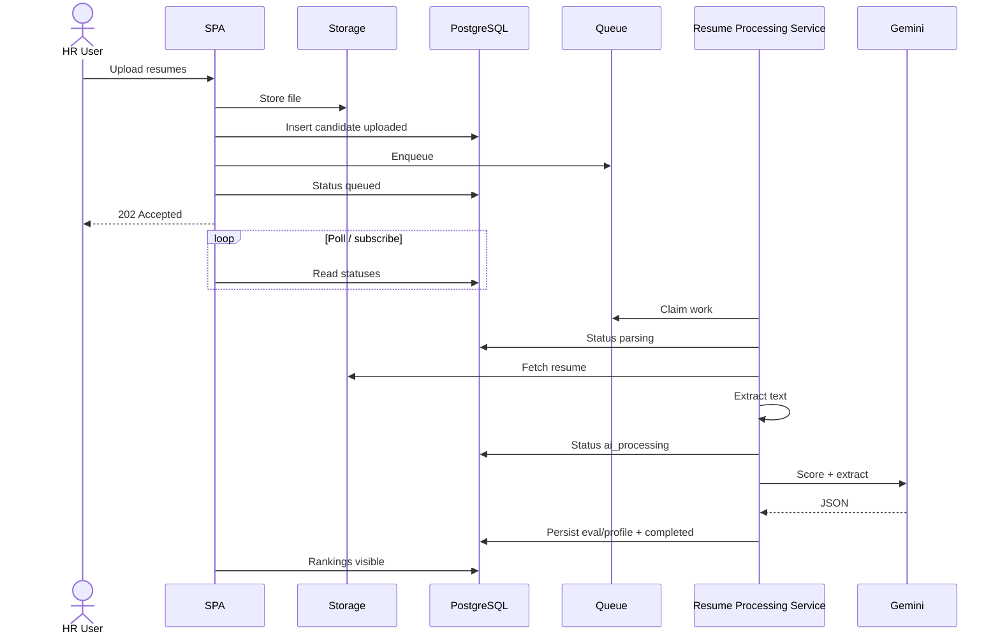

**Upload compensation:**

```mermaid
sequenceDiagram
  participant UI as SPA
  participant ST as Storage
  participant DB as DB
  UI->>ST: Upload OK
  UI->>DB: Insert fails
  UI->>ST: Delete object
  Note over UI: No orphan storage; no candidate row
```

---

## 9. AI Processing Design

Critical path for SF-04/SF-05 and SRS-AI-*, executed inside Resume Processing Service.

### 9.1 Design Principles

1. Secrets only in processor runtime (BR-05)  
2. Human-in-the-loop (BR-02)  
3. Schema validation gate for `completed` (SRS-AI-020–022)  
4. One active evaluation; history on overwrite (BR-12)  
5. Missing CE fields do not alone cause `failed_parse`  
6. Fully async relative to HTTP upload/accept  

### 9.2–9.3 Canonical AI Pipeline

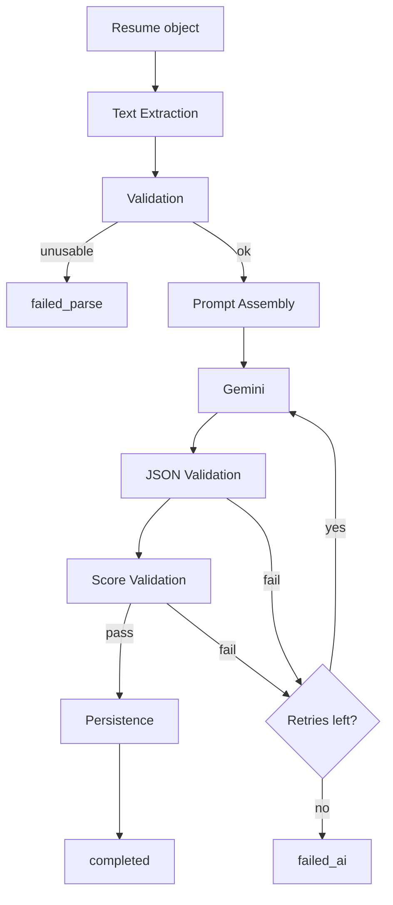

### 9.4 Candidate Extraction

Required CE-01–CE-09 attempted; optional CE-10–CE-14 when present; sparse fields allowed; persistence on `candidate_profile`. Prefer structured output in the same Gemini call as scoring.

### 9.5 Prompt Construction and Versioning

Prompt includes JD, resume text, JSON schema, extraction fields, scoring instructions. Store `prompt_version` in model_metadata. Final prompt text owned by RR-AI-008. Client never assembles production prompts.

### 9.6 Gemini Integration and Validation

HTTPS from processor; API key in processor secrets; require numeric match_score ∈ [0,100]; non-empty rationale and summary; reject invalid JSON for `completed`.

### 9.7 Scoring / Ranking Behavior

No separate ML recommendation engine. Ranking = sort by active `match_score` descending. No separate confidence field; completion is binary via validation gates.

**failed_ai overwrite policy:** On retry finalization with valid outputs, overwrite active after history capture. On `failed_ai` with no valid score payload, **retain prior active evaluation** (if any), set status `failed_ai`, set `failure_code`, and do not fabricate a score.

### 9.8 Retry, Recovery, Audit

| Topic | Design |
| --- | --- |
| Transient retry | Bounded backoff inside processor |
| User retry | ST-01 / UC-10: `failed_ai` → `queued` |
| Audit | History before successful overwrite |
| Recovery | Partial batch success |

### 9.9 Future AI Improvements

OCR, alternate LLM providers, bias metrics, history comparison UI — future scope only.

---

## 10. Security Design

Aligns to SRS §9/§13 and RR-ARCH-001 trust boundaries. Detailed control matrices expand in RR-SEC-009.

### 10.1–10.4 AuthN/AuthZ/Session/Validation

Supabase Auth; protected routes; owner RLS; processor ownership checks; session refresh + sign-out; MIME/size validation; private storage.

### 10.5 OWASP Considerations (v1 Controls)

| Risk | Control |
| --- | --- |
| Broken access control | RLS + ownership checks |
| Sensitive data exposure | Private storage; no public resume URLs |
| Injection | Parameterized SDK; validate AI JSON before persist |
| Security misconfiguration | `.env.example` without secrets; no service role in client |
| XSS | React text rendering; **HTML escaping / safe rendering** of AI fields |
| CSRF | Supabase JWT/bearer patterns |
| SSRF | Processor fetches only Storage + Gemini endpoints |

### 10.6–10.9 Secrets, Encryption, Upload, Audit

`GEMINI_API_KEY` and privileged keys only in Resume Processing Service secrets; TLS in transit; platform encryption at rest; private bucket + delete-on-compensate; evaluation history + audit logging.

### 10.10 Threat Model (Expanded)

| Threat | Mitigation |
| --- | --- |
| Stolen anon key | RLS still enforces ownership |
| Privileged key leak | Processor-only secrets; rotate via platform |
| Cross-user data read | RLS + tests |
| Malicious upload | Type/size limits; private storage; parse in processor |
| **Prompt injection** via resume/JD text | Treat content as untrusted; fixed schema; no tool calling; allowlisted output fields |
| Schema / output tampering | **JSON schema validation** + **score validation** before `completed` |
| XSS via AI text | **Safe rendering** / no `dangerouslySetInnerHTML` for AI fields |
| Prompt abuse | Authz on enqueue; owner-only jobs |

### 10.11 Security Boundary Diagram

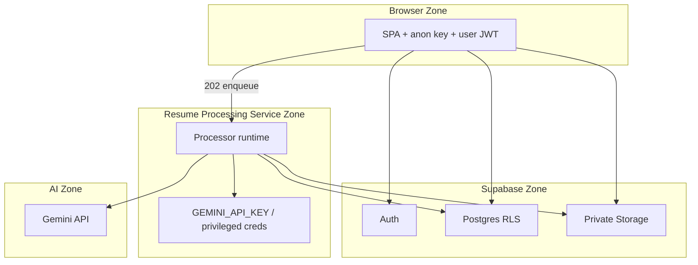

---

## 11. Deployment Architecture

### 11.1 Environments

| Env | Frontend | Data | Processor |
| --- | --- | --- | --- |
| Development | Vite local | Supabase local/shared | Local processor host |
| Preview | Vercel Preview | Isolated/shared Supabase project | Deployed processor |
| Production | Vercel Production | Supabase Production | Deployed processor |

### 11.2 Deployment Diagram

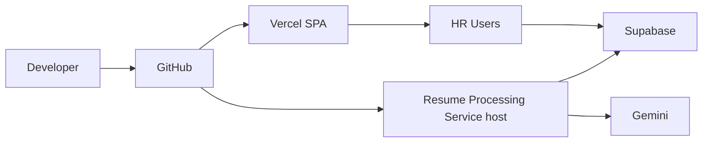

### 11.3 Pipeline and Rollback

Release order: migrations (RR-DB-005) → processor deploy → frontend. Rollback: revert Vercel + processor revision; DB down-migrations only with reviewed scripts. Prefer separate Supabase projects for preview vs production.

### 11.4 Environment Variables

Public: `VITE_SUPABASE_URL`, `VITE_SUPABASE_ANON_KEY`. Processor secrets: `GEMINI_API_KEY`, privileged DB creds. Operational knobs (retries, concurrency, upload max) documented in env examples; **numeric defaults finalized with RR-DB-005 / Deployment Guide**.

### 11.5 Networking

HTTPS for preview/production. Browser → Vercel + Supabase. Processor → Storage + DB + Gemini.

---

## 12. Logging and Monitoring

| Type | Design |
| --- | --- |
| Audit Logging | `evaluation_history`; screening audit events with job/candidate/prompt_version |
| Platform Logging | Vercel / Supabase / processor host logs |
| Application Logging | SPA error boundaries; processor structured errors with EH category |
| Performance | Platform analytics; optional timing fields in processor logs |
| Alerting | Manual/platform for demo; not mandatory PagerDuty in v1 |
| Retention | Platform defaults + DB history for MBA evidence |

---

## 13. Performance Design

| Goal | Tactic |
| --- | --- |
| SRS-NFR-009 | Lean list/analytics queries (physical tuning in RR-DB-005) |
| Large uploads | Per-file upload; configured size cap |
| Batch processing | **Async** processor; UI never waits on Gemini in upload HTTP |
| Parallel AI | Bounded concurrency in processor |
| Pagination | Candidate table pagination (Should) |
| Lazy loading | Route-level code splitting |

### 13.1 Polling Strategy

| Rule | Design |
| --- | --- |
| Mechanism | UI **polls** candidate/job status queries; optional Realtime subscribe later |
| Interval | Start ~2–3s while any non-terminal statuses exist |
| Backoff | Increase interval after repeated unchanged polls (e.g., up to ~10–15s) |
| Terminal states | Stop when all job candidates are in `{completed, failed_parse, failed_ai, archived}` or user navigates away |
| Cancellation | Abort polling on unmount/route change; do not cancel in-flight processor work except via future explicit cancel API (not in v1) |
| ST-01 | User may re-queue `failed_ai` without blocking UI |

---

## 14. Scalability Design

| Dimension | v1 Design | Future |
| --- | --- | --- |
| Horizontal | Vercel CDN; processor replicas on chosen host | Queue workers |
| Database/storage growth | Indexes/views in RR-DB-005; archive jobs | Tenancy/partitions |
| AI scaling | Bounded concurrency + async queue | Multi-provider / dedicated workers |
| Multi-company | Not in v1 | FS-02 |

Chunking large batches across multiple processor invocations is an **operations concern** specified with RR-DB-005 / Deployment Guide, not hard-coded here.

---

## 15. Error Handling Strategy

Map failures to EH categories. UI shows actionable category/`failure_code` without secrets.

| Layer | Strategy |
| --- | --- |
| Global UI | Error boundary + toast/inline alerts |
| Upload | Compensation §6.5.1; continue batch |
| Parsing | `failed_parse`; continue siblings |
| AI | Retry then `failed_ai`; retain prior active if no valid score |
| Database | No false `completed` |
| Retry/Recovery | ST-01 for AI; re-upload new candidate for parse failures |

---

## 16. Design Decisions

| ID | Decision | Reason | Alternative | Trade-offs |
| --- | --- | --- | --- | --- |
| DD-01 | SPA + Supabase + async Resume Processing Service | Protect secrets; non-blocking UX; portable runtime | Sync Edge-only screening | Extra deployable vs coupling |
| DD-02 | HTTP **202 Accepted** + queue; UI poll/subscribe | SRS-NFR-011; remove sync batch completion | Sync results in upload response | Slightly more UI complexity |
| DD-03 | Runtime-independent processor host | Avoid Deno/Edge parser lock-in | Bind to Edge Functions | Host choice deferred |
| DD-04 | Refined status lifecycle (§6.7) | Observability of async stages | Coarse pending/processing only | More states to implement/test |
| DD-05 | Upload compensation (delete object if DB fails) | No orphan files | Best-effort ignore | Extra delete call |
| DD-06 | Merge Dashboard + Reporting → Analytics | Cohesion; SF-07 single owner | Two modules | — |
| DD-07 | Combined Gemini extract+score call | Fewer round trips | Separate calls | Larger prompts |
| DD-08 | Retain prior active on `failed_ai` without valid score | Avoid fabricated scores | Overwrite with empty stub | Clearer audit semantics |
| DD-09 | Logging = Audit + Platform + Application | Clear responsibilities | Single Logging Service | — |
| DD-10 | Physical indexes/paths/chunk/retry numbers in RR-DB-005 | Keep SDD architectural | Inline physical specs | DB doc must complete them |
| DD-11 | ST-01 required; ST-02 optional auto-enqueue | Explicit control | Auto-only | Extra click vs races |
| DD-12 | Ranking = sort by score | PRD/SRS | ML re-ranker | Explainable |

---

## 17. Future Enhancements

Unchanged scope deferrals: OCR, ATS, email, interview scheduling, multi-company, HM RBAC, advanced analytics, bias detection (FS-*). Not v1 design commitments.

---

## 18. Conclusion

### 18.1 Summary

SDD v1.1 refines ResumeRank AI into an **asynchronous, runtime-portable** design: SPA uploads and receives **202 Accepted**, Resume Processing Service performs parse→AI→persist off the request path, UI polls for status, Analytics owns SF-07, and physical DB mechanisms are deferred to RR-DB-005. Business rules BR-01–BR-12 and SRS Must capabilities remain intact.

### 18.2 Requirements Satisfaction (Representative)

| Area | Satisfied By |
| --- | --- |
| SF-01 Auth | §6.2, §10 |
| SF-02 Jobs | §6.4, §7 |
| SF-03 Upload + async accept | §6.5, §8.3 |
| SF-04/05 Parse + AI | §6.6, §9 |
| SF-06 Ranking + progress | §6.8, §13.1 |
| SF-07 Analytics | §6.3 |
| SF-08 Status/resilience | §6.7, §15 |
| Security / Performance NFRs | §10, §13–14 |

### 18.3 Handoff

**RR-DB-005 Database Design Document** is next and must specify: refined status enum, `failure_code`, one-active evaluation enforcement, indexes, storage paths, analytics views, and operational numeric defaults referenced by this SDD.

---

## 19. Architecture Review Report (v1.1)

### 19.1 Verification Against Prior Critical/Major Findings

| Prior Issue | v1.1 Disposition |
| --- | --- |
| Sync screening response | **Fixed** — 202 + async queue + poll |
| Edge/Deno parser binding | **Fixed** — Resume Processing Service runtime-independent |
| Upload orphan risk | **Fixed** — compensation flow §6.5.1 |
| Dashboard/Reporting duplication | **Fixed** — Analytics Module |
| Logging Service sprawl | **Fixed** — Audit/Platform/Application |
| Missing failure codes / progress | **Addressed** — `failure_code` + Job Screening Progress + lifecycle |
| Physical DB detail in SDD | **Deferred** — RR-DB-005 |
| Threat model gaps | **Expanded** — prompt injection, schema/output validation, safe rendering |
| Polling underspecified | **Specified** — §13.1 |

### 19.2 Fresh Review Checklist

| Area | Assessment |
| --- | --- |
| Scalability | Pass for demo profile — async queue + bounded concurrency; chunk numeric defaults deferred |
| Modularity | Pass — fewer peer services; Analytics merged; processor stages cohesive |
| Async workflow | Pass — 202 accept, queue claim, poll/subscribe, no sync score return |
| AI pipeline | Pass — canonical extract→validate→prompt→Gemini→JSON→score→persist |
| Deployment | Pass — SPA + processor + Supabase; host choice open |
| Maintainability | Pass — runtime abstraction; physical details not frozen incorrectly |
| Business rules | Pass — BR-01–BR-12 unchanged; `failed_parse` retained |
| Coupling | Pass — UI does not call Gemini; processor owns AI |

### 19.3 Residual Recommendations for RR-DB-005

| ID | Recommendation | Priority |
| --- | --- | --- |
| DR-11 | Encode status enum including refined states + `failed_parse` + `archived` | High |
| DR-12 | Enforce one-active evaluation uniqueness | High |
| DR-13 | Define storage path policy + RLS for history | High |
| DR-14 | Define queue table/mechanism (DB queue vs external) | High |
| DR-15 | Publish defaults: upload max MB, AI retries, poll guidance alignment | Medium |

### 19.4 Verdict

**RR-SDD-004 v1.1.0 is approved as the architectural baseline for Database Design (RR-DB-005).** Critical sync/runtime defects from the Principal review are remediated. Remaining work is physical schema and operational numerics—not open product scope.

---

## 20. Appendices

### Appendix A — Glossary

| Term | Definition |
| --- | --- |
| HTTP 202 Accepted | Async acceptance; processing continues after response |
| Resume Processing Service | Runtime-independent worker for parse/AI/persist |
| Queued | Candidate accepted for async processing |
| Active Evaluation | Sole current evaluation for a candidate |
| Audit Logging | History + screening audit events |
| Platform Logging | Host/infrastructure logs |
| Application Logging | App/processor structured logs |
| Safe Rendering | Display AI text without HTML injection |

### Appendix B — SRS Feature Traceability

| SRS Feature | SDD Chapters |
| --- | --- |
| SF-01 | §6.2, §10 |
| SF-02 | §6.4, §7 |
| SF-03 | §6.5, §8 |
| SF-04/05 | §6.6–6.7, §9 |
| SF-06 | §6.8, §13.1 |
| SF-07 | §6.3 |
| SF-08 | §6.7, §15 |

### Appendix C — Document Control

| Item | Value |
| --- | --- |
| Path | `docs/02-design/04-System-Design-Document.md` |
| Version | 1.1.0 |
| Upstream | RR-ARCH-001 v2.0.0; RR-PRD-002 v1.0.0; RR-SRS-003 v1.1.0 |
| Next | RR-DB-005 Database Design Document |

### Appendix D — v1.1 Change Summary

| ID | Change |
| --- | --- |
| C-01 | Async screening: upload → persist → **202** → queue → status updates → UI poll |
| C-02 | Abstracted **Resume Processing Service** (Edge/Node/serverless) |
| C-03 | Refined candidate status lifecycle + Mermaid state diagram |
| C-04 | Upload compensation flow |
| C-05 | Merged Dashboard/Reporting → Analytics |
| C-06 | Replaced Logging Service with Audit/Platform/Application logging |
| C-07 | Clarified canonical AI pipeline |
| C-08 | Expanded threat model (prompt injection, schema/output validation, safe rendering) |
| C-09 | Specified polling interval/backoff/terminals/cancellation |
| C-10 | Deferred physical DB/ops numerics to RR-DB-005 |
| C-11 | Simplified component catalog; high cohesion / low coupling |
| C-12 | Re-ran architecture review; baseline for DB design |

---

**End of Document — Document 04 — RR-SDD-004 — System Design Document v1.1.0**
