# ResumeRank AI

# System Design Document (SDD)

**Document 04 — RR-SDD-004**

**Prepared in accordance with IEEE Std 1016 recommended practice for Software Design Descriptions**

---

## Cover Page

| | |
| --- | --- |
| **Project Name** | ResumeRank AI |
| **Document Title** | System Design Document |
| **Document Number** | Document 04 |
| **Document ID** | RR-SDD-004 |
| **Version** | 1.0.0 |
| **Status** | Baseline — Ready for Database Design |
| **Classification** | Internal — MBA Final Year Project |
| **Specialization** | Artificial Intelligence & Data Science |
| **Document Type** | Software Design Description (IEEE 1016) |
| **Author** | Vish Var |
| **Role** | Senior Solution Architect / Project Lead |
| **Organization** | ResumeRank AI Development Team |
| **Prepared For** | Development, QA, and Academic Evaluation Teams |
| **Date** | 12 July 2026 |
| **Upstream Dependencies** | RR-ARCH-001 v2.0.0; RR-PRD-002 v1.0.0; RR-SRS-003 v1.1.0 |
| **Governing Plan** | Documentation Roadmap (RR-DOC-000) |
| **Next Document** | Database Design Document (RR-DB-005) |

---

### Document Control Statement

This System Design Document describes **how** ResumeRank AI will be designed and implemented. It elaborates the architectural baseline (RR-ARCH-001) into component, module, data-interaction, API-interaction, AI-processing, security, deployment, and operational designs sufficient for engineering delivery.

This document **does not** invent product functionality beyond RR-PRD-002 and RR-SRS-003 v1.1.0. It **does not** alter business rules BR-01–BR-12. Where design choices refine implementation tactics, they remain within approved requirements and constraints.

---

## Version History

| Version | Date | Author | Description of Change | Review Status |
| --- | --- | --- | --- | --- |
| 0.1.0 | 12 July 2026 | Vish Var | SDD outline aligned to IEEE 1016 and SRS v1.1.0 | Draft |
| 1.0.0 | 12 July 2026 | Vish Var | Complete system design with diagrams, ADRs, and Design Review Report | Current |

---

## Table of Contents

1. [Introduction](#1-introduction)
2. [Design Goals](#2-design-goals)
3. [High Level Architecture](#3-high-level-architecture)
4. [Technology Architecture](#4-technology-architecture)
5. [Component Design](#5-component-design)
6. [Module Design](#6-module-design)
7. [Database Interaction Design](#7-database-interaction-design)
8. [API Interaction Design](#8-api-interaction-design)
9. [AI Processing Design](#9-ai-processing-design)
10. [Security Design](#10-security-design)
11. [Deployment Architecture](#11-deployment-architecture)
12. [Logging and Monitoring](#12-logging-and-monitoring)
13. [Performance Design](#13-performance-design)
14. [Scalability Design](#14-scalability-design)
15. [Error Handling Strategy](#15-error-handling-strategy)
16. [Design Decisions](#16-design-decisions)
17. [Future Enhancements](#17-future-enhancements)
18. [Conclusion](#18-conclusion)
19. [Design Review Report](#19-design-review-report)
20. [Appendices](#20-appendices)

---

## List of Figures

| Figure | Title | Location |
| --- | --- | --- |
| F-01 | System Context Diagram | §3.2 |
| F-02 | High-Level Architecture | §3.3 |
| F-03 | Layered / Clean Architecture | §3.5 |
| F-04 | Component Interaction Diagram | §3.6 |
| F-05 | Technology Runtime Topology | §4.3 |
| F-06 | Screening Sequence Diagram | §8.5 |
| F-07 | Conceptual ER Diagram | §7.2 |
| F-08 | Candidate Status Lifecycle | §6.7 / §9.8 |
| F-09 | Resume Processing Pipeline | §9.2 |
| F-10 | AI Pipeline | §9.3 |
| F-11 | Security Trust Boundary | §10.8 |
| F-12 | Deployment Architecture | §11.2 |
| F-13 | Repository Folder Structure | §3.7 |
| F-14 | Evaluation Retry / Audit Flow | §9.7 |
| F-15 | Upload Validation Sequence | §8.6 |

---

## List of Tables

| Table | Title | Location |
| --- | --- | --- |
| T-01 | Design goal to SRS NFR mapping | §2.10 |
| T-02 | Technology justification matrix | §4.2 |
| T-03 | Frontend component catalog | §5.1 |
| T-04 | Backend/service component catalog | §5.2 |
| T-05 | Module-to-SRS feature map | §6.1 |
| T-06 | Logical entities and operations | §7.3 |
| T-07 | Conceptual API surface | §8.2 |
| T-08 | Extraction field map (CE-01–CE-14) | §9.4 |
| T-09 | Environment variable classes | §11.4 |
| T-10 | Architectural Decision Records | §16 |
| T-11 | Requirements satisfaction matrix | §18.2 |

---

## Document Purpose

The purpose of this SDD is to provide an implementation-ready software design for ResumeRank AI that:

1. Translates RR-ARCH-001 views into detailed component and module designs
2. Satisfies RR-PRD-002 product capabilities and RR-SRS-003 v1.1.0 shall-statements
3. Guides frontend, Edge Function, database, and AI integration work
4. Records design decisions, risks, and operational tactics for academic and engineering review

## Scope

**In scope:** design of authentication, job management (including archive/delete), resume upload/storage, parsing, structured candidate extraction, Gemini evaluation/summary, active evaluation + audit history, ranking UI, analytics dashboard, security controls, deployment topology, logging, performance/scalability tactics, and error handling — as required by SRS v1.1.0.

**Out of scope:** inventing features marked Won't/Future in PRD/SRS (OCR, HM RBAC, ATS integrations, candidate portal, auto-reject/hire, interview scheduling). Physical DDL detail is deferred to RR-DB-005; OpenAPI contracts to RR-API-006; pixel UI to RR-UIX-007; final prompts to RR-AI-008.

## Intended Audience

| Audience | Use |
| --- | --- |
| Full-stack engineers | Implement modules against this design |
| Database designer | Consume interaction/ER design into RR-DB-005 |
| AI engineer | Implement screening pipeline per §9 |
| QA | Derive white-box tests and failure scenarios |
| Academic evaluators | Assess design rigor and requirement coverage |

## References

| ID | Document |
| --- | --- |
| REF-01 | IEEE Std 1016 — Software Design Descriptions (alignment) |
| REF-02 | RR-DOC-000 Documentation Roadmap |
| REF-03 | RR-ARCH-001 Project Architecture v2.0.0 |
| REF-04 | RR-PRD-002 Product Requirements Document v1.0.0 |
| REF-05 | RR-SRS-003 Software Requirements Specification v1.1.0 |
| REF-06 | Supabase, Vercel, Google Gemini, pdf-parse, mammoth documentation |

---

## 1. Introduction

### 1.1 Purpose

This chapter introduces the System Design Document for ResumeRank AI and positions it relative to approved upstream artifacts.

### 1.2 Scope

ResumeRank AI is an AI-assisted resume screening and candidate ranking SPA for authenticated HR users. Design covers the end-to-end path: authenticate → manage jobs → upload resumes → parse/extract → Gemini score/summarize → rank → analytics, including archive/delete, retry with audit history, and batch resilience required by SRS v1.1.0.

### 1.3 Objectives

| Objective | Design Response |
| --- | --- |
| Satisfy SRS Must requirements | Traceable module and API designs |
| Preserve human-in-the-loop | No auto-reject/hire controls in any module |
| Protect secrets | Gemini and service-role keys only in Edge Functions |
| Enable academic auditability | Active evaluation + evaluation audit history |
| Remain implementable on fixed stack | React/Vite/Supabase/Gemini/Vercel only |

### 1.4 System Overview

HR users authenticate via Supabase Auth, manage job openings with JD text, upload PDF/DOCX resumes to private Storage, and run screening via an Edge Function Screening Engine. The engine parses text (pdf-parse/mammoth), extracts structured candidate fields (CE-01–CE-14), calls Google Gemini for match score/rationale/summary, persists results under RLS, and supports ranking and analytics in the SPA hosted on Vercel.

### 1.5 Document Conventions

| Convention | Meaning |
| --- | --- |
| Shall / Should / May | Inherited modality from SRS |
| Active evaluation | Current unique evaluation per candidate (SRS-FR-051) |
| Archive | Soft job close (`lifecycle_status=archived`) |
| Screening Engine | Edge Function orchestrating parse → extract → AI → persist |
| `apps/web`, `supabase/` | Target repository layout from RR-ARCH-001 |

### 1.6 Definitions

See Glossary in Appendix A. Key design terms: Screening Engine, Active Evaluation, Evaluation Audit History, Candidate Profile, Job Lifecycle Status.

### 1.7 Abbreviations

| Abbreviation | Meaning |
| --- | --- |
| SDD | System Design Document |
| SRS | Software Requirements Specification |
| PRD | Product Requirements Document |
| RLS | Row Level Security |
| JD | Job Description |
| SPA | Single-Page Application |
| ADR | Architectural Decision Record |

### 1.8 References

See [References](#references) above and REF-01–REF-06.

---

## 2. Design Goals

Design goals are quality drivers derived from RR-ARCH-001 §3.5 and SRS §9 Non-Functional Requirements.

### 2.1 Scalability

Support ≥20 resumes per job (SRS-NFR-010) via asynchronous batch screening, bounded concurrency for Gemini calls, and paginated ranking lists (SRS-NFR-012).

### 2.2 Maintainability

TypeScript-first modules aligned to architecture boundaries (SRS-NFR-018); adapters for parsers and Gemini to enable testing (SRS-NFR-020).

### 2.3 Performance

Non-blocking UI during screening (SRS-NFR-011); dashboard/job list interactive within ~3s under demo conditions (SRS-NFR-009); indexed job/candidate queries.

### 2.4 Security

AuthN/AuthZ + RLS (SRS-NFR-004); private storage (SRS-NFR-002); Edge-only secrets (SRS-NFR-003); upload validation (SRS-NFR-005, SRS-NFR-024).

### 2.5 Availability

Depend on managed Vercel/Supabase/Gemini SLAs; design for partial batch success so platform blips fail individual candidates, not entire jobs (SRS-NFR-006).

### 2.6 Extensibility

AI and parser adapters allow future OCR/LLM providers without rewriting UI modules (future scope FS-03/FS-04 — not in v1 implementation).

### 2.7 Usability

Primary path completable without training manual (SRS-NFR-013); distinct processing/failure states (SRS-NFR-014); desktop-first responsive layout (SRS-NFR-016).

### 2.8 Modularity

Feature modules under `apps/web/src/modules/*` and Screening Engine function under `supabase/functions/screen-candidates/`.

### 2.9 Separation of Concerns

Presentation never holds Gemini secrets; parsers do not rank; ranking reads active evaluations only; audit history is write-on-overwrite, not ranking input.

### 2.10 Clean Architecture Principles

| Layer | Responsibility | Must Not |
| --- | --- | --- |
| Presentation | UI, forms, tables, charts | Call Gemini with API keys |
| Application | Use-case orchestration hooks/services | Embed raw SQL ad hoc in components |
| Domain | Job, Candidate, Evaluation concepts/types | Depend on React |
| Infrastructure | Supabase, parsers, Gemini adapters | Own HR policy beyond adapters |

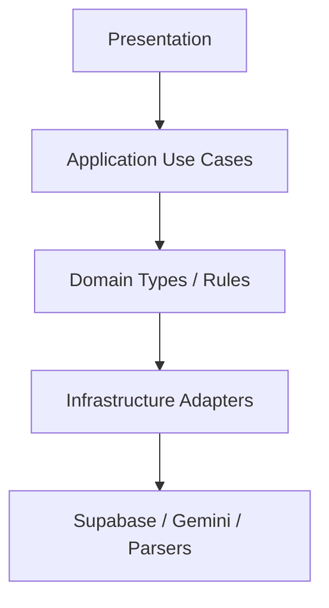

### 2.11 Goal-to-NFR Map

| Design Goal | Primary SRS NFRs |
| --- | --- |
| Security | SRS-NFR-001–005, 017, 024 |
| Reliability | SRS-NFR-006–008 |
| Performance/Scale | SRS-NFR-009–012 |
| Usability | SRS-NFR-013–016 |
| Maintainability/Testability | SRS-NFR-018–020 |
| Deployability/Operability | SRS-NFR-021–023 |

---

## 3. High Level Architecture

### 3.1 Architecture Selection Rationale

ResumeRank AI uses **SPA + BaaS + Edge Function AI orchestration** as selected in RR-ARCH-001 (ADR-001–ADR-004):

| Driver | Why this architecture |
| --- | --- |
| Academic/production hybrid timeline | Managed Auth/DB/Storage reduces custom backend |
| Secret protection | Edge Functions isolate Gemini keys (BR-05) |
| Job-centric screening | Clear aggregate boundaries in PostgreSQL |
| Human-in-the-loop | UI presents rankings; no autonomous decision services |

Alternatives rejected for v1: Next.js SSR (unnecessary), custom NestJS API (higher ops), client-side Gemini (violates BR-05).

### 3.2 System Context Diagram

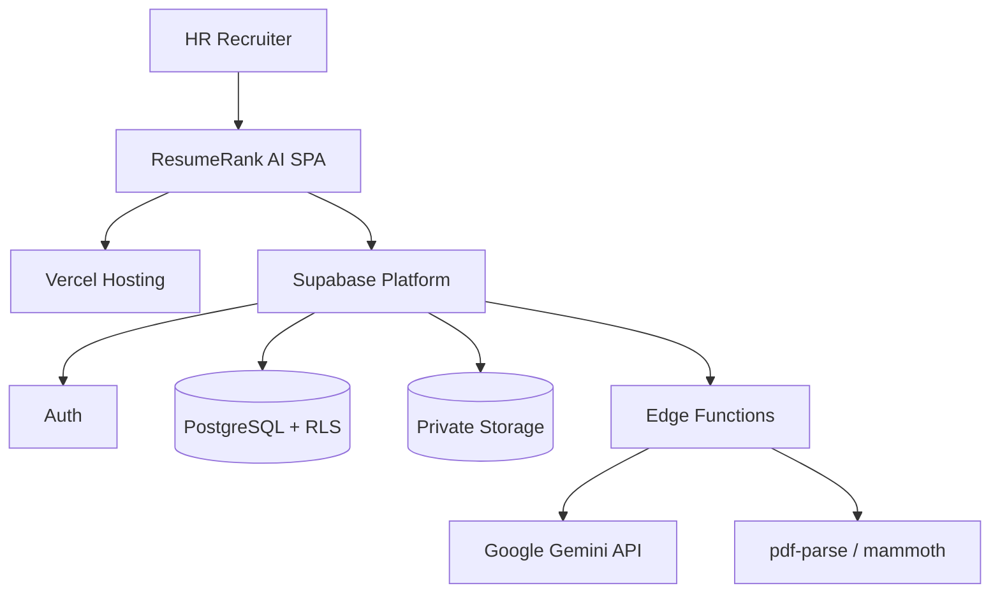

### 3.3 High-Level Architecture

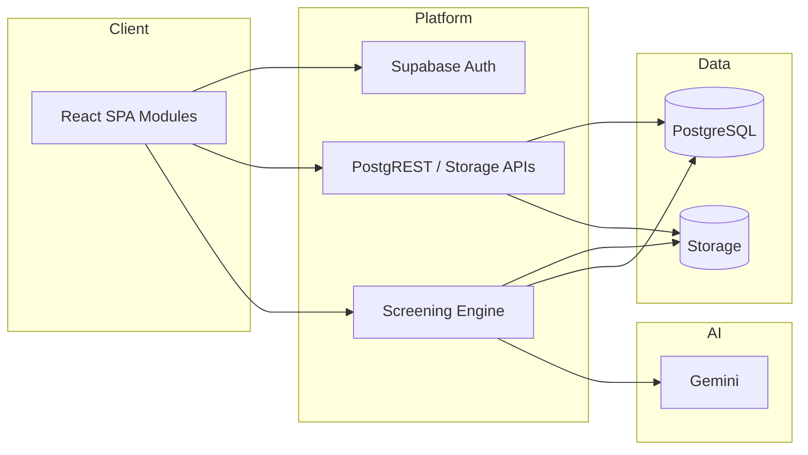

### 3.4 Application Architecture

| Application Area | Design |
| --- | --- |
| Routing | Protected app shell after auth; public login/signup |
| State | Server state via Supabase client queries; local UI state for forms/upload |
| Side effects | Upload to Storage → insert candidates → invoke Edge Function (ST-01; ST-02 optional) |
| Read models | Ranked candidates by active `match_score` desc; dashboard aggregates |

### 3.5 Logical / Layered Architecture

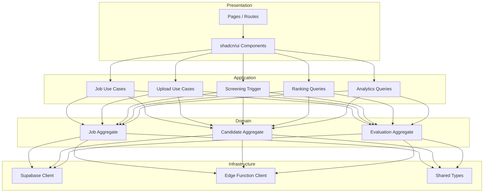

### 3.6 Component Interaction Diagram

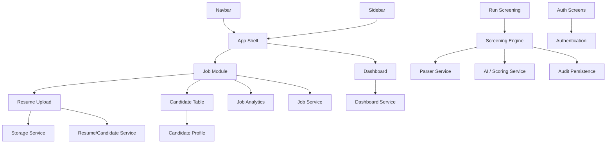

### 3.7 Repository Folder Structure

Aligned to RR-ARCH-001 §11:

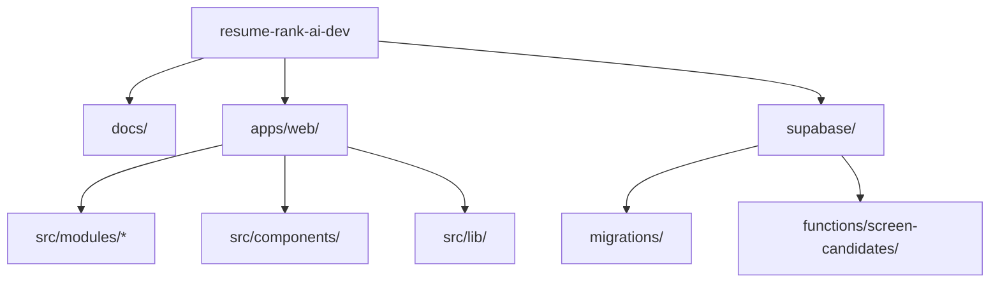

```text
apps/web/src/modules/{auth,jobs,uploads,candidates,ranking,analytics}/
supabase/functions/screen-candidates/
supabase/migrations/
docs/02-design/04-System-Design-Document.md
```

---

## 4. Technology Architecture

### 4.1 Stack Map

| Layer | Technology | Role |
| --- | --- | --- |
| Frontend | React + TypeScript + Vite | SPA |
| UI | Tailwind CSS + shadcn/ui | Design system |
| Backend | Supabase | Auth, DB, Storage, Edge Functions |
| Database | PostgreSQL | System of record |
| Storage | Supabase Storage | Private resumes |
| Auth | Supabase Auth | Sessions/JWT |
| AI | Google Gemini API | Score, rationale, summary, assisted extraction |
| Parsers | pdf-parse, mammoth | PDF/DOCX text |
| Deploy | Vercel | Frontend hosting |

### 4.2 Justification Matrix

| Technology | Advantages | Disadvantages | Justification |
| --- | --- | --- | --- |
| React | Ecosystem, component model | Client complexity | Fits SPA HR workflows |
| TypeScript | Type safety across domains | Build overhead | Reduces integration defects |
| Vite | Fast DX/builds | SPA-focused | Matches ADR-003 (no SSR) |
| Tailwind | Rapid consistent styling | Utility verbosity | Speed for v1 UI |
| shadcn/ui | Accessible primitives | Copy-in components | Aligns SRS-NFR-015 |
| Supabase | Unified Auth/DB/Storage/Functions | Platform coupling | ADR-001; academic delivery speed |
| PostgreSQL + RLS | Relational integrity + row security | Policy complexity | BR-01, BR-09, SRS-NFR-004 |
| Supabase Storage | Private buckets, signed access | Ops via platform | SRS-FR-013 |
| Supabase Auth | Managed sessions | Provider constraints | SRS-FR-001–003 |
| Gemini | Strong text reasoning | Cost/latency/vendor dependency | ADR-002; SRS-FR-018–021 |
| pdf-parse / mammoth | Lightweight Node parsers | Weak on scanned PDFs | ADR-005; SRS-FR-015; OCR out of scope |
| Vercel | Git-native SPA deploy | Frontend-only | ADR-003; SRS-NFR-021 |

### 4.3 Runtime Topology

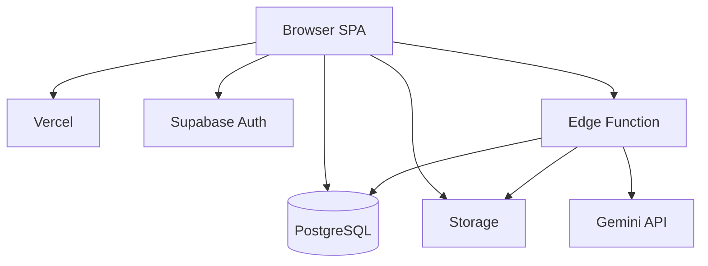

---

## 5. Component Design

### 5.1 Frontend Components

| Component | Responsibilities | Inputs | Outputs | Dependencies | Failure Handling |
| --- | --- | --- | --- | --- | --- |
| Navbar | Brand, user menu, sign-out | Session | Nav events | Auth module | Hide protected controls if signed out |
| Sidebar | Primary nav links | Route, auth | Navigation | App shell | Disabled links when unauthorized |
| Dashboard | Totals: jobs, candidates, completed evals; optional distributions | Aggregate queries | Charts/KPI UI | Dashboard service | Empty states; error toast |
| Job Module | Create/list/open/update; archive; delete-if-empty | Job forms, filters | Job records | Job service | Validation errors (VR-01–05) |
| Resume Upload | Multi-file select, type/size validation, progress | Files, job_id | Storage objects + pending candidates | Storage + Resume services | Per-file reject; continue batch (SRS-FR-017) |
| Candidate Table | Ranked/failed list, status chips, pagination/filter | job_id, query | Rows | Ranking queries | Show failed rows (SRS-FR-030) |
| Candidate Profile | Score, rationale, summary, CE fields | candidate_id | Detail view | Candidate + evaluation reads | Partial extraction OK |
| Analytics | Job/dashboard metrics | Scope user/job | Metric widgets | Dashboard service | Fallback zeros |

### 5.2 Backend / Platform Components

In v1, “backend components” are Supabase capabilities plus the Screening Engine Edge Function services (logical services inside the function).

| Component | Responsibilities | Inputs | Outputs | Dependencies | Failure Handling |
| --- | --- | --- | --- | --- | --- |
| Authentication | Register/sign-in/sign-out/session | Credentials | JWT session | Supabase Auth | EH-AUTH |
| Job Service | CRUD-ish job ops; archive; constrained delete | Job DTO | Job rows | PostgreSQL + RLS | VR-04/05; reject illegal delete |
| Resume Service | Create candidate stubs; link storage paths | Upload metadata | Candidate rows `pending` | DB + Storage | No candidate on failed upload |
| Parser Service | Extract text PDF/DOCX | File bytes | Plain text or fail | pdf-parse, mammoth | `failed_parse` |
| AI Service | Prompt Gemini; parse JSON | JD + text (+ schema) | Structured AI payload | Gemini API | Retry then `failed_ai` |
| Scoring Service | Validate score 0–100; rationale/summary gates | AI payload | Validated evaluation fields | Domain validators | Reject invalid → retry/fail |
| Extraction Mapper | Map CE-01–CE-14 into profile | AI/structured data | Candidate profile fields | Scoring/AI output | Null allowed for missing fields |
| Dashboard Service | Aggregations | owner_user_id / job_id | Counts/distributions | SQL views/queries | Safe empty aggregates |
| Storage Service | Private object put/get | File, path | Object path | Supabase Storage | EH-STORE |
| Logging Service | Structured logs + audit history writes | Events, prior evaluations | Logs / history rows | Edge logs + DB | Best-effort logs; history write required before overwrite |
| Audit Persistence | Copy active evaluation to history | Prior active evaluation | History row | DB | Block overwrite if history write fails |

### 5.3 Screening Engine Composition

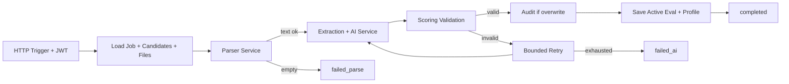

---

## 6. Module Design

### 6.1 Module Map

| Module | SRS Features | Notes |
| --- | --- | --- |
| Authentication | SF-01 | UC-01, UC-02 |
| Dashboard | SF-07 | UC-08 |
| Job Management | SF-02 | Archive/delete included |
| Resume Upload | SF-03 | |
| Resume Parsing | SF-04 (text) | Inside Screening Engine |
| AI Processing | SF-05 + extraction | Inside Screening Engine |
| Candidate Ranking | SF-06 | |
| Reporting | SF-07 | Analytics only — no separate BI |
| Administration | Minimal settings | Not a full admin console (SRS UC-L-02) |
| Audit Logging | SRS-FR-053, NFR-017 | Evaluation history + operational logs |

### 6.2 Authentication Module

| Field | Design |
| --- | --- |
| Purpose | Establish and end HR sessions |
| Responsibilities | Sign-up, sign-in, sign-out, route guards |
| Workflow | Credentials → Supabase Auth → JWT → protected shell; Sign out clears session |
| Inputs | Email/password (or Auth-supported credentials) |
| Outputs | Session; redirect |
| Business Rules | BR-01, BR-09 |
| Error Handling | EH-AUTH; safe messages |
| Security | HTTPS; anon key only on client |
| Future | OAuth providers if needed |

### 6.3 Dashboard Module

| Field | Design |
| --- | --- |
| Purpose | Screening visibility (BG-04) |
| Responsibilities | Show totals; optional status/score distributions |
| Workflow | On load, query aggregates scoped to owner |
| Inputs | Auth user id |
| Outputs | KPI cards / charts |
| Business Rules | Owner-scoped only |
| Error Handling | Empty/error states |
| Security | RLS |
| Future | Longitudinal trends (FS-10) |

### 6.4 Job Management Module

| Field | Design |
| --- | --- |
| Purpose | Manage active jobs and JD text |
| Responsibilities | Create, list, open, update; archive; delete-if-empty |
| Workflow | Create with title+JD → `lifecycle_status=active`; Archive soft-closes; Delete only if candidate_count=0 |
| Inputs | Job form; archive/delete commands |
| Outputs | Job rows |
| Business Rules | BR-07, BR-11; VR-01–05; SRS-FR-046/047 |
| Error Handling | Validation messages; reject illegal delete |
| Security | owner_user_id + RLS |
| Future | Unarchive UX if implemented; JD version notes (Could) |

### 6.5 Resume Upload Module

| Field | Design |
| --- | --- |
| Purpose | Bulk intake of resumes for an active job |
| Responsibilities | Validate MIME/size; store privately; create `pending` candidates |
| Workflow | Select files → validate each → store → insert candidate → optional ST-02 auto-screen; ST-01 always available |
| Inputs | PDF/DOCX ≤ 5MB default; job_id |
| Outputs | Storage paths; candidate ids |
| Business Rules | BR-04, BR-06; SRS-FR-010–014, 017 |
| Error Handling | Per-file rejection; batch continues |
| Security | Private bucket; authz on job ownership |
| Future | Additional formats only via change control |

### 6.6 Resume Parsing Module

| Field | Design |
| --- | --- |
| Purpose | Obtain usable plain text |
| Responsibilities | pdf-parse for PDF; mammoth for DOCX; detect empty text |
| Workflow | Fetch object → parse → if empty then `failed_parse` else continue |
| Inputs | File bytes + MIME |
| Outputs | Resume text |
| Business Rules | CSL-04; SRS-FR-015/016 |
| Error Handling | Isolate failure; no Gemini call |
| Security | Server-side only |
| Future | OCR (FS-03) behind same adapter |

### 6.7 AI Processing Module

| Field | Design |
| --- | --- |
| Purpose | Extraction assistance + score/rationale/summary |
| Responsibilities | Prompt assembly; Gemini call; JSON validation; profile mapping; active eval write; history on overwrite |
| Workflow | See §9 |
| Inputs | JD text, resume text, candidate id, prompt version |
| Outputs | CE fields, match_score, rationale, summary, model metadata |
| Business Rules | BR-02, BR-03, BR-05, BR-08, BR-12 |
| Error Handling | Bounded retry → `failed_ai` |
| Security | Edge secrets only |
| Future | Provider plug-in (FS-04) |

**Candidate lifecycle (module view):**

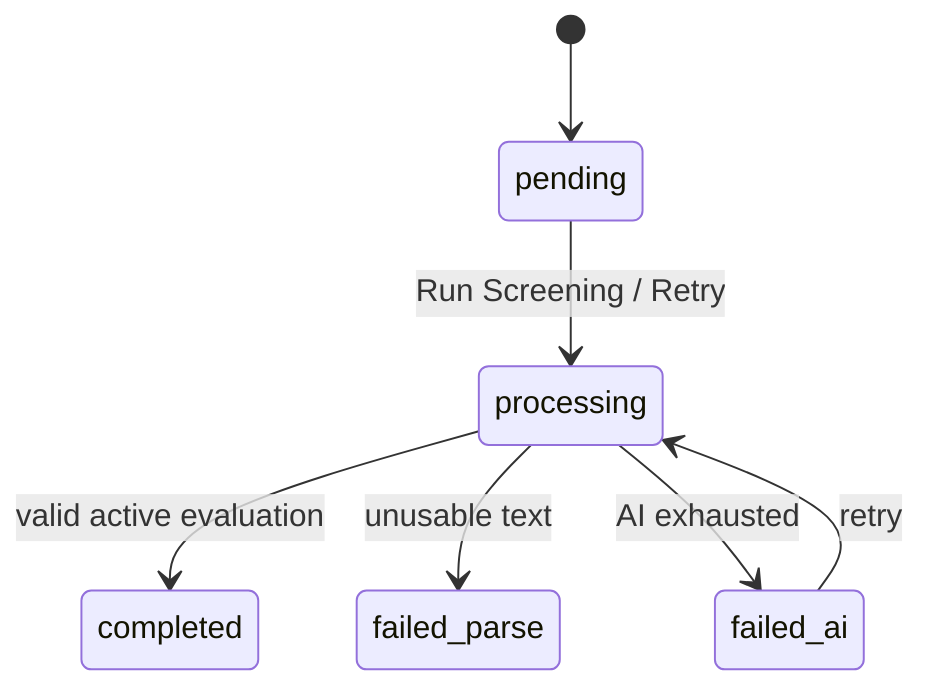

### 6.8 Candidate Ranking Module

| Field | Design |
| --- | --- |
| Purpose | Present explainable shortlist |
| Responsibilities | Sort by active match_score desc; show status; open profile |
| Workflow | Query completed + failed for job → sort completed → paginate/filter |
| Inputs | job_id |
| Outputs | Ranked UI |
| Business Rules | BR-02, BR-10; no auto-reject UI |
| Error Handling | Empty/in-progress states |
| Security | Owner RLS |
| Future | CSV export (Could) |

### 6.9 Reporting Module

Implements SF-07 analytics only (not a separate reporting warehouse). Reuses Dashboard Service queries at user and job scope.

### 6.10 Administration Module

v1 administration is **minimal**: profile/session settings and operator procedures via Deployment Guide. No in-app multi-tenant admin console (SRS UC-L-02). Design includes configuration via env (`.env.example`) only.

### 6.11 Audit Logging Module

| Field | Design |
| --- | --- |
| Purpose | Academic/operational auditability |
| Responsibilities | Before active evaluation overwrite, insert history snapshot; log screening events |
| Workflow | Read active → insert history → write new active (transactional unit) |
| Inputs | Prior evaluation row |
| Outputs | `evaluation_history` record; structured logs |
| Business Rules | BR-03, BR-12; SRS-FR-053 |
| Error Handling | If history insert fails, abort overwrite |
| Security | Owner-scoped history reads |
| Future | UI to browse history (FS-12) |

---

## 7. Database Interaction Design

Physical DDL is finalized in RR-DB-005. This section defines interaction design required by SRS-DB-*.

### 7.1 Database Architecture

| Concern | Design |
| --- | --- |
| Engine | PostgreSQL on Supabase |
| Access | PostgREST/SDK with user JWT; Edge Function may use service role carefully for screening writes still constrained by job ownership checks |
| Security | RLS by `auth.uid()` ownership |
| Files | Object storage paths on candidates; binaries not in bytea |

### 7.2 Entity Relationships

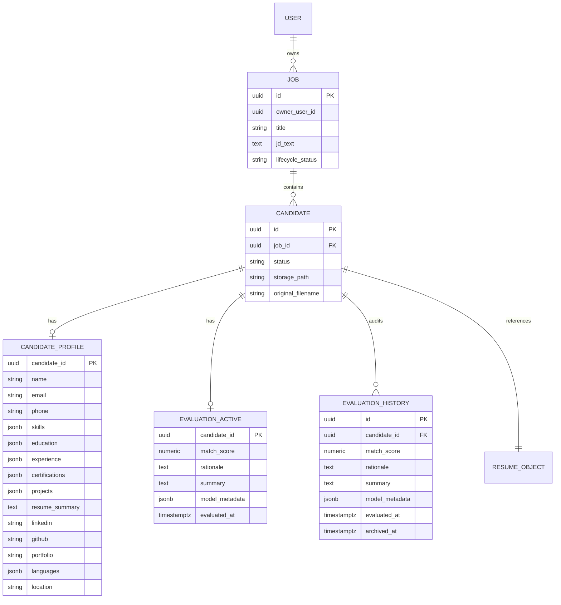

### 7.3 CRUD and Transaction Flows

| Operation | Flow |
| --- | --- |
| Create job | Insert job `active` with owner_user_id=auth.uid() |
| Archive job | Update lifecycle_status=`archived`; block uploads/screening (VR-05, CSL-08) |
| Delete job | Allow only if no candidates; else reject |
| Upload resume | Storage upload + insert candidate `pending` (prefer coordinated client steps; compensate on failure) |
| Screening unit | Per candidate: status→processing; parse; AI; if prior active exists → insert history; upsert active; upsert profile; status terminal |
| Retry | Same screening unit for `failed_ai` |

**Screening write unit (logical transaction):**

1. Verify job active + ownership + JD present  
2. Set `processing`  
3. Parse/extract/score  
4. If replacing active evaluation → insert history snapshot  
5. Upsert active evaluation + profile  
6. Set `completed` or failure status  
7. On any mid-flight failure after step 2 → `failed_parse`/`failed_ai` without leaving stuck `processing` beyond retry policy

### 7.4 Indexes (Design Intent)

| Index Intent | Purpose |
| --- | --- |
| jobs(owner_user_id, lifecycle_status, created_at desc) | List active jobs |
| candidates(job_id, status) | Status aggregates/filters |
| candidates(job_id, created_at) | Ordering |
| evaluation_active(match_score desc) via job join | Ranking |
| evaluation_history(candidate_id, archived_at desc) | Audit browse |

Exact DDL in RR-DB-005.

### 7.5 Caching Strategy

| Layer | Tactic |
| --- | --- |
| CDN | Vercel caches static assets |
| Client | Short-lived query cache for dashboard/job lists; invalidate on mutations |
| Server | No Redis in v1; rely on Postgres indexes |
| AI | No cross-candidate cache of Gemini outputs (each candidate unique) |

### 7.6 Concurrency

| Scenario | Design |
| --- | --- |
| Parallel candidate screening | Bounded worker pool inside Edge Function / sequential-with-limit to respect Gemini quotas |
| Double-click Run Screening | Idempotent per candidate: skip if already `processing`/`completed` unless retry |
| Retry vs in-flight | Reject retry unless status is `failed_ai` |

### 7.7 Data Validation

Enforce VR-* via DB checks/constraints where practical and application validators before writes. Status enum constrained (SRS-DB-014). match_score numeric 0–100 check on active evaluations.

### 7.8 Soft Delete Strategy

| Entity | Strategy |
| --- | --- |
| Job | Soft archive (`archived`); hard delete only if empty |
| Candidate | No hard-delete requirement in v1; failures retained for inspectability (SRS-NFR-008) |
| Evaluation | Active overwritten; previous retained in history (not deleted) |

### 7.9 Data Retention

v1 retains owner-scoped jobs, candidates, profiles, active evaluations, and history for academic demo/audit. No automated purge in v1; future retention policies via change control.

### 7.10 Data Flow Summary

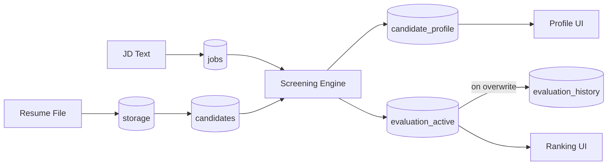

---

## 8. API Interaction Design

Conceptual APIs only — no implementation code. Formal contracts in RR-API-006.

### 8.1 API Style

| Surface | Style |
| --- | --- |
| Data CRUD | Supabase client → PostgREST tables/views |
| File I/O | Supabase Storage API |
| Screening | HTTPS Edge Function `screen-candidates` |
| Auth | Supabase Auth API |

### 8.2 Conceptual API Surface

| API | Purpose | AuthZ |
| --- | --- | --- |
| Auth signUp/signIn/signOut | Session lifecycle | Public/auth |
| jobs insert/select/update | Job management | Owner RLS |
| jobs archive/delete RPC or update | Lifecycle | Owner + delete rules |
| storage upload/download | Resume binaries | Owner policies |
| candidates insert/select | Intake and listing | Owner via job |
| evaluations select | Ranking/detail | Owner via job |
| evaluation_history select | Audit read | Owner |
| Edge `screen-candidates` | Run/retry screening | JWT; verify ownership |

### 8.3 Request / Response Flow

**Run Screening request (conceptual):** `{ job_id, candidate_ids? }`  
**Response:** `{ accepted: true, results: [{ candidate_id, status, error_code? }] }`

Validation: JWT present; job owned; job active; JD non-empty; candidates belong to job; statuses eligible (`pending` or `failed_ai`).

### 8.4 Authentication and Authorization

| Step | Design |
| --- | --- |
| AuthN | User JWT on all protected calls |
| AuthZ | RLS for table access; Edge Function re-checks job ownership before privileged reads/writes |
| Client key | Anon key only |

### 8.5 Validation, Errors, Rate Limiting, Retry

| Concern | Design |
| --- | --- |
| Validation | Client VR checks + server/Edge enforcement |
| Errors | Map to EH-* categories; safe messages |
| Rate limiting | Rely on Supabase/Gemini platform limits; application bounded concurrency for batch AI |
| Retry | Transient Gemini errors: bounded exponential backoff inside Edge Function (SRS-NFR-007); no infinite client loops |

### 8.6 Sequence Diagrams

**Happy-path screening:**

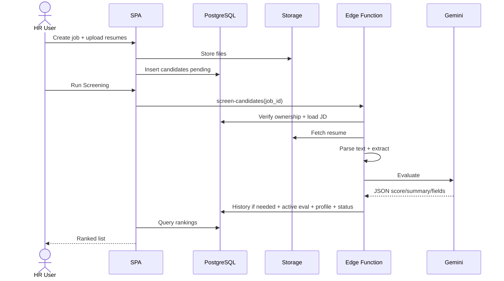

**Upload validation failure isolation:**

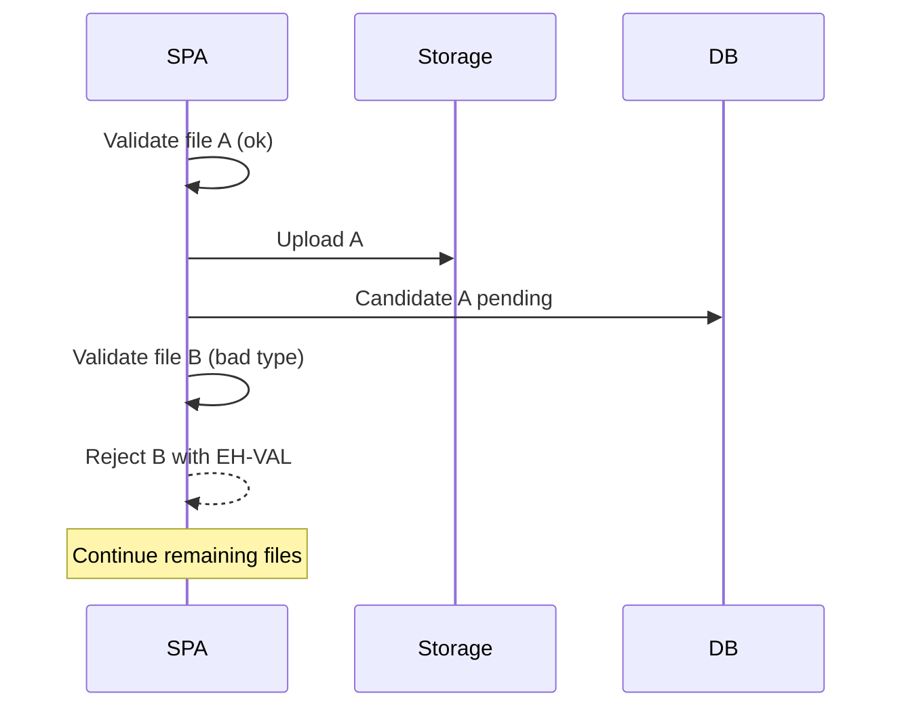

---

## 9. AI Processing Design

Critical path implementing SF-04/SF-05 and SRS-AI-*.

### 9.1 Design Principles

1. Edge-only Gemini (BR-05)  
2. Human-in-the-loop (BR-02) — ranking/summary only  
3. Schema validation gate for `completed` (SRS-AI-020–022)  
4. One active evaluation; history on overwrite (BR-12)  
5. Missing CE fields do not alone cause `failed_parse` (CE-R1/CE-R2)

### 9.2 Resume Processing Pipeline

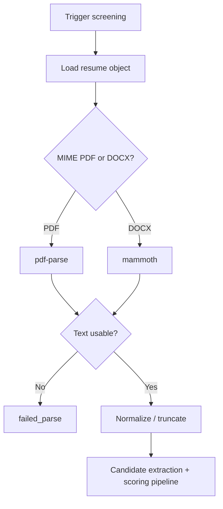

### 9.3 AI Pipeline

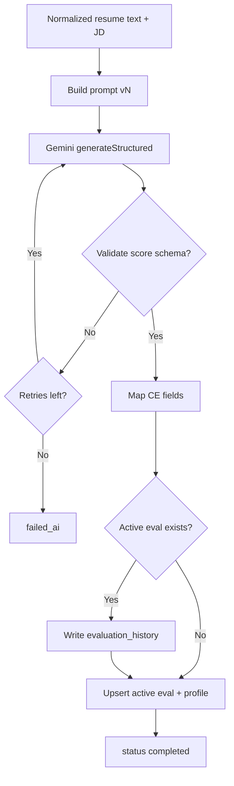

### 9.4 Candidate Extraction Pipeline

| Stage | Design |
| --- | --- |
| Source | Parsed resume text |
| Method | Gemini structured output in same screening call (preferred for v1 cohesion) and/or light heuristic post-processors |
| Required attempt | CE-01–CE-09 |
| Optional | CE-10–CE-14 when present |
| Persistence | `candidate_profile` upsert |
| Failure policy | Sparse fields allowed; empty text still `failed_parse` |

| Field ID | Storage Shape (logical) |
| --- | --- |
| CE-01 Name | string |
| CE-02 Email | string |
| CE-03 Phone | string |
| CE-04 Skills | list/json |
| CE-05 Education | list/json |
| CE-06 Experience | list/json |
| CE-07 Certifications | list/json |
| CE-08 Projects | list/json |
| CE-09 Resume Summary | text |
| CE-10–14 Optional | strings/lists as applicable |

### 9.5 Prompt Construction and Versioning

| Element | Design |
| --- | --- |
| Contents | JD, resume text, output JSON schema instructions, extraction field list, scoring rubric pointer |
| Versioning | `prompt_version` string stored in model_metadata (e.g., `rr-score-extract-v1`) |
| Change control | Prompt text owned by RR-AI-008; breaking schema changes bump version |
| Client | Must not assemble production prompts |

### 9.6 Gemini Integration and Response Validation

| Step | Design |
| --- | --- |
| Transport | HTTPS from Edge Function |
| Auth | `GEMINI_API_KEY` secret |
| Parse | JSON only; reject prose wrappers when possible |
| Score gate | numeric ∈ [0,100] |
| Text gates | non-empty rationale & summary |
| On fail | retry transient; else `failed_ai` |

### 9.7 Scoring Logic and “Recommendation” Behavior

v1 has **no separate ML recommendation engine**. Recommendation to HR is:

1. Compute Gemini `match_score` against JD  
2. Persist rationale/summary  
3. Rank by active score descending in UI  

This satisfies PRD ranking/explainability without undocumented recommender features.

**Confidence handling:** v1 does **not** define a separate confidence score field. Completion confidence is binary via schema validation gates. Sparse extraction is visible to HR as empty fields rather than a confidence metric.

### 9.8 Retry, Failure Recovery, Audit Logging

| Topic | Design |
| --- | --- |
| Transient retry | Bounded backoff inside Edge Function |
| User retry | UC-10 on `failed_ai` only (Should) |
| Overwrite | New result becomes active |
| Audit | Prior active copied to history first |
| Recovery | Partial batch success; siblings untouched |

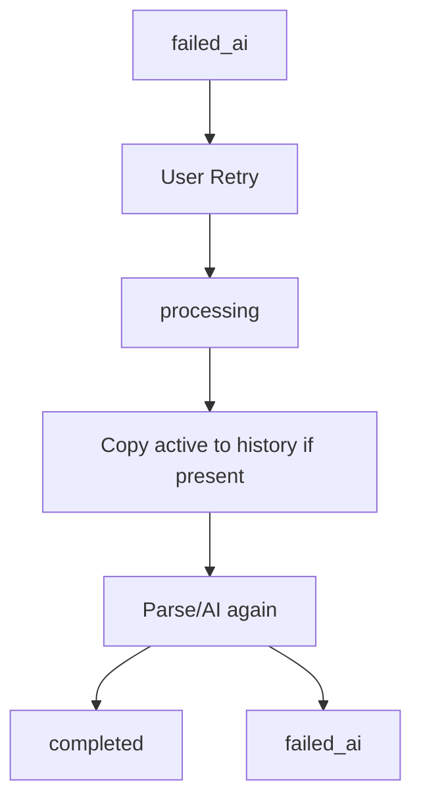

### 9.9 Future AI Improvements

Documented only as future: OCR, alternate LLM providers, bias metrics, completed-candidate re-screen comparison UI (FS-03, FS-04, FS-07, FS-12). Not in v1 build scope.

---

## 10. Security Design

Aligns to SRS §9/§13 and RR-ARCH-001 trust boundaries. Detailed threat matrix expands in RR-SEC-009.

### 10.1 Authentication

Supabase Auth; protected routes; session JWT on API calls (SRS-FR-001–003).

### 10.2 Authorization

Owner-based RLS; Edge Function ownership checks; no Hiring Manager roles in v1 (SRS-FR-044).

### 10.3 Session Management

Supabase client session refresh; sign-out clears client session (UC-02).

### 10.4 File and Input Validation

MIME allowlist PDF/DOCX; max size default 5MB; empty files rejected; JD/title required (VR-*).

### 10.5 OWASP Considerations (v1 Controls)

| Risk | Control |
| --- | --- |
| Broken access control | RLS + ownership checks |
| Sensitive data exposure | Private storage; no public resume URLs |
| Injection | Parameterized SDK/PostgREST; validate AI JSON before persist |
| Security misconfiguration | `.env.example` without secrets; no service role in client |
| XSS | React escaping; sanitize displayed AI text as text nodes |
| CSRF | Prefer bearer/JWT patterns of Supabase client |
| SSRF | Edge Function fetches only Storage + Gemini endpoints |

### 10.6 API Key and Secrets Management

| Secret | Location |
| --- | --- |
| `VITE_SUPABASE_URL`, `VITE_SUPABASE_ANON_KEY` | Vercel env (publishable) |
| `GEMINI_API_KEY` | Edge Function secrets |
| Service role key | Edge secrets only; never `VITE_` |

### 10.7 Encryption

TLS in transit (HTTPS). Encryption at rest via Supabase/Vercel platform defaults. No custom field-level encryption in v1 beyond platform.

### 10.8 Secure File Upload

Private bucket; authz policies; server-side type verification where possible; paths namespaced by `user_id/job_id/`.

### 10.9 Audit Logging

Evaluation history + Edge structured logs for screening events.

### 10.10 Threat Model (Summary)

| Threat | Mitigation |
| --- | --- |
| Stolen anon key | RLS still enforces ownership |
| Gemini key leak | Edge-only; rotate via platform |
| Cross-user data read | RLS + tests |
| Malicious upload | Type/size limits; private storage; parse in Edge |
| Prompt abuse | Authz on screening; owner-only jobs |

### 10.11 Security Boundary Diagram

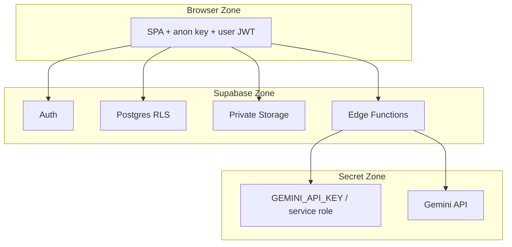

---

## 11. Deployment Architecture

### 11.1 Environments

| Env | Frontend | Backend |
| --- | --- | --- |
| Development | Vite local | Supabase local or shared project |
| Preview | Vercel Preview | Shared/branch Supabase |
| Production | Vercel Production | Supabase Production |

### 11.2 Deployment Diagram

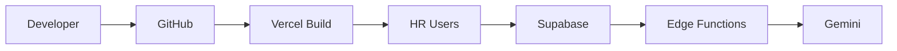

### 11.3 Pipeline and Rollback

| Step | Design |
| --- | --- |
| Build | Vercel builds Vite app on PR/main |
| Migrations | Controlled `supabase db push`/CI migration apply |
| Functions | Deploy `screen-candidates` with secrets |
| Rollback | Revert Vercel deployment; migrate down only with reviewed scripts; keep DB backups via platform |

### 11.4 Environment Variables

| Class | Examples |
| --- | --- |
| Public | `VITE_SUPABASE_URL`, `VITE_SUPABASE_ANON_KEY` |
| Edge secrets | `GEMINI_API_KEY`, service role |
| Limits | `MAX_UPLOAD_MB=5`, `GEMINI_MODEL`, `AI_MAX_RETRIES`, `PROMPT_VERSION` |

### 11.5 Networking

HTTPS only for preview/production. Browser talks to Vercel origin and Supabase project URL. Edge talks to Gemini HTTPS API.

---

## 12. Logging and Monitoring

| Type | Design |
| --- | --- |
| Application logging | Client error boundaries + console/reporting for UI failures |
| Audit logging | `evaluation_history` rows; screening event logs with job_id/candidate_id/prompt_version |
| AI logging | Model name, latency, retry count, validation pass/fail (no full prompt dump in client logs) |
| Error logging | Edge Function structured errors with EH category |
| Performance monitoring | Vercel analytics (platform); optional timing fields in Edge logs |
| Alerting | Manual/platform alerts for demo; no mandatory PagerDuty in v1 |
| Retention | Platform log retention defaults; DB history retained for demo/MBA evidence |

---

## 13. Performance Design

| Goal | Tactic |
| --- | --- |
| SRS-NFR-009 | Indexed list queries; minimal dashboard payload |
| Large uploads | Per-file upload; 5MB default cap; progress UI |
| Batch processing | Async Edge execution; UI polling/refetch of statuses |
| Parallel AI requests | Bounded concurrency (design default: low single-digit parallelism) to protect quotas |
| DB optimization | Indexes in §7.4; select only needed columns for tables |
| Caching | §7.5 |
| Pagination | Candidate table pagination/progressive load (SRS-FR-032 Should) |
| Lazy loading | Route-level code splitting for dashboard/job/analytics pages |

---

## 14. Scalability Design

| Dimension | v1 Design | Future Enterprise |
| --- | --- | --- |
| Horizontal | Vercel CDN instances; Supabase managed scale | Dedicated API tier |
| Vertical | Platform plan upgrades | Larger DB compute |
| Database growth | Indexes + archive jobs | Partitioning/tenancy |
| Storage growth | Per-user prefixes; private bucket | Lifecycle policies |
| API scaling | PostgREST + Edge | Queue workers |
| AI scaling | Bounded concurrency + retries | Async job queue + multi-provider |
| Multi-company | Not in v1 | FS-02 orgs/RBAC |

---

## 15. Error Handling Strategy

### 15.1 Global Approach

Map failures to EH categories from SRS §18. UI shows actionable category messages without secrets/stack traces.

### 15.2 By Layer

| Layer | Strategy |
| --- | --- |
| Global UI | Error boundary + toast/inline alerts |
| API/PostgREST | Translate 401/403/409/422 to EH-AUTH/FORB/VAL |
| Upload | Per-file EH-VAL/EH-STORE; continue batch |
| Parsing | `failed_parse`; continue siblings |
| AI | Retry then `failed_ai` |
| Database | Abort unit of work; leave candidate in failure status not false `completed` |
| Retry/Recovery | UC-10 for AI; re-upload new candidate for parse failures |

### 15.3 Retry Strategy

| Failure | Retry |
| --- | --- |
| Transient Gemini/network | Automatic bounded backoff in Edge |
| Persistent schema invalid | Count toward AI failure budget → `failed_ai` |
| User retry | Explicit on `failed_ai` |
| Upload/storage | User re-attempt file |

---

## 16. Design Decisions

| ID | Decision | Reason | Alternative | Trade-offs |
| --- | --- | --- | --- | --- |
| DD-01 | SPA + Supabase + Edge AI | Matches ADR-001/004; protects secrets | Custom Node API | Platform coupling vs speed |
| DD-02 | Explicit Run Screening (ST-01) + optional auto-start (ST-02) | SRS normative trigger clarity | Auto-only | Extra click vs control |
| DD-03 | Combined Gemini call for score+extraction | Fewer round trips; cohesive schema | Separate extract then score calls | Larger prompts vs latency/cost |
| DD-04 | Active evaluation table + history table | SRS-FR-051–053 | Append-only versions as active via flag only | Clear active read path; extra write |
| DD-05 | Job archive soft-delete; hard delete if empty | SRS-FR-046/047; BR-11 | Cascade hard delete | Safer demos; less storage reclaim |
| DD-06 | No separate confidence score | Not in SRS | Add confidence field | Less metrics; simpler validation |
| DD-07 | Ranking = sort by score | PRD/SRS ranking | ML re-ranker | Explainable; no undocumented ML |
| DD-08 | Bounded parallel Gemini | NFR performance + quotas | Fully serial / unlimited parallel | Throughput vs rate limits |
| DD-09 | Client uses anon key only | SRS-SEC / NFR-003 | Service role in client | Security mandatory |
| DD-10 | Parsers Edge-side | Consistent with secret/file access | Browser parsing | Heavier Edge CPU; better control |
| DD-11 | Minimal Administration module | SRS operator model | Full admin console | Less scope creep |
| DD-12 | Analytics via SQL aggregates | SF-07 | External BI | Simpler v1 |

---

## 17. Future Enhancements

Mapped to SRS/PRD future scope — **not v1 design commitments**:

| Enhancement | SRS/PRD Ref | Design Impact When Promoted |
| --- | --- | --- |
| OCR | FS-03 | New parser adapter |
| ATS integration | FS-08 | New ingestion API boundary |
| Email notifications | FR-43 Won't now | Notification service |
| Interview scheduling | PRD out of scope | New module |
| Multi-company support | FS-02 | Tenancy + RLS redesign |
| RBAC / Hiring Manager | FS-01 / FR-44 | AuthZ model expansion |
| Advanced analytics | FS-10 | Event warehouse |
| Bias detection | FS-07 | Ethics metrics + data policy |

---

## 18. Conclusion

### 18.1 Summary

This SDD converts ResumeRank AI’s approved architecture and SRS v1.1.0 into an implementation-ready design: layered SPA, Supabase platform services, Edge Screening Engine, structured extraction, Gemini scoring with validation, active evaluation plus audit history, archive-first job lifecycle, and human-in-the-loop ranking/analytics.

### 18.2 Requirements Satisfaction Matrix (Representative)

| Requirement Area | Satisfied By |
| --- | --- |
| SF-01 Auth | §5 Auth, §6.2, §10 |
| SF-02 Jobs + archive/delete | §6.4, §7.8 |
| SF-03 Upload | §6.5, §8.6 |
| SF-04 Parse + CE extraction | §6.6, §9.2–9.4 |
| SF-05 AI score/summary/retry/audit | §6.7, §9 |
| SF-06 Ranking | §6.8 |
| SF-07 Analytics | §6.3, §6.9 |
| SF-08 Status/resilience | §6.7 lifecycle, §15 |
| Security NFRs | §10 |
| Performance/scale NFRs | §13, §14 |
| BR-01–BR-12 | Enforced across modules; unchanged |

### 18.3 Handoff

Next design artifact: **RR-DB-005 Database Design Document**, refining §7 into physical schema, RLS policies, and migrations.

---

## 19. Design Review Report

Performed after completing RR-SDD-004 v1.0.0 against RR-ARCH-001, RR-PRD-002, and RR-SRS-003 v1.1.0.

### 19.1 Review Summary

| Area | Assessment |
| --- | --- |
| Design consistency | Pass — aligns with architecture ADRs and SRS status/evaluation rules |
| Module cohesion | Pass — modules map cleanly to SF-01–SF-08 |
| Coupling | Pass with note — Screening Engine concentrates parse/AI/persist (intentional); UI decoupled from Gemini |
| Security | Pass — trust boundaries and secret placement correct |
| Performance | Pass for demo profile — bounded AI concurrency specified |
| Scalability | Pass for v1 — enterprise multi-tenant deferred |
| Undocumented features | Pass — no OCR/HM RBAC/auto-reject/ATS invented as v1 |
| Business rules | Pass — BR-01–BR-12 preserved |

### 19.2 Missing Components Check

| Item | Status |
| --- | --- |
| Auth, Jobs, Upload, Parse, AI, Rank, Analytics | Present |
| Archive/Delete, Retry/Audit, CE extraction | Present |
| Full in-app Administration console | Correctly **excluded** per SRS |
| Separate Recommendation Engine | Correctly modeled as score-ranking, not new engine |
| Confidence score field | Correctly **not invented** |

### 19.3 Diagram Completeness

| Required Diagram | Present |
| --- | --- |
| System / high-level / layered / component | Yes |
| Sequence diagrams | Yes |
| ER diagram | Yes |
| Candidate lifecycle | Yes |
| Resume + AI pipelines | Yes |
| Deployment | Yes |
| Security boundary | Yes |
| Folder structure | Yes |

### 19.4 Recommendations Before Database Design (RR-DB-005)

| ID | Recommendation | Priority |
| --- | --- | --- |
| DR-01 | In RR-DB-005, finalize whether `evaluation_active` is a dedicated table or `evaluations.is_active` with unique partial index — preserve one-active invariant | High |
| DR-02 | Specify exact RLS policies for `evaluation_history` and storage path conventions `user_id/job_id/` | High |
| DR-03 | Decide JSON schemas for skills/education/experience arrays to stabilize CE persistence | High |
| DR-04 | Document Edge Function timeout vs batch size; may require chunked invocation for large batches | Medium |
| DR-05 | Confirm whether ST-02 auto-start is enabled by default in UX (allowed by SRS as May) | Medium |
| DR-06 | Add migration strategy for prompt_version and model_metadata columns | Medium |
| DR-07 | In RR-API-006, specify idempotency keys for screening requests | Medium |
| DR-08 | Ensure PRD minor revision later acknowledges extraction + archive/delete (already in SRS v1.1) for doc suite consistency | Low |

### 19.5 Review Verdict

**Approved to proceed to Database Design Document (RR-DB-005)** after acknowledging DR-01–DR-03 as inputs to that document. No SDD-blocking defects identified relative to SRS v1.1.0.

---

## 20. Appendices

### Appendix A — Glossary

| Term | Definition |
| --- | --- |
| Active Evaluation | Sole current evaluation for a candidate |
| Evaluation Audit History | Snapshots of prior active evaluations |
| Screening Engine | Edge Function orchestrating parse/extract/AI/persist |
| Candidate Profile | Persisted CE-01–CE-14 fields |
| Job Lifecycle Status | `active` or `archived` |
| Bounded Concurrency | Limited parallel Gemini calls during batch screening |

### Appendix B — SRS Feature Traceability to SDD Chapters

| SRS Feature | SDD Chapters |
| --- | --- |
| SF-01 | §5, §6.2, §10 |
| SF-02 | §5, §6.4, §7 |
| SF-03 | §5, §6.5, §8 |
| SF-04 | §6.6, §9 |
| SF-05 | §6.7, §9 |
| SF-06 | §6.8 |
| SF-07 | §6.3, §6.9 |
| SF-08 | §6.7, §15 |

### Appendix C — Document Control

| Item | Value |
| --- | --- |
| Path | `docs/02-design/04-System-Design-Document.md` |
| Version | 1.0.0 |
| Upstream | RR-ARCH-001 v2.0.0; RR-PRD-002 v1.0.0; RR-SRS-003 v1.1.0 |
| Next | RR-DB-005 Database Design Document |

---

**End of Document — Document 04 — RR-SDD-004 — System Design Document v1.0.0**
