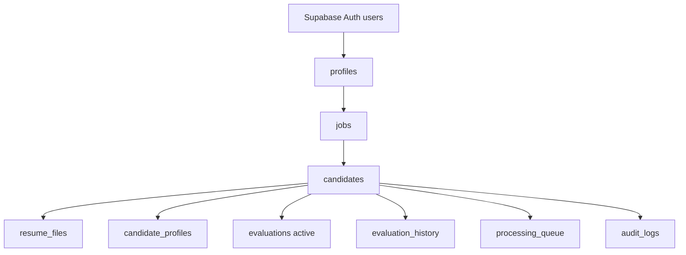
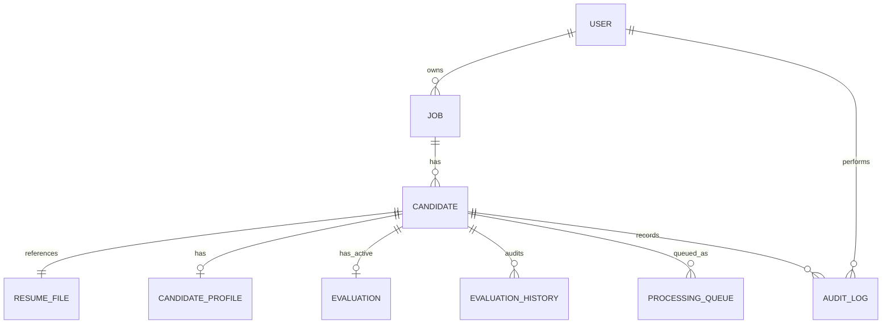
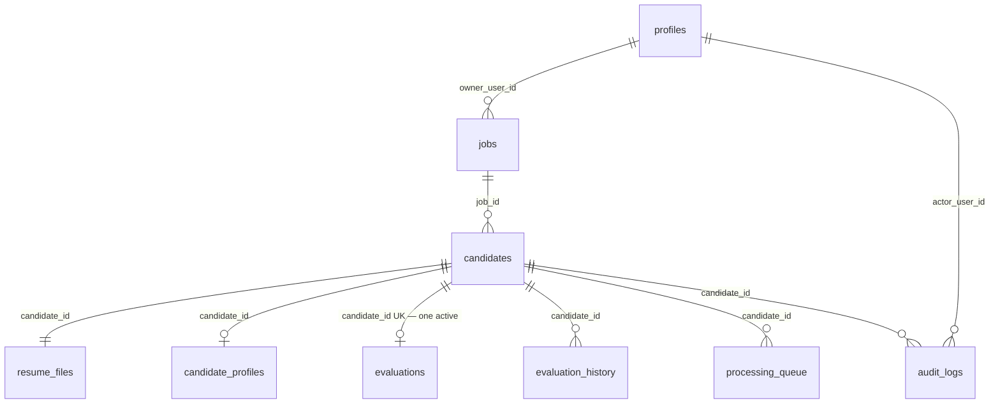
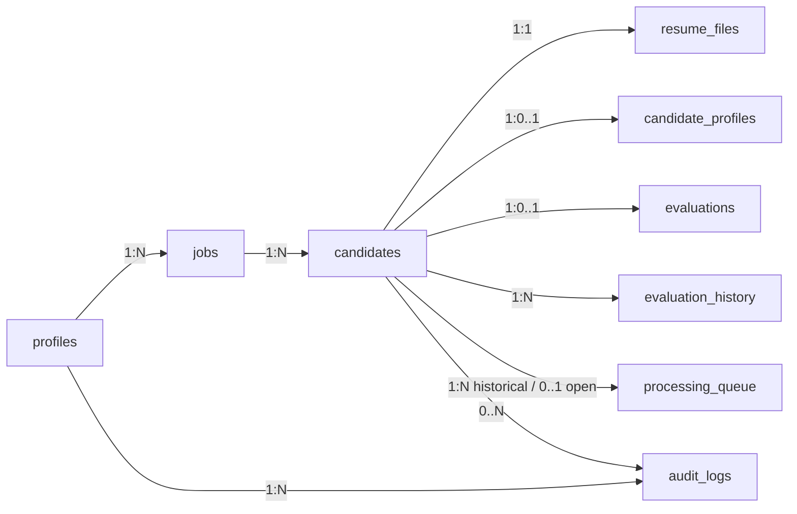
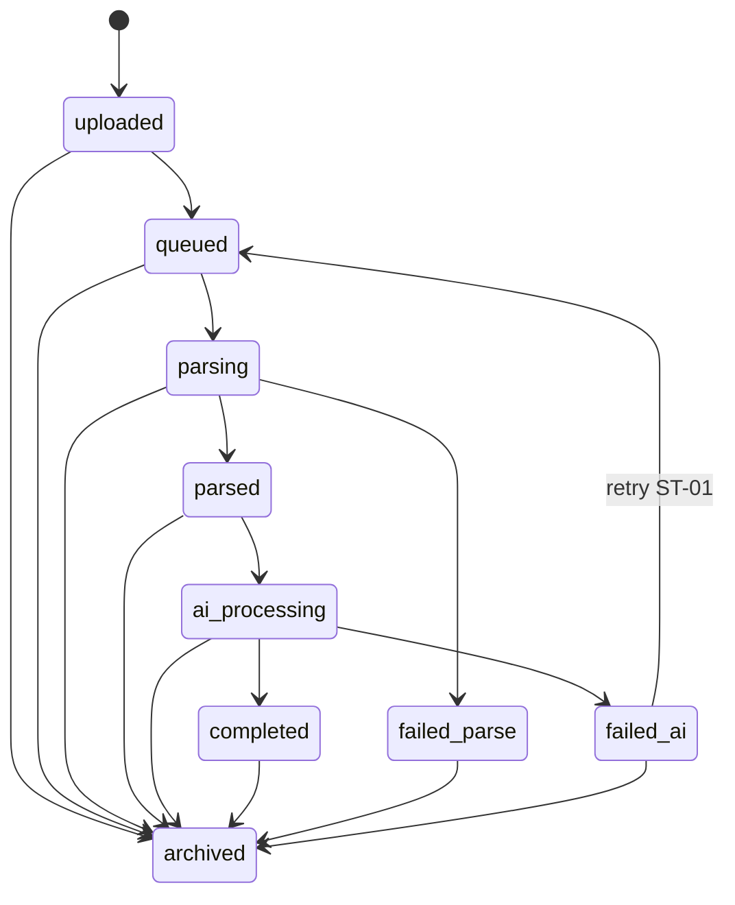
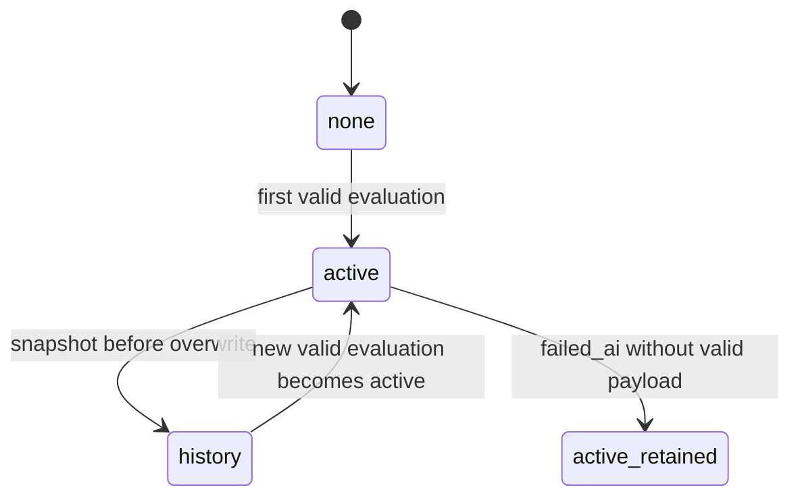
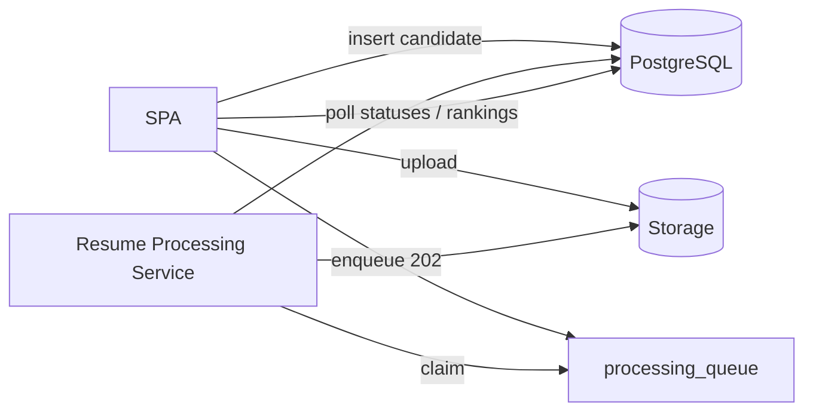

# ResumeRank AI

# Database Design Document (DDD)

**Document 05 — RR-DB-005**

---

## Cover Page

| | |
| --- | --- |
| **Project Name** | ResumeRank AI |
| **Document Title** | Database Design Document |
| **Document Number** | Document 05 |
| **Document ID** | RR-DB-005 |
| **Version** | 1.1.0 |
| **Status** | Baseline — Ready for API Design |
| **Supersedes** | RR-DB-005 v1.0.0 |
| **Classification** | Internal — MBA Final Year Project |
| **Specialization** | Artificial Intelligence & Data Science |
| **Document Type** | Database Design (PostgreSQL / Supabase) |
| **Author** | Vish Var |
| **Role** | Senior Database Architect / Project Lead |
| **Organization** | ResumeRank AI Development Team |
| **Prepared For** | Development, QA, and Academic Evaluation Teams |
| **Date** | 12 July 2026 |
| **Upstream Dependencies** | RR-ARCH-001 v2.0.0; RR-PRD-002 v1.0.0; RR-SRS-003 v1.1.0; RR-SDD-004 v1.1.0 |
| **Governing Plan** | Documentation Roadmap (RR-DOC-000) |
| **Next Document** | API Design Specification (RR-API-006) |

---

### Document Control Statement

This Database Design Document defines the conceptual, logical, and physical **data design** for ResumeRank AI on PostgreSQL (Supabase), including entities, relationships, lifecycle rules, transaction intent, security concepts, and scalability considerations.

It strictly follows RR-SRS-003 v1.1.0 and RR-SDD-004 v1.1.0. It does **not** invent undocumented product features and does **not** modify business rules BR-01–BR-12.

This is a **design** document: it does not contain `CREATE TABLE` SQL, migrations, or Supabase policy code. Those belong to implementation.

---

## Version History

| Version | Date | Author | Description of Change | Review Status |
| --- | --- | --- | --- | --- |
| 0.1.0 | 12 July 2026 | Vish Var | Outline from SDD v1.1 data interaction design | Draft |
| 1.0.0 | 12 July 2026 | Vish Var | Complete database design with ER diagrams, entity/table specs, lifecycles, transactions, and DB architecture review | Superseded |
| 1.1.0 | 12 July 2026 | Vish Var | Architecture review remediation: authoritative candidate status lifecycle (supersedes SRS simplified enum), frozen active evaluation design, analytics view contracts, operational defaults, queue uniqueness, PII classification, storage path, retention/delete/ER clarifications | Current |

---

## Table of Contents

1. [Introduction](#1-introduction)
2. [Database Architecture](#2-database-architecture)
3. [Data Model](#3-data-model)
4. [Entity Design](#4-entity-design)
5. [Table Design](#5-table-design)
6. [Relationship Design](#6-relationship-design)
7. [Data Lifecycle](#7-data-lifecycle)
8. [Transaction Design](#8-transaction-design)
9. [Constraints and Validation](#9-constraints-and-validation)
10. [Performance Design](#10-performance-design)
11. [Security Design](#11-security-design)
12. [Backup and Recovery](#12-backup-and-recovery)
13. [Scalability](#13-scalability)
14. [Design Decisions](#14-design-decisions)
15. [Future Enhancements](#15-future-enhancements)
16. [Conclusion](#16-conclusion)
17. [Database Architecture Review](#17-database-architecture-review)
18. [Appendices](#18-appendices)

### Appendix Index

- A — Status Mapping (SRS Simplified → Authoritative)
- B — Open Items for API Design
- C — Change Log (v1.0.0 → v1.1.0)
- D — Document Control

---

## List of Figures

| Figure | Title | Section |
| --- | --- | --- |
| F-01 | Logical Database Architecture | §2.3 |
| F-02 | Conceptual ER Diagram | §3.1 |
| F-03 | Logical ER Diagram | §3.2 |
| F-04 | Physical ER Diagram | §3.3 |
| F-05 | Relationship Overview | §6.1 |
| F-06 | Candidate Status Lifecycle | §7.2 |
| F-07 | Evaluation Lifecycle | §7.3 |
| F-08 | Database Interaction Flow (Async Screening) | §8.4 |

---

## List of Tables

| Table | Title | Section |
| --- | --- | --- |
| T-01 | Entity inventory | §4.1 |
| T-02 | Authoritative candidate status enum | §4.4 |
| T-03 | CE field mapping to profile columns | §5.4 |
| T-04 | Relationship cardinality summary | §6.2 |
| T-05 | Cascade / delete behavior | §6.3 |
| T-06 | Database design decisions | §14 |
| T-07 | Architecture review findings | §17 |
| T-08 | Analytics view contracts | §10.6 |
| T-09 | Operational defaults (design-level) | §10.7 |
| T-10 | Data classification | §11.1 |
| T-11 | Retention guidance | §7.6 |

---

## References

| ID | Reference |
| --- | --- |
| REF-01 | RR-DOC-000 Documentation Roadmap |
| REF-02 | RR-ARCH-001 Project Architecture v2.0.0 |
| REF-03 | RR-PRD-002 Product Requirements Document v1.0.0 |
| REF-04 | RR-SRS-003 Software Requirements Specification v1.1.0 |
| REF-05 | RR-SDD-004 System Design Document v1.1.0 |
| REF-06 | PostgreSQL documentation — data types, integrity, concurrency concepts |
| REF-07 | Supabase documentation — Auth, Database, Storage, RLS concepts |

---

## 1. Introduction

### 1.1 Purpose

Define a production-oriented database design for ResumeRank AI that stores jobs, resumes, candidates, extracted profiles, AI evaluations, audit history, and async processing work while enforcing ownership, integrity, and the SDD v1.1 asynchronous screening model.

### 1.2 Scope

**In scope:** PostgreSQL logical/physical design intent for application data; Supabase Auth identity linkage; Storage object metadata references; conceptual RLS; queue persistence for Resume Processing Service; evaluation audit history.

**Out of scope:** SQL DDL/migrations, concrete RLS policy SQL, Storage policy SQL, API contracts (RR-API-006), prompt text (RR-AI-008), UI schemas (RR-UIX-007).

### 1.3 Objectives

| Objective | Database Response |
| --- | --- |
| Support async 202 screening | Candidate statuses + processing queue |
| One active evaluation per candidate | Active evaluation entity + uniqueness rule |
| Explainable AI auditability | Evaluation history snapshots |
| Owner isolation | `owner_user_id` + RLS concepts |
| Archive-first job policy | Job lifecycle + constrained hard delete |
| Structured extraction | Candidate profile entity (CE-01–CE-14) |

### 1.4 Database Overview

| Item | Choice |
| --- | --- |
| DBMS | PostgreSQL (Supabase-managed) |
| Identity | Supabase Auth (`auth.users`) + application `profiles` |
| Files | Supabase Storage; DB stores paths/metadata only |
| Processing | DB-backed processing queue claimed by Resume Processing Service |
| Analytics | Queries/aggregates over owner-scoped tables (views optional at implementation) |

### 1.5 Supported Business Processes

| Process | Primary Entities |
| --- | --- |
| Authenticate HR user | profiles ↔ auth.users |
| Create/manage/archive/delete jobs | jobs |
| Upload resumes (compensate orphans) | resume_files, candidates, storage |
| Async AI screening | processing_queue, candidates, evaluations |
| Rank candidates | evaluations (active), candidates |
| View profiles/summaries | candidate_profiles, evaluations |
| Analytics | jobs, candidates, evaluations aggregates |
| Retry failed AI | candidates, processing_queue, evaluation_history |

### 1.6 Design Assumptions

| ID | Assumption |
| --- | --- |
| AS-DB-01 | One HR user owns their jobs/candidates in v1 (no org multi-tenancy) |
| AS-DB-02 | Resume binaries live in private Storage, not bytea columns |
| AS-DB-03 | Resume Processing Service can read/write with least-privilege credentials and ownership checks |
| AS-DB-04 | Queue is persisted in PostgreSQL for v1 simplicity (external broker optional later) |
| AS-DB-05 | English-first text; UTF-8 storage |

### 1.7 Constraints

| ID | Constraint | Source |
| --- | --- | --- |
| CO-DB-01 | Stack fixed to PostgreSQL/Supabase | Architecture / SRS |
| CO-DB-02 | PDF/DOCX only; private storage | SRS BR-06, FR-13 |
| CO-DB-03 | No auto-reject/hire side effects in schema | BR-02 |
| CO-DB-04 | Hard delete job only when zero candidates | SRS-FR-047 |
| CO-DB-05 | Match score numeric 0–100 when completed | SRS-FR-019 |
| CO-DB-06 | Status set per **authoritative candidate lifecycle** (this DDD §4.4; SDD §6.7). Supersedes SRS simplified five-state enum for persistence | SDD §6.7; DDD v1.1 |

---

## 2. Database Architecture

### 2.1 Database Type

Relational **PostgreSQL** as system of record for structured screening data.

### 2.2 Supabase Architecture Role

| Supabase Capability | Database Design Use |
| --- | --- |
| Auth | Canonical user identity (`auth.users.id`) |
| PostgreSQL | Application schema, constraints, RLS |
| Storage | Resume object blobs; DB holds references |
| (Optional) Realtime | Not required for v1; polling is primary per SDD |

### 2.3 Logical Database Architecture



### 2.4 Physical Database Architecture (Intent)

| Layer | Intent |
| --- | --- |
| Schema | Single application schema (e.g., `public`) plus `auth` |
| Storage | Private bucket for resumes; path convention documented conceptually |
| Compute | SPA reads via PostgREST; processor claims queue rows |
| Backups | Platform-managed PostgreSQL backups (see §12) |

Exact tablespaces, partitions, and SQL indexes are **implementation notes** for development (not frozen here beyond conceptual needs).

### 2.5 Normalization Strategy

| Level | Approach |
| --- | --- |
| Target | 3NF for core transactional entities |
| Controlled denormalization | JSONB arrays for skills/education/experience/projects (semi-structured resume facts); analytics counts computed not stored |
| Rationale | Avoid exploding education/experience into many tables for v1 while keeping jobs/candidates/evaluations normalized |

### 2.6 Referential Integrity

All child rows reference parents via foreign keys. Candidates require jobs; evaluations/history/profiles/files/queue items require candidates. Job hard delete blocked when candidates exist (application + constraint strategy).

### 2.7 Data Consistency

| Concern | Approach |
| --- | --- |
| Active evaluation | At most **one** row in `evaluations` per candidate (the active evaluation) |
| Status vs evaluation | `completed` only when active evaluation satisfies score/rationale/summary rules |
| Upload compensation | DB design supports delete of resume_files metadata when storage compensate occurs |
| Async processing | Queue + status fields are source of truth for progress; **one open** queue entry per candidate |

### 2.8 Scalability and Maintainability

Owner-scoped access paths; status and job_id filtering; append-only history growth; archive to reduce active working set. Clear entity boundaries map 1:1 to SDD modules.

---

## 3. Data Model

### 3.1 Conceptual Model

Business concepts: **User** owns **Jobs**; each Job has many **Candidates**; each Candidate has one **Resume File**, optional **Candidate Profile**, at most one **Active Evaluation**, many **Evaluation History** snapshots, zero-or-more **Queue** work items, and **Audit Log** entries.



### 3.2 Logical Model

Entities with keys and major attributes (types conceptual):

```mermaid
erDiagram
  PROFILES ||--o{ JOBS : owns
  JOBS ||--o{ CANDIDATES : contains
  CANDIDATES ||--|| RESUME_FILES : has
  CANDIDATES ||--o| CANDIDATE_PROFILES : has
  CANDIDATES ||--o| EVALUATIONS : "one active"
  CANDIDATES ||--o{ EVALUATION_HISTORY : history
  CANDIDATES ||--o{ PROCESSING_QUEUE : "≤1 open"
  CANDIDATES ||--o{ AUDIT_LOGS : events
  PROFILES ||--o{ AUDIT_LOGS : actor

  PROFILES {
    uuid id PK
    string email
    timestamptz created_at
  }
  JOBS {
    uuid id PK
    uuid owner_user_id FK
    string title
    text jd_text
    string lifecycle_status
    timestamptz created_at
    timestamptz updated_at
  }
  CANDIDATES {
    uuid id PK
    uuid job_id FK
    string status
    string failure_code
    text failure_message
    string original_filename
    timestamptz created_at
    timestamptz updated_at
  }
  RESUME_FILES {
    uuid id PK
    uuid candidate_id FK
    string storage_bucket
    string storage_path
    string mime_type
    bigint size_bytes
    timestamptz created_at
  }
  CANDIDATE_PROFILES {
    uuid candidate_id PK
    string name
    string email
    string phone
    jsonb skills
    jsonb education
    jsonb experience
    jsonb certifications
    jsonb projects
    text resume_summary
    string linkedin
    string github
    string portfolio
    jsonb languages
    string location
    timestamptz updated_at
  }
  EVALUATIONS {
    uuid id PK
    uuid candidate_id FK_UK
    uuid job_id FK
    numeric match_score
    text rationale
    text summary
    jsonb model_metadata
    timestamptz evaluated_at
  }
  EVALUATION_HISTORY {
    uuid id PK
    uuid candidate_id FK
    uuid job_id FK
    numeric match_score
    text rationale
    text summary
    jsonb model_metadata
    timestamptz evaluated_at
    timestamptz archived_at
  }
  PROCESSING_QUEUE {
    uuid id PK
    uuid candidate_id FK
    uuid job_id FK
    string queue_status
    int attempt_count
    timestamptz available_at
    timestamptz locked_at
    string lock_owner
  }
  AUDIT_LOGS {
    uuid id PK
    uuid actor_user_id FK
    uuid job_id
    uuid candidate_id
    string event_type
    jsonb payload
    timestamptz created_at
  }
```

### 3.3 Physical Model

Physical PostgreSQL mapping intent (no DDL):

| Logical Entity | Physical Table | Notes |
| --- | --- | --- |
| User profile | `profiles` | PK = `auth.users.id` |
| Job | `jobs` | Soft archive via `lifecycle_status` |
| Candidate | `candidates` | Status enum per SDD §6.7 |
| Resume file | `resume_files` | 1:1 with candidate in v1 |
| Candidate profile | `candidate_profiles` | PK = `candidate_id` |
| Active evaluation | `evaluations` | **Frozen:** one active evaluation row per candidate |
| Evaluation history | `evaluation_history` | Append-only prior evaluation snapshots |
| Processing queue | `processing_queue` | Claim/lock fields; **one open entry** per candidate |
| Audit logs | `audit_logs` | Operational screening/audit events (no raw PII) |



**Physical annotations:** `evaluations.candidate_id` is conceptually unique (one active evaluation). `processing_queue` may have many historical rows; at most one **open** row (`pending` or `locked`) per candidate. `resume_files.candidate_id` unique (1:1).
---

## 4. Entity Design

### 4.1 Entity Inventory

| Entity | Required By | Justification |
| --- | --- | --- |
| Users / profiles | SRS Auth | Identity + ownership |
| Jobs | SRS SF-02 | Job openings + JD |
| Candidates | SRS SF-03/08 | Screening subject + status |
| Candidate Profiles | SRS-FR-048–050 | CE extraction |
| Evaluations | SRS SF-05/06 | Active score/summary |
| Resume Files | SRS-FR-013 | Storage metadata |
| Audit Logs | SDD logging / NFR-017 | Operational audit trail |
| Evaluation History | SRS-FR-053 | Overwrite audit |
| Processing Queue | SDD v1.1 async | HTTP 202 / worker claim |

### 4.2 Users / Profiles

| Field | Content |
| --- | --- |
| Purpose | Represent authenticated HR user in application schema |
| Description | Mirrors Supabase Auth user; stores displayable profile fields as needed |
| Primary Key | `id` (UUID) = `auth.users.id` |
| Foreign Keys | Logical FK to `auth.users` |
| Relationships | 1:N jobs; 1:N audit_logs as actor |
| Business Rules | BR-01, BR-09 |
| Lifecycle | Created on sign-up; retained while account exists |
| Validation | Email uniqueness governed by Auth |

### 4.3 Jobs

| Field | Content |
| --- | --- |
| Purpose | Job opening with JD text |
| Description | Screening scope container |
| Primary Key | `id` UUID |
| Foreign Keys | `owner_user_id` → profiles |
| Relationships | 1:N candidates |
| Business Rules | BR-07, BR-11; VR-01, VR-02, VR-05; SRS-FR-046/047 |
| Lifecycle | `active` → `archived`; hard delete only if no candidates |
| Validation | Non-empty title and jd_text |

**Job lifecycle_status:** `active` \| `archived`

### 4.4 Candidates

| Field | Content |
| --- | --- |
| Purpose | One uploaded resume under a job |
| Description | Tracks screening status and failure info |
| Primary Key | `id` UUID |
| Foreign Keys | `job_id` → jobs |
| Relationships | 1:1 resume_files; 0..1 profile; 0..1 active evaluation; 0..N history/queue/audits |
| Business Rules | BR-04, BR-06, BR-08; **authoritative status lifecycle** §4.4.1 |
| Lifecycle | See §7.2 |
| Validation | Status ∈ authoritative enum; failure fields when `failed_parse` / `failed_ai` |

### 4.4.1 Authoritative Candidate Status Lifecycle

**Authority:** This section defines the **sole authoritative** candidate `status` vocabulary for persistence, processing, polling, and analytics.

It is aligned to RR-SDD-004 v1.1 §6.7 and **supersedes** the earlier simplified SRS model (`pending`, `processing`, `completed`, `failed_parse`, `failed_ai` as the only DB-constrained set in SRS-DB-014 / VR-20 / CSL-01). SRS coarse labels remain valid for product language via the mapping in Appendix A; they are **not** stored as the refined intermediate states.

**Authoritative statuses (T-02):**

| Status | Meaning | Terminal for processing? |
| --- | --- | --- |
| `uploaded` | Candidate + storage persisted; not yet queued | No |
| `queued` | Accepted for async processing (HTTP 202 path) | No |
| `parsing` | Text extraction in progress | No |
| `parsed` | Text extraction succeeded | No |
| `ai_processing` | Gemini evaluation in progress | No |
| `completed` | Valid active evaluation persisted | Yes |
| `failed_parse` | Unusable/empty text; inspectable (SRS-FR-016; retained per SDD) | Yes |
| `failed_ai` | AI/validation failed; prior active evaluation retained if any | Yes |
| `archived` | Soft-archived with job/candidate archive; blocks new processing | Yes for processing |

**Supersession notes:**

| Prior SRS rule | Authoritative DDD/SDD rule |
| --- | --- |
| Initial status `pending` (SRS-FR-014 / CSL-01) | Initial persisted status is `uploaded`; enqueue moves to `queued` (`pending` ≈ `uploaded`/`queued`) |
| Single `processing` state (VR-20) | Refined to `parsing` → `parsed` → `ai_processing` |
| CSL-08: job archive does not rewrite candidate statuses | **Superseded for v1 design:** candidates **may** transition to `archived` when a job is archived (SDD §6.7 / §7.3); job archive still blocks new uploads/processing |
| ST-01 eligibility `pending` or `failed_ai` | Eligibility: `uploaded` / `queued` (failed enqueue) or `failed_ai` for retry |

`failed_parse` is retained (not folded into `failed_ai`) to satisfy SRS-FR-016 without changing business rules.

### 4.5 Candidate Profiles

| Field | Content |
| --- | --- |
| Purpose | Persist structured extraction CE-01–CE-14 |
| Description | Assistive HR-facing profile; sparse fields allowed |
| Primary Key | `candidate_id` |
| Foreign Keys | `candidate_id` → candidates |
| Relationships | 1:1 with candidate |
| Business Rules | CE-R1–R3; SRS-FR-048–050 |
| Lifecycle | Upserted during AI pipeline; retained with candidate |
| Validation | Types per field; null/empty allowed if absent |

### 4.6 Evaluations (Active) — Frozen Design

| Field | Content |
| --- | --- |
| Purpose | Current AI result for ranking |
| Description | Score, rationale, summary, model metadata |
| Primary Key | `id` UUID |
| Foreign Keys | `candidate_id` (conceptually unique), `job_id` |
| Relationships | **0..1 active evaluation per candidate** (table `evaluations`); history in `evaluation_history` |
| Business Rules | BR-03, BR-12; SRS-FR-019–023, 051–052 |
| Lifecycle | Upsert/replace active on validated AI success; prior row copied to `evaluation_history` before overwrite |
| Validation | When candidate `completed`: score 0–100 numeric; rationale/summary non-empty |

**Frozen active-evaluation design (Critical):**

| Table | Role |
| --- | --- |
| `evaluations` | Stores the **one active evaluation** per candidate |
| `evaluation_history` | Stores **historical** evaluations (append-only snapshots) |

**Conceptual uniqueness rule:** At most one row in `evaluations` per `candidate_id`.

**Physical enforcement:** Deferred to development (e.g., unique constraint on `evaluations(candidate_id)`). This design document freezes the logical rule only.

**failed_ai policy (SDD):** If no valid score payload, **do not** fabricate an evaluation row; retain prior `evaluations` row if any; set candidate `failed_ai`.

### 4.7 Evaluation History (Audit of Evaluations)

| Field | Content |
| --- | --- |
| Purpose | Retain previous active evaluations |
| Description | Append-only snapshot on overwrite |
| Primary Key | `id` UUID |
| Foreign Keys | `candidate_id`, `job_id` |
| Relationships | N:1 candidate |
| Business Rules | SRS-FR-053; BR-12 |
| Lifecycle | Insert-only; no updates in v1 |
| Validation | Snapshot fields copied from prior active |

### 4.8 Resume Files

| Field | Content |
| --- | --- |
| Purpose | Metadata for private Storage object |
| Description | Path, MIME, size; enables compensation deletes |
| Primary Key | `id` UUID |
| Foreign Keys | `candidate_id` → candidates (1:1 in v1) |
| Relationships | 1:1 candidate |
| Business Rules | SRS-FR-011–013; private bucket |
| Lifecycle | Created on successful upload; deleted if compensation requires; retained with candidate otherwise |
| Validation | MIME PDF/DOCX; size within configured max |

### 4.9 Processing Queue

| Field | Content |
| --- | --- |
| Purpose | Persist async work for Resume Processing Service |
| Description | Enqueued on 202 accept; claimed by workers |
| Primary Key | `id` UUID |
| Foreign Keys | `candidate_id`, `job_id` |
| Relationships | N:1 candidate (many historical rows; **at most one open** work item) |
| Business Rules | Supports ST-01/ST-02; idempotent claim; **one open queue entry per candidate** |
| Lifecycle | Open: `pending` → `locked` → terminal `done` or `dead`. Historical `done`/`dead` rows may remain |
| Validation | Candidate must be processable; job `active` |

**Queue terminology (frozen):**

| Term | Meaning |
| --- | --- |
| Open entry | `queue_status` ∈ {`pending`, `locked`} |
| `pending` | Available to claim |
| `locked` | Claimed by a worker (`lock_owner` set); in-progress work |
| `done` | Successfully finished |
| `dead` | Exhausted / permanently failed claim path |

Do **not** use a separate `in_progress` status — `locked` means in progress.

**Rule:** At most **one open** `processing_queue` entry per candidate. Additional rows are allowed only after the prior open entry is terminal (`done`/`dead`), e.g., on retry enqueue.

**Justification:** Required by SDD v1.1 async architecture (not optional for 202 model).

### 4.10 Audit Logs

| Field | Content |
| --- | --- |
| Purpose | Operational audit of significant screening events |
| Description | Actor, entity refs, event type, payload |
| Primary Key | `id` UUID |
| Foreign Keys | `actor_user_id` → profiles; optional job/candidate refs |
| Relationships | N:1 user; optional N:1 job/candidate |
| Business Rules | Supports NFR-017 operational diagnosability alongside evaluation_history |
| Lifecycle | Append-only |
| Validation | event_type controlled vocabulary (implementation-defined list) |

---

## 5. Table Design

Column-level definitions below are design specifications (not SQL).

### 5.1 `profiles`

| Column | Type (conceptual) | Nullable | Default | Notes |
| --- | --- | --- | --- | --- |
| id | UUID | No | — | = auth user id |
| email | Text | No | — | Denormalized from Auth for convenience |
| full_name | Text | Yes | null | Optional |
| created_at | Timestamptz | No | now | |
| updated_at | Timestamptz | No | now | |

**Constraints:** PK(id).  
**Retention:** Account lifetime.  
**Soft delete:** None in v1.

### 5.2 `jobs`

| Column | Type | Nullable | Default | Notes |
| --- | --- | --- | --- | --- |
| id | UUID | No | generated | |
| owner_user_id | UUID | No | — | FK profiles |
| title | Text | No | — | VR-01 |
| jd_text | Text | No | — | VR-02 |
| lifecycle_status | Text/Enum | No | `active` | `active`\|`archived` |
| created_at | Timestamptz | No | now | |
| updated_at | Timestamptz | No | now | |

**Constraints:** PK; FK owner; check lifecycle_status.  
**Immutability:** `owner_user_id` must not be cleared or reassigned (VR-03).  
**Unique rules:** None beyond PK.  
**Soft delete:** Archive via lifecycle_status (no `deleted_at` column).  
**Hard delete:** Only when candidate count = 0.  
**Conceptual indexes:** (owner_user_id, lifecycle_status, created_at desc).

### 5.3 `candidates`

| Column | Type | Nullable | Default | Notes |
| --- | --- | --- | --- | --- |
| id | UUID | No | generated | |
| job_id | UUID | No | — | FK jobs |
| status | Text/Enum | No | `uploaded` | SDD lifecycle |
| failure_code | Text | Yes | null | EH category / code |
| failure_message | Text | Yes | null | Safe user-facing text |
| original_filename | Text | No | — | |
| created_at | Timestamptz | No | now | |
| updated_at | Timestamptz | No | now | |

**Constraints:** PK; FK job; check status ∈ enum.  
**Conceptual indexes:** (job_id, status); (job_id, created_at).  
**Soft delete strategy:** No soft-delete column; archival is status-based (`archived`).  
**Retention:** Retain failures for inspectability (SRS-NFR-008).

### 5.4 `candidate_profiles`

| Column | Type | Nullable | Default | CE |
| --- | --- | --- | --- | --- |
| candidate_id | UUID | No | — | PK/FK |
| name | Text | Yes | null | CE-01 |
| email | Text | Yes | null | CE-02 |
| phone | Text | Yes | null | CE-03 |
| skills | JSON/JSONB | Yes | null | CE-04 |
| education | JSON/JSONB | Yes | null | CE-05 |
| experience | JSON/JSONB | Yes | null | CE-06 |
| certifications | JSON/JSONB | Yes | null | CE-07 |
| projects | JSON/JSONB | Yes | null | CE-08 |
| resume_summary | Text | Yes | null | CE-09 |
| linkedin | Text | Yes | null | CE-10 |
| github | Text | Yes | null | CE-11 |
| portfolio | Text | Yes | null | CE-12 |
| languages | JSON/JSONB | Yes | null | CE-13 |
| location | Text | Yes | null | CE-14 |
| updated_at | Timestamptz | No | now | |

**Constraints:** PK candidate_id; FK cascade with candidate policy per §6.  
**Retention:** With candidate.

### 5.5 `resume_files`

| Column | Type | Nullable | Default | Notes |
| --- | --- | --- | --- | --- |
| id | UUID | No | generated | |
| candidate_id | UUID | No | — | Unique in v1 (1:1) |
| storage_bucket | Text | No | — | Private bucket name |
| storage_path | Text | No | — | Object key |
| mime_type | Text | No | — | PDF/DOCX family |
| size_bytes | Integer | No | — | |
| checksum | Text | Yes | null | Optional integrity aid |
| created_at | Timestamptz | No | now | |

**Constraints:** PK; FK candidate; unique(candidate_id) in v1.  
**Conceptual indexes:** (storage_path) unique recommended at implementation.  
**Retention:** With candidate; removable during upload compensation before candidate commit.

**Path convention (standard):** `resumes/{owner_id}/{job_id}/{candidate_id}/{filename}`  
Exact Storage policy SQL deferred to implementation; path shape is frozen here.

### 5.6 `evaluations`

| Column | Type | Nullable | Default | Notes |
| --- | --- | --- | --- | --- |
| id | UUID | No | generated | |
| candidate_id | UUID | No | — | FK; **conceptually unique** (one active) |
| job_id | UUID | No | — | FK; must equal `candidates.job_id` |
| match_score | Numeric | Yes | null | Required when candidate `completed` |
| rationale | Text | Yes | null | |
| summary | Text | Yes | null | |
| model_metadata | JSON/JSONB | Yes | null | model id, `prompt_version`, timings |
| evaluated_at | Timestamptz | No | now | |

**Constraints:** PK; FKs; check score null or between 0 and 100.  
**Conceptual uniqueness rule (frozen):** one row per `candidate_id` in `evaluations` (the active evaluation).  
**Physical enforcement:** Implemented during development (unique constraint on `candidate_id`).  
**Overwrite procedure:** Copy current row to `evaluation_history`, then update/replace the `evaluations` row.  
**Retention:** Active row retained; priors live only in `evaluation_history`.  
**Invariant:** `candidates.job_id` is immutable; denormalized `job_id` must always match.

### 5.7 `evaluation_history`

| Column | Type | Nullable | Default | Notes |
| --- | --- | --- | --- | --- |
| id | UUID | No | generated | |
| candidate_id | UUID | No | — | |
| job_id | UUID | No | — | |
| match_score | Numeric | Yes | null | Snapshot |
| rationale | Text | Yes | null | |
| summary | Text | Yes | null | |
| model_metadata | JSON/JSONB | Yes | null | |
| evaluated_at | Timestamptz | No | — | Original eval time |
| archived_at | Timestamptz | No | now | Snapshot time |

**Constraints:** PK; FKs; append-only.  
**Conceptual indexes:** (candidate_id, archived_at desc).  
**Retention:** Long-lived academic/audit retention.

### 5.8 `processing_queue`

| Column | Type | Nullable | Default | Notes |
| --- | --- | --- | --- | --- |
| id | UUID | No | generated | |
| candidate_id | UUID | No | — | |
| job_id | UUID | No | — | |
| queue_status | Text/Enum | No | `pending` | pending\|locked\|done\|dead |
| attempt_count | Integer | No | 0 | |
| available_at | Timestamptz | No | now | Visibility timeout support |
| locked_at | Timestamptz | Yes | null | |
| lock_owner | Text | Yes | null | Worker id |
| last_error | Text | Yes | null | |
| created_at | Timestamptz | No | now | |
| updated_at | Timestamptz | No | now | |

**Constraints:** PK; FKs.  
**Conceptual indexes:** (queue_status, available_at) for claim; (candidate_id).  
**Open-entry rule (frozen):** at most one open row (`pending` or `locked`) per `candidate_id`. Physical partial uniqueness deferred to development.  
**Claim pattern (implementation note):** `FOR UPDATE SKIP LOCKED` recommended for workers.  
**Terminology:** `locked` = in progress (no separate `in_progress` status).

### 5.9 `audit_logs`

| Column | Type | Nullable | Default | Notes |
| --- | --- | --- | --- | --- |
| id | UUID | No | generated | |
| actor_user_id | UUID | Yes | null | System events may be null |
| job_id | UUID | Yes | null | |
| candidate_id | UUID | Yes | null | |
| event_type | Text | No | — | e.g., upload_accepted, enqueue, status_change |
| payload | JSON/JSONB | Yes | null | **Non-PII** context only |
| created_at | Timestamptz | No | now | |

**Constraints:** PK; optional FKs (ON DELETE SET NULL recommended for job/candidate refs).  
**PII rule:** `audit_logs` must **never** contain raw PII (no resume text, email, phone, name, or file contents).  
**Retention:** See §7.6.  
**Soft delete:** None (append-only).

---

## 6. Relationship Design

### 6.1 Relationship Overview



**Annotations:** `evaluations` = one active evaluation per candidate. `processing_queue` allows many terminal rows; at most one open (`pending`/`locked`) per candidate.
### 6.2 Cardinality Summary

| Parent | Child | Cardinality | Type |
| --- | --- | --- | --- |
| profiles | jobs | 1:N | One-to-Many |
| jobs | candidates | 1:N | One-to-Many |
| candidates | resume_files | 1:1 | One-to-One |
| candidates | candidate_profiles | 1:0..1 | One-to-One optional |
| candidates | evaluations | 1:0..1 | One-to-One optional (active only) |
| candidates | evaluation_history | 1:N | One-to-Many |
| candidates | processing_queue | 1:N (≤1 open) | One-to-Many with open uniqueness |
| profiles | audit_logs | 1:N | One-to-Many |

### 6.3 Cascade and Delete Behavior

Prefer **archive** (status/lifecycle) over physical deletes in product flows.

| Relationship | On Delete Intent | Rationale |
| --- | --- | --- |
| jobs → candidates | **Restrict** | SRS-FR-047 — hard delete job only if zero candidates |
| profiles → jobs | **Restrict** | Do not orphan ownership |
| candidates → resume_files | **Cascade** | Metadata follows candidate; also delete Storage object in controlled purge |
| candidates → candidate_profiles | **Cascade** | Profile useless without candidate |
| candidates → evaluations | **Cascade** | Active eval only exists for candidate |
| candidates → evaluation_history | **Restrict** in normal ops; **Cascade only** in controlled academic/GDPR-style purge after export | Prefer retain history |
| candidates → processing_queue | **Cascade** | Clear work items |
| jobs/candidates → audit_logs | **SET NULL** on optional FKs | Retain audit rows; scrub entity refs |

**Ordered purge (rare, controlled):** (1) ensure history exported if required → (2) delete/cascade queue, evaluations, profiles, resume_files + Storage objects → (3) delete candidate → (4) only then allow history cascade if purge policy demands.

**Archive behavior:** Job `lifecycle_status=archived`; candidates may move to status `archived` (authoritative lifecycle §4.4.1). No `deleted_at` soft-delete columns in v1.

---

## 7. Data Lifecycle

### 7.1 Jobs

| Phase | Behavior |
| --- | --- |
| Creation | Insert `active` with title + jd_text |
| Update | Title/JD editable while active (Should) |
| Archive | `lifecycle_status=archived`; block uploads/new processing |
| Retention | Retained for demo/audit |
| Deletion | Hard delete only if zero candidates |
| Recovery | Unarchive optional/future |

### 7.2 Candidates



| Phase | Behavior |
| --- | --- |
| Creation | `uploaded` after storage+DB commit |
| Update | Status transitions by processor per §4.4.1; `failure_code` / `failure_message` on failures |
| Archive | May move to `archived` when job archived (authoritative rule; supersedes SRS CSL-08) |
| Retention | Keep failed rows inspectable (SRS-NFR-008); see §7.6 |
| Deletion | Not required in v1 product flows |
| Recovery | Retry from `failed_ai` → `queued`; re-upload new candidate for `failed_parse` |

### 7.3 Evaluations



| Phase | Behavior |
| --- | --- |
| Creation | Insert/upsert active on validated AI success |
| Update | Overwrite active only after history snapshot |
| Archive | History rows immutable |
| Retention | Active + history for audit/MBA |
| Deletion | Not in v1 happy path |
| Recovery | Prior active remains on failed_ai without valid score |

### 7.4 Resume Files

| Phase | Behavior |
| --- | --- |
| Creation | After successful Storage upload |
| Compensation | Delete Storage object if DB candidate insert fails; remove metadata if created early |
| Retention | With candidate |
| Deletion | Compensation or controlled purge |

### 7.5 Audit Logs / History

| Store | Lifecycle |
| --- | --- |
| audit_logs | Append-only operational events (**no raw PII**) |
| evaluation_history | Append-only evaluation snapshots |

### 7.6 Retention Guidance (T-11)

| Class | Data | Guidance |
| --- | --- | --- |
| Active working set | `active` jobs; non-archived candidates | Retained for product use |
| Archived working set | `archived` jobs/candidates | Retained for owner history; excluded from default lists |
| Evaluation audit | `evaluations` + `evaluation_history` | Long-lived for academic/audit explainability; purge only via controlled procedure |
| Operational audit | `audit_logs` | Project-duration minimum; may purge older than configured window in future SaaS |
| Resume objects | Storage + `resume_files` | Retained with candidate; delete on compensation or controlled purge |
| Platform backups | Supabase/PostgreSQL backups | Follow platform retention; reconcile Storage orphans after restore |

v1 academic default: retain all application data for the project duration unless a controlled purge is explicitly run.

---

## 8. Transaction Design

### 8.1 Create Job

| Item | Design |
| --- | --- |
| Boundary | Single insert into `jobs` |
| Consistency | owner_user_id = auth user |
| Failure | Validation error; no partial row |
| Idempotency | Client may retry create (new id) — acceptable |

### 8.2 Upload Resume + Create Candidate (with Compensation)

| Step | Action |
| --- | --- |
| 1 | Validate file |
| 2 | Upload Storage object |
| 3 | Insert `candidates` (`uploaded`) + `resume_files` |
| 4 | On DB failure after Storage success → **delete Storage object** |
| 5 | Enqueue `processing_queue`; set status `queued` |
| 6 | Return **HTTP 202** (API layer) |

Not a single distributed ACID transaction across Storage+DB; **compensation** provides consistency (SDD §6.5.1).

### 8.3 AI Evaluation Processing Unit

| Step | Action |
| --- | --- |
| 1 | Claim queue row (lock) |
| 2 | Transition candidate statuses through parsing/AI stages |
| 3 | On valid result: if `evaluations` row exists → insert `evaluation_history` → replace/upsert `evaluations` + `candidate_profiles` → `completed` |
| 4 | On parse failure → `failed_parse` + failure fields; mark queue `done`/`dead` |
| 5 | On AI exhaustion → `failed_ai` + failure fields; retain prior `evaluations` row if invalid payload |
| 6 | Mark queue `done` or `dead` (closes the open entry) |

**Consistency:** Never mark `completed` without a validated `evaluations` row.  
**Idempotency:** Re-claim should no-op if already `completed` unless retry path.  
**Queue rule:** Enqueue creates a new open entry only when no open entry exists for that candidate.

### 8.4 Candidate Ranking / Analytics

Read-only queries: order active evaluations by score; aggregate counts by status/job. No writes.



### 8.5 Status Updates

Processor updates `candidates.status` and optional `audit_logs` event. UI polling reads committed status (SDD §13.1).

---

## 9. Constraints and Validation

### 9.1 Keys and Uniqueness

| Rule | Design |
| --- | --- |
| Primary keys | UUID on all tables |
| FK integrity | All relationships in §6 |
| One active evaluation | **Frozen:** one row in `evaluations` per `candidate_id` (conceptual unique); physical enforcement in development |
| One resume file per candidate (v1) | Unique `candidate_id` on `resume_files` |
| One open queue entry | At most one `pending`/`locked` row per candidate (conceptual); physical enforcement in development |
| `owner_user_id` immutability | Never cleared or reassigned (VR-03) |
| `candidates.job_id` immutability | Never changed after insert |

### 9.2 Check / Business Validations (from SRS)

| Rule | Source |
| --- | --- |
| Job title/JD non-empty | VR-01, VR-02 |
| Ownership not cleared on update | VR-03 |
| Screening only on active jobs | VR-05 |
| Authoritative status enum (§4.4.1) | SDD §6.7; **supersedes** VR-20 / SRS-DB-014 literal five-value set |
| Score 0–100 when present | VR-22 / SRS-FR-019 |
| Completed requires rationale+summary | VR-21, VR-23 |
| MIME/size limits | VR-10–VR-12; default max size §10.7 |
| Empty file rejected | VR-12 (application validation; size > 0) |
| Hard delete empty jobs only | VR-04 / SRS-FR-047 |
| Sparse CE fields allowed; missing CE ≠ `failed_parse` | VR-40–VR-42; CE-R1–R3 |
| History before active overwrite | VR-25 |
| Failed records retain messaging fields | VR-24 |

### 9.3 Nullability

| Area | Rule |
| --- | --- |
| Profile CE fields | Nullable (sparse extraction) |
| failure_* | Null unless failed_* statuses |
| evaluation score fields | Non-null for completed active evaluations |

### 9.4 Duplicate Prevention

| Concern | Approach |
| --- | --- |
| Duplicate uploads | Allowed as separate candidates (same file may re-upload); no content-hash uniqueness required in v1 |
| Duplicate active evals | Forbidden — one `evaluations` row per candidate |
| Duplicate open queue entries | Forbidden — one open entry per candidate |

---

## 10. Performance Design

### 10.1 Expected Growth (Demo / Early SaaS)

| Entity | Demo scale | Early growth |
| --- | --- | --- |
| Jobs / user | tens | hundreds |
| Candidates / job | ≥20 (Must) | hundreds |
| Evaluation history | grows with retries | linear with re-scores |
| Resume storage | GBs small | rises with uploads |

### 10.2 Indexing Strategy (Conceptual)

Prioritize: owner job lists; candidates by job+status; active evaluations by candidate; history by candidate+time; queue claim by status+available_at. **Physical index DDL deferred to implementation.**

### 10.3 Query Optimization Principles

Select only needed columns for tables; filter by owner via RLS; paginate candidate lists; compute analytics via aggregation queries (materialized views optional later).

### 10.4 Pagination, Filtering, Sorting

| Need | Design Support |
| --- | --- |
| Pagination | Keyset/offset on candidates.created_at / score joins |
| Filtering | status, job_id |
| Sorting | match_score desc for completed |
| Batch processing | Queue claim in chunks (chunk size = implementation config) |

### 10.5 Partitioning (Future)

Consider partitioning `evaluation_history` / `audit_logs` by time when volume warrants — not required for v1.

### 10.6 Analytics View Contracts (T-08)

Conceptual read models for the Analytics Module (SDD). Physical SQL views are an **implementation choice**; contracts below are frozen for API/UI consumers.

| View Contract | Purpose | Grain | Key Outputs (conceptual) | Primary Sources |
| --- | --- | --- | --- | --- |
| **Job Progress Summary** | Per-job screening progress | `job_id` | Counts by authoritative status; % completed; failed totals | `candidates` |
| **Candidate Ranking** | Ranked list for a job | `job_id` + candidate | Rank order, `match_score`, name/summary refs, status | `evaluations` ⋈ `candidates` ⋈ `candidate_profiles` |
| **Score Distribution** | Score histogram / buckets for a job or owner | `job_id` or owner | Bucket counts (e.g., 0–20 … 81–100) | `evaluations` (completed only) |
| **Screening Statistics** | Operational throughput | job or owner + time window | Uploaded, queued, completed, `failed_parse`, `failed_ai` counts; avg score | `candidates`, `evaluations` |
| **Dashboard Metrics** | Cross-job owner homepage | `owner_user_id` | Active jobs, total candidates, completed/failed, avg score | `jobs` ⋈ `candidates` ⋈ `evaluations` |

All view contracts are **owner-scoped** (via `jobs.owner_user_id`) and exclude secrets/raw resume text.

### 10.7 Operational Defaults (Design-Level) (T-09)

Defaults for development configuration. **May be overridden** by environment/config without schema change.

| Parameter | Default | Notes |
| --- | --- | --- |
| UI poll interval | **3 seconds** | SPA status polling while job has non-terminal candidates (SDD polling) |
| AI retry count | **2** transient retries | Inside Resume Processing Service before `failed_ai` (SRS-NFR-007 bounded backoff) |
| Maximum upload size | **5 MB** per file | SRS-NFR-024 / VR-11 default |
| Batch size | **20** candidates | Minimum Must capacity per job (SRS-NFR-010); claim/process chunk guidance |
| Processor timeout guidance | **60 seconds** soft per candidate stage budget | Not a DB constraint; informs worker visibility timeout / `available_at` backoff |
| Queue visibility timeout | **90 seconds** | If lock expires, row may become claimable again (`available_at`) |

---

## 11. Security Design

Conceptual only — **no policy SQL** in this document.

### 11.1 Data Classification (T-10)

| Class | Examples | Handling |
| --- | --- | --- |
| **PII** | Candidate name, email, phone, location; resume file contents; LinkedIn/GitHub/portfolio URLs when personal | Private Storage; owner RLS; never in `audit_logs.payload` |
| **Confidential** | Job descriptions; AI match scores, rationales, summaries; `model_metadata`; failure messages | Owner-only access; no public URLs |
| **Internal** | Queue status, lock fields, attempt counts, non-PII event types, aggregate analytics | Owner/processor operational access |

**Hard rule:** `audit_logs` must **never** contain raw PII.

### 11.2 Authentication, Authorization, and Storage

| Topic | Design |
| --- | --- |
| Authentication | Supabase Auth; `auth.uid()` ties to `profiles.id` / `jobs.owner_user_id` |
| Authorization | Owner-based access to jobs and descendant rows |
| RLS (conceptual) | Enable on jobs, candidates, profiles, evaluations, history, resume_files, queue, audit_logs; child access via `jobs.owner_user_id = auth.uid()` join |
| Processor access | Least-privilege role; must re-validate ownership before writes; SPA must not claim queue locks |
| Encryption at rest | Platform-managed PostgreSQL/Storage encryption |
| Secure storage references | Store paths only; bucket private |
| Standard storage path | `resumes/{owner_id}/{job_id}/{candidate_id}/{filename}` |
| Audit | `evaluation_history` + non-PII `audit_logs` retained for academic/operational review |

---

## 12. Backup and Recovery

| Topic | Approach |
| --- | --- |
| Backups | Use Supabase/PostgreSQL automated backups |
| PITR | Rely on platform point-in-time recovery where plan allows |
| Disaster recovery | Restore project from backup; redeploy processor/SPA |
| Consistency | Prefer restore DB + reconcile Storage orphans via path audit under `resumes/{owner_id}/...` |
| Retention | Platform backup retention + application retention §7.6 |

---

## 13. Scalability

| Dimension | v1 Strategy | Future |
| --- | --- | --- |
| Many candidates | Status indexes; pagination; async queue | Partitioning |
| Resume storage growth | Object storage; archive jobs | Lifecycle policies |
| AI evaluation history | Append-only table | Time partitions / cold storage |
| Analytics growth | On-read aggregates | Materialized views |
| Multi-tenant | Single-owner model | org_id + RLS redesign (FS-02) |

---

## 14. Design Decisions

| ID | Decision | Reason | Alternative | Trade-offs |
| --- | --- | --- | --- | --- |
| DBD-01 | DB-backed `processing_queue` | Fits SDD async 202 without new infra | External Redis/SQS | Simpler ops vs less throughput |
| DBD-02 | `evaluations` + `evaluation_history` (**frozen**) | Clear active vs audit; one active row per candidate | Single versioned table / `is_active` multi-row | Physical unique deferred to development |
| DBD-03 | Separate `resume_files` | Compensation + metadata clarity | Path columns only on candidates | Slight join cost |
| DBD-04 | JSONB for CE list fields | Flexible resume structure | Fully normalized child tables | Weaker relational queries |
| DBD-05 | Authoritative refined status enum | SDD observability; supersedes SRS five-state DB constraint | Coarse pending/processing only | More transitions to enforce |
| DBD-06 | `failed_parse` retained | SRS-FR-016 / SDD DR-11 | Fold into `failed_ai` | Keeps parse vs AI failure distinct |
| DBD-07 | Restrict job hard delete | SRS-FR-047 | Cascade delete all | Safer demos |
| DBD-08 | Defer physical index/policy SQL | Design vs implementation split | Freeze SQL now | Avoid premature lock-in |
| DBD-09 | Analytics as view contracts | Closes SDD handoff without premature SQL | Materialized tables now | Implementers choose view vs query |
| DBD-10 | Design-level operational defaults | Closes SDD DR-15 handoff | Hard-code in app only | Config-overridable |
| DBD-11 | Standard path `resumes/{owner_id}/{job_id}/{candidate_id}/{filename}` | Predictable Storage RLS prefixes | Flat keys | Path not DB-enforced alone |
| DBD-12 | One open queue entry per candidate | Prevent double-claim | Unlimited pending rows | Partial unique at development |

---

## 15. Future Enhancements

| Enhancement | Data Impact |
| --- | --- |
| Interview scheduling | New entities (interviews, slots) |
| Email notifications | Outbox/notification tables |
| Multi-company support | organizations, memberships, RLS rewrite |
| Advanced analytics | events warehouse / materialized facts |
| Resume versioning | N:1 resume_files versions per candidate |
| Skill taxonomy | normalized skills dictionary |
| Historical AI models | model registry linked from metadata |

---

## 16. Conclusion

This database design operationalizes ResumeRank AI’s approved architecture and requirements:

| Upstream | How DB Supports It |
| --- | --- |
| Architecture | PostgreSQL + Storage + Auth; owner isolation |
| PRD | Jobs, uploads, ranking, analytics, human-in-the-loop data only |
| SRS v1.1 | Extraction fields, archive/delete, evaluation audit, validations; **status persistence uses authoritative refined enum** (§4.4.1) superseding SRS-DB-014 literal set |
| SDD v1.1 | Async queue, refined statuses, compensation-friendly resume metadata, analytics view contracts, operational defaults |

It is the baseline for **API Design Specification (RR-API-006)**.

---

## 17. Database Architecture Review

### 17.1 v1.0 Findings — Remediation Status (v1.1)

| Issue (v1.0) | Severity | v1.1 Disposition | Section |
| --- | --- | --- | --- |
| One-active evaluation uniqueness open | Critical/Major | **Frozen:** `evaluations` = one active per candidate; physical unique in development | §4.6, §5.6 |
| SRS vs refined status enum | Critical | **Authoritative lifecycle** §4.4.1 supersedes SRS simplified model; Appendix A mapping | §4.4.1 |
| CSL-08 vs candidate `archived` | Critical | Authoritative rule allows candidate `archived` (SDD-aligned) | §4.4.1, §7.2 |
| Analytics views missing | Major | **View contracts** added | §10.6 |
| Operational defaults missing | Major | **Design-level defaults** published | §10.7 |
| Open queue uniqueness soft | Major | **One open entry** rule frozen | §4.9, §5.8 |
| Storage path not standardized | Major | Path frozen: `resumes/{owner_id}/{job_id}/{candidate_id}/{filename}` | §5.5, §11.2 |
| PII / audit overlap | Major | Classification + no raw PII in audit_logs | §11.1 |
| Cascade/delete ambiguity | Minor | Ordered delete/archive rules clarified | §6.3 |
| Queue `in_progress` wording | Minor | Terminology frozen (`locked` = in progress) | §4.9 |
| Physical ER under-annotated | Minor | Annotations added | §3.3, §6.1 |
| Retention vague | Minor | Retention guidance §7.6 | §7.6 |
| JSONB CE schemas | Major (impl) | Remains deferred to API/AI docs (acceptable design boundary) | §5.4 |
| `job_id` denorm drift | Minor | Immutability invariant stated | §5.6, §9.1 |

### 17.2 Remaining Implementation Notes (Not Design Blockers)

| Issue | Severity | Recommendation | Affected Section |
| --- | --- | --- | --- |
| Physical unique on `evaluations(candidate_id)` and open-queue partial unique | Implementation | Apply in migrations/tests during development | §5.6, §5.8 |
| CE JSON shapes | Implementation | Define in RR-API-006 / RR-AI-008 | §5.4 |
| Storage/RLS policy SQL | Implementation | Enforce path prefix + private bucket policies | §11.2 |
| Analytics physical views vs ad-hoc SQL | Implementation | Either satisfies §10.6 contracts | §10.6 |

### Review Verdict (v1.1)

**Normalization:** Adequate 3NF core with justified JSONB flexibility.  
**Referential integrity:** Restrict-on-job-delete; clarified cascades; frozen active-eval/open-queue rules.  
**Lifecycle:** Single authoritative status model aligned to SDD; SRS simplified enum superseded with mapping.  
**Security:** PII/Confidential/Internal classification; audit logs non-PII.  
**Scalability:** Suitable for demo and early SaaS; defaults published.  
**SDD handoff:** Analytics contracts and operational defaults closed.

**Approved as baseline for API Design (RR-API-006).**

---

## 18. Appendices

### Appendix A — Status Mapping (SRS Simplified → Authoritative DDD/SDD)

The authoritative persisted statuses are defined in §4.4.1. SRS simplified labels map as follows and **must not** be used as the sole DB check constraint set:

| SRS Simplified (legacy) | Authoritative Status(es) |
| --- | --- |
| `pending` | `uploaded`, `queued` |
| `processing` | `parsing`, `parsed`, `ai_processing` |
| `completed` | `completed` |
| `failed_parse` | `failed_parse` |
| `failed_ai` | `failed_ai` |
| *(no SRS candidate archive)* | `archived` |

**Supersession:** SRS-DB-014, VR-20, CSL-01 initial-`pending` wording, and CSL-08 (no candidate status rewrite on job archive) are superseded for persistence/design by §4.4.1 and SDD §6.7. Product/API docs may still expose coarse labels if desired.

### Appendix B — Open Items for API Design (RR-API-006)

| ID | Open Item |
| --- | --- |
| API-01 | Exact `202 Accepted` payload shape for upload/enqueue/retry |
| API-02 | Queue claim is internal — document as non-public API |
| API-03 | Polling endpoints/queries aligned to §10.6 view contracts and §10.7 poll interval |
| API-04 | Error body mapping to `failure_code` / EH categories |
| API-05 | Idempotency keys for enqueue/retry requests |
| API-06 | Whether API responses project coarse SRS labels or refined statuses |

### Appendix C — Change Log (v1.0.0 → v1.1.0)

| ID | Change | Type |
| --- | --- | --- |
| CL-01 | Authoritative candidate status lifecycle §4.4.1; supersedes SRS simplified enum | Critical |
| CL-02 | Frozen active evaluation design: `evaluations` + `evaluation_history`; conceptual uniqueness; physical enforcement in development | Critical |
| CL-03 | Analytics view contracts (Job Progress, Ranking, Score Distribution, Screening Statistics, Dashboard Metrics) | Major |
| CL-04 | Operational defaults: poll interval, AI retries, max upload, batch size, timeouts | Major |
| CL-05 | One open processing queue entry per candidate; queue terminology clarified | Major |
| CL-06 | Data classification PII / Confidential / Internal; audit logs forbid raw PII | Major |
| CL-07 | Standard storage path `resumes/{owner_id}/{job_id}/{candidate_id}/{filename}` | Major |
| CL-08 | Delete/cascade behavior clarified; ordered purge | Minor |
| CL-09 | ER / relationship annotations for active eval and open queue | Minor |
| CL-10 | Retention guidance §7.6 | Minor |
| CL-11 | Removed ambiguous `is_active` multi-row pattern from frozen design | Critical |
| CL-12 | Architecture review remediation status updated | Meta |

### Appendix D — Document Control

| Item | Value |
| --- | --- |
| Path | `docs/02-design/05-Database-Design-Document.md` |
| Version | 1.1.0 |
| Upstream | RR-ARCH-001; RR-PRD-002; RR-SRS-003 v1.1.0; RR-SDD-004 v1.1.0 |
| Next | RR-API-006 API Design Specification |

---

**End of Document — Document 05 — RR-DB-005 — Database Design Document v1.1.0**