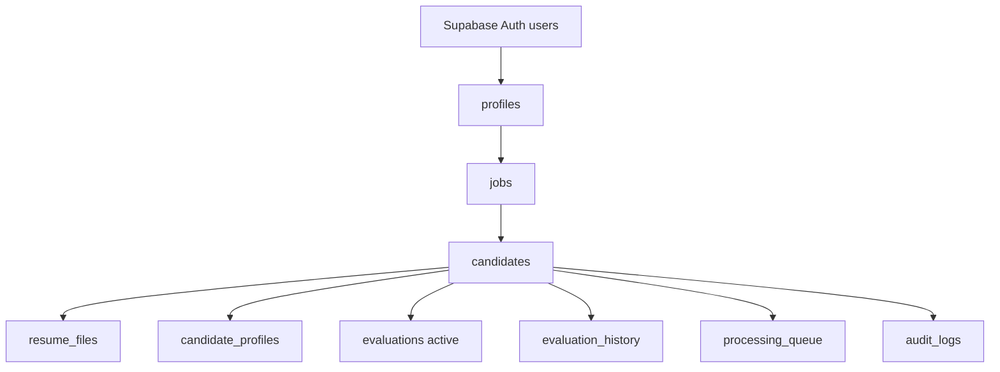
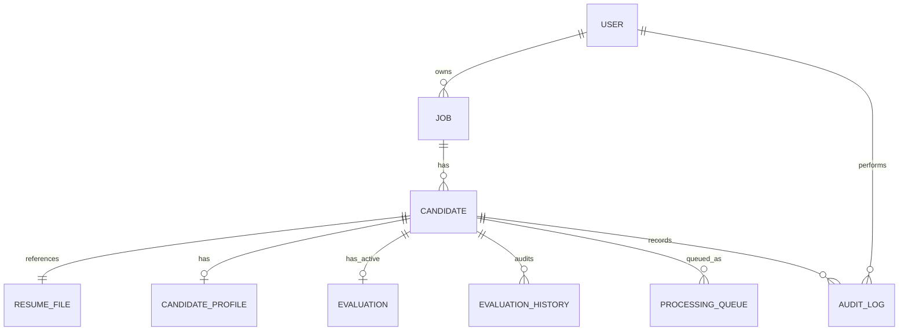
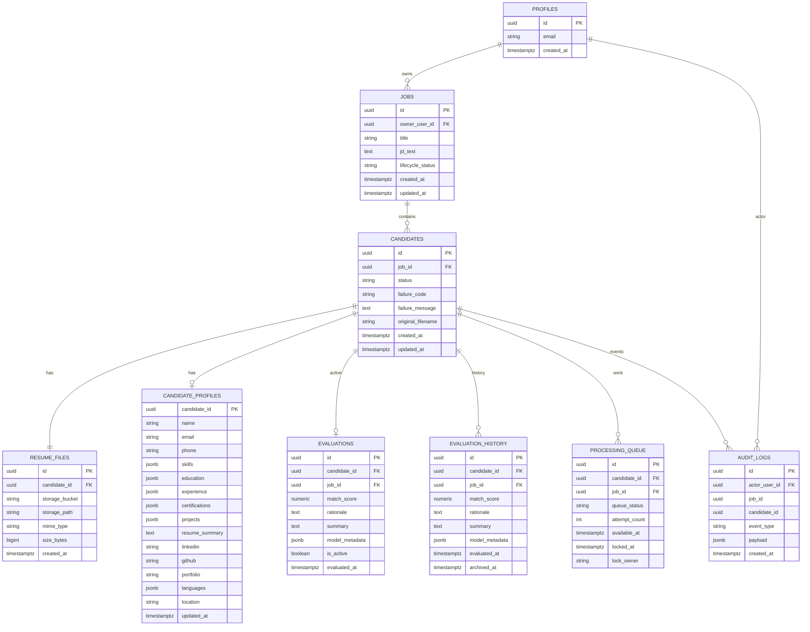
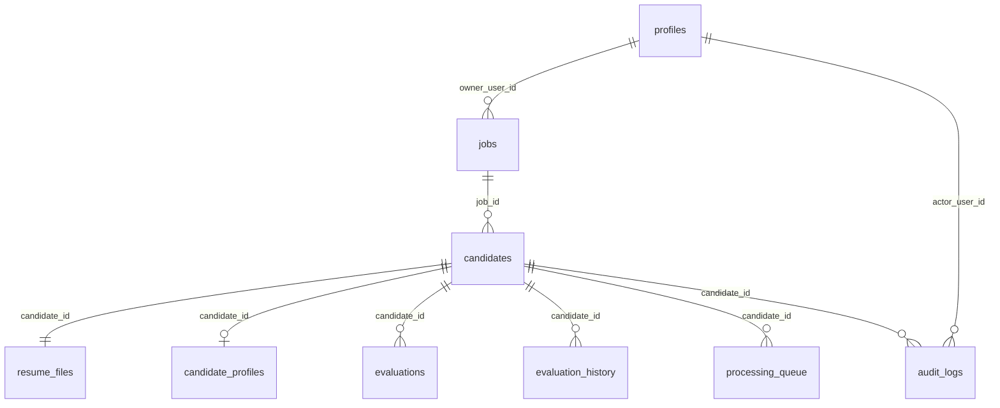
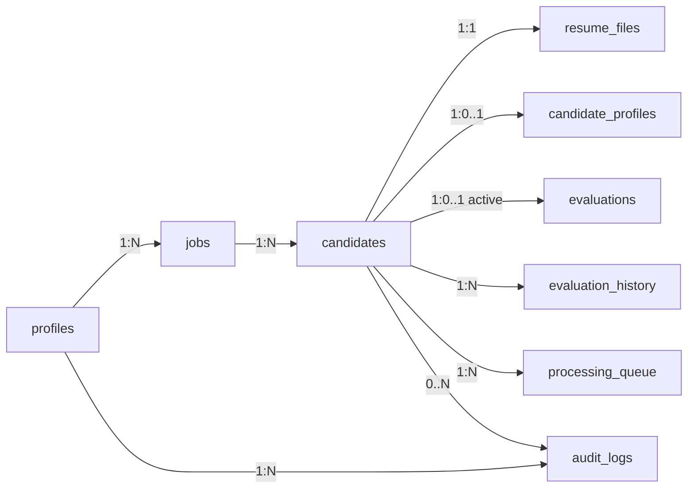
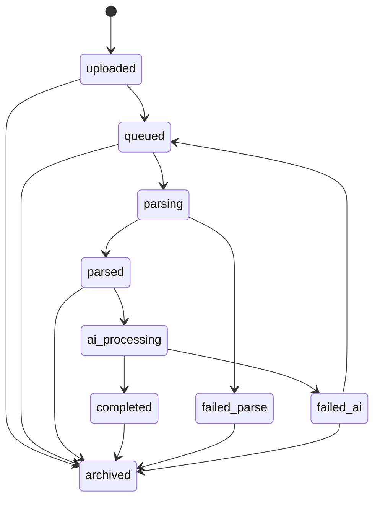
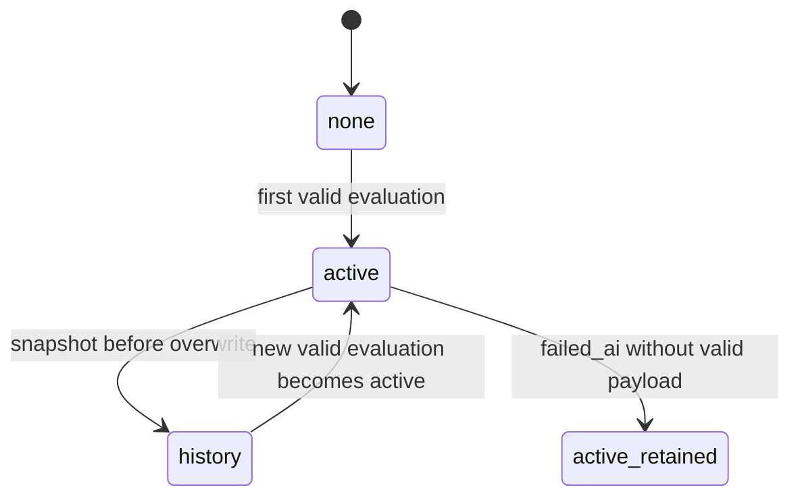
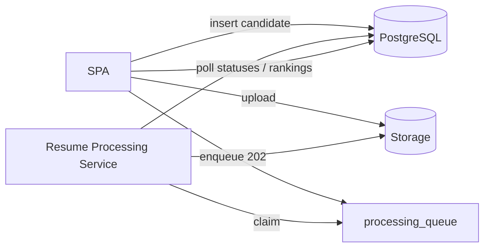

# ResumeRank AI

# Database Design Document (DDD)

**Document 05 — RR-DB-005**

---

## Cover Page

| | |
| --- | --- |
| **Project Name** | ResumeRank AI |
| **Document Title** | Database Design Document |
| **Document Number** | Document 05 |
| **Document ID** | RR-DB-005 |
| **Version** | 1.0.0 |
| **Status** | Baseline — Ready for API Design |
| **Classification** | Internal — MBA Final Year Project |
| **Specialization** | Artificial Intelligence & Data Science |
| **Document Type** | Database Design (PostgreSQL / Supabase) |
| **Author** | Vish Var |
| **Role** | Senior Database Architect / Project Lead |
| **Organization** | ResumeRank AI Development Team |
| **Prepared For** | Development, QA, and Academic Evaluation Teams |
| **Date** | 12 July 2026 |
| **Upstream Dependencies** | RR-ARCH-001 v2.0.0; RR-PRD-002 v1.0.0; RR-SRS-003 v1.1.0; RR-SDD-004 v1.1.0 |
| **Governing Plan** | Documentation Roadmap (RR-DOC-000) |
| **Next Document** | API Design Specification (RR-API-006) |

---

### Document Control Statement

This Database Design Document defines the conceptual, logical, and physical **data design** for ResumeRank AI on PostgreSQL (Supabase), including entities, relationships, lifecycle rules, transaction intent, security concepts, and scalability considerations.

It strictly follows RR-SRS-003 v1.1.0 and RR-SDD-004 v1.1.0. It does **not** invent undocumented product features and does **not** modify business rules BR-01–BR-12.

This is a **design** document: it does not contain `CREATE TABLE` SQL, migrations, or Supabase policy code. Those belong to implementation.

---

## Version History

| Version | Date | Author | Description of Change | Review Status |
| --- | --- | --- | --- | --- |
| 0.1.0 | 12 July 2026 | Vish Var | Outline from SDD v1.1 data interaction design | Draft |
| 1.0.0 | 12 July 2026 | Vish Var | Complete database design with ER diagrams, entity/table specs, lifecycles, transactions, and DB architecture review | Current |

---

## Table of Contents

1. [Introduction](#1-introduction)
2. [Database Architecture](#2-database-architecture)
3. [Data Model](#3-data-model)
4. [Entity Design](#4-entity-design)
5. [Table Design](#5-table-design)
6. [Relationship Design](#6-relationship-design)
7. [Data Lifecycle](#7-data-lifecycle)
8. [Transaction Design](#8-transaction-design)
9. [Constraints and Validation](#9-constraints-and-validation)
10. [Performance Design](#10-performance-design)
11. [Security Design](#11-security-design)
12. [Backup and Recovery](#12-backup-and-recovery)
13. [Scalability](#13-scalability)
14. [Design Decisions](#14-design-decisions)
15. [Future Enhancements](#15-future-enhancements)
16. [Conclusion](#16-conclusion)
17. [Database Architecture Review](#17-database-architecture-review)
18. [Appendices](#18-appendices)

---

## List of Figures

| Figure | Title | Section |
| --- | --- | --- |
| F-01 | Logical Database Architecture | §2.3 |
| F-02 | Conceptual ER Diagram | §3.1 |
| F-03 | Logical ER Diagram | §3.2 |
| F-04 | Physical ER Diagram | §3.3 |
| F-05 | Relationship Overview | §6.1 |
| F-06 | Candidate Status Lifecycle | §7.2 |
| F-07 | Evaluation Lifecycle | §7.3 |
| F-08 | Database Interaction Flow (Async Screening) | §8.4 |

---

## List of Tables

| Table | Title | Section |
| --- | --- | --- |
| T-01 | Entity inventory | §4.1 |
| T-02 | Status enum values | §4.3 |
| T-03 | CE field mapping to profile columns | §5.4 |
| T-04 | Relationship cardinality summary | §6.2 |
| T-05 | Cascade / delete behavior | §6.3 |
| T-06 | Database design decisions | §14 |
| T-07 | Architecture review findings | §17 |

---

## References

| ID | Reference |
| --- | --- |
| REF-01 | RR-DOC-000 Documentation Roadmap |
| REF-02 | RR-ARCH-001 Project Architecture v2.0.0 |
| REF-03 | RR-PRD-002 Product Requirements Document v1.0.0 |
| REF-04 | RR-SRS-003 Software Requirements Specification v1.1.0 |
| REF-05 | RR-SDD-004 System Design Document v1.1.0 |
| REF-06 | PostgreSQL documentation — data types, integrity, concurrency concepts |
| REF-07 | Supabase documentation — Auth, Database, Storage, RLS concepts |

---

## 1. Introduction

### 1.1 Purpose

Define a production-oriented database design for ResumeRank AI that stores jobs, resumes, candidates, extracted profiles, AI evaluations, audit history, and async processing work while enforcing ownership, integrity, and the SDD v1.1 asynchronous screening model.

### 1.2 Scope

**In scope:** PostgreSQL logical/physical design intent for application data; Supabase Auth identity linkage; Storage object metadata references; conceptual RLS; queue persistence for Resume Processing Service; evaluation audit history.

**Out of scope:** SQL DDL/migrations, concrete RLS policy SQL, Storage policy SQL, API contracts (RR-API-006), prompt text (RR-AI-008), UI schemas (RR-UIX-007).

### 1.3 Objectives

| Objective | Database Response |
| --- | --- |
| Support async 202 screening | Candidate statuses + processing queue |
| One active evaluation per candidate | Active evaluation entity + uniqueness rule |
| Explainable AI auditability | Evaluation history snapshots |
| Owner isolation | `owner_user_id` + RLS concepts |
| Archive-first job policy | Job lifecycle + constrained hard delete |
| Structured extraction | Candidate profile entity (CE-01–CE-14) |

### 1.4 Database Overview

| Item | Choice |
| --- | --- |
| DBMS | PostgreSQL (Supabase-managed) |
| Identity | Supabase Auth (`auth.users`) + application `profiles` |
| Files | Supabase Storage; DB stores paths/metadata only |
| Processing | DB-backed processing queue claimed by Resume Processing Service |
| Analytics | Queries/aggregates over owner-scoped tables (views optional at implementation) |

### 1.5 Supported Business Processes

| Process | Primary Entities |
| --- | --- |
| Authenticate HR user | profiles ↔ auth.users |
| Create/manage/archive/delete jobs | jobs |
| Upload resumes (compensate orphans) | resume_files, candidates, storage |
| Async AI screening | processing_queue, candidates, evaluations |
| Rank candidates | evaluations (active), candidates |
| View profiles/summaries | candidate_profiles, evaluations |
| Analytics | jobs, candidates, evaluations aggregates |
| Retry failed AI | candidates, processing_queue, evaluation_history |

### 1.6 Design Assumptions

| ID | Assumption |
| --- | --- |
| AS-DB-01 | One HR user owns their jobs/candidates in v1 (no org multi-tenancy) |
| AS-DB-02 | Resume binaries live in private Storage, not bytea columns |
| AS-DB-03 | Resume Processing Service can read/write with least-privilege credentials and ownership checks |
| AS-DB-04 | Queue is persisted in PostgreSQL for v1 simplicity (external broker optional later) |
| AS-DB-05 | English-first text; UTF-8 storage |

### 1.7 Constraints

| ID | Constraint | Source |
| --- | --- | --- |
| CO-DB-01 | Stack fixed to PostgreSQL/Supabase | Architecture / SRS |
| CO-DB-02 | PDF/DOCX only; private storage | SRS BR-06, FR-13 |
| CO-DB-03 | No auto-reject/hire side effects in schema | BR-02 |
| CO-DB-04 | Hard delete job only when zero candidates | SRS-FR-047 |
| CO-DB-05 | Match score numeric 0–100 when completed | SRS-FR-019 |
| CO-DB-06 | Status set per SDD v1.1 lifecycle | SDD §6.7 |

---

## 2. Database Architecture

### 2.1 Database Type

Relational **PostgreSQL** as system of record for structured screening data.

### 2.2 Supabase Architecture Role

| Supabase Capability | Database Design Use |
| --- | --- |
| Auth | Canonical user identity (`auth.users.id`) |
| PostgreSQL | Application schema, constraints, RLS |
| Storage | Resume object blobs; DB holds references |
| (Optional) Realtime | Not required for v1; polling is primary per SDD |

### 2.3 Logical Database Architecture

### 2.4 Physical Database Architecture (Intent)

| Layer | Intent |
| --- | --- |
| Schema | Single application schema (e.g., `public`) plus `auth` |
| Storage | Private bucket for resumes; path convention documented conceptually |
| Compute | SPA reads via PostgREST; processor claims queue rows |
| Backups | Platform-managed PostgreSQL backups (see §12) |

Exact tablespaces, partitions, and SQL indexes are **implementation notes** for development (not frozen here beyond conceptual needs).

### 2.5 Normalization Strategy

| Level | Approach |
| --- | --- |
| Target | 3NF for core transactional entities |
| Controlled denormalization | JSONB arrays for skills/education/experience/projects (semi-structured resume facts); analytics counts computed not stored |
| Rationale | Avoid exploding education/experience into many tables for v1 while keeping jobs/candidates/evaluations normalized |

### 2.6 Referential Integrity

All child rows reference parents via foreign keys. Candidates require jobs; evaluations/history/profiles/files/queue items require candidates. Job hard delete blocked when candidates exist (application + constraint strategy).

### 2.7 Data Consistency

| Concern | Approach |
| --- | --- |
| Active evaluation | At most one active evaluation per candidate |
| Status vs evaluation | `completed` only when active evaluation satisfies score/rationale/summary rules |
| Upload compensation | DB design supports delete of resume_files metadata when storage compensate occurs |
| Async processing | Queue + status fields are source of truth for progress |

### 2.8 Scalability and Maintainability

Owner-scoped access paths; status and job_id filtering; append-only history growth; archive to reduce active working set. Clear entity boundaries map 1:1 to SDD modules.

---

## 3. Data Model

### 3.1 Conceptual Model

Business concepts: **User** owns **Jobs**; each Job has many **Candidates**; each Candidate has one **Resume File**, optional **Candidate Profile**, at most one **Active Evaluation**, many **Evaluation History** snapshots, zero-or-more **Queue** work items, and **Audit Log** entries.

### 3.2 Logical Model

Entities with keys and major attributes (types conceptual):

### 3.3 Physical Model

Physical PostgreSQL mapping intent (no DDL):

| Logical Entity | Physical Table | Notes |
| --- | --- | --- |
| User profile | `profiles` | PK = `auth.users.id` |
| Job | `jobs` | Soft archive via `lifecycle_status` |
| Candidate | `candidates` | Status enum per SDD §6.7 |
| Resume file | `resume_files` | 1:1 with candidate in v1 |
| Candidate profile | `candidate_profiles` | PK = `candidate_id` |
| Active evaluation | `evaluations` where `is_active = true` | Enforce one active per candidate at implementation |
| Evaluation history | `evaluation_history` | Append-only snapshots |
| Processing queue | `processing_queue` | Claim/lock fields for workers |
| Audit logs | `audit_logs` | Operational screening/audit events |

---

## 4. Entity Design

### 4.1 Entity Inventory

| Entity | Required By | Justification |
| --- | --- | --- |
| Users / profiles | SRS Auth | Identity + ownership |
| Jobs | SRS SF-02 | Job openings + JD |
| Candidates | SRS SF-03/08 | Screening subject + status |
| Candidate Profiles | SRS-FR-048–050 | CE extraction |
| Evaluations | SRS SF-05/06 | Active score/summary |
| Resume Files | SRS-FR-013 | Storage metadata |
| Audit Logs | SDD logging / NFR-017 | Operational audit trail |
| Evaluation History | SRS-FR-053 | Overwrite audit |
| Processing Queue | SDD v1.1 async | HTTP 202 / worker claim |

### 4.2 Users / Profiles

| Field | Content |
| --- | --- |
| Purpose | Represent authenticated HR user in application schema |
| Description | Mirrors Supabase Auth user; stores displayable profile fields as needed |
| Primary Key | `id` (UUID) = `auth.users.id` |
| Foreign Keys | Logical FK to `auth.users` |
| Relationships | 1:N jobs; 1:N audit_logs as actor |
| Business Rules | BR-01, BR-09 |
| Lifecycle | Created on sign-up; retained while account exists |
| Validation | Email uniqueness governed by Auth |

### 4.3 Jobs

| Field | Content |
| --- | --- |
| Purpose | Job opening with JD text |
| Description | Screening scope container |
| Primary Key | `id` UUID |
| Foreign Keys | `owner_user_id` → profiles |
| Relationships | 1:N candidates |
| Business Rules | BR-07, BR-11; VR-01, VR-02, VR-05; SRS-FR-046/047 |
| Lifecycle | `active` → `archived`; hard delete only if no candidates |
| Validation | Non-empty title and jd_text |

**Job lifecycle_status:** `active` \| `archived`

### 4.4 Candidates

| Field | Content |
| --- | --- |
| Purpose | One uploaded resume under a job |
| Description | Tracks screening status and failure info |
| Primary Key | `id` UUID |
| Foreign Keys | `job_id` → jobs |
| Relationships | 1:1 resume_files; 0..1 profile; 0..1 active evaluation; 0..N history/queue/audits |
| Business Rules | BR-04, BR-06, BR-08; status lifecycle SDD §6.7 |
| Lifecycle | See §7.2 |
| Validation | Status ∈ allowed enum; failure fields when failed_* |

**Candidate status enum (SDD v1.1) — Table T-02:**

| Status | Meaning |
| --- | --- |
| `uploaded` | Candidate row persisted; not yet queued |
| `queued` | Work item accepted for async processing |
| `parsing` | Text extraction in progress |
| `parsed` | Text extraction succeeded |
| `ai_processing` | Gemini evaluation in progress |
| `completed` | Valid active evaluation persisted |
| `failed_parse` | Parse failed; inspectable |
| `failed_ai` | AI/validation failed; prior active retained if any |
| `archived` | Out of active working set |

### 4.5 Candidate Profiles

| Field | Content |
| --- | --- |
| Purpose | Persist structured extraction CE-01–CE-14 |
| Description | Assistive HR-facing profile; sparse fields allowed |
| Primary Key | `candidate_id` |
| Foreign Keys | `candidate_id` → candidates |
| Relationships | 1:1 with candidate |
| Business Rules | CE-R1–R3; SRS-FR-048–050 |
| Lifecycle | Upserted during AI pipeline; retained with candidate |
| Validation | Types per field; null/empty allowed if absent |

### 4.6 Evaluations (Active)

| Field | Content |
| --- | --- |
| Purpose | Current AI result for ranking |
| Description | Score, rationale, summary, model metadata |
| Primary Key | `id` UUID |
| Foreign Keys | `candidate_id`, `job_id` |
| Relationships | N:1 candidate; logically at most one `is_active=true` per candidate |
| Business Rules | BR-03, BR-12; SRS-FR-019–023, 051–052 |
| Lifecycle | Created/updated on successful validation; prior copied to history before overwrite |
| Validation | If active and candidate `completed`: score 0–100 numeric; rationale/summary non-empty |

**failed_ai policy (SDD):** If no valid score payload, **do not** fabricate evaluation; retain prior active if any; set candidate `failed_ai`.

### 4.7 Evaluation History (Audit of Evaluations)

| Field | Content |
| --- | --- |
| Purpose | Retain previous active evaluations |
| Description | Append-only snapshot on overwrite |
| Primary Key | `id` UUID |
| Foreign Keys | `candidate_id`, `job_id` |
| Relationships | N:1 candidate |
| Business Rules | SRS-FR-053; BR-12 |
| Lifecycle | Insert-only; no updates in v1 |
| Validation | Snapshot fields copied from prior active |

### 4.8 Resume Files

| Field | Content |
| --- | --- |
| Purpose | Metadata for private Storage object |
| Description | Path, MIME, size; enables compensation deletes |
| Primary Key | `id` UUID |
| Foreign Keys | `candidate_id` → candidates (1:1 in v1) |
| Relationships | 1:1 candidate |
| Business Rules | SRS-FR-011–013; private bucket |
| Lifecycle | Created on successful upload; deleted if compensation requires; retained with candidate otherwise |
| Validation | MIME PDF/DOCX; size within configured max |

### 4.9 Processing Queue

| Field | Content |
| --- | --- |
| Purpose | Persist async work for Resume Processing Service |
| Description | Enqueued on 202 accept; claimed by workers |
| Primary Key | `id` UUID |
| Foreign Keys | `candidate_id`, `job_id` |
| Relationships | N:1 candidate (typically one open item) |
| Business Rules | Supports ST-01/ST-02; idempotent claim |
| Lifecycle | `pending` → `locked`/`in_progress` → `done`/`dead` |
| Validation | Candidate must be processable; job active |

**Justification:** Required by SDD v1.1 async architecture (not optional for 202 model).

### 4.10 Audit Logs

| Field | Content |
| --- | --- |
| Purpose | Operational audit of significant screening events |
| Description | Actor, entity refs, event type, payload |
| Primary Key | `id` UUID |
| Foreign Keys | `actor_user_id` → profiles; optional job/candidate refs |
| Relationships | N:1 user; optional N:1 job/candidate |
| Business Rules | Supports NFR-017 operational diagnosability alongside evaluation_history |
| Lifecycle | Append-only |
| Validation | event_type controlled vocabulary (implementation-defined list) |

---

## 5. Table Design

Column-level definitions below are design specifications (not SQL).

### 5.1 `profiles`

| Column | Type (conceptual) | Nullable | Default | Notes |
| --- | --- | --- | --- | --- |
| id | UUID | No | — | = auth user id |
| email | Text | No | — | Denormalized from Auth for convenience |
| full_name | Text | Yes | null | Optional |
| created_at | Timestamptz | No | now | |
| updated_at | Timestamptz | No | now | |

**Constraints:** PK(id).  
**Retention:** Account lifetime.  
**Soft delete:** None in v1.

### 5.2 `jobs`

| Column | Type | Nullable | Default | Notes |
| --- | --- | --- | --- | --- |
| id | UUID | No | generated | |
| owner_user_id | UUID | No | — | FK profiles |
| title | Text | No | — | VR-01 |
| jd_text | Text | No | — | VR-02 |
| lifecycle_status | Text/Enum | No | `active` | `active`\|`archived` |
| created_at | Timestamptz | No | now | |
| updated_at | Timestamptz | No | now | |

**Constraints:** PK; FK owner; check lifecycle_status.  
**Unique rules:** None beyond PK.  
**Soft delete:** Archive via lifecycle_status.  
**Hard delete:** Only when candidate count = 0.  
**Conceptual indexes:** (owner_user_id, lifecycle_status, created_at desc).

### 5.3 `candidates`

| Column | Type | Nullable | Default | Notes |
| --- | --- | --- | --- | --- |
| id | UUID | No | generated | |
| job_id | UUID | No | — | FK jobs |
| status | Text/Enum | No | `uploaded` | SDD lifecycle |
| failure_code | Text | Yes | null | EH category / code |
| failure_message | Text | Yes | null | Safe user-facing text |
| original_filename | Text | No | — | |
| created_at | Timestamptz | No | now | |
| updated_at | Timestamptz | No | now | |

**Constraints:** PK; FK job; check status ∈ enum.  
**Conceptual indexes:** (job_id, status); (job_id, created_at).  
**Soft delete strategy:** No soft-delete column; archival is status-based (`archived`).  
**Retention:** Retain failures for inspectability (SRS-NFR-008).

### 5.4 `candidate_profiles`

| Column | Type | Nullable | Default | CE |
| --- | --- | --- | --- | --- |
| candidate_id | UUID | No | — | PK/FK |
| name | Text | Yes | null | CE-01 |
| email | Text | Yes | null | CE-02 |
| phone | Text | Yes | null | CE-03 |
| skills | JSON/JSONB | Yes | null | CE-04 |
| education | JSON/JSONB | Yes | null | CE-05 |
| experience | JSON/JSONB | Yes | null | CE-06 |
| certifications | JSON/JSONB | Yes | null | CE-07 |
| projects | JSON/JSONB | Yes | null | CE-08 |
| resume_summary | Text | Yes | null | CE-09 |
| linkedin | Text | Yes | null | CE-10 |
| github | Text | Yes | null | CE-11 |
| portfolio | Text | Yes | null | CE-12 |
| languages | JSON/JSONB | Yes | null | CE-13 |
| location | Text | Yes | null | CE-14 |
| updated_at | Timestamptz | No | now | |

**Constraints:** PK candidate_id; FK cascade with candidate policy per §6.  
**Retention:** With candidate.

### 5.5 `resume_files`

| Column | Type | Nullable | Default | Notes |
| --- | --- | --- | --- | --- |
| id | UUID | No | generated | |
| candidate_id | UUID | No | — | Unique in v1 (1:1) |
| storage_bucket | Text | No | — | Private bucket name |
| storage_path | Text | No | — | Object key |
| mime_type | Text | No | — | PDF/DOCX family |
| size_bytes | Integer | No | — | |
| checksum | Text | Yes | null | Optional integrity aid |
| created_at | Timestamptz | No | now | |

**Constraints:** PK; FK candidate; unique(candidate_id) in v1.  
**Conceptual indexes:** (storage_path) unique recommended at implementation.  
**Retention:** With candidate; removable during upload compensation before candidate commit.

**Path convention (conceptual):** `{owner_user_id}/{job_id}/{candidate_id}/{filename}` — exact policy SQL deferred to implementation.

### 5.6 `evaluations`

| Column | Type | Nullable | Default | Notes |
| --- | --- | --- | --- | --- |
| id | UUID | No | generated | |
| candidate_id | UUID | No | — | FK |
| job_id | UUID | No | — | FK denormalized for query convenience |
| match_score | Numeric | Yes | null | Required when completed/active valid |
| rationale | Text | Yes | null | |
| summary | Text | Yes | null | |
| model_metadata | JSON/JSONB | Yes | null | model id, prompt_version, timings |
| is_active | Boolean | No | true | One active per candidate |
| evaluated_at | Timestamptz | No | now | |

**Constraints:** PK; FKs; check score null or between 0 and 100.  
**Unique rule (conceptual):** at most one row with `is_active=true` per `candidate_id` (implementation: partial unique index or dedicated active table — choose in implementation; design requires the invariant).  
**Retention:** Active row retained; prior versions moved to history.

### 5.7 `evaluation_history`

| Column | Type | Nullable | Default | Notes |
| --- | --- | --- | --- | --- |
| id | UUID | No | generated | |
| candidate_id | UUID | No | — | |
| job_id | UUID | No | — | |
| match_score | Numeric | Yes | null | Snapshot |
| rationale | Text | Yes | null | |
| summary | Text | Yes | null | |
| model_metadata | JSON/JSONB | Yes | null | |
| evaluated_at | Timestamptz | No | — | Original eval time |
| archived_at | Timestamptz | No | now | Snapshot time |

**Constraints:** PK; FKs; append-only.  
**Conceptual indexes:** (candidate_id, archived_at desc).  
**Retention:** Long-lived academic/audit retention.

### 5.8 `processing_queue`

| Column | Type | Nullable | Default | Notes |
| --- | --- | --- | --- | --- |
| id | UUID | No | generated | |
| candidate_id | UUID | No | — | |
| job_id | UUID | No | — | |
| queue_status | Text/Enum | No | `pending` | pending\|locked\|done\|dead |
| attempt_count | Integer | No | 0 | |
| available_at | Timestamptz | No | now | Visibility timeout support |
| locked_at | Timestamptz | Yes | null | |
| lock_owner | Text | Yes | null | Worker id |
| last_error | Text | Yes | null | |
| created_at | Timestamptz | No | now | |
| updated_at | Timestamptz | No | now | |

**Constraints:** PK; FKs.  
**Conceptual indexes:** (queue_status, available_at) for claim; (candidate_id).  
**Idempotency:** Prefer single open (`pending`/`locked`) item per candidate at implementation.

### 5.9 `audit_logs`

| Column | Type | Nullable | Default | Notes |
| --- | --- | --- | --- | --- |
| id | UUID | No | generated | |
| actor_user_id | UUID | Yes | null | System events may be null |
| job_id | UUID | Yes | null | |
| candidate_id | UUID | Yes | null | |
| event_type | Text | No | — | e.g., upload_accepted, enqueue, status_change |
| payload | JSON/JSONB | Yes | null | Non-secret context |
| created_at | Timestamptz | No | now | |

**Constraints:** PK; optional FKs.  
**Retention:** Align with academic demo needs; purge policy future.  
**Soft delete:** None (append-only).

---

## 6. Relationship Design

### 6.1 Relationship Overview

### 6.2 Cardinality Summary

| Parent | Child | Cardinality | Type |
| --- | --- | --- | --- |
| profiles | jobs | 1:N | One-to-Many |
| jobs | candidates | 1:N | One-to-Many |
| candidates | resume_files | 1:1 | One-to-One |
| candidates | candidate_profiles | 1:0..1 | One-to-One optional |
| candidates | evaluations (active) | 1:0..1 | One-to-One optional |
| candidates | evaluation_history | 1:N | One-to-Many |
| candidates | processing_queue | 1:N | One-to-Many |
| profiles | audit_logs | 1:N | One-to-Many |

### 6.3 Cascade and Delete Behavior

| Relationship | On Delete Intent | Rationale |
| --- | --- | --- |
| jobs → candidates | **Restrict** hard delete if children exist | SRS-FR-047 |
| candidates → resume_files | Cascade when candidate removed (rare in v1) | Metadata follows candidate |
| candidates → candidate_profiles | Cascade | Profile useless without candidate |
| candidates → evaluations | Cascade or restrict+manual | Prefer cascade with history retained first |
| candidates → evaluation_history | Restrict or cascade | Prefer **retain history**; if candidate removed, cascade only in controlled purge |
| candidates → processing_queue | Cascade | Clear work items |
| profiles → jobs | Restrict | Do not orphan ownership silently |

**Archive behavior:** Prefer status/lifecycle updates over physical deletes.

---

## 7. Data Lifecycle

### 7.1 Jobs

| Phase | Behavior |
| --- | --- |
| Creation | Insert `active` with title + jd_text |
| Update | Title/JD editable while active (Should) |
| Archive | `lifecycle_status=archived`; block uploads/new processing |
| Retention | Retained for demo/audit |
| Deletion | Hard delete only if zero candidates |
| Recovery | Unarchive optional/future |

### 7.2 Candidates

| Phase | Behavior |
| --- | --- |
| Creation | `uploaded` after storage+DB commit |
| Update | Status transitions by processor; failure_code set on failures |
| Archive | `archived` when job/candidate archived |
| Retention | Keep failed rows inspectable |
| Deletion | Not required in v1 product flows |
| Recovery | Retry from `failed_ai`; re-upload new candidate for `failed_parse` |

### 7.3 Evaluations

| Phase | Behavior |
| --- | --- |
| Creation | Insert/upsert active on validated AI success |
| Update | Overwrite active only after history snapshot |
| Archive | History rows immutable |
| Retention | Active + history for audit/MBA |
| Deletion | Not in v1 happy path |
| Recovery | Prior active remains on failed_ai without valid score |

### 7.4 Resume Files

| Phase | Behavior |
| --- | --- |
| Creation | After successful Storage upload |
| Compensation | Delete Storage object if DB candidate insert fails; remove metadata if created early |
| Retention | With candidate |
| Deletion | Compensation or controlled purge |

### 7.5 Audit Logs / History

| Store | Lifecycle |
| --- | --- |
| audit_logs | Append-only operational events |
| evaluation_history | Append-only evaluation snapshots |

---

## 8. Transaction Design

### 8.1 Create Job

| Item | Design |
| --- | --- |
| Boundary | Single insert into `jobs` |
| Consistency | owner_user_id = auth user |
| Failure | Validation error; no partial row |
| Idempotency | Client may retry create (new id) — acceptable |

### 8.2 Upload Resume + Create Candidate (with Compensation)

| Step | Action |
| --- | --- |
| 1 | Validate file |
| 2 | Upload Storage object |
| 3 | Insert `candidates` (`uploaded`) + `resume_files` |
| 4 | On DB failure after Storage success → **delete Storage object** |
| 5 | Enqueue `processing_queue`; set status `queued` |
| 6 | Return **HTTP 202** (API layer) |

Not a single distributed ACID transaction across Storage+DB; **compensation** provides consistency (SDD §6.5.1).

### 8.3 AI Evaluation Processing Unit

| Step | Action |
| --- | --- |
| 1 | Claim queue row (lock) |
| 2 | Transition candidate statuses through parsing/AI stages |
| 3 | On valid result: if active exists → insert `evaluation_history` → upsert `evaluations` active + `candidate_profiles` → `completed` |
| 4 | On parse failure → `failed_parse` + failure fields |
| 5 | On AI exhaustion → `failed_ai` + failure fields; retain prior active if invalid payload |
| 6 | Mark queue done/dead |

**Consistency:** Never mark `completed` without validated active evaluation.  
**Idempotency:** Re-claim should no-op if already `completed` unless retry path.

### 8.4 Candidate Ranking / Analytics

Read-only queries: order active evaluations by score; aggregate counts by status/job. No writes.

### 8.5 Status Updates

Processor updates `candidates.status` and optional `audit_logs` event. UI polling reads committed status (SDD §13.1).

---

## 9. Constraints and Validation

### 9.1 Keys and Uniqueness

| Rule | Design |
| --- | --- |
| Primary keys | UUID on all tables |
| FK integrity | All relationships in §6 |
| One active evaluation | Conceptual unique (candidate_id) where is_active |
| One resume file per candidate (v1) | Unique candidate_id on resume_files |
| Open queue item | Prefer unique open work per candidate (implementation) |

### 9.2 Check / Business Validations (from SRS)

| Rule | Source |
| --- | --- |
| Job title/JD non-empty | VR-01, VR-02 |
| Screening only on active jobs | VR-05 |
| Status enum set | SDD §6.7 / VR-20 refined |
| Score 0–100 when present | VR-22 / SRS-FR-019 |
| Completed requires rationale+summary | VR-21, VR-23 |
| MIME/size limits | VR-10–VR-12; default max size configured (commonly 5MB) |
| Hard delete empty jobs only | VR-04 / SRS-FR-047 |

### 9.3 Nullability

| Area | Rule |
| --- | --- |
| Profile CE fields | Nullable (sparse extraction) |
| failure_* | Null unless failed_* statuses |
| evaluation score fields | Non-null for completed active evaluations |

### 9.4 Duplicate Prevention

| Concern | Approach |
| --- | --- |
| Duplicate uploads | Allowed as separate candidates (same file may re-upload); no content-hash uniqueness required in v1 |
| Duplicate active evals | Forbidden by uniqueness invariant |
| Duplicate queue storms | Idempotent enqueue/claim design |

---

## 10. Performance Design

### 10.1 Expected Growth (Demo / Early SaaS)

| Entity | Demo scale | Early growth |
| --- | --- | --- |
| Jobs / user | tens | hundreds |
| Candidates / job | ≥20 (Must) | hundreds |
| Evaluation history | grows with retries | linear with re-scores |
| Resume storage | GBs small | rises with uploads |

### 10.2 Indexing Strategy (Conceptual)

Prioritize: owner job lists; candidates by job+status; active evaluations by candidate; history by candidate+time; queue claim by status+available_at. **Physical index DDL deferred to implementation.**

### 10.3 Query Optimization Principles

Select only needed columns for tables; filter by owner via RLS; paginate candidate lists; compute analytics via aggregation queries (materialized views optional later).

### 10.4 Pagination, Filtering, Sorting

| Need | Design Support |
| --- | --- |
| Pagination | Keyset/offset on candidates.created_at / score joins |
| Filtering | status, job_id |
| Sorting | match_score desc for completed |
| Batch processing | Queue claim in chunks (chunk size = implementation config) |

### 10.5 Partitioning (Future)

Consider partitioning `evaluation_history` / `audit_logs` by time when volume warrants — not required for v1.

---

## 11. Security Design

Conceptual only — **no policy SQL** in this document.

| Topic | Design |
| --- | --- |
| Authentication | Supabase Auth; `auth.uid()` ties to `profiles.id` / `jobs.owner_user_id` |
| Authorization | Owner-based access to jobs and descendant rows |
| RLS (conceptual) | Enable on jobs, candidates, profiles, evaluations, history, resume_files, queue, audit_logs; policies restrict to owner via job ownership join or owner_user_id |
| Processor access | Least-privilege role; must re-validate ownership before writes |
| PII | Resumes + extracted email/phone/name treated as sensitive; private storage; no public URLs |
| Encryption at rest | Platform-managed PostgreSQL/Storage encryption |
| Secure storage references | Store paths only; bucket private |
| Audit | evaluation_history + audit_logs retained for academic/operational review |

---

## 12. Backup and Recovery

| Topic | Approach |
| --- | --- |
| Backups | Use Supabase/PostgreSQL automated backups |
| PITR | Rely on platform point-in-time recovery where plan allows |
| Disaster recovery | Restore project from backup; redeploy processor/SPA |
| Consistency | Prefer restore DB + reconcile Storage orphans via path audit jobs |
| Retention | Follow platform backup retention; application data retained for project duration |

---

## 13. Scalability

| Dimension | v1 Strategy | Future |
| --- | --- | --- |
| Many candidates | Status indexes; pagination; async queue | Partitioning |
| Resume storage growth | Object storage; archive jobs | Lifecycle policies |
| AI evaluation history | Append-only table | Time partitions / cold storage |
| Analytics growth | On-read aggregates | Materialized views |
| Multi-tenant | Single-owner model | org_id + RLS redesign (FS-02) |

---

## 14. Design Decisions

| ID | Decision | Reason | Alternative | Trade-offs |
| --- | --- | --- | --- | --- |
| DBD-01 | DB-backed `processing_queue` | Fits SDD async 202 without new infra | External Redis/SQS | Simpler ops vs less throughput |
| DBD-02 | `evaluations` + `evaluation_history` | Clear active vs audit | Single table versions only | Extra table; clearer reads |
| DBD-03 | Separate `resume_files` | Compensation + metadata clarity | Path columns only on candidates | Slight join cost |
| DBD-04 | JSONB for CE list fields | Flexible resume structure | Fully normalized child tables | Weaker relational queries |
| DBD-05 | Refined candidate status enum | SDD observability | Coarse pending/processing | More transitions to enforce |
| DBD-06 | `failed_parse` retained | SRS-FR-016 business requirement | Fold into generic failed | Keeps SRS alignment |
| DBD-07 | Restrict job hard delete | SRS-FR-047 | Cascade delete all | Safer demos |
| DBD-08 | Defer physical index/policy SQL | Design vs implementation split | Freeze SQL now | Avoid premature lock-in |

---

## 15. Future Enhancements

| Enhancement | Data Impact |
| --- | --- |
| Interview scheduling | New entities (interviews, slots) |
| Email notifications | Outbox/notification tables |
| Multi-company support | organizations, memberships, RLS rewrite |
| Advanced analytics | events warehouse / materialized facts |
| Resume versioning | N:1 resume_files versions per candidate |
| Skill taxonomy | normalized skills dictionary |
| Historical AI models | model registry linked from metadata |

---

## 16. Conclusion

This database design operationalizes ResumeRank AI’s approved architecture and requirements:

| Upstream | How DB Supports It |
| --- | --- |
| Architecture | PostgreSQL + Storage + Auth; owner isolation |
| PRD | Jobs, uploads, ranking, analytics, human-in-the-loop data only |
| SRS v1.1 | Extraction fields, archive/delete, evaluation audit, validations |
| SDD v1.1 | Async queue, refined statuses, compensation-friendly resume metadata, polling-friendly status fields |

It is the baseline for **API Design Specification (RR-API-006)**.

---

## 17. Database Architecture Review

| Issue | Severity | Recommendation | Affected Section |
| --- | --- | --- | --- |
| One-active evaluation uniqueness is specified conceptually but physical enforcement pattern still open | **Major** | In implementation, choose partial unique index on `evaluations(candidate_id) WHERE is_active` **or** dedicated active table; add automated test | §5.6, DBD-02 |
| `job_id` denormalized on evaluations/history/queue can drift if candidate moved (not allowed today) | **Minor** | Keep immutability rule: candidates never change job_id; document invariant | §5.6–5.8 |
| JSONB CE structures lack formal JSON schemas in this design doc | **Major** | Define JSON shapes in API/AI docs or a short appendix before coding extractors | §5.4 |
| DB queue may contend under high concurrency | **Minor** | Use `FOR UPDATE SKIP LOCKED` claim pattern at implementation; monitor | §5.8, §10 |
| audit_logs vs evaluation_history overlap may confuse implementers | **Minor** | Keep evaluation_history for score snapshots only; audit_logs for operational events | §4.7, §4.10 |
| Storage path convention not enforceable in DB alone | **Major** | Enforce in Resume/Storage service + Storage policies during implementation | §5.5, §11 |
| No explicit purge job for academic end-of-life | **Minor** | Accept for v1; add retention runbook later | §7, §12 |
| Multi-tenant future requires invasive RLS changes | **Minor** | Accepted; documented in §13/§15 | §13 |
| Referential delete for history vs GDPR-style erase not fully specified | **Minor** | v1 archive-first; document erase as future controlled cascade | §6.3 |
| Normalization of education/experience deferred via JSONB | **Minor** | Acceptable for v1; revisit if analytics need relational skills graph | §2.5 |

### Review Verdict

**Normalization:** Adequate 3NF core with justified JSONB flexibility.  
**Redundancy:** Controlled (`job_id` denorm, email on profiles).  
**Referential integrity:** Sound with restrict-on-job-delete.  
**Scalability:** Suitable for demo and early SaaS; queue/history growth monitored.  
**Security:** Owner RLS concept aligned; policy SQL deferred correctly.  
**Data integrity:** Status/evaluation invariants clear; compensation supported.  
**Future growth:** Extension points identified without polluting v1 schema.

**Approved as baseline for API Design (RR-API-006)** after treating the Major items as implementation prerequisites (uniqueness enforcement, CE JSON shapes, storage path/policy implementation).

---

## 18. Appendices

### Appendix A — Status Mapping (SRS ↔ SDD/DB)

| SRS Coarse (v1.0 language) | DB / SDD v1.1 Status |
| --- | --- |
| pending | uploaded, queued |
| processing | parsing, parsed, ai_processing |
| completed | completed |
| failed_parse | failed_parse |
| failed_ai | failed_ai |
| (job archive) | candidates may become archived |

### Appendix B — Open Items for API Design (RR-API-006)

| ID | Open Item |
| --- | --- |
| API-01 | Exact `202 Accepted` payload shape for upload/enqueue/retry |
| API-02 | Queue claim is internal — document as non-public API |
| API-03 | Polling endpoints/queries for candidate status aggregates |
| API-04 | Error body mapping to `failure_code` / EH categories |
| API-05 | Idempotency keys for enqueue/retry requests |

### Appendix C — Document Control

| Item | Value |
| --- | --- |
| Path | `docs/02-design/05-Database-Design-Document.md` |
| Version | 1.0.0 |
| Upstream | RR-ARCH-001; RR-PRD-002; RR-SRS-003 v1.1.0; RR-SDD-004 v1.1.0 |
| Next | RR-API-006 API Design Specification |

---

**End of Document — Document 05 — RR-DB-005 — Database Design Document v1.0.0**
