# ResumeRank AI

# API Design Specification (ADS)

**Document 06 — RR-API-006**

---

## Cover Page

| | |
| --- | --- |
| **Project Name** | ResumeRank AI |
| **Document Title** | API Design Specification |
| **Document Number** | Document 06 |
| **Document ID** | RR-API-006 |
| **Version** | 1.1.0 |
| **Status** | Baseline — Ready for UI/UX Design |
| **Supersedes** | RR-API-006 v1.0.0 |
| **Classification** | Internal — MBA Final Year Project |
| **Specialization** | Artificial Intelligence & Data Science |
| **Document Type** | API Design (REST / Supabase / Async Processing) |
| **Author** | Vish Var |
| **Role** | Principal API Architect / Project Lead |
| **Organization** | ResumeRank AI Development Team |
| **Prepared For** | Development, QA, and Academic Evaluation Teams |
| **Date** | 12 July 2026 |
| **Upstream Dependencies** | RR-ARCH-001 v2.0.0; RR-PRD-002 v1.0.0; RR-SRS-003 v1.1.0; RR-SDD-004 v1.1.0; RR-DB-005 v1.1.0 |
| **Governing Plan** | Documentation Roadmap (RR-DOC-000) |
| **Next Document** | UI/UX Design Document (RR-UIX-007) |

---

### Document Control Statement

This API Design Specification defines the **conceptual REST and Supabase API surface** for ResumeRank AI: authentication, job management, resume upload, candidates, asynchronous AI screening, analytics, errors, security, and contracts.

It derives entirely from the approved Architecture, PRD, SRS v1.1, SDD v1.1, and DDD v1.1. It does **not** invent undocumented product features and does **not** modify business rules BR-01–BR-12.

This is a **design** document: it does not contain implementation code, OpenAPI/Swagger YAML, SQL, or Supabase policy SQL. Those belong to development.

---

## Version History

| Version | Date | Author | Description of Change | Review Status |
| --- | --- | --- | --- | --- |
| 0.1.0 | 12 July 2026 | Vish Var | Outline from SDD §8 and DDD Appendix B open items | Draft |
| 1.0.0 | 12 July 2026 | Vish Var | Complete API design: endpoints, async 202 contracts, schemas, diagrams, traceability, and API Architecture Review | Superseded |
| 1.1.0 | 12 July 2026 | Vish Var | Architecture review remediation: frozen upload→explicit screen workflow (no auto-enqueue); screen/retry responsibility split; signed resume access; Idempotency-Key + ErrorObject normalization; ranking model; expanded FR/NFR/UC traceability | Current |

---

## Table of Contents

1. [Introduction](#1-introduction)
2. [API Design Principles](#2-api-design-principles)
3. [API Architecture](#3-api-architecture)
4. [Authentication APIs](#4-authentication-apis)
5. [Job Management APIs](#5-job-management-apis)
6. [Resume Upload APIs](#6-resume-upload-apis)
7. [Candidate APIs](#7-candidate-apis)
8. [AI Processing APIs](#8-ai-processing-apis)
9. [Dashboard & Analytics APIs](#9-dashboard--analytics-apis)
10. [Error Handling](#10-error-handling)
11. [Security](#11-security)
12. [API Versioning](#12-api-versioning)
13. [Performance](#13-performance)
14. [Sequence Diagrams](#14-sequence-diagrams)
15. [API Contracts](#15-api-contracts)
16. [Traceability Matrix](#16-traceability-matrix)
17. [Future APIs](#17-future-apis)
18. [Conclusion](#18-conclusion)
19. [API Architecture Review](#19-api-architecture-review)
20. [Appendices](#20-appendices)

---

## List of Figures

| Figure | Title | Section |
| --- | --- | --- |
| F-01 | API Architecture Overview | §3.1 |
| F-02 | Authentication Flow | §3.3 |
| F-03 | Request Lifecycle | §3.5 |
| F-04 | Upload → Screen Workflow | §6.0 |
| F-05 | Upload Flow Detail | §6.7 |
| F-06 | Async AI Processing | §8.1 |
| F-07 | Sequence — Authentication | §14.1 |
| F-08 | Sequence — Create Job | §14.2 |
| F-09 | Sequence — Resume Upload | §14.3 |
| F-10 | Sequence — AI Screening | §14.4 |
| F-11 | Sequence — Candidate Ranking | §14.5 |
| F-12 | Sequence — Analytics Retrieval | §14.6 |

---

## List of Tables

| Table | Title | Section |
| --- | --- | --- |
| T-01 | API surface inventory | §3.2 |
| T-02 | Authoritative status vocabulary | §1.8 |
| T-03 | Operational defaults (API-relevant) | §13.1 |
| T-04 | Standard error object | §10.1 |
| T-05 | HTTP status mapping | §10.8 |
| T-06 | Traceability matrix | §16 |
| T-07 | API design decisions | §20.A |
| T-08 | Architecture review findings | §19 |

---

## References

| ID | Reference |
| --- | --- |
| REF-01 | RR-DOC-000 Documentation Roadmap |
| REF-02 | RR-ARCH-001 Project Architecture v2.0.0 |
| REF-03 | RR-PRD-002 Product Requirements Document v1.0.0 |
| REF-04 | RR-SRS-003 Software Requirements Specification v1.1.0 |
| REF-05 | RR-SDD-004 System Design Document v1.1.0 |
| REF-06 | RR-DB-005 Database Design Document v1.1.0 |
| REF-07 | Supabase Auth, PostgREST, Storage conceptual documentation |

---

## 1. Introduction

### 1.1 Purpose

Define a production-oriented API design for ResumeRank AI that enables the React SPA to authenticate HR users, manage jobs, upload resumes, observe asynchronous AI screening, rank candidates, and retrieve analytics — while keeping Gemini secrets and privileged processing off the client.

### 1.2 Scope

**In scope:** Conceptual REST/resource contracts; Supabase Auth/PostgREST/Storage interaction patterns; Resume Processing Service enqueue/retry (**HTTP 202**); polling; error model; security; versioning; performance tactics; JSON contracts; traceability.

**Out of scope:** OpenAPI/Swagger generation, client/server source code, SQL/RLS policy SQL, prompt text (RR-AI-008), pixel UI (RR-UIX-007), synchronous screening.

### 1.3 Objectives

| Objective | API Response |
| --- | --- |
| Async-only screening | Explicit **Start Screening** → **202 Accepted** + poll; upload never starts processing |
| Owner isolation | JWT + ownership checks + RLS |
| Human-in-the-loop | No auto-reject/hire; no auto-enqueue after upload (ST-02 not adopted in v1 API) |
| Traceability | Every endpoint maps to PRD/SRS/SDD/DDD |
| Implementability | Aligns to Supabase + Resume Processing Service |

### 1.4 API Overview

ResumeRank AI exposes **three collaborating API surfaces**:

| Surface | Role | Consumer |
| --- | --- | --- |
| **Supabase Auth API** | Sign-up, sign-in, sign-out, session/refresh | SPA |
| **Supabase Data/Storage API** | CRUD/read on tables/views; private resume objects | SPA (JWT + RLS) |
| **Resume Processing Service API** | Enqueue/retry screening (**202**); never exposes Gemini | SPA (JWT); workers internal |

### 1.5 Architecture Context

Derived from RR-ARCH-001 and RR-SDD-004 v1.1: SPA (React/Vite) → Supabase (Auth, PostgreSQL/PostgREST, Storage) + asynchronous Resume Processing Service → Google Gemini (server-only).

### 1.6 Intended Audience

Frontend engineers, backend/processor engineers, QA, academic evaluators, and authors of RR-UIX-007 / RR-DEV-012.

### 1.7 Definitions and Abbreviations

| Term | Definition |
| --- | --- |
| Active evaluation | Sole current evaluation row in `evaluations` for a candidate (DDD §4.6) |
| Authoritative status | Candidate status vocabulary in DDD §4.4.1 |
| Open queue entry | `processing_queue` row with status `pending` or `locked` |
| RLS | Row Level Security |
| RPS | Resume Processing Service |
| ADS | This API Design Specification |
| JWT | JSON Web Token issued by Supabase Auth |

| Abbreviation | Meaning |
| --- | --- |
| SPA | Single-Page Application |
| REST | Representational State Transfer |
| EH | Error Handling category (SRS §18) |
| CE | Candidate Extraction field (CE-01–CE-14) |

### 1.8 Authoritative Status Vocabulary (API)

APIs **expose refined authoritative statuses** (DDD §4.4.1). Optional `status_coarse` may be included for UI labels mapped from Appendix A of DDD.

| Status | Terminal for processing? |
| --- | --- |
| `uploaded` | No |
| `queued` | No |
| `parsing` | No |
| `parsed` | No |
| `ai_processing` | No |
| `completed` | Yes |
| `failed_parse` | Yes |
| `failed_ai` | Yes (retryable) |
| `archived` | Yes for processing |

**Decision API-06 (frozen):** Responses use refined statuses as primary; do not persist SRS-only labels (`pending`/`processing`) as DB/API truth.

---

## 2. API Design Principles

| Principle | Application |
| --- | --- |
| RESTful conventions | Noun resources; standard HTTP verbs; meaningful status codes |
| Resource-oriented design | Jobs, candidates, evaluations, analytics views as resources |
| Idempotency | `Idempotency-Key` required on `/screen` and `/retry`; conceptual replay §8.8 |
| Statelessness | Each request carries JWT; no server session store beyond Auth |
| Consistency | Same field names as DDD entities; same status enum |
| Versioning | URI/header strategy §12; v1 baseline |
| Error standardization | Single error object §10 |
| Security-first | AuthN/AuthZ on every protected call; no secrets in SPA |

---

## 3. API Architecture

### 3.1 Overview

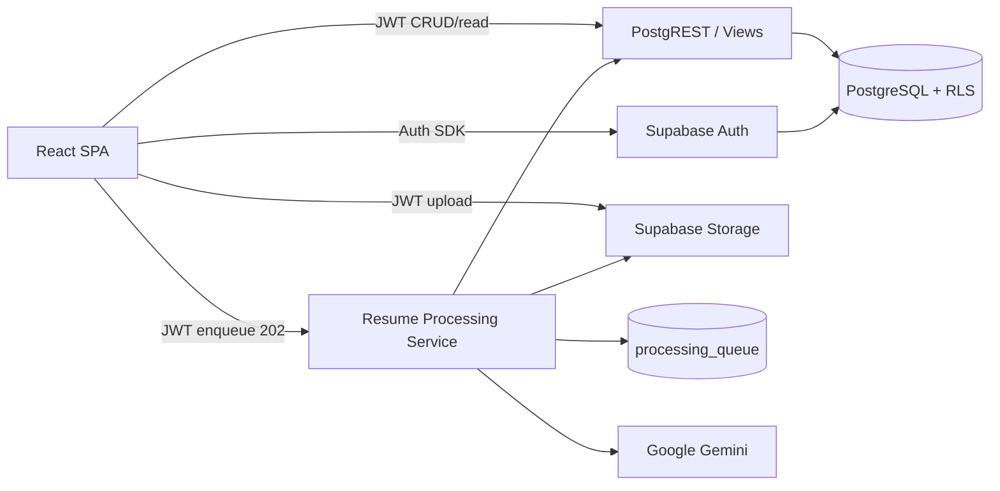

### 3.2 API Surface Inventory (T-01)

| Group | Examples | Style |
| --- | --- | --- |
| Auth | sign-in, sign-out, session, profile | Supabase Auth + `profiles` |
| Jobs | create, update, archive, delete, list, get, progress, search | PostgREST / RPC |
| Uploads | upload, batch upload, metadata, signed resume | Storage + candidates insert (**no enqueue**) |
| Candidates | list, detail, profile, ranking, filters, resume access | PostgREST / views / signed URL |
| AI Processing | `POST /jobs/{job_id}/screen`, `POST /candidates/{id}/retry` | RPS **202** + poll |
| Analytics | dashboard, job analytics, distributions | Views §10.6 DDD |
| Internal | queue claim | **Non-public** (API-02) |

### 3.3 Authentication and Authorization Flow

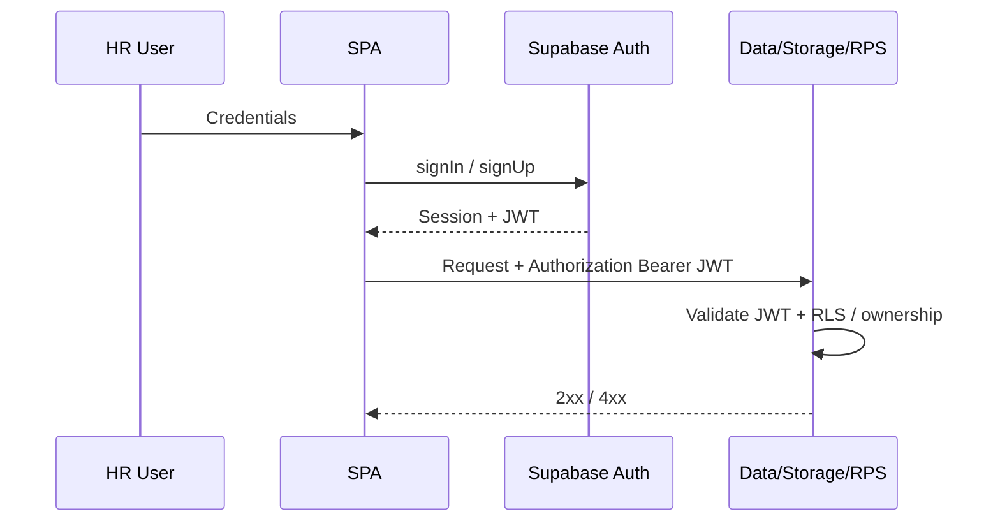

### 3.4 Request / Response Lifecycle

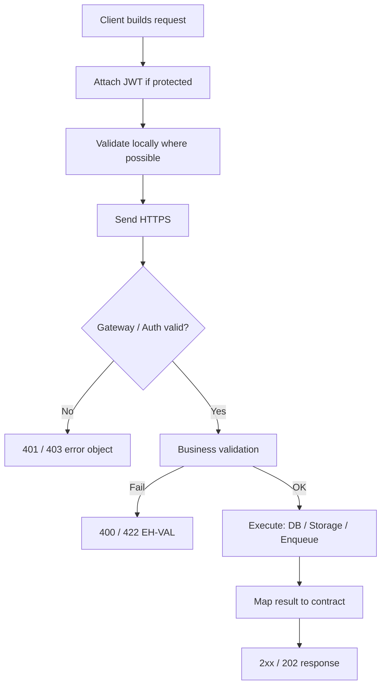

---

## 4. Authentication APIs

Auth operations use **Supabase Auth** (conceptual routes below mirror SDK capabilities; exact vendor paths are implementation details).

### 4.1 Sign Up / Register

| Field | Specification |
| --- | --- |
| Purpose | Create HR user account (SRS-FR-001) |
| Method / Route | `POST /auth/v1/signup` (conceptual) |
| Authentication | None |
| Authorization | Public |
| Headers | `Content-Type: application/json`; anon key as required by platform |
| Request Body | `{ "email": string, "password": string }` |
| Response Body | Session/user object (platform shape) + ensure `profiles` row exists |
| Validation | Valid email; password meets Auth policy |
| Status Codes | `200`/`201` success; `400` validation; `422` policy |
| Business Rules | BR-01 |
| Errors | EH-AUTH, EH-VAL |

### 4.2 Sign In

| Field | Specification |
| --- | --- |
| Purpose | Authenticate existing user (SRS-FR-001) |
| Method / Route | `POST /auth/v1/token?grant_type=password` (conceptual) |
| Authentication | None |
| Request Body | `{ "email": string, "password": string }` |
| Response Body | `{ access_token, refresh_token, expires_in, user }` |
| Status Codes | `200`; `400`/`401` invalid credentials |
| Errors | EH-AUTH |

### 4.3 Sign Out

| Field | Specification |
| --- | --- |
| Purpose | Invalidate client session (SRS-FR-003) |
| Method / Route | `POST /auth/v1/logout` |
| Authentication | JWT required |
| Request Body | Empty / platform default |
| Response Body | Empty success |
| Status Codes | `204`/`200` |
| Business Rules | Subsequent protected calls must fail until re-auth |

### 4.4 Session Validation

| Field | Specification |
| --- | --- |
| Purpose | Determine if session is valid (SRS-FR-002) |
| Method / Route | `GET /auth/v1/user` |
| Authentication | JWT |
| Response Body | User identity or 401 |
| Status Codes | `200`, `401` |

### 4.5 Token Refresh

| Field | Specification |
| --- | --- |
| Purpose | Renew access token |
| Method / Route | `POST /auth/v1/token?grant_type=refresh_token` |
| Request Body | `{ "refresh_token": string }` |
| Response Body | New tokens |
| Status Codes | `200`, `401` |

### 4.6 Profile Retrieval

| Field | Specification |
| --- | --- |
| Purpose | Read application profile (DDD `profiles`) |
| Method / Route | `GET /rest/v1/profiles?id=eq.{auth.uid()}` |
| Authentication | JWT |
| Authorization | Self only (RLS) |
| Response Body | `{ id, email, full_name, created_at, updated_at }` |
| Status Codes | `200`, `401`, `404` |

---

## 5. Job Management APIs

All job APIs require JWT. Ownership enforced via `owner_user_id = auth.uid()` (BR-09).

### 5.1 Create Job

| Field | Specification |
| --- | --- |
| Purpose | Create job opening with JD (SRS-FR-005) |
| Method / Route | `POST /rest/v1/jobs` |
| Request Body | `{ "title": string, "jd_text": string }` |
| Server sets | `owner_user_id`, `lifecycle_status=active`, timestamps |
| Response Body | Job object (§15.1) |
| Validation | VR-01 title non-empty; VR-02 jd_text non-empty |
| Status Codes | `201`, `400`, `401` |
| Idempotency | Client retries may create duplicates (acceptable); optional client idempotency key future |
| Business Rules | BR-01, BR-07 |

### 5.2 Update Job

| Field | Specification |
| --- | --- |
| Purpose | Update title/JD (SRS-FR-007 Should) |
| Method / Route | `PATCH /rest/v1/jobs?id=eq.{job_id}` |
| Request Body | `{ "title"?: string, "jd_text"?: string }` |
| Validation | Non-empty if provided; **must not** change `owner_user_id` (VR-03) |
| Authorization | Owner only; **only `active` jobs** may be updated (archived → `403`) |
| Status Codes | `200`, `400`, `401`, `403`, `404` |

### 5.3 Archive Job

| Field | Specification |
| --- | --- |
| Purpose | Soft-close job (SRS-FR-046) |
| Method / Route | `PATCH /rest/v1/jobs?id=eq.{job_id}` with body below (**canonical**) |
| Request Body | `{ "lifecycle_status": "archived" }` |
| Effects | Block **new uploads** and **Start Screening / retry**; existing rankings/evaluations/candidates remain **readable**; candidates **may** transition to `archived` (DDD §4.4.1) |
| Status Codes | `200`, `401`, `403`, `404` |
| Business Rules | BR-11 |

**Archive vs delete:** Prefer archive whenever candidates exist. Hard delete (§5.4) only for empty jobs.

### 5.4 Delete Job

| Field | Specification |
| --- | --- |
| Purpose | Hard delete empty job (SRS-FR-047) |
| Method / Route | `DELETE /rest/v1/jobs?id=eq.{job_id}` |
| Preconditions | Candidate count = 0 (VR-04) |
| Response | `204` on success; `409` if candidates exist (advise to archive) |
| Business Rules | BR-11 |

### 5.5 Get Job

| Field | Specification |
| --- | --- |
| Purpose | Retrieve one owned job (SRS-FR-006) |
| Method / Route | `GET /rest/v1/jobs?id=eq.{job_id}` |
| Response Body | Job object |
| Status Codes | `200`, `401`, `403`, `404` |

### 5.6 List Jobs

| Field | Specification |
| --- | --- |
| Purpose | List owned jobs |
| Method / Route | `GET /rest/v1/jobs?select=*&order=created_at.desc` |
| Query | `lifecycle_status=eq.active` **default**; `lifecycle_status=eq.archived` for archive view |
| Pagination | `limit`, `offset` or Range headers |
| Response | Job array |

### 5.7 Job Progress

| Field | Specification |
| --- | --- |
| Purpose | Aggregate status counts for a job (SRS-FR-038; DDD Job Progress Summary) |
| Method / Route | `GET /rest/v1/job_progress_summary?job_id=eq.{job_id}` |
| Response Body | See §15.5 / §9.2 |
| Status Codes | `200`, `401`, `403`, `404` |

### 5.8 Search Jobs

| Field | Specification |
| --- | --- |
| Purpose | Filter owned jobs by title substring (supports SRS-FR-006 UX) |
| Method / Route | `GET /rest/v1/jobs?title=ilike.*{q}*&lifecycle_status=eq.active` |
| Validation | Query length reasonable; owner-scoped |
| Notes | Not full-text search engine; PostgREST filter sufficient for v1 |

---

## 6. Resume Upload APIs

### 6.0 Authoritative Upload → Screen Workflow (Frozen)

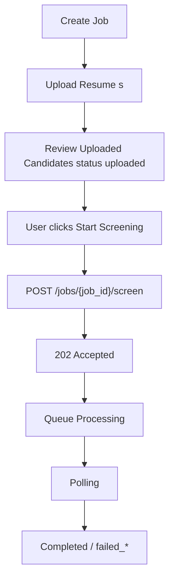

| Step | API behavior |
| --- | --- |
| Upload | Persist Storage + `candidates` (`uploaded`) + `resume_files`; **do not** create queue entries |
| Review | List/detail candidates with `status=uploaded` |
| Start Screening | **Only** `POST /jobs/{job_id}/screen` creates queue work → **202** |
| Retry AI | **Only** `POST /candidates/{candidate_id}/retry` for `failed_ai` |

**Removed:** Any automatic enqueue after upload (SRS ST-02 **not adopted** in v1 API design).  
**Removed:** Any unnamed / composite “upload enqueue” endpoint.

### 6.1 Rules (Cross-Cutting)

| Rule | Value | Source |
| --- | --- | --- |
| Formats | PDF, DOCX only | BR-06, SRS-FR-011 |
| Max size | **5 MB** default (configurable) | DDD §10.7, SRS-NFR-024 |
| Empty file | Reject | VR-12 |
| Batch capacity | ≥ **20** files | SRS-NFR-010 |
| Job gate | Owned + `lifecycle_status=active` else **403** | VR-05, VR-14 |
| Path | `resumes/{owner_id}/{job_id}/{candidate_id}/{filename}` | DDD §5.5 |
| Duplicate files | Allowed as **separate candidates** (DDD §9.4) | — |
| Sync scores | **Forbidden** | SDD DD-02 |
| Auto-enqueue | **Forbidden** | This ADS §6.0 |

### 6.2 Upload Resume (Single)

| Field | Specification |
| --- | --- |
| Purpose | Accept one resume under a job (SRS-FR-010–014); initial status **`uploaded`** (DDD §4.4.1; maps SRS `pending`) |
| Method / Route | Composite orchestration: Storage PUT + `POST /rest/v1/candidates` + `POST /rest/v1/resume_files` |
| Auth | JWT |
| Request | Multipart file + `job_id` |
| Response | **`201 Created`** with Candidate object (`status: "uploaded"`) — **not** 202 |
| Side effects | Storage object + DB rows only; **no** `processing_queue` row |
| Errors | EH-VAL, EH-STORE, EH-FORB (`403` if job archived/not owned) |
| Idempotency | Not an async-work creator; client may retry carefully (duplicate candidates allowed) |

Steps:

1. Validate MIME/size; reject with ErrorObject if invalid  
2. Allocate `candidate_id`  
3. Storage PUT to standard path  
4. Insert `candidates` (`status=uploaded`) + `resume_files`  
5. On DB failure after Storage success → **delete** Storage object (compensation)  
6. Return **201** Candidate — user reviews, then calls §8.2 Start Screening  

### 6.3 Batch Upload

| Field | Specification |
| --- | --- |
| Purpose | Multi-file upload in one user action (SRS-FR-010, SRS-FR-017) |
| Behavior | Per-file validate → upload → persist; **partial success allowed** (BR-04) |
| Response | **`200 OK`** with `{ "results": [ { "ok": true, "candidate": Candidate } | { "ok": false, "error": ErrorObject } ] }` |
| Failure isolation | One file failure does not roll back siblings |
| Queue | **None** until Start Screening |

### 6.4 Upload Status / Resume Metadata

| Field | Specification |
| --- | --- |
| Purpose | Read candidate/resume metadata and processing status |
| Method / Route | `GET /rest/v1/candidates?id=eq.{id}&select=*,resume_files(*)` |
| Response | Candidate + resume_files metadata (no binary) |

### 6.5 Signed Resume Access

| Field | Specification |
| --- | --- |
| Purpose | Owner-safe temporary access to private resume binary (SRS-FR-013, SRS-NFR-002, SRS-SEC-003) |
| Method / Route | `GET /candidates/{id}/resume` |
| Authentication | JWT required |
| Authorization | Caller must own the parent job (`candidates → jobs.owner_user_id = auth.uid()`); else **403** |
| Response Body | `{ "candidate_id": "uuid", "signed_url": "https://...", "expires_in": 300, "mime_type": "string", "original_filename": "string" }` |
| `expires_in` | Seconds until URL expiry (default **300**; configurable) |
| Validation | Candidate exists; `resume_files` row present |
| Status Codes | `200`, `401`, `403`, `404` |
| Notes | No permanent public URLs; no enumerable anonymous paths; regenerate by calling again |

### 6.6 Compensation Strategy

| Failure | Compensation |
| --- | --- |
| Storage OK, DB insert fails | **Delete** Storage object |
| Later parse/AI fail (after screen) | Keep candidate; set terminal status + `failure_code` |

### 6.7 Upload Flow Diagram

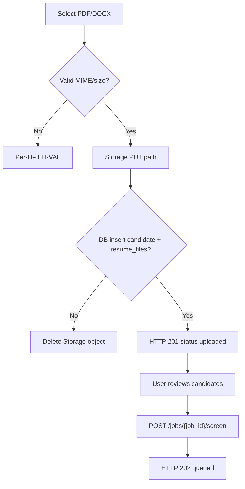

---

## 7. Candidate APIs

### 7.1 List Candidates

| Field | Specification |
| --- | --- |
| Purpose | List candidates for a job (SRS-FR-028, SRS-FR-030) |
| Method / Route | `GET /rest/v1/candidates?job_id=eq.{job_id}&order=created_at.desc` |
| Query | `status=eq.{status}` filter (Should); pagination `limit`/`offset` |
| Response | Candidate summary array (§15.2) |
| AuthZ | Job owner only |

### 7.2 Candidate Details

| Field | Specification |
| --- | --- |
| Purpose | Detail with evaluation + profile (SRS-FR-029) |
| Method / Route | `GET /rest/v1/candidates?id=eq.{id}&select=*,candidate_profiles(*),evaluations(*),resume_files(*)` |
| Response | Candidate + profile + active evaluation + file metadata |
| Notes | Include `failure_code` / `failure_message` when failed |

### 7.3 Candidate Profile

| Field | Specification |
| --- | --- |
| Purpose | Structured CE-01–CE-14 fields (SRS-FR-048–050) |
| Method / Route | `GET /rest/v1/candidate_profiles?candidate_id=eq.{id}` |
| Response | Profile object (§15.3); sparse nulls allowed |

### 7.4 Candidate Status

| Field | Specification |
| --- | --- |
| Purpose | Lightweight poll field set |
| Method / Route | `GET /rest/v1/candidates?job_id=eq.{job_id}&select=id,status,failure_code,updated_at` |
| Polling | Default interval **3s** (DDD §10.7); backoff allowed (SDD §13.1) |

### 7.5 Candidate Ranking (Frozen Model)

| Field | Specification |
| --- | --- |
| Purpose | Job candidate ranking view (SRS-FR-027–030) |
| Method / Route | `GET /rest/v1/candidate_ranking?job_id=eq.{job_id}` |
| AuthZ | Job owner only |
| Pagination | `limit`/`offset` (v1); keyset reserved as future optimization (§13.2) |

**Frozen response model — single ordered collection:**

```json
{
  "job_id": "uuid",
  "items": [
    {
      "rank": 1,
      "candidate_id": "uuid",
      "name": "string|null",
      "status": "completed",
      "match_score": 92.5,
      "summary": "string|null",
      "failure_code": null,
      "failure_message": null
    }
  ]
}
```

**Ordering rules (normative):**

1. All `completed` candidates first, ordered by `match_score` **descending** (ties: `evaluated_at` desc, then `candidate_id`).
2. Remaining candidates follow in lifecycle order: `ai_processing`, `parsing`, `parsed`, `queued`, `uploaded`, `failed_ai`, `failed_parse`, `archived`.
3. Within each non-completed status group: `updated_at` descending.
4. Non-completed items have `match_score: null` and `rank: null` (rank numbers apply only to completed).

### 7.6 Candidate Search / Filters

| Field | Specification |
| --- | --- |
| Purpose | Segment by status / simple name match (SRS-FR-031 Should) |
| Method / Route | Candidates list with `status=in.(...)` and optional profile name `ilike` |
| Pagination | Should (SRS-FR-032); default exclude `archived` unless `include_archived=true` |
| Sorting | Prefer ranking endpoint for score order; list uses `created_at` |

---

## 8. AI Processing APIs

**Synchronous screening is out of scope.** All screening is asynchronous (SDD v1.1).  
**Queue creation** occurs **only** through the endpoints in this section (no upload enqueue).

### 8.0 Endpoint Responsibility Split (Frozen)

| Endpoint | Eligible statuses | Creates queue? |
| --- | --- | --- |
| `POST /jobs/{job_id}/screen` | **`uploaded`** and **`queued`** only | Yes → **202** |
| `POST /candidates/{candidate_id}/retry` | **`failed_ai`** only | Yes → **202** |

Responsibilities **must not overlap**. `/screen` must ignore/reject `failed_ai` (use `/retry`). `/retry` must reject non-`failed_ai`.

### 8.1 Async Architecture

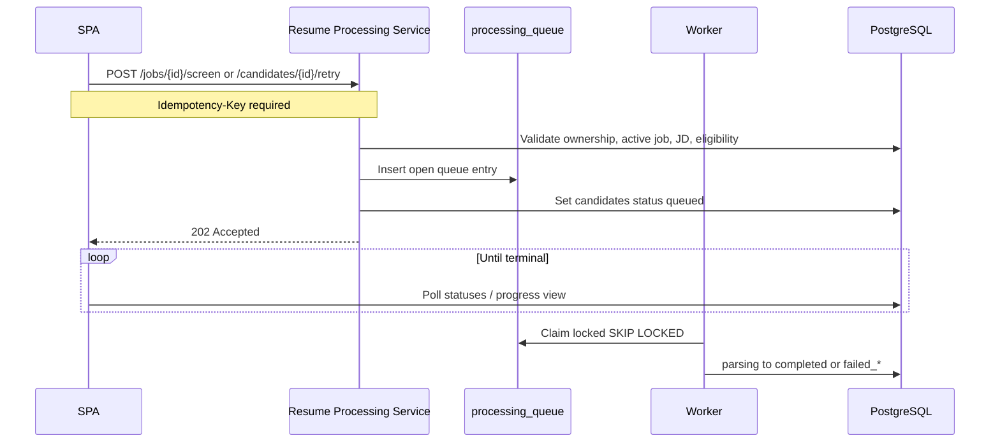

### 8.2 Start Screening

| Field | Specification |
| --- | --- |
| Purpose | Explicit Run Screening for not-yet-processed candidates (ST-01 core path; UC-05) |
| Method / Route | `POST /jobs/{job_id}/screen` |
| Authentication | JWT |
| Authorization | Job owner; job `active`; JD present (SRS-FR-009); archived job → **403** |
| Headers | `Authorization`, `Content-Type`, **`Idempotency-Key`** (required) |
| Request Body | `{ "candidate_ids"?: uuid[] }` — omit = all eligible on job |
| Eligibility | **`uploaded` or `queued` only** |
| Non-eligibility | `failed_ai` → use §8.3; `completed`/`failed_parse`/`archived`/in-flight → skip or `409` if exclusively requested |
| Response | **202** — see §8.7 |
| Side effects | One open queue entry per accepted candidate; status → `queued` |
| Errors | `400` no eligible / missing JD; `403`; `409` conflict |

### 8.3 Retry Screening

| Field | Specification |
| --- | --- |
| Purpose | Re-queue **`failed_ai`** only (SRS-FR-025 Should; UC-10) |
| Method / Route | `POST /candidates/{candidate_id}/retry` |
| Authentication | JWT |
| Authorization | Owner of parent job; job `active`; JD present |
| Headers | **`Idempotency-Key`** (required) |
| Preconditions | Candidate `status = failed_ai` |
| Behavior | Enqueue; set `queued`; on later success: history snapshot then overwrite active evaluation (BR-12) |
| Response | **202** — see §8.7 |
| Errors | `409` if not `failed_ai`; `403` archived/not owner; `404` |

### 8.4 Processing Status

| Field | Specification |
| --- | --- |
| Purpose | Observe progress (API-03) |
| Method / Route | §7.4 candidate status poll + `job_progress_summary` |
| Terminal stop | All candidates in `{completed, failed_parse, failed_ai, archived}` |

### 8.5 Evaluation Retrieval

| Field | Specification |
| --- | --- |
| Purpose | Read active evaluation (SRS-FR-023) |
| Method / Route | `GET /rest/v1/evaluations?candidate_id=eq.{id}` |
| History | `GET /rest/v1/evaluation_history?candidate_id=eq.{id}&order=archived_at.desc` (owner-only via RLS) |
| Rules | One active evaluation; history append-only (BR-12) |

### 8.6 Failure Handling, Retry, Audit

| Topic | Design |
| --- | --- |
| Parse failure | `failed_parse` + `failure_code`/`failure_message`; no fabricated evaluation |
| AI failure | `failed_ai`; retain prior evaluation if invalid payload |
| Success overwrite | Insert `evaluation_history` then replace `evaluations` |
| Audit logs | Operational events only; **no raw PII** (DDD §11.1) |
| Internal claim | Worker-only; **not a public API** (API-02) |

### 8.7 Frozen 202 Accepted Payload (API-01)

Applies to **`/screen` and `/retry` only** (not upload):

```json
{
  "accepted": true,
  "job_id": "uuid",
  "accepted_candidate_ids": ["uuid"],
  "status": "queued",
  "message": "Processing accepted"
}
```

For single-candidate retry, `accepted_candidate_ids` has one element.  
**Must not** include `match_score`, rationale, or summary.

### 8.8 Idempotency for Asynchronous Work

| Rule | Design |
| --- | --- |
| Required header | `Idempotency-Key` on **every** endpoint that creates async work: `/screen`, `/retry` |
| Scope | Unique per authenticated user (recommended: key namespaced by `auth.uid()`) |
| Replay | Same key + same route + same logical body → return the **original 202 payload** without creating a second open queue entry |
| Conflict | Same key with different body → **409** |
| Storage | Conceptual idempotency record (table or cache) retained for a configurable window (e.g., 24h) — implementation detail |

---

## 9. Dashboard & Analytics APIs

All analytics are **owner-scoped**, read-only, and map to DDD §10.6 view contracts.

### 9.1 Dashboard Summary

| Field | Specification |
| --- | --- |
| Purpose | Cross-job homepage metrics (SRS-FR-033) |
| Method / Route | `GET /rest/v1/dashboard_metrics` |
| Response | `{ active_jobs, total_candidates, completed_count, failed_count, avg_match_score }` |

### 9.2 Job Analytics / Progress

| Field | Specification |
| --- | --- |
| Purpose | Per-job progress (SRS-FR-036, SRS-FR-038) |
| Method / Route | `GET /rest/v1/job_progress_summary?job_id=eq.{job_id}` |
| Response | Counts by authoritative status; percent completed; failed totals |

### 9.3 Candidate Analytics / Screening Statistics

| Field | Specification |
| --- | --- |
| Purpose | Throughput stats (SRS-FR-034 Should) |
| Method / Route | `GET /rest/v1/screening_statistics?job_id=eq.{job_id}` |
| Response | uploaded/queued/completed/failed_parse/failed_ai counts; avg score |

### 9.4 Score Distribution

| Field | Specification |
| --- | --- |
| Purpose | Histogram buckets (SRS-FR-035 Should) |
| Method / Route | `GET /rest/v1/score_distribution?job_id=eq.{job_id}` |
| Response | `{ buckets: [ { range: "0-20", count }, ... ] }` — completed only |

### 9.5 Status Distribution

| Field | Specification |
| --- | --- |
| Purpose | Status breakdown (SRS-FR-034) |
| Method / Route | Derived from `job_progress_summary` or screening_statistics |
| Response | Map of status → count |

### 9.6 Ranking Statistics

| Field | Specification |
| --- | --- |
| Purpose | Rank list + score summary for job workspace |
| Method / Route | `candidate_ranking` + aggregates from evaluations |
| Aggregation | Avg/min/max score over completed evaluations for job |

---

## 10. Error Handling

### 10.1 Standard Error Object (T-04) — API-04 Frozen

**Normalization rule (Major):** Every client-visible failure from Supabase Auth, PostgREST, Storage, Resume Processing Service, or Gemini/processor mapping **must** be translated into this ErrorObject **before** it reaches the frontend. The SPA must not parse raw vendor error payloads as the primary UX contract.

```json
{
  "error": {
    "code": "EH-VAL",
    "message": "Human-readable safe message",
    "details": { "field": "title", "reason": "required" },
    "failure_code": null,
    "request_id": "uuid",
    "retryable": false
  }
}
```

| Field | Rules |
| --- | --- |
| `code` | One of EH-AUTH, EH-VAL, EH-FORB, EH-STORE, EH-PARSE, EH-AI, EH-SYS |
| `message` | Safe; no secrets/stack traces (EH-07) |
| `failure_code` | Populated for candidate terminal failures when applicable |
| `retryable` | Guidance for client |

### 10.2 Source → ErrorObject Mapping

| Source | Typical EH code | Notes |
| --- | --- | --- |
| Supabase Auth | EH-AUTH | Invalid/expired session, bad credentials |
| PostgREST / RLS deny | EH-FORB / EH-VAL | Ownership failures → EH-FORB |
| Storage | EH-STORE | Upload/download failures |
| RPS validation | EH-VAL / EH-FORB | Eligibility, archived job, missing JD |
| Gemini / AI pipeline | EH-AI | Surfaced as candidate `failed_ai` after 202; sync RPS faults use ErrorObject |
| Parse pipeline | EH-PARSE | Surfaced as candidate `failed_parse` after 202 |
| Platform / unknown | EH-SYS | 500/503 |

### 10.3 Category Mapping

| Category | HTTP | Examples |
| --- | --- | --- |
| Validation | **422** semantic; **400** malformed JSON/body | Empty JD, bad MIME, oversize |
| Authentication | **401** | Missing/expired JWT |
| Authorization | **403** | Another user’s job; archived job mutation |
| Not found | **404** | Unknown id for owner scope (do **not** mask as 403 in v1) |
| Upload/Storage | **502**/**503** or **400** per storeability | Storage put failure |
| Business conflict | **409** | Delete job with candidates; retry non-`failed_ai`; idempotency body mismatch |
| Async AI / Parse | Resource status after **202** | `failed_ai` / `failed_parse` |
| Rate limit | **429** (EH-SYS) | Auth/upload/screen throttling |
| System | **500** / **503** | Platform outage |

### 10.4 Retryable vs Non-Retryable

| Retryable | Non-Retryable |
| --- | --- |
| Transient EH-STORE / EH-SYS; processor-internal AI backoff | EH-VAL, EH-FORB, EH-AUTH (until re-login), unsupported MIME |
| User **`POST /candidates/{id}/retry`** for `failed_ai` | Auto-enqueue; sync score on upload |

### 10.5 HTTP Status Mapping (T-05)

| HTTP | When |
| --- | --- |
| 200 | Successful read/update; batch upload aggregate |
| 201 | Created (job, single upload candidate) |
| 202 | Async work accepted (**`/screen`**, **`/retry` only**) |
| 204 | Deleted / sign-out |
| 400 | Malformed request |
| 422 | Semantic validation failure |
| 401 | Unauthenticated |
| 403 | Forbidden (ownership / archived gate) |
| 404 | Not found |
| 409 | Conflict (business rule / idempotency) |
| 429 | Rate limited |
| 500/503 | System |

---

## 11. Security

| Topic | Design |
| --- | --- |
| JWT Authentication | All protected routes require valid Supabase JWT |
| Ownership validation | `jobs.owner_user_id = auth.uid()`; processor re-checks; signed resume §6.5 enforces same |
| RLS interaction | PostgREST relies on RLS; SPA uses anon key + user JWT only |
| Rate limiting | Platform/edge limits on Auth, upload, `/screen`, `/retry` (config) |
| Input validation | MIME, size, UUID format, string lengths, enum checks |
| Output validation | No service keys; no raw resume text in analytics; scores only when completed |
| File upload security | Private bucket; path prefix ownership; type sniffing beyond extension |
| Signed resume access | Short-lived `signed_url`; ownership required; no permanent public URLs |
| Prompt injection mitigation | Processor treats resume/JD as untrusted text (detail in RR-AI-008 / RR-SEC-009) |
| PII handling | Classification per DDD §11.1; audit logs never raw PII |
| Error normalization | Vendor errors never leak raw to UI (§10.1) |

**Forbidden:** Gemini API key or service-role key in SPA (BR-05, SRS-SEC-002).

---

## 12. API Versioning

| Topic | Policy |
| --- | --- |
| Current version | **v1** (this document v1.1.0 contracts) |
| Command routes (RPS) | Paths `/jobs/.../screen`, `/candidates/.../retry` are **v1 command API**; breaking changes require `/v2/...` |
| PostgREST resources | Unversioned table/view names; **additive-only** in v1 (new nullable fields/views allowed) |
| Client compatibility rule | SPA may rely on frozen JSON contracts in §15; unknown fields ignored |
| Backward compatibility | Do not remove or rename fields in v1 without deprecation |
| Deprecation | Announce in project release notes; retain through at least the next tagged documentation minor (e.g., 1.x → keep until 2.0 design) |
| Breaking changes | New major; examples: changing authoritative status enum, removing explicit-screen workflow, dropping 202 async model |

---

## 13. Performance

### 13.1 Defaults (T-03)

| Parameter | Default |
| --- | --- |
| Poll interval | 3 seconds (backoff to 10–15s if unchanged) |
| Max upload size | 5 MB |
| Batch size guidance | 20 |
| AI transient retries | 2 (processor) |
| Processor soft timeout | 60s / stage |
| Queue visibility | 90s |
| Signed URL TTL | 300 seconds |

### 13.2 Tactics

| Tactic | Design |
| --- | --- |
| Pagination (v1) | `limit`/`offset` on lists and ranking |
| Keyset pagination | **Future optimization** for large ranking sets (cursor on `(match_score, candidate_id)`); not required for v1 demo |
| Batch uploads | Parallel per-file with isolation; no auto-screen |
| Async processing | **202** only from `/screen` and `/retry`; never block HTTP on Gemini |
| Compression | HTTPS/CDN for SPA; JSON as-is |
| Caching | Short-lived client cache; invalidate on mutations; do not cache stale statuses across poll |
| Timeouts | Client upload timeout > processor soft budget |
| Retry strategy | Idempotency-Key replay for `/screen` and `/retry` |
| Rate limiting | Protect Auth, upload, `/screen`, `/retry` |

---

## 14. Sequence Diagrams

### 14.1 Authentication

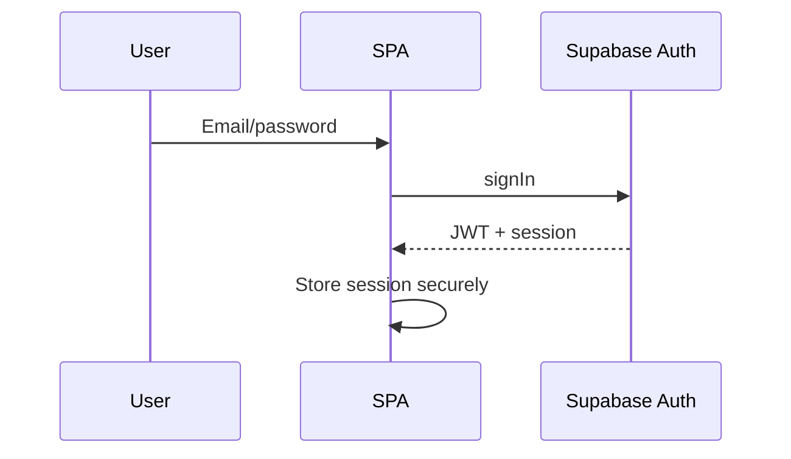

### 14.2 Create Job

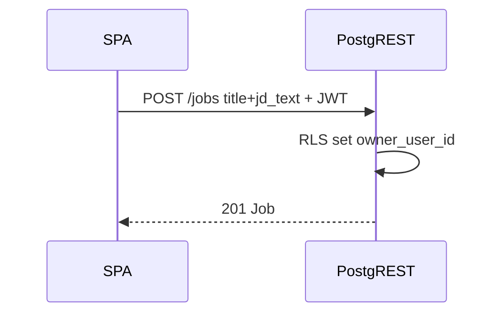

### 14.3 Resume Upload

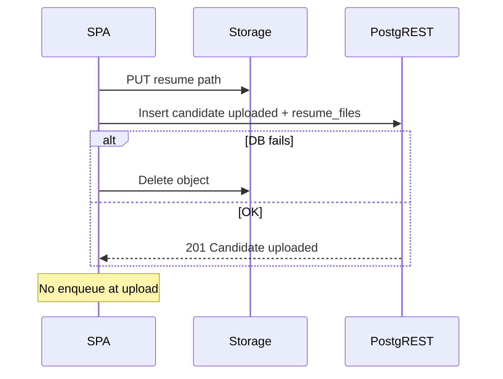

### 14.4 AI Screening

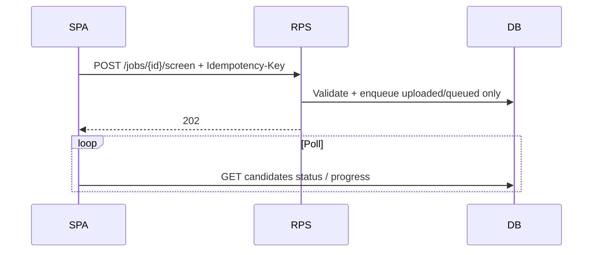

### 14.5 Candidate Ranking

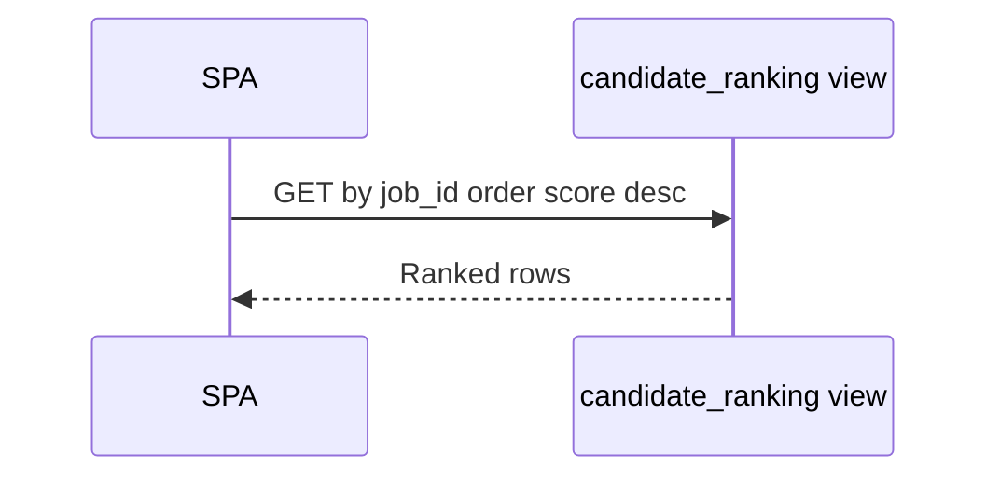

### 14.6 Analytics Retrieval

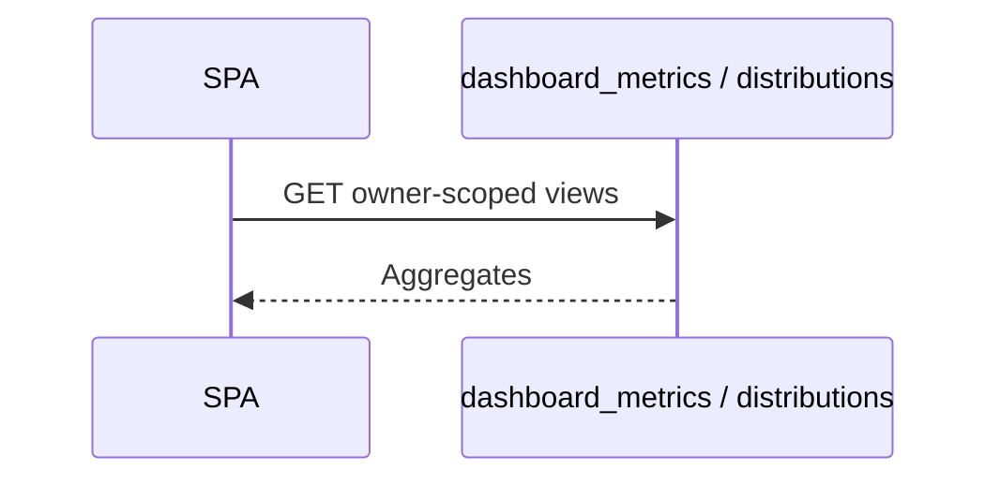

---

## 15. API Contracts

Conceptual JSON schemas (not OpenAPI). Field sets align to DDD tables/views.

### 15.1 Job

```json
{
  "id": "uuid",
  "owner_user_id": "uuid",
  "title": "string",
  "jd_text": "string",
  "lifecycle_status": "active|archived",
  "created_at": "iso-8601",
  "updated_at": "iso-8601"
}
```

### 15.2 Candidate

```json
{
  "id": "uuid",
  "job_id": "uuid",
  "status": "uploaded|queued|parsing|parsed|ai_processing|completed|failed_parse|failed_ai|archived",
  "status_coarse": "pending|processing|completed|failed_parse|failed_ai|archived",
  "failure_code": "string|null",
  "failure_message": "string|null",
  "original_filename": "string",
  "created_at": "iso-8601",
  "updated_at": "iso-8601"
}
```

`status_coarse` is optional derived mapping (DDD Appendix A); **`status` is authoritative**.

### 15.3 Candidate Profile

```json
{
  "candidate_id": "uuid",
  "name": "string|null",
  "email": "string|null",
  "phone": "string|null",
  "skills": "array|null",
  "education": "array|null",
  "experience": "array|null",
  "certifications": "array|null",
  "projects": "array|null",
  "resume_summary": "string|null",
  "linkedin": "string|null",
  "github": "string|null",
  "portfolio": "string|null",
  "languages": "array|null",
  "location": "string|null",
  "updated_at": "iso-8601"
}
```

### 15.4 Evaluation

```json
{
  "id": "uuid",
  "candidate_id": "uuid",
  "job_id": "uuid",
  "match_score": "number|null",
  "rationale": "string|null",
  "summary": "string|null",
  "model_metadata": {
    "model": "string",
    "prompt_version": "string",
    "timings_ms": "number|null"
  },
  "evaluated_at": "iso-8601"
}
```

### 15.5 Analytics Summary

```json
{
  "active_jobs": 0,
  "total_candidates": 0,
  "completed_count": 0,
  "failed_count": 0,
  "avg_match_score": 0,
  "status_counts": { "queued": 0, "completed": 0, "failed_ai": 0 },
  "score_buckets": [{ "range": "81-100", "count": 0 }]
}
```

### 15.6 Error Response

See §10.1.

---

## 16. Traceability Matrix

### 16.1 Functional Requirements → API

| SRS FR | Priority | API / Surface |
| --- | --- | --- |
| SRS-FR-001 | Must | §4.1–4.2 Sign up / Sign in |
| SRS-FR-002 | Must | §4.4 Session; 401 on protected APIs |
| SRS-FR-003 | Must | §4.3 Sign out |
| SRS-FR-004 | Must | JWT + RLS on §§5–9; §11 |
| SRS-FR-005 | Must | §5.1 Create Job |
| SRS-FR-006 | Must | §5.5–5.6, §5.8 List/Get/Search Jobs |
| SRS-FR-007 | Should | §5.2 Update Job |
| SRS-FR-008 | Must | Candidates/files/evaluations require `job_id` §§6–8 |
| SRS-FR-009 | Must | §8.2 / §8.3 JD required |
| SRS-FR-010 | Must | §6.3 Batch Upload |
| SRS-FR-011 | Must | §6.1 PDF/DOCX |
| SRS-FR-012 | Must | §6.1–6.2 EH-VAL |
| SRS-FR-013 | Must | §6.2 Storage; §6.5 signed access |
| SRS-FR-014 | Must | §6.2 create candidate `uploaded` (DDD maps SRS pending) |
| SRS-FR-015 | Must | RPS processor (internal after §8.2) |
| SRS-FR-016 | Must | Processor → `failed_parse`; visible §7 |
| SRS-FR-017 | Must | §6.3 partial success |
| SRS-FR-018 | Must | RPS after §8.2 |
| SRS-FR-019 | Must | §8.5 / §15.4 `match_score` |
| SRS-FR-020 | Must | §8.5 rationale |
| SRS-FR-021 | Must | §8.5 summary |
| SRS-FR-022 | Must | §8 RPS only; §11 no client Gemini |
| SRS-FR-023 | Must | §8.5 evaluations persist/read |
| SRS-FR-024 | Must | Processor → `failed_ai` |
| SRS-FR-025 | Should | §8.3 Retry |
| SRS-FR-026 | Must | **No endpoint** |
| SRS-FR-027 | Must | §7.5 Ranking order |
| SRS-FR-028 | Must | §7.5 item fields |
| SRS-FR-029 | Must | §7.2 Detail |
| SRS-FR-030 | Must | §7.5 includes failed statuses |
| SRS-FR-031 | Should | §7.6 Filters |
| SRS-FR-032 | Should | §7.1 / §7.5 pagination |
| SRS-FR-033 | Must | §9.1 Dashboard |
| SRS-FR-034 | Should | §9.3 / §9.5 Status distribution |
| SRS-FR-035 | Should | §9.4 Score distribution |
| SRS-FR-036 | Should | §9.2 Job analytics |
| SRS-FR-037 | Must | Status enum §1.8; transitions via RPS |
| SRS-FR-038 | Must | §5.7 / §9.2 Progress |
| SRS-FR-039 | Must | §10 ErrorObject + `failure_message` |
| SRS-FR-040 | Must | Per-candidate isolation §6.3 / §8 |
| SRS-FR-041 | Could | §17 Future export |
| SRS-FR-042 | Could | Future |
| SRS-FR-043 | Won't | No email API |
| SRS-FR-044 | Won't | No HM RBAC API |
| SRS-FR-045 | Won't | No OCR API |
| SRS-FR-046 | Must | §5.3 Archive |
| SRS-FR-047 | Must | §5.4 Delete |
| SRS-FR-048 | Must | Processor persist; read §7.3 |
| SRS-FR-049 | Should | §7.3 optional CE fields |
| SRS-FR-050 | Must | §7.2–7.3 display |
| SRS-FR-051 | Must | §8.5 one active evaluation |
| SRS-FR-052 | Must | §8.3 overwrite on success |
| SRS-FR-053 | Must | §8.5 / §8.6 history before overwrite |
| ST-01 | Must | §8.2 Start Screening (uploaded/queued); retry via §8.3 |
| ST-02 | May | **Not adopted** — §6.0 forbids auto-enqueue |

### 16.2 Non-Functional Requirements → API

| SRS NFR | Priority | API / Design Support |
| --- | --- | --- |
| SRS-NFR-001 | Must | HTTPS assumed for all surfaces §3 |
| SRS-NFR-002 | Must | Private Storage §6; signed URL §6.5 |
| SRS-NFR-003 | Must | §11 secrets policy |
| SRS-NFR-004 | Must | JWT + ownership §11 |
| SRS-NFR-005 | Must | §6.1 validation |
| SRS-NFR-006 | Must | §6.3 / §8 isolation |
| SRS-NFR-007 | Should | §13.1 AI retries |
| SRS-NFR-008 | Must | Failed candidates readable §7 |
| SRS-NFR-009 | Should | Lean §9 views; SPA concern |
| SRS-NFR-010 | Must | §6.1 batch ≥20 |
| SRS-NFR-011 | Must | §8 async 202 + poll |
| SRS-NFR-012 | Should | §7 pagination; keyset future §13.2 |
| SRS-NFR-013 | Must | Workflow §6.0 supports primary path |
| SRS-NFR-014 | Must | Status vocabulary §1.8 |
| SRS-NFR-015 | Should | UI/UX doc (not API) |
| SRS-NFR-016 | Should | UI/UX doc |
| SRS-NFR-017 | Must | §8.5–8.6 evaluation + history |
| SRS-NFR-018 | Should | Developer Guide |
| SRS-NFR-019 | Must | Deployment Guide / `.env.example` |
| SRS-NFR-020 | Should | RPS adapter boundary §8 |
| SRS-NFR-021 | Must | Deployment (Vercel) |
| SRS-NFR-022 | Must | Supabase config |
| SRS-NFR-023 | Should | Status fields + logs §7.4 / §8.6 |
| SRS-NFR-024 | Must | §6.1 / §13.1 5 MB |

### 16.3 Use Cases → API

| UC | Priority | Primary APIs |
| --- | --- | --- |
| UC-01 | Must | §4.1–4.2 |
| UC-02 | Must | §4.3 |
| UC-03 | Must | §5.1 |
| UC-04 | Must | §6.2–6.3 |
| UC-05 | Must | §8.2 + poll §7.4 / §5.7 |
| UC-06 | Must | §7.5 |
| UC-07 | Must | §7.2–7.3, §8.5 |
| UC-08 | Must | §9.1 |
| UC-09 | Must | §7.1–7.2 failure fields; §10 |
| UC-10 | Should | §8.3 |

Every public endpoint in §§4–9 traces to at least one FR/NFR/UC above.

---

## 17. Future APIs

| Future capability | Notes |
| --- | --- |
| Webhooks | Notify external systems on `completed` / `failed_*` |
| Bulk export | CSV/JSON export (SRS-FR-041 Could) |
| Email notifications | Outbox + provider APIs |
| Interview scheduling | New resources beyond v1 |
| ATS integration | External system connectors |

Not in v1 scope; listed for roadmap only.

---

## 18. Conclusion

This API design operationalizes the approved stack and documents:

| Upstream | How APIs support it |
| --- | --- |
| Architecture | SPA → Supabase + async RPS; Gemini never in browser |
| PRD | Jobs, uploads, ranking, analytics, human-in-the-loop |
| SRS v1.1 | FR/NFR/UC coverage; ST-02 not adopted; explicit Start Screening |
| SDD v1.1 | **202** async screening after explicit screen/retry; compensation on upload |
| DDD v1.1 | Entities, statuses, views, defaults, path, PII, one open queue |

It is the baseline for **UI/UX Design (RR-UIX-007)** and the **Cursor Developer Guide (RR-DEV-012)**.

---

## 19. API Architecture Review

### 19.1 v1.0 Findings — Remediation Status (v1.1)

| Issue (v1.0) | Severity | v1.1 Disposition | Section |
| --- | --- | --- | --- |
| Upload dual path / auto-enqueue ambiguity | Critical | **Frozen** explicit screen workflow; no auto-enqueue | §6.0 |
| ST-01 / `failed_ai` overlap | Critical | `/screen` = uploaded\|queued; `/retry` = failed_ai only | §8.0–8.3 |
| Unnamed upload enqueue | Critical | Removed; queue only via `/screen` (and `/retry`) | §6.0, §8 |
| Signed URL missing | Major | `GET /candidates/{id}/resume` | §6.5 |
| Idempotency incomplete | Major | Required on `/screen` and `/retry`; replay rules | §8.8 |
| Error normalization | Major | All vendor errors → ErrorObject | §10.1–10.2 |
| Ranking model ambiguous | Major | Single ordered collection frozen | §7.5 |
| Traceability FR-granularity | Major | Expanded FR + NFR + UC matrices | §16 |
| Archive / update gates | Minor | Archived blocks update/upload/screen | §5.2–5.3, §6.1 |
| Versioning clarity | Minor | Additive PostgREST; command `/v2` for breaks | §12 |
| Keyset pagination | Minor | Documented as future optimization | §13.2 |
| HTTP status mapping | Minor | 400 vs 422; 404 not masked; 202 scope | §10.5 |

### 19.2 Remaining Implementation Notes

| Issue | Severity | Recommendation | Section |
| --- | --- | --- | --- |
| Idempotency store physical design | Implementation | Table/cache + TTL in development | §8.8 |
| Signed URL provider mechanics | Implementation | Supabase Storage signed URL API | §6.5 |
| Error adapter placement (BFF vs SPA) | Implementation | Prefer shared client adapter or thin BFF | §10.1 |
| Ranking view SQL | Implementation | Satisfy §7.5 ordering contract | §7.5 |

### Review Verdict (v1.1)

| Dimension | Assessment |
| --- | --- |
| REST / hybrid | Command routes for async work; PostgREST for resources |
| Async correctness | Explicit screen/retry only; upload is 201 |
| Security | Signed resume + ownership; secrets off client |
| Traceability | FR/NFR/UC matrices complete |
| Freeze readiness | **Approved as implementation baseline** pending implementation notes above |

---

## 20. Appendices

### Appendix A — API Design Decisions

| ID | Decision | Reason | Alternative | Trade-off |
| --- | --- | --- | --- | --- |
| APD-01 | Async **202** only on `/screen` and `/retry` | Clear accept semantics | 202 on upload | Upload is sync persist |
| APD-02 | No auto-enqueue (ST-02 not adopted) | Human-controlled screening | ST-02 UX optimize | Extra click |
| APD-03 | Screen vs retry split | Non-overlapping eligibility | Single endpoint | Two routes |
| APD-04 | Refined statuses in API (API-06) | DDD §4.4.1 | Coarse-only | More states in UI |
| APD-05 | Idempotency-Key on async work | Safe retries | No keys | Need key store |
| APD-06 | ErrorObject normalization | Stable SPA UX | Raw vendor errors | Adapter layer |
| APD-07 | Single ranking collection | One contract | Split lists | Client sorts groups |
| APD-08 | Signed resume endpoint | SRS private storage | Direct Storage SDK only | Extra route |

### Appendix B — Closed Open Items (API-01..06)

| ID | Resolution |
| --- | --- |
| API-01 | §8.7 202 payload for screen/retry |
| API-02 | Queue claim internal only §8.6 |
| API-03 | Poll §7.4 + progress views; interval §13.1 |
| API-04 | ErrorObject §10.1 + source mapping §10.2 |
| API-05 | Idempotency-Key §8.8 |
| API-06 | Refined statuses primary; optional `status_coarse` |

### Appendix C — Change Log (v1.0.0 → v1.1.0)

| ID | Change | Type |
| --- | --- | --- |
| CL-01 | Frozen upload → review → Start Screening → 202 workflow; removed auto-enqueue | Critical |
| CL-02 | `/screen` = uploaded\|queued only; `/retry` = failed_ai only | Critical |
| CL-03 | Removed unnamed upload enqueue; queue only via screen/retry | Critical |
| CL-04 | Added `GET /candidates/{id}/resume` signed URL contract | Major |
| CL-05 | Idempotency-Key + replay rules for async work | Major |
| CL-06 | Normalize Auth/Storage/PostgREST/Gemini errors to ErrorObject | Major |
| CL-07 | Frozen single ordered ranking response model | Major |
| CL-08 | Expanded traceability to all FR, NFR, UC | Major |
| CL-09 | Archive/update gates; versioning; keyset future; HTTP mapping; diagrams | Minor |

### Appendix D — Document Control

| Item | Value |
| --- | --- |
| Path | `docs/02-design/06-API-Design-Specification.md` |
| Version | 1.1.0 |
| Upstream | RR-ARCH-001; RR-PRD-002; RR-SRS-003 v1.1.0; RR-SDD-004 v1.1.0; RR-DB-005 v1.1.0 |
| Next | RR-UIX-007 UI/UX Design Document |

---

**End of Document — Document 06 — RR-API-006 — API Design Specification v1.1.0**
