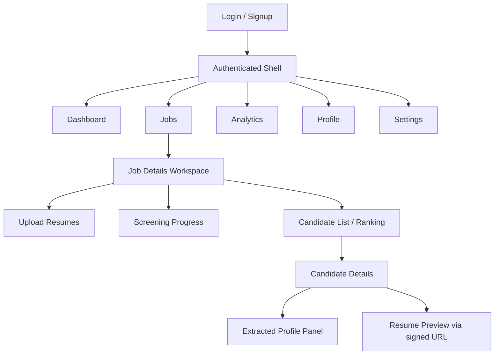
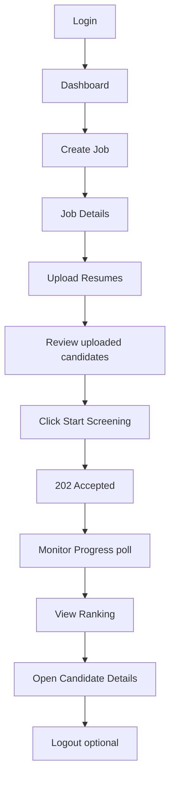
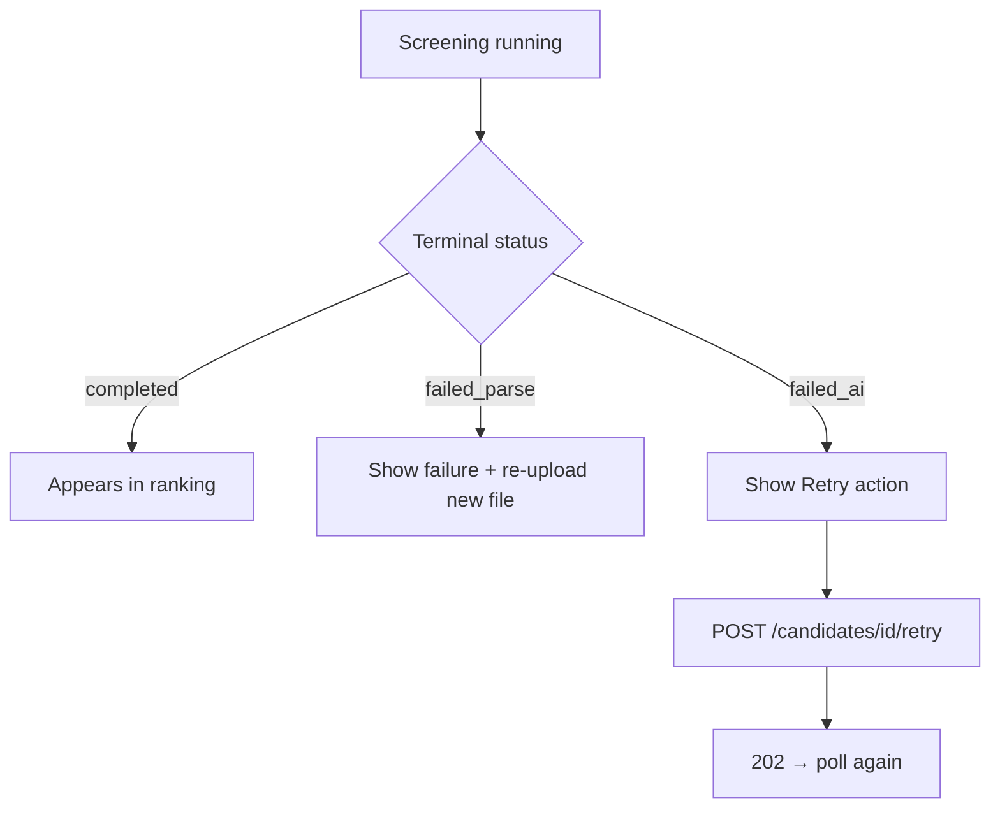
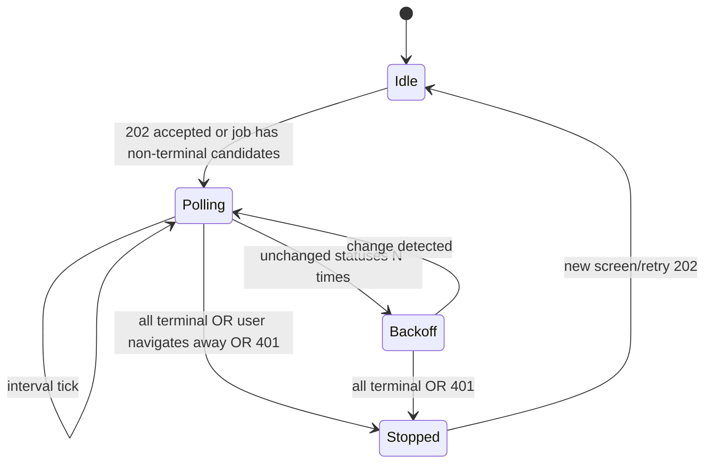

# ResumeRank AI

# UI/UX Design Document (UXD)

**Document 07 — RR-UIX-007**

---

## Cover Page

| | |
| --- | --- |
| **Project Name** | ResumeRank AI |
| **Document Title** | UI/UX Design Document |
| **Document Number** | Document 07 |
| **Document ID** | RR-UIX-007 |
| **Version** | 1.1.0 |
| **Status** | Baseline — Ready for Implementation Guidance |
| **Supersedes** | RR-UIX-007 v1.0.0 |
| **Classification** | Internal — MBA Final Year Project |
| **Specialization** | Artificial Intelligence & Data Science |
| **Document Type** | UI/UX Design (React / Tailwind CSS / shadcn/ui) |
| **Author** | Vish Var |
| **Role** | Senior Product Designer / Senior Frontend Architect |
| **Organization** | ResumeRank AI Development Team |
| **Prepared For** | Development, QA, and Academic Evaluation Teams |
| **Date** | 12 July 2026 |
| **Upstream Dependencies** | RR-ARCH-001 v2.0.0; RR-PRD-002 v1.0.0; RR-SRS-003 v1.1.0; RR-SDD-004 v1.1.0; RR-DB-005 v1.1.0; RR-API-006 v1.1.0 |
| **Governing Plan** | Documentation Roadmap (RR-DOC-000) |
| **Next Document** | AI Design Document (RR-AI-008) |

---

### Document Control Statement

This UI/UX Design Document specifies the information architecture, journeys, screens, components, forms, states, accessibility, and UI traceability for ResumeRank AI.

It derives entirely from the approved Architecture, PRD, SRS v1.1, SDD v1.1, DDD v1.1, and ADS v1.1. It does **not** invent undocumented product features and does **not** modify business rules BR-01–BR-12.

Authoritative screening UX follows ADS v1.1: **Upload → Review (`uploaded`) → Start Screening → 202 → Poll**. Auto-enqueue (ST-02) is **not** adopted.

Design-only: no React implementation code, no CSS hex palette lock-in beyond semantic roles, no Figma binaries.

---

## Version History

| Version | Date | Author | Description of Change | Review Status |
| --- | --- | --- | --- | --- |
| 0.1.0 | 12 July 2026 | Vish Var | Outline from ADS v1.1 workflows and SRS use cases | Draft |
| 1.0.0 | 12 July 2026 | Vish Var | Complete UI/UX design with screens, components, journeys, wireframes, traceability, and UX Architecture Review | Superseded |
| 1.1.0 | 12 July 2026 | Vish Var | Panel review remediation: async client model, expanded component catalog, screen/API/validation/state/responsive/a11y/token/traceability upgrades | Current |

---

## Table of Contents

1. [Introduction](#1-introduction)
2. [Design Principles](#2-design-principles)
3. [User Roles](#3-user-roles)
4. [Information Architecture](#4-information-architecture)
5. [User Journey](#5-user-journey)
   - 5.4 [Async Client Interaction Model](#54-async-client-interaction-model)
6. [Screen Inventory](#6-screen-inventory)
   - 6.0 [Route Structure](#60-route-structure)
7. [Component Library](#7-component-library)
8. [Forms](#8-forms)
9. [Candidate Ranking UI](#9-candidate-ranking-ui)
10. [Dashboard Design](#10-dashboard-design)
11. [Interaction Design](#11-interaction-design)
12. [Responsive Design](#12-responsive-design)
13. [Accessibility](#13-accessibility)
14. [UI State Management](#14-ui-state-management)
15. [Design Tokens](#15-design-tokens)
16. [Wireframes](#16-wireframes)
17. [UI Traceability](#17-ui-traceability)
18. [Future UX Enhancements](#18-future-ux-enhancements)
19. [Conclusion](#19-conclusion)
20. [UX Architecture Review](#20-ux-architecture-review)
21. [Appendices](#21-appendices)

---

## List of Figures

| Figure | Title | Section |
| --- | --- | --- |
| F-01 | Navigation Hierarchy | §4.1 |
| F-02 | Primary Screening Journey | §5.1 |
| F-03 | Failure & Retry Journey | §5.2 |
| F-04 | Wireframe — Dashboard | §16.1 |
| F-05 | Wireframe — Job Details | §16.2 |
| F-06 | Wireframe — Candidate Details | §16.3 |
| F-07 | Wireframe — Analytics | §16.4 |
| F-08 | Wireframe — Upload | §16.5 |

---

## References

| ID | Reference |
| --- | --- |
| REF-01 | RR-DOC-000 Documentation Roadmap |
| REF-02 | RR-ARCH-001 Project Architecture v2.0.0 |
| REF-03 | RR-PRD-002 Product Requirements Document v1.0.0 |
| REF-04 | RR-SRS-003 Software Requirements Specification v1.1.0 |
| REF-05 | RR-SDD-004 System Design Document v1.1.0 |
| REF-06 | RR-DB-005 Database Design Document v1.1.0 |
| REF-07 | RR-API-006 API Design Specification v1.1.0 |
| REF-08 | shadcn/ui / Radix primitives (conceptual component patterns) |

---

## 1. Introduction

### 1.1 Purpose

Define a production-oriented UI/UX specification for the ResumeRank AI SPA so frontend implementation can deliver the approved HR screening workflow without inventing product scope.

### 1.2 Scope

**In scope:** Authenticated SPA screens, navigation, journeys, components (shadcn/ui patterns), forms, ranking/dashboard UX, responsive/a11y goals, UI states (including polling), design tokens (semantic), wireframes, traceability.

**Out of scope:** Pixel-perfect mockups, dark-mode requirement, candidate portal, HM RBAC, ATS, email, OCR, auto-hire UI, implementation code.

### 1.3 Design Goals

| Goal | UI Response |
| --- | --- |
| Explicit human control | **Start Screening** CTA; no auto-enqueue |
| Status visibility | Authoritative badges + job progress (SRS-NFR-014) |
| Non-blocking async UX | 202 accept + poll (SRS-NFR-011) |
| Evidence for decisions | Ranking + detail with score/rationale/summary/CE fields |
| Owner isolation | Route guards; no cross-user data |

### 1.4 Target Users

Primary: **HR Recruiter** (UC-L-01). Academic Evaluator (UC-L-03) uses the same UI on demo accounts. System Operator (UC-L-02) has **no** distinct in-app admin console.

### 1.5 Accessibility Goals

Follow WCAG 2.2 AA–oriented practices where feasible with shadcn/ui + semantic HTML (SRS-NFR-015 Should): keyboard access, visible focus, label association, live regions for toasts/errors, sufficient contrast via semantic tokens.

### 1.6 Responsive Design Goals

Desktop-first; usable on tablet (SRS-NFR-016 Should). Mobile is supported with stacked layouts; not a native-app experience.

---

## 2. Design Principles

| Principle | Application |
| --- | --- |
| Consistency | Shared status badges, ErrorObject toasts, table patterns |
| Minimalism | One primary CTA per view; avoid marketing clutter |
| Visibility of system status | Badges, progress summary, polling indicators |
| Recognition over recall | Persistent nav; job context breadcrumb |
| Error prevention | Disable Start Screening when no eligible candidates / missing JD / archived |
| Accessibility | Keyboard, ARIA, contrast §13 |
| Responsive layout | Breakpoints §12 |
| Performance | Skeletons; lean dashboard queries; poll backoff |

---

## 3. User Roles

| Role | Source | In-app permissions | Navigation differences |
| --- | --- | --- | --- |
| **HR Recruiter** | UC-L-01 | Full owner capabilities on own jobs/candidates | Full app nav |
| **Administrator / System Operator** | UC-L-02 | **No in-app admin UI** in v1; operational via Deployment Guide | Same as HR if using a demo account; no extra nav |
| **Academic Evaluator** | UC-L-03 | Same as HR Recruiter on provided demo account | Same nav; no distinct role chrome |

**Permissions:** JWT session required for all app routes except Login/Signup. Ownership enforced by API/RLS (BR-09). No role switcher.

---

## 4. Information Architecture

### 4.1 Navigation Hierarchy



| Nav item | Route (conceptual) | Purpose |
| --- | --- | --- |
| Dashboard | `/` or `/dashboard` | Cross-job metrics (UC-08) |
| Jobs | `/jobs` | List/create/open jobs |
| Job Details | `/jobs/{id}` | Workspace: upload, screen, rank |
| Analytics | `/analytics` | Distributions / job analytics (Should widgets) |
| Profile | `/profile` | Read profile |
| Settings | `/settings` | Sign-out + session info (minimal) |

**Not in nav:** Candidates global list (candidates are job-scoped); Admin console.

---

## 5. User Journey

### 5.1 Primary Journey — Login → Rank



### 5.2 Failure & Retry Journey



### 5.3 Journey Catalog

| Journey | Steps | Primary APIs |
| --- | --- | --- |
| Login | Enter credentials → session → redirect Dashboard | Auth sign-in |
| Create Job | Open Create → title+JD → save → Job Details | `POST /jobs` |
| Upload Resume | Select files → validate → upload → **201 uploaded** | Storage + candidates |
| Start Screening | Review list → Start Screening → **202** | `POST /jobs/{id}/screen` |
| Monitor Progress | Poll badges + progress summary | candidates status + `job_progress_summary` |
| View Candidate | Open row → detail panels + signed resume | candidates nest + `GET .../resume` |
| Rank Candidates | Ranking table ordered per ADS §7.5 | `candidate_ranking` |
| Archive Job | Confirm archive → list updates | PATCH `lifecycle_status` |
| Logout | Confirm → clear session → Login | Auth sign-out |

---


### 5.4 Async Client Interaction Model

Authoritative client behavior for ADS v1.1 async work. **Referenced by:** Job Details (§6.7), Upload (§6.8), Screening Progress (§6.9), Candidate List/Ranking (§6.10), Candidate Details (§6.11), Interactions (§11), States (§14).

#### 5.4.1 Idempotency-Key

| Rule | Design |
| --- | --- |
| Required on | `POST /jobs/{job_id}/screen` and `POST /candidates/{candidate_id}/retry` |
| Generation | Client generates a UUID (or ULID) per user intent; store until response settled |
| Header | `Idempotency-Key: {value}` |
| Replay | Same key + same route + same logical body → reuse prior **202** payload; do not create duplicate queue work |
| Conflict | Same key, different body → treat as **409**; show ErrorObject; do not retry blindly |
| Scope | Per authenticated user session recommended |

#### 5.4.2 202 Accepted Handling

| Step | UI behavior |
| --- | --- |
| Receive 202 | Toast success: “Processing accepted” |
| Payload | Use `{ accepted: true, job_id, accepted_candidate_ids[], status: "queued", message }` (ADS §8.7) |
| Optimistic update | Immediately set listed `accepted_candidate_ids` badges to `queued`; refresh ProgressSummary counts |
| Must not | Expect scores/rationale/summary in 202 body |

#### 5.4.3 Polling Lifecycle



| Parameter | Value |
| --- | --- |
| Poll interval | **3 seconds** (ADS/DDD default) |
| Backoff | After unchanged polls, increase to **10–15 seconds** |
| Poll endpoints | Lightweight: candidates `id,status,failure_code,updated_at` + `job_progress_summary` |
| Ranking refresh | On enter Candidates tab; after any terminal transition detected; optional every ~15–30s while polling — **not** every 3s |
| Terminal set | All job candidates ∈ `{completed, failed_parse, failed_ai, archived}` → **stop poll** |
| Indicator | Show `PollingIndicator` while Polling/Backoff |

#### 5.4.4 Double-Submit Prevention

| Control | Behavior |
| --- | --- |
| Start Screening | Disable primary button from click until 202/4xx settled; ignore repeat clicks |
| Retry | Same per-row/detail button |
| In-flight | Keep Idempotency-Key stable for that intent |

#### 5.4.5 Retry Behavior

| Case | UI |
| --- | --- |
| `failed_ai` | Enable **Retry Screening** → POST retry + Idempotency-Key → 202 → resume §5.4.3 |
| `failed_parse` | No retry API; guide **re-upload as new candidate** |
| API fetch failure | “Try again” refetches read models |

#### 5.4.6 Session Expiry During Polling

| Event | UI |
| --- | --- |
| **401** on poll or command | Stop polling; clear optimistic locks; redirect Login with return URL; toast EH-AUTH |
| Token refresh | Shell attempts ADS token refresh before failing; on refresh success, continue poll |
| **429** | Keep poll stopped briefly; show “Too many requests”; resume with backoff |
| Offline | Banner; pause poll; disable screen/upload/retry |

---

## 6. Screen Inventory

Convention for each screen: Purpose · User Story · Components · Data · APIs · Validation · Loading · Empty · Error · Success · A11y · Responsive · Navigation.

**Async reference:** Screens that start or observe screening **shall** follow §5.4.

### 6.0 Route Structure (Frozen)

| Route | Screen | Notes |
| --- | --- | --- |
| `/login` | Login | Public |
| `/signup` | Signup | Public |
| `/dashboard` | Dashboard | Authenticated |
| `/jobs` | Job List | |
| `/jobs/new` | Create Job | |
| `/jobs/{id}` | **Job Details workspace** | Default tab: Overview |
| `/jobs/{id}?tab=upload` | Upload Resumes | **Tab within Job Details** (not independent route tree) |
| `/jobs/{id}?tab=progress` | Screening Progress | **Tab within Job Details** |
| `/jobs/{id}?tab=candidates` | Candidate List / Ranking | Tab |
| `/jobs/{id}?tab=analytics` | Job-scoped analytics | Tab |
| `/jobs/{id}/edit` | Edit Job | Active jobs only |
| `/jobs/{id}/candidates/{candidateId}` | Candidate Details | Includes profile panel |
| `/analytics` | Analytics Dashboard | Owner cross-job |
| `/profile` | Profile | |
| `/settings` | Settings | Minimal |
| `*` | 404 | |

**Clarification:** Upload and Screening Progress are **tabs/sections of Job Details**, deep-linkable via query `tab=`, not separate top-level IA nodes.

### 6.1 Login

| Field | Specification |
| --- | --- |
| Purpose | Authenticate HR user (UC-01) |
| User Story | As an HR recruiter, I sign in to access my jobs |
| Components | AuthCard, Form, Input, Button, Link to Signup, Alert |
| Data | email, password |
| APIs | Auth sign-in; session validation |
| Validation | Required email/password; EH-AUTH on failure |
| Loading | Button loading; disable submit |
| Empty | N/A |
| Error | Inline Alert from ErrorObject |
| Success | Redirect Dashboard |
| A11y | Labels; autocomplete; focus email |
| Responsive | Centered card |
| Navigation | → Dashboard; link → Signup |

### 6.2 Signup

| Field | Specification |
| --- | --- |
| Purpose | Register HR user (UC-01, SRS-FR-001) |
| User Story | As a new HR user, I create an account to manage jobs |
| Components | AuthCard, Form, Input(email), Input(password), Button(Create account), Link(Login), Alert, LoadingState |
| Data | email, password |
| APIs | Auth signup (ADS §4.1); ensure `profiles` row; optional session |
| Validation | See §8.1a; password meets Auth policy |
| Loading | Submit button loading; disable form |
| Empty | N/A |
| Error | Inline Alert from ErrorObject (EH-AUTH / EH-VAL) |
| Success | Redirect Dashboard **or** platform email-confirm holding message if Auth requires confirmation |
| A11y | Labels; autocomplete email/new-password; focus email |
| Responsive | Centered card |
| Navigation | → Login link; → Dashboard on success |

### 6.3 Dashboard

| Field | Specification |
| --- | --- |
| Purpose | Cross-job summary (UC-08, SRS-FR-033) |
| User Story | As HR, I see jobs/candidates/completed at a glance |
| Components | StatCards, optional Charts, RecentJobsList, Button(Create Job), Skeleton |
| Data | `active_jobs`, `total_candidates`, `completed_count`, `failed_count`, `avg_match_score` |
| APIs | `GET dashboard_metrics`; `GET jobs` (recent) |
| Validation | N/A |
| Loading | Skeleton cards |
| Empty | “No jobs yet” + Create Job CTA |
| Error | Toast ErrorObject; retry |
| Success | Populated metrics |
| A11y | Headings; card labels |
| Responsive | 4→2→1 card grid |
| Navigation | Jobs, Analytics, Create Job |

### 6.4 Create Job

| Field | Specification |
| --- | --- |
| Purpose | Create job with JD (UC-03, SRS-FR-005) |
| Components | Form, Input(title), Textarea(JD), Button(Save), Button(Cancel) |
| APIs | `POST /jobs` → 201 |
| Validation | VR-01/VR-02 non-empty title & JD |
| Loading | Submit spinner |
| Error | Field errors + toast |
| Success | Navigate Job Details |
| Navigation | Back to Jobs |

### 6.5 Edit Job

| Field | Specification |
| --- | --- |
| Purpose | Update title/JD on **active** job (SRS-FR-007 Should) |
| User Story | As HR, I correct the title or JD before screening |
| Components | PageHeader, Breadcrumb, Form, Input, Textarea, Button(Save), Button(Cancel), ErrorState |
| Data | title, jd_text, lifecycle_status |
| APIs | `GET /rest/v1/jobs?id=eq.{id}`; `PATCH` same |
| Validation | VR-01/VR-02 trimmed non-empty; archived job → **403** message, form read-only |
| Loading | Form skeleton then editable fields |
| Empty | N/A |
| Error | Field errors + toast ErrorObject |
| Success | Toast “Job updated”; navigate `/jobs/{id}` |
| A11y | Labeled fields; announce errors |
| Responsive | Single column form |
| Navigation | Breadcrumb Jobs → Job → Edit |

### 6.5.1 Delete Job Confirmation Flow

| Field | Specification |
| --- | --- |
| Purpose | Hard delete empty job (SRS-FR-047) |
| Entry | Job List or Job Details overflow → Delete |
| Components | Dialog (destructive), Button(Cancel), Button(Delete) |
| Precheck | If candidate_count > 0 → do not call DELETE; show message to **Archive** instead |
| APIs | `DELETE /rest/v1/jobs?id=eq.{id}` |
| Success | **204** → toast; navigate `/jobs` |
| Error **409** | Show archive guidance (ADS); offer Archive CTA |
| Copy | “Delete this job permanently? Only allowed when there are no candidates.” |

### 6.6 Job List

| Field | Specification |
| --- | --- |
| Purpose | List owned jobs (SRS-FR-006) |
| Components | Table/Cards, Search, Filter(lifecycle), Badge, Button(Create), Pagination |
| Data | title, lifecycle_status, created_at, optional candidate counts |
| APIs | `GET jobs` default `active`; archived filter; title `ilike` |
| Empty | Create Job CTA |
| Loading | Table skeleton |
| Navigation | Row → Job Details; Archive/Delete actions |

### 6.7 Job Details (Workspace)

| Field | Specification |
| --- | --- |
| Purpose | Hub for upload, screen, progress, ranking (UC-04–07, UC-09–10) |
| Components | PageHeader, Tabs or Sections (Overview / Candidates / Analytics), FileUpload, **Start Screening** Button, ProgressSummary, RankingTable, StatusFilter, ConfirmDialog(Archive) |
| Data | Job fields; candidates; progress counts |
| APIs | GET job; GET candidates; GET job_progress_summary; GET candidate_ranking; `POST /jobs/{id}/screen` + **Idempotency-Key**; PATCH archive; DELETE if empty |
| Validation | Start Screening disabled if: no eligible (`uploaded`/`queued`), missing JD, job archived |
| Loading | Section skeletons; `PollingIndicator` when §5.4 active |
| Empty | No candidates → prompt Upload tab |
| Error | Per-action ErrorObject; 409/422/429 per §14.2 |
| Success | Apply §5.4.2 202 handling (optimistic `queued`) |
| Navigation | Tabs via §6.0; candidate row → Candidate Details |
| Async | **Must follow §5.4** |

**Primary CTA label:** **Start Screening** (ST-01).

### 6.8 Upload Resumes (Job Details tab)

| Field | Specification |
| --- | --- |
| Purpose | Batch upload PDF/DOCX (UC-04); persist only — **no enqueue** |
| Route | `/jobs/{id}?tab=upload` |
| User Story | As HR, I upload resumes then review before screening |
| Components | PageHeader context, FileUpload, FileList, Progress, Alert, EmptyState, Button(link to Candidates / Start Screening) |
| APIs | Storage PUT; single → **201** Candidate; batch → **200** `{ results: [...] }` (ADS §6.3); **no** `/screen` |
| Validation | §8.3 — MIME, size, empty, batch guidance ≥20 |
| Loading | Per-file progress rows |
| Empty | Dropzone EmptyState |
| Error | Map each `results[i].error` ErrorObject; siblings continue (FR-017) |
| Success | Accepted rows `status=uploaded`; banner: “Review candidates, then Start Screening” |
| Responsive | Full-width dropzone |
| Async | Upload is sync persist only; screening uses §5.4 later |

### 6.9 Screening Progress (Job Details tab)

| Field | Specification |
| --- | --- |
| Purpose | Aggregate status during/after screening (SRS-FR-038) |
| Route | `/jobs/{id}?tab=progress` |
| Components | ProgressSummary, StatusDistribution, PollingIndicator, LoadingState, EmptyState |
| APIs | `job_progress_summary`; lightweight status poll (ADS §7.4) per **§5.4.3** |
| Loading | Initial skeleton; then PollingIndicator |
| Empty | Before screen: EmptyState “Not started — upload resumes and Start Screening” |
| Error | Toast on poll failure; continue backoff unless 401 |
| Terminal | Stop per §5.4.3 terminal set |
| Async | **Must follow §5.4** |
| A11y | `aria-live` polite updates on count changes (§13) |

### 6.10 Candidate List / Ranking

| Field | Specification |
| --- | --- |
| Purpose | Job-scoped list + ranking (SRS-FR-027–032) |
| Components | RankingTable (§9), Filters, Search, Pagination, StatusBadge, ScoreIndicator, RowActions(Retry if failed_ai) |
| APIs | `candidate_ranking` (ADS frozen order); status filter; `include_archived` optional (default exclude) |
| Empty | EmptyState — no candidates / none completed yet |
| Loading | LoadingState / table skeleton |
| Navigation | Row → Candidate Details |
| Async | Ranking refresh strategy §5.4.3; Retry uses §5.4 |
| Filter archived | Default hide `archived`; toggle “Show archived” sets `include_archived=true` |

### 6.11 Candidate Details

| Field | Specification |
| --- | --- |
| Purpose | Evidence view (UC-07, SRS-FR-029, 048–050) |
| Components | StatusBadge, ScoreIndicator, AI Summary panel, Rationale panel, Extracted Profile, ResumePreview, Button(Retry if failed_ai), Back |
| APIs | Nested candidate GET (+ profile/evaluations); `GET /candidates/{id}/resume` for signed URL; Retry POST + Idempotency-Key if `failed_ai` |
| Loading | LoadingState panel skeletons |
| Error | ErrorState / failure banner with `failure_message` |
| Success | Show score/summary/rationale; optional model_metadata + evaluated_at (FR-023) |
| Resume | Open ResumePreview; on expiry (`expires_in`) re-call signed URL endpoint |
| A11y | Headings hierarchy; AI text as plain text (no HTML inject) |
| Async | Retry follows §5.4 |

### 6.12 Candidate Profile (panel within Details)

Displays CE-01–CE-14 sparse fields; empty fields show “Not found in resume” (not errors).

### 6.13 Analytics Dashboard

| Field | Specification |
| --- | --- |
| Purpose | Should widgets FR-34–36 + Must FR-33 overlap |
| Components | Charts (status distribution, score buckets), JobSelector, StatCards |
| APIs | `dashboard_metrics`, `screening_statistics`, `score_distribution` (job or owner scope) |
| Empty | Insufficient completed scores message |
| Constraint | No raw resume text in widgets |

### 6.14 Profile

Read-only `profiles` fields; link to Settings for sign-out.

### 6.15 Settings

**Minimal (ADS-backed only):** display email/name; **Sign out** button; optional session expiry info.  
**No** notification prefs, theme toggle (not required), org admin, password-change API (unless Auth SDK provides — document as platform Auth UI if used).

### 6.16 System Screens

| Screen | Behavior |
| --- | --- |
| **404** | “Page not found”; link Dashboard/Jobs |
| **Unauthorized (401)** | Redirect Login with return URL |
| **403 Forbidden** | Safe message; no data leak |
| **Empty States** | Per-screen CTAs above |
| **Loading States** | Skeletons / button spinners |
| **Error States** | Inline + toast from ErrorObject |

---

## 7. Component Library

Library baseline: **shadcn/ui** primitives + domain composites. Conceptual props only (framework-agnostic).

### 7.0 Naming Conventions

| Rule | Example |
| --- | --- |
| PascalCase component names | `RankingTable` |
| Domain composites describe purpose | `ProgressSummary` not `BoxA` |
| Screen specs must reference catalog names only | No `UploadZone` alias — use `FileUpload` |

### 7.1 Shell & Navigation

| Component | Purpose | Variants / States | A11y | Conceptual Props | API dependency | Usage rules |
| --- | --- | --- | --- | --- | --- | --- |
| **AppShell** | Authenticated layout chrome | loading session; unauthenticated redirect | `banner`/`navigation`/`main` landmarks | `children`, `user` | Token refresh / session | Wrap all protected routes |
| **Sidebar** | Primary nav | collapsed/expanded; active item | `nav`; aria-current | `items`, `collapsed` | None | Desktop; Sheet on mobile |
| **TopNavigation** | Brand, utilities, profile menu | — | `banner` | `title`, `actions` | Optional profiles | Pair with Sidebar |
| **PageHeader** | Title + actions | — | Heading level 1 | `title`, `description`, `actions` | None | One H1 per page |
| **Breadcrumb** | Hierarchy trail | — | `nav` aria-label Breadcrumb | `items[]` | None | Job workspace required |

### 7.2 Domain Data Display

| Component | Purpose | Variants / States | A11y | Conceptual Props | API dependency | Usage rules |
| --- | --- | --- | --- | --- | --- | --- |
| **RankingTable** | Ordered candidate collection | loading/empty/error | Table headers; sortable visuals decorative | `items`, `onOpen`, `onRetry` | `candidate_ranking` | ADS §7.5 order immutable client-side |
| **RankingRow** | One ranking line | completed/non-completed | Row actions labeled | `item`, `actions` | — | Used only inside RankingTable |
| **ProgressSummary** | Job status counts / % | idle/polling | Textual counts; live region peer | `counts`, `percentCompleted` | `job_progress_summary` | Job Details + Progress tab |
| **StatusDistribution** | Status breakdown | chart/table | **Must** offer text/table alternative | `counts` | progress/statistics views | Analytics + Progress |
| **ResumePreview** | Open signed resume | loading/expired/error | Announce filename; prefer new tab | `candidateId`, `mode` | `GET /candidates/{id}/resume` | Refresh on expiry |
| **CandidateProfilePanel** | CE-01–CE-14 | sparse empty | Definition list / headings | `profile` | nested profile / CE fields | Detail only |
| **AISummaryPanel** | Summary + rationale | missing/present | Plain text; no HTML | `summary`, `rationale`, `score`, `metadata` | `evaluations` | Detail; optional truncated column |
| **StatCard** | Metric tile | loading | Labeled value | `label`, `value` | dashboard_metrics etc. | Dashboard/Analytics |
| **StatusBadge** | Authoritative status | per status group | Text + color | `status` | candidate.status | Never color-only |
| **ScoreIndicator** | 0–100 | null | Announce “no score” when null | `score` | evaluations | Completed only numeric |

### 7.3 Feedback & Async

| Component | Purpose | Variants / States | A11y | Conceptual Props | API dependency | Usage rules |
| --- | --- | --- | --- | --- | --- | --- |
| **PollingIndicator** | Shows active poll | polling/backoff/stopped | `aria-live=polite` | `phase` | §5.4 | Only while non-terminal |
| **EmptyState** | No data guidance | with/without CTA | Heading + text | `title`, `description`, `action` | None | Every table/list |
| **ErrorState** | Block/section error | inline/page | Alert role | `error: ErrorObject`, `onRetry` | Normalized errors | Prefer ErrorObject |
| **LoadingState** | Section loading | skeleton/spinner | `aria-busy` | `variant` | None | Prefer skeleton |

### 7.4 Primitives (shadcn patterns)

| Component | Purpose | Variants / States | A11y | Conceptual Props | API dependency | Usage rules |
| --- | --- | --- | --- | --- | --- | --- |
| Button | Actions | default/secondary/destructive/outline/ghost; loading; disabled | Focus visible | `variant`, `loading` | Command endpoints | One primary/section; Start Screening primary |
| Card | Content group | default | — | `children` | — | Stats/panels |
| Table | Generic tables | loading rows | Column headers | — | jobs list etc. | Prefer RankingTable for ranking |
| Dialog | Confirms | open | Focus trap; labelled | `title`, `onConfirm` | delete/archive | Esc closes |
| Drawer/Sheet | Mobile nav/filters | — | Dialog pattern | — | — | <1024 nav |
| Form / Input / Textarea | Fields | error/disabled | Labels required | — | — | §8 |
| Select / Combobox | Filters | — | — | — | status filter | |
| Tabs | Job workspace tabs | controlled by `tab` query | `tablist` | `value` | — | §6.0 |
| Badge | Generic chips | — | — | — | lifecycle | Prefer StatusBadge for candidates |
| Progress | Upload/job | determinate | valuetext | — | upload | |
| Skeleton | Loading placeholder | — | aria-hidden | — | — | |
| Toast | Feedback | success/error | Live region | ErrorObject.message | — | |
| Pagination | Pages | — | — | `page`, `pageSize` | limit/offset | Defaults §8.6 |
| Search | Debounced query | — | label | `value` | jobs ilike | |
| FilterBar | Status chips | — | — | `statuses` | — | |
| Chart | Analytics | bar/donut | **Requires** table/text alt via StatusDistribution pattern | `series` | ADS views only | |
| Icon | Affordances | — | decorative hidden | — | — | Lucide-consistent |
| FileUpload | Resume files | drag optional; click required | label; list errors | `onFiles` | Storage + candidates | PDF/DOCX; §8.3 |
| Alert | Inline messages | info/danger | role=alert | — | — | Upload results |

---

## 8. Forms

### 8.1 Login

| Field | Label | Placeholder | Required | Validation | Error | API |
| --- | --- | --- | --- | --- | --- | --- |
| email | Email | you@company.com | Yes | Trimmed; email format | “Enter a valid email” | Auth sign-in |
| password | Password | •••••• | Yes | Non-empty | “Password is required” | Auth |

### 8.1a Signup

| Field | Label | Required | Validation | Error | API |
| --- | --- | --- | --- | --- | --- |
| email | Email | Yes | Trimmed; email format | “Enter a valid email” | Auth signup |
| password | Password | Yes | Meets Supabase Auth policy (min length/complexity as configured) | Policy message / EH-VAL | Auth signup |
| confirm_password | Confirm password | Yes | Matches password | “Passwords do not match” | Client-only |

### 8.2 Create Job / Edit Job

| Field | Label | Required | Validation | Error | API |
| --- | --- | --- | --- | --- | --- |
| title | Job title | Yes | **Trim** then non-empty (VR-01) | “Title is required” | jobs.title |
| jd_text | Job description | Yes | **Trim** then non-empty (VR-02) | “Job description is required” | jobs.jd_text |

### 8.3 Upload Resume

| Field | Label | Required | Validation | Error | API |
| --- | --- | --- | --- | --- | --- |
| files | Resumes | ≥1 | PDF/DOCX; ≤5MB; non-empty; **guidance when selecting ≥20 files** (SRS-NFR-010 / VR-13 demo capacity) | Per-file EH-VAL; soft warning “Large batch — processing may take longer” at ≥20 | Storage + candidates |

**Batch mapping:** Render ADS `{ results: [{ ok, candidate } | { ok:false, error }] }` into FileList rows.

### 8.4 Search / Filters

| Field | Label | Required | Validation | API |
| --- | --- | --- | --- | --- |
| q | Search jobs | No | Max 200 chars; trim | jobs title ilike |
| candidate_q | Search name | No | Max 200 chars | profile name ilike (Should) |
| status | Status filter | No | Authoritative enum | candidates / ranking filter |
| include_archived | Show archived | No | boolean default false | ADS §7.6 |

### 8.5 Profile / Settings

| Field | Notes |
| --- | --- |
| email / full_name | Read-only from `GET profiles` |
| Sign out | Button → Auth logout |

### 8.6 Pagination Defaults

| Parameter | Default |
| --- | --- |
| pageSize | **20** |
| page | 1-based UI; maps to `limit`/`offset` |
| maxPageSize | 100 |

### 8.7 Delete Confirmation Messaging

| State | Message |
| --- | --- |
| Eligible (0 candidates) | “Delete this job permanently? This cannot be undone.” |
| Blocked (>0 candidates) | “This job has candidates. Archive it instead of deleting.” |
| HTTP 409 | Same archive guidance + Archive CTA |

---

## 9. Candidate Ranking UI

| Element | Design |
| --- | --- |
| Ranking table | Single ordered collection (ADS §7.5): completed first by score DESC; then lifecycle groups |
| Sorting | Server order frozen; UI does not re-sort completed above others |
| Filtering | Status filter / chips (Should) |
| Status badges | Authoritative statuses |
| Score visualization | Numeric + optional bar; `—` when null |
| Candidate cards | Optional mobile card layout mirroring rows |
| AI Summary panel | On detail (and optional truncated column) |
| Resume preview | Open via signed URL (`GET /candidates/{id}/resume`); new tab or embedded PDF viewer if feasible |
| Row actions | View; **Retry** only if `failed_ai` and job active |
| Null rank/score | Non-completed: show `—` for rank and score; never fabricate |
| Mobile layout | **Card list** (not optional): name, StatusBadge, score or —, primary action View |

**No** auto-reject/hire buttons (BR-02).  
**Async:** Refresh per §5.4.3; Retry per §5.4.

---

## 10. Dashboard Design

| Widget | Source | Priority |
| --- | --- | --- |
| Active jobs | dashboard_metrics.active_jobs | Must |
| Total candidates | total_candidates | Must |
| Completed evaluations | completed_count | Must |
| Failed count | failed_count | Supports Should |
| Avg match score | avg_match_score | Should |
| Status distribution chart | status_counts / screening_statistics | Should |
| Score buckets chart | score_buckets / score_distribution | Should |
| Recent jobs | jobs list | UX aid |
| Top candidates | Optional: link into a recent job’s ranking — **no global top without job scope** unless derived from owner metrics only | Keep job-scoped to avoid invented aggregation |
| Activity | Prefer “Recent jobs” over inventing activity feed | No activity API in ADS |

Job workspace analytics tab reuses `job_progress_summary`, `screening_statistics`, `score_distribution`.

---

## 11. Interaction Design & API Integration

### 11.1 Interactions

| Interaction | Behavior |
| --- | --- |
| Start Screening | Disable button (double-submit); send **Idempotency-Key**; POST `/jobs/{id}/screen`; handle **202** per §5.4.2; start poll |
| Archive Job | ConfirmDialog: blocks uploads/screening; data retained; disable Start Screening/Upload |
| Delete Job | §6.5.1 flow; 409 → archive guidance |
| Retry | Disable control; **Idempotency-Key**; POST `/candidates/{id}/retry`; §5.4.2 |
| Open Resume | GET signed URL; ResumePreview; refresh when near `expires_in` |
| Hover | Row highlight; button hover states |
| Focus | Visible ring on all controls |
| Keyboard | §13.2 |
| Table actions | Icon buttons with aria-labels |
| Bulk actions | Not in v1 Must |
| Navigation | Unsaved edit job → confirm leave |

### 11.2 API Integration Notes (ADS v1.1)

| Topic | UI contract |
| --- | --- |
| **202 payload** | Read `accepted_candidate_ids` for optimistic `queued` badges (§5.4.2) |
| **Batch upload response** | Map `{ results: [] }` 200 aggregate to per-file FileList rows (§6.8, §8.3) |
| **Signed URL refresh** | Re-GET `/candidates/{id}/resume` on expiry/near expiry (§14.4) |
| **Token refresh** | AppShell refresh before 401 fail (§14.6) |
| **Idempotency-Key** | Required headers on screen + retry (§5.4.1) |
| **Status polling vs ranking** | Poll lightweight status + progress; ranking refresh on schedule/terminal (§5.4.3) |
| **Archived filtering** | Default exclude archived candidates; optional include (§6.10, §8.4) |
| **Error normalization** | All vendor errors → ErrorObject before UI (§14.5) |

---

## 12. Responsive Design

**Primary design viewport:** **1280×720** (SRS OE-03). Desktop-first.

| Breakpoint | Width | Layout |
| --- | --- | --- |
| Desktop | ≥1024 | AppShell + Sidebar; full RankingTable |
| Tablet | 768–1023 | Collapsible Sidebar → Sheet; tables may scroll |
| Mobile | <768 | Top/Sheet nav; **ranking as cards**; stacked forms |

| Area | Adaptation |
| --- | --- |
| Navigation | Sidebar → Sheet |
| Ranking | Desktop table; **Mobile RankingRow cards** (name, badge, score, actions) |
| Dialogs | Desktop centered Dialog; **Mobile full-width Sheet/full-screen Dialog** |
| Forms | Single column <768 |
| Uploads | Full-width FileUpload; large tap targets |
| Charts | <768: hide Chart; show StatCard + accessible table only |
| Job tabs | Scrollable tab list |

---

## 13. Accessibility

**Target:** WCAG 2.2 **AA** for core flows (auth, jobs, upload, screen, rank, detail).

### 13.1 Landmarks & Focus Order

| Region | Role |
| --- | --- |
| App brand/utilities | `banner` (TopNavigation) |
| Primary nav | `navigation` (Sidebar/Sheet) |
| Page content | `main` |
| Complementary job meta (optional) | `complementary` |

**Focus order (Job Details):** Skip link → TopNav → Sidebar → PageHeader/Breadcrumb → Tab list → Tab panel controls (Start Screening before secondary) → Table/cards → Dialogs when open (trap).

### 13.2 Keyboard

| Action | Key |
| --- | --- |
| Navigate | Tab / Shift+Tab |
| Activate | Enter / Space |
| Close dialog | Esc |
| Tabs | Arrow keys within tablist |

### 13.3 ARIA & Live Regions

| Element | Requirement |
| --- | --- |
| Dialogs | `aria-labelledby`, focus trap, restore focus |
| Forms | `aria-invalid`, `aria-describedby` for errors |
| PollingIndicator / ProgressSummary | **`aria-live="polite"`** on count/status changes |
| Toasts | Live region assertive for errors |
| StatusBadge | Accessible text equals status name |

### 13.4 Charts

Every Chart **must** ship an accessible alternative: HTML table or text summary (StatusDistribution table mode). Color is never the only encoding.

### 13.5 Motion

Honor **`prefers-reduced-motion`**: disable pulsing PollingIndicator animation; use static “Updating…” text.

### 13.6 Screen Reader Notes

| Surface | Note |
| --- | --- |
| Ranking | Announce score and status; “no score” when null |
| AI panels | Read as plain text; do not inject HTML |
| Resume | Announce “Opens resume in new tab” |
| Start Screening disabled | Provide reason in accessible description |

### 13.7 Contrast & Labels

Semantic tokens must meet AA contrast for text/UI. All inputs have visible labels (not placeholder-only).

---

## 14. UI State Management

### 14.1 Baseline States

| State | Behavior |
| --- | --- |
| Loading | LoadingState / Skeleton / button spinner |
| Empty | EmptyState + CTA |
| Success | Toast / inline |
| Failure | ErrorState / field errors from ErrorObject |
| Offline | Banner; pause §5.4 poll; disable screen/upload/retry |
| Retry | failed_ai command retry; read-model “Try again” |
| Polling | §5.4.3 state machine |
| Terminal | Stop poll on terminal set |

### 14.2 Double-Submit & Commands

| Control | State |
| --- | --- |
| Start Screening / Retry | `idle → submitting → success|error`; ignore clicks while `submitting` |
| Idempotency-Key | Stable for the submitting intent (§5.4.1) |

### 14.3 Poll State Machine

See §5.4.3. UI stores: `phase: idle|polling|backoff|stopped`, `lastFingerprint`, `intervalMs`.

### 14.4 Signed URL Expiry

| State | Behavior |
| --- | --- |
| Valid | ResumePreview uses `signed_url` |
| Near expiry / expired | Re-request `GET /candidates/{id}/resume`; replace URL |
| Failure | ErrorState with Try again |

### 14.5 HTTP Mapping (UI)

| Code | UI |
| --- | --- |
| **401** | Stop poll; redirect Login; toast EH-AUTH; attempt refresh once first |
| **403** | Forbidden page/inline; no data leak |
| **409** | Conflict message (delete→archive; retry not failed_ai; idempotency mismatch) |
| **422** | Field or form ErrorObject details |
| **429** | Toast “Too many requests”; backoff; disable burst clicks |
| **202** | §5.4.2 |
| **200/201** | Success paths for reads/creates/batch upload |

### 14.6 Token Refresh

AppShell on authenticated routes: if access token near expiry, call ADS refresh; on failure → 401 handling.

---

## 15. Design Tokens

Framework-agnostic semantic tokens. Exact hex chosen at implementation within roles below (avoid cliché purple-on-white / cream-terracotta defaults).

### 15.1 Typography Scale

| Token | Use |
| --- | --- |
| font.family.sans | Body/UI |
| font.family.display | Page titles |
| font.size.xs–xl | 12 → 14 → 16 → 18 → 24 → 32 conceptual steps |
| font.weight.regular/medium/semibold | UI hierarchy |
| line.height.tight/normal | Headings / body |

### 15.2 Spacing Scale

| Token | Concept |
| --- | --- |
| space.0–8 | 0, 4, 8, 12, 16, 24, 32, 48, 64 px-equivalent steps |

### 15.3 Radius & Elevation

| Token | Use |
| --- | --- |
| radius.sm / md / lg | Inputs, cards, dialogs (avoid oversized pills) |
| elevation.none / sm / md | Flat UI default; sm for dropdown/dialog |

### 15.4 Breakpoints

| Token | Value |
| --- | --- |
| bp.md | 768 |
| bp.lg | 1024 |
| viewport.primary | 1280×720 |

### 15.5 Semantic Color Roles

| Role | Use |
| --- | --- |
| color.background / surface / border | Chrome |
| color.text / textMuted | Typography |
| color.primary / primaryFg | Primary CTAs (Start Screening) |
| color.danger / warning / success / info | Failures / in-progress / completed / neutrals |
| color.focus | Focus ring |

### 15.6 Component Naming

See §7.0. Tokens referenced as `{group}.{name}` in implementation theme files.

---

## 16. Wireframes

### 16.1 Dashboard

```text
+--------------------------------------------------+
| Logo   Dashboard  Jobs  Analytics   Profile  [ ] |
+--------------------------------------------------+
| Active Jobs | Candidates | Completed | Avg Score |
+--------------------------------------------------+
| Recent Jobs                          [Create Job]|
|  - SE Engineer (active)                          |
|  - ...                                           |
+--------------------------------------------------+
```

### 16.2 Job Details

```text
+--------------------------------------------------+
| Jobs / SE Engineer          [Archive] [Edit]     |
| JD preview...                                    |
| [Upload Resumes]     [ Start Screening ]         |
| Progress: uploaded 5 | queued 0 | completed 0 ...|
| Filter: All | uploaded | failed_*                |
| Ranking / Candidates table                       |
+--------------------------------------------------+
```

### 16.3 Candidate Details

```text
+--------------------------------------------------+
| <- Back   Jane Doe   [completed]  Score 88       |
| [Open Resume]   [Retry if failed_ai]             |
| Summary | Rationale                              |
| Extracted Profile (CE fields)                    |
+--------------------------------------------------+
```

### 16.4 Analytics

```text
+--------------------------------------------------+
| Analytics     [Job filter]                       |
| Status distribution chart | Score buckets chart  |
| Job progress table                               |
+--------------------------------------------------+
```

### 16.5 Upload

```text
+--------------------------------------------------+
| Upload to: SE Engineer                           |
| [==== Drop PDF/DOCX or Browse ====]              |
| file1.pdf  OK uploaded                           |
| file2.exe  ERR unsupported type                  |
| Next: Review list, then Start Screening          |
+--------------------------------------------------+
```

---

## 17. UI Traceability

Expanded matrix (capability → requirement → API → UI). Backend-only items marked **N/A (UI)**.

### 17.1 Must / Should Functional Path

| PRD Feature | SRS FR / ST | SRS NFR | UC | API Endpoint | Screen | Component |
| --- | --- | --- | --- | --- | --- | --- |
| Auth register/sign-in | FR-001 | NFR-004 | UC-01 | Auth signup/sign-in | Login, Signup | AuthCard, Form |
| Session gate | FR-002 | NFR-004 | UC-01 | GET user; refresh | AppShell | AppShell |
| Sign out | FR-003 | — | UC-02 | Auth logout | Settings | Button |
| Ownership | FR-004 | NFR-004 | — | JWT + RLS | All protected | AppShell |
| Create job | FR-005 | — | UC-03 | POST jobs | Create Job | Form |
| List jobs | FR-006 | NFR-009 | UC-03 | GET jobs | Job List | Table, Search |
| Update job | FR-007 Should | — | UC-03 | PATCH jobs | Edit Job | Form |
| Job association | FR-008 | — | — | job_id on resources | Job Details | — |
| JD required to screen | FR-009 | — | UC-05 | screen validation | Job Details | Button disabled reason |
| Batch upload | FR-010,017 | NFR-005,010,024 | UC-04 | Storage + candidates 201/200 | Upload tab | FileUpload |
| PDF/DOCX only | FR-011,012 | NFR-005 | UC-04 | validation | Upload | FileUpload, Alert |
| Private storage | FR-013 | NFR-002 | UC-07 | signed resume GET | Candidate Details | ResumePreview |
| Candidate created uploaded | FR-014 | — | UC-04 | POST candidates | Upload | FileList |
| Parse/AI pipeline | FR-015–024 | NFR-003,007,011,017 | UC-05 | RPS after screen | Progress / Ranking | ProgressSummary, StatusBadge |
| Retry failed AI | FR-025 Should | — | UC-10 | POST retry + Idempotency-Key | List/Detail | Button |
| No auto-hire | FR-026 | — | — | **none** | — | **No controls** |
| Ranking | FR-027–028 | NFR-012,014 | UC-06 | candidate_ranking | Candidates tab | RankingTable |
| Detail + CE | FR-029,048–050 | NFR-014 | UC-07 | nested GET | Candidate Details | AISummaryPanel, CandidateProfilePanel |
| Failed visible | FR-030,039 | NFR-008,014 | UC-09 | failure fields | List/Detail | StatusBadge, ErrorState |
| Filter/paginate | FR-031–032 Should | NFR-012 | UC-06 | filters + limit/offset | Candidates / Jobs | FilterBar, Pagination |
| Dashboard | FR-033 | NFR-009 | UC-08 | dashboard_metrics | Dashboard | StatCard |
| Distributions | FR-034–036 Should | — | UC-08 | statistics / score_distribution | Analytics | Chart + table alt |
| Status lifecycle | FR-037 | NFR-014 | — | status field | badges | StatusBadge |
| Progress counts | FR-038 | NFR-011 | UC-05 | job_progress_summary | Progress tab | ProgressSummary |
| Batch isolation | FR-040 | NFR-006 | UC-04/05 | per-candidate | Upload/Ranking | FileList, RankingRow |
| Archive | FR-046 | — | — | PATCH archived | Job Details | Dialog |
| Delete empty | FR-047 | — | — | DELETE / 409 | Delete flow | Dialog |
| Start Screening | ST-01 | NFR-011 | UC-05 | POST screen 202 | Job Details | Button, PollingIndicator |
| ST-02 auto-enqueue | ST-02 May | — | — | **Not adopted** | — | N/A (UI) |
| Eval one-active/history | FR-051–053 | NFR-017 | — | processor + history GET | Detail shows active; history **N/A (UI)** | AISummaryPanel |

### 17.2 Additional NFRs

| NFR | UI support |
| --- | --- |
| NFR-001 HTTPS | Assumed hosting |
| NFR-013 primary path | §5.1 journey |
| NFR-015 a11y | §13 |
| NFR-016 responsive | §12 |
| NFR-018–023 | DEV/Deploy docs — **N/A (UI)** except status diagnosability NFR-023 → badges |

### 17.3 API Coverage Statement

Public ADS command/read surfaces used by screens above. Processor-internal queue claim remains **N/A (UI)**.

---

## 18. Future UX Enhancements

Dark mode · Notifications · Realtime status · Drag-drop polish · Interview scheduling · Email · Advanced filters · CSV export (Could) · Evaluation history compare — **not v1 Must**.

---

## 19. Conclusion

| Upstream | How UI supports it |
| --- | --- |
| PRD | Jobs, upload, rank, analytics, human-in-the-loop |
| SRS | UC-01–10; status visibility; async UX |
| SDD | SPA modules; polling |
| DDD | Status vocabulary; view metrics |
| ADS v1.1 | Explicit screen workflow; ranking model; signed resume; ErrorObject |

Baseline for Cursor implementation and RR-DEV-012.

---

## 20. UX Architecture Review

### 20.1 v1.0 Panel Findings — Remediation Status (v1.1)

| Issue | Severity | v1.1 Disposition | Section |
| --- | --- | --- | --- |
| Idempotency-Key / 202 / poll underspecified | Major | **§5.4 Async Client Interaction Model** | §5.4 |
| Domain components missing | Major | Expanded catalog | §7 |
| Signup/Edit/Delete/Upload/Progress thin | Major/Minor | Expanded + routes frozen | §6.0–6.9 |
| API integration gaps | Major | §11.2 notes | §11.2 |
| Validation gaps | Major/Minor | Signup, ≥20, trim, pagination, delete copy | §8 |
| State machine gaps | Major | §14 expanded | §14 |
| Responsive underspec | Minor | Mobile cards, dialogs, charts, 1280×720 | §12 |
| A11y not test-ready | Major | Landmarks, live regions, chart alts, reduced motion | §13 |
| Tokens thin | Major | Scales + roles + naming | §15 |
| Traceability coarse | Major | FR/NFR/UC/API/Screen/Component matrix | §17 |

### 20.2 Remaining Implementation Notes

| Note | Owner |
| --- | --- |
| Exact hex palette within semantic roles | Implementation |
| Chart library choice | Implementation |
| Supabase email-confirm branch copy | Auth platform |

### Scores (v1.1)

| Score | Value |
| --- | --- |
| UI/UX Maturity | **8.6 / 10** |
| Cursor Implementation Readiness | **8.4 / 10** |

### Freeze Recommendation

**Ready to Freeze** as UI implementation baseline for Cursor, provided implementers follow §5.4 and §6.0 without inventing auto-enqueue or hire actions.

---

## 21. Appendices

### Appendix A — Primary CTA Copy

| Action | Label |
| --- | --- |
| Create job | Create Job |
| Upload | Upload Resumes |
| Screen | **Start Screening** |
| Retry | Retry Screening |
| Archive | Archive Job |
| Open resume | Open Resume |

### Appendix B — Change Log (v1.0.0 → v1.1.0)

| ID | Change |
| --- | --- |
| CL-01 | Added §5.4 Async Client Interaction Model (Idempotency-Key, 202, poll, backoff, terminal, ranking refresh, double-submit, retry, session expiry) |
| CL-02 | Expanded component catalog (AppShell through StatCard + primitives) |
| CL-03 | Route structure frozen; Upload & Progress as Job Details tabs |
| CL-04 | Expanded Signup, Edit Job, Delete flow, Upload, Screening Progress |
| CL-05 | API integration notes §11.2 |
| CL-06 | Form validation expansions (§8) |
| CL-07 | State management HTTP/poll/signed URL (§14) |
| CL-08 | Responsive rules + primary viewport (§12) |
| CL-09 | WCAG 2.2 AA accessibility detail (§13) |
| CL-10 | Design token scales (§15) |
| CL-11 | Expanded traceability matrix (§17) |

### Appendix C — Document Control

| Item | Value |
| --- | --- |
| Path | `docs/02-design/07-UI-UX-Design-Document.md` |
| Version | 1.1.0 |
| Upstream | Architecture, PRD, SRS v1.1, SDD v1.1, DDD v1.1, ADS v1.1 |
| Next | RR-AI-008 AI Design Document |

---

**End of Document — Document 07 — RR-UIX-007 — UI/UX Design Document v1.1.0**
