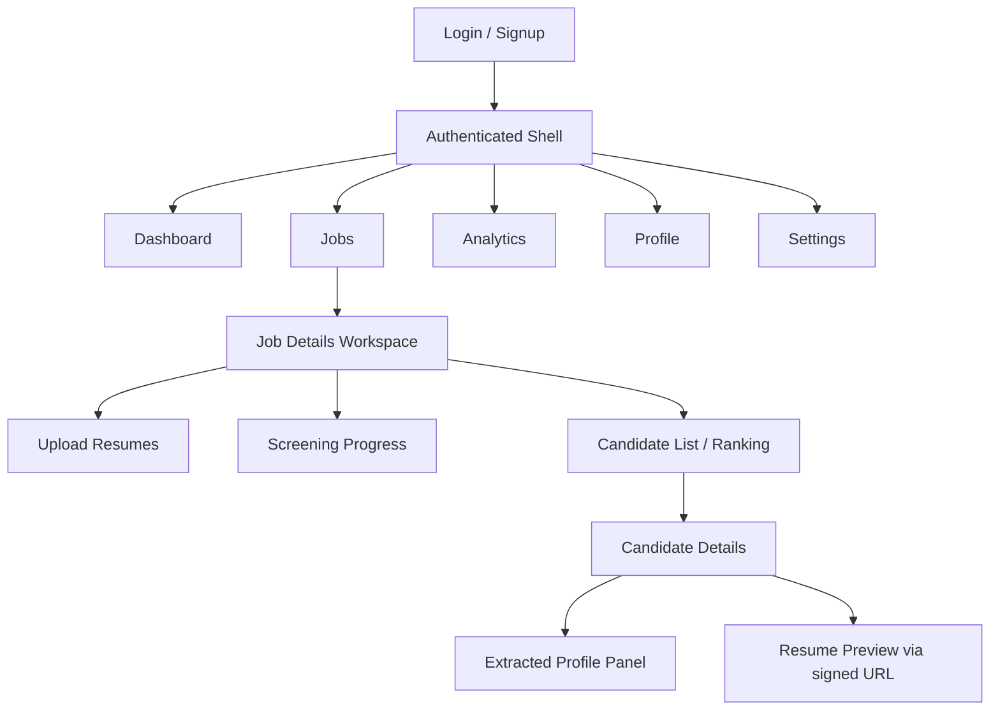
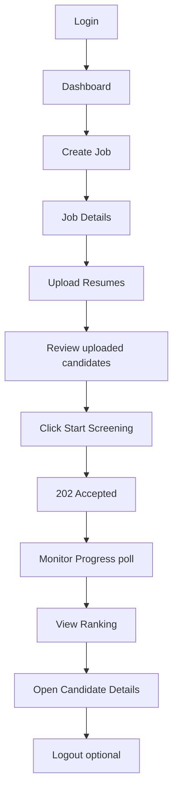
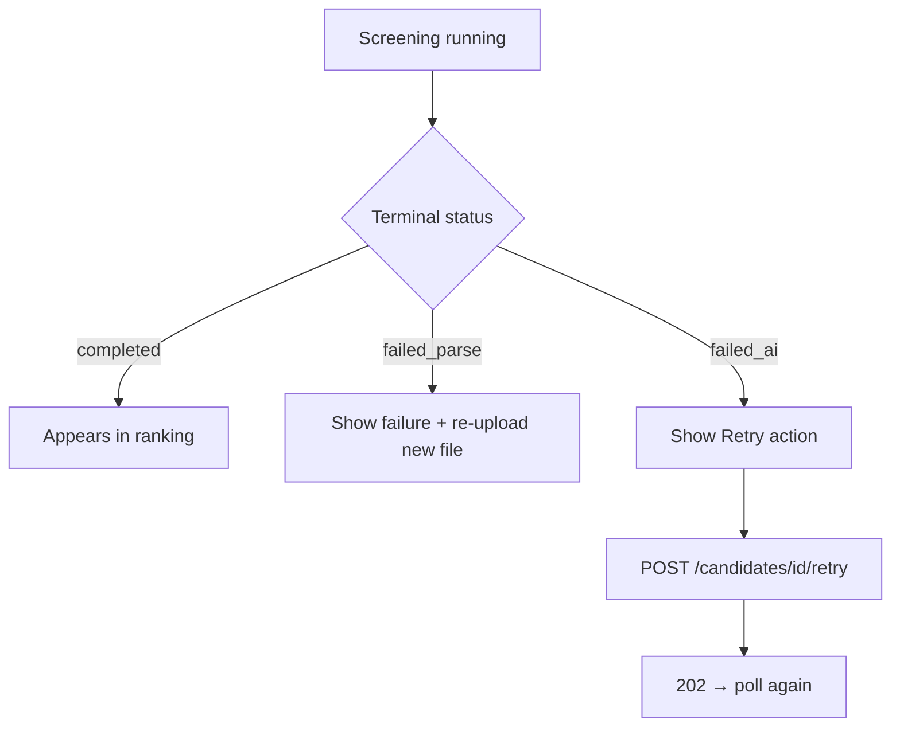

# ResumeRank AI

# UI/UX Design Document (UXD)

**Document 07 — RR-UIX-007**

---

## Cover Page

| | |
| --- | --- |
| **Project Name** | ResumeRank AI |
| **Document Title** | UI/UX Design Document |
| **Document Number** | Document 07 |
| **Document ID** | RR-UIX-007 |
| **Version** | 1.0.0 |
| **Status** | Baseline — Ready for Implementation Guidance |
| **Classification** | Internal — MBA Final Year Project |
| **Specialization** | Artificial Intelligence & Data Science |
| **Document Type** | UI/UX Design (React / Tailwind CSS / shadcn/ui) |
| **Author** | Vish Var |
| **Role** | Senior Product Designer / Senior Frontend Architect |
| **Organization** | ResumeRank AI Development Team |
| **Prepared For** | Development, QA, and Academic Evaluation Teams |
| **Date** | 12 July 2026 |
| **Upstream Dependencies** | RR-ARCH-001 v2.0.0; RR-PRD-002 v1.0.0; RR-SRS-003 v1.1.0; RR-SDD-004 v1.1.0; RR-DB-005 v1.1.0; RR-API-006 v1.1.0 |
| **Governing Plan** | Documentation Roadmap (RR-DOC-000) |
| **Next Document** | AI Design Document (RR-AI-008) |

---

### Document Control Statement

This UI/UX Design Document specifies the information architecture, journeys, screens, components, forms, states, accessibility, and UI traceability for ResumeRank AI.

It derives entirely from the approved Architecture, PRD, SRS v1.1, SDD v1.1, DDD v1.1, and ADS v1.1. It does **not** invent undocumented product features and does **not** modify business rules BR-01–BR-12.

Authoritative screening UX follows ADS v1.1: **Upload → Review (`uploaded`) → Start Screening → 202 → Poll**. Auto-enqueue (ST-02) is **not** adopted.

Design-only: no React implementation code, no CSS hex palette lock-in beyond semantic roles, no Figma binaries.

---

## Version History

| Version | Date | Author | Description of Change | Review Status |
| --- | --- | --- | --- | --- |
| 0.1.0 | 12 July 2026 | Vish Var | Outline from ADS v1.1 workflows and SRS use cases | Draft |
| 1.0.0 | 12 July 2026 | Vish Var | Complete UI/UX design with screens, components, journeys, wireframes, traceability, and UX Architecture Review | Current |

---

## Table of Contents

1. [Introduction](#1-introduction)
2. [Design Principles](#2-design-principles)
3. [User Roles](#3-user-roles)
4. [Information Architecture](#4-information-architecture)
5. [User Journey](#5-user-journey)
6. [Screen Inventory](#6-screen-inventory)
7. [Component Library](#7-component-library)
8. [Forms](#8-forms)
9. [Candidate Ranking UI](#9-candidate-ranking-ui)
10. [Dashboard Design](#10-dashboard-design)
11. [Interaction Design](#11-interaction-design)
12. [Responsive Design](#12-responsive-design)
13. [Accessibility](#13-accessibility)
14. [UI State Management](#14-ui-state-management)
15. [Design Tokens](#15-design-tokens)
16. [Wireframes](#16-wireframes)
17. [UI Traceability](#17-ui-traceability)
18. [Future UX Enhancements](#18-future-ux-enhancements)
19. [Conclusion](#19-conclusion)
20. [UX Architecture Review](#20-ux-architecture-review)
21. [Appendices](#21-appendices)

---

## List of Figures

| Figure | Title | Section |
| --- | --- | --- |
| F-01 | Navigation Hierarchy | §4.1 |
| F-02 | Primary Screening Journey | §5.1 |
| F-03 | Failure & Retry Journey | §5.2 |
| F-04 | Wireframe — Dashboard | §16.1 |
| F-05 | Wireframe — Job Details | §16.2 |
| F-06 | Wireframe — Candidate Details | §16.3 |
| F-07 | Wireframe — Analytics | §16.4 |
| F-08 | Wireframe — Upload | §16.5 |

---

## References

| ID | Reference |
| --- | --- |
| REF-01 | RR-DOC-000 Documentation Roadmap |
| REF-02 | RR-ARCH-001 Project Architecture v2.0.0 |
| REF-03 | RR-PRD-002 Product Requirements Document v1.0.0 |
| REF-04 | RR-SRS-003 Software Requirements Specification v1.1.0 |
| REF-05 | RR-SDD-004 System Design Document v1.1.0 |
| REF-06 | RR-DB-005 Database Design Document v1.1.0 |
| REF-07 | RR-API-006 API Design Specification v1.1.0 |
| REF-08 | shadcn/ui / Radix primitives (conceptual component patterns) |

---

## 1. Introduction

### 1.1 Purpose

Define a production-oriented UI/UX specification for the ResumeRank AI SPA so frontend implementation can deliver the approved HR screening workflow without inventing product scope.

### 1.2 Scope

**In scope:** Authenticated SPA screens, navigation, journeys, components (shadcn/ui patterns), forms, ranking/dashboard UX, responsive/a11y goals, UI states (including polling), design tokens (semantic), wireframes, traceability.

**Out of scope:** Pixel-perfect mockups, dark-mode requirement, candidate portal, HM RBAC, ATS, email, OCR, auto-hire UI, implementation code.

### 1.3 Design Goals

| Goal | UI Response |
| --- | --- |
| Explicit human control | **Start Screening** CTA; no auto-enqueue |
| Status visibility | Authoritative badges + job progress (SRS-NFR-014) |
| Non-blocking async UX | 202 accept + poll (SRS-NFR-011) |
| Evidence for decisions | Ranking + detail with score/rationale/summary/CE fields |
| Owner isolation | Route guards; no cross-user data |

### 1.4 Target Users

Primary: **HR Recruiter** (UC-L-01). Academic Evaluator (UC-L-03) uses the same UI on demo accounts. System Operator (UC-L-02) has **no** distinct in-app admin console.

### 1.5 Accessibility Goals

Follow WCAG 2.2 AA–oriented practices where feasible with shadcn/ui + semantic HTML (SRS-NFR-015 Should): keyboard access, visible focus, label association, live regions for toasts/errors, sufficient contrast via semantic tokens.

### 1.6 Responsive Design Goals

Desktop-first; usable on tablet (SRS-NFR-016 Should). Mobile is supported with stacked layouts; not a native-app experience.

---

## 2. Design Principles

| Principle | Application |
| --- | --- |
| Consistency | Shared status badges, ErrorObject toasts, table patterns |
| Minimalism | One primary CTA per view; avoid marketing clutter |
| Visibility of system status | Badges, progress summary, polling indicators |
| Recognition over recall | Persistent nav; job context breadcrumb |
| Error prevention | Disable Start Screening when no eligible candidates / missing JD / archived |
| Accessibility | Keyboard, ARIA, contrast §13 |
| Responsive layout | Breakpoints §12 |
| Performance | Skeletons; lean dashboard queries; poll backoff |

---

## 3. User Roles

| Role | Source | In-app permissions | Navigation differences |
| --- | --- | --- | --- |
| **HR Recruiter** | UC-L-01 | Full owner capabilities on own jobs/candidates | Full app nav |
| **Administrator / System Operator** | UC-L-02 | **No in-app admin UI** in v1; operational via Deployment Guide | Same as HR if using a demo account; no extra nav |
| **Academic Evaluator** | UC-L-03 | Same as HR Recruiter on provided demo account | Same nav; no distinct role chrome |

**Permissions:** JWT session required for all app routes except Login/Signup. Ownership enforced by API/RLS (BR-09). No role switcher.

---

## 4. Information Architecture

### 4.1 Navigation Hierarchy



| Nav item | Route (conceptual) | Purpose |
| --- | --- | --- |
| Dashboard | `/` or `/dashboard` | Cross-job metrics (UC-08) |
| Jobs | `/jobs` | List/create/open jobs |
| Job Details | `/jobs/{id}` | Workspace: upload, screen, rank |
| Analytics | `/analytics` | Distributions / job analytics (Should widgets) |
| Profile | `/profile` | Read profile |
| Settings | `/settings` | Sign-out + session info (minimal) |

**Not in nav:** Candidates global list (candidates are job-scoped); Admin console.

---

## 5. User Journey

### 5.1 Primary Journey — Login → Rank



### 5.2 Failure & Retry Journey



### 5.3 Journey Catalog

| Journey | Steps | Primary APIs |
| --- | --- | --- |
| Login | Enter credentials → session → redirect Dashboard | Auth sign-in |
| Create Job | Open Create → title+JD → save → Job Details | `POST /jobs` |
| Upload Resume | Select files → validate → upload → **201 uploaded** | Storage + candidates |
| Start Screening | Review list → Start Screening → **202** | `POST /jobs/{id}/screen` |
| Monitor Progress | Poll badges + progress summary | candidates status + `job_progress_summary` |
| View Candidate | Open row → detail panels + signed resume | candidates nest + `GET .../resume` |
| Rank Candidates | Ranking table ordered per ADS §7.5 | `candidate_ranking` |
| Archive Job | Confirm archive → list updates | PATCH `lifecycle_status` |
| Logout | Confirm → clear session → Login | Auth sign-out |

---

## 6. Screen Inventory

Convention for each screen: Purpose · User Story · Components · Data · APIs · Validation · Loading · Empty · Error · Success · A11y · Responsive · Navigation.

### 6.1 Login

| Field | Specification |
| --- | --- |
| Purpose | Authenticate HR user (UC-01) |
| User Story | As an HR recruiter, I sign in to access my jobs |
| Components | AuthCard, Form, Input, Button, Link to Signup, Alert |
| Data | email, password |
| APIs | Auth sign-in; session validation |
| Validation | Required email/password; EH-AUTH on failure |
| Loading | Button loading; disable submit |
| Empty | N/A |
| Error | Inline Alert from ErrorObject |
| Success | Redirect Dashboard |
| A11y | Labels; autocomplete; focus email |
| Responsive | Centered card |
| Navigation | → Dashboard; link → Signup |

### 6.2 Signup (paired with Login)

Same shell as Login; Auth signup; then Dashboard or email-confirm message if platform requires.

### 6.3 Dashboard

| Field | Specification |
| --- | --- |
| Purpose | Cross-job summary (UC-08, SRS-FR-033) |
| User Story | As HR, I see jobs/candidates/completed at a glance |
| Components | StatCards, optional Charts, RecentJobsList, Button(Create Job), Skeleton |
| Data | `active_jobs`, `total_candidates`, `completed_count`, `failed_count`, `avg_match_score` |
| APIs | `GET dashboard_metrics`; `GET jobs` (recent) |
| Validation | N/A |
| Loading | Skeleton cards |
| Empty | “No jobs yet” + Create Job CTA |
| Error | Toast ErrorObject; retry |
| Success | Populated metrics |
| A11y | Headings; card labels |
| Responsive | 4→2→1 card grid |
| Navigation | Jobs, Analytics, Create Job |

### 6.4 Create Job

| Field | Specification |
| --- | --- |
| Purpose | Create job with JD (UC-03, SRS-FR-005) |
| Components | Form, Input(title), Textarea(JD), Button(Save), Button(Cancel) |
| APIs | `POST /jobs` → 201 |
| Validation | VR-01/VR-02 non-empty title & JD |
| Loading | Submit spinner |
| Error | Field errors + toast |
| Success | Navigate Job Details |
| Navigation | Back to Jobs |

### 6.5 Edit Job

| Field | Specification |
| --- | --- |
| Purpose | Update title/JD on **active** job (SRS-FR-007 Should) |
| APIs | `GET job`; `PATCH job` |
| Validation | Non-empty; archived → blocked message |
| Success | Toast + stay on Job Details |

### 6.6 Job List

| Field | Specification |
| --- | --- |
| Purpose | List owned jobs (SRS-FR-006) |
| Components | Table/Cards, Search, Filter(lifecycle), Badge, Button(Create), Pagination |
| Data | title, lifecycle_status, created_at, optional candidate counts |
| APIs | `GET jobs` default `active`; archived filter; title `ilike` |
| Empty | Create Job CTA |
| Loading | Table skeleton |
| Navigation | Row → Job Details; Archive/Delete actions |

### 6.7 Job Details (Workspace)

| Field | Specification |
| --- | --- |
| Purpose | Hub for upload, screen, progress, ranking (UC-04–07, UC-09–10) |
| Components | PageHeader, Tabs or Sections (Overview / Candidates / Analytics), UploadZone, **Start Screening** Button, ProgressSummary, RankingTable, StatusFilter, ConfirmDialog(Archive) |
| Data | Job fields; candidates; progress counts |
| APIs | GET job; GET candidates; GET job_progress_summary; GET candidate_ranking; POST screen; PATCH archive; DELETE if empty |
| Validation | Start Screening disabled if: no eligible (`uploaded`/`queued`), missing JD, job archived |
| Loading | Section skeletons; screening poll indicator |
| Empty | No candidates → prompt Upload |
| Error | Per-action ErrorObject |
| Success | After screen: toast “Processing accepted”; badges → `queued` |
| Navigation | Candidate row → Candidate Details; Upload section |

**Primary CTA label:** **Start Screening** (ST-01).

### 6.8 Upload Resumes

| Field | Specification |
| --- | --- |
| Purpose | Batch upload PDF/DOCX (UC-04) |
| Components | FileUpload, FileList, Progress per file, Alert |
| APIs | Storage PUT; `POST candidates` / `resume_files` → **201 `uploaded`**; **no screen call** |
| Validation | PDF/DOCX; ≤5MB; reject empty; per-file EH-VAL |
| Loading | Per-file progress |
| Empty | Dropzone prompt |
| Error | Per-file error row; siblings continue |
| Success | List shows accepted as `uploaded`; CTA hint: “Review then Start Screening” |
| Responsive | Full-width dropzone |

### 6.9 Screening Progress

| Field | Specification |
| --- | --- |
| Purpose | Aggregate status during/after screening (SRS-FR-038) |
| Components | ProgressSummary widgets, StatusDistribution, Spinner/Pulse “Updating…” |
| APIs | `job_progress_summary`; poll candidates status |
| Loading | Initial skeleton; then quiet poll |
| Empty | Before screen: “Not started” |
| Terminal | Stop poll when all in `{completed, failed_parse, failed_ai, archived}` |

### 6.10 Candidate List / Ranking

| Field | Specification |
| --- | --- |
| Purpose | Job-scoped list + ranking (SRS-FR-027–032) |
| Components | RankingTable (§9), Filters, Search, Pagination, StatusBadge, ScoreIndicator, RowActions(Retry if failed_ai) |
| APIs | `candidate_ranking` (frozen ordered collection); optional list filter endpoint |
| Empty | No candidates / none completed yet messaging |
| Loading | Table skeleton |
| Navigation | Row → Candidate Details |

### 6.11 Candidate Details

| Field | Specification |
| --- | --- |
| Purpose | Evidence view (UC-07, SRS-FR-029, 048–050) |
| Components | StatusBadge, ScoreIndicator, AI Summary panel, Rationale panel, Extracted Profile, ResumePreview, Button(Retry if failed_ai), Back |
| APIs | Nested candidate GET; `GET /candidates/{id}/resume`; evaluations |
| Loading | Panel skeletons |
| Error | Failure banner with `failure_message` |
| A11y | Headings hierarchy; AI text as plain text (no HTML inject) |

### 6.12 Candidate Profile (panel within Details)

Displays CE-01–CE-14 sparse fields; empty fields show “Not found in resume” (not errors).

### 6.13 Analytics Dashboard

| Field | Specification |
| --- | --- |
| Purpose | Should widgets FR-34–36 + Must FR-33 overlap |
| Components | Charts (status distribution, score buckets), JobSelector, StatCards |
| APIs | `dashboard_metrics`, `screening_statistics`, `score_distribution` (job or owner scope) |
| Empty | Insufficient completed scores message |
| Constraint | No raw resume text in widgets |

### 6.14 Profile

Read-only `profiles` fields; link to Settings for sign-out.

### 6.15 Settings

**Minimal (ADS-backed only):** display email/name; **Sign out** button; optional session expiry info.  
**No** notification prefs, theme toggle (not required), org admin, password-change API (unless Auth SDK provides — document as platform Auth UI if used).

### 6.16 System Screens

| Screen | Behavior |
| --- | --- |
| **404** | “Page not found”; link Dashboard/Jobs |
| **Unauthorized (401)** | Redirect Login with return URL |
| **403 Forbidden** | Safe message; no data leak |
| **Empty States** | Per-screen CTAs above |
| **Loading States** | Skeletons / button spinners |
| **Error States** | Inline + toast from ErrorObject |

---

## 7. Component Library

Library baseline: **shadcn/ui** primitives. Conceptual props only.

| Component | Purpose | Variants / States | Usage rules |
| --- | --- | --- | --- |
| Button | Actions | default, secondary, destructive, outline, ghost; loading; disabled | One primary per section; Start Screening = primary |
| Card | Group content | default | Stats, panels — not for hero marketing |
| Table | Lists/ranking | sortable header (visual), loading skeleton rows | Always define empty |
| Dialog | Confirmations | open/closed | Archive, delete, destructive confirms |
| Drawer | Optional mobile filters | — | Tablet/mobile filter sheet |
| Form | Field grouping | — | RHF/native + zod patterns at impl |
| Input / Textarea | Text entry | error, disabled | Labels required |
| Select / Combobox | Filters | — | Status filter |
| Tabs | Job workspace sections | — | Overview / Candidates / Analytics |
| Badge | Status / lifecycle | semantic colors by status | Map authoritative statuses §7.1 |
| Progress | Upload / job % | determinate/indeterminate | |
| Skeleton | Loading | — | Prefer over blank |
| Toast | Feedback | success/error | ErrorObject.message |
| Pagination | Lists | — | limit/offset v1 |
| Search | Jobs / candidates | — | Debounced |
| FilterBar | Status chips | — | |
| Chart | Analytics | bar/donut conceptual | Only ADS metrics |
| Icon | Affordances | — | Decorative aria-hidden |
| FileUpload | Resumes | drag-drop optional enhancement; click required | PDF/DOCX only |
| RankingRow | Rank line | — | Uses frozen order |
| StatusBadge | Candidate status | per status | Distinct failure vs processing |
| ScoreIndicator | 0–100 display | null for non-completed | |

**StatusBadge mapping:** `uploaded`, `queued`, `parsing`, `parsed`, `ai_processing`, `completed`, `failed_parse`, `failed_ai`, `archived` — visually distinct groups: waiting / in-progress / success / failure / archived.

---

## 8. Forms

### 8.1 Login

| Field | Label | Placeholder | Required | Validation | Error | API |
| --- | --- | --- | --- | --- | --- | --- |
| email | Email | you@company.com | Yes | Email format | “Enter a valid email” | Auth |
| password | Password | •••••• | Yes | Non-empty | “Password is required” | Auth |

### 8.2 Create Job / Edit Job

| Field | Label | Required | Validation | Error | API |
| --- | --- | --- | --- | --- | --- |
| title | Job title | Yes | Non-empty (VR-01) | “Title is required” | jobs.title |
| jd_text | Job description | Yes | Non-empty (VR-02) | “Job description is required” | jobs.jd_text |

### 8.3 Upload Resume

| Field | Label | Required | Validation | Error | API |
| --- | --- | --- | --- | --- | --- |
| files | Resumes | ≥1 | PDF/DOCX; ≤5MB; non-empty | Per-file EH-VAL message | Storage + candidates |

### 8.4 Search

| Field | Label | Required | Validation | API |
| --- | --- | --- | --- | --- |
| q | Search jobs | No | Max length | jobs title ilike |
| status | Status filter | No | Enum | candidates status |

### 8.5 Profile / Settings

| Field | Notes |
| --- | --- |
| email / full_name | Read-only from profiles |
| Sign out | Action button, not a field |

---

## 9. Candidate Ranking UI

| Element | Design |
| --- | --- |
| Ranking table | Single ordered collection (ADS §7.5): completed first by score DESC; then lifecycle groups |
| Sorting | Server order frozen; UI does not re-sort completed above others |
| Filtering | Status filter / chips (Should) |
| Status badges | Authoritative statuses |
| Score visualization | Numeric + optional bar; `—` when null |
| Candidate cards | Optional mobile card layout mirroring rows |
| AI Summary panel | On detail (and optional truncated column) |
| Resume preview | Open via signed URL (`GET /candidates/{id}/resume`); new tab or embedded PDF viewer if feasible |
| Row actions | View; **Retry** only if `failed_ai` and job active |

**No** auto-reject/hire buttons (BR-02).

---

## 10. Dashboard Design

| Widget | Source | Priority |
| --- | --- | --- |
| Active jobs | dashboard_metrics.active_jobs | Must |
| Total candidates | total_candidates | Must |
| Completed evaluations | completed_count | Must |
| Failed count | failed_count | Supports Should |
| Avg match score | avg_match_score | Should |
| Status distribution chart | status_counts / screening_statistics | Should |
| Score buckets chart | score_buckets / score_distribution | Should |
| Recent jobs | jobs list | UX aid |
| Top candidates | Optional: link into a recent job’s ranking — **no global top without job scope** unless derived from owner metrics only | Keep job-scoped to avoid invented aggregation |
| Activity | Prefer “Recent jobs” over inventing activity feed | No activity API in ADS |

Job workspace analytics tab reuses `job_progress_summary`, `screening_statistics`, `score_distribution`.

---

## 11. Interaction Design

| Interaction | Behavior |
| --- | --- |
| Start Screening | Confirm optional if >N files; then POST screen; toast 202; start poll |
| Archive Job | ConfirmDialog: blocks uploads/screening; data retained |
| Delete Job | Confirm; if 409 show archive guidance |
| Retry | Confirm optional; POST retry; toast 202 |
| Hover | Row highlight; button hover states |
| Focus | Visible ring on all controls |
| Keyboard | Tab order; Enter submits forms; Esc closes dialog |
| Table actions | Icon buttons with aria-labels |
| Bulk actions | **Not in v1 Must** — multi-select retry not required; optional later |
| Navigation | Unsaved edit job → confirm leave |

---

## 12. Responsive Design

| Breakpoint (conceptual) | Layout |
| --- | --- |
| Desktop (≥1024) | Sidebar + content; full tables |
| Tablet (768–1023) | Collapsible nav; tables scroll or cardize |
| Mobile (<768) | Bottom/top nav sheet; stacked cards; upload full width |

| Area | Adaptation |
| --- | --- |
| Navigation | Sidebar → Sheet |
| Tables | Horizontal scroll or cards |
| Uploads | Large tap target |
| Charts | Simplify to key stats on small screens |

---

## 13. Accessibility

| Topic | Requirement |
| --- | --- |
| WCAG | Aim AA for core flows |
| Keyboard | All actions reachable |
| ARIA | Dialog labels; live region for toasts; progress `aria-busy` |
| Contrast | Semantic tokens meet contrast targets |
| Focus | Trap in dialogs; restore on close |
| Screen readers | Status text not color-only; include text on badges |
| Errors | Associate `aria-describedby`; announce ErrorObject.message |

---

## 14. UI State Management

| State | Behavior |
| --- | --- |
| Loading | Skeletons / spinners |
| Empty | CTA guidance |
| Success | Toast / inline |
| Failure | ErrorObject; field or toast |
| Offline | Banner “You appear offline”; disable screen/upload |
| Retry | For failed_ai row/detail; for failed API fetch “Try again” |
| Polling | 3s default; backoff 10–15s; indicator; stop on terminals |
| Terminal | completed / failed_parse / failed_ai / archived |

---

## 15. Design Tokens

Semantic only (exact hex chosen at implementation; avoid default AI purple/cream clichés per project frontend rules when selecting palette).

| Token role | Use |
| --- | --- |
| color.background / surface / border | App chrome |
| color.text / muted | Typography |
| color.primary | Primary CTAs (Start Screening) |
| color.danger / warning / success | Failures / in-progress / completed |
| color.focus | Focus ring |
| font.sans / font.display | UI + headings (expressive, non-default Inter-only stack preferred) |
| space.1…8 | Spacing scale |
| radius.sm/md | Controls (not oversized pills everywhere) |
| elevation.sm | Dialogs/dropdowns sparingly |
| grid | 12-col desktop content |

Icons: consistent set (e.g., Lucide via shadcn).

---

## 16. Wireframes

### 16.1 Dashboard

```text
+--------------------------------------------------+
| Logo   Dashboard  Jobs  Analytics   Profile  [ ] |
+--------------------------------------------------+
| Active Jobs | Candidates | Completed | Avg Score |
+--------------------------------------------------+
| Recent Jobs                          [Create Job]|
|  - SE Engineer (active)                          |
|  - ...                                           |
+--------------------------------------------------+
```

### 16.2 Job Details

```text
+--------------------------------------------------+
| Jobs / SE Engineer          [Archive] [Edit]     |
| JD preview...                                    |
| [Upload Resumes]     [ Start Screening ]         |
| Progress: uploaded 5 | queued 0 | completed 0 ...|
| Filter: All | uploaded | failed_*                |
| Ranking / Candidates table                       |
+--------------------------------------------------+
```

### 16.3 Candidate Details

```text
+--------------------------------------------------+
| <- Back   Jane Doe   [completed]  Score 88       |
| [Open Resume]   [Retry if failed_ai]             |
| Summary | Rationale                              |
| Extracted Profile (CE fields)                    |
+--------------------------------------------------+
```

### 16.4 Analytics

```text
+--------------------------------------------------+
| Analytics     [Job filter]                       |
| Status distribution chart | Score buckets chart  |
| Job progress table                               |
+--------------------------------------------------+
```

### 16.5 Upload

```text
+--------------------------------------------------+
| Upload to: SE Engineer                           |
| [==== Drop PDF/DOCX or Browse ====]              |
| file1.pdf  OK uploaded                           |
| file2.exe  ERR unsupported type                  |
| Next: Review list, then Start Screening          |
+--------------------------------------------------+
```

---

## 17. UI Traceability

| PRD / Capability | SRS | API (ADS v1.1) | Screen | Components |
| --- | --- | --- | --- | --- |
| Auth | FR-001–004, UC-01–02 | Auth APIs | Login, Settings | Form, Button |
| Jobs | FR-005–009, 046–047, UC-03 | Jobs CRUD/archive/delete | Job List, Create, Edit, Details | Table, Form, Dialog |
| Upload | FR-010–014, 017, UC-04 | Storage + candidates 201 | Upload, Job Details | FileUpload, Alert |
| Start Screening | ST-01, UC-05, NFR-011 | `POST /jobs/{id}/screen` 202 | Job Details | Button, Toast, Progress |
| Retry | FR-025, UC-10 | `POST /candidates/{id}/retry` | List/Detail | Button |
| Ranking | FR-027–032, UC-06 | candidate_ranking | Candidate List | Table, Badge, Score |
| Detail / CE | FR-029, 048–050, UC-07 | candidates nest + resume | Candidate Details | Panels, Badge |
| Failures | FR-030, 039, UC-09 | failure fields | List/Detail | Badge, Alert |
| Dashboard | FR-033, UC-08 | dashboard_metrics | Dashboard | StatCards |
| Analytics Should | FR-034–036 | stats/distribution views | Analytics, Job tab | Charts |
| No auto-hire | FR-026 | none | — | **No controls** |
| Progress | FR-038 | job_progress_summary | Screening Progress | Progress widgets |

**API coverage check:** Auth, jobs, upload, screen, retry, poll, ranking, detail, resume signed URL, dashboard, analytics views, archive/delete — each consumed by ≥1 screen above.

---

## 18. Future UX Enhancements

Dark mode · Notifications · Realtime status · Drag-drop polish · Interview scheduling · Email · Advanced filters · CSV export (Could) · Evaluation history compare — **not v1 Must**.

---

## 19. Conclusion

| Upstream | How UI supports it |
| --- | --- |
| PRD | Jobs, upload, rank, analytics, human-in-the-loop |
| SRS | UC-01–10; status visibility; async UX |
| SDD | SPA modules; polling |
| DDD | Status vocabulary; view metrics |
| ADS v1.1 | Explicit screen workflow; ranking model; signed resume; ErrorObject |

Baseline for Cursor implementation and RR-DEV-012.

---

## 20. UX Architecture Review

| Issue | Severity | Recommendation | Affected Section |
| --- | --- | --- | --- |
| Settings surface is intentionally thin vs typical SaaS settings | **Minor** | Keep minimal; do not invent prefs without API | §6.15 |
| Top Candidates on Dashboard could invent non-job-scoped ranking | **Major** | Prefer Recent Jobs only; avoid global top list without ADS view | §10 |
| Bulk retry not specified | **Observation** | Acceptable — not Must | §11 |
| Exact visual palette deferred to tokens | **Observation** | Choose non-cliché palette at implementation | §15 |
| Mobile table UX relies on scroll/cards | **Minor** | Prototype card fallback early | §12 |
| Evaluation history UI not Must | **Observation** | Correct omission | §6.11 |
| Polling UX noise if too aggressive | **Minor** | Follow 3s + backoff; subtle indicator | §14 |
| Start Screening discoverability after upload | **Major** | Persistent primary CTA + post-upload guidance copy | §6.7–6.8 |
| Administrator role has no unique UI | **Observation** | Aligns SRS UC-L-02 | §3 |
| Chart library choice unspecified | **Minor** | Pick one compatible with React at impl | §7, §10 |
| Signup email-confirm edge cases platform-dependent | **Minor** | Follow Supabase Auth UX | §6.2 |
| Traceability dense but complete for Must path | **Observation** | Pass | §17 |

### UX Maturity Score: **8.2 / 10**

| Dimension | Score |
| --- | --- |
| Journey completeness (ADS-aligned) | 9 |
| Screen coverage | 8.5 |
| State/error completeness | 8 |
| Accessibility specification | 7.5 |
| Responsive specification | 8 |
| Component consistency | 8 |
| Traceability | 8.5 |
| Restraint (no invented features) | 9 |

### Freeze Recommendation

**Conditionally ready as implementation baseline for Cursor**, provided:

1. Dashboard does **not** invent a global Top Candidates feed.  
2. Start Screening remains the only path to queue work after upload.  
3. Settings remain API-backed minimal.

**Disposition:** **Accept RR-UIX-007 v1.0.0** as UI baseline for RR-AI-008 / implementation scaffolding.

---

## 21. Appendices

### Appendix A — Primary CTA Copy

| Action | Label |
| --- | --- |
| Create job | Create Job |
| Upload | Upload Resumes |
| Screen | **Start Screening** |
| Retry | Retry Screening |
| Archive | Archive Job |
| Open resume | Open Resume |

### Appendix B — Document Control

| Item | Value |
| --- | --- |
| Path | `docs/02-design/07-UI-UX-Design-Document.md` |
| Version | 1.0.0 |
| Upstream | Architecture, PRD, SRS v1.1, SDD v1.1, DDD v1.1, ADS v1.1 |
| Next | RR-AI-008 AI Design Document |

---

**End of Document — Document 07 — RR-UIX-007 — UI/UX Design Document v1.0.0**
