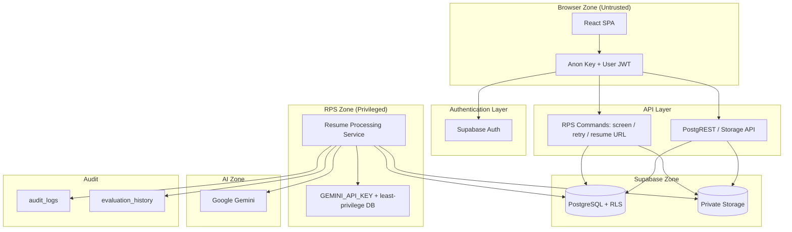
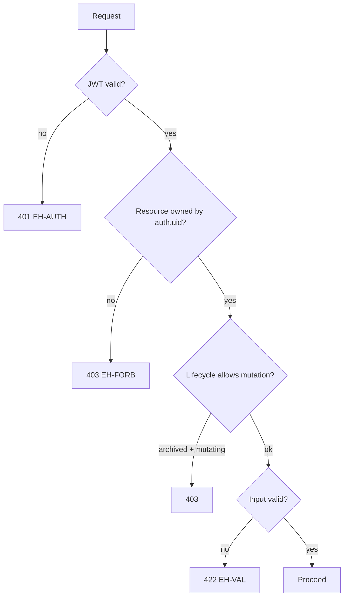
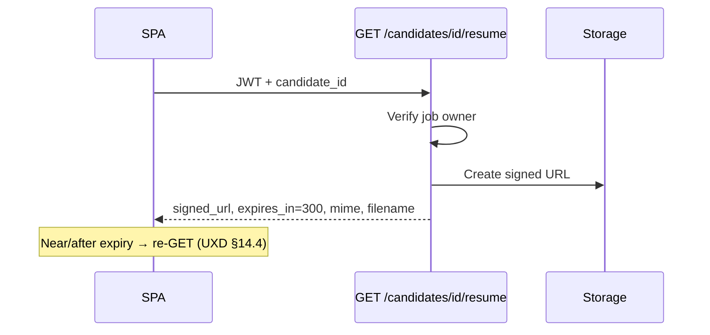
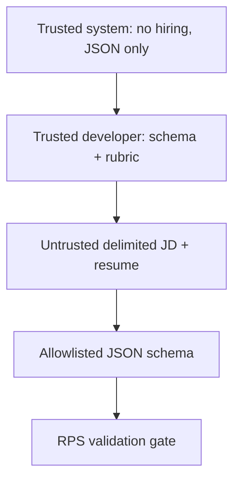
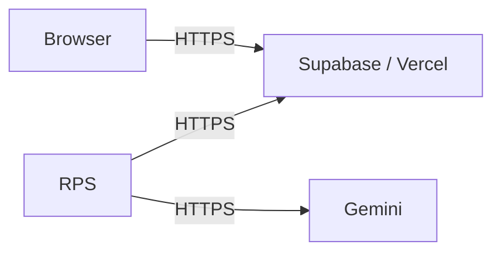

# ResumeRank AI

# Security Design Document (SDoc)

**Document 09 — RR-SEC-009**

---

## Cover Page

| | |
| --- | --- |
| **Project Name** | ResumeRank AI |
| **Document Title** | Security Design Document |
| **Document Number** | Document 09 |
| **Document ID** | RR-SEC-009 |
| **Version** | 1.0.0 |
| **Status** | Baseline — Ready for Implementation Guidance |
| **Classification** | Internal — MBA Final Year Project |
| **Specialization** | Artificial Intelligence & Data Science |
| **Document Type** | Security Design (Supabase / SaaS / Gemini) |
| **Author** | Vish Var |
| **Role** | Principal Security Architect |
| **Organization** | ResumeRank AI Development Team |
| **Prepared For** | Development, QA, and Academic Evaluation Teams |
| **Date** | 12 July 2026 |
| **Upstream Dependencies** | RR-ARCH-001 v2.0.0; RR-PRD-002 v1.0.0; RR-SRS-003 v1.1.0; RR-SDD-004 v1.1.0; RR-DB-005 v1.1.0; RR-API-006 v1.1.0; RR-UIX-007 v1.1.0; RR-AI-008 v1.0.0 |
| **Governing Plan** | Documentation Roadmap (RR-DOC-000) |
| **Next Document** | Testing Document (RR-TEST-010) |

---

### Document Control Statement

This Security Design Document specifies authentication, authorization, conceptual Row Level Security (RLS), storage controls, API hardening, AI/prompt security, data protection, threat modeling, logging/auditing, operational security, and compliance posture for ResumeRank AI.

It derives entirely from the approved Architecture, PRD, SRS v1.1, SDD v1.1, DDD v1.1, ADS v1.1, UXD v1.1, and AID v1.0.0. It does **not** invent undocumented product features and does **not** modify business rules BR-01–BR-12.

Design-only: **no SQL RLS/Storage policy code**, no application source, no OpenAPI. Conceptual policies and control matrices guide Cursor implementation. ST-02 auto-enqueue is **not** adopted. Gemini credentials remain **only** in the Resume Processing Service (BR-05).

---

## Version History

| Version | Date | Author | Description of Change | Review Status |
| --- | --- | --- | --- | --- |
| 0.1.0 | 12 July 2026 | Vish Var | Outline from SDD §10, DDD §11, ADS §10–11, AID §11 | Draft |
| 1.0.0 | 12 July 2026 | Vish Var | Complete security design with STRIDE threat model, control matrices, traceability, and Security Architecture Review | Current |

---

## Table of Contents

1. [Introduction](#1-introduction)
2. [Security Architecture](#2-security-architecture)
3. [Authentication](#3-authentication)
4. [Authorization](#4-authorization)
5. [Row Level Security (RLS)](#5-row-level-security-rls)
6. [Storage Security](#6-storage-security)
7. [API Security](#7-api-security)
8. [AI Security](#8-ai-security)
9. [Data Protection](#9-data-protection)
10. [Threat Model](#10-threat-model)
11. [Logging & Auditing](#11-logging--auditing)
12. [Error Handling](#12-error-handling)
13. [Operational Security](#13-operational-security)
14. [Compliance Considerations](#14-compliance-considerations)
15. [Security Traceability](#15-security-traceability)
16. [Future Security Enhancements](#16-future-security-enhancements)
17. [Conclusion](#17-conclusion)
18. [Security Architecture Review](#18-security-architecture-review)
19. [Appendices](#19-appendices)

---

## List of Figures

| ID | Title | Section |
| --- | --- | --- |
| F-01 | Trust-zone security architecture | §2.2 |
| F-02 | Authentication sequence | §3.2 |
| F-03 | Authorization decision flow | §4.3 |
| F-04 | Storage signed-URL lifecycle | §6.3 |
| F-05 | Prompt isolation model | §8.2 |
| F-06 | PII data-flow zones | §9.3 |

---

## List of Tables

| ID | Title | Section |
| --- | --- | --- |
| T-01 | Security objectives map | §1.3 |
| T-02 | Permission matrix | §4.2 |
| T-03 | Conceptual RLS by entity | §5.2 |
| T-04 | Secret inventory | §9.4 |
| T-05 | STRIDE threat register | §10.2 |
| T-06 | Audit event catalog | §11.2 |
| T-07 | Client vs internal error mapping | §12.2 |
| T-08 | Security traceability matrix | §15.1 |

---

## References

| ID | Reference |
| --- | --- |
| REF-01 | RR-DOC-000 Documentation Roadmap |
| REF-02 | RR-ARCH-001 Project Architecture v2.0.0 |
| REF-03 | RR-PRD-002 Product Requirements Document v1.0.0 |
| REF-04 | RR-SRS-003 Software Requirements Specification v1.1.0 |
| REF-05 | RR-SDD-004 System Design Document v1.1.0 |
| REF-06 | RR-DB-005 Database Design Document v1.1.0 |
| REF-07 | RR-API-006 API Design Specification v1.1.0 |
| REF-08 | RR-UIX-007 UI/UX Design Document v1.1.0 |
| REF-09 | RR-AI-008 AI Design & Prompt Engineering Document v1.0.0 |
| REF-10 | OWASP Top 10 (conceptual mapping) |
| REF-11 | Supabase Auth, RLS, and Storage security guidance |

---

## 1. Introduction

### 1.1 Purpose

Define the authoritative security baseline for ResumeRank AI so implementers can apply authentication, authorization, RLS, storage, API, AI, and operational controls consistently with approved product and design documents.

### 1.2 Scope

| In scope | Out of scope |
| --- | --- |
| AuthN via Supabase email/password + JWT | MFA, OAuth/SSO (future) |
| Owner-only AuthZ + conceptual RLS | Multi-tenant org RBAC / Hiring Manager roles |
| Private resume storage + signed URLs | Public CDN resume hosting |
| API ErrorObject, idempotency, rate-limit posture | Full WAF/SIEM productization |
| AI prompt-injection & output validation | Fine-tuned model security product |
| PII classification & secret inventory | Formal GDPR DPA / legal counsel artifacts |
| STRIDE threat model for v1 surfaces | Red-team engagement reports |

### 1.3 Security Objectives

| Objective | Mapped requirements |
| --- | --- |
| Confidentiality of resumes & evaluations | SRS-NFR-002/003/004; BR-05; BR-09 |
| Integrity of scores & audit history | BR-03; BR-12; SRS-AI-003; SRS-SEC-005 |
| Availability for demo-scale SaaS | Partial batch success BR-04; bounded retries |
| Accountability | evaluation_history + audit_logs; prompt_version |
| Least privilege | Anon key in browser; RPS privileged zone only |
| Human oversight | BR-02 / BR-10 — no autonomous hire/reject |

### 1.4 Security Principles

1. **Defense in depth** — SPA route gates + JWT + RLS + RPS ownership re-check.  
2. **Least privilege** — Browser never holds service-role or Gemini keys (SRS-SEC-002, BR-05).  
3. **Fail closed** — Missing/expired JWT → 401; cross-owner → 403; invalid AI JSON → no `completed`.  
4. **Safe by default** — Private storage; signed URLs; ErrorObject without secrets.  
5. **Separation of duties (technical)** — Parsers do not authorize; AI does not mutate jobs; ranking reads validated evaluations only.  
6. **Assume untrusted content** — Resume and JD text are data, never instructions (AID §11).  

### 1.5 Architecture Context

ResumeRank AI is a React SPA on Vercel with Supabase (Auth, PostgreSQL, Storage) and a Resume Processing Service (RPS) that alone calls Google Gemini. Screening is async: **Upload → Start Screening → 202 → poll** (ADS v1.1).

### 1.6 Security Assumptions

| ID | Assumption |
| --- | --- |
| SA-01 | Supabase Auth, Postgres, and Storage are configured with HTTPS and platform-managed encryption at rest |
| SA-02 | Vercel/Supabase/Gemini operate under their managed SLAs; app designs for partial failure |
| SA-03 | Demo tenants are single-owner HR users (no org multi-tenancy in v1) |
| SA-04 | Academic evaluators use the same HR capability model on a demo account (SRS UC-L-03) |
| SA-05 | Platform Auth password policy is enabled at project level (min length/complexity as configured) |
| SA-06 | Operators do not commit secrets to git; `.env.example` lists names only |
| SA-07 | RPS runtime can reach only Supabase Storage/DB and Gemini HTTPS endpoints |

### 1.7 Out of Scope (Intentional)

MFA · OAuth/SSO · CAPTCHA · malware/AV scanning · SIEM · candidate portal · multi-role RBAC · ST-02 auto-enqueue · OCR · auto-hire/reject · PagerDuty-class alerting · formal legal GDPR certification.

---

## 2. Security Architecture

### 2.1 Components & Trust Zones

| Zone | Components | Trust level |
| --- | --- | --- |
| **Browser** | React SPA, anon key, user JWT | Untrusted client |
| **Edge / Hosting** | Vercel static/SPA hosting | Semi-trusted platform |
| **Authentication Layer** | Supabase Auth | Trusted IdP |
| **API Layer** | PostgREST + RPS command APIs (`/screen`, `/retry`, signed resume) | Trusted with AuthZ checks |
| **Supabase Data** | PostgreSQL + RLS | Trusted store |
| **Storage** | Private `resumes` bucket | Trusted store |
| **RPS** | Parse, prompt, Gemini adapter, validate, persist | Highest app privilege |
| **Gemini AI** | External LLM | External processor of JD/resume text |
| **Audit Logging** | `audit_logs` + `evaluation_history` + app/platform logs | Trusted accountability |

### 2.2 Security Architecture Diagram



### 2.3 Control Placement Summary

| Control | Browser | API | DB RLS | Storage | RPS | Gemini |
| --- | --- | --- | --- | --- | --- | --- |
| AuthN | Session UX | JWT validate | auth.uid() | JWT | JWT / worker creds | N/A |
| AuthZ | Route guards | Ownership | Policies | Path prefix | Re-check owner | N/A |
| Input validation | Forms | VR / 422 | Constraints | MIME/size | Parse/schema | Schema prompt |
| Secrets | Anon only | — | — | — | Gemini + DB | Key never returned |
| AI output gate | Safe render | — | Persist validated | — | Validate before write | Structured JSON |

---

## 3. Authentication

### 3.1 Mechanism

| Topic | Design |
| --- | --- |
| Method | Email + password via Supabase Auth (SRS-FR-001; ADS §4) |
| Public routes | `/login`, `/signup` only (UXD §6.0) |
| Protected app | All other routes require valid session (SRS-FR-002) |
| Client key | Publishable **anon** key only (SRS-SEC-002) |

### 3.2 JWT Lifecycle

```mermaid
sequenceDiagram
  actor U as HR User
  participant SPA as SPA
  participant Auth as Supabase Auth
  participant API as Protected API
  U->>SPA: Sign in email/password
  SPA->>Auth: signIn
  Auth-->>SPA: access + refresh tokens
  SPA->>API: Authorization Bearer JWT
  API-->>SPA: 200 or 401
  Note over SPA,Auth: Near expiry → refresh_token grant
  SPA->>Auth: refresh
  Auth-->>SPA: new access token
  U->>SPA: Sign out
  SPA->>Auth: logout
  SPA->>SPA: Clear local session; block routes
```

| Stage | Behavior |
| --- | --- |
| Issue | On successful signup/sign-in |
| Use | Bearer JWT on PostgREST, Storage, RPS commands |
| Validate | Auth/`GET /auth/v1/user`; APIs reject missing/expired (VR-31) |
| Refresh | `grant_type=refresh_token` (ADS §4.5); AppShell refresh-before-fail (UXD §14.6) |
| Expiry during poll | Stop poll; redirect Login with return URL (UXD §5.4.6) |
| Logout | Server logout + clear client; UC-02 alternate clears local on network fail |

### 3.3 Password & Account Protection

| Control | Design |
| --- | --- |
| Password requirements | Platform Supabase Auth policy (min length/complexity as configured) — ADS §4.1; UXD §8.1a |
| Confirm password | Client-only match on signup |
| Account lockout / brute force | Rely on Supabase Auth / platform rate limits (ADS §11) |
| Credential storage | Handled by Supabase Auth (not app tables) |
| Password change UI | Not a v1 product screen (UXD §6.15 Settings = sign out) |

### 3.4 Session Management Rules

| Rule | Design |
| --- | --- |
| One logical SPA session per browser profile | Supabase client session storage |
| No long-lived Gemini session | Each RPS call uses server secret |
| Idle timeout | Platform JWT expiry; UI treats 401 as re-auth |

---

## 4. Authorization

### 4.1 Model: Owner-Only (Not Multi-Role RBAC)

v1 uses a **single authenticated HR role**. There is no Hiring Manager / Admin / Candidate privilege matrix (PRD FR-44 Won't; SRS-FR-044). Academic evaluators use the same capabilities on a demo account (SRS UC-L-03).

Authorization question: **Does `auth.uid()` own the parent job?**

### 4.2 Permission Matrix

| Action | Owner (active job) | Owner (archived job) | Non-owner | Anonymous |
| --- | --- | --- | --- | --- |
| Sign up / sign in | — | — | — | Allowed |
| Create job | Yes | Yes (new job) | — | No |
| List/read own jobs | Yes | Yes | No | No |
| Edit title/JD | Yes | No (403) | No | No |
| Upload resumes | Yes | No (403) | No | No |
| Start Screening / Retry | Yes | No (403) | No | No |
| Read candidates/evaluations | Yes | Yes (retained) | No | No |
| Open signed resume | Yes | Yes | No | No |
| Archive job | Yes | N/A | No | No |
| Delete job (zero candidates) | Yes | Yes if empty | No | No |
| Delete job (has candidates) | No → 409 archive guidance | — | No | No |
| Claim processing queue | **RPS only** | RPS only | No | No |
| Call Gemini | **RPS only** | RPS only | No | No |

### 4.3 Decision Flow



### 4.4 Frontend vs Backend Authorization

| Layer | Responsibility |
| --- | --- |
| **Frontend** | Hide/disable controls; route guards; UX for 401/403 — **never sole control** |
| **Backend / RLS / RPS** | Enforce ownership on every read/write; re-check before screen/retry/storage/Gemini |

---

## 5. Row Level Security (RLS)

### 5.1 Conceptual Strategy

Enable RLS on all application tables listed in DDD. Child rows authorize through **parent job ownership** (`jobs.owner_user_id = auth.uid()`). SPA uses user JWT. RPS uses least-privilege credentials and **still re-validates ownership** (DDD AS-DB-03).

**This document does not include SQL policy code.** Implementers translate the following conceptual policies into Supabase RLS.

### 5.2 Conceptual Policies by Entity

| Entity | SELECT | INSERT | UPDATE | DELETE |
| --- | --- | --- | --- | --- |
| **profiles** | Self (`id = auth.uid()`) | Self / Auth trigger | Self | Not in v1 product flows |
| **jobs** | Owner | Owner; force `owner_user_id = auth.uid()` | Owner; title/JD only when `active` | Owner iff zero candidates |
| **candidates** | Via owned job | Via owned **active** job | Primarily RPS status/failure fields | Cascade / controlled |
| **resume_files** | Via owned candidate | Via owned upload path | Rare | Compensation delete |
| **candidate_profiles** | Via owned candidate | RPS upsert | RPS upsert | Cascade |
| **evaluations** | Via owned candidate/job | **RPS only**; one active/candidate | RPS overwrite after history | Cascade |
| **evaluation_history** | Via owned candidate/job | **RPS append-only** | None v1 | Restricted |
| **processing_queue** | Optional owner read | RPS on screen/retry | RPS claim/lock | Cascade |
| **audit_logs** | Owner-scoped (actor or owned job/candidate) | System/RPS append | None | SET NULL on FK delete |

### 5.3 Ownership Chains

| Resource | Ownership path |
| --- | --- |
| Job | `owner_user_id` |
| Candidate / resume / profile / evaluation / history / queue | `candidate → job → owner_user_id` |

### 5.4 Service-Role / Processor Boundaries

| Actor | May | Must not |
| --- | --- | --- |
| Browser (anon + JWT) | CRUD within RLS | Hold service-role key; claim queue locks; call Gemini |
| RPS worker | Claim queue; read Storage; write evaluations/history/status | Bypass ownership checks; log raw PII to audit_logs |
| Service role (if used) | Migrations / admin ops only | Ship inside SPA bundle |

---

## 6. Storage Security

### 6.1 Private Bucket Design

| Control | Design |
| --- | --- |
| Bucket | Private `resumes` (ARCH §8.4) |
| Public listing | Disabled |
| Anonymous read | Denied |
| Access pattern | Authenticated owner via Storage API or **signed URL** |

### 6.2 Path & Filename Strategy

| Rule | Design |
| --- | --- |
| Path | `resumes/{owner_id}/{job_id}/{candidate_id}/{filename}` (DDD frozen) |
| Filename | Store original for display; object key should be collision-safe (UUID-prefixed or candidate-scoped) at implementation |
| Path binding | `owner_id` must equal uploader `auth.uid()` |

### 6.3 Signed URL Lifecycle



| Parameter | Value |
| --- | --- |
| Default `expires_in` | **300 seconds** (ADS §6.5) |
| AuthZ failure | **403** EH-FORB |
| No permanent public URLs | SRS-SEC-003 |

### 6.4 Upload Validation

| Check | Rule | On fail |
| --- | --- | --- |
| Content type | PDF / DOCX families only (BR-06, VR-10) | 422 EH-VAL |
| Size | ≤ **5 MB** default (SRS-NFR-024) | 422 |
| Empty file | Reject (VR-12) | 422 |
| Job state | Active owner job | 403 if archived |
| Compensation | Delete object if DB insert fails (SDD DD-05) | EH-STORE / retry UX |

### 6.5 Virus Scanning Assumptions

**v1 assumption:** No malware/AV scanning product is in scope. Mitigations are type/size limits, private storage, and parsing inside RPS. Residual risk accepted for MBA-demo scale (§10, §16).

### 6.6 Deletion Strategy

| Event | Storage behavior |
| --- | --- |
| Upload compensation | Delete orphan object |
| Job hard delete (empty) | No candidate objects expected |
| Job archive | Retain objects; block new uploads |
| Controlled purge | Future / operator procedure — not automated product feature |

---

## 7. API Security

### 7.1 JWT Validation

All protected PostgREST, Storage, and RPS command routes require a valid user JWT. Missing/expired → **401** EH-AUTH.

### 7.2 Authorization Checks

| Endpoint class | Checks |
| --- | --- |
| Job CRUD | Owner RLS |
| Upload | Owner + active job + MIME/size |
| `POST /screen` | Owner + active + JD present + eligible statuses `uploaded`\|`queued` + Idempotency-Key |
| `POST /retry` | Owner + active + JD + status `failed_ai` + Idempotency-Key |
| Signed resume | Owner of parent job |
| Queue claim | **Internal** — not public SPA API |

### 7.3 Input & Output Validation

| Side | Controls |
| --- | --- |
| Input | VR-* field rules; ADS 422 mapping; trim rules (UXD §8) |
| Output | ErrorObject only for errors; evaluations only after AI validation; no stack traces (SRS-SEC-004) |

### 7.4 Rate Limiting

| Surface | Design |
| --- | --- |
| Auth, upload, `/screen`, `/retry` | Platform/edge rate limits (ADS §11) → **429** |
| RPS Gemini concurrency | Bounded workers (AID §12) |
| UI on 429 | Toast; backoff; disable burst clicks (UXD §14.5) |

Numeric thresholds finalized in Deployment Guide; security posture requires limits exist.

### 7.5 Replay Protection & Idempotency

| Control | Design |
| --- | --- |
| Idempotency-Key | Required on `/screen` and `/retry` (ADS §8.8) |
| Replay | Same key + route + body → same **202**; no duplicate open queue row |
| Conflict | Same key, different body → **409** |
| Upload | Sync 201/200; no Idempotency-Key requirement |

### 7.6 Error Normalization & Sensitive Data

| Rule | Design |
| --- | --- |
| Shape | Frozen ErrorObject (ADS §10.1) |
| Codes | EH-AUTH, EH-VAL, EH-FORB, EH-STORE, EH-PARSE, EH-AI, EH-SYS |
| Exposure | Safe `message`; optional non-sensitive `details`; never API keys, JWT, resume bytes, or stack traces |
| 404 vs 403 | Unknown id in owner scope may 404; cross-owner must not leak (prefer 403 for known foreign resources) |

---

## 8. AI Security

### 8.1 Objectives

Protect against prompt injection, unsafe model output, secret leakage, and model abuse while preserving BR-02 (no autonomous decisions).

### 8.2 Prompt Isolation



| Control | Design | Source |
| --- | --- | --- |
| Placement | Gemini only in RPS | BR-05; AID |
| Untrusted data | JD/resume delimited; never elevate to instructions | AID §11.2 |
| Instruction hierarchy | System > developer > user data | AID §4.3 |
| No tools / function calling | Disabled | AID §4.6 |
| Schema enforcement | Single authoritative schema; strip/reject extras | AID §8–§9 |
| Hallucination mitigation | Null over invent; score clamp; evidence rules | AID §4.5 |
| Prompt version | `prompt_version` in model_metadata | AID §4.9 |
| Output sanitize | Strip HTML; UI plain-text render | AID V-SEC-01; UXD |
| PII to model | Only via RPS HTTPS; needed for CE extraction | AID §11.3 |
| Abuse / cost | Truncation; 5 MB cap; concurrency bounds; 429 backoff | AID §4.7, §12 |

### 8.3 Malicious Resume Content

| Threat | Mitigation |
| --- | --- |
| Injection strings in PDF/DOCX | Treated as data; schema-only output |
| XSS payloads in extracted fields | Sanitize + React text rendering |
| Oversized / token bomb | Size limit + truncation; per-candidate failure |

### 8.4 Model Abuse Mitigation

| Control | Design |
| --- | --- |
| AuthZ before enqueue | Only owner can `/screen` or `/retry` |
| No browser Gemini | Prevents key theft & uncontrolled spend |
| Retry caps | 2 transient retries then `failed_ai` |
| No hire/reject fields | Schema forbids decision outputs |

---

## 9. Data Protection

### 9.1 PII Classification (DDD §11.1)

| Class | Examples | Handling |
| --- | --- | --- |
| **PII** | Name, email, phone, location, resume bytes, personal links | Private Storage; owner RLS; never in `audit_logs.payload` |
| **Confidential** | JD, scores, rationale, summary, model_metadata, failure messages | Owner-only reads; no public URLs |
| **Internal** | Queue locks, attempt counts, non-PII event types, aggregates | Owner/processor operational |

### 9.2 Sensitive Fields (High Care)

`candidates` failure messages (safe text only) · `candidate_profiles` CE-01–03, CE-10–14 · `evaluations` score/rationale/summary · Storage objects · JWT / refresh tokens · `GEMINI_API_KEY` · processor DB credentials.

### 9.3 Encryption & Transport



| Concern | Design |
| --- | --- |
| In transit | HTTPS for preview/production (SRS-NFR-001) |
| At rest | Platform-managed encryption (Supabase/Storage) — SA-01 |
| App-level field encryption | Not required in v1 beyond platform defaults |

### 9.4 Secrets Management

| Secret | Location | Rotation |
| --- | --- | --- |
| `VITE_SUPABASE_URL` | Public SPA env | Low sensitivity |
| `VITE_SUPABASE_ANON_KEY` | Public SPA env | Rotate if leaked; RLS remains backstop |
| `GEMINI_API_KEY` | RPS secrets only | Rotate via provider; never commit |
| Processor DB credentials | RPS secrets only | Rotate; least privilege |
| `GEMINI_MODEL` | RPS config | Non-secret but environment-specific |

### 9.5 Data Minimization

| Practice | Design |
| --- | --- |
| Upload | Persist only needed metadata + object |
| AI logs | IDs, EH codes, prompt_version, timings — not raw resume |
| Analytics | Owner-scoped aggregates; no raw resume text in views |
| 202 responses | No scores in acceptance payload |

---

## 10. Threat Model

### 10.1 Method

STRIDE applied to Authentication, Authorization, Storage, API, Database, AI, and Frontend. Likelihood/Impact: **H/M/L** for MBA-demo SaaS context.

### 10.2 Threat Register

| ID | Area | STRIDE | Description | Impact | Likelihood | Mitigation | Residual |
| --- | --- | --- | --- | --- | --- | --- | --- |
| T-01 | Auth | S | Credential stuffing on email/password | H | M | Platform rate limits; strong Auth password policy | M — no MFA |
| T-02 | Auth | T | Stolen refresh token in shared browser | M | L | Logout; JWT expiry; HTTPS | L |
| T-03 | AuthZ | E | Cross-user job/candidate read | H | M | RLS + ownership re-check + tests | L |
| T-04 | AuthZ | E | SPA-only AuthZ bypass | H | M | Backend/RLS enforce | L |
| T-05 | Storage | I | Public resume URL enumeration | H | M | Private bucket; signed URL TTL 300s | L |
| T-06 | Storage | T | Malicious file upload | M | M | MIME/size; private parse in RPS; no AV in v1 | M |
| T-07 | API | R | Replay `/screen` creating duplicate work | M | M | Idempotency-Key; one open queue | L |
| T-08 | API | DoS | Burst screen/upload | M | M | 429 rate limits; bounded RPS | M |
| T-09 | API | I | Error messages leak secrets | M | L | ErrorObject + SRS-SEC-004 | L |
| T-10 | DB | E | Anon key used without RLS | H | L | RLS enabled on all app tables | L |
| T-11 | DB | T | Unauthorized evaluation overwrite | H | L | RPS-only writes; history before overwrite | L |
| T-12 | AI | T | Prompt injection via resume | M | H | Isolation; schema; no tools; validate | M |
| T-13 | AI | I | XSS via AI HTML | M | M | Strip HTML; plain-text UI | L |
| T-14 | AI | I | Gemini key in browser bundle | H | L | BR-05 build/review checks | L |
| T-15 | AI | DoS | Token exhaustion / cost abuse | M | M | Truncation; authz enqueue; concurrency | M |
| T-16 | Frontend | T | Stored XSS in profile fields | M | M | React escaping; sanitize AI fields | L |
| T-17 | Frontend | S | Session use after logout failure | M | L | Local clear + route block (UC-02) | L |
| T-18 | API | E | Retry non-`failed_ai` | M | M | Eligibility check → 409 | L |
| T-19 | Storage | R | Orphan files after failed DB write | L | M | Compensation delete | L |
| T-20 | AI | R | Fabricated score on failed_ai | M | L | DD-08 retain prior active | L |

### 10.3 OWASP Top 10 (Conceptual Mapping)

| OWASP | v1 Control |
| --- | --- |
| A01 Broken Access Control | RLS + owner checks + 403 |
| A02 Cryptographic Failures | HTTPS; platform at-rest; secrets in RPS |
| A03 Injection | Parameterized SDK; AI JSON schema validation |
| A04 Insecure Design | Explicit async screen; no auto-hire; ST-02 not adopted |
| A05 Security Misconfiguration | No service role in client; env examples without secrets |
| A06 Vulnerable Components | Dependency updates in ops practice (Deployment/Dev guides) |
| A07 Auth Failures | Supabase Auth + refresh + 401 handling |
| A08 Integrity Failures | Validation before `completed`; evaluation history |
| A09 Logging Failures | audit_logs + history + safe app logs |
| A10 SSRF | RPS allowlist: Storage + Gemini only (SDD §10.5) |

---

## 11. Logging & Auditing

### 11.1 Logging Classes

| Class | Store / channel | Allowed content |
| --- | --- | --- |
| Audit (domain) | `evaluation_history` | Prior evaluation snapshots |
| Audit (ops) | `audit_logs` | Non-PII events + ids |
| Application | SPA/RPS structured logs | EH codes, ids, timings — no secrets/PII dumps |
| Platform | Vercel/Supabase/host | Infra diagnostics |

### 11.2 Audit Event Catalog

| Event type | When | Payload (non-PII) |
| --- | --- | --- |
| `auth.signup` / `auth.signin` / `auth.signout` | Auth flows (platform + optional app) | user id, request_id |
| `upload_accepted` | Candidate 201 | job_id, candidate_id, mime, size |
| `enqueue` | `/screen` or `/retry` 202 | job_id, candidate_ids[], prompt_version n/a yet |
| `status_change` | RPS transition | candidate_id, from, to, failure_code? |
| `ai.completed` | Validated persist | candidate_id, prompt_version, model, score **optional** (confidential — prefer omit from audit_logs; keep in evaluations) |
| `ai.failed` | `failed_ai` | candidate_id, EH-AI, attempt |
| `parse.failed` | `failed_parse` | candidate_id, EH-PARSE |
| `job.archived` / `job.deleted` | Lifecycle | job_id |
| `security.forbidden` | 403 paths | route, actor_user_id |

**Hard rule:** `audit_logs.payload` must **never** contain raw resume text, passwords, JWTs, or Gemini keys (DDD §5.9; AID §11.3).

### 11.3 Retention & Masking

| Item | Design |
| --- | --- |
| evaluation_history | Long-lived academic/audit (DDD §7.6) |
| audit_logs | At least project duration |
| Masking | Emails/phones not written to audit payloads; log ids only |

---

## 12. Error Handling

### 12.1 Principles

Clients receive **generic safe messages**. Internals receive structured logs with EH codes. No secrets or stack traces to SPA (SRS-SEC-004; EH-07).

### 12.2 Mapping

| Failure | HTTP / status | Client message pattern | Internal |
| --- | --- | --- | --- |
| Authentication | 401 EH-AUTH | Sign in again | Log request_id |
| Authorization | 403 EH-FORB | Access denied | Actor + resource ids |
| Validation | 422 EH-VAL | Field-specific safe text | VR id |
| Conflict | 409 | Archive/retry guidance | Eligibility detail |
| Rate limit | 429 | Too many requests | Route + actor |
| Storage | EH-STORE | Upload failed; retry | Path/error class |
| Parse | `failed_parse` | Re-upload guidance | EH-PARSE |
| AI | `failed_ai` | Retry Screening | EH-AI + attempt |
| Database/platform | 5xx EH-SYS | Temporary problem | Host correlation id |

---

## 13. Operational Security

### 13.1 Environment Separation

| Environment | Design |
| --- | --- |
| Development | Local SPA + dedicated Supabase project preferred |
| Testing / Preview | Separate Supabase project from production (SDD §11.3) |
| Production | Distinct secrets; HTTPS only |

### 13.2 Secret Rotation & Deployment

| Practice | Design |
| --- | --- |
| Rotation | Rotate Gemini key and DB creds on suspected leak; update RPS env |
| Deployment approvals | Human merge to main before production deploy (MBA team process) |
| Build checks | Ensure client bundle has no `GEMINI_API_KEY` / service role |

### 13.3 Backup & Disaster Recovery (Conceptual)

| Topic | Design |
| --- | --- |
| Backup | Platform automated backups (Supabase) |
| Restore | Prefer project restore; reconcile Storage orphans (DDD §12) |
| RPO/RTO | Demo-grade; not enterprise DR certification |

---

## 14. Compliance Considerations

### 14.1 Academic Project Scope

ResumeRank AI is an MBA Final Year Project demo SaaS. Controls prioritize demonstrable confidentiality, integrity, and least privilege over enterprise compliance certifications.

### 14.2 Privacy Considerations

| Topic | v1 Posture |
| --- | --- |
| User consent | Signup implies processing of account email; HR users upload candidate resumes under their responsibility |
| Notice | Product/docs acknowledge AI limitations and data handling (SRS-AI-013) |
| Data retention | Retain for project duration unless controlled purge (DDD §7.6) |
| Data deletion | Job delete only when empty; archive otherwise (BR-11); no candidate self-service delete portal |
| Future GDPR-style | Lawful basis analysis, DSR workflows, DPIA, regional residency — **intentionally out of scope** for v1 |

### 14.3 Intentionally Out of Scope

Formal GDPR certification · SOC2 · PCI · HIPAA · malware scanning certifications · third-party pen-test report as a delivery gate.

---

## 15. Security Traceability

### 15.1 Matrix

| PRD Security Feature | SRS Requirement | SDD Module / Control | DDD Control | ADS Control | UXD Behavior | AI Security Component |
| --- | --- | --- | --- | --- | --- | --- |
| Authenticated HR only | FR-001–003; NFR-004; SEC-001 | Auth module | profiles RLS | Auth endpoints | Login/Signup; AppShell | — |
| Owner-only data | FR-004; BR-09; SEC-003 | AuthZ + RLS | Owner chains §11.2 | 403 EH-FORB | Forbidden page | RPS ownership re-check |
| Private resumes | FR-013; NFR-002 | Storage design | Path + private bucket | Signed URL 300s | ResumePreview refresh | RPS Storage fetch only |
| No browser Gemini secrets | NFR-003; AI-010/011; BR-05 | RPS trust zone | — | Screen/retry server-side | No AI keys in UI | Gemini Adapter in RPS |
| Upload type/size | FR-011–012; NFR-005/024 | Upload validation | VR-10–12 | 422 EH-VAL | FileUpload errors | — |
| Safe errors | SEC-004; EH-07 | Error handling | failure_message safe | ErrorObject | ErrorState/toasts | No secret in AI logs |
| Evaluation audit | FR-051–053; NFR-017; SEC-005 | Audit persistence | evaluation_history; audit_logs | GET history | Detail shows active | History before overwrite |
| Async screen AuthZ | ST-01; NFR-011 | RPS queue | processing_queue | JWT + Idempotency-Key | §5.4 double-submit | Enqueue only after AuthZ |
| AI output integrity | FR-019–023; AI-003/020–022 | Validation gate | evaluations constraints | No scores in 202 | AISummaryPanel plain text | Schema + score validation |
| Prompt injection | SDD §10.10; AI-013 | AI security | — | — | No HTML render | Isolation + no tools |
| Rate limiting | ADS §11 | API security | — | 429 | Backoff UX | Gemini concurrency |
| Archive/delete rules | FR-046–047; BR-11 | Jobs module | lifecycle | 403/409 | Delete dialog | No screen on archived |

### 15.2 Backend-Only Security Paths

Queue claim credentials, Gemini HTTPS, and processor DB role are **N/A (UI)** except via resulting statuses and ErrorObjects.

---

## 16. Future Security Enhancements

| Enhancement | Why future scope |
| --- | --- |
| MFA | Not in SRS Must; reduces T-01 residual |
| OAuth providers / SSO | SDD future note; not required for single-HR demo |
| CAPTCHA | Abuse control beyond platform rate limits |
| Malware scanning | Explicitly absent in v1 assumptions |
| SIEM / advanced monitoring | Enterprise ops; SDD alerts manual for demo |
| Org RBAC / SSO tenancy | PRD Won't / Future FS-02 |
| Formal GDPR tooling | Beyond academic demo compliance posture |

---

## 17. Conclusion

The security architecture protects **users** (AuthN + session hygiene), **data** (RLS, private storage, signed URLs, PII classification), **AI** (RPS-only Gemini, prompt isolation, schema gates), and the **application** (ErrorObject, idempotency, rate limits) without introducing enterprise complexity inappropriate for an MBA-scale SaaS. Controls are layered, owner-centric, and fully aligned to approved PRD through AID baselines.

---

## 18. Security Architecture Review

### 18.1 Executive Summary

RR-SEC-009 v1.0.0 consolidates deferred security detail from ARCH/SDD/DDD/ADS/AID into an implementable baseline: owner-only AuthZ, conceptual RLS, storage signed URLs, API hardening, AI prompt security, STRIDE register, and traceability. No Critical gaps relative to approved requirements. Residual risks (no MFA, no AV scanning) are explicitly accepted for v1 scope.

### 18.2 Severity Counts

| Severity | Count |
| --- | --- |
| Critical | 0 |
| Major | 2 |
| Minor | 3 |
| Observation | 4 |

### 18.3 Issues

| Issue | Severity | Recommendation | Affected Section |
| --- | --- | --- | --- |
| Numeric rate-limit thresholds not frozen | Major | Publish concrete Auth/upload/screen/retry limits in Deployment Guide | §7.4, §13 |
| Idempotency persistence store (TTL ~24h) left to implementation | Major | Specify table/cache design in implementation notes / DEV guide | §7.5 |
| No MFA leaves credential stuffing residual | Minor | Accept for v1; document in ops runbook; future §16 | §3.4, T-01 |
| Malware scanning absent | Minor | Keep type/size + private parse; disclose residual T-06 | §6.5 |
| RLS SQL not in this doc (by design) | Minor | Provide reviewed SQL migrations in implementation; test cross-user cases in RR-TEST-010 | §5 |
| Score in audit_logs discouraged but easy to mis-implement | Observation | Enforce payload allowlist in code review | §11.2 |
| 404 vs 403 enumeration nuance | Observation | Prefer 403 for cross-owner known ids; test both | §7.6 |
| Platform password policy must be configured | Observation | Checklist item in Deployment Guide | §3.3, SA-05 |
| CSP/security headers not mandated upstream | Observation | Apply framework/host defaults; expand if XSS residual rises | §10.3 |

### 18.4 Scores

| Score | Value |
| --- | --- |
| Security Architecture Maturity | **8.6 / 10** |
| Implementation Readiness | **8.5 / 10** |

### 18.5 Freeze Recommendation

**Ready to Freeze** as the authoritative security baseline for Cursor implementation, provided:

1. RLS and Storage policies are implemented from §5–§6 concepts and verified with cross-user tests  
2. Gemini and service-role secrets never ship in the SPA  
3. AI validation gates remain mandatory before `completed`  
4. Rate limits and idempotency store are finalized during deployment hardening  

---

## 19. Appendices

### Appendix A — Secret Inventory Checklist

| Name | Public? | Required in |
| --- | --- | --- |
| `VITE_SUPABASE_URL` | Yes | SPA |
| `VITE_SUPABASE_ANON_KEY` | Yes | SPA |
| `GEMINI_API_KEY` | **No** | RPS |
| Processor DB URL/role | **No** | RPS |
| `GEMINI_MODEL` | Config | RPS |

### Appendix B — EH Code Quick Map

| Code | Typical HTTP | Security note |
| --- | --- | --- |
| EH-AUTH | 401 | Re-auth |
| EH-FORB | 403 | No data leak |
| EH-VAL | 422 | Safe field errors |
| EH-STORE | 4xx/5xx | No path secrets |
| EH-PARSE / EH-AI | Async terminal | failure_* safe text |
| EH-SYS | 5xx | Correlate request_id |

### Appendix C — Change Log (v1.0.0)

| ID | Change |
| --- | --- |
| CL-01 | Trust-zone security architecture |
| CL-02 | AuthN/AuthZ + permission matrix |
| CL-03 | Conceptual RLS (no SQL) |
| CL-04 | Storage signed URL & validation controls |
| CL-05 | API security: JWT, idempotency, ErrorObject, rate limits |
| CL-06 | AI security aligned to AID v1.0.0 |
| CL-07 | PII classification & secrets inventory |
| CL-08 | STRIDE threat register + OWASP map |
| CL-09 | Logging/auditing, errors, ops, compliance |
| CL-10 | Full security traceability + Architecture Review |

### Appendix D — Document Control

| Item | Value |
| --- | --- |
| Path | `docs/03-specialty/09-Security-Design.md` |
| Version | 1.0.0 |
| Upstream | Architecture, PRD, SRS v1.1, SDD v1.1, DDD v1.1, ADS v1.1, UXD v1.1, AID v1.0.0 |
| Next | RR-TEST-010 Testing Document |

---

**End of Document — Document 09 — RR-SEC-009 — Security Design Document v1.0.0**
