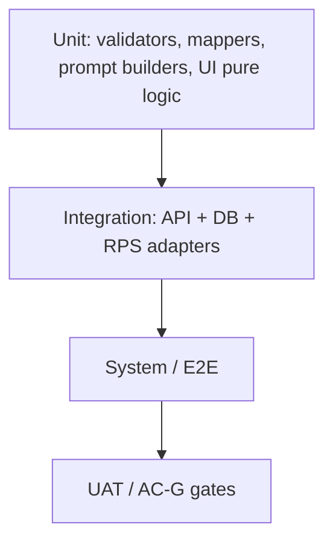
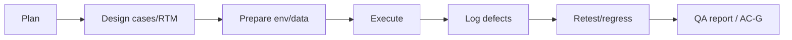
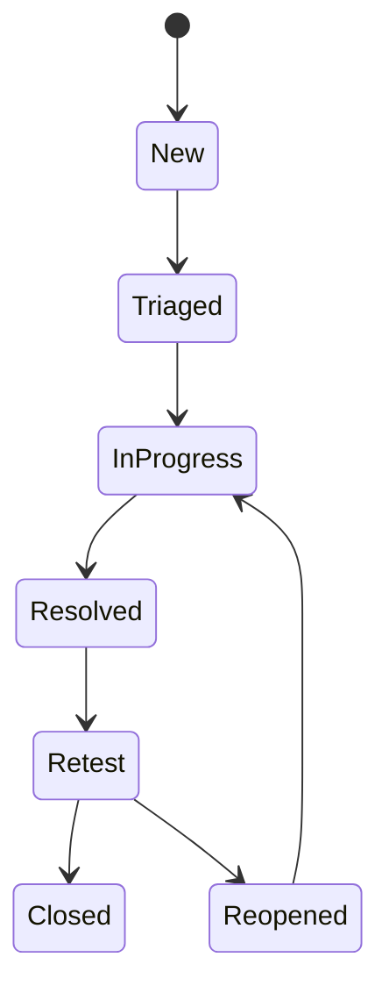

# ResumeRank AI

# Testing & Quality Assurance Document (TQD)

**Document 10 — RR-TEST-010**

---

## Cover Page

| | |
| --- | --- |
| **Project Name** | ResumeRank AI |
| **Document Title** | Testing & Quality Assurance Document |
| **Document Number** | Document 10 |
| **Document ID** | RR-TEST-010 |
| **Version** | 1.0.0 |
| **Status** | Baseline — Ready for Implementation Guidance |
| **Classification** | Internal — MBA Final Year Project |
| **Specialization** | Artificial Intelligence & Data Science |
| **Document Type** | Testing & QA (IEEE 29119–inspired) |
| **Author** | Vish Var |
| **Role** | Principal QA Architect / Software Test Manager |
| **Organization** | ResumeRank AI Development Team |
| **Prepared For** | Development, QA, and Academic Evaluation Teams |
| **Date** | 12 July 2026 |
| **Upstream Dependencies** | RR-ARCH-001 v2.0.0; RR-PRD-002 v1.0.0; RR-SRS-003 v1.1.0; RR-SDD-004 v1.1.0; RR-DB-005 v1.1.0; RR-API-006 v1.1.0; RR-UIX-007 v1.1.0; RR-AI-008 v1.0.0; RR-SEC-009 v1.0.0 |
| **Governing Plan** | Documentation Roadmap (RR-DOC-000) |
| **Next Document** | Deployment Guide (RR-DEP-011) |

---

### Document Control Statement

This Testing & Quality Assurance Document defines the test strategy, environments, requirement traceability, functional/API/DB/AI/UI/security/performance scenarios, detailed test cases, UAT, defect management, metrics, and risk-based testing for ResumeRank AI.

It derives entirely from the approved Architecture, PRD, SRS v1.1, SDD v1.1, DDD v1.1, ADS v1.1, UXD v1.1, AID v1.0.0, and Security Design v1.0.0. It does **not** invent undocumented product features and does **not** modify business rules BR-01–BR-12.

Authoritative workflow under test: **Upload → `uploaded` → Start Screening → HTTP 202 → poll → parse → Gemini → validate → persist**. ST-02 auto-enqueue is **not** adopted (negative tests required). Gemini secrets must never appear in the browser bundle (BR-05).

Design-only: no executable test code in this document. Automation frameworks are **future scope** (§19) while manual/scripted cases herein are the v1 baseline.

**Representative catalog size:** 116 detailed test cases (§6).

---

## Version History

| Version | Date | Author | Description of Change | Review Status |
| --- | --- | --- | --- | --- |
| 0.1.0 | 12 July 2026 | Vish Var | Outline from SRS FRs/UCs, ADS contracts, AID/SEC controls | Draft |
| 1.0.0 | 12 July 2026 | Vish Var | Complete TQD with RTM, 116 cases, multi-layer suites, UAT, metrics, QA Architecture Review | Current |

---

## Table of Contents

1. [Introduction](#1-introduction)
2. [Test Strategy](#2-test-strategy)
3. [Test Environment](#3-test-environment)
4. [Requirement Traceability Matrix](#4-requirement-traceability-matrix)
5. [Functional Test Scenarios](#5-functional-test-scenarios)
6. [Detailed Test Cases](#6-detailed-test-cases)
7. [Validation Testing](#7-validation-testing)
8. [API Testing](#8-api-testing)
9. [Database Testing](#9-database-testing)
10. [AI Testing](#10-ai-testing)
11. [UI/UX Testing](#11-uiux-testing)
12. [Security Testing](#12-security-testing)
13. [Performance Testing](#13-performance-testing)
14. [User Acceptance Testing (UAT)](#14-user-acceptance-testing-uat)
15. [Defect Management](#15-defect-management)
16. [Test Metrics](#16-test-metrics)
17. [Test Deliverables](#17-test-deliverables)
18. [Risk-Based Testing](#18-risk-based-testing)
19. [Future Automation Strategy](#19-future-automation-strategy)
20. [Conclusion](#20-conclusion)
21. [QA Architecture Review](#21-qa-architecture-review)
22. [Appendices](#22-appendices)

---

## List of Figures

| ID | Title | Section |
| --- | --- | --- |
| F-01 | Testing pyramid | §2.1 |
| F-02 | Test process flow | §2.8 |
| F-03 | Defect lifecycle | §15.3 |

---

## List of Tables

| ID | Title | Section |
| --- | --- | --- |
| T-01 | Test level responsibilities | §2 |
| T-02 | Environment matrix | §3 |
| T-03 | RTM — Must FR coverage | §4.1 |
| T-04 | RTM — NFR coverage | §4.2 |
| T-05 | Detailed test case catalog (116) | §6 |
| T-06 | Defect severity model | §15.1 |
| T-07 | Coverage goals | §16.2 |

---

## References

| ID | Reference |
| --- | --- |
| REF-01 | RR-DOC-000 Documentation Roadmap |
| REF-02 | RR-PRD-002 Product Requirements Document v1.0.0 |
| REF-03 | RR-SRS-003 Software Requirements Specification v1.1.0 |
| REF-04 | RR-SDD-004 System Design Document v1.1.0 |
| REF-05 | RR-DB-005 Database Design Document v1.1.0 |
| REF-06 | RR-API-006 API Design Specification v1.1.0 |
| REF-07 | RR-UIX-007 UI/UX Design Document v1.1.0 |
| REF-08 | RR-AI-008 AI Design & Prompt Engineering Document v1.0.0 |
| REF-09 | RR-SEC-009 Security Design Document v1.0.0 |
| REF-10 | IEEE 29119 Software Testing (inspired principles) |
| REF-11 | PRD AC-G01–AC-G10 acceptance gates |

---

## 1. Introduction

### 1.1 Purpose

Establish the authoritative testing baseline so Cursor implementers and QA can verify ResumeRank AI against approved requirements with measurable coverage, defect discipline, and release gates AC-G01–AC-G10.

### 1.2 Scope

| In scope | Out of scope |
| --- | --- |
| Unit, integration, system, acceptance, regression, manual suites | Formal pen-test as a release gate |
| API, DB, AI, UI, security, performance (demo-scale) | MFA/OAuth/SSO/malware-scanner product tests |
| Traceability to PRD/SRS/ADS/DDD/AID/SEC/UXD | Testing Won't features as positive requirements |
| UAT for HR Recruiter persona | Multi-tenant org RBAC scenarios |

### 1.3 Testing Objectives

1. Verify every Must SRS-FR and every SRS-NFR with ≥1 mapped test.  
2. Prove ADS async workflow and negative ST-02.  
3. Prove AI schema gates and BR-02/BR-05.  
4. Prove owner-only RLS/AuthZ and private storage.  
5. Enable AC-G01–AC-G10 pass evidence for MBA demo.

### 1.4 Quality Goals

| Goal | Target |
| --- | --- |
| Must FR coverage | 100% mapped |
| NFR coverage | 100% mapped (demo methods where Should) |
| P0 case pass rate before release | 100% |
| Critical/Blocker open defects | 0 |
| AI completed path schema validity | 100% of successful persists |
| Security cross-user deny | 100% of AUTHZ suite |

### 1.5 Testing Principles (IEEE 29119–inspired)

- Requirements-based and risk-based prioritization  
- Traceability bidirectional (requirement ↔ case ↔ result)  
- Independence of evaluation where feasible (QA vs builder review)  
- Defects documented with severity/priority  
- Environment and data controlled and repeatable  
- Negative and boundary testing mandatory for validation/AI/security  

### 1.6 Out of Scope

Live production chaos testing · formal GDPR certification tests · OCR pipelines · candidate portal · ST-02 positive path · auto-hire/reject feature tests (absence only).

---

## 2. Test Strategy

### 2.1 Testing Pyramid

| Level | Focus | Typical owners |
| --- | --- | --- |
| **Unit** | VR validators, ErrorObject mapping, CE mappers, schema validation, status transition guards | Dev |
| **Integration** | Auth, PostgREST/RLS, Storage, `/screen`/`/retry`, queue, Gemini adapter (mock/live) | Dev/QA |
| **System** | Full SPA flows UC-01–10 | QA |
| **Acceptance** | AC-G01–10 / UAT | QA + stakeholder |
| **Regression** | P0/P1 suite each release candidate | QA |
| **Manual** | Exploratory a11y, visual, AI judgment samples | QA |
| **Future automation** | Vitest/RTL/Playwright/Newman (§19) | Later |

### 2.2 Manual vs Automated (v1)

v1 baseline is **designed cases executed manually or via ad-hoc scripts**. CI automation is future (§19) but cases are automation-ready.

### 2.8 Process Flow

---

## 3. Test Environment

| Layer | Configuration |
| --- | --- |
| **Frontend** | React/Vite/Tailwind/shadcn SPA on local or Vercel preview |
| **Backend / API** | Supabase Auth + PostgREST + RPS command routes |
| **Database** | Supabase PostgreSQL with RLS enabled |
| **Storage** | Private `resumes` bucket |
| **Gemini** | Staging key in RPS only; **mock adapter** for unit/integration (NFR-020) |
| **Browsers** | Chromium + one WebKit/Firefox; primary desktop |
| **OS** | Linux/macOS/Windows developers; demo on desktop 1280×720 |
| **Test data** | Users A/B; jobs; ≥20 PDF/DOCX corpus; corrupt PDF; TXT/PNG; injection resume; long-text resume |
| **Assumptions** | Separate Supabase project for test; HTTPS on preview; no production secrets in client |

**Status vocabulary note:** Persistence uses DDD statuses (`uploaded`, `queued`, …). SRS coarse `pending`/`processing` map per DDD Appendix A — tests assert **DDD/ADS** values.

---

## 4. Requirement Traceability Matrix

### 4.1 Must Functional Requirements → Tests

| SRS-FR | UC / Gate | Primary Test Cases |
| --- | --- | --- |
| FR-001 | UC-01; AC-G01 | TC-AUTH-001, TC-AUTH-004, TC-AC-001 |
| FR-002 | UC-01; AC-G01 | TC-AUTH-006 |
| FR-003 | UC-02; AC-G01 | TC-AUTH-007 |
| FR-004 | BR-09 | TC-AUTHZ-001–006, TC-SEC-003 |
| FR-005 | UC-03; AC-G02 | TC-JOB-001 |
| FR-006 | UC-03 | TC-JOB-004, TC-JOB-005 |
| FR-008 | BR-07 | TC-JOB-010 |
| FR-009 | ST-01 | TC-JOB-009 |
| FR-010 | UC-04; AC-G03 | TC-UPL-001, TC-UPL-007, TC-AC-001 |
| FR-011 | BR-06 | TC-UPL-002 |
| FR-012 | Scenario B | TC-UPL-003, TC-UPL-004 |
| FR-013 | NFR-002 | TC-UPL-010, TC-SEC-002 |
| FR-014 | ADS §6.0 | TC-UPL-001, TC-UPL-009 |
| FR-015 | UC-05 | TC-PRS-001 |
| FR-016 | Scenario C | TC-PRS-002 |
| FR-017 | AC-G07 | TC-UPL-007, TC-PRS-003 |
| FR-018–023 | AC-G04/G06 | TC-AI-001–004, TC-AC-002 |
| FR-024 | Scenario D | TC-AI-009 |
| FR-026 | Scenario E | TC-AI-012 |
| FR-027–030 | AC-G05/G06; UC-06/07/09 | TC-RNK-001–006 |
| FR-033 | AC-G08; UC-08 | TC-ANL-001, TC-AC-003 |
| FR-037–040 | CSL/DDD | TC-DB-005, TC-PRS-003, TC-ANL-002, TC-SCR-009 |
| FR-046–047 | BR-11 | TC-ARC-001–004 |
| FR-048–050 | CE | TC-CE-001–003 |
| FR-051–053 | BR-12 | TC-DB-001–002, TC-RTY-002 |

### 4.2 Should FR → Tests

| SRS-FR | Tests |
| --- | --- |
| FR-007 | TC-JOB-006, TC-JOB-007 |
| FR-025 | TC-RTY-001–005 |
| FR-031–032 | TC-RNK-007 |
| FR-034–036 | TC-ANL-003 |
| FR-049 | TC-CE-002 |

### 4.3 NFR → Tests

| NFR | Tests / Method |
| --- | --- |
| NFR-001 | TC-SEC-001 |
| NFR-002–004 | TC-SEC-002–003, TC-AUTHZ-* |
| NFR-005/024 | TC-UPL-003–006 |
| NFR-006/008 | TC-UPL-007, TC-PRS-003, TC-RNK-005 |
| NFR-007 | TC-AI-008 |
| NFR-009/012 | TC-NFR-001; pagination in RNK/JOB |
| NFR-010 | TC-UPL-008 |
| NFR-011/014 | TC-SCR-008–010 |
| NFR-013 | UAT §14 |
| NFR-015–016 | TC-A11Y-*, TC-UX-002 |
| NFR-017 | TC-DB-001–002, TC-AI-004 |
| NFR-018/020/023 | TC-NFR-002; code review; TC-AI-009 |
| NFR-019 | TC-SEC-005 |
| NFR-021–022 | TC-AC-004 |

### 4.4 Use Cases → Tests

| UC | Tests |
| --- | --- |
| UC-01 | TC-AUTH-001,004,006; TC-AC-001 |
| UC-02 | TC-AUTH-007 |
| UC-03 | TC-JOB-001,004,005 |
| UC-04 | TC-UPL-001–009 |
| UC-05 | TC-SCR-001–010; TC-AI-001 |
| UC-06 | TC-RNK-001–004 |
| UC-07 | TC-RNK-006; TC-CE-001 |
| UC-08 | TC-ANL-001 |
| UC-09 | TC-RNK-005; TC-PRS-002; TC-AI-009 |
| UC-10 | TC-RTY-001–005 |

### 4.5 Coverage Statement

Every Must FR, every NFR, and UC-01–10 have ≥1 mapped case. Could/Won't items are exclusion-only (no positive OCR/email/HM-RBAC tests).

---

## 5. Functional Test Scenarios

| Area | Scenario themes |
| --- | --- |
| **Authentication** | Signup/signin/out; gate; refresh; 401 mid-poll |
| **Jobs** | Create/list/edit; JD required; trim; ownership |
| **Resume Upload** | PDF/DOCX; batch; no enqueue |
| **Resume Validation** | MIME; size; empty; special names |
| **Candidate Extraction** | CE-01–14 sparse OK |
| **AI Screening** | 202→poll→completed; schema gates |
| **Retry** | failed_ai only; history overwrite |
| **Ranking** | score DESC; nulls; failed visible |
| **Analytics** | Dashboard totals; progress; distributions |
| **Archive Job** | Soft archive; block mutations; delete empty/409 |
| **Settings / Logout** | Sign out clears session |

---

## 6. Detailed Test Cases

Convention: **TC-ID · Title · Objective · Preconditions · Steps · Expected · Priority · Mapping · Status**.  
Priority: **P0** release-blocking · **P1** Should/high · **P2** polish.  
Status values during execution: Designed → Ready → Passed | Failed | Blocked | Skipped.

| Test Case ID | Title | Objective | Preconditions | Steps | Expected Result | Priority | Requirement Mapping | Status |
| --- | --- | --- | --- | --- | --- | --- | --- | --- |
| TC-AUTH-001 | Signup valid credentials | Register HR user | No session | Open /signup; submit valid email/password/confirm | Account created; session or confirm message; profile exists | P0 | SRS-FR-001; UC-01; AC-G01; ADS §4.1 | Designed |
| TC-AUTH-002 | Signup invalid email | Reject bad email | /signup | Submit invalid email | EH-VAL; no session | P0 | VR-30; UXD §8.1a | Designed |
| TC-AUTH-003 | Signup password mismatch | Client confirm check | /signup | Mismatched confirm | Error; no signup call | P1 | UXD §8.1a | Designed |
| TC-AUTH-004 | Sign in success | Authenticate | Existing user | /login valid credentials | JWT session; Dashboard | P0 | SRS-FR-001; UC-01; ADS §4.2 | Designed |
| TC-AUTH-005 | Sign in wrong password | Auth failure | Existing user | Wrong password | 401 EH-AUTH | P0 | EH-AUTH | Designed |
| TC-AUTH-006 | Protected route logged out | Session gate | Logged out | Open /jobs | Redirect login | P0 | SRS-FR-002; SRS-SEC-001 | Designed |
| TC-AUTH-007 | Sign out | Invalidate session | Logged in | Settings → Sign out | Session cleared; routes blocked | P0 | SRS-FR-003; UC-02; AC-G01 | Designed |
| TC-AUTH-008 | Token refresh | Refresh before fail | Near-expiry JWT | Trigger AppShell refresh | New access token | P1 | ADS §4.5; UXD §14.6 | Designed |
| TC-AUTH-009 | 401 during polling | Expiry mid-poll | Active poll; force 401 | Expire token while polling | Stop poll; toast; redirect login | P0 | UXD §5.4.6; EH-06 | Designed |
| TC-AUTHZ-001 | Owner reads own job | Positive AuthZ | User A owns job | GET job as A | 200 | P0 | SRS-FR-004; BR-09 | Designed |
| TC-AUTHZ-002 | Cross-user job deny | RLS isolation | A owns; B authenticated | GET job as B | 403/empty; no leak | P0 | SEC T-03; AC-G09 | Designed |
| TC-AUTHZ-003 | Cross-user upload deny | AuthZ upload | A job; as B | Upload to A job | 403 EH-FORB | P0 | BR-09; ADS §6 | Designed |
| TC-AUTHZ-004 | Cross-user screen deny | AuthZ screen | A job; as B | POST /screen | 403 | P0 | ADS §8.2 | Designed |
| TC-AUTHZ-005 | Cross-user signed resume deny | AuthZ storage | A candidate; as B | GET resume URL API | 403 | P0 | ADS §6.5; SRS-SEC-003 | Designed |
| TC-AUTHZ-006 | Evaluations owner-scoped | RLS evals | Two owners | List evaluations as B | Only B data | P0 | SRS-SEC-005 | Designed |
| TC-AUTHZ-007 | SPA cannot claim queue | Queue AuthZ | User JWT | Attempt public queue claim | Denied / no public API | P0 | ADS API-02; DDD §11.2 | Designed |
| TC-AUTHZ-008 | Archived blocks mutations | Lifecycle AuthZ | Archived job | Edit/upload/screen | 403 | P0 | VR-05; ADS §5 | Designed |
| TC-JOB-001 | Create job valid | Create | Logged in | /jobs/new title+JD save | 201; Job Details; active | P0 | SRS-FR-005; UC-03; AC-G02; VR-01/02 | Designed |
| TC-JOB-002 | Create empty title | VR-01 | Logged in | Submit empty title | Validation error | P0 | VR-01 | Designed |
| TC-JOB-003 | Create empty JD | VR-02 | Logged in | Submit empty JD | Validation error | P0 | VR-02 | Designed |
| TC-JOB-004 | List active jobs | List | ≥1 job | Open /jobs | Owned active jobs shown | P0 | SRS-FR-006 | Designed |
| TC-JOB-005 | Open Job Details | Hub nav | Existing job | Click row | Tabs upload/progress/candidates | P0 | UXD §6.7 | Designed |
| TC-JOB-006 | Edit active job | Update Should | Active job | Edit title/JD save | 200; toast | P1 | SRS-FR-007 | Designed |
| TC-JOB-007 | Edit archived blocked | 403 | Archived | Attempt edit | 403/read-only | P1 | ADS §5.2 | Designed |
| TC-JOB-008 | Trim title/JD | Trim rules | Padded whitespace | Save | Stored trimmed | P1 | UXD §8.2 | Designed |
| TC-JOB-009 | Screen without JD blocked | FR-009 | Missing JD | Start Screening | Disabled/422 | P0 | SRS-FR-009 | Designed |
| TC-JOB-010 | Candidate scoped to job | FR-008 | Upload to J | Inspect job_id | Equals J | P0 | SRS-FR-008; BR-07 | Designed |
| TC-ARC-001 | Archive job | Soft archive | Active with candidates | Archive confirm | archived; data retained | P0 | SRS-FR-046; BR-11 | Designed |
| TC-ARC-002 | Archive blocks upload/screen | VR-05 | Archived | Upload or screen | 403/disabled | P0 | VR-05 | Designed |
| TC-ARC-003 | Delete empty job | Hard delete | Zero candidates | Delete confirm | 204; gone | P0 | SRS-FR-047; VR-04 | Designed |
| TC-ARC-004 | Delete with candidates 409 | Conflict | Has candidates | Delete | 409 + archive guidance | P0 | UXD §6.5.1; ADS | Designed |
| TC-UPL-001 | Upload PDF → uploaded | Happy path | Active job | Upload valid PDF | 201 status=uploaded; no queue | P0 | SRS-FR-010/014; ADS §6.0; AC-G03 | Designed |
| TC-UPL-002 | Upload DOCX → uploaded | Happy path | Active job | Upload DOCX | 201 uploaded | P0 | SRS-FR-011; BR-06 | Designed |
| TC-UPL-003 | Reject TXT | Bad type | Active job | Upload .txt | 422 EH-VAL; no candidate | P0 | SRS-FR-012; VR-10; Scenario B | Designed |
| TC-UPL-004 | Reject PNG | Bad type | Active job | Upload .png | 422 clear error | P0 | SRS-FR-012; AC-G03 | Designed |
| TC-UPL-005 | Reject empty file | VR-12 | 0-byte | Upload | 422 | P0 | VR-12 | Designed |
| TC-UPL-006 | Reject >5MB | NFR-024 | >5MB file | Upload | 422 | P0 | SRS-NFR-024; VR-11 | Designed |
| TC-UPL-007 | Batch mixed success | Partial | PDF+TXT | Multi upload | results[] PDF ok TXT fail | P0 | SRS-FR-017; BR-04; AC-G07 | Designed |
| TC-UPL-008 | Batch ≥20 capacity | NFR-010 | 20 PDFs | Upload 20 | All accepted or guided; no crash | P0 | SRS-NFR-010; VR-13 | Designed |
| TC-UPL-009 | Upload does not enqueue | ST-02 negative | After upload | Inspect queue/status | No queue; uploaded only | P0 | ADS §6.0; ST-02 not adopted | Designed |
| TC-UPL-010 | Storage path pattern | Path | Uploaded | Inspect object path | resumes/{owner}/{job}/{candidate}/{file} | P0 | DDD §5.5; SRS-FR-013 | Designed |
| TC-UPL-011 | Upload compensation | DD-05 | DB fail after storage | Simulate | Orphan object compensated | P1 | SDD DD-05 | Designed |
| TC-UPL-012 | Special/duplicate filenames | Safe keys | Odd/dup names | Upload twice | Candidates created; no path escape | P1 | SEC §6; DDD | Designed |
| TC-PRS-001 | Parse PDF/DOCX text | FR-015 | Queued files | Screen | Usable text; progress | P0 | SRS-FR-015 | Designed |
| TC-PRS-002 | Empty text failed_parse | No AI | Corrupt/empty PDF | Screen | failed_parse; no Gemini; EH-PARSE | P0 | SRS-FR-016; CSL-04; Scenario C | Designed |
| TC-PRS-003 | Parse fail isolates siblings | Isolation | 1 bad + 1 good | Screen both | Bad failed_parse; good completes | P0 | SRS-FR-040; AC-G07 | Designed |
| TC-CE-001 | CE-01–09 attempted | Required CE | Completed | Open profile | Fields or null; displayed | P0 | SRS-FR-048/050; VR-40 | Designed |
| TC-CE-002 | Optional CE when present | Should CE | Resume w/ LinkedIn | Inspect | linkedin set | P1 | SRS-FR-049; VR-41 | Designed |
| TC-CE-003 | Sparse CE ≠ failed_parse | VR-42 | Sparse but usable | Screen | Not failed_parse for sparse alone | P0 | VR-42 | Designed |
| TC-SCR-001 | Start Screening 202 | ST-01 | uploaded+JD | Start Screening | 202; queued ids | P0 | ST-01; ADS §8.2; UC-05 | Designed |
| TC-SCR-002 | 202 has no scores | API-01 | After screen | Inspect body | No score/rationale/summary | P0 | ADS §8.7 | Designed |
| TC-SCR-003 | Idempotency-Key required | Header | Screen | Omit key | 4xx | P0 | ADS §8.8 | Designed |
| TC-SCR-004 | Idempotency replay | Replay | Prior 202 | Same key+body | Same 202; no dup queue | P0 | ADS §8.8 | Designed |
| TC-SCR-005 | Idempotency mismatch 409 | Conflict | Same key new body | Replay | 409 | P0 | ADS §8.8 | Designed |
| TC-SCR-006 | Ineligible screen conflict | Eligibility | Only completed | POST screen | 409/empty accepted | P0 | ADS §8.0 | Designed |
| TC-SCR-007 | Double-submit prevention | UX | Click Start Screening | Double-click | One request; button disabled | P0 | UXD §5.4.4 | Designed |
| TC-SCR-008 | Optimistic queued + poll | Async UX | 202 | Observe UI | queued badges; PollingIndicator | P0 | UXD §5.4; NFR-011 | Designed |
| TC-SCR-009 | Poll stops terminal | Lifecycle | All terminal | Wait | stopped phase | P0 | UXD §5.4.3 | Designed |
| TC-SCR-010 | UI not blocked during AI | NFR-011 | Long AI | Navigate while processing | App usable | P0 | SRS-NFR-011 | Designed |
| TC-AI-001 | Valid AI → completed | Happy | Parseable+JD | Process | completed + eval | P0 | SRS-FR-018/023; AC-G04 | Designed |
| TC-AI-002 | Score 0–100 numeric | V-SC-01 | Completed | Read score | ∈[0,100] | P0 | SRS-FR-019; AI-020 | Designed |
| TC-AI-003 | Rationale+summary non-empty | AI-021 | Completed | Inspect | Both non-empty | P0 | SRS-FR-020/021; AC-G06 | Designed |
| TC-AI-004 | model_metadata prompt_version | AI-004 | Completed | Read metadata | model + prompt_version | P0 | SRS-AI-004; BR-03 | Designed |
| TC-AI-005 | Malformed JSON → failed_ai | Schema gate | Mock bad JSON | Process | Not completed; retry then failed_ai | P0 | SRS-AI-003; AID §9 | Designed |
| TC-AI-006 | Out-of-range score rejected | Validation | Mock 150 | Validate | Fail; not completed | P0 | AI-022 | Designed |
| TC-AI-007 | Empty rationale rejected | Validation | Mock empty | Validate | Not completed | P0 | AI-021/022 | Designed |
| TC-AI-008 | Transient retry then success | NFR-007 | 503 then OK | Process | completed; ≤3 attempts | P1 | SRS-AI-006; AID §10 | Designed |
| TC-AI-009 | Exhausted retries failed_ai | FR-024 | Always fail | Process | failed_ai; retain prior active if any | P0 | SRS-FR-024; DD-08 | Designed |
| TC-AI-010 | No Gemini key in SPA | BR-05 | Build artifact | Search bundle | Key absent | P0 | BR-05; AC-G09; SRS-AI-010 | Designed |
| TC-AI-011 | Prompt injection resistance | AI sec | Injection resume | Screen | No forced score; schema valid | P0 | AID §11; SEC T-12 | Designed |
| TC-AI-012 | HTML stripped / no hire UI | XSS + BR-02 | HTML output; ranking UI | Render + inspect controls | Plain text; no hire/reject | P0 | AID V-SEC-01; SRS-FR-026; Scenario E | Designed |
| TC-RTY-001 | Retry failed_ai | UC-10 | failed_ai | Retry Screening | 202 → process; history if overwrite | P1 | SRS-FR-025; UC-10; BR-12 | Designed |
| TC-RTY-002 | History before overwrite | FR-053 | Prior active then retry success | Inspect history | Prior snapshot present | P0 | SRS-FR-053; AI-007 | Designed |
| TC-RTY-003 | No retry for failed_parse | UX | failed_parse | Observe actions | Re-upload guidance only | P0 | UXD §5.4.5 | Designed |
| TC-RTY-004 | Retry completed → 409 | Eligibility | completed | POST retry | 409 | P0 | ADS §8.3 | Designed |
| TC-RTY-005 | Retry sibling isolation | EH-08 | One failed_ai | Retry one | Others unchanged | P0 | EH-08; BR-04 | Designed |
| TC-RNK-001 | Rank by score DESC | FR-027 | Multiple completed | Open candidates | DESC order | P0 | SRS-FR-027; AC-G05 | Designed |
| TC-RNK-002 | Tie-break rules | ADS | Equal scores | Inspect order | evaluated_at DESC then id | P1 | ADS §7.5 | Designed |
| TC-RNK-003 | Null score non-completed | Ranking model | Mixed statuses | Inspect | null/—; not falsely ranked above | P0 | ADS §7.5; UXD §9 | Designed |
| TC-RNK-004 | Ranking shows score/status | FR-028 | Completed | View list | Score + badge + open | P0 | SRS-FR-028 | Designed |
| TC-RNK-005 | Failed visible | FR-030 | failed_* | List | Visible failure status | P0 | SRS-FR-030; UC-09 | Designed |
| TC-RNK-006 | Detail rationale/summary/CE | FR-029 | Completed | Open detail | Panels populated | P0 | SRS-FR-029; AC-G06 | Designed |
| TC-RNK-007 | Status filter + archived default | Should/filter | Mixed+archived | Filter; default list | Filter works; archived excluded default | P1 | SRS-FR-031; ADS §7.6 | Designed |
| TC-ANL-001 | Dashboard metrics match | FR-033 | Seeded | Open Dashboard | Counts match DB | P0 | SRS-FR-033; AC-G08; Scenario F | Designed |
| TC-ANL-002 | Job progress counts | FR-038 | In progress | Progress tab | Status counts correct | P0 | SRS-FR-038 | Designed |
| TC-ANL-003 | Analytics charts + table alt | Should | Completed set | Analytics | Distribution widgets + accessible alt | P1 | SRS-FR-034/035; UXD §13.4 | Designed |
| TC-API-001 | ErrorObject on 401 | API-04 | No JWT | Call protected | code EH-AUTH shape | P0 | ADS §10.1 | Designed |
| TC-API-002 | ErrorObject no secrets | SEC-004 | Force error | Inspect body | No stack/keys | P0 | SRS-SEC-004; EH-07 | Designed |
| TC-API-003 | Signed URL 300s | Contract | Owner | GET resume | expires_in=300; works | P0 | ADS §6.5 | Designed |
| TC-API-004 | Signed URL refresh | UX | Near expiry | Re-GET | New URL | P1 | UXD §14.4 | Designed |
| TC-API-005 | Ranking + metrics owner scope | Read models | Two users | GET ranking/metrics as B | Only B | P0 | ADS §7/§9 | Designed |
| TC-API-006 | 429 backoff UX | Rate limit | Burst screen | Exceed | 429; UI backoff | P1 | ADS §11; UXD | Designed |
| TC-DB-001 | One active evaluation | FR-051 | Completed | Query by candidate | Exactly one | P0 | SRS-FR-051; DDD §4.6 | Designed |
| TC-DB-002 | History on overwrite | FR-053 | Retry success | Count history | Appended snapshot | P0 | SRS-FR-053 | Designed |
| TC-DB-003 | No fabricated failed_ai eval | DD-08 | First-run failed_ai | Query evals | No invalid score row | P0 | SDD DD-08 | Designed |
| TC-DB-004 | One open queue entry | Queue | After enqueue | Inspect | ≤1 pending|locked | P0 | DDD §4.9 | Designed |
| TC-DB-005 | Illegal status jump blocked | Lifecycle | uploaded | Force →completed | Rejected | P0 | SRS-FR-037; DDD §4.4.1 | Designed |
| TC-DB-006 | Audit logs no raw PII | PII | After screen | Read audit payload | No resume/email dumps | P0 | DDD §5.9; SEC §11 | Designed |
| TC-DB-007 | Delete restrict with children | FK | Job+candidates | DELETE | 409/restricted | P0 | DDD §6.3 | Designed |
| TC-SEC-001 | HTTPS deployed | NFR-001 | Preview/prod | Open URL | https | P0 | SRS-NFR-001 | Designed |
| TC-SEC-002 | Anon key only + private storage | Secrets/storage | SPA+anon | Inspect env; list bucket anon | No service role; list denied | P0 | SRS-SEC-002; NFR-002; AC-G09 | Designed |
| TC-SEC-003 | Cross-owner 403 matrix | Access control | Foreign ids | GET/PATCH attempts | 403 no foreign payload | P0 | SEC §4; OWASP A01 | Designed |
| TC-SEC-004 | Injection + JWT storage | AI/Storage | Injection corpus; no JWT object URL | Screen; guess URL | No override; object denied | P0 | SEC T-12/T-05 | Designed |
| TC-SEC-005 | .env.example no secrets | NFR-019 | Repo | Read file | Names only | P0 | SRS-NFR-019 | Designed |
| TC-UX-001 | Loading/Empty/Error states | UI states | Various | Open empty/slow/error paths | Skeleton/EmptyState/ErrorState | P1 | UXD §14 | Designed |
| TC-UX-002 | Mobile ranking cards | Responsive | <768 | Open ranking | Card layout | P1 | UXD §12; NFR-016 | Designed |
| TC-UX-003 | Delete dialog messaging | Confirm | Empty job | Open dialog | Copy per §8.7 | P1 | UXD §6.5.1 | Designed |
| TC-A11Y-001 | Keyboard + focus order | A11y | Job Details | Tab to Start Screening; Enter | Works; visible focus | P1 | UXD §13; NFR-015 | Designed |
| TC-A11Y-002 | aria-live polling updates | Live region | Progress | Status change | Polite announcement | P1 | UXD §13.3 | Designed |
| TC-A11Y-003 | Chart alt + reduced motion | A11y | Analytics; reduced motion | Inspect | Table alt; static indicator | P2 | UXD §13.4–13.5 | Designed |
| TC-NFR-001 | Dashboard/ranking ≤3s demo | Perf Should | ≤20 candidates broadband | Load pages | Interactive ≤3s | P1 | SRS-NFR-009; PER-001 | Designed |
| TC-NFR-002 | Mockable AI adapter | Testability | Unit suite | Run with mock Gemini | Pass without live key | P1 | SRS-NFR-020 | Designed |
| TC-AC-001 | AC-G01–G03 e2e | Gates | Fresh env | Auth + job + upload/reject | Pass G01–G03 | P0 | AC-G01; AC-G02; AC-G03 | Designed |
| TC-AC-002 | AC-G04–G07 e2e | Gates | Fixtures A–D | Screen mixed batch | Pass G04–G07 | P0 | AC-G04–G07 | Designed |
| TC-AC-003 | AC-G05–G06–G08 e2e | Gates | Completed data | Rank, detail, dashboard | Pass | P0 | AC-G05; AC-G06; AC-G08 | Designed |
| TC-AC-004 | AC-G09–G10 e2e | Gates | Deployed preview | Secret scan + smoke | Pass | P0 | AC-G09; AC-G10 | Designed |

**Catalog count:** 116 (target band 80–120).

---

## 7. Validation Testing

| Theme | Cases / rules |
| --- | --- |
| Input validation | TC-JOB-002/003/008; TC-AUTH-002/003 |
| File validation | TC-UPL-003–006 |
| Boundary | 5 MB edge; score 0 and 100; empty arrays CE |
| Required fields | VR-01/02; AI rationale/summary |
| Invalid formats | TXT/PNG; bad email |
| Large uploads | TC-UPL-006; TC-UPL-008 (≥20) |
| Duplicate uploads | TC-UPL-012 |
| Empty uploads | TC-UPL-005 |
| Special characters | TC-UPL-012 filenames; XSS HTML TC-AI-012 |

---

## 8. API Testing

Verify Auth, Jobs, Candidates, Upload, Screening, Analytics per ADS:

| Verify | Expectation |
| --- | --- |
| Request | JWT where required; Idempotency-Key on screen/retry |
| Response | 201 upload; 200 batch/list; **202** screen/retry only |
| Status codes | 401/403/404/409/422/429 mapped |
| ErrorObject | Frozen shape; EH-* codes |
| Idempotency | Replay / mismatch cases |
| Authorization | Owner vs cross-user |

Primary cases: **TC-API-***, **TC-SCR-***, **TC-AUTHZ-***, **TC-UPL-***.

---

## 9. Database Testing

| Rule | Cases |
| --- | --- |
| Entity/FK integrity | TC-JOB-010; TC-DB-007 |
| Status transitions | TC-DB-005; TC-SCR-001/009 |
| Archive/delete | TC-ARC-*; TC-DB-007 |
| Evaluation history | TC-DB-002; TC-RTY-002 |
| One-active evaluation | TC-DB-001 |
| Audit logging PII | TC-DB-006 |
| Queue integrity | TC-DB-004; TC-SCR-004 |

---

## 10. AI Testing

| Theme | Cases |
| --- | --- |
| Prompt/schema validation | TC-AI-005–007 |
| Structured JSON | TC-AI-001 |
| Retry logic | TC-AI-008–009; TC-RTY-* |
| Malformed responses | TC-AI-005 |
| Hallucination / injection | TC-AI-011 |
| Ranking correctness | TC-RNK-001–003 |
| Score validation | TC-AI-002 |
| No browser Gemini | TC-AI-010 |
| HTML sanitize / no hire | TC-AI-012 |

Use **mock Gemini** for deterministic schema tests; sample **live** runs for demo evidence (NFR-020).

---

## 11. UI/UX Testing

| Theme | Cases |
| --- | --- |
| Navigation / forms / tables / dialogs | TC-JOB-*; TC-UX-003; TC-ARC-* |
| Polling / loading / error | TC-SCR-008–010; TC-UX-001; TC-AUTH-009 |
| Responsive | TC-UX-002 |
| Accessibility | TC-A11Y-001–003 |
| Keyboard | TC-A11Y-001 |

---

## 12. Security Testing

| Theme | Cases / STRIDE seeds |
| --- | --- |
| Authentication / JWT | TC-AUTH-*; TC-API-001 |
| Authorization / RLS | TC-AUTHZ-*; TC-SEC-003 |
| Storage / signed URLs | TC-API-003–004; TC-SEC-002/004 |
| Prompt injection | TC-AI-011; TC-SEC-004 |
| Rate limiting | TC-API-006 |
| Sensitive data / OWASP A01 | TC-API-002; TC-SEC-003; TC-DB-006 |

---

## 13. Performance Testing

| Area | Approach | Case |
| --- | --- | --- |
| Page load / dashboard / ranking | Demo broadband; ≤3s Should | TC-NFR-001 |
| Resume / batch upload | Timed 1 and 20 files | TC-UPL-001/008 |
| AI latency | Soft 60s stage; async UI | TC-SCR-010; observe timings metadata |
| Polling | 3s then backoff | TC-SCR-008/009 |
| Stress / scalability | Assumptions: demo ≥20/job; not enterprise soak | Document residual |

No production SLA beyond SRS Must; treat NFR-009 as **Should** demo target.

---

## 14. User Acceptance Testing (UAT)

**Persona:** HR Recruiter (owner).

| UAT ID | Business Goal | Acceptance Criteria | Expected Behaviour | Pass/Fail |
| --- | --- | --- | --- | --- |
| UAT-01 | Access control | AC-G01 | Signup/in/out; protected blocked when out | Pass iff AC-G01 |
| UAT-02 | Create requisition | AC-G02 | Job with JD usable | Pass iff job persists |
| UAT-03 | Intake resumes | AC-G03 | Multi PDF/DOCX; rejects bad types | Pass iff partial reject works |
| UAT-04 | Screen & review | AC-G04–G06 | Start Screening → scores/summaries ranked | Pass iff human-readable evals |
| UAT-05 | Resilience | AC-G07 | One failure doesn’t block others | Pass iff isolation |
| UAT-06 | Oversight | Scenario E / FR-026 | No auto-hire/reject | Pass iff absent |
| UAT-07 | Analytics | AC-G08 | Dashboard counts trustworthy | Pass iff match data |
| UAT-08 | Trust & deploy | AC-G09–G10 | No client Gemini key; app live on preview | Pass iff both |

---

## 15. Defect Management

### 15.1 Severity

| Severity | Definition |
| --- | --- |
| **Blocker** | Stops core path (auth, upload, screen, rank) or data loss/cross-user leak |
| **Critical** | Major feature broken; no workaround; BR/Must violation |
| **Major** | Feature impaired; workaround exists |
| **Minor** | UI polish, copy, non-blocking Should gaps |
| **Observation** | Suggestion / future |

### 15.2 Priority

P0 fix before release · P1 before demo · P2 backlog.

### 15.3 Lifecycle

### 15.4 Reporting Workflow

Log: ID, title, severity/priority, env, steps, expected/actual, logs (redacted), mapped TC/FR, screenshots.

### 15.5 Regression / Retest Policy

- Every fix → retest originating case  
- P0/P1 suite regression on each RC  
- Security AUTHZ suite re-run if RLS/AuthZ touched  
- AI schema suite re-run if prompt/schema version bumps  

---

## 16. Test Metrics

| Metric | Definition | Goal |
| --- | --- | --- |
| Requirement coverage | Must FR with ≥1 Pass case / Must FR | 100% |
| NFR coverage | NFR with verification evidence | 100% |
| Execution progress | Executed / designed | Tracked per RC |
| Pass rate | Passed / executed | ≥95% overall; **100% P0** |
| Failure rate | Failed / executed | Investigate all P0/P1 |
| Defect density | Open defects / Must FR | Trend down |
| AI success rate | completed / (completed+failed_ai) on golden set | Informational |
| Retry rate | Retries / Gemini calls | Within AID policy |

---

## 17. Test Deliverables

| Deliverable | Description |
| --- | --- |
| Test Plan | This document §§1–3, 18–19 |
| Test Cases | §6 catalog |
| Bug Reports | Per §15 |
| Execution Reports | Case results + metrics |
| Traceability Matrix | §4 (+ execution columns) |
| Final QA Report | AC-G evidence + residual risks |

---

## 18. Risk-Based Testing

| Risk area | Level | Mitigation |
| --- | --- | --- |
| Cross-user data leak / RLS | **High** | AUTHZ + SEC suites first |
| AI schema / fabricated scores | **High** | AI validation + DD-08 cases |
| Async screen/idempotency | **High** | SCR + IDEM cases |
| Upload validation / batch isolation | **High** | UPL + PRS isolation |
| Prompt injection / XSS | **Medium** | AI-011/012; SEC-004 |
| Archive/delete correctness | **Medium** | ARC suite |
| Performance demo targets | **Medium** | NFR-001 timing; not hard SLA |
| A11y polish | **Low–Medium** | A11Y sample |
| Analytics Should widgets | **Low** | ANL Should cases |

---

## 19. Future Automation Strategy

| Tool | Future use |
| --- | --- |
| **Vitest** | Unit validators, mappers, schema gates |
| **React Testing Library** | Form/state components |
| **Playwright** | E2E UC-01–10 / AC-G |
| **Postman/Newman** | API contract + idempotency |
| **DB verification scripts** | One-active eval, queue, history asserts |

**Why future:** MBA v1 prioritizes correct manual/scripted coverage and demo evidence; CI harnesses add toolchain overhead after core features stabilize. Cases in §6 are written to be automation-ready.

---

## 20. Conclusion

This TQD verifies the approved architecture end-to-end: authenticated owner workflows, private storage, explicit async screening, schema-gated Gemini evaluation, ranking/analytics, and security controls—without expanding product scope. Execution of the §6 catalog and AC-G gates constitutes the Definition of Done evidence for implementation quality.

---

## 21. QA Architecture Review

### 21.1 Executive Summary

RR-TEST-010 v1.0.0 provides IEEE 29119–inspired strategy, full Must FR/NFR/UC mapping, 116 representative cases spanning functional/API/DB/AI/UI/security/performance, and UAT aligned to PRD AC-G. Residual gaps are numeric rate-limit thresholds (deferred to Deployment) and live Gemini nondeterminism (mitigated via mocks).

### 21.2 Severity Counts

| Severity | Count |
| --- | --- |
| Critical | 0 |
| Major | 2 |
| Minor | 3 |
| Observation | 4 |

### 21.3 Issues

| Issue | Severity | Recommendation | Affected Section |
| --- | --- | --- | --- |
| Rate-limit RPM not numerically frozen upstream | Major | Add exact thresholds in Deployment Guide; keep existence tests | §8, §12, TC-API-006 |
| Live Gemini nondeterminism for scores | Major | Golden mock fixtures for schema; sample live runs for demo only | §10 |
| Could/Won't exclusion tests not expanded | Minor | Add short NEG checklist in execution report | §4.5 |
| Performance is Should/demo-only | Minor | Record environment notes when measuring ≤3s | §13 |
| Automation not yet wired | Minor | Accept future §19; keep cases automation-ready | §19 |
| Archive→candidate `archived` may be optional timing | Observation | Assert “may” per DDD; don’t over-constrain | TC-ARC / DDD |
| Exact Supabase path variants | Observation | Allow equivalent PostgREST filters matching ADS intent | §8 |
| A11y not full WCAG audit | Observation | Core-flow sample sufficient for v1 Should NFR-015 | §11 |
| Defect tool not mandated | Observation | Spreadsheet/GitHub Issues acceptable for MBA | §15 |

### 21.4 Scores

| Score | Value |
| --- | --- |
| Testing Maturity | **8.6 / 10** |
| Requirement Coverage | **9.0 / 10** |
| Implementation Readiness | **8.7 / 10** |

### 21.5 Freeze Recommendation

**Ready to Freeze** as the authoritative testing baseline for Cursor, provided P0 cases and AC-G01–10 are executed before demo release and Gemini remains mockable for CI-style verification.

---

## 22. Appendices

### Appendix A — Test Case ID Legend

`TC-AUTH` · `TC-AUTHZ` · `TC-JOB` · `TC-ARC` · `TC-UPL` · `TC-PRS` · `TC-CE` · `TC-SCR` · `TC-AI` · `TC-RTY` · `TC-RNK` · `TC-ANL` · `TC-API` · `TC-DB` · `TC-SEC` · `TC-UX` · `TC-A11Y` · `TC-NFR` · `TC-AC`

### Appendix B — Golden Fixtures (minimum)

| Fixture | Purpose |
| --- | --- |
| User A / User B | Cross-user AuthZ |
| 10 valid PDFs | Scenario A |
| 1 TXT + 1 PNG | Scenario B |
| 1 corrupt PDF + valids | Scenario C |
| Mock Gemini fail-once / fail-always | Scenario D / retries |
| Injection resume | Prompt injection |
| ≥20 small PDFs | NFR-010 |

### Appendix C — Change Log (v1.0.0)

| ID | Change |
| --- | --- |
| CL-01 | Test strategy pyramid and environments |
| CL-02 | Full RTM for Must/Should FR, NFR, UC |
| CL-03 | 116 detailed test cases |
| CL-04 | Validation/API/DB/AI/UI/SEC/Perf suites |
| CL-05 | UAT, defects, metrics, risk, future automation |
| CL-06 | QA Architecture Review + freeze |

### Appendix D — Document Control

| Item | Value |
| --- | --- |
| Path | `docs/03-specialty/10-Testing-Document.md` |
| Version | 1.0.0 |
| Upstream | PRD, SRS v1.1, SDD/DDD/ADS/UXD v1.1, AID v1.0.0, SEC v1.0.0 |
| Next | RR-DEP-011 Deployment Guide |

---

**End of Document — Document 10 — RR-TEST-010 — Testing & Quality Assurance Document v1.0.0**
