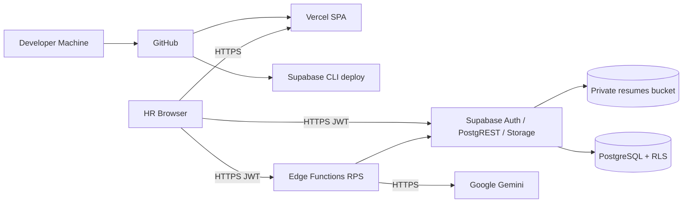
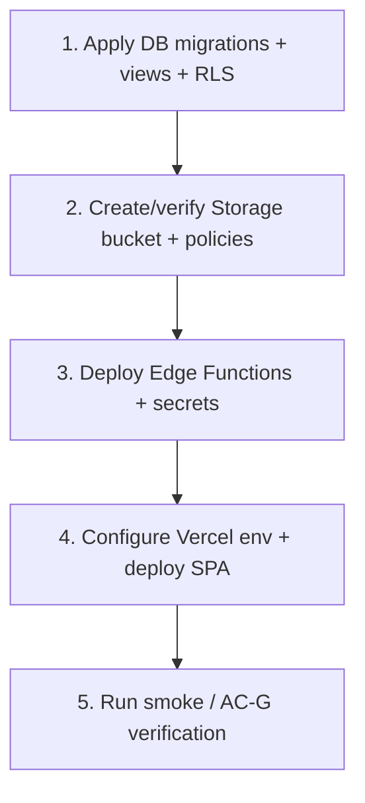
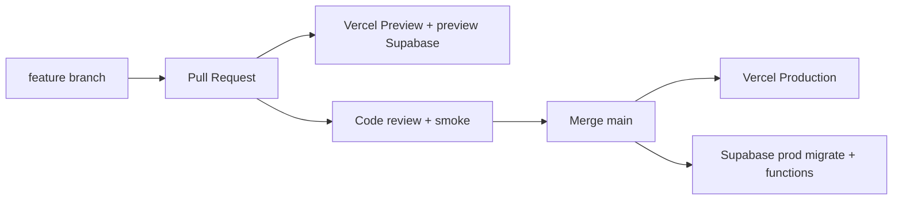

# ResumeRank AI

# Deployment Guide (DG)

**Document 11 — RR-DEP-011**

---

## Cover Page

| | |
| --- | --- |
| **Project Name** | ResumeRank AI |
| **Document Title** | Deployment Guide |
| **Document Number** | Document 11 |
| **Document ID** | RR-DEP-011 |
| **Version** | 1.0.0 |
| **Status** | Baseline — Ready for Implementation Guidance |
| **Classification** | Internal — MBA Final Year Project |
| **Specialization** | Artificial Intelligence & Data Science |
| **Document Type** | Deployment / DevOps Guide |
| **Author** | Vish Var |
| **Role** | Principal DevOps / Platform Architect |
| **Organization** | ResumeRank AI Development Team |
| **Prepared For** | Development, QA, and Academic Evaluation Teams |
| **Date** | 12 July 2026 |
| **Upstream Dependencies** | RR-ARCH-001 v2.0.0; RR-PRD-002 v1.0.0; RR-SRS-003 v1.1.0; RR-SDD-004 v1.1.0; RR-DB-005 v1.1.0; RR-API-006 v1.1.0; RR-UIX-007 v1.1.0; RR-AI-008 v1.0.0; RR-SEC-009 v1.0.0; RR-TEST-010 v1.0.0 |
| **Governing Plan** | Documentation Roadmap (RR-DOC-000) |
| **Next Document** | Cursor Developer Guide (RR-DEV-012) |

---

### Document Control Statement

This Deployment Guide specifies how to provision, configure, deploy, verify, monitor, back up, and roll back ResumeRank AI on the approved stack: React/TypeScript/Vite SPA on **Vercel**, **Supabase** (Auth, PostgreSQL, Storage, Edge Functions), and **Google Gemini**.

It derives entirely from the approved Architecture, PRD, SRS v1.1, SDD v1.1, DDD v1.1, ADS v1.1, UXD v1.1, AID v1.0.0, Security Design v1.0.0, and Testing Document v1.0.0. It does **not** invent new product features, APIs, database entities, or services.

**v1 RPS host decision:** The Resume Processing Service (SDD v1.1) is deployed as **Supabase Edge Functions (Deno)** per ARCH/SRS OE-07, implementing ADS v1.1 contracts (`POST /jobs/{id}/screen`, `POST /candidates/{id}/retry` → **202**). Upload remains sync persist (**201**); ST-02 auto-enqueue is **not** adopted. Gemini secrets stay **only** in Edge Function secrets (BR-05).

---

## Version History

| Version | Date | Author | Description of Change | Review Status |
| --- | --- | --- | --- | --- |
| 0.1.0 | 12 July 2026 | Vish Var | Outline from SDD §11, ARCH §7, SEC secrets, TEST AC-G | Draft |
| 1.0.0 | 12 July 2026 | Vish Var | Complete deployment guide with env inventory, Supabase/Vercel procedures, verification, CI/CD, troubleshooting, Deployment Architecture Review | Current |

---

## Table of Contents

1. [Introduction](#1-introduction)
2. [Deployment Architecture](#2-deployment-architecture)
3. [Infrastructure Requirements](#3-infrastructure-requirements)
4. [Required Accounts](#4-required-accounts)
5. [Repository Structure](#5-repository-structure)
6. [Environment Configuration](#6-environment-configuration)
7. [Supabase Setup](#7-supabase-setup)
8. [Database Deployment](#8-database-deployment)
9. [Edge Function Deployment](#9-edge-function-deployment)
10. [Frontend Deployment](#10-frontend-deployment)
11. [Storage Deployment](#11-storage-deployment)
12. [Security Configuration](#12-security-configuration)
13. [Deployment Verification](#13-deployment-verification)
14. [Monitoring](#14-monitoring)
15. [Backup & Recovery](#15-backup--recovery)
16. [Rollback Strategy](#16-rollback-strategy)
17. [CI/CD Strategy](#17-cicd-strategy)
18. [Troubleshooting Guide](#18-troubleshooting-guide)
19. [Production Checklist](#19-production-checklist)
20. [Conclusion](#20-conclusion)
21. [Deployment Architecture Review](#21-deployment-architecture-review)
22. [Appendices](#22-appendices)

---

## List of Figures

| ID | Title | Section |
| --- | --- | --- |
| F-01 | Deployment architecture | §2.2 |
| F-02 | Release order | §2.3 |
| F-03 | CI/CD branch flow | §17.1 |

---

## List of Tables

| ID | Title | Section |
| --- | --- | --- |
| T-01 | Environment matrix | §2.1 |
| T-02 | Environment variables | §6.2 |
| T-03 | Operational defaults | §6.3 |
| T-04 | Rate-limit defaults | §12.4 |
| T-05 | Smoke verification map | §13.2 |
| T-06 | Production checklist | §19 |

---

## References

| ID | Reference |
| --- | --- |
| REF-01 | RR-DOC-000 Documentation Roadmap |
| REF-02 | RR-ARCH-001 Project Architecture v2.0.0 |
| REF-03 | RR-SDD-004 System Design Document v1.1.0 |
| REF-04 | RR-DB-005 Database Design Document v1.1.0 |
| REF-05 | RR-API-006 API Design Specification v1.1.0 |
| REF-06 | RR-AI-008 AI Design Document v1.0.0 |
| REF-07 | RR-SEC-009 Security Design Document v1.0.0 |
| REF-08 | RR-TEST-010 Testing Document v1.0.0 |
| REF-09 | Supabase, Vercel, Google AI Studio documentation |

---

## 1. Introduction

### 1.1 Purpose

Provide a repeatable, secure deployment baseline so developers can stand up Development, Preview, and Production environments that match the approved architecture and pass AC-G10 smoke verification.

### 1.2 Scope

| In scope | Out of scope |
| --- | --- |
| Account setup, env vars, migrations, Storage, Edge Functions, Vercel | New microservices or message brokers |
| Security hardening steps from RR-SEC-009 | MFA/OAuth product features |
| Smoke verification mapped to RR-TEST-010 | Full CI test automation (future) |
| Backup/rollback for demo/production MBA scale | Enterprise multi-region DR |

### 1.3 Audience

Developers, QA, academic evaluators reproducing the demo, and operators applying migrations/secrets.

### 1.4 Deployment Objectives

1. Ship SPA on Vercel with HTTPS (SRS-NFR-021).  
2. Provision Supabase Auth/DB/Storage with RLS (SRS-NFR-002/004/022).  
3. Deploy RPS as Edge Functions with Gemini secrets server-side only (BR-05).  
4. Preserve ADS workflow: upload **201** → explicit screen **202**.  
5. Pass AC-G01–AC-G10 evidence on preview/production.

### 1.5 Deployment Assumptions

| ID | Assumption |
| --- | --- |
| DA-01 | Separate Supabase projects for preview vs production (preferred) |
| DA-02 | Platform-managed HTTPS and encryption at rest |
| DA-03 | Operator never commits secret values to git |
| DA-04 | Edge Functions are the v1 RPS host; API paths remain ADS contracts |
| DA-05 | Demo scale ≥20 resumes/job; concurrency 2–4 Gemini calls |

---

## 2. Deployment Architecture

### 2.1 Environment Matrix

| Environment | Frontend | Data plane | Processor |
| --- | --- | --- | --- |
| Development | Vite local (`apps/web`) | Local Supabase or shared cloud project | `supabase functions serve` |
| Preview | Vercel Preview | Preview Supabase project | Deployed Edge Functions |
| Production | Vercel Production | Production Supabase project | Deployed Edge Functions |

### 2.2 Architecture Diagram



### 2.3 Release Order



Never deploy frontend against a project missing migrations or Edge secrets.

---

## 3. Infrastructure Requirements

### 3.1 Hardware

| Profile | Minimum | Recommended |
| --- | --- | --- |
| Developer laptop | 8 GB RAM, dual-core, 20 GB free disk | 16 GB RAM, quad-core SSD |
| Demo presenter | Any modern laptop with broadband | Stable ≥10 Mbps down |

Cloud hosts (Vercel/Supabase/Gemini) provide managed capacity for MBA demo scale.

### 3.2 Software Requirements

| Software | Version guidance |
| --- | --- |
| **Node.js** | **20 LTS** (or current Active LTS compatible with Vite) |
| **npm** | **10.x** (ships with Node 20) |
| **Git** | 2.40+ |
| **Supabase CLI** | Latest stable supporting functions + migrations |
| **Cursor IDE** | Current stable (implementation IDE) |
| **Deno** | Bundled/used by Supabase Edge runtime (no separate product service) |
| **OS** | macOS, Linux, or Windows (WSL2 recommended on Windows) |

### 3.3 Browser Support

| Priority | Browsers |
| --- | --- |
| Primary | Latest Chromium (Chrome/Edge) |
| Secondary | Latest Firefox, Safari |
| Viewport | Design primary **1280×720** (UXD/SRS OE-03) |

---

## 4. Required Accounts

| Account | Purpose | Setup process |
| --- | --- | --- |
| **GitHub** | Source control, PR previews | Create/use org or personal repo; protect `main` |
| **Supabase** | Auth, DB, Storage, Edge Functions | Create **two** projects: `resumerank-preview`, `resumerank-prod` (names illustrative) |
| **Google AI Studio** | Gemini API key | Create API key; store only in Edge secrets |
| **Vercel** | SPA hosting | Import GitHub repo; set Project Root `apps/web` if monorepo |

After account creation: enable email/password Auth in Supabase; note Project URL and anon key for SPA; note service-role key for Edge only.

---

## 5. Repository Structure

```text
resume-rank-ai-dev/
├── docs/                                 # Documentation suite
├── apps/web/                             # React + Vite + TypeScript SPA
│   ├── public/
│   ├── src/
│   │   ├── app/                          # routes, providers, AppShell
│   │   ├── modules/                      # auth, jobs, uploads, candidates, ranking, analytics
│   │   ├── components/                   # shadcn wrappers + domain composites
│   │   ├── lib/                          # supabase client, ErrorObject helpers
│   │   ├── types/
│   │   └── styles/
│   ├── package.json
│   └── vite.config.ts
├── supabase/
│   ├── migrations/                       # PostgreSQL schema, indexes, RLS, views
│   ├── functions/
│   │   ├── screen-job/                   # POST /jobs/{job_id}/screen  (ADS)
│   │   ├── retry-candidate/              # POST /candidates/{id}/retry (ADS)
│   │   ├── resume-url/                   # GET signed resume URL (ADS §6.5)
│   │   └── process-queue/                # Internal worker: claim → parse → Gemini → persist
│   ├── seed/                             # optional demo seeds
│   └── config.toml
├── services/resume-processing/           # Shared RPS logic imported by Edge functions
├── packages/shared-types/                # optional shared TS types
├── .env.example                          # names only — no secrets
└── README.md
```

| Path | Role |
| --- | --- |
| `apps/web` | Browser build artifact → Vercel |
| `supabase/migrations` | Authoritative schema deploy |
| `supabase/functions/*` | RPS HTTP + worker entrypoints |
| `services/resume-processing` | Portable RPS modules (prompt, validate, adapters) |
| Build artifacts | `apps/web/dist/` (Vite); Edge bundles via `supabase functions deploy` — **do not commit** |

**Function naming note:** ARCH references `screen-candidates` as the Screening Engine. ADS freezes three public operations plus an internal claim path. This guide deploys **four Edge entrypoints** that together implement that engine without changing API contracts.

---

## 6. Environment Configuration

### 6.1 Rules

- SPA may receive **only** `VITE_*` public values.  
- `GEMINI_API_KEY`, service role, and processor DB credentials **never** go in Vercel public env or client bundles.  
- `.env.example` lists names only (SRS-NFR-019).

### 6.2 Variable Inventory

| Variable | Required | Default | Where set | Purpose | Security |
| --- | --- | --- | --- | --- | --- |
| `VITE_SUPABASE_URL` | Yes | — | Vercel + local `.env` | Supabase project URL | Public |
| `VITE_SUPABASE_ANON_KEY` | Yes | — | Vercel + local `.env` | Browser anon key | Public; RLS enforces AuthZ |
| `SUPABASE_URL` | Yes (Edge) | same project URL | Edge secrets | Server Supabase access | Secret to runtime |
| `SUPABASE_ANON_KEY` | Optional (Edge) | — | Edge secrets | Validate user JWT paths | Prefer JWT from request |
| `SUPABASE_SERVICE_ROLE_KEY` | Yes (Edge worker) | — | Edge secrets **only** | Privileged RPS writes (evals, queue claim) with ownership re-check | **Never** in SPA |
| `GEMINI_API_KEY` | Yes (Edge) | — | Edge secrets | Gemini HTTPS calls | **Never** in SPA |
| `GEMINI_MODEL` | Yes (Edge) | pin per env | Edge secrets/config | Model id written to `model_metadata.model` | Config |
| `UPLOAD_MAX_BYTES` | No | `5242880` (5 MB) | Edge + documented | Enforce VR-11 | Config |
| `AI_MAX_TRANSIENT_RETRIES` | No | `2` | Edge | AID/DDD default | Config |
| `AI_CALL_TIMEOUT_MS` | No | `60000` | Edge | Soft timeout | Config |
| `QUEUE_VISIBILITY_TIMEOUT_MS` | No | `90000` | Edge | Lock visibility | Config |
| `GEMINI_CONCURRENCY` | No | `3` | Edge | Bounded parallel calls | Config |
| `SIGNED_URL_EXPIRES_IN` | No | `300` | Edge resume-url | ADS §6.5 | Config |
| `IDEMPOTENCY_TTL_HOURS` | No | `24` | Edge | ADS §8.8 | Config |
| `POLL_INTERVAL_MS` (docs only) | No | `3000` | SPA constant | UXD/DDD poll | Public constant |

### 6.3 Operational Defaults (Frozen for Deploy)

| Parameter | Value | Source |
| --- | --- | --- |
| Upload max | 5 MB | DDD/ADS |
| Poll | 3s → backoff 10–15s | DDD/UXD |
| AI retries | 2 | DDD/AID |
| Soft timeout | 60s | DDD/AID |
| Queue visibility | 90s | DDD |
| Signed URL TTL | 300s | ADS |
| Gemini concurrency | 2–4 (default 3) | AID |
| Temperature / Top-P / max out | 0.2 / 0.9 / 4096 | AID |

### 6.4 Example `.env.example` (names only)

```bash
# apps/web (public)
VITE_SUPABASE_URL=
VITE_SUPABASE_ANON_KEY=

# supabase/functions (secrets — set via `supabase secrets set`, never commit values)
SUPABASE_URL=
SUPABASE_SERVICE_ROLE_KEY=
GEMINI_API_KEY=
GEMINI_MODEL=
UPLOAD_MAX_BYTES=5242880
AI_MAX_TRANSIENT_RETRIES=2
AI_CALL_TIMEOUT_MS=60000
QUEUE_VISIBILITY_TIMEOUT_MS=90000
GEMINI_CONCURRENCY=3
SIGNED_URL_EXPIRES_IN=300
IDEMPOTENCY_TTL_HOURS=24
```

---

## 7. Supabase Setup

### 7.1 Create Project

1. Create Supabase project (region near demo users).  
2. Record **Project URL**, **anon key**, **service_role key**.  
3. Repeat for preview and production projects.

### 7.2 Authentication

1. Enable **Email** provider (email/password).  
2. Configure password policy (min length/complexity) per SEC SA-05.  
3. Decide email confirmation on/off for demo (if on, document holding UX from UXD Signup).  
4. Confirm Site URL / redirect URLs include Vercel preview + production domains.

### 7.3 Database

Apply migrations from §8 implementing DDD entities, statuses, constraints, indexes, and analytics view contracts.

### 7.4 Storage Bucket

1. Create private bucket named **`resumes`**.  
2. Disable public access.  
3. Apply path convention + policies (§11).

### 7.5 RLS

Enable RLS on all application tables. Translate SEC/DDD conceptual policies into SQL policies (implementation). Verify with cross-user tests (TC-AUTHZ-*).

### 7.6 Edge Functions & Secrets

1. Link CLI: `supabase link --project-ref <ref>`.  
2. Set secrets (§6).  
3. Deploy functions (§9).

### 7.7 Policies, Indexes, Migrations

Owned by `supabase/migrations/` — never hand-edit production schema outside versioned migrations.

---

## 8. Database Deployment

### 8.1 Migration Sequence

Recommended ordered concerns (single or multi-file migrations):

1. Extensions if required  
2. Enums/status check constraints (DDD authoritative statuses)  
3. Tables: `profiles`, `jobs`, `candidates`, `resume_files`, `candidate_profiles`, `evaluations`, `evaluation_history`, `processing_queue`, `audit_logs`, idempotency store  
4. FKs, unique (`evaluations.candidate_id`), partial unique open queue  
5. Indexes: owner job lists, `(job_id, status)`, queue `(queue_status, available_at)`  
6. RLS enable + policies  
7. Analytics views: `job_progress_summary`, `candidate_ranking`, `score_distribution`, `screening_statistics`, `dashboard_metrics`  
8. Grants for `authenticated` / service role as designed  

### 8.2 Commands

```bash
supabase db push                 # linked remote
# or
supabase migration up
```

### 8.3 Verification

| Check | Method |
| --- | --- |
| Tables exist | Supabase Table Editor / `\dt` |
| RLS enabled | Table policies present |
| Views return owner-scoped rows | Query as JWT user A vs B |
| One-active eval constraint | Attempt duplicate insert → fail |

### 8.4 Versioning & Rollback

- Migrations are append-only forward scripts.  
- Down-migrations only with **reviewed** scripts (SDD §11.3).  
- Prefer restore from backup over risky downs in production.

---

## 9. Edge Function Deployment

### 9.1 Entrypoints (RPS host)

| Function | ADS responsibility |
| --- | --- |
| `screen-job` | `POST /jobs/{job_id}/screen` + Idempotency-Key → **202** |
| `retry-candidate` | `POST /candidates/{candidate_id}/retry` + Idempotency-Key → **202** |
| `resume-url` | `GET /candidates/{id}/resume` → signed URL 300s |
| `process-queue` | Internal claim (`FOR UPDATE SKIP LOCKED`) → parse → Gemini → validate → persist |

Public SPA calls only the first three (via Supabase Functions HTTPS or gateway mapping). `process-queue` is invoked by schedule/cron/manual worker trigger — **not** a public SPA route (ADS API-02).

### 9.2 Deployment Process

```bash
supabase secrets set GEMINI_API_KEY=... GEMINI_MODEL=... SUPABASE_SERVICE_ROLE_KEY=... --project-ref <ref>
supabase functions deploy screen-job --project-ref <ref>
supabase functions deploy retry-candidate --project-ref <ref>
supabase functions deploy resume-url --project-ref <ref>
supabase functions deploy process-queue --project-ref <ref>
```

Ensure Deno-compatible bundling for pdf-parse/mammoth adapters (or approved WASM/native approach) **inside** the Edge runtime — do not move Gemini to the browser.

### 9.3 Testing & Verification

| Test | Expect |
| --- | --- |
| Screen without JWT | 401 EH-AUTH |
| Screen eligible uploaded | 202; queue row; status `queued` |
| 202 body | No scores |
| Retry non-`failed_ai` | 409 |
| Worker | Candidate progresses to terminal status |
| Bundle scan | No key leakage in SPA |

### 9.4 Rollback

Redeploy previous function version/commit; keep DB compatible (expand/contract migrations).

---

## 10. Frontend Deployment

### 10.1 Local Build

```bash
cd apps/web
npm ci
npm run build
npm run preview
```

### 10.2 Vercel Deployment

1. Import GitHub repository.  
2. Set **Root Directory** to `apps/web`.  
3. Framework: Vite.  
4. Build command: `npm run build`; output: `dist`.  
5. Set Preview and Production env: `VITE_SUPABASE_URL`, `VITE_SUPABASE_ANON_KEY` (project-specific).  
6. Deploy.

### 10.3 Domain Configuration

| Env | Domain |
| --- | --- |
| Preview | `*.vercel.app` PR URLs |
| Production | Vercel production domain (+ optional custom domain HTTPS) |

Add production URL to Supabase Auth redirect allow-list.

### 10.4 Preview Deployments

Every PR → Vercel Preview. Point preview env at **preview** Supabase project.

### 10.5 Rollback

Vercel → Deployments → Promote previous production deployment. No DB change required for pure SPA rollback.

---

## 11. Storage Deployment

| Step | Action |
| --- | --- |
| Create bucket | Name `resumes`, **private** |
| Folder convention | `resumes/{owner_id}/{job_id}/{candidate_id}/{filename}` |
| Permissions | Owner JWT policies on prefix; deny anonymous list/read |
| Validation | MIME PDF/DOCX; size ≤5 MB enforced in SPA + Edge/upload path |
| Signed URLs | Via `resume-url` function; TTL 300s; refresh in UI |
| Cleanup | Compensation delete on failed DB insert; archive retains objects |

Verification: anonymous list fails; owner signed URL works; foreign user 403 (TC-AUTHZ-005, TC-SEC-002).

---

## 12. Security Configuration

| Control | Deploy action |
| --- | --- |
| JWT | Supabase Auth; all protected routes/APIs require Bearer token |
| RLS | Enabled on all app tables; cross-user tests green |
| Secrets | Edge secrets only for Gemini + service role |
| HTTPS | Vercel + Supabase defaults; refuse HTTP prod |
| Rate limiting | See §12.4 defaults on Auth, upload, screen, retry |
| Service role | Edge worker only; ownership re-check before privileged writes |
| Least privilege | SPA anon key; no service role in client |
| Headers | Use Vercel/framework security header defaults |

### 12.4 Rate-Limit Defaults (Deploy Baseline)

| Surface | Default guidance | Response |
| --- | --- | --- |
| Auth (signin/signup) | 20 req / 10 min / IP | 429 |
| Upload (candidate creates) | 60 files / 10 min / user | 429 |
| `/screen` | 30 req / 10 min / user | 429 |
| `/retry` | 30 req / 10 min / user | 429 |

Implement via Supabase/Edge middleware or platform knobs; SPA handles 429 with backoff (UXD). Adjust only with documented change.

---

## 13. Deployment Verification

### 13.1 Health Checks

| Check | Method |
| --- | --- |
| SPA loads | HTTPS 200 on `/` |
| Auth reachable | Signup/signin |
| DB connectivity | List jobs as authenticated user |
| Storage | Upload PDF → object exists at path |
| Edge | Screen returns 202 |
| Gemini path | Candidate reaches `completed` or controlled `failed_ai` |
| Ranking | Score DESC |
| Analytics | Dashboard metrics match |

### 13.2 Smoke Map (AC-G)

| Gate | Smoke step |
| --- | --- |
| AC-G01 | Signup/in/out; `/jobs` blocked when logged out |
| AC-G02 | Create job with JD |
| AC-G03 | Upload PDF/DOCX; reject TXT |
| AC-G04 | Start Screening → evaluations |
| AC-G05 | Ranking DESC |
| AC-G06 | Detail shows score/rationale/summary |
| AC-G07 | Mixed batch isolation |
| AC-G08 | Dashboard counts |
| AC-G09 | Bundle grep no Gemini/service role; storage not public |
| AC-G10 | Preview/prod URL serves working app |

Also verify: upload does **not** enqueue (TC-UPL-009); 202 has no scores (TC-SCR-002).

---

## 14. Monitoring

| Channel | What to watch |
| --- | --- |
| Supabase logs | Auth failures, PostgREST errors, Storage denials |
| Edge Function logs | EH-AI/PARSE, retries, latency, prompt_version |
| Vercel logs | Build/runtime SPA errors |
| Browser logs | Client ErrorObject toasts (no secrets) |
| DB fields | `candidates.status`, `failure_code`, `failure_message` |
| Metrics | AI success/retry rates (AID §13); platform analytics |

Alerting for v1: manual review of logs before demo (SDD §12). No mandatory PagerDuty.

---

## 15. Backup & Recovery

| Asset | Backup | Recovery |
| --- | --- | --- |
| PostgreSQL | Supabase automatic backups / PITR if plan allows | Restore project or PITR; re-verify RLS |
| Storage | Platform durability; optional periodic export for demo | Reconcile orphans under path convention (DDD §12) |
| Edge code | Git tags | Redeploy tagged commit |
| SPA | Vercel deployment history + Git | Promote prior deployment |

**Restore verification:** Auth login → list jobs → open signed resume → screen one candidate → ranking visible.

---

## 16. Rollback Strategy

| Layer | Action |
| --- | --- |
| Frontend | Promote previous Vercel production deployment |
| Edge | Redeploy previous function artifacts from Git tag |
| Database | Restore backup or carefully apply reviewed down migration |
| Storage | Restore objects from backup; path audit |
| Version | Git tag `vX.Y.Z` marks known-good combo of SPA+functions+migration revision |

**Order for unsafe release:** roll back SPA/functions first; DB only if schema incompatible.

---

## 17. CI/CD Strategy

### 17.1 Branch Flow



| Practice | Design |
| --- | --- |
| Source of truth | GitHub |
| Preview | Vercel Preview on PR |
| Production | Merge to `main` → Vercel Production |
| Supabase | Controlled CLI deploy to matching project (not automatic schema from Vercel) |
| Release tagging | Tag `v1.0.0` after AC-G pass |
| Formal GitHub Actions | Optional future; not required for v1 baseline |

---

## 18. Troubleshooting Guide

| Symptom | Likely cause | Action |
| --- | --- | --- |
| Vercel build fails | Wrong root dir / Node version | Set `apps/web`; Node 20 |
| Blank app / Auth errors | Wrong `VITE_*` project | Match URL/anon to Supabase project |
| JWT failures / 401 | Expired session; bad redirect URLs | Refresh; fix Auth URL allow-list |
| RLS failures / empty data | Policies missing or wrong owner | Re-run policy migration; test as owner |
| Storage upload denied | Bucket public flag / policy | Private bucket; owner policies |
| Upload OK but no screening | Expecting ST-02 | Must call Start Screening (by design) |
| 202 then stuck `queued` | Worker not running / secrets missing | Deploy `process-queue`; check Gemini key |
| Gemini failures | Bad key/model/quota | Verify `GEMINI_API_KEY`/`GEMINI_MODEL`; inspect Edge logs |
| `failed_parse` | Empty/corrupt PDF | Re-upload; OCR out of scope |
| Edge cold-start timeouts | Large batch / timeout | Raise soft timeout carefully; concurrency 2–4 |
| Cross-user data visible | RLS regression | Halt demo; fix policies; retest AUTHZ |

---

## 19. Production Checklist

| # | Item | Done |
| --- | --- | --- |
| 1 | Preview & production Supabase projects created | ☐ |
| 2 | Auth email/password + password policy configured | ☐ |
| 3 | Env vars set (SPA public; Edge secrets) | ☐ |
| 4 | `.env.example` present without secret values | ☐ |
| 5 | Migrations applied (tables, RLS, views, constraints) | ☐ |
| 6 | Storage `resumes` private + path policies | ☐ |
| 7 | Edge functions deployed + secrets verified | ☐ |
| 8 | `GEMINI_MODEL` pinned; key valid | ☐ |
| 9 | Vercel project root `apps/web`; HTTPS OK | ☐ |
| 10 | Auth redirect URLs include prod domain | ☐ |
| 11 | Rate-limit defaults enabled | ☐ |
| 12 | Bundle scan: no Gemini/service role | ☐ |
| 13 | Smoke AC-G01–G10 passed | ☐ |
| 14 | Monitoring channels known (Vercel/Supabase/Edge logs) | ☐ |
| 15 | Backup/restore notes reviewed | ☐ |
| 16 | Git release tag created | ☐ |

---

## 20. Conclusion

ResumeRank AI is deployment-ready on the approved Vercel + Supabase + Gemini stack when this guide’s release order, secrets split, Edge-hosted RPS, and AC-G smoke gates are followed. The guide preserves ADS/DDD/SEC contracts without inventing services and establishes the official operational baseline for Cursor implementation and MBA demonstration.

---

## 21. Deployment Architecture Review

### 21.1 Executive Summary

RR-DEP-011 v1.0.0 closes the ops gaps deferred by SDD/SEC/TEST: env inventory, Edge-as-RPS hosting decision, rate-limit defaults, release order, verification, and rollback. Alignment with architecture is strong. Residual risks are Deno parser packaging complexity and manual Supabase deploys (acceptable for MBA scale).

### 21.2 Severity Counts

| Severity | Count |
| --- | --- |
| Critical | 0 |
| Major | 2 |
| Minor | 3 |
| Observation | 4 |

### 21.3 Issues

| Issue | Severity | Recommendation | Affected Section |
| --- | --- | --- | --- |
| Deno compatibility for pdf-parse/mammoth may need adapters | Major | Spike bundling early; keep parsers inside Edge/RPS only | §9.2 |
| Rate limits are deploy defaults, not platform-enforced until implemented | Major | Implement middleware/platform limits before public demo | §12.4 |
| Four Edge entrypoints vs single ARCH folder name | Minor | Document mapping; optional single gateway function later | §5, §9.1 |
| Manual Supabase migrate (no Actions) | Minor | Checklist discipline; automate later | §17 |
| Idempotency store physical DDL left to migrations | Minor | Include table in migration sequence §8.1 | §8.1 |
| Exact Gemini SKU must be pinned per env | Observation | Set `GEMINI_MODEL` before first prod screen | §6.2 |
| Preview sharing one Supabase project increases risk | Observation | Prefer isolated preview project | §2.1 |
| No PagerDuty | Observation | Accept per SDD for demo | §14 |
| CSP headers rely on defaults | Observation | Revisit if XSS findings appear | §12 |

### 21.4 Scores

| Score | Value |
| --- | --- |
| Deployment Readiness | **8.7 / 10** |
| Security Readiness | **8.6 / 10** |
| Operational Readiness | **8.4 / 10** |
| Maintainability | **8.5 / 10** |

### 21.5 Freeze Recommendation

**Ready to Freeze** as the official deployment baseline, provided:

1. Edge secrets never leak to Vercel `VITE_*`  
2. Migrations precede function/SPA deploy  
3. AC-G01–G10 smoke passes on the target environment  
4. Parser packaging on Deno is proven before demo day  

---

## 22. Appendices

### Appendix A — Environment Variable Reference

See §6.2–§6.4. Quick split:

| Public (Vercel) | Secret (Edge) |
| --- | --- |
| `VITE_SUPABASE_URL` | `SUPABASE_SERVICE_ROLE_KEY` |
| `VITE_SUPABASE_ANON_KEY` | `GEMINI_API_KEY` |
| | `GEMINI_MODEL` |
| | Operational knobs (`UPLOAD_MAX_BYTES`, retries, timeouts, concurrency, signed URL TTL, idempotency TTL) |

### Appendix B — Deployment Commands

```bash
# DB
supabase link --project-ref <ref>
supabase db push

# Secrets
supabase secrets set GEMINI_API_KEY=*** GEMINI_MODEL=*** SUPABASE_SERVICE_ROLE_KEY=*** --project-ref <ref>

# Functions
supabase functions deploy screen-job --project-ref <ref>
supabase functions deploy retry-candidate --project-ref <ref>
supabase functions deploy resume-url --project-ref <ref>
supabase functions deploy process-queue --project-ref <ref>

# Frontend
cd apps/web && npm ci && npm run build
# Vercel: git push / dashboard deploy
```

### Appendix C — Verification Checklist

Mirror §13.2 AC-G01–G10 + ST-02 negative (no enqueue on upload) + bundle secret scan + cross-user deny.

### Appendix D — Rollback Checklist

| Step | Action | Done |
| --- | --- | --- |
| 1 | Identify last good Git tag | ☐ |
| 2 | Promote prior Vercel production deploy | ☐ |
| 3 | Redeploy prior Edge function set | ☐ |
| 4 | If schema break: restore DB backup | ☐ |
| 5 | Reconcile Storage orphans if needed | ☐ |
| 6 | Re-run smoke AC-G01–G03 minimum | ☐ |

### Appendix E — Change Log (v1.0.0)

| ID | Change |
| --- | --- |
| CL-01 | Deployment architecture + release order |
| CL-02 | Full env inventory + operational/rate-limit defaults |
| CL-03 | Supabase/DB/Storage/Edge/Vercel procedures |
| CL-04 | Security, verification, monitoring, backup, rollback, CI/CD |
| CL-05 | Troubleshooting + production checklist |
| CL-06 | Deployment Architecture Review |

### Appendix F — Document Control

| Item | Value |
| --- | --- |
| Path | `docs/04-delivery/11-Deployment-Guide.md` |
| Version | 1.0.0 |
| Upstream | Architecture through Testing Document |
| Next | RR-DEV-012 Cursor Developer Guide |

---

**End of Document — Document 11 — RR-DEP-011 — Deployment Guide v1.0.0**
