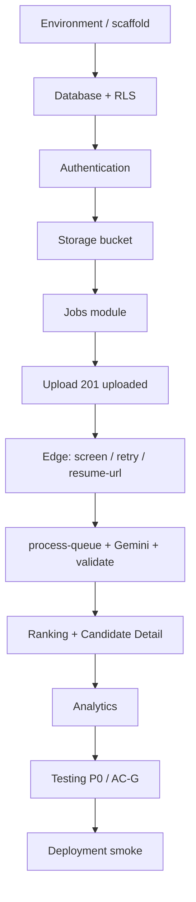
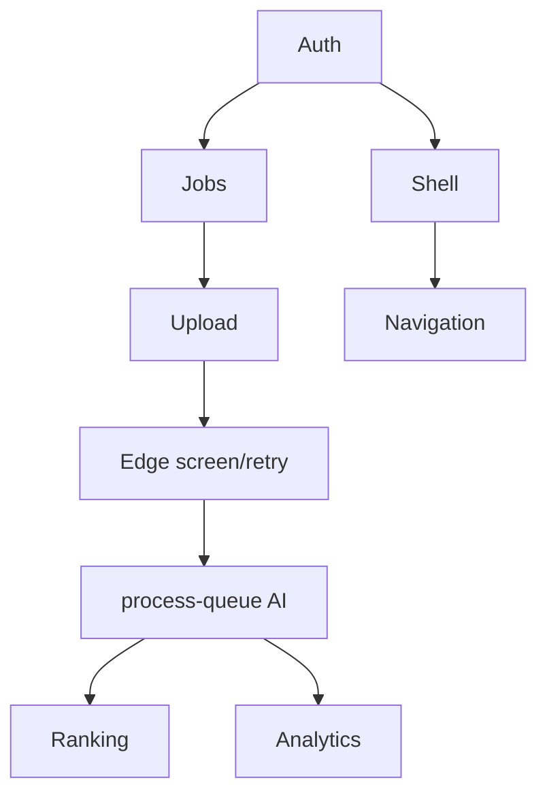
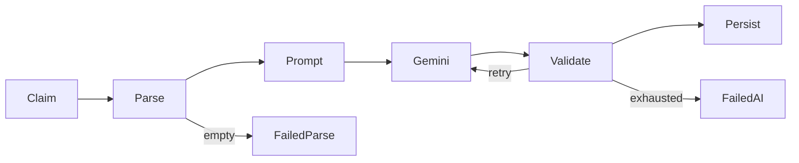

# ResumeRank AI

# Developer Guide (DGD)

## Cursor AI Implementation Guide

**Document 12 — RR-DEV-012**

---

## Cover Page

| | |
| --- | --- |
| **Project Name** | ResumeRank AI |
| **Document Title** | Cursor Developer Guide |
| **Document Number** | Document 12 |
| **Document ID** | RR-DEV-012 |
| **Version** | 1.0.0 |
| **Status** | Baseline — Ready for Implementation |
| **Classification** | Internal — MBA Final Year Project |
| **Specialization** | Artificial Intelligence & Data Science |
| **Document Type** | Implementation Handbook (Cursor AI) |
| **Author** | Vish Var |
| **Role** | Principal Software Architect |
| **Organization** | ResumeRank AI Development Team |
| **Prepared For** | Developers implementing with Cursor Pro |
| **Date** | 12 July 2026 |
| **Upstream Dependencies** | RR-ARCH-001 v2.0.0; RR-PRD-002 v1.0.0; RR-SRS-003 v1.1.0; RR-SDD-004 v1.1.0; RR-DB-005 v1.1.0; RR-API-006 v1.1.0; RR-UIX-007 v1.1.0; RR-AI-008 v1.0.0; RR-SEC-009 v1.0.0; RR-TEST-010 v1.0.0; RR-DEP-011 v1.0.0 |
| **Governing Plan** | Documentation Roadmap (RR-DOC-000) |
| **Next Document** | Final MBA Report (RR-MBA-013) |

---

### Document Control Statement

This Developer Guide is the **official implementation handbook** for building ResumeRank AI with Cursor. It explains **how to implement** the approved system — not how to redesign it.

It derives entirely from Architecture, PRD, SRS v1.1, SDD v1.1, DDD v1.1, ADS v1.1, UXD v1.1, AID v1.0.0, Security Design v1.0.0, Testing Document v1.0.0, and Deployment Guide v1.0.0.

**Hard rules for every Cursor session:**

1. Do **not** invent features, APIs, tables, statuses, or env vars.  
2. Do **not** change BR-01–BR-12.  
3. Upload → **201** `uploaded` (**no enqueue**). Screening → explicit **Start Screening** → **202**.  
4. Gemini + service role **only** in Edge Functions.  
5. When uncertain, open the cited design doc section and follow it.

---

## Version History

| Version | Date | Author | Description of Change | Review Status |
| --- | --- | --- | --- | --- |
| 0.1.0 | 12 July 2026 | Vish Var | Outline from DEP, ARCH waves, ADS/UXD contracts | Draft |
| 1.0.0 | 12 July 2026 | Vish Var | Complete handbook: workflow, phases, 35 Cursor prompts, module/DB/API/Edge/React guides, DoD, Developer Architecture Review | Current |

---

## Table of Contents

1. [Introduction](#1-introduction)
2. [Development Workflow](#2-development-workflow)
3. [Repository Structure](#3-repository-structure)
4. [Coding Standards](#4-coding-standards)
5. [Git Workflow](#5-git-workflow)
6. [Build Order](#6-build-order)
7. [Cursor AI Prompt Strategy](#7-cursor-ai-prompt-strategy)
8. [Module Implementation Guide](#8-module-implementation-guide)
9. [Database Implementation](#9-database-implementation)
10. [API Implementation](#10-api-implementation)
11. [Edge Function Implementation](#11-edge-function-implementation)
12. [React Implementation](#12-react-implementation)
13. [State Management](#13-state-management)
14. [AI Integration](#14-ai-integration)
15. [Security Checklist](#15-security-checklist)
16. [Testing During Development](#16-testing-during-development)
17. [Debugging Guide](#17-debugging-guide)
18. [Performance Tips](#18-performance-tips)
19. [Pre-Deployment Checklist](#19-pre-deployment-checklist)
20. [Cursor AI Best Practices](#20-cursor-ai-best-practices)
21. [Developer Architecture Review](#21-developer-architecture-review)
22. [Appendices](#22-appendices)

---

## List of Figures

| ID | Title | Section |
| --- | --- | --- |
| F-01 | Implementation roadmap | §2.1 |
| F-02 | Module dependency graph | §8.1 |
| F-03 | RPS pipeline (build view) | §11.3 |

---

## List of Tables

| ID | Title | Section |
| --- | --- | --- |
| T-01 | Phase summary | §6 |
| T-02 | Cursor prompt index (CP-01–CP-35) | §7 |
| T-03 | Route → module map | §12.1 |
| T-04 | Definition of Done | Appendix E |

---

## References

| ID | Reference |
| --- | --- |
| REF-01 | RR-ARCH-001 Project Architecture v2.0.0 |
| REF-02 | RR-SRS-003 Software Requirements Specification v1.1.0 |
| REF-03 | RR-SDD-004 System Design Document v1.1.0 |
| REF-04 | RR-DB-005 Database Design Document v1.1.0 |
| REF-05 | RR-API-006 API Design Specification v1.1.0 |
| REF-06 | RR-UIX-007 UI/UX Design Document v1.1.0 |
| REF-07 | RR-AI-008 AI Design Document v1.0.0 |
| REF-08 | RR-SEC-009 Security Design Document v1.0.0 |
| REF-09 | RR-TEST-010 Testing Document v1.0.0 |
| REF-10 | RR-DEP-011 Deployment Guide v1.0.0 |

---

## 1. Introduction

### 1.1 Purpose

Enable a developer (or Cursor agent) to implement ResumeRank AI end-to-end by following phased tasks and copy-paste prompts that map 1:1 to approved design documents.

### 1.2 Audience

Junior/mid engineers using **Cursor Pro**, plus reviewers verifying architecture fidelity.

### 1.3 Scope

| In scope | Out of scope |
| --- | --- |
| HOW to build SPA, migrations, Edge RPS, AI validation, ranking, analytics | Redesigning schema/API/UX |
| Cursor prompt library | Inventing MFA/OAuth/OCR/ST-02 |
| Coding standards + DoD | Formal pen-test |

### 1.4 Implementation Philosophy

1. **Design is law** — code implements docs; docs do not follow code.  
2. **Thin vertical slices** — each phase ships a runnable increment.  
3. **Fail closed** — AuthZ/RLS before features; validation before `completed`.  
4. **Human-in-the-loop** — AI evaluates alignment; never hires/rejects (BR-02).  
5. **Traceability** — every PR cites SRS-FR / ADS § / UXD screen.

### 1.5 Coding Principles

Clean Architecture boundaries (UI → services → Supabase/Edge) · SOLID adapters for parsers/Gemini · TypeScript strict · ErrorObject normalization · No secrets in client · Prefer composition over god components.

---

## 2. Development Workflow

### 2.1 Recommended Order



**Never** reverse: do not build ranking UI before evaluations exist; do not call Gemini from React; do not enqueue on upload.

### 2.2 Daily Loop

1. Pick one phase task from §6.  
2. Open cited design section in Cursor context.  
3. Run matching **CP-xx** prompt (§7).  
4. Verify with §6 completion criteria + security checklist (§15).  
5. Commit small; open PR; smoke.

---

## 3. Repository Structure

### 3.1 Hierarchy (authoritative — RR-DEP-011 §5)

```text
resume-rank-ai-dev/
├── docs/                                 # Approved design suite (read-only for impl)
├── apps/web/                             # React + Vite + TS + Tailwind + shadcn
│   ├── public/
│   ├── src/
│   │   ├── app/                          # router, providers, AppShell
│   │   ├── modules/
│   │   │   ├── auth/
│   │   │   ├── jobs/
│   │   │   ├── uploads/
│   │   │   ├── candidates/
│   │   │   ├── ranking/
│   │   │   └── analytics/
│   │   ├── components/                   # ui/* (shadcn) + domain/*
│   │   ├── lib/                          # supabase.ts, errors.ts, queryClient.ts
│   │   ├── types/
│   │   ├── hooks/
│   │   └── styles/
│   ├── package.json
│   └── vite.config.ts
├── supabase/
│   ├── migrations/
│   ├── functions/
│   │   ├── screen-job/
│   │   ├── retry-candidate/
│   │   ├── resume-url/
│   │   └── process-queue/
│   ├── seed/
│   └── config.toml
├── services/resume-processing/           # prompt, validate, parse adapters, gemini client
├── packages/shared-types/                # optional shared DTO types
├── .env.example
└── README.md
```

### 3.2 Folder Rules

| Folder | Contains | Must not contain |
| --- | --- | --- |
| `modules/*` | Feature pages, feature hooks, feature API wrappers | Gemini keys, SQL DDL |
| `components/ui` | shadcn primitives | Business rules |
| `components/domain` | RankingTable, ProgressSummary, etc. (UXD §7 names) | Direct Storage writes (prefer modules) |
| `lib` | Shared clients/helpers | UI JSX |
| `supabase/migrations` | Schema/RLS/views only | App secrets |
| `supabase/functions` | Thin HTTP handlers | Large UI logic |
| `services/resume-processing` | Portable RPS core | Browser imports |

### 3.3 Naming & Barrel Exports

- Files: `kebab-case.ts` / `PascalCase.tsx` for components.  
- Hooks: `useX.ts`.  
- Prefer `index.ts` barrels **per module** only (avoid deep root barrels that create cycles).  
- Domain components use UXD catalog names exactly (`FileUpload`, not `UploadZone`).

---

## 4. Coding Standards

| Area | Standard |
| --- | --- |
| TypeScript | `strict: true`; no `any` unless justified at boundary; prefer `unknown` + narrow |
| React | Function components; React Router for routes; TanStack Query for server state |
| Naming | `match_score`, statuses exactly as DDD/ADS (`uploaded`, not `pending` in DB) |
| Imports | Absolute `@/` alias for `apps/web/src`; group: external → internal → styles |
| Errors | Normalize to ADS ErrorObject `{ error: { code, message, details?, failure_code?, request_id?, retryable? } }` |
| Logging | Client: safe messages; Edge: ids + EH codes + timings — **no raw resumes/PII dumps** |
| Comments | Why/constraint citations (`// ADS §8.2 — no scores in 202`), not narrating code |
| Formatting | Prettier + ESLint; Tailwind utility classes; shadcn patterns |

---

## 5. Git Workflow

| Practice | Rule |
| --- | --- |
| Branches | `main` protected; feature `cursor/<short-name>-xxxx` or `feat/<area>` |
| Commits | Imperative, scoped: `feat(jobs): create job form` |
| PRs | One phase slice; cite docs (e.g. “Implements ADS §5 + UXD §6.4”) |
| Merge | Squash or merge per team; require green smoke for AuthZ/upload/screen |
| Tags | `v1.0.0` after AC-G01–10 on production |

---

## 6. Build Order

### Phase summary

| Phase | Name | Depends on |
| --- | --- | --- |
| 1 | Project setup | — |
| 2 | Supabase project link | 1 |
| 3 | Database | 2 |
| 4 | Authentication | 3 |
| 5 | Storage | 3 |
| 6 | Jobs | 4 |
| 7 | Upload | 5, 6 |
| 8 | Edge Functions (screen/retry/resume) | 3, 6 |
| 9 | AI Integration (worker) | 7, 8 |
| 10 | Ranking | 9 |
| 11 | Analytics | 9 |
| 12 | Testing | 10–11 |
| 13 | Deployment | 12 |

### Phase 1 — Project setup

| | |
| --- | --- |
| **Objectives** | Vite React-TS app under `apps/web`; Tailwind; shadcn; React Router; TanStack Query; path alias |
| **Files** | `apps/web/*`, root README pointers, `.env.example` names |
| **Dependencies** | Node 20, npm 10 |
| **Deliverables** | App boots locally |
| **Completion** | `npm run build` succeeds; empty shell renders |

### Phase 2 — Supabase

| | |
| --- | --- |
| **Objectives** | Create/link project; Auth email/password; CLI linked |
| **Files** | `supabase/config.toml`, local env |
| **Dependencies** | Phase 1; Supabase account (DEP §4) |
| **Deliverables** | Project URL + anon key in local `.env` |
| **Completion** | CLI `supabase status` / dashboard reachable |

### Phase 3 — Database

| | |
| --- | --- |
| **Objectives** | Migrations for all DDD tables, constraints, RLS, analytics views, idempotency store |
| **Files** | `supabase/migrations/*.sql` |
| **Dependencies** | Phase 2; DDD v1.1; DEP §8 |
| **Deliverables** | `supabase db push` applied |
| **Completion** | Tables+RLS+views verified; cross-user empty for foreign owner |

### Phase 4 — Authentication

| | |
| --- | --- |
| **Objectives** | Login/Signup/Logout; AppShell guard; token refresh |
| **Files** | `modules/auth/*`, routes `/login` `/signup` |
| **Dependencies** | Phase 3; ADS §4; UXD §6.1–6.2 |
| **Deliverables** | AC-G01 behavior |
| **Completion** | Protected `/jobs` redirects when logged out; session works |

### Phase 5 — Storage

| | |
| --- | --- |
| **Objectives** | Private `resumes` bucket + policies; path helper |
| **Files** | Storage policies in migrations; `lib/storagePaths.ts` |
| **Dependencies** | Phase 3; DEP §11 |
| **Deliverables** | Owner can upload object; anon list denied |
| **Completion** | Path `resumes/{owner}/{job}/{candidate}/{file}` |

### Phase 6 — Jobs

| | |
| --- | --- |
| **Objectives** | Create/list/edit/archive/delete-empty; Job Details shell + tabs |
| **Files** | `modules/jobs/*`; routes per UXD §6.0 |
| **Dependencies** | Phase 4; ADS §5 |
| **Deliverables** | AC-G02 |
| **Completion** | JD persisted; archived blocks mutations |

### Phase 7 — Upload

| | |
| --- | --- |
| **Objectives** | PDF/DOCX upload → candidate `uploaded` + `resume_files`; batch results; **no queue** |
| **Files** | `modules/uploads/*`; FileUpload component |
| **Dependencies** | Phases 5–6; ADS §6; UXD §6.8 |
| **Deliverables** | AC-G03; TC-UPL-009 pass |
| **Completion** | 201 path; TXT rejected; compensation on DB fail |

### Phase 8 — Edge Functions (commands)

| | |
| --- | --- |
| **Objectives** | `screen-job`, `retry-candidate`, `resume-url` with JWT + Idempotency-Key |
| **Files** | `supabase/functions/screen-job|retry-candidate|resume-url` |
| **Dependencies** | Phases 3, 6–7; ADS §8; DEP §9 |
| **Deliverables** | 202 Accepted; signed URL 300s |
| **Completion** | TC-SCR-001–006; no scores in 202 |

### Phase 9 — AI Integration

| | |
| --- | --- |
| **Objectives** | `process-queue` worker: parse → prompt → Gemini → validate → persist CE + evaluation |
| **Files** | `supabase/functions/process-queue`; `services/resume-processing/*` |
| **Dependencies** | Phase 8; AID §§3–10 |
| **Deliverables** | AC-G04/G06; `failed_parse`/`failed_ai` paths |
| **Completion** | Schema gates; BR-05; history on overwrite |

### Phase 10 — Ranking

| | |
| --- | --- |
| **Objectives** | RankingTable; poll; detail panels; Retry UI for `failed_ai` |
| **Files** | `modules/ranking/*`, `modules/candidates/*` |
| **Dependencies** | Phase 9; UXD §5.4, §6.10–6.11; ADS §7.5 |
| **Deliverables** | AC-G05–G07 |
| **Completion** | Score DESC; nulls for non-completed; poll stops at terminal |

### Phase 11 — Analytics

| | |
| --- | --- |
| **Objectives** | Dashboard metrics; job progress; optional distributions |
| **Files** | `modules/analytics/*` |
| **Dependencies** | Views from Phase 3; ADS §9; UXD §6.3 |
| **Deliverables** | AC-G08 |
| **Completion** | Counts match DB for owner |

### Phase 12 — Testing

| | |
| --- | --- |
| **Objectives** | Execute P0 cases from RR-TEST-010; fix blockers |
| **Files** | Test notes / checklists in PR |
| **Dependencies** | Phases 4–11 |
| **Deliverables** | P0 100% pass; AUTHZ suite green |
| **Completion** | Ready for deploy smoke |

### Phase 13 — Deployment

| | |
| --- | --- |
| **Objectives** | Follow RR-DEP-011 release order; Vercel + secrets; AC-G10 |
| **Files** | Env on Vercel; Edge secrets |
| **Dependencies** | Phase 12 |
| **Deliverables** | Preview/prod working app |
| **Completion** | DEP §19 checklist complete |

---

## 7. Cursor AI Prompt Strategy

### 7.1 How to use prompts

1. Attach/open the cited doc section in context.  
2. Paste **Prompt**.  
3. Review **Expected output**.  
4. Run **Verification**.  
5. If wrong, paste **Retry prompt** with the specific failure.

### 7.2 Prompt Library (CP-01 … CP-35)

#### CP-01 — Scaffold Vite app

| | |
| --- | --- |
| **Prompt** | Create `apps/web` as Vite React TypeScript app with Tailwind, path alias `@/`, React Router, and TanStack Query provider. Do not add Gemini client code. Follow RR-DEP-011 §5 folder layout for `src/app`, `modules`, `components`, `lib`, `types`. |
| **Expected** | Runnable SPA skeleton matching folder map |
| **Verification** | `npm run build` in `apps/web` |
| **Common mistakes** | Putting app at repo root; adding service role to Vite env |
| **Retry** | Move SPA exclusively under `apps/web` and remove any `GEMINI_*` from client env |

#### CP-02 — shadcn + AppShell

| | |
| --- | --- |
| **Prompt** | Initialize shadcn/ui and implement `AppShell`, `Sidebar`, `TopNavigation`, `PageHeader` per UXD §7. Protected layout only. No business pages yet. |
| **Expected** | Layout with landmarks; outlet for children |
| **Verification** | Shell renders; sidebar links placeholder |
| **Common mistakes** | Cards-heavy dashboard chrome in shell |
| **Retry** | Keep shell minimal; match UXD component names exactly |

#### CP-03 — Env example

| | |
| --- | --- |
| **Prompt** | Create root `.env.example` from RR-DEP-011 §6.4 with names only (no secret values). Split public `VITE_*` vs Edge secrets. |
| **Expected** | Names-only env template |
| **Verification** | No real keys; includes `GEMINI_API_KEY` under Edge section |
| **Common mistakes** | Committing real keys |
| **Retry** | Strip all values; keep keys listed in DEP §6.2 |

#### CP-04 — Supabase client

| | |
| --- | --- |
| **Prompt** | Implement `apps/web/src/lib/supabase.ts` using `VITE_SUPABASE_URL` and `VITE_SUPABASE_ANON_KEY` only. Add typed helper notes. Never import service role. |
| **Expected** | Browser Supabase client |
| **Verification** | Bundle contains only anon key usage |
| **Common mistakes** | Service role in client |
| **Retry** | Delete service role imports; use anon + user session only |

#### CP-05 — ErrorObject helper

| | |
| --- | --- |
| **Prompt** | Implement ErrorObject normalization per ADS §10.1 and EH codes. Map vendor errors to `{ error: { code, message, details, failure_code, request_id, retryable } }`. |
| **Expected** | `lib/errors.ts` used by modules |
| **Verification** | Unit-parse sample 401 → EH-AUTH |
| **Common mistakes** | Leaking stack traces to UI |
| **Retry** | Ensure UI only shows safe `message` |

#### CP-06 — Migrations core tables

| | |
| --- | --- |
| **Prompt** | Write Supabase SQL migrations for DDD entities: profiles, jobs, candidates, resume_files, candidate_profiles, evaluations, evaluation_history, processing_queue, audit_logs, plus idempotency store. Use authoritative statuses from DDD/ADS (`uploaded`, `queued`, …). Enforce one active evaluation per candidate and one open queue row. Do not invent columns beyond DDD. |
| **Expected** | Ordered migration files |
| **Verification** | `supabase db push`; constraints reject duplicates |
| **Common mistakes** | Using SRS coarse `pending` as DB enum |
| **Retry** | Replace status enum with DDD authoritative set |

#### CP-07 — RLS policies

| | |
| --- | --- |
| **Prompt** | Enable RLS on all app tables using RR-SEC-009 §5 conceptual policies: owner via `jobs.owner_user_id = auth.uid()`; children through job ownership. SPA must not update evaluations or claim queue. |
| **Expected** | Policy SQL in migrations |
| **Verification** | User B cannot SELECT User A jobs/candidates |
| **Common mistakes** | Permissive `true` policies |
| **Retry** | Tighten to owner-chain joins only |

#### CP-08 — Analytics views

| | |
| --- | --- |
| **Prompt** | Create SQL views matching ADS §9 / DDD §10.6 contracts: job_progress_summary, candidate_ranking, score_distribution, screening_statistics, dashboard_metrics. Ranking order: completed by match_score DESC per ADS §7.5. |
| **Expected** | Views deployable and owner-scoped |
| **Verification** | Query as two users; no cross-leak |
| **Common mistakes** | Client-side re-sort breaking order |
| **Retry** | Encode ADS ordering in the view |

#### CP-09 — Auth pages

| | |
| --- | --- |
| **Prompt** | Implement `/login` and `/signup` per UXD §6.1–6.2 and ADS §4. Include validation from UXD §8.1/§8.1a. On success go to `/dashboard`. Link between pages. |
| **Expected** | Working auth forms |
| **Verification** | AC-G01 signup/signin |
| **Common mistakes** | Custom password DB table |
| **Retry** | Use Supabase Auth only |

#### CP-10 — Route guards + refresh

| | |
| --- | --- |
| **Prompt** | Protect all routes except login/signup. Implement AppShell session refresh before 401 fail per UXD §14.6. On 401 during poll, stop poll and redirect login (UXD §5.4.6). |
| **Expected** | Guarded router; refresh helper |
| **Verification** | Logged-out `/jobs` redirects |
| **Common mistakes** | Infinite refresh loops |
| **Retry** | Single refresh attempt then login redirect |

#### CP-11 — Jobs CRUD UI

| | |
| --- | --- |
| **Prompt** | Implement Create Job, Job List, Edit Job, Archive, Delete-empty per ADS §5 and UXD §6.4–6.6. Trim title/JD. Archived jobs cannot edit/upload/screen. Delete with candidates returns 409 guidance. |
| **Expected** | Jobs module complete |
| **Verification** | AC-G02; TC-ARC-004 |
| **Common mistakes** | Hard-deleting jobs with candidates |
| **Retry** | Enforce BR-11 archive vs delete |

#### CP-12 — Job Details tabs

| | |
| --- | --- |
| **Prompt** | Implement Job Details workspace at `/jobs/{id}` with query tabs `upload|progress|candidates|analytics` per UXD §6.0. Include Start Screening primary CTA (disabled when ineligible). |
| **Expected** | Tabbed workspace |
| **Verification** | Deep links `?tab=upload` work |
| **Common mistakes** | Separate top-level Upload routes |
| **Retry** | Keep Upload/Progress as Job Details tabs only |

#### CP-13 — Upload module

| | |
| --- | --- |
| **Prompt** | Implement Upload tab: PDF/DOCX only, ≤5MB, batch results mapping ADS `{results:[]}`. Persist Storage + candidates + resume_files with status `uploaded`. **Do not enqueue or call Gemini.** Implement storage compensation if DB insert fails (SDD DD-05). |
| **Expected** | Upload 201 path; UI FileList |
| **Verification** | TC-UPL-009 no queue row; TXT → 422 |
| **Common mistakes** | Auto Start Screening after upload |
| **Retry** | Remove any enqueue on upload; show “Review then Start Screening” |

#### CP-14 — Storage path helper

| | |
| --- | --- |
| **Prompt** | Implement path builder `resumes/{owner_id}/{job_id}/{candidate_id}/{filename}` exactly as DDD/DEP. Use collision-safe object keys while preserving original filename metadata. |
| **Expected** | Shared path utility |
| **Verification** | Object keys match convention |
| **Common mistakes** | Flat public paths |
| **Retry** | Force owner_id = auth.uid() |

#### CP-15 — screen-job function

| | |
| --- | --- |
| **Prompt** | Implement Edge Function `screen-job` for ADS `POST /jobs/{job_id}/screen`. Require JWT + Idempotency-Key. Eligible statuses: `uploaded` or `queued` only. Enqueue processing_queue; set status `queued`; return 202 payload without scores. Replay same key returns same 202; body mismatch → 409. |
| **Expected** | Deployable function |
| **Verification** | TC-SCR-001–005 |
| **Common mistakes** | Including failed_ai in screen eligibility |
| **Retry** | Split eligibility: failed_ai only on retry |

#### CP-16 — retry-candidate function

| | |
| --- | --- |
| **Prompt** | Implement Edge Function `retry-candidate` for ADS `POST /candidates/{id}/retry`. Only `failed_ai`. Same Idempotency-Key rules. 202 shape identical to screen. |
| **Expected** | Retry command |
| **Verification** | TC-RTY-004 completed → 409 |
| **Common mistakes** | Allowing failed_parse retry |
| **Retry** | failed_parse → no retry API (UXD §5.4.5) |

#### CP-17 — resume-url function

| | |
| --- | --- |
| **Prompt** | Implement Edge Function `resume-url` returning signed URL with `expires_in=300` per ADS §6.5. Owner-only; else 403. |
| **Expected** | Signed URL endpoint |
| **Verification** | Foreign user 403; TTL 300 |
| **Common mistakes** | Permanent public URLs |
| **Retry** | Private bucket + short-lived signed URLs only |

#### CP-18 — process-queue worker skeleton

| | |
| --- | --- |
| **Prompt** | Implement `process-queue` Edge worker: claim with FOR UPDATE SKIP LOCKED; transition statuses parsing→parsed→ai_processing; call shared RPS modules; mark queue done/dead. Not callable as a public SPA feature. |
| **Expected** | Worker loop entrypoint |
| **Verification** | Claimed row locks; siblings isolated |
| **Common mistakes** | Exposing claim to anon JWT |
| **Retry** | Service-role worker only + ownership re-check |

#### CP-19 — Parsers

| | |
| --- | --- |
| **Prompt** | Implement PDF (pdf-parse) and DOCX (mammoth) extraction in `services/resume-processing` with normalization per AID §5. Empty/unusable text → `failed_parse` (no Gemini). Handle Deno packaging constraints from DEP. |
| **Expected** | Parse adapters |
| **Verification** | Corrupt PDF → failed_parse; good PDF continues |
| **Common mistakes** | OCR invention |
| **Retry** | Keep OCR out of scope; fail_parse only |

#### CP-20 — Prompt builder

| | |
| --- | --- |
| **Prompt** | Implement prompt assembly per AID §4 with prompt_version `rr-ai-prompt-1.0.0`, untrusted JD/resume delimiters, system/developer/user hierarchy. No tool/function calling. Apply truncation policy AID §4.7. |
| **Expected** | Prompt builder module |
| **Verification** | Injection strings stay inside delimiters |
| **Common mistakes** | Building prompts in React |
| **Retry** | Move all prompt code under services/Edge only |

#### CP-21 — Gemini adapter + schema validate

| | |
| --- | --- |
| **Prompt** | Implement Gemini client using `GEMINI_API_KEY`/`GEMINI_MODEL` with AID §4.6 params. Validate response against schema `rr-ai-response-1.0.0` and gates V-SC-01..03 before persistence. Strip HTML. Max 2 transient retries. On exhausted failure → `failed_ai`; retain prior active eval (DD-08). |
| **Expected** | Adapter + validator |
| **Verification** | Bad JSON never marks completed; metadata has prompt_version |
| **Common mistakes** | Saving invalid scores |
| **Retry** | Enforce V-GATE-01 strictly |

#### CP-22 — Persist profile + evaluation

| | |
| --- | --- |
| **Prompt** | On validated AI success: upsert candidate_profiles CE-01–CE-14; if prior active eval exists write evaluation_history then overwrite evaluations; set status completed; clear failure fields. Map JSON per AID §8.3. |
| **Expected** | Persistence transaction/sequence |
| **Verification** | TC-DB-001/002; FR-051–053 |
| **Common mistakes** | Multiple active evaluations |
| **Retry** | Unique candidate_id on evaluations |

#### CP-23 — SPA Start Screening + poll

| | |
| --- | --- |
| **Prompt** | Wire Start Screening button: Idempotency-Key, double-submit disable, call screen-job, handle 202 optimistic queued, start PollingIndicator per UXD §5.4 (3s, backoff 10–15s, stop on terminal set). Ranking refresh not every tick. |
| **Expected** | Async client model implemented |
| **Verification** | TC-SCR-007–010 |
| **Common mistakes** | Polling ranking every 3s |
| **Retry** | Split status poll vs ranking refresh |

#### CP-24 — Ranking UI

| | |
| --- | --- |
| **Prompt** | Implement RankingTable/RankingRow using candidate_ranking view order. Show StatusBadge; null score as —. Include failed rows. Mobile cards per UXD §12. No hire/reject controls. |
| **Expected** | Ranking tab |
| **Verification** | AC-G05; TC-RNK-001–005 |
| **Common mistakes** | Client re-sorting completed below others |
| **Retry** | Trust server order |

#### CP-25 — Candidate detail

| | |
| --- | --- |
| **Prompt** | Implement Candidate Details with AISummaryPanel, CandidateProfilePanel, ResumePreview (signed URL refresh), Retry Screening only if failed_ai. Plain text only for AI fields. |
| **Expected** | Detail page |
| **Verification** | AC-G06; TC-RTY-003 |
| **Common mistakes** | dangerouslySetInnerHTML for summary |
| **Retry** | Text-only rendering |

#### CP-26 — Analytics dashboard

| | |
| --- | --- |
| **Prompt** | Implement Dashboard StatCards from dashboard_metrics and Job ProgressSummary. Optional charts must include table/text alternatives (UXD §13.4). Owner-scoped only. |
| **Expected** | Dashboard + job analytics tab |
| **Verification** | AC-G08 |
| **Common mistakes** | Global cross-tenant aggregates |
| **Retry** | Filter by auth.uid() ownership |

#### CP-27 — Archive/delete dialogs

| | |
| --- | --- |
| **Prompt** | Implement Archive and Delete confirmation flows per UXD §6.5.1 / §8.7. Wire 409 messaging for non-empty delete. |
| **Expected** | Dialogs + API calls |
| **Verification** | TC-ARC-001–004 |
| **Common mistakes** | Silent delete of jobs with candidates |
| **Retry** | Always surface archive guidance on 409 |

#### CP-28 — Security sweep

| | |
| --- | --- |
| **Prompt** | Audit codebase for BR-05/SEC violations: no Gemini/service role in apps/web; ErrorObject safe; audit_logs payloads without raw PII; cross-user denial tests documented. |
| **Expected** | Checklist PR notes + fixes |
| **Verification** | Bundle grep; TC-AUTHZ suite |
| **Common mistakes** | Logging resume text |
| **Retry** | Redact logs to ids + EH codes |

#### CP-29 — Rate limit hooks

| | |
| --- | --- |
| **Prompt** | Implement Edge rate-limit defaults from DEP §12.4 for Auth-adjacent, upload, screen, retry returning 429 ErrorObject. SPA shows backoff toast per UXD. |
| **Expected** | 429 handling end-to-end |
| **Verification** | Burst screen → 429 |
| **Common mistakes** | Ignoring 429 in poll |
| **Retry** | Pause poll and resume with backoff |

#### CP-30 — Seed demo data

| | |
| --- | --- |
| **Prompt** | Create optional `supabase/seed` for demo users/jobs without real PII from production. Support ≥20 resume fixture paths for NFR-010 manual tests. |
| **Expected** | Seed scripts |
| **Verification** | Local seed runs |
| **Common mistakes** | Seeding service role into client |
| **Retry** | Seeds via CLI only |

#### CP-31 — Unit tests validators

| | |
| --- | --- |
| **Prompt** | Add Vitest unit tests for schema validation gates, status eligibility helpers, and ErrorObject mapping (RR-TEST-010 NFR-020 mockable adapters). |
| **Expected** | Passing unit tests |
| **Verification** | `npm test` |
| **Common mistakes** | Calling live Gemini in unit tests |
| **Retry** | Mock Gemini adapter |

#### CP-32 — Manual P0 script

| | |
| --- | --- |
| **Prompt** | Produce a markdown checklist executing RR-TEST-010 P0 cases TC-AUTH*, TC-AUTHZ*, TC-UPL-009, TC-SCR*, TC-AI-001–012, TC-AC-* against local/preview. |
| **Expected** | Executable QA checklist |
| **Verification** | All P0 marked Pass |
| **Common mistakes** | Skipping ST-02 negative |
| **Retry** | Explicitly include upload-does-not-enqueue |

#### CP-33 — Vercel config

| | |
| --- | --- |
| **Prompt** | Document/configure Vercel root `apps/web`, Node 20, env `VITE_SUPABASE_URL` and `VITE_SUPABASE_ANON_KEY` only, per RR-DEP-011 §10. |
| **Expected** | Deployable frontend settings |
| **Verification** | Preview URL loads HTTPS |
| **Common mistakes** | Setting Gemini on Vercel |
| **Retry** | Remove all secret env from Vercel |

#### CP-34 — Production smoke

| | |
| --- | --- |
| **Prompt** | Run DEP §13.2 / §19 smoke: AC-G01–G10, bundle secret scan, cross-user deny, signed URL, Start Screening happy path. Report gaps only—do not change APIs. |
| **Expected** | Smoke report |
| **Verification** | AC-G10 pass |
| **Common mistakes** | Declaring pass without AUTHZ test |
| **Retry** | Re-run TC-AUTHZ-002–005 |

#### CP-35 — Architecture fidelity review

| | |
| --- | --- |
| **Prompt** | Compare implementation to ADS §6.0 workflow, AID schema, SEC RLS, UXD routes. List deviations. Fix any invented endpoints/fields/statuses. |
| **Expected** | Diff list + corrective PR |
| **Verification** | Zero invented public APIs |
| **Common mistakes** | “Helpful” extra endpoints |
| **Retry** | Delete undocumented endpoints |

---

## 8. Module Implementation Guide

### 8.1 Dependency Graph



### 8.2 Sequence by module

| Module | Implement after | Key contracts |
| --- | --- | --- |
| Shell / Navigation | Scaffold | UXD AppShell routes |
| Authentication | DB+RLS | ADS §4 |
| Jobs | Auth | ADS §5; archive/delete |
| Storage helpers | DB | Path + private bucket |
| Upload | Jobs+Storage | ADS §6; no enqueue |
| Candidates (read) | Upload | ADS §7 list/detail |
| AI commands | Candidates | ADS §8 screen/retry |
| AI worker | Commands | AID pipeline |
| Ranking | Worker | ADS §7.5; UXD §5.4 |
| Analytics | Views | ADS §9 |
| Settings | Auth | Sign out only |

---

## 9. Database Implementation

| Topic | Guidance |
| --- | --- |
| Migration order | DEP §8.1 sequence |
| Verification | Tables, RLS, views, unique constraints |
| Seed data | Optional demo seeds; no production PII |
| Rollback | Reviewed down migrations or project restore (DEP §16) |
| Common errors | Wrong status enum; missing RLS; duplicate active evals |

---

## 10. API Implementation

| Order | Surface |
| --- | --- |
| 1 | Auth |
| 2 | Jobs CRUD/archive/delete |
| 3 | Upload Storage + candidates |
| 4 | Candidates list/detail/poll/ranking |
| 5 | screen / retry / resume-url |
| 6 | Analytics views |

**Testing:** ADS status codes + ErrorObject. **Mocking:** Gemini adapter in unit tests. **Pitfalls:** treating upload as 202; putting scores in 202; ST-02.

---

## 11. Edge Function Implementation

### 11.1 Folder structure

```text
supabase/functions/
  screen-job/index.ts
  retry-candidate/index.ts
  resume-url/index.ts
  process-queue/index.ts
services/resume-processing/
  prompt/
  validate/
  parse/
  gemini/
  persist/
```

### 11.2 Shared utilities

JWT verify · ownership checks · Idempotency store · ErrorObject · logging without PII.

### 11.3 Pipeline



Env vars, retries, queue, validation, logging: follow DEP §6 and AID §§9–10.

---

## 12. React Implementation

### 12.1 Routing map

Implement UXD §6.0 routes exactly (see References). Job tabs via `?tab=`.

### 12.2 Layers

| Layer | Responsibility |
| --- | --- |
| Pages | Compose modules |
| Components | UXD catalog |
| Hooks | TanStack Query wrappers |
| Services | Supabase/Edge fetchers |
| Utilities | paths, errors, idempotency UUID |
| Error boundaries | Route-level safe fallback |

---

## 13. State Management

| Concern | Implementation |
| --- | --- |
| Server state | TanStack Query |
| Caching | Invalidate jobs/candidates on mutations |
| Polling | `refetchInterval` 3s with backoff logic; stop on terminal |
| Retries | Query retries for reads; commands use Idempotency-Key |
| Optimistic | Set accepted ids to `queued` on 202 |
| Loading/Error | LoadingState / ErrorState components |

---

## 14. AI Integration

Follow AID: load prompt version `rr-ai-prompt-1.0.0` · validate schema `rr-ai-response-1.0.0` · retries 2 · no confidence field product · ranking from stored scores only · failures → `failed_ai` / `failed_parse` with safe messages.

---

## 15. Security Checklist

Before merging any feature:

| Check | Pass? |
| --- | --- |
| Auth required on protected routes | ☐ |
| Owner-only reads/writes (RLS + API) | ☐ |
| Storage private; signed URLs only | ☐ |
| JWT validated on Edge commands | ☐ |
| No secrets in `apps/web` or Vercel public env | ☐ |
| Prompt isolation / no tools | ☐ |
| Logs without raw PII | ☐ |
| ErrorObject safe | ☐ |

---

## 16. Testing During Development

| Level | When |
| --- | --- |
| Unit | Validators/adapters each PR |
| Integration | After Edge deploy |
| Manual | Each phase completion criteria |
| API | screen/retry/upload contracts |
| UI | UXD states + a11y smoke |
| Regression | P0 suite before deploy (RR-TEST-010) |

---

## 17. Debugging Guide

Use DEP §18 table as primary diagnosis map. Additional:

| Issue | Fix |
| --- | --- |
| RLS empty lists | Confirm `owner_user_id` set on insert |
| React query stale | Invalidate on 202/terminal |
| Gemini 429 | Backoff; check quota |
| Edge CORS/JWT | Forward Authorization header |
| Vercel wrong API | Ensure SPA points at correct Supabase project |

---

## 18. Performance Tips

| Area | Tip |
| --- | --- |
| React | Route-level code splitting; avoid giant Job Details fetch |
| DB | Use views; select only poll columns |
| Edge | Concurrency 2–4; combined extract+score call |
| Prompts | Truncate per AID; reuse system/developer text |
| Caching | TanStack cache; don’t cache signed URLs past expiry |
| Pagination | Jobs/candidates defaults UXD §8.6 |

---

## 19. Pre-Deployment Checklist

Mirror DEP §19: database, storage, auth, Edge secrets, frontend `VITE_*`, monitoring access, security bundle scan, smoke AC-G01–10.

---

## 20. Cursor AI Best Practices

| Practice | Guidance |
| --- | --- |
| Task size | One CP prompt / one PR slice |
| Context | Attach only the cited doc sections + touched files |
| Avoid overflow | Don’t paste entire docs; cite § references |
| Checkpoints | Commit after each phase completion criterion |
| Verify AI output | Run verification row; search for invented APIs/statuses |
| Review | Diff against ADS/DDD field names |
| Consistency | Re-run CP-35 before release |

---

## 21. Developer Architecture Review

### 21.1 Executive Summary

RR-DEV-012 v1.0.0 converts approved designs into an executable Cursor handbook: phased build order, repo rules, 35 copy-paste prompts, and DoD tied to AC-G. It preserves ADS async workflow and BR-05. Residual risk is Deno parser packaging and developer discipline executing negatives (ST-02, AUTHZ).

### 21.2 Severity Counts

| Severity | Count |
| --- | --- |
| Critical | 0 |
| Major | 2 |
| Minor | 3 |
| Observation | 3 |

### 21.3 Issues

| Issue | Severity | Recommendation | Affected Section |
| --- | --- | --- | --- |
| Deno pdf-parse/mammoth packaging still an impl spike | Major | Complete spike in Phase 9 before demo; document adapter | §6 Phase 9; CP-19 |
| Rate limits require explicit Edge implementation | Major | Execute CP-29 before public preview | CP-29; §15 |
| Prompt library cannot replace reading design docs | Minor | Keep doc citations mandatory in every CP | §7 |
| Optional shared-types package may be unused | Minor | Create only if Edge/SPA share DTOs | §3 |
| Manual P0 checklist still human-driven | Minor | Accept until Playwright future (TEST §19) | §16 |
| Four Edge functions vs ARCH single folder name | Observation | Keep DEP mapping; don’t rename ADS paths | §11 |
| TanStack Query patterns not code-sampled | Observation | Follow §13; add snippets in DEV if needed later | §13 |
| MBA report still pending | Observation | Next RR-MBA-013 | Cover |

### 21.4 Scores

| Score | Value |
| --- | --- |
| Developer Readiness | **8.8 / 10** |
| Cursor AI Readiness | **8.9 / 10** |
| Maintainability | **8.6 / 10** |
| Implementation Completeness | **8.7 / 10** |

### 21.5 Freeze Recommendation

**Ready to Freeze** as the official Cursor implementation handbook, provided implementers treat design docs as authoritative and run AC-G/P0 verification before calling a phase complete.

---

## 22. Appendices

### Appendix A — Folder Structure

See §3.1 (authoritative copy of DEP §5).

### Appendix B — Coding Standards Summary

TypeScript strict · UXD component names · ADS ErrorObject · DDD statuses · no client secrets · cite doc sections in comments for invariants.

### Appendix C — Cursor Prompt Library

CP-01 … CP-35 in §7.2 (35 prompts).

### Appendix D — Implementation Checklist

| Phase | Done |
| --- | --- |
| 1 Setup | ☐ |
| 2 Supabase | ☐ |
| 3 Database/RLS/views | ☐ |
| 4 Auth | ☐ |
| 5 Storage | ☐ |
| 6 Jobs | ☐ |
| 7 Upload (no enqueue) | ☐ |
| 8 Edge commands | ☐ |
| 9 AI worker | ☐ |
| 10 Ranking/detail | ☐ |
| 11 Analytics | ☐ |
| 12 P0 tests | ☐ |
| 13 Deploy smoke | ☐ |

### Appendix E — Definition of Done

A feature/phase is **Done** when:

1. Matches cited ADS/DDD/UXD/AID/SEC behavior (no inventions).  
2. Phase completion criteria in §6 pass.  
3. Security checklist §15 checked.  
4. Relevant RR-TEST-010 cases Pass (P0 always).  
5. For release: **AC-G01–AC-G10** Pass on target environment (DEP §13.2).  
6. PR cites requirements and includes verification notes.

### Appendix F — Change Log (v1.0.0)

| ID | Change |
| --- | --- |
| CL-01 | Workflow, repo, standards, git |
| CL-02 | 13-phase build order |
| CL-03 | 35 Cursor prompts with verify/retry |
| CL-04 | Module/DB/API/Edge/React/state/AI guides |
| CL-05 | Security, testing, debug, performance, pre-deploy, Cursor practices |
| CL-06 | Developer Architecture Review + DoD |

### Appendix G — Document Control

| Item | Value |
| --- | --- |
| Path | `docs/04-delivery/12-Cursor-Developer-Guide.md` |
| Version | 1.0.0 |
| Upstream | Through RR-DEP-011 v1.0.0 |
| Next | RR-MBA-013 Final MBA Report |

---

**End of Document — Document 12 — RR-DEV-012 — Cursor Developer Guide v1.0.0**
